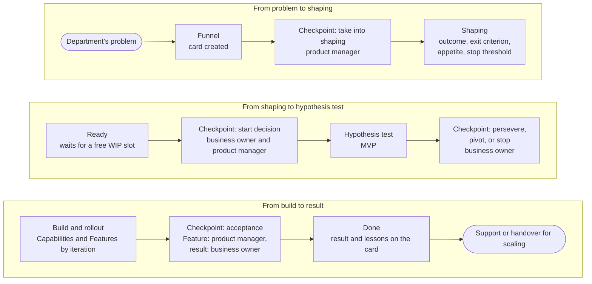

Working through the Hub is a lot like working with consultants: a department comes with a problem, the problem is shaped, the hypothesis is tested on a [[mvp|minimum viable product (MVP)]], and then a solution is built and supported. Progress is visible on the [[project-card|project card]], and decisions are made by the [[business-owner|business owner]] and the [[product-manager|product manager]]: on the spot if the rule is known in advance, or at the forum for their level.

## The path of a task {#path}

The path follows the portfolio states. Decisions are made at checkpoints.

At a checkpoint, you compare against what was written on the card before the start: the [[exit-criterion|exit criterion]], the [[appetite|appetite]], and the [[stop-threshold|stop threshold]]. That's why the question “should we keep going?” is settled by checking against what was agreed, not by argument. An initiative can be deferred or closed in any state: the reason is written on the card so that nobody comes back to the idea blindly. For details, see the page [States and decisions](page:process/portfolio#decisions); a good place to start is the page [How to engage](page:services/how-to-engage).

## Two kinds of work in one portfolio {#two-kinds}

**[[run-rate|Run-rate work]]** is a small recurring request that fits into one [[iteration|iteration]]: a report, a form, an automation, a training session. This work is recorded as a line on the standing card for its area and is taken into work when the [[wip-limit|WIP limit]] allows. It needs neither a start decision nor a business case.

**[[initiative|Initiatives]]** cover everything bigger: a new outcome, a problem with no obvious answer, several teams. An initiative goes through the whole path, with a [[business-case|business case]], a start decision, and investment decisions.

**[[urgent|Urgent work]]** is taken on out of turn, but you note right away what it pushed back, and later the forum looks at whether it could have been foreseen.

The kind of work determines how deep the shaping goes and how many decisions are made along the way, but not the quality requirements. For details, see the page [Classes of service](page:process/portfolio#classes).

## Build and rollout in one rhythm {#rhythm}

Work runs in iterations of about a month; several iterations make up a [[program-increment|program increment]] of about a quarter. At the start of an iteration, the team chooses what it will do; at the end, it shows the result at the review and demo, and the product manager accepts each finished [[feature|Feature]]. The order of work and the dependencies between projects are agreed at the [[program-decision-forum|program decision forum]].

The depth of checks is set by the [[risk-tier|risk tier]]: the more serious the consequences of an error, the deeper the check and the longer a [[human-in-the-loop|human in the loop]] confirms AI's output. A check is not yet acceptance: the business owner accepts the working solution. For details, see the page [Working cycle](page:process/program#cadence).

## After rollout {#after}

When an initiative is done, the project manager records the outcomes and lessons learned on the card, and the business owner notes whether the intended outcome was achieved. The solution stays with the department that uses it; improvements and support run as run-rate work. If many people need the solution, it is handed over to those who will support it at scale; if it's no longer needed, it is retired.

## How to tell that things are on track {#visibility}

Nobody prepares separate reports: progress is visible anyway.

- The **project card** shows what is being done, why, who is responsible, and what stage it's at. It is kept by the [[project-manager|project manager]].
- The **[[decision-log|decision log]]** on the card keeps every decision: what was decided, by whom, and when.
- The **[[product-management-forum|product management forum]]** reviews the funnel and the portfolio every two weeks: what has been waiting too long, what is stuck, and what it's time to start or stop.
- **[Flow measures](page:process/roles#measures)** are calculated from the cards: lead time, the amount of work in progress, and the age of work.
- The **[[practice-checklist|practice checklist]]** in the project profile suggests what is usually checked in this kind of work. Each project compares it with its own rules.
