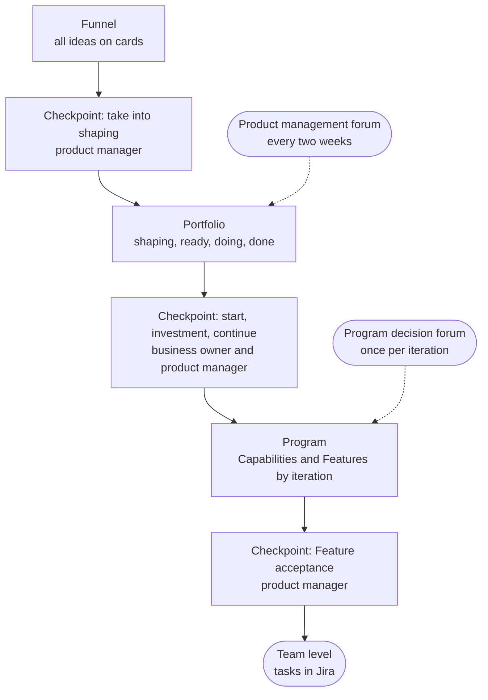

All AI work follows one path, from idea to result. The Hub shows three levels of this path: the [[funnel|funnel]], the [[portfolio|portfolio]] and the [[program|program]]. The fourth, the [[team-level|team level]], is run in Jira. A single [[project-card|project card]] passes through every level, and decisions are made at checkpoints, either on the spot or at the forum of that level.

## Four levels {#levels}

## One card from idea to result {#card}

The card is created in the funnel and stays with the work until it is done: it holds the problem and the intended outcome, the people in the three roles, the conditions for starting and stopping, the current state, the Capability and Feature rows with their Jira keys, and the [[decision-log|decision log]]. The [[project-manager|project manager]] keeps it up to date, and the Hub shows it as it is. There are no separate reports: everything you need to know about the work is on the card and in the summary views of the [Projects](page:projects) section.

## Five rules {#rules}

- **Decisions close to the work.** When the rule is known in advance, the assigned person decides on the spot; the forum is there to see the whole picture and sort out the exceptions.
- **Work is pulled.** New work starts when a place frees up under the [[wip-limit|WIP limit]].
- **Conditions are known before the start.** The [[exit-criterion|exit criterion]], the [[appetite|appetite]] and the [[stop-threshold|stop threshold]] are written on the card in advance.
- **Depth by risk.** The [[risk-tier|risk tier]], not the type of work, sets how deep the checks go.
- **Only what's needed.** We keep only the steps and records that someone actually uses.

## How this section is organized {#map}

<ul class="o-grid card-list cards-compact read-further">
<li class="o-card linked card--compact">
Levels 1–2
<h3><a href="page:process/portfolio">Funnel and portfolio</a></h3>
How to bring an idea, the portfolio Kanban, states, decisions, and classes of service.
</li>
<li class="o-card linked card--compact">
Levels 3–4
<h3><a href="page:process/program">Program</a></h3>
The program board and backlog, the working cycle, and the link to Jira.
</li>
<li class="o-card linked card--compact">
People
<h3><a href="page:process/roles">Roles and forums</a></h3>
Three roles, who decides what, two forums, and flow measures.
</li>
<li class="o-card linked card--compact">
Types of work
<h3><a href="page:process/profiles">Project profiles</a></h3>
How the four types of work usually run and what is usually checked in them.
</li>
</ul>
