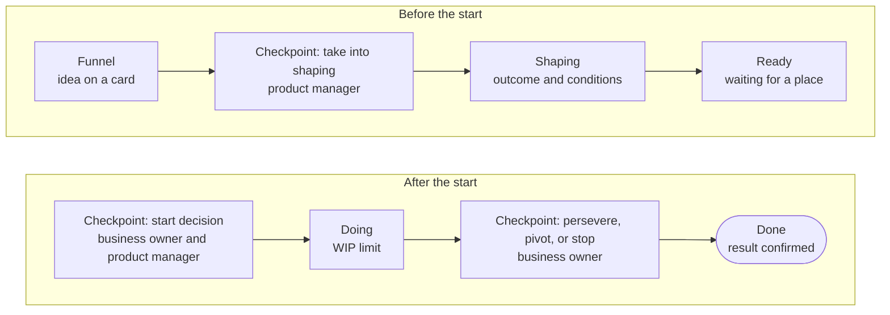

The [[funnel|funnel]] is the entry point: this is where ideas and tasks come in. The [[portfolio|portfolio]] is the choice: from the funnel we take what is worth doing now and see it through to a result. Both levels are shown on one Kanban board.

## How to bring an idea {#idea}

Any employee can bring an idea, and no permission is needed. Create a [project card](page:projects/new) in the “Funnel” state and briefly answer these questions:

- what the problem is and who it will make things easier for;
- how we'll know it worked;
- who could be the [[business-owner|business owner]] (if you don't know, leave it blank).

The [[product-manager|product manager]] reviews the funnel and decides on each card: take it into shaping, defer it with a note on when to come back to it, or close it with a reason. The author gets an answer no later than the next [[product-management-forum|product management forum]].

## Portfolio Kanban {#kanban}

Work moves from left to right. Between the states are checkpoints, where the decision to move on is made.

The live Kanban with real cards is in the <a href="page:projects#portfolio">Projects → Portfolio</a> section.

## Three decisions {#decisions}

| Decision | When | Who | Based on |
| --- | --- | --- | --- |
| [[start-decision|Start decision]] | the initiative is ready and there is a place under the WIP limit | business owner and product manager | the business case and the recorded conditions |
| [[invest-decision|Investment decision]] | after shaping and at every checkpoint | the same roles | the [[appetite|appetite]] |
| [[persevere-pivot-stop|Persevere, pivot, or stop]] | after the hypothesis test and at checkpoints | business owner | the [[exit-criterion|exit criterion]] and the [[stop-threshold|stop threshold]] |

If the conditions are met, the decision is made on the spot and written in the [[decision-log|decision log]] on the card. The forum takes up only what a rule can't settle.

## Portfolio rules {#rules}

- **A one-page business case.** The problem, the intended outcome, how we'll measure it, and what it will take, right on the card.
- **Test the hypothesis first.** An initiative starts with a [[mvp|minimum viable product (MVP)]], and only its results open the way to scaling.
- **Ordering by value is for equals.** If initiatives are equally important, the order is set by weighted shortest job first ([[wsjf]]); the calculation doesn't replace the conversation.

## Classes of service {#classes}

| Class | What it is | How it runs |
| --- | --- | --- |
| [[run-rate|Run-rate work]] | a small recurring request that follows a clear template | a row on a standing card; taken on when there is a place; no start decision needed |
| [[initiative|Initiative]] | a new result that needs a separate choice | goes through the whole Kanban, with start and investment decisions |
| [[urgent|Urgent work]] | can't be put off | jumps the queue; we note right away what got pushed back, and the forum looks at whether it could have been foreseen |

The class sets how deep the shaping goes and how many decisions are needed, but not the quality requirements.
