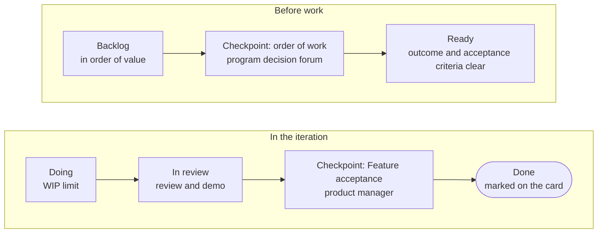

The [[program|program]] is the level where a started initiative turns into a result. It is run by the [[project-manager|project manager]], and the order of work across projects is set by the [[program-decision-forum|program decision forum]].

## What an initiative is made of {#breakdown}

An initiative is broken down into [[capability|Capabilities]]: large parts of the result that can be shown and checked. Each Capability in turn is made up of [[feature|Features]]: finished pieces that the team completes in one [[iteration|iteration]]. On the project card they are recorded as rows with Jira keys.

## Program board {#board}

The live program board is in the <a href="page:projects#program">Projects → Program</a> section.

## Program backlog {#backlog}

The [[backlog|backlog]] is an ordered list of the Capabilities and Features of all started initiatives. The order within an initiative is set by the product manager; the order across initiatives and the dependencies are set by the program decision forum. An item moves to “Ready” when its outcome and [[acceptance-criteria|acceptance criteria]] are clear. A review is not acceptance: the product manager accepts a Feature, and the business owner accepts the working solution.

## Working cycle {#cadence}

| Period | Length | What happens |
| --- | --- | --- |
| [[iteration|Iteration]] | about a month | at the start, Features are chosen; at the end come the review and demo, acceptance, and a short retrospective; the project manager updates the card |
| [[program-increment|Program increment]] | about a quarter | at the start, Capabilities and dependencies are planned; at the end, the business owners decide whether to continue |
| Program decision forum | once per iteration | order of work, dependencies, missed deadlines, out-of-turn requests |

A small project that fits into one iteration needs only a card, a short demo of the result, and a record of the decision.

## Team level and Jira {#jira}

| Hub | Jira |
| --- | --- |
| funnel, portfolio, program | tasks, subtasks, bugs |
| states and decisions on the initiative | day-to-day tracking of the work |
| Capabilities and Features with their state | the details of each Feature |
| flow measures | the team's board |

Each work row on the card carries a Jira key; when the team closes a Feature, the project manager marks it on the card.

## Closing {#closing}

When an initiative is done, the project manager records the results and the lessons learned on the card, and the business owner confirms whether the intended outcome was achieved. Further improvements and support continue as run-rate work.
