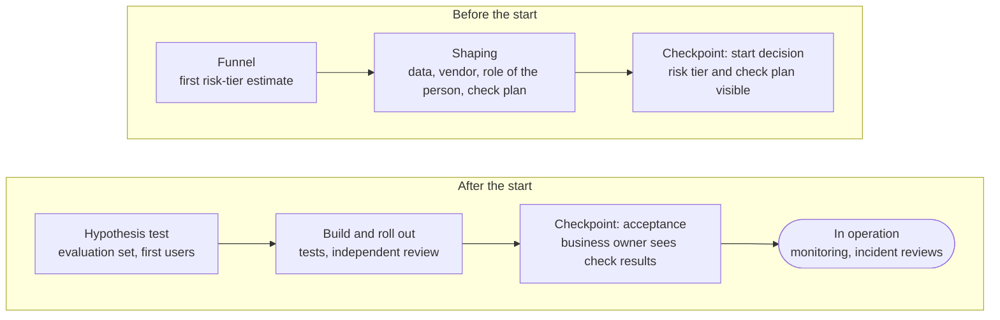

The principles of responsible AI pay off when they become team habits. Checks here are part of the work itself, not a separate stage after it, and the risk tier sets how deep they go. This is good practice, not a rulebook: a project takes from it what fits its risk, and what is usually checked in each kind of work is described in the [project profiles](page:process/profiles).

## Risk tier {#risk-tier}

The first thing to determine for a solution that uses AI is its [[risk-tier|risk tier]]. It is assessed with four questions:

- What data does the solution work with: public, internal, confidential, personal?
- Does the AI influence a decision, and how strongly?
- Does the result reach a customer?
- How autonomous is the solution: does it suggest, act with confirmation, or act on its own?

The solution gets the highest tier that any single answer points to. Large scale, an unfamiliar vendor, and irreversible consequences also raise the tier.

| Tier | What falls here | What it means |
| --- | --- | --- |
| Low | Personal productivity on public data; no customer data; the user checks the result themselves | A short description; [[independent-review|independent review]] by a colleague who didn't take part in building the solution; reassessment when things change |
| Medium | Internal, confidential, or personal data; the result is used in work or reaches a customer after an employee checks it | In addition: review together with risk, security, and legal specialists; an [[evaluation-set|evaluation set]]; a bias check if the result concerns people; logging; the customer can ask for a decision to be reviewed |
| High | AI decides or acts without human review in a regulated process; an [[ai-agent|AI agent]] with permissions in information systems or access to funds; a credit decision about a person | In addition: continuous testing and monitoring with alerts; the ability to stop is built into the solution itself; autonomy is widened step by step, once tests have confirmed the expected behavior |

Each tier includes everything done at the tier below. A change that raises the tier sends the solution back to [[shaping|shaping]] to go through the affected checks again.

## Human in the loop {#human-in-the-loop}

Generative AI works probabilistically, so it almost always needs a person next to it.

- [[human-in-the-loop|Human in the loop]]: an employee reviews every result before it is used. This is how work runs in the low and medium tiers.
- [[human-on-the-loop|Human on the loop]]: a person doesn't confirm every action but watches the system and can stop it. This is possible only in the high tier, and only after full review.

For AI agents, good practice looks like this: they get only the functions, permissions, and autonomy they need; every action is logged; the agent can be stopped through a channel it can't influence; actions are reversible wherever possible. Whoever uses the AI's result in their work or signs it is responsible for it.

## Checks along the path {#path}

Checks accompany the [path of a task](page:hub/how-we-work#path) and get deeper as the solution gets closer to real users.

AI checks aren't a separate stage. The [[product-manager|product manager]] accepts each Feature, the [[business-owner|business owner]] accepts the working solution, and both see on the card which checks have been passed. If the risk tier changes the order of work in the portfolio, it is discussed at the [[product-management-forum|product management forum]], and if the question concerns the whole program, at the [[program-decision-forum|program decision forum]].

## What is usually checked before go-live {#before-go-live}

A short [[practice-checklist|practice checklist]]:

- The risk tier has been assessed with the four questions and recorded on the card.
- The tool is approved for this data class; data with no suitable tool doesn't go into AI at any stage.
- It's clear where the vendor stores data, whether it trains models on it, how to switch to a fallback option, and how to stop using its services.
- There is an evaluation set made of real cases; if the result concerns people, a [[bias|bias]] check has been done; if the solution works with documents from unverified sources, protection against [[prompt-injection|prompt injection]] has been tested.
- The solution has been reviewed by a person who didn't take part in building it, and in the medium and high tiers, together with risk, security, and legal specialists.
- It's clear where the human in the loop is and who can stop the solution.
- The first users know what the solution can and can't do.
- If the result reaches a customer, the customer knows they are dealing with AI and can turn to an employee.
- Monitoring alert thresholds are set up, and everyone knows where to report an incident.

## What to keep on the card {#evidence}

Evidence is kept on the [[project-card|project card]] so that anyone can see what has been done:

- a description of the solution: what it's for, where it shouldn't be used, how it was tested;
- the risk tier and a short rationale;
- the results of the evaluation set and tests, who did the independent review, and what they found;
- vendor details: where the data is stored, cost limits, the fallback option;
- the monitoring alert thresholds;
- incident reviews and what was changed as a result.

## In operation and in an incident {#incident}

Monitoring tracks quality, [[model-drift|drift]], how often people correct or reject the result, incidents, and costs. When a measure reaches its alert threshold, the business owner decides with the team what to do; the easiest place to do this is the review at the end of the [[iteration|iteration]]. A noticeable change to the model, the vendor, the data class, or the level of autonomy is a reason to go through the checks it affects again.

An [[ai-incident|AI incident]] is an event in which AI causes or could cause harm: harm to a customer or an employee, a data leak, an attack, an action by an AI agent beyond its limits, a serious failure. Harm that was prevented is an incident too.

<ol class="flow"><li><strong>Report it</strong> through the usual incident channel and note that it involves AI.</li><li><strong>Stop the harm:</strong> pause the solution or the part of it involved.</li><li><strong>Analyze:</strong> what happened, why, and what will change.</li><li><strong>Apply the lessons:</strong> in the solution, in the evaluation set, in training; reassess the risk tier.</li></ol>

## Everyday habits {#everyday}

- Use the tools meant for your data; don't paste internal documents into external services.
- Check the AI's result before you use it: whoever uses or signs it is responsible for it.
- Give AI only the data the task needs.
- Don't use AI to get around a check or a restriction.

If you have questions about your project, come to us (see [How to engage](page:services/how-to-engage)); if your department needs the full set of checks, see [Governance](page:services/governance).
