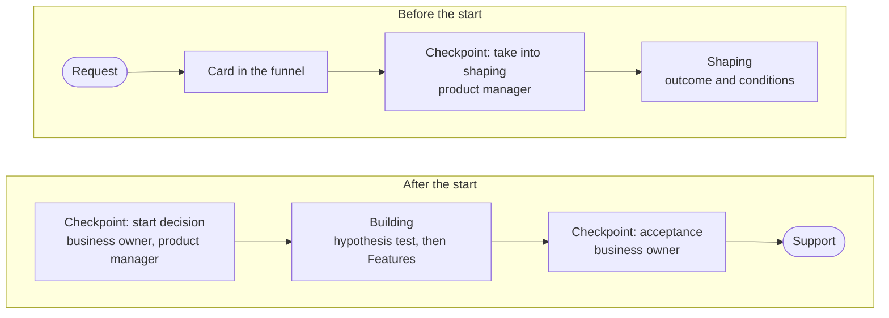

You don't need a special form, your own budget, or a ready plan. Just come with your task, and from there it follows the common [path](page:hub/how-we-work#path).

## What to tell us {#tell}

- What the task is and whose work it will make easier.
- How we'll know it worked.
- How urgent it is and what happens if it isn't done.
- What data and documents will be needed.
- Who in the department could become the [[business-owner|business owner]].

That's enough to create a [card](page:projects/new) in the funnel. You can write to us through the “Contact us” link at the bottom of any page.

## What happens next {#next}

A small recurring request takes the short path: it is recorded as a line on the standing card for its area and done within one [[iteration|iteration]] as [[run-rate|run-rate work]], with no start decision. You get an answer about your idea no later than the next [[product-management-forum|product management forum]]. For details, see the [Process](page:process/portfolio) section.

## Forms of support {#support}

| Form | What happens | When it fits |
| --- | --- | --- |
| Handover without support | the solution is handed over to the department together with the results recorded on the card | an experiment or a simple solution the department runs on its own |
| Support on request | questions and improvements are handled as run-rate work | a solution for one department |
| Handover for scale | the solution is handed over to those who will support it for many departments | the solution has proved itself and many departments need it |

When a solution is no longer needed, it is retired, and the results are recorded on the card.

## What remains after the work {#packages}

What remains are the conclusions recorded on the card, and often a [[reusable-package|reusable package]] too: a method, templates, a toolset, or a software component. Packages go into a shared pool, and the next department gets a similar solution in days rather than months.
