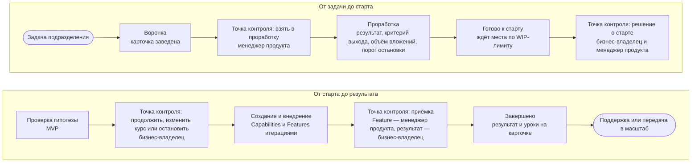

Работа через Хаб похожа на работу консультантов: подразделение приходит с задачей, её прорабатывают, проверяют гипотезу на [[mvp|минимально жизнеспособном продукте]], создают решение и поддерживают его. Ход работы виден на [[project-card|карточке проекта]], а решения принимают [[business-owner|бизнес-владелец]] и [[product-manager|менеджер продукта]]: на месте, если правило известно заранее, или на форуме своего уровня.

## Маршрут задачи {#path}

Маршрут следует состоянию портфеля. Решения принимаются в точках контроля.

В точке контроля сверяются с тем, что записали на карточке до старта: [[exit-criterion|критерий выхода]], [[appetite|допустимый объём вложений]] и [[stop-threshold|порог остановки]]. Поэтому вопрос «продолжать ли» решается сверкой с договорённостью, а не спором. Отложить или закрыть инициативу можно в любом состоянии: причина записывается на карточке, чтобы к идее не возвращались вслепую. Подробнее — на странице [Состояния и решения](page:process/portfolio#decisions); начать можно со страницы [Как обратиться](page:services/how-to-engage).

## Два вида работы в одном портфеле {#two-kinds}

**[[run-rate|Текущая работа]]** — небольшой повторяющийся запрос, который укладывается в одну [[iteration|итерацию]]: отчёт, форма, автоматизация, обучение. Такая работа записывается строкой на постоянной карточке своего направления и берётся в работу, когда это позволяет [[wip-limit|WIP-лимит]]. Ни решения о старте, ни бизнес-кейса для неё не требуется.

**[[initiative|Инициатива]]** — всё, что крупнее: новый результат, неочевидная задача, несколько команд. Она проходит весь маршрут: с [[business-case|бизнес-кейсом]], решением о старте и решениями о вложениях.

**[[urgent|Срочную работу]]** берут вне очереди, но сразу отмечают, что из-за неё сдвинулось, а потом на форуме разбирают, можно ли было её предвидеть.

От вида работы зависят глубина проработки и число решений по пути, но не требования к качеству. Подробнее — на странице [Классы обслуживания](page:process/portfolio#classes).

## Создание и внедрение в едином ритме {#rhythm}

Работа идёт итерациями примерно по месяцу; несколько итераций складываются в [[program-increment|программный инкремент]] длиной около квартала. В начале итерации команда выбирает, что сделает, в конце показывает результат на ревью и демонстрации, и менеджер продукта принимает каждую готовую [[feature|Feature]]. Об очерёдности работ и зависимостях между проектами договариваются на [[program-decision-forum|форуме решений по программе]].

Глубину проверок задаёт [[risk-tier|категория риска]]: чем серьёзнее последствия ошибки, тем глубже проверка и тем дольше результат AI подтверждает [[human-in-the-loop|человек в контуре]]. Проверка — ещё не приёмка: работающее решение принимает бизнес-владелец. Подробнее — на странице [Рабочий цикл](page:process/program#cadence).

## После внедрения {#after}

Когда инициатива завершена, руководитель проекта записывает на карточке итоги и извлечённые уроки, а бизнес-владелец отмечает, достигнут ли ожидаемый результат. Решение остаётся у подразделения, которое им пользуется; доработки и поддержка идут как текущая работа. Если решение нужно многим, его передают тем, кто будет поддерживать его в масштабе; если оно больше не нужно, его выводят из эксплуатации.

## Как понять, что всё идёт как надо {#visibility}

Отдельных отчётов не готовят — ход работы и так виден.

- **Карточка проекта** показывает, что делается, зачем, кто отвечает и на каком этапе. Её ведёт [[project-manager|руководитель проекта]].
- **[[decision-log|Журнал решений]]** на карточке хранит каждое решение: что решили, кто и когда.
- **[[product-management-forum|Форум управления продуктами]]** раз в две недели просматривает воронку и портфель: что ждёт слишком долго, что застряло, что пора начать или остановить.
- **[Показатели потока](page:process/roles#measures)** рассчитываются по карточкам: время от идеи до результата, объём незавершённой работы, возраст работы.
- **[[practice-checklist|Памятка по практике]]** в профиле проекта подсказывает, что в работе такого вида обычно проверяют. Каждый проект сверяет её со своими правилами.
