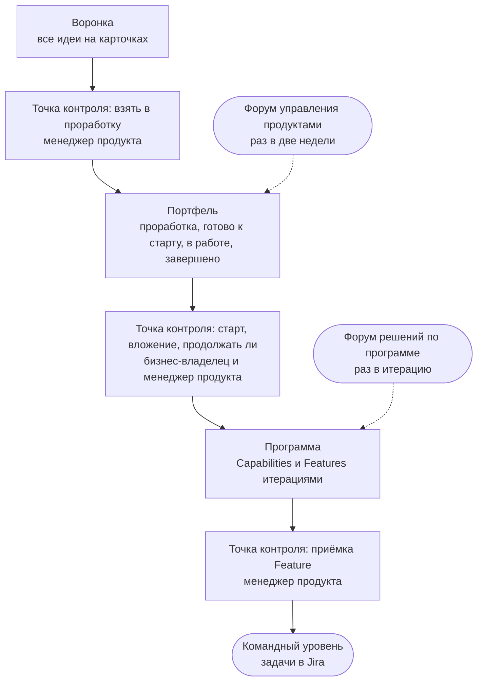

Любая работа с AI проходит один путь — от идеи до результата. Хаб показывает три уровня этого пути: [[funnel|воронку]], [[portfolio|портфель]] и [[program|программу]]. Четвёртый, [[team-level|командный уровень]], ведётся в Jira. Через все уровни проходит одна [[project-card|карточка проекта]], а решения принимают в точках контроля — на месте или на форуме своего уровня.

## Четыре уровня {#levels}

## Одна карточка от идеи до результата {#card}

Карточку заводят в воронке, и она сопровождает работу до завершения: на ней задача и ожидаемый результат, люди в трёх ролях, условия старта и остановки, текущее состояние, строки Capabilities и Features с ключами Jira и [[decision-log|журнал решений]]. Её ведёт [[project-manager|руководитель проекта]], а Хаб показывает её как есть. Отдельных отчётов нет: всё, что нужно знать о работе, видно на карточке и в сводных представлениях раздела [Проекты](page:projects).

## Пять правил {#rules}

- **Решения рядом с работой.** Если правило известно заранее, решает назначенный человек на месте; форум нужен, чтобы увидеть всю картину и разобрать исключения.
- **Работу вытягивают.** Новая работа начинается, когда освобождается место по [[wip-limit|WIP-лимиту]].
- **Условия известны до старта.** [[exit-criterion|Критерий выхода]], [[appetite|допустимый объём вложений]] и [[stop-threshold|порог остановки]] записаны на карточке заранее.
- **Глубина по риску.** Глубину проверок задаёт [[risk-tier|категория риска]], а не вид работы.
- **Только нужное.** Остаются только те шаги и записи, которыми кто-то пользуется.

## Как устроен раздел {#map}

<ul class="o-grid card-list cards-compact read-further">
<li class="o-card linked card--compact">
Уровни 1–2
<h3><a href="page:process/portfolio">Воронка и портфель</a></h3>
Как принести идею, канбан портфеля, состояния, решения и классы обслуживания.
</li>
<li class="o-card linked card--compact">
Уровни 3–4
<h3><a href="page:process/program">Программа</a></h3>
Доска и бэклог программы, рабочий цикл и связь с Jira.
</li>
<li class="o-card linked card--compact">
Люди
<h3><a href="page:process/roles">Роли и форумы</a></h3>
Три роли, кто что решает, два форума и показатели потока.
</li>
<li class="o-card linked card--compact">
Виды работы
<h3><a href="page:process/profiles">Профили проектов</a></h3>
Как обычно устроены четыре вида работы и что в них принято проверять.
</li>
</ul>
