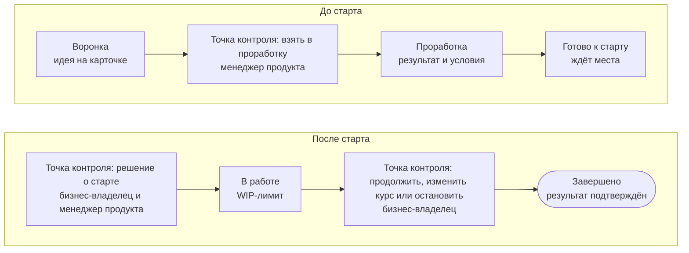

[[funnel|Воронка]] — вход: сюда приносят идеи и задачи. [[portfolio|Портфель]] — выбор: из воронки берут то, за что стоит браться сейчас, и ведут до результата. Оба уровня видны на одном канбане.

## Как принести идею {#idea}

Принести идею может любой сотрудник, никаких разрешений не нужно. Заведите [карточку проекта](page:projects/new) в состоянии «Воронка» и коротко ответьте на вопросы:

- в чём задача и кому станет легче;
- как поймём, что получилось;
- кто мог бы стать [[business-owner|бизнес-владельцем]] (если не знаете — оставьте пустым).

[[product-manager|Менеджер продукта]] разбирает воронку и по каждой карточке решает: взять в проработку, отложить, указав, когда к ней вернуться, или закрыть, указав причину. Ответ автор получает не позже ближайшего [[product-management-forum|форума управления продуктами]].

## Канбан портфеля {#kanban}

Работа движется слева направо. Между состояниями — точки контроля, где принимается решение о переходе.

Действующий канбан с реальными карточками — в разделе <a href="page:projects/portfolio">Проекты → Портфель</a>.

## Три решения {#decisions}

| Решение | Когда | Кто | На что опирается |
| --- | --- | --- | --- |
| [[start-decision|Решение о старте]] | инициатива готова и есть место по WIP-лимиту | бизнес-владелец и менеджер продукта | бизнес-кейс и записанные условия |
| [[invest-decision|Решение о вложении]] | после проработки и в каждой точке контроля | те же роли | [[appetite|допустимый объём вложений]] |
| [[persevere-pivot-stop|Продолжить, изменить курс или остановить]] | после проверки гипотезы и в точках контроля | бизнес-владелец | [[exit-criterion|критерий выхода]] и [[stop-threshold|порог остановки]] |

Если условия выполнены, решение принимают на месте и записывают в [[decision-log|журнал решений]] на карточке. Форум разбирает только то, что правилом не решить.

## Правила портфеля {#rules}

- **Бизнес-кейс на одну страницу.** Задача, ожидаемый результат, как измерим, что потребуется — прямо на карточке.
- **Сначала проверка гипотезы.** Инициатива начинается с [[mvp|минимально жизнеспособного продукта]], и только его итоги открывают дорогу к масштабированию.
- **Очерёдность по ценности — для равных.** Если инициативы одинаково важны, порядок задаёт [[wsjf]]; расчёт не заменяет разговор.

## Классы обслуживания {#classes}

| Класс | Что это | Как идёт |
| --- | --- | --- |
| [[run-rate|Текущая работа]] | небольшой повторяющийся запрос по понятному шаблону | строка на постоянной карточке; берут, когда есть место; решение о старте не нужно |
| [[initiative|Инициатива]] | новый результат, нужен отдельный выбор | проходит весь канбан с решениями о старте и вложении |
| [[urgent|Срочная работа]] | нельзя отложить | вне очереди; сразу отмечают, что сдвинулось, а на форуме разбирают, можно ли было её предвидеть |

От класса зависят глубина проработки и число решений, но не требования к качеству.
