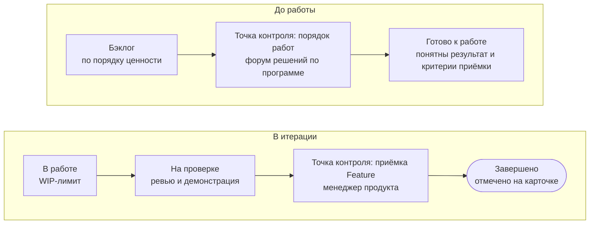

[[program|Программа]] — уровень, на котором начатая инициатива становится результатом. Её ведёт [[project-manager|руководитель проекта]], а порядок работ между проектами решает [[program-decision-forum|форум решений по программе]].

## Из чего состоит инициатива {#breakdown}

Инициатива делится на [[capability|Capabilities]] — крупные части результата, которые можно показать и проверить. Каждая Capability делится на [[feature|Features]] — законченные части, которые команда делает за одну [[iteration|итерацию]]. На карточке проекта они записаны строками с ключами Jira.

## Доска программы {#board}

Живая доска программы — в разделе <a href="page:projects/program">Проекты → Программа</a>.

## Бэклог программы {#backlog}

[[backlog|Бэклог]] — упорядоченный список Capabilities и Features всех начатых инициатив. Порядок внутри инициативы задаёт менеджер продукта; порядок между инициативами и зависимости — форум решений по программе. В «Готово к работе» попадает то, у чего понятны результат и [[acceptance-criteria|критерии приёмки]]. Проверка — ещё не приёмка: Feature принимает менеджер продукта, работающее решение — бизнес-владелец.

## Рабочий цикл {#cadence}

| Отрезок | Длина | Что происходит |
| --- | --- | --- |
| [[iteration|Итерация]] | около месяца | в начале выбирают Features, в конце — ревью и демонстрация, приёмка, короткий разбор; руководитель проекта обновляет карточку |
| [[program-increment|Программный инкремент]] | около квартала | в начале планируют Capabilities и зависимости, в конце бизнес-владельцы решают, продолжать ли |
| Форум решений по программе | раз в итерацию | порядок работ, зависимости, срывы, то, что просят вне очереди |

Малому проекту, который помещается в одну итерацию, хватает карточки, короткого показа результата и записи решения.

## Командный уровень и Jira {#jira}

| Хаб | Jira |
| --- | --- |
| воронка, портфель, программа | задачи, подзадачи, ошибки |
| состояния и решения по инициативе | ежедневное ведение работы |
| Capabilities и Features с состоянием | подробности каждой Feature |
| показатели потока | доска команды |

В строке работы на карточке указан ключ Jira; когда команда закрывает Feature, руководитель проекта отмечает это на карточке.

## Завершение {#closing}

Когда инициатива завершена, руководитель проекта записывает на карточке результат и то, чему научились, а бизнес-владелец подтверждает, достигнут ли ожидаемый результат. Доработки и поддержка дальше идут как текущая работа.
