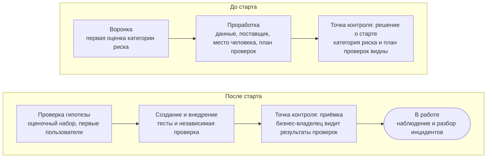

Принципы ответственного AI приносят пользу, когда становятся привычками команды. Проверки здесь — часть самой работы, а не отдельный этап после неё, и их глубину задаёт категория риска. Это хорошая практика, а не набор правил: проект берёт из неё то, что соответствует его риску, а что принято проверять в работе каждого вида, описано в [профилях проектов](page:process/profiles).

## Категория риска {#risk-tier}

Первым делом для решения с AI определяют его [[risk-tier|категорию риска]]. Её оценивают по четырём вопросам:

- С какими данными работает решение: общедоступными, внутренними, конфиденциальными, персональными?
- Влияет ли AI на решение, и насколько сильно?
- Доходит ли результат до клиента?
- Насколько решение автономно: предлагает, действует с подтверждением или действует само?

Решение получает самую высокую категорию, на которую указывает хотя бы один ответ. Повышают категорию также большой масштаб, незнакомый поставщик и необратимые последствия.

| Категория | Что сюда относится | Что это означает |
| --- | --- | --- |
| Низкая | Личная продуктивность на общедоступных данных; данных клиентов нет; результат проверяет сам пользователь | Короткое описание; [[independent-review|независимая проверка]] коллегой, который не участвовал в создании решения; повторная оценка при изменениях |
| Средняя | Внутренние, конфиденциальные или персональные данные; результат используется в работе или доходит до клиента после проверки сотрудником | Дополнительно: проверка вместе со специалистами по рискам, безопасности и правовым вопросам; [[evaluation-set|оценочный набор]]; проверка на предвзятость, если результат касается людей; ведение журналов; клиент может попросить пересмотреть решение |
| Высокая | AI решает или действует без проверки человеком в регулируемом процессе; [[ai-agent|AI-агент]] с правами в информационных системах или доступом к денежным средствам; кредитное решение о человеке | Дополнительно: непрерывное тестирование и мониторинг с оповещениями; возможность остановки заложена в само решение; автономность расширяют постепенно, когда тесты подтвердили ожидаемое поведение |

Каждая следующая категория включает всё, что делают на предыдущей. Изменение, которое повышает категорию, возвращает решение в [[shaping|проработку]], чтобы заново пройти затронутые проверки.

## Человек в контуре {#human-in-the-loop}

Генеративный AI работает вероятностно, поэтому рядом с ним почти всегда нужен человек.

- [[human-in-the-loop|Человек в контуре]]: сотрудник просматривает каждый результат, прежде чем его используют. Так устроена работа в низкой и средней категориях.
- [[human-on-the-loop|Человек над контуром]]: человек не подтверждает каждое действие, но наблюдает за системой и может её остановить. Это возможно только в высокой категории и только после полной проверки.

Для AI-агентов хорошая практика такая: только нужные функции, права и автономность; каждое действие записывается; остановить агента можно по каналу, на который он не влияет; действия по возможности обратимы. За результат AI отвечает тот, кто использует его в работе или подписывает.

## Проверки на маршруте {#path}

Проверки сопровождают [маршрут задачи](page:hub/how-we-work#path) и становятся глубже по мере того, как решение приближается к реальным пользователям.

Проверки AI — не отдельный этап. Каждую Feature принимает [[product-manager|менеджер продукта]], работающее решение — [[business-owner|бизнес-владелец]], и оба видят на карточке, какие проверки пройдены. Если категория риска меняет порядок работ в портфеле, это обсуждают на [[product-management-forum|форуме управления продуктами]], а если вопрос касается всей программы — на [[program-decision-forum|форуме решений по программе]].

## Что обычно проверяют до запуска {#before-go-live}

Короткая [[practice-checklist|памятка по практике]]:

- Категория риска оценена по четырём вопросам и записана на карточке.
- Инструмент допущен для этого класса данных; данные, для которых нет подходящего инструмента, не попадают в AI ни на одном этапе.
- Понятно, где поставщик хранит данные, обучает ли на них модели, как перейти на запасной вариант и как отказаться от его услуг.
- Есть оценочный набор из реальных случаев; если результат касается людей, проведена проверка на [[bias|предвзятость]]; если решение работает с документами из непроверенных источников, проверена защита от [[prompt-injection|промпт-инъекций]].
- Решение проверил человек, который не участвовал в его создании, а в средней и высокой категориях — вместе со специалистами по рискам, безопасности и правовым вопросам.
- Понятно, где человек в контуре и кто может остановить решение.
- Первые пользователи знают, что решение умеет и чего не умеет.
- Если результат доходит до клиента, клиент знает, что с ним работает AI, и может обратиться к сотруднику.
- Настроены сигнальные значения мониторинга, и все знают, куда сообщить об инциденте.

## Что сохранить на карточке {#evidence}

Подтверждения хранят на [[project-card|карточке проекта]], чтобы любой мог понять, что сделано:

- описание решения: для чего оно, где его не стоит применять, как его тестировали;
- категория риска и короткое обоснование;
- результаты оценочного набора и тестов, кто проводил независимую проверку и что обнаружил;
- сведения о поставщике: где хранятся данные, лимиты затрат, запасной вариант;
- сигнальные значения мониторинга;
- разборы инцидентов и что по ним изменили.

## В работе и при инциденте {#incident}

Мониторинг отслеживает качество, [[model-drift|дрейф]], то, как часто люди исправляют или отклоняют результат, инциденты и затраты. Когда показатель доходит до сигнального значения, бизнес-владелец вместе с командой решает, что делать; удобнее всего сделать это на обзоре в конце [[iteration|итерации]]. Заметное изменение модели, поставщика, класса данных или автономности — повод заново пройти проверки, которых оно касается.

[[ai-incident|Инцидент AI]] — событие, при котором AI причиняет или может причинить вред: вред клиенту или сотруднику, утечка данных, атака, действие AI-агента за пределами ограничений, серьёзный сбой. Предотвращённый вред — тоже инцидент.

<ol class="flow"><li><strong>Сообщить</strong> по обычному каналу для инцидентов и отметить, что дело связано с AI.</li><li><strong>Остановить вред:</strong> приостановить решение или его часть.</li><li><strong>Разобрать:</strong> что произошло, почему и что изменится.</li><li><strong>Учесть уроки:</strong> в решении, в оценочном наборе, в обучении; заново оценить категорию риска.</li></ol>

## Привычки на каждый день {#everyday}

- Пользуйтесь инструментами, предназначенными для ваших данных; внутренние документы не вставляйте во внешние сервисы.
- Проверяйте результат AI, прежде чем использовать его: отвечает за него тот, кто его использует или подписывает.
- Давайте AI только те данные, которые нужны для задачи.
- Не используйте AI, чтобы обойти проверку или ограничение.

С вопросами по своему проекту приходите к нам: [как к нам обратиться](page:services/how-to-engage), а если нужен весь контур проверок для подразделения — [Управление и контроль](page:services/governance).
