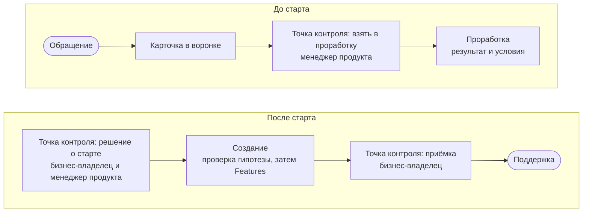

Специальная форма, свой бюджет или готовый план не нужны. Достаточно прийти с задачей — дальше она идёт по общему [маршруту](page:hub/how-we-work#path).

## Что рассказать {#tell}

- Какая задача или потребность и кому станет легче.
- Как поймём, что получилось.
- Насколько это срочно и что будет, если не делать.
- Какие данные и документы понадобятся.
- Кто в подразделении мог бы стать [[business-owner|бизнес-владельцем]].

Этого хватает, чтобы завести [карточку](page:projects/new) в воронке. Написать можно по ссылке «Связаться с нами» внизу любой страницы.

## Что происходит дальше {#next}

Небольшая повторяющаяся просьба идёт короче: она становится строкой на постоянной карточке своего направления и делается за одну [[iteration|итерацию]] как [[run-rate|текущая работа]], без решения о старте. Ответ на идею приходит не позже ближайшего [[product-management-forum|форума управления продуктами]]. Подробнее — в разделе [Процесс](page:process/portfolio).

## Формы поддержки {#support}

| Форма | Что происходит | Когда подходит |
| --- | --- | --- |
| Передача без поддержки | решение передаётся подразделению вместе с итогом на карточке | эксперимент или простое решение, которое подразделение ведёт само |
| Поддержка по запросу | вопросы и доработки идут как текущая работа | решение для одного подразделения |
| Передача в масштаб | решение передают тем, кто будет поддерживать его для многих | решение себя показало и нужно многим |

Когда решение перестаёт быть нужным, его выводят из эксплуатации, а итог записывают на карточке.

## Что остаётся после работы {#packages}

Выводы, записанные на карточке, а часто и [[reusable-package|пакет]]: метод, шаблоны, набор инструментов или программный компонент. Пакеты складываются в общую копилку, и следующее подразделение получает похожее решение за дни, а не за месяцы.
