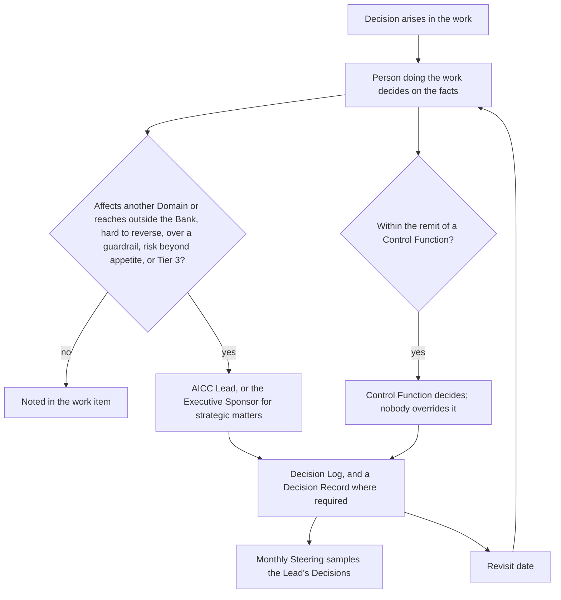
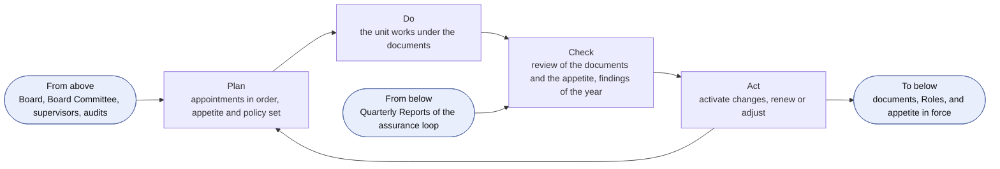
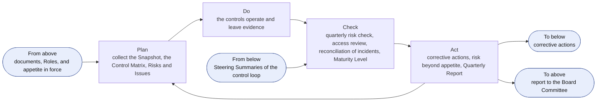
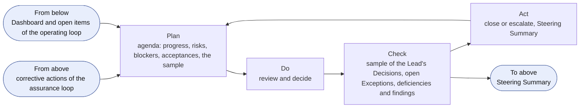
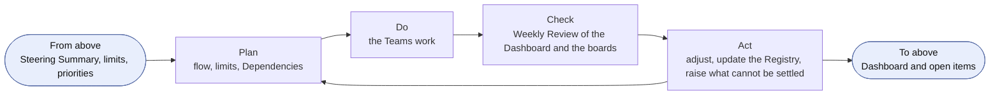
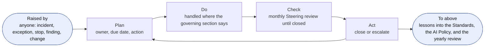
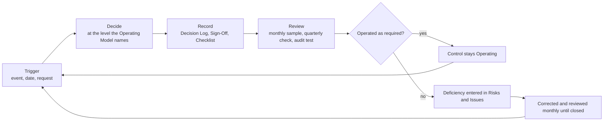
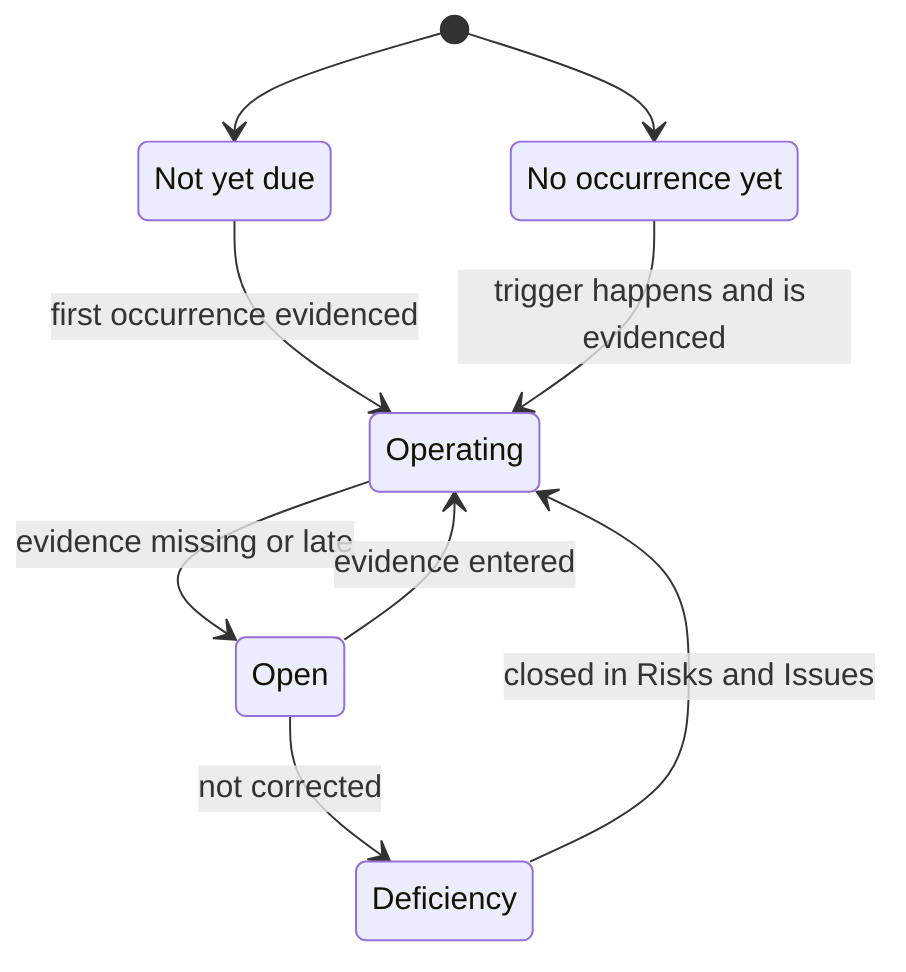

```yaml
id: AICC-ORG-01-EN
title: Operating Model
status: active
revision: 10.8
created: 2026-09-29
revised: 2026-10-01
```

# Operating Model

## 1. Purpose and scope

1.1. This Operating Model states how AICC is governed and controlled as a unit of the Bank: who does what, how Decisions are taken, how the control loop runs, and what is kept on record and tested.

1.2. It applies to AICC and to the Domains and Control Functions of the Bank that work with AICC.

1.3. The Portfolio Management Model states how the Initiatives are taken in, funded, and stopped, and the Solution Lifecycle Model states how the work moves from the Program Backlog to the retirement of a Solution and how it is paced. They work within this Operating Model, and this Operating Model prevails. The workflows of the charter show how the loops run: the engagement, the portfolio and service delivery, the cadence, the collaboration tooling, and the unit governance. They state no rule of their own.

1.4. A figure in this Operating Model illustrates a clause and states no rule of its own. Where a figure and a clause differ, the clause prevails.

## 2. What AICC is

2.1. The Business Model states what AICC is. In this Operating Model AICC is a joint team, led by the AICC Lead and formed of the people whom the functions of the Bank assign to it, who work together with the Domains.

2.2. AICC does not own the AI Platform, the Solutions, or the business results of the Domains. The Domains execute. AICC directs, guides, and may supply Solution Engineers to build and run Solutions.

2.3. AICC is not a Control Function. The Control Functions are independent of it, and keep their own accountability for their remit.

## 3. Principles of work

3.1. AICC works on the following principles.

(a) Decide where the facts are. The person closest to the work decides, on evidence.

(b) Keep decisions reversible where possible, and take reversible decisions quickly.

(c) Deliver at product speed within bank-grade control.

(d) Keep only the process and the records that someone uses, and remove the rest.

(e) Put outcomes before outputs, and collaboration before negotiation. The plan changes and the intent holds.

3.2. AICC shall apply the Values and the Principles of the Statement of Intent.

## 4. Roles

4.1. AICC uses seven Roles. One person may hold several Roles, and a Role may have several Holders, within the rules of separation in section 4.4.

4.2. The following table states each Role and what its Holder does and decides.

| Role | Does | Decides |
| --- | --- | --- |
| Executive Sponsor | Holds the mandate and the funding; appoints the AICC Lead; approves and issues the report to the Board Committee | The Strategic Priorities, the Investment Envelopes, and the Investment Guardrails; the release of a Risk Tier 3 Solution; any risk beyond the AI Risk Appetite Statement; the retirement of an Initiative; the approval of AI output published outside AICC; the acceptance of an item that spans Domains or is enabling work of AICC; the naming of acting Contacts |
| AICC Lead | Leads AICC as its lead engineer and architect; is accountable for this Operating Model and for every document and Record of AICC; prepares the Quarterly Report; presents to the AI Steering Committee | Taking an item into discovery; the issue of a Service Agreement; the approval of Capabilities; the approval of the use of a Solution in AICC for a data class; the Risk Tier, which the AICC Lead tells to the Domain Owner; the suspension of a Solution; standards, architecture, and Templates; questions between Domains; the activation of every document; an Exception to a requirement set by AICC |
| Solution Engineer | Owns a Solution end to end: designs it, decides its architecture, builds it, deploys it, and runs it with the Domains; keeps the work visible; coaches Domain Experts; checks the work of others | How a Solution is designed and built; the approval of Features at Iteration Planning; the order in which the team pulls work within the agreed priorities |
| Domain Owner | Owns the results of AI adoption in the Domain and acts as product owner of its Solutions; names the Domain Expert | Whether the Domain takes part in an Initiative; funding of the Solutions of the Domain; the approval of the use of a Solution in the Domain for a data class, and the approvals that the rules of the Bank require; the acceptance of an item of the Domain; the release of a Risk Tier 1 or 2 Solution, after the check or the validation; the retirement of a Solution |
| Domain Expert | Explains the routine work; works with the Solution Engineer; tries the Solution in real work; then scales adoption and trains colleagues | Nothing on funding, acceptance, or control |
| Control Function Contact | Advises on requirements; may raise the Risk Tier within its remit, and the Contact of model risk alone may lower it; clears a business case that expects Risk Tier 2 or 3; validates Solutions; may suspend or stop a Solution | The clearance of a business case, validation, raising the Risk Tier, a suspension, a stop, and an Exception to a control requirement, each within the remit of the Control Function |
| Platform Owner | Provides and operates the AI Platform, outside AICC, to the requirements in the Standards Record; keeps the evidence, logs, and traces on which the validation relies | The design of the AI Platform within those requirements |

4.3. The team of AICC agrees who takes the Hats that the work needs, such as the keeper of the Program Backlog, the facilitator of the events, or the coach. A Hat is not a Role, changes when the team decides, and needs no appointment.

4.4. The rules of separation are as follows.

(a) No person shall validate or check work that the person built.

(b) The Domain Owner of a Solution accepts it and, for Risk Tier 1 and 2, releases it, and shall not validate it.

(c) A Control Function Contact is not a member of AICC and shall not build Solutions that the Contact reviews.

(d) The AICC Lead may build a Solution, and shall not Check, validate, accept, or release a Solution that the AICC Lead built. The Executive Sponsor accepts and releases it. The AICC Lead shall not validate a Solution within the remit of a Control Function.

(e) A check by a person other than the builder is done by an engineer of the technology function or the Domain whom the AICC Lead names in the Appointments Record, until AICC has a second Solution Engineer.

(f) Internal audit gives assurance only. It shall not validate, release, or stop, and has read access to every Record.

4.5. The AI Steering Committee is the group of the heads of the business, technology, risk, and compliance functions of the Bank. It advises the Executive Sponsor, who chairs it. It is formed of the heads who are named, and a function joins when its head is named. The Board Committee oversees AI for the Board and receives the report of the Executive Sponsor. Neither is a Role.

4.6. The Holders of the Roles are named in the Appointments Record. The Executive Sponsor appoints the AICC Lead. The AICC Lead appoints the Solution Engineers from the people whom the functions assign to AICC, with the consent of their line managers, and names the Checker of a Risk Tier 1 Solution. The head of a Domain names the Domain Owner, and the Domain Owner names the Domain Expert. Each Control Function names its Control Function Contact. The head of technology names the Platform Owner. An appointer shall not appoint themselves to a Role: the next level appoints (5.7). For the work of AICC itself, the AICC Lead is the Domain Owner, except for the acceptance and the release of a Solution that the AICC Lead built (4.4(d)).

4.7. Each Holder shall name a deputy in the Appointments Record, who acts during an absence. The Executive Sponsor may delegate a decision in writing, for a stated scope and period, except a decision under 5.4 and 5.7, and the delegation is entered in the Appointments Record. A delegation of more than two weeks is also entered in the Decision Log.

4.8. An Appointment missing at the activation of this Operating Model shall be made within 60 days, and the Executive Sponsor names acting Holders meanwhile. Every appointment, acting designation, change, and relief shall be entered in the Appointments Record within five working days, with its date and its decision reference.

## 5. Decisions

5.1. A Decision is taken by the person who does the work, on the facts, at the moment it is needed. A Decision states the facts that it rests on, such as a measurement, a test result, a cost, or a source.

5.2. A Decision goes to a higher level only when at least one of the following is true.

(a) It affects another Domain, reaches outside the Bank, or sets a standard for others.

(b) It cannot be reversed without significant cost or harm.

(c) It exceeds an Investment Guardrail or changes a Strategic Priority.

(d) It accepts a risk beyond the AI Risk Appetite Statement, or concerns a Risk Tier 3 Solution.

5.3. The level is stated in the following table. A Decision goes to the level that section 4.2 names for the matter when a condition in 5.2 applies.

| Level | Who decides | Examples |
| --- | --- | --- |
| Team | The Solution Engineer, with the Domain Expert and Domain Owner | Design, build, pulling work |
| AICC Lead | The AICC Lead | Taking an item into discovery, standards, Templates, questions between Domains |
| Executive Sponsor | The Executive Sponsor, after asking the AI Steering Committee | Strategic Priorities, funding, release of a Risk Tier 3 Solution, risks beyond appetite, retirement of an Initiative |

Figure 1 shows how a Decision moves, and how it returns to the Steering as a sample and as a date to revisit.



Figure 1: the movement of a Decision.

5.4. A Control Function decides within its remit, and its validation or stop is final for that remit. Nobody shall override it. A disagreement goes to the head of that Control Function. The Executive Sponsor may raise it with executive management and shall not set a validation or a stop aside. A risk beyond the AI Risk Appetite Statement may be accepted only with a report to the Board Committee. A stop is final. The person who suspended a Solution lifts the suspension when the facts allow.

5.5. Where the people concerned do not agree, the person who holds the decision under 5.3 decides after hearing them. The others then support the Decision. A dissent may be noted in the Decision Log.

5.6. A Decision at the AICC Lead level or above, and any Decision that others will need to find later, shall be entered in the Decision Log as one line: the date, the Decision, the facts, who decided, and when to revisit it. A Decision of the Executive Sponsor that is hard to reverse, and a Decision that section 8 names as evidenced by a Decision Record, also has a Decision Record. A Decision of the Team is noted in the work item.

5.7. A person with a conflict of interest on a Decision shall declare it and shall not decide. The next level decides.

## 6. The control loops

6.1. The control of AICC as a unit runs on five loops. Each is a Plan, Do, Check, Act cycle with its own cadence and forum. A loop takes its frame from the loop above it, and returns its evidence to it. The loops run on the events of the Cadence and add no meeting. The portfolio loops of the Portfolio Management Model 4 run on the same events and govern the Initiatives; these loops govern the unit. The following table states them.

| Loop | Cadence and forum | Decider | Controls it carries | Records |
| --- | --- | --- | --- | --- |
| Direction | Yearly, at the first quarterly Steering of the year | Executive Sponsor; the AICC Lead owns the documents | C-01, C-03, C-04 | Decision Records, Appointments |
| Assurance | Quarterly, at the quarterly Steering | Executive Sponsor | C-06, C-07, C-11, C-16, C-24, C-26, C-27, C-28 | Quarterly Report, Registry Snapshot |
| Control | Monthly, at the monthly Steering | Executive Sponsor; the product owner for an acceptance | C-05, C-17, C-29, C-32 | Steering Summary, Decision Log |
| Operating | Weekly, at the Weekly Review | AICC Lead | None; the Dashboard is a working record | Dashboard |
| Event | When an event happens | As this Operating Model states | C-16, C-17, C-19, C-30, C-31, C-32 | Risks and Issues, Decision Record |

### Meetings and bodies

6.2. A meeting runs with those who are named. While the AI Steering Committee is not formed, the Executive Sponsor decides alone. A record of an event is kept only for the Decisions and the actions, in the Steering Summary for a Steering, and otherwise in the work items and the Decision Log.

6.3. The members of the AI Steering Committee (4.5) are named in the Appointments Record. Its advice, and any dissent, is recorded in the Steering Summary. A head may be represented by a named deputy. If no head of a function attends, the Executive Sponsor may still decide, and the Steering Summary records the absence.

6.4. The Executive Sponsor may take a time-critical Decision between meetings after asking the heads of the risk and compliance functions and recording the answers.

### The direction loop

6.5. The Executive Sponsor shall run the direction loop once a year, at the first quarterly Steering of the year. The plan confirms that the appointments are in order and sets the AI Risk Appetite Statement and the policy. The check reviews the Statement of Intent, the AICC Charter, this Operating Model, the Portfolio Management Model, the Solution Lifecycle Model, the AI Policy, and the AI Risk Appetite Statement, with the findings of the audits and the supervisors of the year. The act activates the changes and renews or adjusts the appointments and the appetite. The Executive Sponsor calls an extra review on a material change in the use of AI, in a principal provider, or in regulation, or after an audit or supervisory finding. The loop sets the documents, the Roles, and the appetite in force for the assurance loop. The Strategic Priorities, the Envelopes, and the Guardrails are set at the same Steering, in the strategic loop of the Portfolio Management Model.



Figure 2: the direction loop.

In practice, the AICC Lead checks the documents and brings the changes and the findings of the year to the first quarterly Steering. The Executive Sponsor decides, and each activation and each decision on the appetite is entered in the Decision Log.

### The assurance loop

6.6. The Executive Sponsor shall run the assurance loop each quarter, at the quarterly Steering. The plan collects the evidence: the Registry Snapshot, the Control Matrix, and the Risks and Issues. The check is the quarterly risk check, which reviews the open Risks and Issues, the open Exceptions, the Risk Tier reassessments that are due, and the reliance on providers and on the Platform Owner. It also takes the access review of the Registry and the tools (7.6), reconciles the AI Incidents with the incident management of the Bank, and confirms the Maturity Level and the results of the Program Increment. The Control Function Contacts shall take part in it. The act decides the corrective actions, accepts or refuses a risk beyond the appetite, and issues the Quarterly Report, from which the report to the Board Committee is prepared. The loop takes the documents and the appetite of the direction loop, hands the actions down to the control loop, and returns the Quarterly Report to the direction loop and to the Board Committee.



Figure 3: the assurance loop.

In practice, the AICC Lead brings the Quarterly Report and the Control Matrix to the quarterly Steering. The Control Function Contacts give their view within their remits, and the Executive Sponsor decides the actions. A risk beyond the appetite is accepted only with a report to the Board Committee.

### The control loop of the month

6.7. The Executive Sponsor shall run the control loop each month, at the monthly Steering, and the AICC Lead prepares it. The plan sets the agenda: progress, risks, blockers, the acceptances, and the sample. The check reviews a sample of at least three Decisions of the AICC Lead, chosen by the Executive Sponsor, the open Exceptions until they expire, the review of the live Solutions at the Iteration Review and Demo, and the deficiencies and the findings until they are closed (8.2). The act closes or escalates each item and records the Decisions and the actions in the Steering Summary. The loop takes the corrective actions of the assurance loop, and returns the Steering Summary to it.



Figure 4: the control loop of the month.

In practice, the Executive Sponsor picks the Decisions to read from the Decision Log and reads the facts behind each. An Exception that has expired, and a deficiency that is overdue, are decided at once. The Steering Summary is the evidence.

### The operating loop of the week

6.8. The AICC Lead shall run the operating loop each week, at the Weekly Review, which is one session with the Weekly Planning in light mode. The plan reads the flow, the Limits on Work in Progress, and the Dependencies. The check is the Weekly Review of the Dashboard and of the boards. The act adjusts the work, updates the Registry, and raises to the monthly Steering what cannot be settled. The care of the Portfolio Backlog is in the Portfolio Management Model 4.5, and the flow of the work is in the Solution Lifecycle Model.



Figure 5: the operating loop of the week.

In practice, the AICC Lead keeps the Dashboard and the boards current, and an item that waits on someone outside AICC names its Dependency.

### The event loop

6.9. An event that is not on the calendar shall enter the Risks and Issues Record with an owner and a due date, and it runs the same cycle until it is closed. The events are an AI Incident and an Exception (the AI Policy), a stop or a suspension and a risk beyond the appetite (5.4), a change of provider or regulation, a finding of an audit or a supervisor (8.2), and a change of a Holder (4.6 to 4.8). The plan gives the item its owner and its due date. The do handles it where the section that governs it says. The check is the monthly Steering, which reviews it until it is closed. The act closes it, or escalates it, and the lessons go into the Standards, the AI Policy, and the yearly review. Anyone may raise an event, and the owner may be in any Role.



Figure 6: the event loop.

In practice, an AI Incident is handled in the incident management of the Bank, with the AICC Lead as a stakeholder, and the record in the Risks and Issues points to its ticket. An Exception is decided by the Control Function concerned, and a stop is final.

### Reporting

6.10. Reporting runs from the Teams to the AICC Lead, to the Steering, and to the Board Committee. The Control Functions stand beside it, independent of AICC. Internal audit gives independent assurance over the Portfolio and over AICC.

## 7. Records and evidence

7.1. The live state of the work is the working state: the backlogs, the boards, the Roadmap, the Calendar, the Program Board, the Dashboard, the Teams, and the Program Increment folder. 

7.2. The evidence records shall always be kept in the Registry. An evidence record is a closed and dated extract, taken when an event happens, such as a portfolio Decision, an approval, a sign-off, an acceptance, a high-impact incident, or an appointment. It states what happened, who decided or acted, on which facts, and where the live item is.  Jira, Confluence, and Service Management are not an evidence store.

7.3. The Registry also keeps living records that are current by nature: the Priorities, the Standards, the Risks and Issues, the AI Registry, and the Appointments. The Solution Definitions are living records in the Portfolio, and each Registry Snapshot records their state, Risk Tier, and release, which makes the Snapshot their evidence. The README of the Registry lists all the Records by class.

7.4. The Registry shall be kept in a repository with a protected main branch and restricted visibility, and its history is not rewritten. Only the AICC Lead and the named deputy merge to the main branch. A closed evidence record is corrected only by a new dated entry that refers to it. It is promoted to the corporate share, where the AICC portal links to its records. Each Record is kept for the period that the record retention rules of the Bank require for its type. Personal data in the Registry is limited to the names and the posts of the Holders, and the declarations, consents, and access of the Appointments Record.

7.5. Whoever does the work shall keep the Record, and the AICC Lead is accountable for all of them. Internal audit has read access to the Registry and, read only, to Jira, Confluence, and Service Management.

7.6. The tools and the portals of AICC, what each is used for, and the workflows that use it are listed in the collaboration tooling of the charter. Jira and Confluence carry no figures of the Bank, no data, and no code in the process content of AICC, and a ticket in Service Management for an AI Incident describes it without data and the records point to the ticket key. The operating portal holds non-sensitive information only and carries no governance and no evidence. Each tool has a keeper named in the Appointments Record, and access to a tool follows the Roles. The keeper of each tool and of the Registry shall compare the access with the Appointments Record at each quarterly Steering and record the result.

7.7. The Templates for the Records that need a form are listed in the Document Catalog. Every other Record is a table that its keeper adapts as needed.

## 8. Controls

8.1. Each control in the following table is a rule of this Operating Model, of the Solution Lifecycle Model, of the AI Policy, or of the Business Model, or an event of the control loop, and it leaves an evidence record. The table lists the controls that an auditor can test, each with a reference. The Control Matrix in the Registry keeps the test and the status of each control by that reference.

| Ref | Control | Rule | Owner | When | Evidence record | Template |
| --- | --- | --- | --- | --- | --- | --- |
| C-01 | The mandate and the appointment of the AICC Lead | 4.6; Charter 3.1 | Executive Sponsor | When it changes | Appointments, with the decision reference | Appointments Record |
| C-02 | Priorities, funding, and guardrails | Charter 4 | Executive Sponsor | Yearly, and on change | Priorities; Decision Record | Decision Record |
| C-03 | The yearly review of the risk appetite and the policy | Charter 5.4 | AICC Lead | Yearly, and on an extra review | Decision Record | Decision Record |
| C-04 | Review of the documents | Document Catalog 7 | AICC Lead | Yearly, and when the meaning changes | Decision Record of the check | Decision Record |
| C-05 | Monthly review of progress, risks, and blockers, with a sample of the AICC Lead's Decisions | 6.7 | Executive Sponsor | Monthly | Steering Summary | Steering Summary |
| C-06 | Results, risk check, and Maturity Level | 6.6; Charter 7 | Executive Sponsor | Quarterly | Quarterly Report; Registry Snapshot | Quarterly Report; Registry Snapshot |
| C-07 | Report to the Board Committee | Charter 7.2 | AICC Lead prepares; Executive Sponsor approves and issues | Quarterly | Quarterly Report, with its issuance block | Quarterly Report |
| C-08 | Service Agreement for an Engagement | Business Model 5 | AICC Lead | When the study starts, and amended at approval | Service Agreement; Portfolio Backlog | Service Agreement |
| C-09 | Approval of the business case | Portfolio Management Model 6.3, 6.4; Charter 4.2 | Domain Owner; Executive Sponsor above a guardrail or across Domains; the Control Function Contacts clear it | When the Initiative is approved | Initiative Brief, complete in its six sections, with the clearances; Decision Record | Initiative Brief |
| C-10 | Outcome Report, acceptance, and confirmation of the benefit | Solution Lifecycle Model 7.3; Business Model 5.5, 7.3 | AICC Lead issues; product owner accepts; Domain Owner confirms the benefit | At the end of the Engagement | Outcome Report | Outcome Report |
| C-11 | Capacity used and benefit confirmed | Business Model 6 | AICC Lead | Quarterly | Quarterly Report | Quarterly Report |
| C-12 | Risk Tier assignment | AI Policy 3.2 | AICC Lead | When the Solution is defined | Solution Definition; AI Registry entry, with who assigned it and when | Solution Definition |
| C-13 | Check or validation before the first deployment | AI Policy 3.3; Solution Lifecycle Model 7.1 | The Checker for Risk Tier 1; the Control Function Contacts for Risk Tier 2 and 3 | Before the first deployment | AI Registry entry for the check; Control Sign-Off for the validation | Control Sign-Off |
| C-14 | Release | Solution Lifecycle Model 7.1 | Domain Owner; Executive Sponsor for Risk Tier 3 | Before use beyond the first users | The release block of the Solution Definition; the Acceptance Checklist where the Solution is handed to a Domain; Decision Record for Risk Tier 3 | Solution Definition; Acceptance Checklist |
| C-15 | Approval of the use of a Solution for a data class | AI Policy 2.1 | Domain Owner; the AICC Lead for use in AICC | Before use | AI Registry, with who approved it and when | Not needed |
| C-16 | An AI Incident | AI Policy 5 | AICC Lead for the record and the review; the IT function that operates the Solution for the handling | When it happens, and reconciled with the incident management of the Bank each quarter | The ticket in Service Management, by reference; Risks and Issues; AI Incident Review | AI Incident Review |
| C-17 | An Exception | AI Policy 6 | The Control Function concerned; the AICC Lead for a requirement set by AICC alone | When requested, and open Exceptions reviewed monthly until they expire | Control Sign-Off, or Decision Record for the AICC Lead; Risks and Issues | Control Sign-Off; Decision Record |
| C-18 | Check of a provider | AI Policy 4.1 | The Control Function Contacts of information security, data protection, and legal | Before use, and at each reassessment | Control Sign-Off | Control Sign-Off |
| C-19 | Sharing of data or decisions outside the Bank | Charter 3.3 | The Executive Sponsor | Before the sharing | Decision Record | Decision Record |
| C-20 | A Proposal to adopt a Solution at scale | Solution Lifecycle Model 8.2 | AICC Lead prepares; the owners and the Executive Sponsor decide | When a Solution is ready to be adopted | Proposal; Decision Record | Proposal |
| C-21 | Output published to the Board or investors | AI Policy 2.4 | Executive Sponsor | Each issue | Decision Record of the approval | Decision Record |
| C-22 | Separation of duties and independence | 4.4 | Executive Sponsor | At each release and each appointment | Appointments; the Acceptance Checklist or the release block | Appointments Record |
| C-23 | Capacity ceiling and intake of Engagements | Business Model 7.1, 7.2 | AICC Lead | When a Service Agreement is issued | Service Agreement; Portfolio Backlog | Service Agreement |
| C-24 | Completeness of the Outcome Reports | Business Model 7.4 | Executive Sponsor | Quarterly | Steering Summary | Steering Summary |
| C-25 | Access of internal audit | 7.5 | AICC Lead | Always | The Registry | Not needed |
| C-26 | Access review of the Registry and the tools | 7.6 | AICC Lead; the keeper of each tool | Quarterly | Steering Summary | Steering Summary |
| C-27 | Acceptance of a risk beyond the appetite | Charter 5.4; 5.4 | Executive Sponsor | When it arises | Decision Record; the report to the Board Committee | Decision Record |
| C-28 | Reassessment of the Risk Tier and expiry of a validation | AI Policy 3.3, 3.4 | AICC Lead | On a change, and by the date in the AI Registry | AI Registry; Control Sign-Off | Control Sign-Off |
| C-29 | Review of live Solutions | AI Policy 3.5; Solution Lifecycle Model 8.4 | Domain Owner | Each Iteration Review and Demo | Solution Definition | Solution Definition |
| C-30 | Change to a released Solution | Solution Lifecycle Model 8.3 | AICC Lead decides; Domain Owner, or Executive Sponsor for Risk Tier 3, releases | When a change is made | The Feature with its change ticket; Solution Definition; Decision Log for an emergency change | Solution Definition |
| C-31 | Retirement of a Solution | Solution Lifecycle Model 8.5 | Domain Owner; Executive Sponsor for a Service across Domains | When a Solution is retired | Solution Definition; AI Registry | Solution Definition |
| C-32 | Deficiencies and findings | 8.2 | AICC Lead; Executive Sponsor reviews | When found, and monthly until closed | Risks and Issues; Steering Summary | Steering Summary |

8.2. A control that did not operate, and each finding of an audit or a supervisor, shall be entered in the Risks and Issues Record with an owner and a due date, and the monthly Steering shall review it until it is closed.

8.3. Each control follows the cycle of Figure 7: a trigger, a decision at the level that this Operating Model names, a record, and a review. The Control Matrix gives each control one of four statuses, which Figure 8 shows: Operating, Open, No occurrence yet, or Not yet due.



Figure 7: the cycle of a control.



Figure 8: the status of a control in the Control Matrix.

## Change log

| Revision | Date | Change | Decision |
| --- | --- | --- | --- |
| 0.8 to 1.1 | 2026-09-30 | Drafted and revised. | none |
| 2.0 | 2026-09-30 | Rewritten: seven Roles, three meetings, three Decision levels, one Decision Log. Replaces the Roles and Responsibilities, Decision Rights, Governance Forums, Decision Management, Portfolio Management, Registers, Reporting, Service Catalog, and Artifact Standards. | DR-2026-009 |
| 2.1 | 2026-09-30 | Steering is monthly. | none |
| 2.2 | 2026-09-30 | The AI Steering Committee is formed of the heads who are named. | none |
| 2.3 | 2026-09-30 | Fixes from the independent check: separation and release, Risk Tier 3 release, Stages, interim checker, internal audit, deputy, yearly review, Records retention. | DR-2026-010 |
| 3.0 | 2026-09-30 | Second fixes from the independent check: release at the Pilot exit, acting Holders, Stage conditions, return to Discovery, checker wording. | DR-2026-011 |
| 3.1 | 2026-09-30 | Steering is monthly for tactical matters and quarterly for strategic matters. | none |
| 3.2 | 2026-09-30 | Acceptance fixes: Appointments transition, decisions of the AICC Lead and the Executive Sponsor, meetings with those named, Maturity Level confirmed, done for an Initiative. | DR-2026-015 |
| 3.3 | 2026-09-30 | The Domain Owner approves the use of a Solution in the Domain for a data class. | DR-2026-016 |
| 3.4 | 2026-09-30 | The AICC Lead assigns the Risk Tier and tells the Domain Owner. | DR-2026-017 |
| 3.5 | 2026-10-01 | Activated by the AICC Lead; activation of documents no longer goes to the Executive Sponsor. | DR-2026-018 |
| 3.6 | 2026-10-01 | Acceptance by the product owner closes a Backlog item. | DR-2026-019 |
| 4.0 | 2026-10-01 | Program Increments, Iterations, Program Backlog, Iteration Backlog, Program Kanban, Roadmap, Dependency Map, Dashboard, and the events of each loop with their intent. | DR-2026-020 |
| 5.0 | 2026-10-01 | Iterations are calendar months of four or five weeks; Kanban lanes; weekly review; Program Increment items state intent and direction; Cadence Record. | DR-2026-021 |
| 5.1 | 2026-10-01 | Weekly Planning added; the Cadence Record is the general flow without dates. | DR-2026-022 |
| 5.2 | 2026-10-01 | Event names use the short forms IT and IP. | DR-2026-023 |
| 5.3 | 2026-10-01 | The Priorities Record holds references to figures, not figures. | none |
| 5.4 | 2026-10-01 | Refers to the workflows of the charter. | none |
| 6.0 | 2026-10-01 | Initiatives, Solutions, Epics, and Features; the Portfolio, Program, and IT Backlogs; thirteen states with Stages inside discovery and active; offering types Service, Product, and Experiment; Adoption oversight; the live state in Jira and Confluence. | DR-2026-024 |
| 6.1 | 2026-10-01 | One transition table for the states; deciders for Epics, Features, and each exit; Solution lifecycle; validation attaches to the Solution; Experiment and Adoption rules; source of truth. | DR-2026-025 |
| 6.2 | 2026-10-01 | Engagements run on the Service Agreement of the Business Model; principle (h); the Agreement Log. | DR-2026-026 |
| 6.3 | 2026-10-01 | An Engagement is an Initiative with a client function; phases mapped; appointment and delegation entries; Adopted Solution; the Agreement Log removed. | DR-2026-027 |
| 7.0 | 2026-10-01 | The evidence model: working state, living records, and evidence records; the cutover Decision; integrity and retention; the Controls section; light mode. | DR-2026-028 |
| 7.1 | 2026-10-01 | The Templates of the controls exist; the Steering Summary replaces Notes. | DR-2026-029 |
| 7.2 | 2026-10-01 | The collaboration tooling is listed in the charter; the Registry is promoted to the corporate share. | DR-2026-030 |
| 8.0 | 2026-10-01 | The events listed with the Cadence holding their intent; moves of events; terms of the AI Steering Committee; the Initiative that spans Domains; active for Initiatives and Solutions; the Adopted Solution record; commercial controls. | DR-2026-031 |
| 8.1 | 2026-10-01 | Closed from Active for a retired Solution; Rejected and Cancelled stated; Checker named by the AICC Lead; moved events that meet; controls table completed; light mode clarified. | DR-2026-034 |
| 8.2 | 2026-10-01 | Rules on the content of the tools, the keeper of each tool (moved from the collaboration tooling workflow). | DR-2026-034 |
| 8.3 | 2026-10-01 | Personal data of the Appointments Record; Decision Record trigger; Solution Definitions evidenced by the Snapshot; Cancelled except Completed; the Appointments Record named in 7.6. | DR-2026-034 |
| 8.4 | 2026-10-01 | An Initiative is approved only when its Initiative Brief is complete in its six sections. | DR-2026-034 |
| 8.5 | 2026-10-01 | Each control has a reference, and the Control Matrix keeps its test and status. | DR-2026-035 |
| 9.0 | 2026-10-01 | The Group, Entities, and Participating Entities are removed: Control Function Contacts are named for the Bank, and sharing outside the Bank is a Data Sharing Arrangement. | DR-2026-036 |
| 9.1 | 2026-10-01 | Reference to the Outcome Report in the Business Model corrected. | DR-2026-037 |
| 9.2 | 2026-10-01 | Reference to the Outcome Report in the Business Model corrected. | DR-2026-037 |
| 9.3 | 2026-10-01 | The Role of the AICC Engineer is replaced by the Solution Engineer, who owns a Solution end to end and is appointed from the people whom the functions assign. | DR-2026-038 |
| 9.4 | 2026-10-01 | AI Incidents are owned by the incident management of the Bank; the AICC Lead is a stakeholder. | DR-2026-039 |
| 9.5 | 2026-10-01 | AICC is described as a joint team. | none |
| 10.0 | 2026-10-01 | The Operating Model is the governance and control model of AICC as a unit. The flow of work, the states and Stages, the cadence of the delivery loops, verification, release, acceptance, and the life cycle moved to the Solution Lifecycle Model. A control loop section is added; records and controls are sections 7 and 8. | DR-2026-040 |
| 10.1 | 2026-10-01 | Acceptance Checklist as evidence of the release. | DR-2026-041 |
| 10.2 | 2026-10-01 | A Decision goes to a higher level when it accepts a risk beyond the appetite, not for any risk accepted within it. | DR-2026-041 |
| 10.3 | 2026-10-01 | Auditor review: the AICC Lead may not accept or release a Solution that the AICC Lead built; 4.6 split into 4.6 to 4.8; a stop is final; the Steering sample and the quarterly risk check defined; record integrity and access review; deficiencies (8.2); controls tightened and C-26 to C-32 added. | DR-2026-042 |
| 10.4 | 2026-10-01 | Six figures: the movement of a Decision, the horizons, the handling of an event, the life of a Risks and Issues item, the cycle of a control, and the status of a control; clause 1.4 and clause 8.3. | DR-2026-043 |
| 10.5 | 2026-10-01 | The Portfolio Management Model separates the portfolio layer; the business case is approved under it. | DR-2026-044 |
| 10.6 | 2026-10-01 | The Control Function Contacts clear a business case that expects Risk Tier 2 or 3; C-09 names the clearance. | DR-2026-045 |
| 10.7 | 2026-10-01 | Citations of the Portfolio Management Model follow its new numbering. | DR-2026-047 |
| 10.8 | 2026-10-01 | The five control loops (section 6); Iteration written in full; citations follow the new numbering. | DR-2026-048 |
