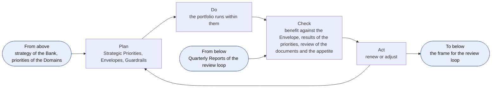
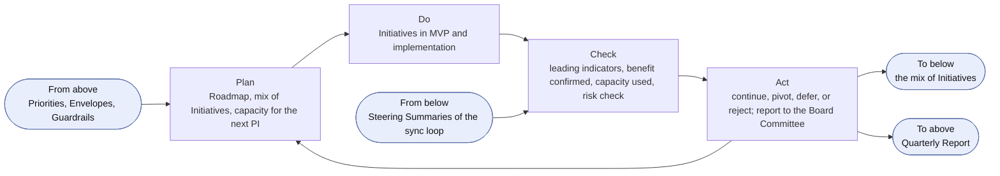
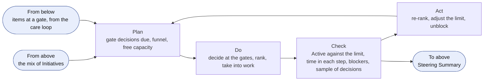
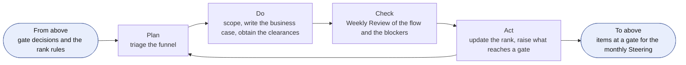
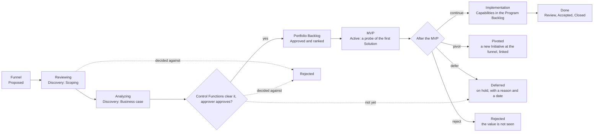
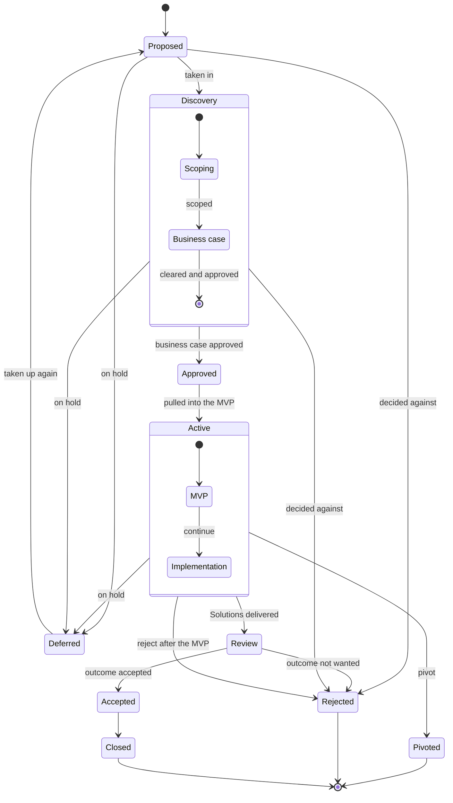
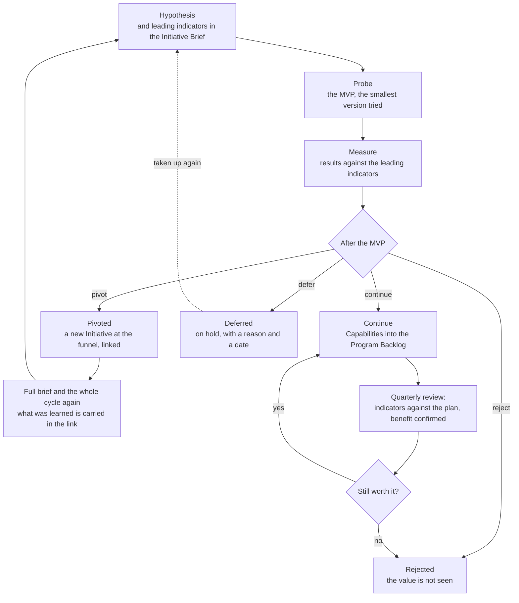
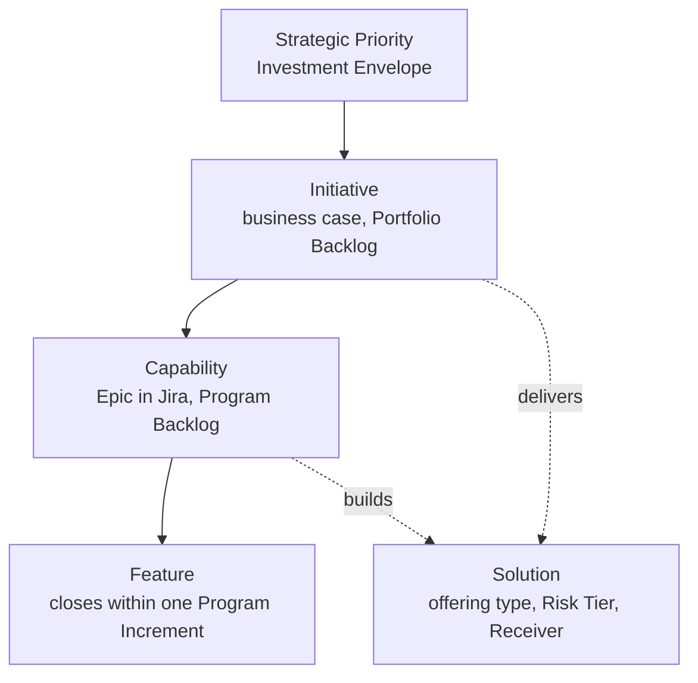

```yaml
id: AICC-ORG-02-EN
title: Portfolio Management Model
status: active
revision: 2.2
created: 2026-10-01
revised: 2026-10-02
```

# Portfolio Management Model

## 1. Purpose and scope

1.1. This Portfolio Management Model states how AICC decides which business initiatives to take in, fund, continue, defer, or reject. It is the management of the portfolio of AICC, in which the Initiatives are tied to the strategy, the priorities are funded by an envelope within guardrails and not Initiative by Initiative, and decisions are taken in small steps on evidence.

1.2. It covers new services and new initiatives, and major changes to them. A new feature of an existing service is not an Initiative: it enters the Program Backlog and is handled by the Solution Lifecycle Model.

1.3. The Operating Model states how AICC is governed and controlled as a unit, and it prevails. This model ends where the Capabilities of an Initiative enter the Program Backlog, and the Solution Lifecycle Model takes the work from there. Figures illustrate and state no rule of their own.

## 2. Strategic inputs

2.1. The Strategic Priorities are the strategic themes of the portfolio. The Executive Sponsor sets them with the Board, each with an Investment Envelope, and shall set the Investment Guardrails each year (AICC Charter 4). The Domain Owners put forward the priorities of their Domains, and the Executive Sponsor shall take them into account when setting the Strategic Priorities.

2.2. The Portfolio holds the catalog of the Solutions that exist. The AICC Lead shall check a proposed Initiative against it, so that the portfolio reuses what exists and does not duplicate it.

## 3. Roles and bodies

3.1. The Roles of the Operating Model take the following parts in portfolio management. The first column gives the part that the Role takes in portfolio management.

| Part in portfolio management | Role | What it does in the portfolio |
| --- | --- | --- |
| Portfolio leadership | Executive Sponsor | Sets the Strategic Priorities, the Envelopes, the Guardrails, and the mix of Initiatives; approves an Initiative above a guardrail, across Domains, or for enabling work; decides to continue, pivot, defer, or reject for those |
| Portfolio advice | AI Steering Committee | Advises the Executive Sponsor on the Portfolio and on conflicts between Domains |
| Client function | Domain Owner | Represents the client function; states the value; owns the business outcome of the Initiative; approves the business case within a Domain and below a guardrail; accepts the outcome |
| Product and portfolio management, and ownership of the Capabilities | AICC Lead | Maintains the funnel and the Portfolio Backlog; writes the business case with the Domain Owner; ranks the Initiatives and sets the limit on the Active Initiatives within the mix of the Executive Sponsor; is accountable for the progress of an Initiative through the portfolio Kanban |
| Architecture and the MVP | Solution Engineer | Defines the architecture and the Solution Definition, and builds the MVP |
| Compliance and risk | Control Function Contacts | Clear a business case that expects Risk Tier 2 or 3, before it is approved |

In practice, a head of function, or a member of AICC, puts forward a need. The AICC Lead takes it in, scopes it with the Domain Owner, and writes the business case with them. The Control Function Contacts clear it when it expects Risk Tier 2 or 3, and the Domain Owner or the Executive Sponsor approves it. The AICC Lead ranks it and pulls it when there is capacity, and the Solution Engineer tries it as a probe. The Domain Owner accepts the outcome and confirms the benefit.

## 4. The portfolio loops

4.1. The portfolio runs on four loops. Each loop is a Plan, Do, Check, Act cycle with its own cadence and forum. A loop takes its frame from the loop above it, and returns its evidence to it. The loops use the events of the control loop of the Operating Model 6 and add no meeting. The following table states them.

| Loop | Cadence and forum | Decider | Records |
| --- | --- | --- | --- |
| Strategic | Yearly, at the yearly Steering (the monthly Steering of December), for the next year | Executive Sponsor, with the AI Steering Committee advising | Priorities, Decision Records |
| Portfolio review | Quarterly, at the quarterly Steering | Executive Sponsor | Quarterly Report, Registry Snapshot, Decision Log |
| Portfolio sync | Monthly, at the monthly Steering | Executive Sponsor; the AICC Lead runs it | Steering Summary, Portfolio Backlog |
| Backlog care | Weekly, at the Weekly Review | AICC Lead | Dashboard, Initiative Briefs |

### The strategic loop

4.2. The Executive Sponsor shall run the strategic loop once a year, at the yearly Steering, for the next year. The yearly Steering is the monthly Steering of December, held in the first two weeks of December (Operating Model 6.5). It is not an extra meeting, and it takes the Quarterly Report of PIQ3 and the findings of the year to that date as its input. The plan sets the Strategic Priorities, the Investment Envelopes, and the Investment Guardrails from the strategy of the Bank and the priorities of the Domains. The check reads the benefit against each Envelope and the results against each priority, and reviews the documents and the AI Risk Appetite Statement. The act renews or adjusts them. The loop hands the frame down to the portfolio review loop, and receives the Quarterly Reports from it. The quarterly Steering that ends the IP week of PIQ4 sets none of it, and a change that the result of PIQ4 calls for in the frame is taken at the first quarterly Steering of the next year.



Figure 1: the strategic loop.

In practice, the Executive Sponsor sets the Envelope of each Strategic Priority and the Guardrails. An Initiative that stays within one Domain and below a guardrail is approved by the Domain Owner, and any other by the Executive Sponsor. The Service Agreement commits the capacity of AICC, and it is not issued above the capacity available, so the work above it waits in the Portfolio Backlog. At the Outcome Report the Domain Owner confirms the benefit, and each quarter the benefit is set against the Envelope, which informs the next yearly decision.

### The portfolio review loop

4.3. The Executive Sponsor shall run the portfolio review loop each quarter, at the quarterly Steering. The plan confirms the Roadmap, the mix of Initiatives, and the capacity for the next Program Increment within the Envelopes. The check reads, for each Active Initiative, the leading indicators against the plan, the benefit that the Domain Owner confirms, the capacity used, and the quarterly risk check with the Control Function Contacts. The act continues, pivots, defers, or rejects each Initiative, adjusts the mix, and reports to the Board Committee. The loop takes the frame of the strategic loop, hands the mix down to the portfolio sync loop, where the AICC Lead sets the limit on the Active Initiatives within it, and returns the Quarterly Report to the strategic loop.



Figure 2: the portfolio review loop.

In practice, the quarterly Steering takes each Active Initiative in turn. The AICC Lead shows its leading indicators against the plan, the Domain Owner confirms the benefit, and the approver of 6.3 decides whether it continues, pivots, is deferred, or is rejected: the Domain Owner within one Domain and below a guardrail, and the Executive Sponsor otherwise. The decision is entered in the Decision Log, and the Quarterly Report records the result.

### The portfolio sync loop

4.4. The Executive Sponsor shall run the portfolio sync loop each month, at the monthly Steering, and the AICC Lead prepares and runs it. The plan sets the agenda: the gate decisions that are due, the funnel, and the free capacity. The do takes the decisions at the gates, ranks the Initiatives, and takes the highest-ranked Initiative that fits into work. The check reads the flow: the Active Initiatives against the limit, the time in each step, the blockers, and a sample of the Decisions of the AICC Lead. The act re-ranks, adjusts the limit, and unblocks. The loop takes the mix of the portfolio review loop, within which the AICC Lead sets the limit, and returns the Steering Summary to it.



Figure 3: the portfolio sync loop.

In practice, the AICC Lead shows the free capacity and the number of Active Initiatives, and the approver of 6.3 takes the decisions that are due. The highest-ranked Initiative that fits is taken into work. An Initiative that ranks lower may be taken first for a stated reason, such as a date or a Dependency, and the reason is recorded. An Initiative that is done, pivoted, deferred, or rejected frees its place, and nothing is taken into work while the limit is reached.

### The backlog care loop

4.5. The AICC Lead shall run the backlog care loop every week, at the Weekly Review. The plan triages the funnel. The do scopes the needs, writes the business cases with the Domain Owners, and obtains the clearances of the Control Function Contacts. The check reads the flow and the blockers at the Weekly Review. The act updates the rank and raises to the monthly Steering the items that reach a gate. The loop takes the rank rules and the gate decisions of the portfolio sync loop, and hands the items at a gate up to it.



Figure 4: the backlog care loop.

In practice, a need that arrives is recorded in the funnel and triaged within the week. The AICC Lead scopes it with the Domain Owner, writes the Initiative Brief, and obtains the clearances of the Control Function Contacts. When the brief is ready, it goes to the next monthly Steering, where the approver decides.

## 5. The portfolio Kanban

5.1. An Initiative moves through the portfolio Kanban of Figure 5. The Funnel is the intake of ideas, Reviewing is the scoping of a need, and Analyzing is the writing and the clearing of the business case. To pull an Initiative is to take it into work when capacity allows. The Portfolio Backlog is the ranked list of the Initiatives in the Kanban, and the funnel is its Proposed state.



Figure 5: the portfolio Kanban of an Initiative.

In practice, the Kanban is read from left to right, and each arrow is a decision. The Initiative stays at a step until its exit criterion is met, and it may leave the flow by a rejection, a deferral, or a pivot.

5.2. The following table states each step. The states and the moves are those of the Solution Lifecycle Model 5.1, which is the only source of the moves. A Rejected Initiative is a business decision that the value is not seen, and a Cancelled one is withdrawn without a decision on the merits, such as an error or no longer required.

| Kanban step | State and Stage | Entry | Exit criterion | Decided by | Record |
| --- | --- | --- | --- | --- | --- |
| Funnel | Proposed | A function, the discovery work, or AICC proposes an idea or a need | The problem, the strategic relevance, and the requester are stated | The AICC Lead takes it in, defers it, or rejects it | An entry in the Portfolio Backlog, with the requester and the problem |
| Reviewing | Discovery: Scoping | Taken in | The need and the requirements are understood. It fits a Strategic Priority, has a client function with a Domain Owner (the Executive Sponsor for enabling work), fits the capacity (Business Model 7.2), and does not duplicate a Solution of the catalog | The AICC Lead, with the Domain Owner | The scope, in the Initiative Brief |
| Analyzing | Discovery: Business case | Scoped | The Initiative Brief is complete in its six sections, meets the criteria of 6.2, and is cleared by the Control Function Contacts (6.4) | The approver of 6.3 approves, returns, defers, or rejects | The Initiative Brief, the clearances of the Control Function Contacts, and the Decision Record |
| Portfolio Backlog | Approved | The business case is approved | The Initiative is ranked (6.5) and pulled when capacity allows | The AICC Lead pulls the highest-ranked Initiative that fits | The rank and the scores in the Portfolio Backlog |
| MVP | Active: MVP | Pulled | The probe has tested the hypothesis against the leading indicators of the Initiative Brief | The approver of 6.3 decides to continue, pivot, defer, or reject | The Solution Definition, the result of the probe, and the Decision Log entry |
| Implementation | Active: Implementation | Continue | The Capabilities are in the Program Backlog and the Solutions are delivered | The Domain Owner, or the Executive Sponsor for enabling work, accepts | The Capabilities in the Program Backlog, under the Initiative |
| Done | Review, Accepted, Closed | The outcome is delivered | The outcome is reviewed against the leading indicators and accepted | The Domain Owner, or the Executive Sponsor for enabling work | The acceptance with who and when in the Portfolio Backlog, and the Outcome Report of an Engagement |

In practice, the AICC Lead brings an Initiative to a gate with its entry in order, and the decider checks the exit criterion. The outcome is one of four. Advance: the Initiative moves to the next step. Return: it goes back with what is missing, and the step is repeated. Defer: it stays in the funnel with a reason and a date to look again. Reject: the value is not seen, and the lessons are kept. The decision is entered in the Decision Log.

Figure 6 shows the states behind the Kanban.



Figure 6: the states of an Initiative.

In practice, Waiting is a state, shown as a flag on the boards, of an Active Initiative that depends on someone outside AICC (Solution Lifecycle Model 5.1), and Cancelled is available in any state for a withdrawal such as an error, so neither is drawn. In light mode the Initiative goes from Active to Review without the state Completed.

5.3. Discovery is research. It learns the need and the requirements, builds nothing, and shapes the Initiative Brief. The MVP is a probe. It is the smallest version of the first Solution that is tried, to see whether it works and satisfies the need.

5.4. A limit on the Initiatives that are Active at one time applies, so that the portfolio stays within the capacity of the AICC Team. The AICC Lead sets the Limit on Work in Progress within the mix that the Executive Sponsor sets at the quarterly Steering (4.3), and reviews it at the monthly Steering.

## 6. The business case

6.1. Every Initiative shall be written in a one-page Initiative Brief, which is its lean business case: a hypothesis, the business outcomes with their leading indicators, the scope and the minimum viable product (MVP), the cost, capacity, and value, the risks and the expected Risk Tier, and the decision. The Initiative Brief Template gives the form. A figure of the Bank stays in its source system, and the brief points to it.

6.2. The business case meets the following criteria before it is approved. The criteria follow the five questions of the five case model for business cases, scaled to one page.

| Question | Criterion |
| --- | --- |
| Why is the change needed? | The Initiative fits a Strategic Priority, and the hypothesis states the value for a named function |
| What is the best option? | The outcomes have leading indicators, with their source system, baseline, and target, and the MVP tests the hypothesis at the least cost |
| Can it be afforded? | The capacity in days is within the capacity available, and the cost is within the Envelope of the Strategic Priority |
| Can it be bought and delivered? | The dependencies and the providers are named, the expected Risk Tier is stated, and the Control Function Contacts have cleared it (6.4) |
| Can it be run well? | The Domain Owner, or the Executive Sponsor for enabling work, is named and committed, and the acceptance on delivery is stated |

6.3. The Domain Owner approves the business case of an Initiative within one Domain that stays below an Investment Guardrail. The Executive Sponsor approves it when it exceeds a guardrail or spans Domains, and for enabling work, of which the Executive Sponsor is the client.

6.4. The Control Function Contacts are gates on the business case in the form proposed. For an Initiative that expects Risk Tier 2 or 3, the Contacts of the Control Functions concerned shall clear the business case within their remit before it is approved, and a Contact who does not clear it may stop it (Operating Model 5.4). The AICC Lead obtains the clearance, which is a Control Sign-Off of the Contact, and references it in the Initiative Brief. A Risk Tier assigned under the AI Policy 3.2 that is higher than the one that the business case expected or that the Contacts cleared returns the business case to them for clearance.

6.5. The Initiatives in the Portfolio Backlog are ranked by the weighted shortest job first (WSJF) method: the sum of the scores of value, urgency, and risk reduction or opportunity, each from 1 to 5, divided by the score of effort, from 1 to 5. The Domain Owner states the value, and the AICC Lead scores the other terms and ranks. The AICC Lead may depart from the rank for a stated reason, and records it.

6.6. Funding goes to the Strategic Priorities and to the capacity of the teams, not to Initiatives one by one (AICC Charter 4). AICC supplies capacity and does not charge the functions. An Initiative is funded by the capacity that its Service Agreement commits, and the Domain pays from its Envelope for the run, the licenses, and the provider costs of its Solutions.

## 7. The MVP and the decision after it

7.1. When the AICC Lead takes an Initiative from the Portfolio Backlog into work, the Solution Engineer shall define the architecture and the Solution Definition of its first Solution, and shall build the MVP with the Domain Expert within the capacity that the business case allows. The scope of the first Solution is narrow.

7.2. At the end of the MVP the approver of 6.3 compares the result with the leading indicators of the Initiative Brief and decides to continue, to pivot, to defer, or to reject. To continue, the Capabilities of the Initiative are defined and entered in the Program Backlog under the Initiative. To pivot, the Initiative is closed as Pivoted, and a new Initiative with a full Initiative Brief is entered at the funnel, linked to it, and goes through the whole cycle again; what was learned and the results of the MVP are carried in the link. To defer, there is not yet sufficient reason to proceed: the Initiative is put on hold as Deferred, with the reason and the date to look at it again, and it returns to the funnel when it is taken up again. To reject, the value is not seen: the Initiative is Rejected and its lessons are kept. The decision is entered in the Decision Log and has a Decision Record.

Figure 7 shows the loop of the probe and the decision that follows it.



Figure 7: the probe loop.

In practice, the Initiative Brief holds, before the MVP, the hypothesis, the leading indicators with their source system, and the capacity that the probe may use. The Solution Engineer builds the smallest version that can test it, with the Domain Expert. At the end the approver reads the results against the indicators and decides. After a continue, the quarterly review asks the same question of each Active Initiative, and an Initiative whose indicators and confirmed benefit do not hold is deferred or rejected.

7.3. A Solution Definition is approved by the Domain Owner, and the AICC Lead assigns its Risk Tier (AI Policy 3). The Executive Sponsor decides on the release of a Risk Tier 3 Solution.

## 8. Initiative, Capability, and Feature

8.1. An Initiative delivers one or more Solutions through Capabilities, and a Capability is delivered through Features. Figure 8 shows the levels. Investment and priority are set at the level of the Initiative, and the Program Backlog groups the Capabilities under their Initiatives.



Figure 8: the levels of the work.

8.2. The AICC Lead approves a Capability, with the Domain Owner consulted. A Capability of enabling work may sit directly under an Initiative, without a Solution, and enabling work that builds no AI Solution has no Risk Tier.

8.3. In Jira an Initiative sits above the Epic, a Capability is an Epic, a Feature is an issue type, and a Work Item is a sub-task. The word Epic is used in Jira only.

## 9. Review, measures, and records

9.1. The portfolio loops of section 4 review the funnel, the Portfolio Backlog, and the Active Initiatives each month, and confirm each quarter, for each Active Initiative, whether it continues, pivots, is deferred, or is rejected, on its leading indicators against the plan and the benefit that the Domain Owner confirms.

9.2. AICC measures the time from a proposal to its approval and from its approval to its acceptance, the benefits realized against the Investment Envelope, and the Initiatives that are Active against the limit (AICC Charter 7).

9.3. An Initiative is complete when its Solutions are delivered and its outcome is reviewed and accepted by the Domain Owner, or by the Executive Sponsor for enabling work, after the final acceptance of the Team (Solution Lifecycle Model 7.3). The Outcome Report records the acceptance of an Engagement.

9.4. The Portfolio Backlog and the Initiative Briefs are kept in the Registry, and the Solution Definitions in the Portfolio. The controls that this model carries, whose rules it states or whose evidence it keeps, are C-02, C-08, C-09, C-23, and C-24 of the Operating Model 8.

## Change log

| Revision | Date | Change | Decision |
| --- | --- | --- | --- |
| 1.0 | 2026-10-01 | Created: the portfolio layer separated from the program execution layer; the portfolio Kanban, the business case and its criteria, the ranking, the MVP and the decision to persevere, and the levels of the work. | DR-2026-044 |
| 1.1 | 2026-10-01 | Discovery is research and the MVP is a probe; after the MVP: continue, pivot, or reject; a pivot restarts the whole cycle at the funnel; the Control Functions clear the business case; the interim approval rule removed. | DR-2026-045 |
| 1.2 | 2026-10-01 | Eight figures with their practical reading: the Roles across the flow, the Kanban, the gate, the states, the pull, the funding loop, the probe loop, and the levels; a Record column in the table of steps. | DR-2026-046 |
| 1.3 | 2026-10-01 | Wording for an auditor: Strategic inputs; the names of the steps explained; informal verbs replaced. | none |
| 1.4 | 2026-10-01 | Defer is an option beside reject at the decisions of the portfolio: the gates and after the MVP. | DR-2026-047 |
| 1.5 | 2026-10-01 | The portfolio loops: the strategic, the portfolio review, the portfolio sync, and the backlog care loop, each a Plan, Do, Check, Act cycle with its forum, its decider, its interfaces, and its records; the figures of the Roles, the gate, the pull, and the funding are folded into the text. | DR-2026-047 |
| 1.6 | 2026-10-01 | Iteration written in full; the approver of the business case decides after the MVP. | DR-2026-048 |
| 1.7 | 2026-10-02 | Auditor evaluation end to end: the clearance is a Control Sign-Off; the decision after the MVP has a Decision Record; the yearly loop at the Steering that ends PIQ4; duplicate paragraphs removed. | DR-2026-052 |
| 1.8 | 2026-10-02 | Review of the independent findings: lineage removed from clause 1.1 (it drew on Lean Portfolio Management of the Scaled Agile Framework, ISO 21504, and the Standard for Portfolio Management of the Project Management Institute); Waiting is a state shown as a flag; the limit on Active Initiatives is set within the mix of the Executive Sponsor; enabling work; a higher Risk Tier returns the business case for clearance; funding of the run; controls list. | DR-2026-055 |
| 1.9 | 2026-10-02 | The controls that the model carries. | DR-2026-055 |
| 2.0 | 2026-10-02 | The acceptance of the outcome of an Initiative is the business acceptance of the Domain Owner, or of the Executive Sponsor for enabling work, after the final acceptance of the Team. | DR-2026-056 |
| 2.1 | 2026-10-02 | The yearly strategic loop runs at the yearly Steering, the monthly Steering of December held in the first two weeks, in place of the quarterly Steering that ends PIQ4; the input of PIQ3. | DR-2026-057 |
| 2.2 | 2026-10-02 | No lineage or framework name in the model: the management of the portfolio is described in plain words in clause 1.1 and in the table of clause 3.1. | DR-2026-058 |
