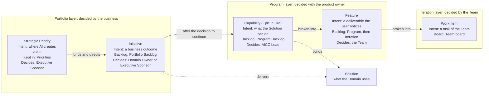
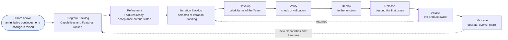
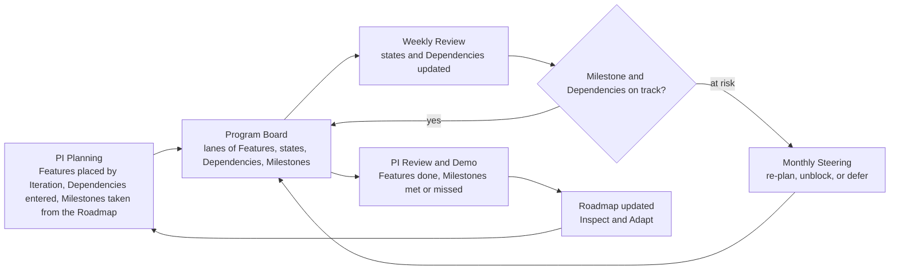
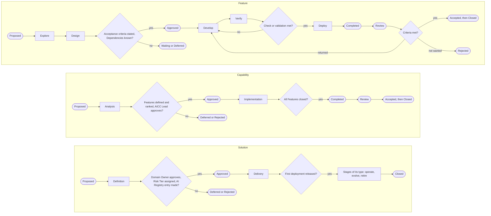
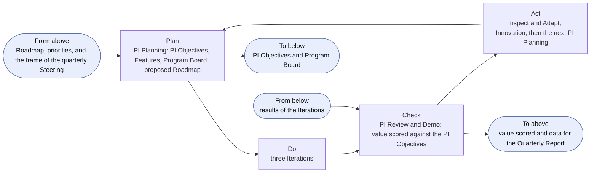
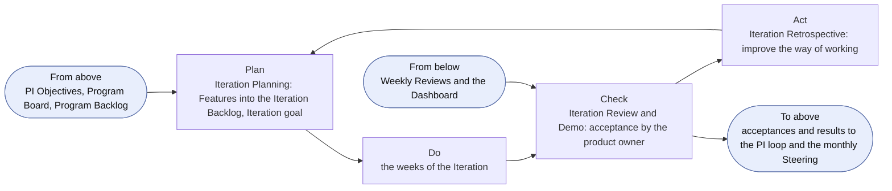
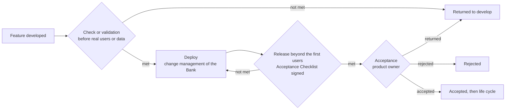

```yaml
id: AICC-ORG-03-EN
title: Solution Lifecycle Model
status: active
revision: 2.4
created: 2026-10-01
revised: 2026-10-02
```

# Solution Lifecycle Model

## 1. Purpose and scope

1.1. This Solution Lifecycle Model states how AICC delivers. It states how the work that the portfolio approves moves through the program and the iteration to a released Solution, and how the Solution is looked after until it is retired. It is the method of the Teams, stated as operating instructions: the principles, the intake, the levels and the backlogs, the states, the cadence with its loops, verification and release, and the management of the life cycle.

1.2. It applies to AICC and to the Domains and Control Functions of the Bank that work with AICC.

1.3. The Operating Model states how AICC is governed and controlled as a unit, and it prevails. The Portfolio Management Model decides which Initiatives are taken in, funded, and stopped, and it ends where the Capabilities of an Initiative enter the Program Backlog, where this model begins. The workflows of the charter show how the loops run, and the Calendar Record holds the dates. They state no rule of their own. Figures illustrate and state no rule of their own.

## 2. Principles and values

2.1. AICC delivers on the values of the Statement of Intent: integrity, prudence, and respect for people. In delivery they mean working Solutions over documents, collaboration with the function over negotiation, response to change over adherence to a fixed plan, and evidence over opinion.

2.2. AICC delivers on the following principles.

(a) Make work visible, limit work in progress, and pull work when there is capacity.

(b) Deliver in small steps: probe with a minimum viable product, measure against the success Measures, then scale.

(c) Put value first: rank work by value and urgency relative to effort.

(d) Plan on a cadence. Work is paced by Program Increments and Iterations that start and end on fixed dates, and the plan of a Program Increment states intent and direction and not a promise of scope.

(e) Build quality in. The check or the validation and the controls of the AI Policy are steps of the flow, and not a stage after it.

(f) Decide where the facts are. The Team decides how the work is built, and the product owner decides whether the outcome is accepted.

(g) Make dependencies visible, and manage them as work.

(h) Improve continuously. Each Iteration and each Program Increment ends with a review and an improvement.

## 3. The flow of value

3.1. Work enters the program in three ways. The Capabilities of an Initiative enter the Program Backlog after the decision to continue at the end of its MVP (Portfolio Management Model 7.2). A change or a new feature of a released Solution is raised by its product owner and enters the Program Backlog under the Capability of that Solution. Enabling work of AICC enters under an Initiative of enabling work. Every item is ranked in the Program Backlog before a Team takes it.

3.2. The work is structured in the levels of the following table. The Strategic Priority and the Initiative are managed by the Portfolio Management Model.

| Level | Meaning | Kept in |
| --- | --- | --- |
| Strategic Priority | A strategic theme set with the Board, with an Investment Envelope | Priorities |
| Initiative | A business program: a long-term business service or product that delivers one or more Solutions. An Initiative that has a client function is an Engagement, with one Service Agreement for each client function; the client of enabling work is the Executive Sponsor | Portfolio Backlog |
| Solution | A solution or service that an Initiative delivers for a Domain, with an offering type, a Risk Tier, and an AI Registry entry | The Portfolio, as a Solution Definition |
| Capability | A capability of a Solution, delivered over one or more Program Increments | Program Backlog |
| Feature | A deliverable of a Capability, which closes within one Program Increment and is delivered over one or more Iterations | Program Backlog, then Iteration Backlog |
| Work Item | A task of a Team within a Feature | The Team board |

Figure 1 shows how the levels follow from one another, with the intent of each level, where it is kept, and who decides.



Figure 1: the levels of the work, by intent and by backlog.

3.3. Each level is worded as a short contract in the language of the business, so that the client, the Team, and the product owner read the same words. An Initiative and a Capability are worded as a hypothesis, which the work tests. A Feature is worded as a benefit hypothesis with its acceptance criteria. Acceptance criteria are written in the form Given, When, Then. The first of the following tables gives the parts of the wording and what each means, the second gives the wording of each level, and the third illustrates it.

| Part | Meaning | The question it answers |
| --- | --- | --- |
| For | The client or the user | Who is it for? |
| Need | The situation or the job to be done | What problem does it solve? |
| Proposal | The thing that is proposed, and its kind | What is it? |
| Value hypothesis | The benefit that we believe it will bring | Why does it matter? |
| Difference | How it is better than the way things are done now | Why is it better? |
| Leading indicator | An early measure, with its source, baseline, and target | How will we know early that it holds? |
| Scope | The smallest version that tests the hypothesis, and what is out | What is tried first? |
| Acceptance criteria | Given a situation, when an action is taken, then a result that can be observed | How does the product owner accept it? |

| Level | For | Need | Proposal | Value hypothesis | Difference | Leading indicator | Scope | Acceptance criteria |
| --- | --- | --- | --- | --- | --- | --- | --- | --- |
| Initiative | [The client function] | who [need] | the [Initiative] is a [type of Solution] | that [value] | Unlike [the current way], ours [difference] | [Measure, source, baseline, target] | The MVP: [the smallest version, and what is out] | The outcome meets the leading indicators when it is reviewed, and the product owner accepts it |
| Capability | [The users of the Solution] | who [need] | the Solution can [capability] | so that [benefit] | | [Measure] | The Features that deliver it | Given [situation], when [action], then [result], for the Capability as a whole |
| Feature | [The user] | | [Feature] | We believe that it will [benefit] | | [Measure] | One Program Increment at most | Given [situation], when [action], then [result that can be observed] |

An illustration of the wording follows. It shows the form and is not a record.

| Level | Wording |
| --- | --- |
| Initiative | For the heads of functions who spend days each month compiling a recurring report by hand, the Reporting Service is a Service that drafts and publishes it. Unlike the manual compilation, ours is consistent and takes hours. We will know by the share of editions issued on time |
| Capability | For the analysts who prepare the report, the Solution can collect the figures from their governed sources, so that no figure is copied by hand |
| Feature | We believe that collecting the first three metrics automatically will remove the hand copying of those metrics for the analysts. Given a monthly cycle with the sources available, when the collection runs, then the three metrics appear in the draft with their source and their date |

3.4. Figure 2 shows the flow of value from the intake to the life cycle of a Solution.



Figure 2: the flow of value.

3.5. A Team delivers the work: a Solution Engineer with the Domain Expert and the Domain Owner, who is the product owner. AICC has the AICC Team, and a Domain may have its own Team. The Team pulls the Features, decides how they are built, keeps the Iteration Backlog and the Team board current, and holds the events of the Iteration. The product owner sets the priority within the agreed priorities and accepts the outcome. The Team agrees who takes the Hats that the work needs (Operating Model 4.3).

## 4. Backlogs and boards

4.1. AICC keeps two backlogs at this level. The Program Backlog, also called the PI Backlog, holds the Capabilities and the Features, grouped under their Initiatives. The Iteration Backlog holds the Features that the Teams work on in the Iteration. Each is ranked by value and urgency relative to effort, scored 1 to 5 for value, urgency, risk reduction or opportunity, and effort. The backlogs change continuously, because much of the work depends on people and events outside AICC. A Capability may run over several Program Increments. A Feature closes within its Program Increment, or is split. The items of a Program Increment state intent and direction, and what is done in an Iteration is decided in that Iteration.

4.2. Work flows as in Kanban. The Program Kanban shows the Capabilities and the Features by state, with the classes of service as lanes: Urgent, High priority, and Normal. The Limits on Work in Progress apply to the states, the lanes, and each Domain. The Team pulls an approved item only when there is capacity, and a Feature is approved only when its Dependencies are known. At each Iteration Planning the Team selects the Features for the month from the Program Backlog into its Iteration Backlog, and the Weekly Review keeps them under control. An item that waits for a person or an event outside AICC is Waiting, and names its Dependency. The Team board shows the Work Items of the Iteration.

The following table outlines the boards, their steps, their lanes, their limits, and the measures that are read from them.

| Board | Shows | Columns | Stages shown | Lanes | Limit on Work in Progress | Measures |
| --- | --- | --- | --- | --- | --- | --- |
| Portfolio Kanban | Initiatives | Funnel, Reviewing, Analyzing, Portfolio Backlog, MVP, Implementation, Done; Deferred, Rejected, and Pivoted are off the flow | Scoping, Business case, MVP, Implementation | None | The Initiatives that are Active, set by the AICC Lead | Time from a proposal to its approval, time from approval to acceptance, Active against the limit |
| Program Kanban | Capabilities and Features | Backlog, Ready, Active, Review, Done; Waiting is a flag with its Dependency | Capability: Analysis, Implementation. Feature: Explore, Design, Develop, Verify, Deploy | Urgent, High priority, Normal | Per state, per lane, and per Domain, set by the Team | Features accepted in the Iteration, cycle time from approved to closed, items by lane, Waiting items |
| Team board | Work Items of the Iteration | Backlog, Ready, Active, Review, Done | The Stages of the Feature | None | Per person, set by the Team | Work Items closed, blockers |

4.3. The Program Board is the board of the dependencies of a Program Increment. It shows, for each Capability and Feature, the Iteration in which it is planned, its state, and what it needs from other items, Teams, functions, and persons. It also shows the Milestones of the Roadmap at the Iteration in which they fall. The AICC Lead builds it with the Teams at the PI Planning, and keeps it current at the Weekly Review. A Dependency is Open, Met, or At risk. A Milestone is At risk when a Feature or a Dependency that it needs is At risk, and what is At risk is raised to the monthly Steering. Figure 3 shows how the Program Board, its Dependencies, and the Milestones flow through a Program Increment, and the following table shows the form of the Program Board.



Figure 3: the Program Board through a Program Increment.

| Lane: Feature | Capability | Iteration 1 | Iteration 2 | Iteration 3 | IP week | Depends on | Dependency status |
| --- | --- | --- | --- | --- | --- | --- | --- |
| Milestone | The Roadmap | [Milestone and date] | | [Milestone and date] | | | |
| [Feature A] | [Capability X] | Active | Review | Done | | None | |
| [Feature B] | [Capability X] | Approved | Active | Review | Done | [Feature A] | Met |
| [Feature C] | [Capability Y] | Waiting | Active | Review | | [A function, a person, or another Team] | At risk |
| [Feature D] | [Capability Y] | | Approved | Active | Review | [Feature C] | Open |

The table is the form and holds no real data. A lane is one Feature, and a cell holds the state that the Feature is planned to reach, or has reached, in that Iteration. A Feature that is Waiting names its Dependency, and a Dependency that is At risk is raised to the monthly Steering.

4.4. The Roadmap shows three months: the current Program Increment as intent and direction, the next as planned, and the period beyond as indicative, with its Milestones. The PI Planning proposes it, and the quarterly Steering confirms it (Operating Model 6.6). The Dashboard shows the state of the Program Increment, the flow of the Program Kanban, the Dependencies at risk, the risks, and the Measures. The AICC Lead keeps the Roadmap, the Program Board, and the Dashboard current, and they are Records.

## 5. States and Stages

5.1. Every Initiative, Solution, Capability, and Feature is in one of the states of the Vocabulary. A Strategic Priority is Proposed, Active, Closed, or Cancelled, as the Executive Sponsor decides. An item moves as the following table states. This table is the only source of the moves.

| From | To | When |
| --- | --- | --- |
| Proposed | Discovery | The AICC Lead takes it in: Initiatives, Solutions, and Capabilities, and Features at refinement |
| Proposed | Rejected, or Deferred | It is decided against at triage, or put on hold |
| Discovery | Approved | The conditions of its level in section 5.2 are met, and its approver decides |
| Discovery | Waiting, Deferred, Rejected, Pivoted, or Cancelled | A Dependency blocks it; it is put on hold; it is decided against; it is rerouted into a new item; or it is withdrawn without a decision on the merits |
| Approved | Active | The Team pulls it, when there is capacity and its Dependencies are known. An Initiative becomes active when the AICC Lead pulls it into its MVP (Portfolio Management Model 5.2). A Solution becomes active when its first Capability or Feature is pulled |
| Approved | Waiting, Deferred, Pivoted, or Cancelled | As for Discovery |
| Active | Completed | The work is finished |
| Active | Waiting, Deferred, Pivoted, or Cancelled | As for Discovery |
| Active | Rejected | Only for an Initiative at the end of its MVP: the value is not seen (Portfolio Management Model 7.2) |
| Active | Closed | Only for a Solution: it is retired, handed off, or ended, as section 8.1 states |
| Active | Discovery | Only for a Solution: a change raises its Risk Tier or the check or the validation named it as requiring a new check, as the AI Policy states |
| Waiting | The state it came from | The Dependency is cleared |
| Waiting | Deferred or Cancelled | The Dependency will not clear, or the item is withdrawn without a decision on the merits |
| Deferred | Proposed | It is taken up again, and the keeper may resume it at the state it left |
| Deferred | Rejected or Cancelled | It is decided against, if it was never approved, or it is withdrawn without a decision on the merits |
| Completed | Review | The product owner assesses it against its acceptance criteria |
| Review | Active, or Accepted, or Rejected | It is returned with what is missing; its criteria are met; or its outcome is not wanted |
| Accepted | Closed | The item is finished |

5.2. A Stage is a phase of the work inside the discovery state or the active state of an item. The Stages of an Initiative are in the Portfolio Management Model 5.2. The Stages, the approver, and the conditions of each level are in the following table. The AICC Lead shall confirm that the conditions are met and note it in the backlog of the level, or in the Portfolio for a Solution.

| Level | Discovery Stages | Approved by, and conditions | Active Stages | To be completed |
| --- | --- | --- | --- | --- |
| Solution | Definition | The Domain Owner approves the Solution Definition, with its type, Receiver, scope, capabilities, architecture, and data classes. The Risk Tier is assigned by the AICC Lead and told to the Domain Owner; the AI Registry entry is made; for Risk Tier 2 and 3, the Control Function Contact of compliance confirms the applicable law; an Experiment has its time-box and a Service its run cost and sunset | Delivery, then the Stages of its type in section 8.1 | It is delivered, as section 8.1 states |
| Capability | Analysis: define the capability and break it into Features | The AICC Lead, with the Domain Owner consulted. Its Features are defined and ranked in the Program Backlog | Implementation | Its Features are closed |
| Feature | Explore, Design | The Team, at Iteration Planning. Its acceptance criteria are stated, and its Dependencies are known, with any open one named | Develop, Verify, Deploy | It is deployed |

Figure 4 shows the staging workflow of each level, from left to right: the Stages in boxes, the conditions that must be met to move on in diamonds, and the returns. Each condition is a condition of the Stages table, and in the tracker it is a condition of the workflow, with the Stage held in a field and the state in the status.



Figure 4: the staging workflow of the Feature, the Capability, and the Solution.

5.3. Rejected means decided against on the merits because the value is not seen, before approval or after the MVP of an Initiative, or when the outcome under review is not wanted. Cancelled means withdrawn without a decision on the merits, such as an error, a mistake, or a duplicate, and applies in any state from Discovery to Review except Completed. A suspension of a Solution is a flag on it, like waiting, and does not change its state. A stop by a Control Function is final and cancels the Solution. Retirement closes it, with no acceptance. The person who approves an item at its level also defers, rejects, cancels, or pivots it.

## 6. The cadence

6.1. Work runs in Program Increments. A Program Increment is one quarter, made of three Iterations. An Iteration is one calendar month of four or five whole weeks. The last week of the third Iteration of a Program Increment is the IP week. The names are PIQ1 to PIQ4 with the year, I01 to I12, and W1 to W5. The Calendar Record states the dates of the whole year with the blocked and gray days, and the Cadence workflow states the general flow of the events by week, without dates, which is the template for the dated calendar of events. The work runs on four loops, each starting with planning and ending with review, and each loop takes its frame from the loop above it and returns its evidence to it. The following table states them.

| Loop | Cadence | Events | Decider | Records |
| --- | --- | --- | --- | --- |
| Program Increment | Quarterly | PI Planning, PI Review and Demo, Inspect and Adapt, Innovation | The Teams and the Domain Owners for the intent; the Executive Sponsor confirms the Roadmap | PI Objectives, Roadmap, Program Board, Quarterly Report |
| Iteration | Monthly | Iteration Planning, Iteration Review and Demo, Iteration Retrospective, Backlog Refinement | The Team; the product owner accepts | Iteration Backlog, acceptances |
| Week | Weekly | Weekly Planning, Weekly Review | The AICC Lead | Dashboard, Program Board |
| Day | Daily | Daily Stand-up | The Team | The work items |

6.2. The Program Increment loop is the loop of the quarter. The PI Planning sets the intent and the direction of the Program Increment: the PI Objectives, the Features that the Program Increment aims at, the Program Board, and the proposed Roadmap. The three Iterations carry the work out. The PI Review and Demo shows what the Program Increment delivered and scores its value against the PI Objectives. Inspect and Adapt solves the main problems of the Program Increment, and the Innovation gives time to learn and recover. The IP week holds these four events and ends the Program Increment. The loop takes the Roadmap and the priorities of the portfolio review and the direction of the quarterly Steering, hands the PI Objectives and the Program Board down to the Iteration loop, and returns the value scored and the data of the Quarterly Report to the quarterly Steering.



Figure 5: the Program Increment loop.

6.3. The Iteration loop is the loop of the month. The Iteration Planning selects the Features for the month into the Iteration Backlog and sets the Iteration goal. The weeks carry the work out. The Iteration Review and Demo shows the working Solutions to the product owners and takes the acceptance, and the Iteration Retrospective improves the way the Team works. The Backlog Refinement keeps the next items ready, within the weekly sessions. The last week of an Iteration is its review week. The loop takes the PI Objectives and the Program Board, and returns the acceptances and the results to the Program Increment loop and to the monthly Steering.



Figure 6: the Iteration loop.

6.4. The week loop and the day loop are the loops of the work. The Weekly Planning sets the focus of the week and checks the Dependencies. The Weekly Review controls the flow: it reads the Program Kanban, the Limits on Work in Progress, and the Dependencies, reorders the Program Backlog, and keeps the Dashboard current. The Daily Stand-up shares progress and clears blockers. The loop takes the Iteration Backlog and the Iteration goal, and returns the Dashboard and the open Dependencies to the Iteration loop.


Figure 7: the week loop.

6.5. An event that falls on a blocked or gray day moves to the working day before it, and never after. When moved events meet on one day, the larger event keeps the day and the smaller one moves to the working day before it. An event that is missed is not held later, and its intent is covered at the next event. The Weekly Review may be held in writing.

6.6. While the AICC Team has up to three people, AICC runs in light mode. The Weekly Planning and the Weekly Review are one session, held on the day of the Weekly Planning. The Iteration Retrospective and the monthly Steering are held in the Iteration Review and Demo, and Inspect and Adapt is held in the PI Review and Demo. The Daily Stand-up, the Backlog Refinement, and the Innovation are optional. In light mode Waiting is a flag, Completed is skipped and an item goes from Active to Review, Accepted and Closed are one step with the acceptance recorded, Stages are used for Initiatives and Solutions only, and Work Items are not tracked in the charter. Everything else stays as stated.

6.7. The loops of this model run on the events that the control loops of the Operating Model 6 and the portfolio loops of the Portfolio Management Model 4 also use, and add no meeting. The Weekly Review is the operating loop and the backlog care loop, the monthly Steering takes the results of the Iteration Review and Demo, and the quarterly Steering takes the results of the PI Review and Demo.

## 7. Verification, release, and acceptance

Figure 8 shows how a Feature becomes a released and accepted outcome.



Figure 8: verification, release, and acceptance.

7.1. The check for Risk Tier 1 and the validation by the Control Function Contacts for Risk Tier 2 and 3 attach to the Solution. They are taken in Verify of the first Feature that reaches real users or data, they cover the later Features unless a change requires a new one, which the AICC Lead shall decide and enter, with the reason, in the Solution Definition, and no deployment to real users or data comes before them. A deployment to production follows the change management of the Bank, the Solution Engineer shall enter the change ticket and the test result in the Feature, and the access of a Solution Engineer to production is granted through the access process of the Bank. The release of a Solution beyond its first users is decided by the Domain Owner for Risk Tier 1 and 2, and by the Executive Sponsor for Risk Tier 3, after the check or the validation, and is recorded in the Solution Definition. A Feature that cannot close within its Program Increment is split: the part that is done is a Feature that goes to review, and the rest is a new Feature in the next Program Increment. The original Feature is Pivoted and linked to both.

7.2. The Control Function Contacts that this model and the AI Policy name shall take part when a Solution of Risk Tier 2 or 3 is defined and in its validation. The validation relies on the evidence, the logs, and the traces that the Platform Owner keeps.

7.3. Acceptance closes an item. The product owner accepts the delivered outcome against its acceptance criteria, and the AICC Lead notes the acceptance with who and when in the backlog of the level. The product owner is the Domain Owner for an item of a Domain, and the Executive Sponsor for an item that spans Domains or is enabling work of AICC. The product owner may accept the item, return it with what is missing, or reject it when its outcome is not wanted. The acceptance of an Engagement is recorded in its Outcome Report.

7.4. When AICC hands a Solution to a Domain as ready for use at scale, before its release beyond the first users, the AICC Lead completes the Acceptance Checklist of the Solution. The checklist lists, for each party concerned, the items that the party confirms within its remit and signs: the Domain Owner, the Solution Engineer, the AICC Lead, the Checker, the Control Functions (model risk, compliance, information security, data protection, and legal), and the IT function that operates the Solution with the Platform Owner. An item that is not met shall stop the release. The Domain Owner receives the checklist signed and signs the acceptance of the package. A Domain adopts a Solution of Risk Tier 1 or 2 on its own risk, within the AI Risk Appetite Statement. A Solution of Risk Tier 3, which is of high impact and risk, is adopted only with the signature of the Executive Sponsor, who accepts the risk and releases it. The checklist is not used during development or trials, where 7.1 applies, and a change after the release that requires a new check or validation brings a new checklist. It adds no approval of its own: the decisions are those that the AI Policy and this model state.

## 8. Life-cycle management

8.1. A Solution has one offering type, which sets its life after delivery. A Solution is delivered when its first deployment is released. The Initiative is complete once its Solutions are delivered and its outcome is reviewed, and a Service and a Product go on under their own type. A Solution is Active from the start of its delivery to the end of its life, and it is Closed when it is retired, handed off, or ended. The Receiver is named in the Solution Definition before the Solution is approved, and an Experiment may name "none yet, to be asked". The following table states the types.

| Type | Owner after delivery | Stages after delivery | End |
| --- | --- | --- | --- |
| Service | AICC, for the whole life cycle, with a business case that states the run cost and a sunset rule. The product owner is the Domain Owner of the Domain it serves, and the Executive Sponsor for a Service across Domains | Operate, Evolve, Retire. New features come as Capabilities and Features | Retired, or cancelled |
| Product | The consumer owns the version delivered, and AICC supports it on demand | Handover, Support, Revise (a new version comes through the Portfolio Backlog), Retire for that consumer. A Product with many consumers or recurring requests becomes a Service through a business case | Retired for that consumer |
| Experiment | None yet: it is time-boxed to a stated number of Iterations, and ends in a Proposal. Its product owner is the Executive Sponsor when it has no Domain | Trial, Proposal, Handover | At the end of its time-box it goes to review: it is accepted with its lessons and closed, a Proposal is made, or it is cancelled. When a Receiver accepts the Handover, it is closed and AICC oversees the Adopted Solution |

The phases of an Engagement map to the items as follows: the study is the discovery of the Initiative, the proof is the Experiment or the first Features of the Solution, delivery is the active state of the Capabilities and Features, and support is the life of the Solution after delivery.

| Type | Owner after delivery | Stages after delivery | End |
| --- | --- | --- | --- |
| Service | AICC, for the whole life cycle, with a business case that states the run cost and a sunset rule. The product owner is the Domain Owner of the Domain it serves, and the Executive Sponsor for a Service across Domains | Operate, Evolve, Retire. New features come as Capabilities and Features | Retired, or cancelled |
| Product | The consumer owns the version delivered, and AICC supports it on demand | Handover, Support, Revise (a new version comes through the Portfolio Backlog), Retire for that consumer. A Product with many consumers or recurring requests becomes a Service through a business case | Retired for that consumer |
| Experiment | None yet: it is time-boxed to a stated number of Iterations, and ends in a Proposal. Its product owner is the Executive Sponsor when it has no Domain | Trial, Proposal, Handover | At the end of its time-box it goes to review: it is accepted with its lessons and closed, a Proposal is made, or it is cancelled. When a Receiver accepts the Handover, it is closed and AICC oversees the Adopted Solution |

The phases of an Engagement map to the items as follows: the study is the discovery of the Initiative, the proof is the Experiment or the first Features of the Solution, delivery is the active state of the Capabilities and Features, and support is the life of the Solution after delivery.

8.2. AICC oversees and reports on the Adopted Solutions that others deliver, in the Portfolio, as a Solution Definition marked as an Adopted Solution with its Receiver as owner. It is recorded when others begin to deliver a Solution that AICC proposed or oversees. It uses the states Proposed, Approved, Active, Closed, Rejected, and Cancelled, and records the Risk Tier when it is known. The owners and the Executive Sponsor decide on a Proposal of a Solution, and the Bank decides on a Proposal of the AI adoption strategy. The AI adoption strategy is a series of Proposals that AICC shapes from what it learns.

8.3. A change to a released Solution is a Feature. A change of model, provider, data class, degree of autonomy, or any attribute of the Risk Tier is significant. The AICC Lead shall decide whether a change requires a new check or validation, and the Domain Owner, or the Executive Sponsor for Risk Tier 3, releases it. A change to a Solution in production follows the change management of the Bank, and the Solution Engineer shall enter the change ticket and the test result in the Feature. An emergency change may be deployed on the decision of the AICC Lead, and shall be reviewed and entered in the Decision Log within five working days. A change of terms or of model by a provider is a change under this clause.

8.4. The product owner of a live Solution shall review its monitoring, its incidents, its use, and the notices of its providers at each Iteration Review and Demo, and shall note the review in the Solution Definition.

8.5. Before a Solution is Closed as retired, the Solution Engineer shall remove the access and the credentials, the data and the logs shall be kept or deleted under the retention rules of the Bank, and the AI Registry entry shall be marked retired. The Domain Owner, or the Executive Sponsor for a Service across Domains, approves the retirement, and the approval is entered in the Solution Definition.

## 9. Records and controls

9.1. The records of this model are the Program Backlog, the Iteration Backlogs, the Program Board, the Roadmap, the Dashboard, and the Calendar, kept in the Registry; the Solution Definitions, kept in the Portfolio; and the Acceptance Checklists, the Control Sign-Offs, and the Registry Snapshots, which are the evidence records.

9.2. The controls of this model are C-12, C-13, C-14, C-20, C-28, C-29, C-30, and C-31 of the Operating Model 8.

## Change log

| Revision | Date | Change | Decision |
| --- | --- | --- | --- |
| 1.0 | 2026-10-01 | Created from the Operating Model: the flow of work, the states and Stages, the cadence of the delivery loops, verification, release, acceptance, and the life cycle of a Solution. | DR-2026-040 |
| 1.1 | 2026-10-01 | The Acceptance Checklist at the handover of a ready Solution to a Domain for use at scale; the Executive Sponsor signs for Risk Tier 3. | DR-2026-041 |
| 1.2 | 2026-10-01 | Auditor review: change after release (7.3), review of live Solutions (7.4), retirement (7.5), production deployment, a stop is final (4.3), and clauses split. | DR-2026-042 |
| 2.0 | 2026-10-02 | Restructured top to bottom as the method of the Teams: principles and values, the intake, the flow of value, the backlogs and the boards, the Program Board, the states, the cadence with the Program Increment, Iteration, and week loops, verification and release, the life cycle, and the records and controls. | DR-2026-049 |
| 2.1 | 2026-10-01 | The levels of the work as a diagram by intent, backlog, and decider; the table of the boards with their columns, Stages, lanes, limits, and measures. | DR-2026-049 |
| 2.2 | 2026-10-01 | The Program Board with its Milestones and a table of its form; the flow of the Program Board, the Dependencies, and the Milestones through a Program Increment. | DR-2026-049 |
| 2.3 | 2026-10-01 | The staging workflow of the Feature, the Capability, and the Solution, with the conditions between the Stages. | DR-2026-049 |
| 2.4 | 2026-10-01 | The wording of the Initiative, the Capability, and the Feature: the parts of the wording, the wording of each level, and an illustration. | DR-2026-049 |
