```yaml
id: AICC-ORG-03-EN
title: Solution Lifecycle Model
status: active
revision: 2.1
created: 2026-10-02
revised: 2026-10-03
```

# Solution Lifecycle Model

## 1. Purpose and scope

1.1. This Solution Lifecycle Model states how AICC delivers. It states how the work that the portfolio approves moves through the Program Increment and the Iteration to a released Solution, and how the Solution is looked after until it is retired. It is the method of the Teams, stated as operating instructions: the principles, the intake, the levels and the backlogs, the states, the cadence with its loops, verification and release, the management of the life cycle with the life of a Service and the Lab, and the measures.

1.2. It applies to AICC and to the Domains and Control Functions of the Bank that work with AICC.

1.3. The Operating Model states how AICC is governed and controlled as a unit, and it prevails. The Portfolio Management Model decides which Initiatives are taken in, funded, and stopped, and it ends where the Capabilities of an Initiative enter the Program Backlog, where this model begins. The workflows of the charter show how the loops run, and the Calendar Record holds the dates. They state no rule of their own. Figures illustrate and state no rule of their own.

## 2. Principles and values

2.1. AICC delivers on the values of the Statement of Intent: integrity, prudence, and respect for people. In delivery they mean working Solutions over documents, collaboration with the function over negotiation, response to change over adherence to a fixed plan, and evidence over opinion.

2.2. AICC delivers on the following principles.

(a) Make work visible, limit work in progress, and pull work when the Limits on Work in Progress allow.

(b) Deliver in small steps: probe with a minimum viable product, measure against the success Measures, then scale.

(c) Put value first: rank work by value and urgency relative to effort.

(d) Plan on a cadence. Work is paced by Program Increments and Iterations that start and end on fixed dates, and the plan of a Program Increment states intent and direction and not a promise of scope.

(e) Build quality in. The check or the validation and the controls of the AI Policy are steps of the flow, and not a stage after it.

(f) Decide where the facts are. The Team decides how the work is built, the product owner decides whether a Feature or a Capability is accepted during development, and the Domain Owner decides whether the Solution is accepted.

(g) Make dependencies visible, and manage them as work.

(h) Improve continuously. Each Iteration and each Program Increment ends with a review and an improvement.

## 3. The flow of value

3.1. Work enters the program through the Capabilities of an Initiative after the decision to continue at the end of its MVP (Portfolio Management Model 7.2), a change to a released Solution under its Capability, enabling work under its Initiative, or run-rate work directly under the Standing Initiative of its service area (Business Model 4.8). A change or a new feature of a released Solution is raised by its Domain Owner or its product owner. Every item is ranked in the Program Backlog before a Team takes it. Where run-rate work builds or changes an AI Solution, the Solution still has its Solution Definition, Risk Tier, approvals, and check or validation under sections 5 and 7 and the AI Policy. A run-rate Feature records its Standing Initiative, client function and Domain Owner, acceptance criteria, Dependencies, approval of use for the data class where AI is used, and admission decision with who and when. Its Standing Initiative must have an Initiative Brief approved by the Executive Sponsor before the Feature is approved.

3.2. The work is structured in the levels of the following table. The Strategic Priority and the Initiative are managed by the Portfolio Management Model.

| Level | Meaning | Kept in |
| --- | --- | --- |
| Strategic Priority | A strategic theme set with the Board, with an Investment Envelope | Priorities |
| Initiative | A business program: a long-term business service or product that delivers one or more Solutions. An Initiative that has a client function is an Engagement, with one Service Agreement for each client function; the client of enabling work is the Executive Sponsor | Portfolio Backlog |
| Solution | A solution or service that an Initiative delivers for a Domain, with an offering type, a Risk Tier, and an AI Registry entry | The Portfolio, as a Solution Definition |
| Capability | A capability of a Solution, delivered over one or more Program Increments | Program Backlog |
| Feature | A deliverable of a Capability, which closes within one Program Increment; run-rate work is a Feature directly under a Standing Initiative and is done within one Iteration | Program Backlog, then Iteration Backlog |
| Work Item | A task of a Team within a Feature | The Team board |

Figure 1 shows how the levels follow from one another, with the intent of each level, where it is kept, and who decides.

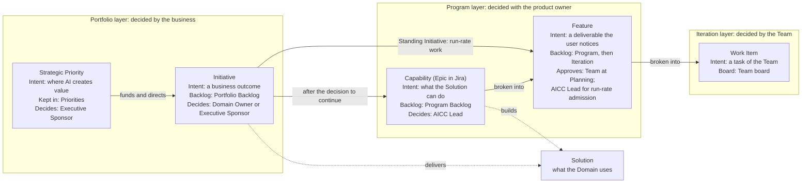

Figure 1: the levels of the work, by intent and by backlog.

3.3. Each level is worded as a short contract in the language of the business, so that the client, the Team, and the product owner read the same words. An Initiative and a Capability are worded as a hypothesis, which the work tests. A Feature is worded as a benefit hypothesis with its acceptance criteria. Acceptance criteria are written in the form Given, When, Then. The first of the following tables gives the parts of the wording and what each means, the second gives the wording of each level, and the third illustrates it.

| Part | Meaning | The question it answers |
| --- | --- | --- |
| For | The client or the user | Who is it for? |
| Need | The situation or the job to be done | What problem does it solve? |
| Proposal | The thing that is proposed, and its kind | What is it? |
| Value hypothesis | The benefit that we believe it will bring | Why does it matter? |
| Difference | How it is better than the way things are done now | Why is it better? |
| Leading indicator | An early measure, with its source, baseline, and target | How will we know early that it holds? |
| Scope | The smallest version that tests the hypothesis, and what is out | What is tried first? |
| Acceptance criteria | Given a situation, when an action is taken, then a result that can be observed | How is it accepted, by the product owner for a Feature or a Capability and by the Domain Owner for a Solution? |

| Level | For | Need | Proposal | Value hypothesis | Difference | Leading indicator | Scope | Acceptance criteria |
| --- | --- | --- | --- | --- | --- | --- | --- | --- |
| Initiative | [The client function] | who [need] | the [Initiative] is a [type of Solution] | that [value] | Unlike [the current way], ours [difference] | [Measure, source, baseline, target] | The MVP: [the smallest version, and what is out] | The outcome meets the leading indicators when it is reviewed, and the Domain Owner, or the Executive Sponsor for enabling work, accepts it |
| Capability | [The users of the Solution] | who [need] | the Solution can [capability] | so that [benefit] | | [Measure] | The Features that deliver it | Given [situation], when [action], then [result], for the Capability as a whole |
| Feature | [The user] | | [Feature] | We believe that it will [benefit] | | [Measure] | One Program Increment at most | Given [situation], when [action], then [result that can be observed] |

An illustration of the wording follows. It shows the form and is not a record.

| Level | Wording |
| --- | --- |
| Initiative | For the heads of functions who spend days each month compiling a recurring report by hand, the Reporting Service is a Service that drafts and publishes it. Unlike the manual compilation, ours is consistent and takes hours. We will know by the share of editions issued on time |
| Capability | For the analysts who prepare the report, the Solution can collect the figures from their governed sources, so that no figure is copied by hand |
| Feature | We believe that collecting the first three measures automatically will remove the hand copying of those measures for the analysts. Given a monthly cycle with the sources available, when the collection runs, then the three measures appear in the draft with their source and their date |

3.4. Figure 2 shows the flow of value from the intake to the life cycle of a Solution.

```mermaid
flowchart LR
  IN(["From above<br/>an Initiative continues, or a change is raised"]):::iface --> PB["Program Backlog<br/>Capabilities and Features, ranked"]
  PB --> RF["Refinement<br/>Features ready, acceptance criteria stated"]
  RF --> IB["Iteration Backlog<br/>selected at Iteration Planning;<br/>run-rate admitted at Weekly Review"]
  IB --> DV["Develop<br/>Work Items of the Team"]
  DV --> VF["Verify<br/>check or validation"]
  VF --> DP["Deploy<br/>to the environment of use"]
  DP --> AC["Accept the Feature<br/>the product owner"]
  AC --> TF["Team final acceptance<br/>the AICC Lead, before the first users"]
  TF --> FU["First users<br/>the Domain Owner judges and accepts the Solution"]
  FU --> RL["Release<br/>beyond the first users"]
  RL --> LC["Life cycle<br/>operate, evolve, retire"]
  LC -.new Capabilities and Features.-> PB
  AC -.returned.-> IB
  FU -.returned.-> IB
  classDef iface fill:#e8eefc,stroke:#5a6fa8,color:#111
```

Figure 2: the flow of value.

3.5. A Team delivers the work: a Solution Engineer with the Domain Expert, the Domain Owner, and the product owner. While the Team has up to three people (6.6) the AICC Lead is the product owner of the Team, and later the AICC Lead may name another person in the Appointments Record. AICC has the AICC Team, and a Domain may have its own Team. The AICC Lead ranks the Program Backlog, and the product owner orders the Iteration Backlog within that ranking. The Team pulls the Features in that order, decides how they are built, keeps the Iteration Backlog and the Team board current, and holds the events of the Iteration. The Domain Owner as the requester, or the Executive Sponsor for enabling work, states the business value of an item; the product owner accepts the Features and the Capabilities during development; and the Domain Owner accepts the Solution (7.3). The Team agrees who takes the Hats that the work needs (Operating Model 4.3).

## 4. Backlogs and boards

4.1. AICC keeps two backlogs at this level. The Program Backlog, also called the PI Backlog, holds the Capabilities and the Features, grouped under their Initiatives. Each Feature names its parent Capability or, for run-rate work, its Standing Initiative; it records its approval date and its acceptance or other terminal exit date for the flow measures of section 10. The Iteration Backlog holds the Features that the Teams work on in the Iteration. Each is ranked by value and urgency relative to effort, scored 1 to 5 for value, urgency, risk reduction or opportunity, and effort. The AICC Lead ranks the Program Backlog, the Domain Owner, or the Executive Sponsor for enabling work, states the business value of an item, and the product owner orders the Iteration Backlog. The backlogs change continuously, because much of the work depends on people and events outside AICC. A Capability may run over several Program Increments. A Feature closes within its Program Increment, or is split: the part that is done is a Feature that goes to review, and the rest is a new Feature in the next Program Increment, and the original Feature is Pivoted and linked to both. The items of a Program Increment state intent and direction, and what is done in an Iteration is decided in that Iteration.

4.2. Work flows as in Kanban. The Program Kanban shows the Capabilities and the Features by state, with the classes of service as lanes: Urgent, High priority, and Normal. The Limits on Work in Progress apply to the states, the lanes, and each Domain. The Team pulls an approved item only when the Limits on Work in Progress allow, and a Feature is approved only when its Dependencies are known. At each Iteration Planning the Team selects the Features for the month from the Program Backlog into its Iteration Backlog. The Weekly Review keeps them under control and admits run-rate Features under 5.2, within the same Limits on Work in Progress. An item that waits for a person or an event outside AICC is Waiting, and names its Dependency. When a Limit on Work in Progress is reached, the Team finishes an item before it starts another. A Waiting item keeps its column and its flag, and its days Waiting are counted. The columns of the Program Kanban are the states: Backlog is Proposed and Discovery, Ready is Approved, Active is Active and Completed, Review is Review, and Done is Accepted and Closed. The Team board shows the Work Items of the Iteration.

The following table outlines the boards, their steps, their lanes, their limits, the measures that are read from them, and the event at which each is read.

| Board | Shows | Columns | Stages shown | Lanes | Limit on Work in Progress | Measures | Read at |
| --- | --- | --- | --- | --- | --- | --- | --- |
| Portfolio Kanban | Initiatives | Funnel, Reviewing, Analyzing, Portfolio Backlog, MVP, Implementation, Done; Deferred, Rejected, and Pivoted are off the flow | Scoping, Business case, MVP, Implementation | None | The Initiatives that are Active, set by the AICC Lead | Time from a proposal to its approval, time from approval to acceptance, Active against the limit | Weekly Review; monthly Steering |
| Program Kanban | Capabilities and Features | Backlog, Ready, Active, Review, Done; Waiting is a state, shown as a flag on the boards, with its Dependency | Capability: Analysis, Implementation. Feature: Explore, Design, Develop, Verify, Deploy | Urgent, High priority, Normal | Per state, per lane, and per Domain, set by the Team | Features accepted in the Iteration, lead time from Approved to Accepted, cycle time, items by lane, Waiting items | Weekly Review; Iteration Review and Demo |
| Program Board | Capabilities and Features of a Program Increment, with their Dependencies and the Milestones (4.3) | Iteration 1, Iteration 2, Iteration 3, IP week | None; a cell holds the state planned or reached | None; one row for each Feature and one for the Milestones | None | Dependencies Met by their date; Dependencies and Milestones At risk | PI Planning; Weekly Review; PI Review and Demo |
| Team board | Work Items of the Iteration | Backlog, Ready, Active, Review, Done | The Stages of the Feature | None | Per person, set by the Team | Work Items closed, blockers | Daily Stand-up; Weekly Review |

4.3. The Program Board is the board of the dependencies of a Program Increment. It shows, for each Capability and Feature, the Iteration in which it is planned, its state, and what it needs from other items, Teams, functions, and persons. It also shows the Milestones of the Roadmap at the Iteration in which they fall. The AICC Lead builds it with the Teams at the PI Planning, and keeps it current at the Weekly Review. A Dependency is Open, Met, or At risk. A Milestone is At risk when a Feature or a Dependency that it needs is At risk, and what is At risk is raised to the monthly Steering. Figure 3 shows how the Program Board, its Dependencies, and the Milestones flow through a Program Increment, and the following table shows the form of the Program Board.

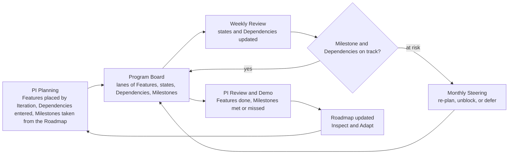

Figure 3: the Program Board through a Program Increment.

| Lane: Feature | Parent: Capability or Standing Initiative | Iteration 1 | Iteration 2 | Iteration 3 | IP week | Depends on | Dependency status |
| --- | --- | --- | --- | --- | --- | --- | --- |
| Milestone | The Roadmap | [Milestone and date] | | [Milestone and date] | | | |
| [Feature A] | [Capability X] | Active | Review | Done | | None | |
| [Feature B] | [Capability X] | Approved | Active | Review | Done | [Feature A] | Met |
| [Feature C] | [Capability Y] | Waiting | Active | Review | | [A function, a person, or another Team] | At risk |
| [Feature D] | [Capability Y] | | Approved | Active | Review | [Feature C] | Open |

The table is the form and holds no real data. A lane is one Feature, and a cell holds the state that the Feature is planned to reach, or has reached, in that Iteration. A Feature that is Waiting names its Dependency, and a Dependency that is At risk is raised to the monthly Steering.

4.4. The Roadmap shows three horizons: the current Program Increment as intent and direction, the next as planned, and the period beyond as indicative, with its Milestones. The PI Planning proposes it, and the quarterly Steering confirms it (Portfolio Management Model 4.3). The Dashboard shows the state of the Program Increment, the flow of the Program Kanban, the Dependencies at risk, the risks, and the Measures. The AICC Lead keeps the Roadmap, the Program Board, and the Dashboard current, and they are Records.

4.5. A Feature is ready when it is Approved under 5.2: its acceptance criteria are stated in the form of 3.3, and its Dependencies are known, with any open one named. A Feature is done when its result is tested by a person other than its builder, delivered to its user or environment of use, and accepted by the product owner (7.3(a)), and only then does it enter the Done column. A Feature that builds or changes a Solution meets the check or validation of 7.1, and a production deployment has its change ticket and test reference entered under 8.3. For work such as a document or training, the Feature references the delivered result and the evidence against its acceptance criteria. The Team shall keep, through the Backlog Refinement, one to two Iterations of ready Features ahead of its work.

## 5. States and Stages

5.1. Every Initiative, Solution, Capability, and Feature is in one of the states of the Vocabulary. A Strategic Priority is Proposed, Active, Closed, or Cancelled, as the Executive Sponsor decides. An item moves as the following table states. This table is the only source of the moves.

| From | To | When |
| --- | --- | --- |
| Proposed | Discovery | The AICC Lead takes it in: Initiatives, Solutions, and Capabilities, and Features at refinement |
| Proposed | Rejected, or Deferred | It is decided against at triage, or put on hold |
| Proposed | Cancelled | It is withdrawn without a decision on the merits |
| Discovery | Approved | The conditions of its level in section 5.2 are met, and its approver decides |
| Discovery | Waiting, Deferred, Rejected, Pivoted, or Cancelled | A Dependency blocks it; it is put on hold; it is decided against; it is rerouted into a new item; or it is withdrawn without a decision on the merits |
| Approved | Active | The Team pulls it, when the Limits on Work in Progress allow and its Dependencies are known. An Initiative becomes active when the AICC Lead pulls it into its MVP (Portfolio Management Model 5.2); a Standing Initiative becomes Active when its first approved run-rate Feature is pulled. A Solution becomes active when its first Capability or Feature is pulled |
| Approved | Waiting, Deferred, Pivoted, or Cancelled | As for Discovery |
| Active | Completed | The work is finished |
| Active | Waiting, Deferred, Pivoted, or Cancelled | As for Discovery |
| Active | Rejected | Only for an Initiative at the end of its MVP: the value is not seen (Portfolio Management Model 7.2) |
| Active | Closed | Only for a Solution: it is retired, handed off, or ended, as section 8.1 states |
| Active | Discovery | Only for a Solution: a change raises its Risk Tier or the check or the validation named it as requiring a new check, as the AI Policy states |
| Waiting | The state it came from | The Dependency is cleared |
| Waiting | Deferred or Cancelled | The Dependency will not clear, or the item is withdrawn without a decision on the merits |
| Deferred | Proposed | It is taken up again, and the keeper may resume it at the state it left |
| Deferred | Rejected or Cancelled | It is decided against, if it was never approved, or it is withdrawn without a decision on the merits |
| Completed | Review | The product owner assesses a Feature or a Capability against its acceptance criteria, and the Domain Owner, or the Executive Sponsor for enabling work, assesses the outcome of an Initiative against its criteria (7.3) |
| Review | Active, or Accepted, or Rejected | It is returned with what is missing; its criteria are met; or its outcome is not wanted |
| Review | Cancelled | It is withdrawn without a decision on the merits |
| Accepted | Closed | The item is finished |

5.2. A Stage is a phase of the work inside the discovery state or the active state of an item. The Stages of an Initiative are in the Portfolio Management Model 5.2. The Stages, the approver, and the conditions of each level are in the following table. The AICC Lead shall confirm that the conditions are met and note it in the backlog of the level, or in the Portfolio for a Solution.

| Level | Discovery Stages | Approved by, and conditions | Active Stages | To be completed |
| --- | --- | --- | --- | --- |
| Solution | Definition | The Domain Owner approves the Solution Definition, with its type, Receiver, scope, capabilities, architecture, and data classes. The Risk Tier is assigned by the AICC Lead and told to the Domain Owner; the AI Registry entry is made; for Risk Tier 2 and 3, the Control Function Contact of compliance confirms the applicable law; an Experiment has its time-box and a Service its run cost and sunset; for a Solution that the AICC Lead built, the Executive Sponsor approves the Solution Definition and assigns the Risk Tier (Operating Model 4.4) | Delivery, then the Stages of its type in section 8.1 | It is delivered, as section 8.1 states |
| Capability | Analysis: define the capability and break it into Features | The AICC Lead, with the Domain Owner consulted. Its Features are defined and ranked in the Program Backlog | Implementation | Its Features are closed |
| Feature | Explore, Design | The Team at Iteration Planning; for run-rate work, the AICC Lead at the Weekly Review under Business Model 4.8 and section 3.1. Its acceptance criteria are stated, and its Dependencies are known, with any open one named. A run-rate Feature is added to the current Iteration Backlog within its Limits on Work in Progress | Develop, Verify, Deploy | Its result is tested and delivered, with the check or validation where required. Product-owner acceptance follows in Review before it enters Done (4.5) |

Figure 4 shows the staging workflow of each level, from left to right: the Stages in boxes, the conditions that must be met to move on in diamonds, and the returns. Each condition is a condition of the Stages table, and in the tracker it is a condition of the workflow, with the Stage held in a field and the state in the status.

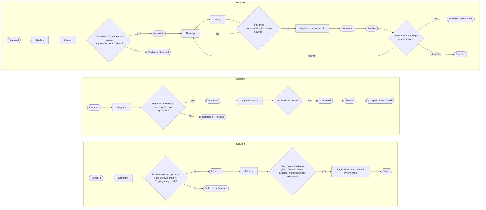

Figure 4: the staging workflow of the Feature, the Capability, and the Solution.

5.3. Rejected means decided against on the merits because the value is not seen, before approval or after the MVP of an Initiative, or when the outcome under review is not wanted. Cancelled means withdrawn without a decision on the merits, such as an error, a mistake, or a duplicate, and applies in any state from Proposed to Review except Completed. A suspension of a Solution is a flag on it and does not change its state. A stop by a Control Function is final and cancels the Solution. Retirement closes it, with no acceptance. The person who approves an item at its level also defers, rejects, cancels, or pivots it.

## 6. The cadence

6.1. Work runs in Program Increments. A Program Increment is one quarter, made of three Iterations. An Iteration is one calendar month of four or five whole weeks. The last week of the third Iteration of a Program Increment is the IP week, except that the Calendar Record may place it earlier and keep a year-end week free of events, as in an I12 of five weeks whose last week is the year-end week. The names are PIQ1 to PIQ4 with the year, I01 to I12, and W1 to W5. The Calendar Record states the dates of the whole year with the blocked and gray days, and the Cadence workflow states the general flow of the events by week, without dates, which is the template for the dated calendar of events. The work runs on four loops, each starting with planning and ending with review, and each loop takes its frame from the loop above it and returns its evidence to it. The following table states them.

| Loop | Cadence | Events | Participants | Decider | Records |
| --- | --- | --- | --- | --- | --- |
| Program Increment | Quarterly | PI Planning, PI Review and Demo, Inspect and Adapt, Innovation | The Teams, the Domain Owners of the Initiatives in work, the product owner, and the AICC Lead; the Executive Sponsor for enabling work | The Teams and the Domain Owners for the intent; the Executive Sponsor confirms the Roadmap | PI Objectives with their scores, Roadmap, Program Board, Quarterly Report |
| Iteration | Monthly | Iteration Planning, Iteration Review and Demo, Iteration Retrospective, Backlog Refinement | The Team with its product owner; at the Iteration Review and Demo also the Domain Owner of each live Solution, or the Executive Sponsor for a Service across Domains | The Team; the product owner accepts the Features and the Capabilities | Iteration Backlog, acceptances, review notes of the live Solutions |
| Week | Weekly | Weekly Planning, Weekly Review | The AICC Lead and the Solution Engineers | The AICC Lead | Dashboard, Program Board |
| Day | Daily | Daily Stand-up | The Team | The Team | The work items |

6.2. The Program Increment loop is the loop of the quarter. The PI Planning sets the intent and the direction of the Program Increment: the PI Objectives, the Features that the Program Increment aims at, the Program Board, and the proposed Roadmap. The three Iterations carry the work out. At the PI Planning the Domain Owner, or the Executive Sponsor for enabling work, scores the business value planned of each PI Objective from 1 to 10, and the Team rates its confidence from 1 to 5. The PI Review and Demo shows what the Program Increment delivered, and the same person scores the business value achieved of each PI Objective. Inspect and Adapt solves the main problems of the Program Increment and enters its improvements as Features in the Program Backlog, and the Innovation gives time to learn, to try, and to pay down what the Program Increment left. The IP week holds the PI Review and Demo, Inspect and Adapt, Innovation, and PI Planning in that order, and the quarterly Steering that ends the week confirms the PI Objectives and the Roadmap that the PI Planning proposed. The quarterly Steering that ends the IP week of PIQ4 does the same, and carries only the assurance loop and the portfolio review, because the yearly Steering of December has set the frame of the next year. The loop takes the Roadmap and the priorities of the portfolio review and the direction of the yearly Steering, hands the PI Objectives and the Program Board down to the Iteration loop, and returns the value scored and the data of the Quarterly Report to the quarterly Steering.


Figure 5: the Program Increment loop.

6.3. The Iteration loop is the loop of the month. The Iteration Planning takes the PI Objectives, selects the Features for the month into the Iteration Backlog, and sets the Iteration goal. The weeks carry the work out. The Iteration Review and Demo shows the working Features and Solutions to the product owner against their written acceptance criteria and takes the acceptance of the Features and the Capabilities. The Iteration Retrospective improves the way the Team works and ends with one or two improvements, which the Team enters as Work Items or Features. The Backlog Refinement keeps the next items ready (4.5), within the weekly sessions. The last week of an Iteration is its review week, except in the third Iteration of a Program Increment, where the IP week holds the review. The loop takes the PI Objectives and the Program Board, and returns the acceptances and the results to the Program Increment loop and to the monthly Steering.

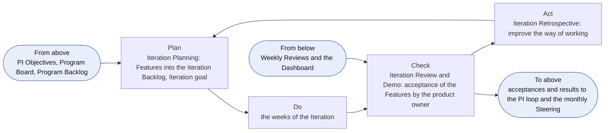

Figure 6: the Iteration loop.

6.4. The week loop and the day loop are the loops of the work. The Weekly Planning sets the focus of the week and checks the Dependencies. The Weekly Review controls the flow. It reads the Program Kanban, the Limits on Work in Progress, and the Dependencies. The AICC Lead reorders the Program Backlog and keeps the Dashboard current. The Daily Stand-up shares progress and clears blockers. The loop takes the Iteration Backlog and the Iteration goal, and returns the Dashboard and the open Dependencies to the Iteration loop.

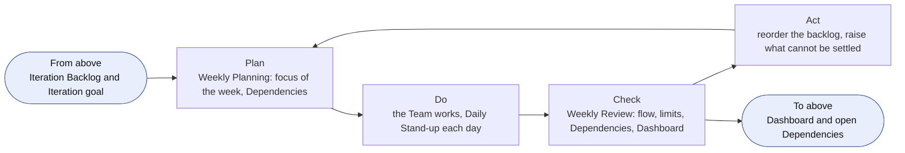

Figure 7: the week loop.

6.5. An event that falls on a blocked or gray day moves to the working day before it, and never after. When moved events meet on one day, the larger event keeps the day and the smaller one moves to the working day before it. Innovation is optional and is dropped first when days are lost. An event that is missed is not held later, and its intent is covered at the next event. The Weekly Review may be held in writing.

6.6. While the AICC Team has up to three people, AICC runs in light mode. The Weekly Planning and the Weekly Review are one session, held on the day of the Weekly Planning. The Iteration Retrospective and the monthly Steering are held in the Iteration Review and Demo, and Inspect and Adapt is held in the PI Review and Demo. The Daily Stand-up, the Backlog Refinement, and the Innovation are optional. In light mode Waiting stays a state, shown as a flag on the boards, Completed is skipped and an item goes from Active to Review, Accepted and Closed are one step with the acceptance recorded, Stages are used for Initiatives and Solutions only, and Work Items are not tracked in the charter. The AICC Lead is the product owner of the Team (3.5, 7.3). Everything else stays as stated.

6.7. The loops of this model run on the events that the control loops of the Operating Model 6 and the portfolio loops of the Portfolio Management Model 4 also use, and add no meeting. The Weekly Review is the operating loop and the backlog care loop, the monthly Steering takes the results of the Iteration Review and Demo, and the quarterly Steering takes the results of the PI Review and Demo. In the month that holds the IP week the quarterly Steering that ends the IP week is also the Steering of that month, and it carries the monthly control loop. The exception is December: the monthly Steering of December is held in the first two weeks as the yearly Steering (Operating Model 6.5), and the quarterly Steering that ends the IP week carries only the assurance loop and the portfolio review.

6.8. Each event has one intent, named participants, an input, an output, and a record, as the table of 6.1 states for its loop and the Cadence workflow shows for each event. The AICC Lead shall hold no other event for delivery.

6.9. Inside the loops of 6.1 the work runs on three loops, and the evidence returns on four feedback loops, as the following table states. They add no event.

| Loop | Kind | What it does | Where it runs | What it returns |
| --- | --- | --- | --- | --- |
| Exploration | Work | Explores the need and designs the Feature until it is ready (4.5) | Explore and Design, in the Backlog Refinement | Ready Features |
| Build | Work | Develops, integrates, and tests the Feature, and takes the check or the validation of the Solution (7.1) | Develop and Verify, in the weeks | Verified Features |
| Release | Work | Deploys the Feature, takes the acceptances, and releases the Solution beyond its first users (7.3, 7.4) | Deploy and Review, at the Iteration Review and Demo and the release | Accepted Features and released Solutions |
| Demonstration | Feedback | Shows working software against its written acceptance criteria | Iteration Review and Demo; PI Review and Demo | Acceptances and returned items |
| Retrospective | Feedback | Improves the way of working | Iteration Retrospective; Inspect and Adapt | Improvements as Work Items or Features |
| Live review | Feedback | Reads the four signals of each live Solution (8.4) | Iteration Review and Demo; quarterly Steering | Fixes, changes, transitions, and retirements |
| Measures | Feedback | Reads the flow, the quality, the health of what is live, and the value (10) | Weekly Review to the quarterly Steering | Problems for the Iteration Retrospective or Inspect and Adapt |

## 7. Verification, release, and acceptance

Figure 8 shows how a Feature is verified, deployed, and accepted by the product owner, and how a Solution passes the final acceptance of the Team and the judgment of the Domain Owner before it is released beyond its first users.

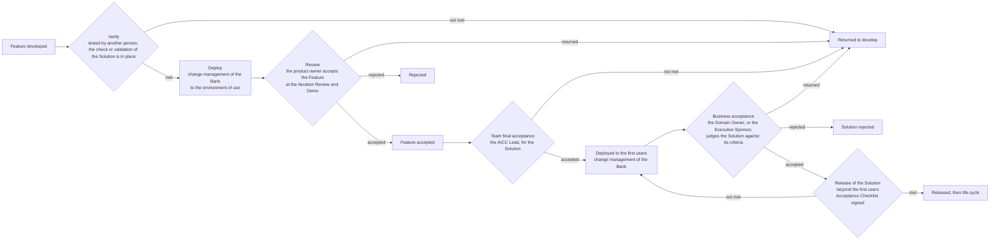

Figure 8: verification, deployment, the three levels of acceptance, and release.

7.1. Every Feature, and the MVP of an Initiative, shall be tested by a person other than its builder in an environment that is not production before it is deployed, and the result is referenced in the Feature. The Team integrates the work as it goes, and a Feature whose test fails returns to its builder the same day. The environment of use is the environment in which a Feature runs for its users: an environment that is not production until the Solution is deployed to its first users, and production afterwards. The check for Risk Tier 1 and the validation by the Control Function Contacts for Risk Tier 2 and 3 attach to the Solution. They are taken in Verify of the first Feature that reaches real users or data, they cover the later Features unless a change requires a new one, which the AICC Lead shall decide and enter, with the reason, in the Solution Definition, and no deployment to real users or data comes before them.

A deployment to production is made under 8.3, and the access of a Solution Engineer to production is granted through the access process of the Bank. The first users are the users whom the Domain Owner names in the Solution Definition for the judgment of the Solution (7.3), and they shall be trained before use (AI Policy 2.1). The Team's final acceptance (7.3) comes before the first deployment of a Solution to its first users and before the deployment of each significant change (8.6). The release of a Solution beyond its first users is decided by the Domain Owner for Risk Tier 1 and 2 (the Executive Sponsor where the AICC Lead is the Domain Owner, Operating Model 4.4(d)), and by the Executive Sponsor for Risk Tier 3, after the check or the validation and the acceptance of the Solution (7.3), and is recorded in the release block of the Solution Definition. The Acceptance Checklist (7.4) is the record of every release beyond the first users, for a Service and a Product as for any Solution that AICC hands to a Domain.

7.2. The Control Function Contacts that this model and the AI Policy name shall take part when a Solution of Risk Tier 2 or 3 is defined and in its validation. The validation includes the security test against attacks on AI (AI Policy 3.3), and relies on the evidence, the logs, and the traces that the Platform Owner keeps.

7.3. Acceptance closes an item. It is given at three levels, each against the acceptance criteria and each noted with who and when.

(a) During development the product owner accepts each Feature and each Capability against its acceptance criteria, at the Iteration Review and Demo. The product owner may accept the item, return it with what is missing, or reject it when its outcome is not wanted, and the AICC Lead notes the acceptance in the backlog of the level. While the Team has up to three people (6.6) the AICC Lead is the product owner of the Team, and later the AICC Lead may name another person in the Appointments Record.

(b) Before a Solution, whether its working prototype or its final version, is provided and deployed to the Domain Owner for judgment, the AICC Lead shall give the final acceptance of the Team. The AICC Lead shall confirm that the Solution meets the acceptance criteria of its Solution Definition, that its tests are referenced (7.1), and that its check or validation is in place, and shall record who gave the acceptance and the date in the release block of the Solution Definition. It comes before the first deployment of the Solution to its first users and before the deployment of each significant change (8.6).

(c) The requester judges the working Solution deployed to its first users against the acceptance criteria in the Solution Definition, and shall accept it, return it with what is missing, or reject it when its outcome is not wanted. The requester is the Domain Owner for a Solution of a Domain, and the Executive Sponsor for an item that spans Domains, is enabling work of AICC, or is an Experiment that has no Domain. The decision is the acceptance of the Solution and, for an Engagement, of its Outcome Report, which records it, and it is entered in the release block of the Solution Definition with who decided and the date. The release beyond the first users is a separate decision (7.1, 7.4).

(d) The AICC Lead may give the acceptance of (a) and (b) for a Solution that the AICC Lead built, and shall not give the acceptance of (c), check or validate it, or release it (Operating Model 4.4(d)). This is an accepted limit while the Team is small, and it is recorded in the Risks and Issues. The controls that compensate for it are the test by a person other than the builder (7.1), the check or the validation by another person, the acceptance of the Domain Owner, the release decision, and the monthly sample of the Decisions of the AICC Lead by the Executive Sponsor.

7.4. When AICC hands a Solution to a Domain as ready for use at scale, before its release beyond the first users, the AICC Lead completes the Acceptance Checklist of the Solution. The checklist lists, for each party concerned, the items that the party confirms within its remit and signs: the Domain Owner, the Solution Engineer, the AICC Lead, the Checker, the Control Functions (model risk, compliance, information security, data protection, and legal), and the IT function that operates the Solution with the Platform Owner. For Risk Tier 1 the signatories are the Domain Owner, the Solution Engineer, and the Checker, and for Risk Tier 2 and 3 they also include the Control Functions of each remit concerned and the IT function (AI Policy 3.3). An item that is not met shall stop the release. The Domain Owner, who has accepted the Solution (7.3(c)), receives the checklist signed. A Domain adopts a Solution of Risk Tier 1 or 2 on its own risk, within the AI Risk Appetite Statement. A Solution of Risk Tier 3, which is of high impact and risk, is adopted only with the signature of the Executive Sponsor, who accepts the risk and releases it. The checklist is not used during development or trials, where 7.1 applies, and a change after the release that requires a new check or validation brings a new checklist. It adds no approval of its own: the decisions are those that the AI Policy and this model state.

7.5. The person who builds a Feature or a Solution shall not test, check, or validate it. The requester who gives the business acceptance of a Solution is not from AICC, and the person who releases a Solution owns its results. The one accepted limit to these separations is that of 7.3(d).

## 8. Life-cycle management

8.1. A Solution has one offering type, which sets its life after delivery. A Solution is delivered when its first deployment is released. The Initiative is complete once its Solutions are delivered and its outcome is reviewed, and a Service and a Product go on under their own type. A Solution is Active from the start of its delivery to the end of its life, and it is Closed when it is retired, handed off, or ended. The Receiver is named in the Solution Definition before the Solution is approved, and an Experiment may name "none yet, to be asked". The following table states the types.

| Type | Owner after delivery | Stages after delivery | End |
| --- | --- | --- | --- |
| Service | AICC, for the whole life cycle, with a business case that states the run cost and a sunset rule. The Domain Owner of the Domain it serves accepts and reviews it, and the Executive Sponsor does for a Service across Domains | Operate, Evolve, Retire, refined by the service steps of 8.8. New features come as Capabilities and Features | Retired, handed over to an IT function of the Bank (8.11), or cancelled |
| Product | The consumer owns the version delivered, and AICC supports it on demand | Handover, Support, Revise (a new version comes through the Portfolio Backlog), Retire for that consumer. A Product with a second consumer or recurring requests gives rise to a Service under 8.12 | Retired for that consumer |
| Experiment | None yet: it is time-boxed to a stated number of Iterations, and ends in a Proposal. The Executive Sponsor accepts it when it has no Domain, and otherwise the Domain Owner does | Trial, Proposal, Handover | At the end of its time-box it goes to review: it is accepted with its lessons and closed, a Proposal is made, or it is rejected. When a Receiver accepts the Handover, it is closed and AICC oversees the Adopted Solution |

The phases of an Engagement map to the items as follows: the study is the discovery of the Initiative, the proof is the Experiment or the first Features of the Solution, delivery is the active state of the Capabilities and Features, and support is the life of the Solution after delivery.

Figure 9 shows the life of a Solution by type, as the Stages in sequence, with the exits.

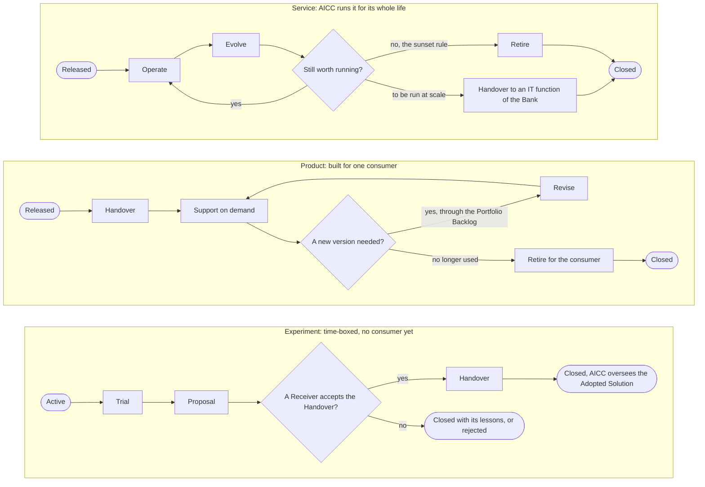

Figure 9: the life of a Solution by type.

8.2. AICC oversees and reports on the Adopted Solutions that others deliver, in the Portfolio, as a Solution Definition marked as an Adopted Solution with its Receiver as owner. It is recorded when others begin to deliver a Solution that AICC proposed or oversees. It uses the states Proposed, Approved, Active, Closed, Rejected, and Cancelled, and records the Risk Tier when it is known. The owners and the Executive Sponsor decide on a Proposal of a Solution, and the Bank decides on a Proposal of the AI adoption strategy. The AI adoption strategy is a series of Proposals that AICC shapes from what it learns, and the AICC Lead prepares its yearly Proposal and the Executive Sponsor presents it (Operating Model 6.5). The AICC Lead reviews the Adopted Solutions at each quarterly Steering, and the Quarterly Report records the review (C-20). Each quarter the AICC Lead shall also reconcile the AI Registry with the AI uses that run in the Bank, and the Quarterly Report records the result.

### Deployment

8.3. A Feature is deployed to the environment of use after its test and its check or validation (7.1). The deployment of the Solution to its first users, and of each significant change (8.6), follows the final acceptance of the Team (7.3(b)). A deployment to production follows the change management of the Bank. The Solution Engineer shall raise the change in it, enter the change ticket and the test result in the Feature, and deploy through the access process of the Bank. For the first deployment of a Solution the key of the change ticket and the reference of the test are also entered in the release block of the Solution Definition. The Platform Owner provides the logging and the monitoring (AI Policy 3.5). If a deployment fails or does harm, it is rolled back as the change management of the Bank requires, and the event is handled as an incident. The deployment of the Solution to its first users is its first deployment to production and makes the Feature available to them, and the release beyond them is decided under 7.4. Figure 10 shows the flow.

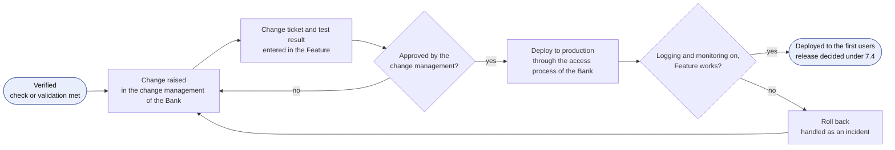

Figure 10: the deployment of a Feature.

### Operation

8.4. The IT function that operates a Solution runs it (AI Policy 5.3). For a Service that AICC runs, the Solution Engineer acts as that function. The operation is a loop. The plan sets the support level of the Service Agreement and the monitoring at the release. The do runs the Solution, answers the requests, and handles the incidents. The check is the review by the Domain Owner, or by the Executive Sponsor for a Service across Domains, at each Iteration Review and Demo, of the four signals of the Solution, which are its service levels, its incidents including the AI Incidents, its use, and its cost, and of the notices of its providers. The reviewer shall note the review in the Solution Definition. The AICC Lead carries the reading into the Quarterly Report, and for a Service it is applied to the sunset rule (8.11). The act fixes, changes (8.6), or retires (8.7) the Solution. The loop takes the support level and the release, returns the review to the Iteration loop, and passes an AI Incident to the event loop of the Operating Model 6. The change management of the Bank approves each production change of a Service that AICC runs, and the monitoring of the Platform Owner and the review of the Domain Owner are its independent checks. Backup and recovery are those of the AI Platform and of the Bank, and are named in the Solution Definition.

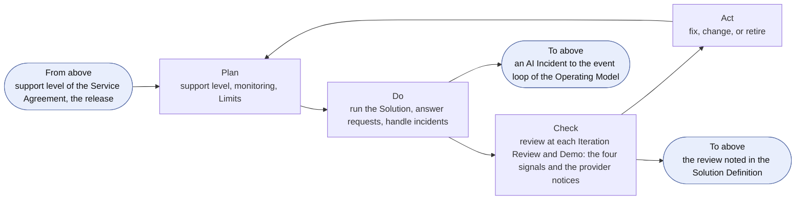

Figure 11: the operating loop of a live Solution.

8.5. Requests and incidents about a Solution come to the queue of AICC in Service Management, and the response targets of the Service Agreement are targets and not guarantees. A request is triaged by its class of service, handled, and closed. The Solution Engineer triages, and the AICC Lead decides a class in doubt. Unless the Service Agreement states otherwise, Urgent means that the Solution is down or that a wrong output reaches people, with a response within the day; High priority means that a consumer is blocked with a date, with a response within the week; and Normal is every other request. Every outage or failure of a Solution is raised in the incident management of the Bank, and an AI Incident is handled there, with the AICC Lead as a stakeholder (AI Policy 5). A request for a new feature enters the Program Backlog. A Product is supported on demand, and a Service at the agreed response targets. Figure 12 shows the flow.

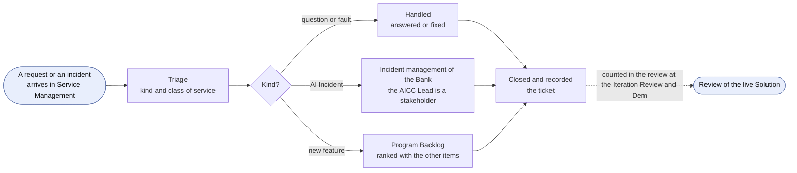

Figure 12: the support of a live Solution.

### Change and retirement

8.6. A change to a released Solution is a Feature, and it is verified and deployed as any Feature is. A change of model, provider, data class, degree of autonomy, or any attribute of the Risk Tier is significant. The AICC Lead shall decide whether a change requires a new check or validation, and shall enter the decision in the Decision Log. A significant change is released as 7.1 states, by the Domain Owner, or by the Executive Sponsor for Risk Tier 3, and any other change is accepted as a Feature. An emergency change follows the emergency procedure of the change management of the Bank (8.3), and the AICC Lead authorizes it for AICC. The Executive Sponsor reviews it within five working days and it is entered in the Decision Log, and for Risk Tier 3 the Control Function Contacts are told. A change of terms or of model by a provider is a change under this clause. Figure 13 shows the loop of a change.

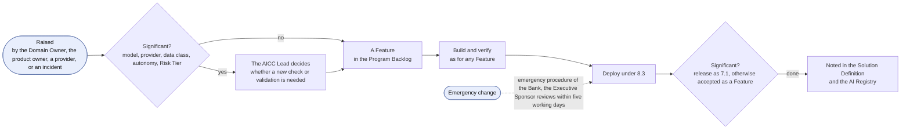

Figure 13: the loop of a change to a released Solution.

8.7. Before a Solution is Closed as retired, the Solution Engineer shall remove the access and the credentials, the data and the logs shall be kept or deleted under the retention rules of the Bank, and the AI Registry entry shall be marked retired. The Domain Owner, or the Executive Sponsor for a Service across Domains, approves the retirement, and the approval is entered in the Solution Definition. The same steps apply before a Solution that had real users or data is Cancelled, and the Solution Engineer enters in the Solution Definition the date on which the access was removed and the data was handled.

### The life of a Service

8.8. A Service passes through the service steps of the following table. The service steps refine the Stages Operate, Evolve, and Retire and are not states: the Service stays Active under 5.1 until it is Closed. The Solution Engineer shall enter the service step and the date on which it was reached in the Solution Definition and the AI Registry.

| Service step | Stage | Question | Signals read | Action | Gate to the next step |
| --- | --- | --- | --- | --- | --- |
| Admitted | Operate | Is the Service ready for its first request? | None yet; the run cost and the sunset rule of its business case | Make the catalog entry, issue the Service Agreement, and open the queue (8.9) | The three are in place; the AICC Lead confirms |
| Catalogued | Operate | Does it serve its first requests at the response targets? | Service levels; incidents | Serve the first requests, and set the alert levels of the monitoring | The first request served within its target |
| In service | Operate | Is it healthy, used, and worth its run cost? | The four signals (8.4) | Run it under the practices of 8.10, and review it at each Iteration Review and Demo | A change is needed: Improving. The reading calls for a transition: Transition planned |
| Improving | Evolve | Does the change correct what the signals show? | The signal that called for the change | A change as a Feature (8.6) | The change accepted, or released where it is significant: In service |
| Transition planned | Evolve | Should the Bank run it at scale, or should it end? | The four signals against the business case and the sunset rule | A Proposal of Handover with a named Receiver, or a plan of retirement (8.11) | The decision of 8.11 |
| Migrating | Retire | Have the users, the data, and the run moved without harm? | Service levels; incidents | Move the users and the run to the Receiver, or to what replaces the Service | The Receiver accepts the Handover, or the steps of 8.7 are done |
| Handed over or Retired | Retire | None | None | The Service is Closed under 5.1; after a Handover AICC oversees it as an Adopted Solution (8.2) | None |

8.9. Before a Service takes its first request, the AICC Lead shall confirm that its catalog entry is made in the Portfolio, that its Service Agreement states the response targets by class of service, and that its queue is open in Service Management.

8.10. The Solution Engineer shall operate a Service that AICC runs under the following practices, in proportion to its Risk Tier: request and incident handling (8.5); problem management, which takes the incidents or requests that repeat as a Feature in the Program Backlog; change enablement (8.6); knowledge, with the known errors and the user guide referenced in the Solution Definition; service levels against the Service Agreement; the run cost against the business case; and the fallback and the exit of each supplier. In light mode (6.6) a Service has one queue, one weekly session handles its requests and its problems, and the practices are kept as a checklist in the Solution Definition.

8.11. A Service that the Bank should run at scale is handed over to an IT function of the Bank, on a Proposal that names the Receiver, and it is Closed as handed off when the Receiver accepts the Handover. The Domain Owner, or the Executive Sponsor for a Service across Domains, decides the transition of a Service, to hand it over or to retire it under its sunset rule, on the reading of its four signals at the quarterly Steering, and the AICC Lead shall enter the decision in the Decision Log and the Solution Definition.

8.12. A Package or a Product becomes a Service when it has a second consumer, a business case that states its run cost and its sunset rule, approved under Portfolio Management Model 6.3, and a named owner. The Service is a new Solution with its own Solution Definition, so that each Solution keeps one offering type, and a Product is retired for its consumer once the Service serves that consumer.

### Experiment and the Lab

8.13. An Experiment runs in the Lab, the isolated environment of AICC for Experiments, and the Solution Engineer shall run it under the following rules.

(a) The Lab is an environment and not an authority. The decisions on an Experiment are those of this model and the AI Policy.

(b) Data enters the Lab only as read-only extracts under the classification of the Bank, each source with a named owner, and nothing is written back to a source.

(c) Personal data is minimized and assessed with the Control Function Contact of data protection before it enters the Lab.

(d) A cloud or external environment used as the Lab is a provider, and it is checked under AI Policy 4.1 before use.

(e) An Experiment ends at the close of its time-box and goes to review, as 8.1 states.

(f) The AICC Lead keeps the guardrails of the Lab, with the evidence of each, in the Standards Record, and the quarterly Steering reviews them.

## 9. Records and controls

9.1. The records of this model are the Program Backlog, the Iteration Backlogs, the Program Board, the Roadmap, the Dashboard, the Calendar, and the PI Objectives with their scores (6.2), kept in the Registry; the Solution Definitions, kept in the Portfolio; and the Acceptance Checklists, the Control Sign-Offs, the AI Incident Reviews, and the Registry Snapshots, which are the evidence records.

9.2. The controls that this model carries, whose rules it states or whose evidence it keeps, are C-10, C-12, C-13, C-14, C-15, C-16, C-20, C-22, C-26, C-28, C-29, C-30, and C-31 of the Operating Model 8. The following table shows where each step of the life of a Solution is controlled.

| Step | Clause | Decides | Evidence | Control |
| --- | --- | --- | --- | --- |
| Approval of a Capability or a Feature | 3.1, 5.1 | AICC Lead; the Team | Program Backlog | None; working state, in the Registry until the cutover and then in Jira |
| Solution Definition and Risk Tier | 5.2 | Domain Owner approves; AICC Lead assigns the Tier; the Executive Sponsor for a Solution that the AICC Lead built | Solution Definition; AI Registry | C-12, C-15 |
| Verify, check or validation | 7.1 | Checker; Control Function Contacts | AI Registry entry; Control Sign-Off | C-13 |
| Deployment to production, and change | 8.3, 8.6 | Change management of the Bank; AICC Lead | Change ticket; Solution Definition | C-30 |
| Release | 7.1, 7.4 | Domain Owner; Executive Sponsor for Risk Tier 3, and where the AICC Lead is the Domain Owner | Release block; Acceptance Checklist | C-14, C-22 |
| Acceptance of a Feature or a Capability | 7.3(a) | Product owner | Backlog note | C-10 |
| Team final acceptance of a Solution | 7.3(b) | AICC Lead | Release block | C-10 |
| Business acceptance of a Solution | 7.3(c) | Domain Owner; Executive Sponsor for an item across Domains, enabling work, or an Experiment with no Domain | Release block; Outcome Report | C-10 |
| Operation and review | 8.4, 8.5, 8.10 | IT function; Domain Owner; Executive Sponsor for a Service across Domains | Service Management; Solution Definition | C-16, C-29 |
| Retirement | 8.7 | Domain Owner; Executive Sponsor | Solution Definition; AI Registry | C-31 |
| Transition of a Service | 8.11 | Domain Owner; Executive Sponsor for a Service across Domains | Decision Log; Proposal; Solution Definition | C-20, C-31 |

## 10. Measures

10.1. AICC measures its flow to control it and to improve it, and not to rank people. It works on Kanban, so it measures flow and does not measure velocity, story points, or the output of a person. A measure has a definition, a source, a place where it is read, and a target that the Team sets with the product owner once it has a baseline. A figure of the Bank stays in its source, and the records point to it. The Dashboard shows the measures (4.4). Times are counted in calendar days and read as the median and the 85th percentile. No measure is used to rank people, and a measure that falls is a problem for the Iteration Retrospective or Inspect and Adapt, and not a reason to add a gate. In light mode (6.6) cycle time runs from Active to Review, and Verify and Deploy are read from the check record and the change ticket.

10.2. The following table states how each stage is measured and where the measure is read.

| Stage | What is measured | Measure | Read at |
| --- | --- | --- | --- |
| Funnel | How long a need waits | The age of the oldest item; the items in the funnel | Weekly Review |
| Reviewing, Analyzing | How long a business case takes to be decided | Time from a proposal to its approval; business cases returned | Monthly Steering |
| Portfolio Backlog | Demand against the limit | Approved Initiatives waiting; days waiting; Active against the limit | Monthly Steering |
| MVP | Whether the hypothesis holds | The leading indicators against the plan | End of the MVP; quarterly Steering |
| Implementation, Done | Whether the value arrived | The benefit confirmed against the benefit claimed and against the Envelope | Quarterly Steering |
| Explore, Design | Readiness for the next Iteration | The Features that are ready, in Iterations of work ahead | Backlog Refinement; Iteration Planning |
| Develop | The flow of the work | Cycle time; work in progress and its age; Waiting items and days Waiting; flow efficiency; expected lead time | Weekly Review |
| Verify | Quality at the gate | The share that meets the check or the validation first time; the items returned; the defects found in operation after the check | Weekly Review; Iteration Review and Demo |
| Deploy | The safety and the pace of the change | The change failure rate; rollbacks; emergency changes; deployment frequency | Iteration Review and Demo |
| Release | The readiness to go beyond the first users | Time from verified to released; items of the Acceptance Checklist not met | Iteration Review and Demo |
| Review | Value accepted | Features accepted by the product owner against Features selected; accepted first time; time from Completed to Accepted | Iteration Review and Demo |
| Program Increment | Predictability | PI predictability; Dependencies Met by their date | PI Review and Demo |
| Operate | The health of the service | The four signals: availability and requests within target; incidents and repeats, and time to restore; use; run cost | Iteration Review and Demo; quarterly Steering |
| Evolve | The health of change | Lead time of a change | Iteration Review and Demo |
| Retire | Completeness | Retirements complete: access removed, data handled, registry entry marked | When the Solution is retired |

10.3. The measures are defined as follows, each with its target rule. Where the target rule says "Baseline", the Team sets the target with the product owner once the measure has a baseline (10.1).

| Measure | Definition | Target rule |
| --- | --- | --- |
| Lead time | Days from Approved to Accepted | Baseline |
| Expected lead time | The average number of approved Features not yet Accepted or otherwise closed, divided by the number of Features Accepted per calendar day over the same observation period. Count Features only, including those in Ready, Active, Completed, Review, or Waiting; retain a Feature returned or deferred after approval until it leaves the measured flow. The result is in calendar days | Read against the lead time; no target. Use only for a sufficiently stable flow with no material non-acceptance exits; report not available when throughput is zero or the observation period is insufficient |
| Cycle time | Days from Active to Completed, or to Review in light mode | Baseline |
| Flow efficiency | The days that an item is Active and not Waiting, divided by its lead time | Baseline |
| Throughput | The Features accepted in an Iteration | Trend; no target |
| Work in progress, and its age | The items that are Active, and the days that each has been Active | An item older than the 85th percentile of the age in its column is raised at the Weekly Review |
| Waiting time | The days that an item is Waiting on a Dependency | Every Waiting item names its Dependency |
| Items by lane | The items in each lane of the Program Kanban: Urgent, High priority, and Normal | Urgent is rare; a lasting rise is raised at the Iteration Retrospective |
| Ready ahead | The ready Features (4.5) in the Program Backlog, in Iterations of work at the current throughput | One to two Iterations (4.5) |
| First-time-right rate | The share of items that meet the Verify or the Review at the first attempt | Baseline |
| Items returned by reason | The items returned at the Verify or the Review, counted by the reason entered | Baseline; a repeated reason is raised at the Iteration Retrospective |
| Defects after the check | The defects found in a Solution in operation after its check or validation | Each one is read at the next reassessment of the Risk Tier (AI Policy 3.3) |
| Time from verified to released | Days from the check or the validation of a Solution to its release beyond the first users | Baseline |
| Acceptance Checklist items not met | The items marked Not met in the Acceptance Checklists of the period | Each one stops the release (7.4) |
| Time from Completed to Accepted | Days from Completed to Accepted | Within the Iteration |
| Features accepted against selected | The Features selected at Iteration Planning and accepted by the product owner within that Iteration, divided by all Features selected at that Planning. Features admitted later, including run-rate work, are shown separately as admitted and accepted counts | A steady gap shows over-selection and is raised at the Iteration Retrospective |
| PI predictability | The business value achieved divided by the business value planned, summed over the PI Objectives of the Program Increment, as scored under 6.2 | Read as a band over the Program Increments, with no target, as the PI Objectives are not a promise (2.2) |
| Dependency timeliness | The share of the Dependencies that are Met by the date on which they are needed | Baseline |
| Deployment frequency | The deployments to production in an Iteration | Trend; no target |
| Change failure rate | The share of deployments and changes that are rolled back or cause an incident | Set in the Service Agreement (10.4) |
| Lead time of a change | Days from Active to the deployment to production of a Feature that changes a released Solution | Baseline |
| Availability | The share of the agreed service time during which the Solution is available | Set in the Service Agreement (10.4) |
| Time to restore | The time from the detection of an incident to the restoration of the service | Set in the Service Agreement (10.4) |
| Response time, and resolution time | The time from a request to its first answer, and to its closure, against the target of its class | The target of the class (8.5, 10.4) |
| Requests within target | The share of the requests answered and closed within the target of their class | Baseline |
| Incidents and repeats | The incidents of a Solution by Severity, and the share that repeat an earlier incident with the same cause | A repeat is taken into problem management (8.10) |
| Use | The users who use the Solution each week | Trend against the users stated in the Solution Definition |
| Run cost | The cost of running a Service in a period, read from its source, against the run cost of its business case | When the run cost exceeds the benefit, the sunset rule is applied (8.11) |
| Human override and correction rate | The share of AI outputs that a person overrides or corrects, against the baseline | A rate that is very high or very low is raised at the review of the live Solution (8.4) |
| Retirements complete | The share of the retired Solutions whose access is removed, data handled, and AI Registry entry marked | All (8.7) |

10.4. The service levels of a live Solution are set in its Service Agreement, and they are targets and not guarantees (Business Model 4.2). The following table gives examples of the service levels and of the measures of the operation, with the targets left to each Service Agreement.

| Service level | Example measure | Target |
| --- | --- | --- |
| Availability | The share of the agreed hours in which the service is available | [Set in the Service Agreement] |
| Response to a request | Time to the first answer, by class of service: Urgent, High priority, Normal | [Set per class, or the default of 8.5] |
| Resolution of a request | Time to closure, by class of service | [Set per class] |
| Restoration after an incident | Time to restore, by severity | [Set per severity] |
| Quality of the output | The human override and correction rate, and the error rate against the baseline | [Baseline and trend] |
| Use | The users who use the Solution each week | [Trend] |
| Change | The change failure rate | [Set in the Service Agreement] |
| Cost | The run cost against the business case | [Set in the business case] |

10.5. The AICC Lead owns the definition of each measure, and adds, changes, or removes a measure by a Decision taken at the monthly Steering and entered in the Decision Log. The AICC Lead shall remove a measure that is not read for two Program Increments.

## Change log

| Revision | Date | Change | Decision |
| --- | --- | --- | --- |
| 1.0 | 2026-10-02 | Baseline. | DR-2026-060 |
| 2.0 | 2026-10-03 | Added the definitions of ready and done, the Program Board on the boards, the participants of the events with the work and feedback loops, the separations, the service steps with the four signals and the Handover of a Service to an IT function of the Bank, the service operations practices and the default meaning of the classes of service, the rules of the Lab, and the measures with their target rules and governance; the Domain Owner states the business value of an item. | DR-2026-062 |
| 2.1 | 2026-10-03 | Corrected the units and population of expected lead time; completed the run-rate approval, parent, record, and delivery path; distinguished the Planning selection from later admissions in the acceptance measure. | none (correction under Document Catalog 4.2) |
