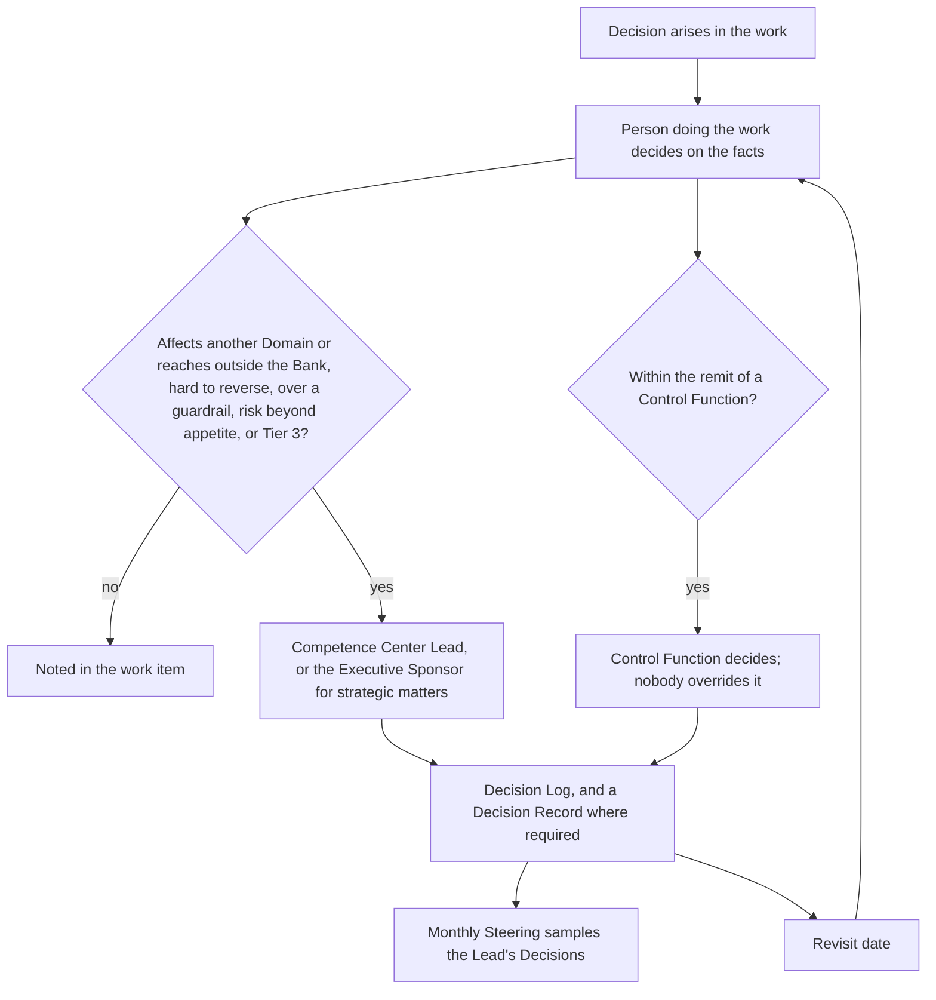
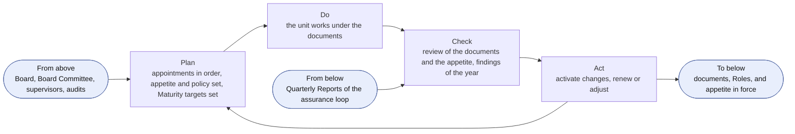
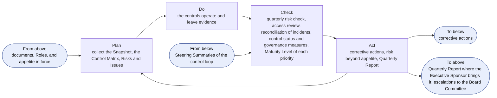
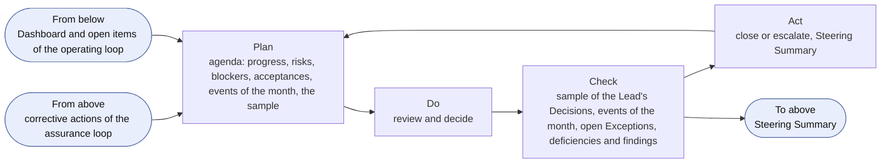
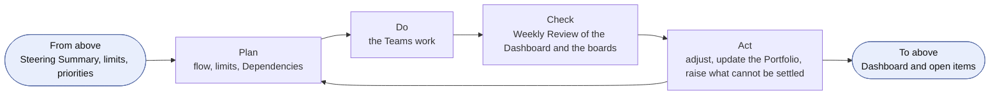
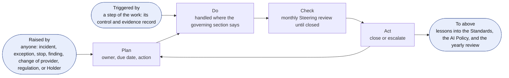
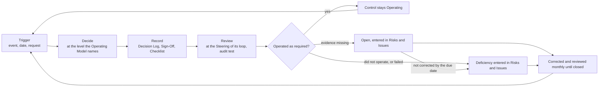
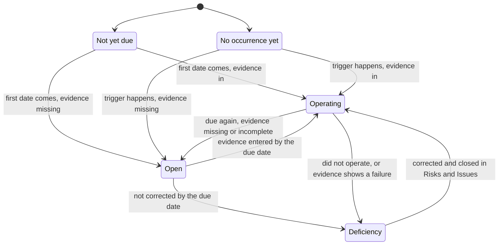

```yaml
id: AICC-ORG-01-EN
title: Operating Model
status: active
revision: 2.2
created: 2026-10-02
revised: 2026-10-07
```

# Operating Model

## 1. Purpose and scope

1.1. This Operating Model states how the Competence Center is governed and controlled as a unit of the Bank: who does what, how Decisions are taken, how the control loop runs, and what is kept on record and tested.

1.2. It applies to the Competence Center and to the Domains and Control Functions of the Bank that work with the Competence Center.

1.3. The Portfolio Management Model states how the Initiatives are taken in, funded, and stopped, and the Solution Lifecycle Model states how the work moves from the Program Backlog to the retirement of a Solution and how it is paced. They work within this Operating Model, and this Operating Model prevails. The workflows of the charter show how the loops run: the engagement, the portfolio and service delivery, the cadence, the collaboration tooling, the unit governance, and the AI risk and control. They state no rule of their own.

1.4. A figure in this Operating Model illustrates a clause and states no rule of its own. Where a figure and a clause differ, the clause prevails.

## 2. What the Competence Center is

2.1. The Business Model states what the Competence Center is. In this Operating Model the Competence Center is a joint team, led by the Competence Center Lead and formed of the people whom the functions of the Bank assign to it, who work together with the Domains.

2.2. The Competence Center does not own the AI Platform or the business results of the Domains, and the Competence Center owns a Service that it runs (Solution Lifecycle Model 8.1). The Domains execute. The Competence Center directs, guides, and may supply Solution Engineers to build and run Solutions.

2.3. The Competence Center is not a Control Function. The Control Functions are independent of it, and keep their own accountability for their remit.

2.4. The Competence Center works within the three lines of the Bank. The Competence Center and the Domains own the risks of their work. The Control Functions set the rules of their remit, clear, validate, decide Exceptions, and may stop. Internal audit gives independent assurance.

## 3. Principles of work

3.1. The Competence Center works on the following principles.

(a) Decide where the facts are. The person closest to the work decides, on evidence.

(b) Keep decisions reversible where possible, and take reversible decisions quickly.

(c) Deliver at product speed within bank-grade control.

(d) Keep only the process and the records that someone uses, and remove the rest.

(e) Put outcomes before outputs, and collaboration before negotiation. The plan changes and the intent holds.

3.2. The Competence Center shall apply the Values and the Principles of the Statement of Intent.

## 4. Roles

4.1. The Competence Center uses seven Roles. One person may hold several Roles, and a Role may have several Holders, within the rules of separation in section 4.4.

4.2. The following table states each Role and what its Holder does and decides.

| Role | Does | Decides |
| --- | --- | --- |
| Executive Sponsor | Holds the mandate and the funding; appoints the Competence Center Lead and names the members of the AI Steering Committee; approves the Quarterly Report and decides whether to bring it to the Board Committee or the Board; tells the Board Committee of the escalations of Charter 7.2 | The Strategic Priorities, the Investment Envelopes, the Investment Guardrails, and the mix of Initiatives; the AI Risk Appetite Statement; the approval of a business case above a Guardrail, across Domains, or for enabling work, and the decision after its MVP to continue, pivot, defer, or reject it; the release of a Risk Tier 3 Solution; any risk beyond the AI Risk Appetite Statement; the retirement of a Service across Domains; the approval of AI output published outside the Competence Center; the business acceptance of an item that spans Domains, is enabling work of the Competence Center, or is an Experiment that has no Domain, and where the Competence Center Lead is the Domain Owner (Solution Lifecycle Model 7.3(c)); for a Solution that the Competence Center Lead built, the approval of its Solution Definition, its Risk Tier, and its use for a data class (4.4(d)); the naming of acting Contacts |
| Competence Center Lead | Leads the Competence Center as its lead engineer and architect; is accountable for this Operating Model and for every document and Record of the Competence Center; acts as the product owner of the Team while the Team has up to three people; prepares the Quarterly Report; presents to the AI Steering Committee | Taking an item into discovery, and deferring or rejecting it at triage; pulling an Initiative into work, and setting the limit on the Active Initiatives within the mix that the Executive Sponsor sets; the rank of the Program Backlog and of the Portfolio Backlog; the issue of a Service Agreement; the approval of Capabilities; the acceptance of Features and Capabilities, as the product owner while the Team has up to three people, and the final acceptance of the Team before a Solution is deployed to its first users (Solution Lifecycle Model 7.3); the approval of the use of a Solution in the Competence Center for a data class; the Risk Tier, which the Competence Center Lead tells to the Domain Owner, each except for a Solution that the Competence Center Lead built (4.4(d)); whether a change to a released Solution needs a new check or validation (Solution Lifecycle Model 8.6); the suspension of a Solution; standards, architecture, and Templates; questions between Domains; the activation of every document, on the decision of the Executive Sponsor where the AI Risk Appetite Statement is concerned; an Exception to a requirement set by the Competence Center |
| Solution Engineer | Owns a Solution end to end: designs it, decides its architecture, builds it, deploys it, and runs it with the Domains; keeps the work visible; coaches Domain Experts; checks the work of others | How a Solution is designed and built; the approval of Features at Iteration Planning; the order in which the team pulls work within the agreed ranking |
| Domain Owner | Owns the results of AI adoption in the Domain and, as the requester, states the value of an item and judges the working Solution; names the Domain Expert | Whether the Domain takes part in an Initiative; the approval of the business case of an Initiative within the Domain and below a Guardrail, and the decision after its MVP to continue, pivot, defer, or reject it; the approval of a Solution Definition; funding of the Solutions of the Domain from its Envelope, including their run, licenses, and provider costs; the approval of the use of a Solution in the Domain for a data class, and the approvals that the rules of the Bank require; the acceptance of a Solution of the Domain and of the outcome of an Initiative of the Domain, after the final acceptance of the Team (Solution Lifecycle Model 7.3(c)); the release of a Risk Tier 1 or 2 Solution, after the check or the validation; the retirement of a Solution |
| Domain Expert | Explains the routine work; works with the Solution Engineer; tries the Solution in real work; then scales adoption and trains colleagues | Nothing on funding, acceptance, or control |
| Control Function Contact | Advises on requirements; confirms, within its remit, the laws and regulations that apply to the use of AI in the Bank; may raise the Risk Tier within its remit, and the Contact of model risk alone may lower it; clears a business case that expects Risk Tier 2 or 3, and clears it again when the Risk Tier assigned is higher than the one cleared; validates Solutions; may suspend or stop a Solution | The clearance of a business case, validation, raising the Risk Tier, a suspension, a stop, and an Exception to a control requirement, each within the remit of the Control Function |
| Platform Owner | Provides and operates the AI Platform, outside the Competence Center, to the requirements in the Standards Record; keeps the evidence, logs, and traces on which the validation relies | The design of the AI Platform within those requirements |

4.3. The team of the Competence Center agrees who takes the Hats that the work needs, such as the keeper of the Program Backlog, the facilitator of the events, or the coach. A Hat is not a Role, changes when the team decides, and needs no appointment.

4.4. The rules of separation are as follows.

(a) No person shall validate or check work that the person built.

(b) The Domain Owner of a Solution accepts it as the requester (Solution Lifecycle Model 7.3(c)) and, for Risk Tier 1 and 2, releases it, and shall not validate it.

(c) A Control Function Contact is not a member of the Competence Center and shall not build Solutions that the Contact reviews.

(d) The Competence Center Lead may build a Solution, and shall not Check or validate a Solution that the Competence Center Lead built, shall not release it, and shall not give its business acceptance (Solution Lifecycle Model 7.3(c)). The Competence Center Lead may accept its Features and Capabilities and give the final acceptance of the Team as product owner (Solution Lifecycle Model 7.3), an accepted limit while the Team is small, with the compensating controls that Solution Lifecycle Model 7.3(d) states. Where the Competence Center Lead is the Domain Owner (4.6), the Executive Sponsor gives the business acceptance and the release, and otherwise the Domain Owner does. Where the Competence Center Lead built the Solution, the Executive Sponsor also approves its Solution Definition, assigns its Risk Tier, and approves its use for a data class (C-12, C-15). The Competence Center Lead shall not validate a Solution within the remit of a Control Function.

(e) A check by a person other than the builder is done by an engineer of the IT function or the Domain whom the Competence Center Lead names in the Appointments Record, until the Competence Center has a second Solution Engineer.

(f) Internal audit gives assurance only. It shall not validate, release, or stop, and has read access to every Record.

4.5. The AI Steering Committee is the group of the heads of the business, technology, risk, and compliance functions of the Bank. It advises the Executive Sponsor, who chairs it. It is formed of the heads whom the Executive Sponsor names, and a function joins when its head is named. The Board Committee oversees AI for the Board. It receives what the Executive Sponsor brings to it and the escalations of Charter 7.2. Neither is a Role.

4.6. The Holders of the Roles are named in the Appointments Record. The Board names the Executive Sponsor. The Executive Sponsor appoints the Competence Center Lead and names the members of the AI Steering Committee. The Competence Center Lead appoints the Solution Engineers from the people whom the functions assign to the Competence Center, with the consent of their line managers, which states the time that each person gives to the Competence Center, and names the Checker of a Risk Tier 1 Solution. The head of a Domain names the Domain Owner, and the Domain Owner names the Domain Expert. Each Control Function names its Control Function Contact. The head of technology names the Platform Owner. An appointer shall not appoint themselves to a Role: the next level appoints (5.7). For the work of the Competence Center itself, the Competence Center Lead is the Domain Owner, except for the business acceptance, the release, the approval of the Solution Definition, the assignment of the Risk Tier, and the approval of the use for a data class of a Solution that the Competence Center Lead built (4.4(d)).

4.7. Each Holder shall name a deputy in the Appointments Record, who acts during an absence. The Executive Sponsor may delegate a decision in writing, for a stated scope and period, except a decision under 5.4 and 5.7, and the delegation is entered in the Appointments Record. A delegation of more than two weeks is also entered in the Decision Log.

4.8. An Appointment missing on 2026-10-02 shall be made by 2026-12-01, and the Executive Sponsor names acting Holders meanwhile. The Competence Center Lead shall enter every appointment, including the naming of the Executive Sponsor from the decision of the Board, and every acting designation, change, and relief in the Appointments Record within five working days, with its date and its decision reference.

4.9. On appointment, the Holder shall accept the Role, declare any conflict of interest, name a deputy (4.7), read the documents, and complete the training that the Competence Center Lead sets for the Role, and the keeper of each tool grants the access that the Role needs (7.6). On a change or a relief, the keeper of each tool shall remove the access that the Role gave, and the Competence Center Lead records the previous Holder in the Appointments Record.

4.10. When the Competence Center has a second Solution Engineer, the check of 4.4(e) is done within the Competence Center, and the Executive Sponsor shall review the accepted limits of 4.4(d). When the Competence Center Team has a fourth person, light mode ends (Solution Lifecycle Model 6.6). A Domain may form its own Team with its own product owner, on the same cadence, boards, and rules, and the Competence Center Lead ranks the Program Backlog across the Teams and keeps the Program Board. Growth adds Holders and Teams, and no layer, meeting, or Record.

## 5. Decisions

5.1. A Decision is taken by the person who does the work, on the facts, at the moment it is needed. A Decision states the facts that it rests on, such as a measurement, a test result, a cost, or a source.

5.2. A Decision goes to a higher level only when at least one of the following is true.

(a) It affects another Domain, reaches outside the Bank, or sets a standard for others.

(b) It cannot be reversed without significant cost or harm.

(c) It exceeds an Investment Guardrail or changes a Strategic Priority.

(d) It accepts a risk beyond the AI Risk Appetite Statement, or concerns a Risk Tier 3 Solution.

5.3. The level is stated in the following table. A Decision goes to the level that section 4.2 names for the matter when a condition in 5.2 applies.

| Level | Who decides | Examples |
| --- | --- | --- |
| Team | The Solution Engineer, with the Domain Expert and Domain Owner; the product owner for the acceptance of a Feature or a Capability | Design, build, the order of pulling work within the ranking, the acceptance of a Feature or a Capability |
| Domain Owner | The Domain Owner | The business case and the decision after the MVP within one Domain and below a guardrail, a Solution Definition, the acceptance of a Solution, retirement of a Solution |
| Competence Center Lead | The Competence Center Lead | Taking an item into discovery, deferring or rejecting it at triage, pulling an Initiative and the limit on the Active Initiatives, the rank of the backlogs, the final acceptance of the Team before a Solution is deployed to its first users, the Risk Tier, whether a change to a released Solution needs a new check or validation, standards, Templates, questions between Domains |
| Executive Sponsor | The Executive Sponsor, after asking the AI Steering Committee | Strategic Priorities, funding, the mix of Initiatives, the business case above a guardrail or across Domains and the decision after its MVP (continue, pivot, defer, or reject an Initiative), release of a Risk Tier 3 Solution, risks beyond appetite, retirement of a Service across Domains |

Figure 1 shows how a Decision moves, and how it returns to the Steering as a sample and as a date to revisit.



Figure 1: the movement of a Decision.

5.4. A Control Function decides within its remit, and its validation or stop is final for that remit. Nobody shall override it. A disagreement goes to the head of that Control Function. The Executive Sponsor may raise it with executive management and shall not set a validation or a stop aside. A risk beyond the AI Risk Appetite Statement may be accepted only by the Executive Sponsor, who shall tell the Board Committee of it without waiting for any report (Charter 7.2). A stop is final. The person who suspended a Solution lifts the suspension when the facts allow. A suspension and its lifting are entered in the Decision Log with the reason, and a stop is recorded in the Control Sign-Off of the Contact.

5.5. Where the people concerned do not agree, the person who holds the decision under 5.3 decides after hearing them. The others then support the Decision. A dissent may be noted in the Decision Log.

5.6. A Decision at the Competence Center Lead level or above, and any Decision that others will need to find later, shall be entered in the Decision Log as one line: the date, the Decision, the facts, who decided, and when to revisit it. A Decision of the Executive Sponsor that is hard to reverse, and a Decision that section 8 names as evidenced by a Decision Record, also has a Decision Record. A Decision of the Team is noted in the work item.

5.7. A person with a conflict of interest on a Decision shall declare it and shall not decide. The next level decides.

5.8. The conditions of 5.2, the authority of 5.4, and the Decision Log of 5.6 apply alike to every matter, whatever its size.

## 6. The control loops

6.1. The control of the Competence Center as a unit runs on five loops. Each is a Plan, Do, Check, Act cycle with its own cadence and forum. A loop takes its frame from the loop above it, and returns its evidence to it. The loops run on the events of the Cadence and add no meeting. The portfolio loops of the Portfolio Management Model 4 run on the same events and govern the Initiatives; these loops govern the unit. Governance adds no meeting and keeps no Record beyond those of the work. Every control of section 8 is carried by at least one loop, and it is reviewed at the Steering of that loop; a control that only the operating loop or the event loop carries is reviewed at the monthly Steering. The following table states the loops.

| Loop | Cadence and forum | Decider | Controls it carries | Records |
| --- | --- | --- | --- | --- |
| Direction | Yearly, at the yearly Steering (the monthly Steering of December), for the next year | Executive Sponsor; the Competence Center Lead owns the documents | C-01, C-03, C-04, C-20, C-22; and C-02 in the strategic loop, which the yearly Steering also carries (6.5) | Decision Records, Appointments, Proposal |
| Assurance | Quarterly, at the quarterly Steering | Executive Sponsor | C-06, C-07, C-11, C-16, C-20, C-24, C-25, C-26, C-27, C-28 | Quarterly Report, Registry Snapshot |
| Control | Monthly, at the monthly Steering | Executive Sponsor; the Domain Owner for the acceptance of a Solution | C-05, C-17, C-29, C-32 | Steering Summary, Decision Log |
| Operating | Weekly, at the Weekly Review | Competence Center Lead | C-23; the Dashboard is a working record | Dashboard, Portfolio Backlog |
| Event | When an event happens, or a step of the work triggers a control | As this Operating Model states | C-01, C-08, C-09, C-10, C-12, C-13, C-14, C-15, C-16, C-17, C-18, C-19, C-21, C-22, C-27, C-28, C-30, C-31, C-32 | Risks and Issues, Decision Record, and the evidence record of each control |

### Meetings and bodies

6.2. A meeting runs with those who are named. While the AI Steering Committee is not formed, the Executive Sponsor decides alone. A record of an event is kept only for the Decisions and the actions, in the Steering Summary for a Steering, and otherwise in the work items and the Decision Log.

6.3. The Executive Sponsor chairs the Steering. The Competence Center Lead prepares it and attends, the Domain Owners whose matters are on the agenda and the Control Function Contacts attend, and the members of the AI Steering Committee advise. The members of the AI Steering Committee (4.5) are named in the Appointments Record. Its advice, and any dissent, is recorded in the Steering Summary. A head may be represented by a named deputy. If no head of a function attends, the Executive Sponsor may still decide, and the Steering Summary records the absence.

6.4. The Executive Sponsor may take a time-critical Decision between meetings after asking the heads of the risk and compliance functions and recording the answers.

### The direction loop

6.5. The Executive Sponsor shall run the direction loop once a year, at the yearly Steering, for the next year. The yearly Steering is the monthly Steering of December, held in the first two weeks of December, so that the frame of the next year is in force before the year starts. It is not an extra meeting: it carries the control loop and the portfolio sync as every monthly Steering does, and in addition the direction loop and the strategic loop. Its input is the Quarterly Report of PIQ3 and the findings of the year to that date, and a change that the result of PIQ4 calls for in the frame is taken at the first quarterly Steering of the next year. The plan confirms that the appointments are in order, sets the AI Risk Appetite Statement and the policy, and sets the targets of the Measures of the Maturity Levels for the next year (Charter 7.1). The check reviews each document of the charter and the AI Risk Appetite Statement, with the findings of the audits and the supervisors of the year to that date. The act activates the changes and renews or adjusts the appointments and the appetite. The Executive Sponsor decides the AI Risk Appetite Statement, and the Competence Center Lead activates the changes to the documents on that decision where the Statement is concerned, and otherwise as the Document Catalog 4 states. Each year the Competence Center Lead prepares a Proposal of the AI adoption strategy, the Executive Sponsor presents it at the yearly Steering, and the Bank decides on it. The Executive Sponsor calls an extra review on a material change in the use of AI, in a principal provider, or in regulation, or after an audit or supervisory finding. The loop sets the documents, the appointments, the appetite, and the policy in force for the assurance loop. The Strategic Priorities, the Envelopes, and the Guardrails are set in the strategic loop of the Portfolio Management Model 4.2, which the yearly Steering also carries, and the yearly Steering reviews C-02 there.



Figure 2: the direction loop.

In practice, the Competence Center Lead checks the documents and brings the changes and the findings of the year to date to the yearly Steering of December, for the next year. The Executive Sponsor decides the appetite and the Competence Center Lead activates the changes, and each activation and each decision on the appetite is entered in the Decision Log.

### The assurance loop

6.6. The Executive Sponsor shall run the assurance loop each quarter, at the quarterly Steering. The plan collects the evidence: the Registry Snapshot, the Control Matrix, and the Risks and Issues. The check is the quarterly risk check, which reviews the open Risks and Issues, the open Exceptions, the Risk Tier reassessments that are due, each Solution of Risk Tier 3, and the reliance on providers and on the Platform Owner. It also takes the access review of the Registry and the tools (7.6), reconciles the AI Incidents with the incident management of the Bank, reviews the status of each control in the Control Matrix and the governance measures (6.11), and confirms the Maturity Level of each Strategic Priority and the results of the Program Increment. The Control Function Contacts shall take part in it. The act decides the corrective actions, accepts or refuses a risk beyond the appetite, approves the Quarterly Report that the Competence Center Lead prepares, and decides whether the Executive Sponsor brings it to the Board Committee or the Board (Charter 7.2). The loop takes the documents and the appetite of the direction loop, hands the actions down to the control loop, and returns the Quarterly Report to the direction loop. The Quarterly Report reaches the Board Committee or the Board when the Executive Sponsor brings it there, and a risk accepted beyond the appetite always reaches the Board Committee. The quarterly Steering that ends the IP week of PIQ4 carries the assurance loop and the portfolio review only, and it sets no document, no appetite, no appointment, no Priority, no Envelope, and no Guardrail, because the yearly Steering of December has set them.



Figure 3: the assurance loop.

In practice, the Competence Center Lead brings the Quarterly Report and the Control Matrix to the quarterly Steering. The Control Function Contacts give their view within their remits, and the Executive Sponsor decides the actions. A risk beyond the appetite is accepted only by the Executive Sponsor, who tells the Board Committee of it without waiting for any report.

### The control loop of the month

6.7. The Executive Sponsor shall run the control loop each month, at the monthly Steering, and the Competence Center Lead prepares it. In the month that holds the IP week there is no separate monthly Steering: the quarterly Steering that ends the IP week is also that month's Steering and carries the control loop. The exception is December: the monthly Steering of December is held in the first two weeks as the yearly Steering (6.5), and the quarterly Steering that ends the IP week carries only the assurance loop (6.6). The plan sets the agenda: progress, risks, blockers, the acceptances, the events of the month, and the sample. The check reviews a sample of at least three Decisions of the Competence Center Lead, chosen by the Executive Sponsor, and records the share found in order; the events of the month and the controls that they triggered (6.9); the open Exceptions until they expire; the review of the live Solutions at the Iteration Review and Demo; and the deficiencies and the findings until they are closed (8.2). The act closes or escalates each item and records the Decisions and the actions in the Steering Summary. The loop takes the corrective actions of the assurance loop, and returns the Steering Summary to it.



Figure 4: the control loop of the month.

In practice, the Executive Sponsor picks the Decisions to read from the Decision Log and reads the facts behind each. An Exception that has expired, and a deficiency that is overdue, are decided at once. The Steering Summary is the evidence.

### The operating loop of the week

6.8. The Competence Center Lead shall run the operating loop each week, at the Weekly Review, which is one session with the Weekly Planning in light mode. The Competence Center Lead and the Team attend it. The plan reads the flow, the Limits on Work in Progress, and the Dependencies. The check is the Weekly Review of the Dashboard and of the boards. The act adjusts the work, updates the Portfolio, and raises to the monthly Steering what cannot be settled. The care of the Portfolio Backlog is in the Portfolio Management Model 4.5, and the flow of the work is in the Solution Lifecycle Model.



Figure 5: the operating loop of the week.

In practice, the Competence Center Lead keeps the Dashboard and the boards current, and an item that waits on someone outside the Competence Center names its Dependency.

### The event loop

6.9. An event that is not on the calendar shall enter the Risks and Issues Record with an owner and a due date, and it runs the same cycle until it is closed. The events are an AI Incident and an Exception (the AI Policy), a stop or a suspension and a risk beyond the appetite (5.4), a change of provider or regulation, a finding of an audit or a supervisor (8.2), and a change of a Holder (4.6 to 4.8). The plan gives the item its owner and its due date. The do handles it where the section that governs it says. The check is the monthly Steering, which reviews it until it is closed. The act closes it, or escalates it, and the lessons go into the Standards, the AI Policy, and the yearly review. Anyone may raise an event, and the owner may be in any Role. The event loop also carries the controls that a step of the work triggers, such as an Engagement taken in, a business case, a Risk Tier, a check or a validation, a release, a use for a data class, a provider, a deployment or a change, a sharing of data, a published output, and a retirement. Each leaves its own evidence record, enters the Risks and Issues Record only when it is Open or in Deficiency (8.2), and is reviewed at the monthly Steering among the events of the month.



Figure 6: the event loop.

In practice, an AI Incident is handled in the incident management of the Bank, with the Competence Center Lead as a stakeholder, and the record in the Risks and Issues points to its ticket. An Exception is decided by the Control Function concerned, and a stop is final.

### Reporting

6.10. Reporting runs from the Teams to the Competence Center Lead and to the Steering, where the Executive Sponsor receives it. It reaches the Board Committee or the Board when the Executive Sponsor brings a matter there, and always for the escalations of Charter 7.2. The Control Functions stand beside it, independent of the Competence Center. Internal audit stands outside the chain and gives independent assurance over the Portfolio and over the Competence Center (4.4(f)).

### Governance measures

6.11. The Competence Center measures its own control by the governance measures in the following table. The Competence Center Lead owns each measure, reads it at the Steering that the table names, and records the reading in the Steering Summary, and the first reading is its baseline. The Executive Sponsor may change a target rule at the yearly Steering.

| Measure | Definition | Source | Read at | Target rule |
| --- | --- | --- | --- | --- |
| Control status | The share of the controls that are Operating among those that are due or have been triggered, and the number Open and in Deficiency (8.5) | Control Matrix | Monthly and quarterly Steering | No control in Deficiency, and each Open control corrected by its due date |
| Deficiencies and findings past due | The number of deficiencies and Findings open past their due date, with the age of each | Risks and Issues Record | Monthly Steering | None |
| Exceptions | The number of Exceptions open, and the number expired and not yet decided | Risks and Issues Record | Monthly Steering | None expired and not decided |
| Decision sample | The share of the sampled Decisions found in order: at the right level, on stated facts, and entered in the Decision Log; the sample is at least three Decisions of the Competence Center Lead chosen by the Executive Sponsor (6.7) | Steering Summary; Decision Log | Monthly Steering | All found in order |
| Risk Tier reassessments | The number of reassessments of the Risk Tier and of validations due in the quarter, and the number overdue | AI Registry | Quarterly Steering | None overdue |
| AI Incidents and control breaches | The number of AI Incidents, by Severity, and of control breaches in the quarter | Risks and Issues Record; the incident management of the Bank | Quarterly Steering | Read as a trend; each reviewed (AI Policy 5.8) |
| Risks accepted beyond appetite | The number of risks accepted beyond the AI Risk Appetite Statement and in force | Decision Records; Risks and Issues Record | Quarterly Steering | Each told to the Board Committee (5.4) |
| Access review | Whether the comparison of access with the Appointments Record was done for the Registry, the Portfolio, each tool, and production, and the number of differences found and corrected | Steering Summary; Appointments Record | Quarterly Steering | Done each quarter, and no difference left open |
| Appointments | The number of Roles without a Holder, the number past the date by which they are due, and the entries made later than five working days (4.8) | Appointments Record | Quarterly and yearly Steering | None past due |
| Documents reviewed | The share of the documents checked within the year (Document Catalog 7.1) | Decision Log | Yearly Steering | All |

## 7. Records and evidence

7.1. The live state of the work is the working state: the Portfolio Backlog and the Initiative Briefs, the Program Backlog, the boards, the Roadmap, the Calendar, the Program Board, the Dashboard, the Teams, and the Program Increment folder. The Portfolio holds the working state of the portfolio and the program and is its source of truth, from the Discovery catalog to delivery. Jira runs the daily work: it holds the Work Items of the Teams, and a mirror of the Initiatives, Capabilities, and Features. A gate decision is recorded in the Portfolio and in the Registry first, and then in Jira. The Competence Center Lead records the progress of the Features from Jira in the Portfolio at each Weekly Review, and at once at a gate, and corrects and notes any difference there.

7.2. The evidence records shall always be kept in the Registry. An evidence record is a closed and dated extract, taken when an event happens, such as a portfolio Decision, an approval, a sign-off, an acceptance, a high-impact incident, or an appointment. It states what happened, who decided or acted, on which facts, and where the live item is.  Jira, Confluence, and Service Management are not an evidence store.

7.3. The Registry also keeps living records that are current by nature: the Priorities, the Standards, the Risks and Issues, the AI Registry, and the Appointments. The AI Registry is a Record of the Competence Center, kept by the Competence Center Lead, and the capability of the AI Platform that carries the same name only feeds it. The Solution Definitions are living records in the Portfolio, and each Registry Snapshot records their state, Risk Tier, and release, which makes the Snapshot their evidence. The Competence Center Lead shall take a Registry Snapshot of the working state in the Portfolio at the close of each Iteration, which closes with the monthly Steering, at the close of each PI, and at the cutover. The indexes of the Registry and of the Portfolio list all the Records by class.

7.4. The Registry and the Portfolio shall each be kept in a repository with a protected main branch and restricted visibility, and their history is not rewritten. Only the Competence Center Lead and the named deputy merge to the main branch. A closed evidence record is corrected only by a new dated entry that refers to it. The main branches of the Registry and of the Portfolio are published to the corporate share, where the Competence Center portal links to their records. Each Record is kept for the period that the record retention rules of the Bank require for its type. Personal data in the Registry and in the Portfolio is limited to the names and the posts of the Holders, and the declarations, consents, and access of the Appointments Record.

7.5. Whoever does the work shall keep the Record, and the Competence Center Lead is accountable for all of them. Internal audit has read access to the Registry and the Portfolio and, read only, to Jira, Confluence, and Service Management.

7.6. The tools and the portals of the Competence Center, what each is used for, and the workflows that use it are listed in the collaboration tooling of the charter. Each field of an Initiative, a Capability, or a Feature has one owner. The Portfolio owns its identity, parent, rank, class of service, definition, acceptance criteria, and gate states with their dates. Jira owns the execution below the Feature and the progress of a Feature between Weekly Reviews. Jira and Confluence carry no figures of the Bank, no data, and no code in the process content of the Competence Center, and a ticket in Service Management for an AI Incident describes it without data and the records point to the ticket key. The operating portal holds non-sensitive information only and carries no governance and no evidence. Each tool has a keeper named in the Appointments Record, and access to a tool follows the Roles. The keeper of each tool, of the Registry, and of the Portfolio shall compare the access with the Appointments Record at each quarterly Steering and record the result.

7.7. The Templates for the Records that need a form are listed in the Document Catalog. Every other Record is a table that its keeper adapts as needed.

7.8. The Competence Center portal carries the charter and the pages that explain it, such as the courses, the learning paths, the knowledge base, the references, and the service catalog. It carries no figures of the Bank, no data, no code, and no personal data; it names Roles and not persons, and the Holders are found in the Appointments Record. Access to it is restricted to the persons whom the Bank authorizes, through the access gateway of the Bank, and it collects no information about its readers. A reader reports an error to the mailbox of the Competence Center, and a report that changes a document is handled as the Document Catalog 4 states. The Competence Center Lead shall review the portal with the documents each year, and its keeper shall review its access at each quarterly Steering, together with the access to the tools (7.6). The keeper of the portal, the keeper of its tooling, and the keeper of the mailbox are named in the Appointments Record.

## 8. Controls

8.1. Each control in the following table is a rule of this Operating Model, of the Solution Lifecycle Model, of the AI Policy, or of the Business Model, or an event of the control loop, and it leaves an evidence record. The table lists the controls that an auditor can test, each with a reference. The Control Matrix in the Registry keeps the test and the status of each control by that reference.

| Ref | Control | Rule | Owner | When | Evidence record | Template | Type |
| --- | --- | --- | --- | --- | --- | --- | --- |
| C-01 | The mandate of the Executive Sponsor, the appointment of the Competence Center Lead, and the naming of the AI Steering Committee | 4.6; Charter 3.1 | Executive Sponsor; the Board names the Executive Sponsor | When it changes | Appointments, with the decision reference | Appointments Record | Directive |
| C-02 | Priorities, funding, and guardrails | Charter 4 | Executive Sponsor | Yearly, and on change | Priorities; Decision Record | Decision Record | Directive |
| C-03 | The yearly review of the risk appetite and the policy | Charter 5.4; 6.5 | Competence Center Lead reviews and activates; Executive Sponsor decides the AI Risk Appetite Statement | Yearly, and on an extra review | Decision Record | Decision Record | Directive |
| C-04 | Review of the documents | Document Catalog 7 | Competence Center Lead | Yearly, and when the meaning changes | Decision Record of the check | Decision Record | Detective |
| C-05 | Monthly review of progress, risks, and blockers, with a sample of the Competence Center Lead's Decisions | 6.7 | Executive Sponsor | Monthly | Steering Summary | Steering Summary | Detective |
| C-06 | Results, risk check with the review of each Risk Tier 3 Solution, and Maturity Level | 6.6; Charter 7; AI Policy 3.3 | Executive Sponsor | Quarterly | Quarterly Report, with the review of each Risk Tier 3 Solution; Registry Snapshot | Quarterly Report; Registry Snapshot | Detective |
| C-07 | Approval of the Quarterly Report, and its submission to the Board Committee or the Board where the Executive Sponsor decides | Charter 7.2; 6.6 | Competence Center Lead prepares; Executive Sponsor approves and decides on submission | Quarterly | Quarterly Report with its approval block and, where made, the submission | Quarterly Report | Detective |
| C-08 | Service Agreement for an Engagement | Business Model 5 | Competence Center Lead | When the study starts, and amended at approval | Service Agreement; Portfolio Backlog | Service Agreement | Preventive |
| C-09 | Approval of the business case, and the decision after the MVP | Portfolio Management Model 6.3, 6.4, 7.2; Charter 4.2; AI Policy 3.2 | Domain Owner; Executive Sponsor above a guardrail, across Domains, or for enabling work; the Control Function Contacts clear it | When the Initiative is approved, at the end of its MVP, and when a Risk Tier assigned is higher than the one cleared | Initiative Brief, complete in its six sections, with the clearances; Decision Record; Decision Log entry | Initiative Brief; Control Sign-Off; Decision Record | Preventive |
| C-10 | Outcome Report, acceptance, and confirmation of the benefit | Solution Lifecycle Model 7.3; Business Model 5.5, 7.3 | Competence Center Lead issues the Outcome Report; the product owner accepts a Feature and a Capability; the Competence Center Lead gives the final acceptance of the Team; the Domain Owner, or the Executive Sponsor, accepts the Solution, the Initiative, and the Outcome Report; Domain Owner confirms the benefit | At each acceptance, and at the end of the Engagement | Note of the acceptance in the backlog; the release block of the Solution Definition; Outcome Report | Outcome Report | Detective |
| C-11 | Benefit confirmed | Business Model 6 | Competence Center Lead | Quarterly | Quarterly Report | Quarterly Report | Detective |
| C-12 | Risk Tier assignment | AI Policy 3.2 | Competence Center Lead; the Executive Sponsor for a Solution that the Competence Center Lead built | When the Solution is defined | Solution Definition; AI Registry entry, with who assigned it and when | Solution Definition | Preventive |
| C-13 | Check or validation before the first deployment | AI Policy 3.3; Solution Lifecycle Model 7.1 | The Checker for Risk Tier 1; the Control Function Contacts for Risk Tier 2 and 3 | Before the first deployment | AI Registry entry for the check; Control Sign-Off for the validation | Control Sign-Off | Preventive |
| C-14 | Release | Solution Lifecycle Model 7.1, 7.4 | Domain Owner; Executive Sponsor for Risk Tier 3 | Before use beyond the first users | The release block of the Solution Definition; the Acceptance Checklist where the Solution is handed to a Domain; Decision Record for Risk Tier 3 | Solution Definition; Acceptance Checklist | Preventive |
| C-15 | Approval of the use of a Solution for a data class, and training before first use | AI Policy 2.1 | Domain Owner; the Competence Center Lead for use in the Competence Center; the Executive Sponsor for a Solution that the Competence Center Lead built; the Competence Center Lead notes the training | Before use | AI Registry, with who approved it and when, and the completion of the training noted by the Competence Center Lead | Not needed | Preventive |
| C-16 | An AI Incident, and the notice of a major one to the Board Committee | AI Policy 5; Charter 7.2 | Competence Center Lead for the record and the review; the IT function that operates the Solution for the handling; the Executive Sponsor tells the Board Committee of a major one | When it happens, and reconciled with the incident management of the Bank each quarter; the Board Committee told of a major one without waiting for any report | The ticket in Service Management, by reference; Risks and Issues; AI Incident Review; Decision Log entry of the notice to the Board Committee | AI Incident Review | Detective |
| C-17 | An Exception, a suspension, and a stop | AI Policy 3.4, 5.6, 6; 5.4 | The Control Function concerned for an Exception and a stop; the Competence Center Lead or a Control Function Contact for a suspension; the Competence Center Lead for a requirement set by the Competence Center alone | When requested or decided, and open Exceptions reviewed monthly until they expire; a suspension until it is lifted | Control Sign-Off for an Exception or a stop, or Decision Record for the Competence Center Lead; Decision Log entry for a suspension and its lifting; Risks and Issues | Control Sign-Off; Decision Record | Preventive |
| C-18 | Check of a provider | AI Policy 4.1 | The Control Function Contacts of information security, data protection, and legal | Before use, and at each reassessment | Control Sign-Off | Control Sign-Off | Preventive |
| C-19 | Sharing of data or decisions outside the Bank | Charter 3.3 | The Executive Sponsor | Before the sharing | Decision Record | Decision Record | Preventive |
| C-20 | A Proposal to adopt a Solution at scale, the yearly Proposal of the AI adoption strategy, and the quarterly review of the Adopted Solutions | Solution Lifecycle Model 8.2; 6.5 | Competence Center Lead prepares and reviews; the owners and the Executive Sponsor decide on a Proposal of a Solution; the Executive Sponsor presents the yearly Proposal and the Bank decides on it | When a Solution is ready to be adopted; yearly at the yearly Steering; quarterly for the Adopted Solutions | Proposal; Decision Record; Quarterly Report | Proposal; Quarterly Report | Directive |
| C-21 | Output published to investors, lenders, regulators, or the Board | AI Policy 2.4 | Executive Sponsor | Each issue | Decision Record of the approval | Decision Record | Preventive |
| C-22 | Separation of duties and independence | 4.4 | Executive Sponsor | At each release and each appointment | Appointments; the Acceptance Checklist or the release block | Appointments Record | Preventive |
| C-23 | Intake of Engagements and the limit on work in progress | Business Model 7.1, 7.2 | Competence Center Lead | When an Initiative is taken in or pulled, and when a Service Agreement is issued | Service Agreement; Portfolio Backlog | Service Agreement | Preventive |
| C-24 | Completeness of the Outcome Reports | Business Model 7.4 | Executive Sponsor | Quarterly | Steering Summary | Steering Summary | Detective |
| C-25 | Access of internal audit | 7.5 | Competence Center Lead | Always | The Registry and the Portfolio | Not needed | Directive |
| C-26 | Access review of the Registry, the Portfolio, the tools, and production | 7.6; Solution Lifecycle Model 7.1 | Competence Center Lead; the keeper of each tool; the access process of the Bank for production | Quarterly | Steering Summary | Steering Summary | Preventive |
| C-27 | Acceptance of a risk beyond the appetite | Charter 5.4; 5.4 | Executive Sponsor | When it arises | Decision Record; Decision Log entry of the notice to the Board Committee | Decision Record | Preventive |
| C-28 | Reassessment of the Risk Tier and expiry of a validation | AI Policy 3.3, 3.4 | Competence Center Lead | On a change, and by the date in the AI Registry | AI Registry; Control Sign-Off | Control Sign-Off | Preventive |
| C-29 | Review of live Solutions | AI Policy 3.5; Solution Lifecycle Model 8.4 | Domain Owner; Executive Sponsor for a Service across Domains | Each Iteration Review and Demo | Solution Definition | Solution Definition | Detective |
| C-30 | Deployment to production, and change to a released Solution | Solution Lifecycle Model 8.3, 8.6 | Change management of the Bank approves; Competence Center Lead decides on a new check; Domain Owner, or Executive Sponsor for Risk Tier 3, releases | At each production deployment and each change | The Feature with its change ticket and test reference; Solution Definition; Decision Log for a new-check decision and an emergency change | Solution Definition | Preventive |
| C-31 | Retirement of a Solution | Solution Lifecycle Model 8.7 | Domain Owner; Executive Sponsor for a Service across Domains | When a Solution is retired | Solution Definition; AI Registry | Solution Definition | Preventive |
| C-32 | Deficiencies and findings | 8.2 | Competence Center Lead; Executive Sponsor reviews | When found, and monthly until closed | Risks and Issues; Steering Summary | Steering Summary | Detective |

8.2. The Competence Center Lead shall enter each control that is Open or in Deficiency, and each finding of an audit or a supervisor, in the Risks and Issues Record with an owner and a due date, and the monthly Steering shall review it until it is closed.

8.3. Each control follows the cycle of Figure 7: a trigger, a decision at the level that this Operating Model names, a record, and a review. The review is held at the Steering of the loop that carries the control (6.1). The Control Matrix gives each control one of the five statuses of 8.5, and Figure 8 shows how a control moves between them.



Figure 7: the cycle of a control.



Figure 8: the status of a control in the Control Matrix.

8.4. Each control has a reference, a title, an objective, the rule and its clause, an owner, a timing, an evidence record, a Template where one applies, a type, and a test. The table of 8.1 states each of these except the objective and the test, the Control Matrix keeps the test (8.1), and the Unit governance guide explains the objective. The type is Directive, which sets a rule or a direction; Preventive, which stops an error before it happens; or Detective, which finds an error after it happens.

8.5. The status of a control in the Control Matrix has the meaning that the following table states.

| Status | Meaning |
| --- | --- |
| Operating | The control operated when it was due or triggered, and its evidence record is in the Registry and cited in the Control Matrix |
| Open | The control is due, and its evidence is missing or incomplete; the Risks and Issues Record holds an item for it with an owner and a due date (8.2) |
| Deficiency | The control did not operate, or its evidence shows a failure, or it was Open and was not corrected by its due date; it is entered as a deficiency in the Risks and Issues Record (8.2) |
| No occurrence yet | The event that triggers the control has not happened, and a nil statement says so |
| Not yet due | The first date of the control has not come |

8.6. Each control is traceable by its reference to its rule, to its evidence record, to its status in the Control Matrix, and to the Steering Summary that reviewed it. The Competence Center Lead shall cite in each Steering Summary the references of the controls that the Steering reviewed.

## Change log

| Revision | Date | Change | Decision |
| --- | --- | --- | --- |
| 1.0 | 2026-10-02 | Baseline. | DR-2026-060 |
| 2.0 | 2026-10-03 | Controls given their elements, type, and five status meanings and each carried by a loop, with governance measures, Steering attendance, the three lines, appointments and growth, and the Competence Center portal added, and the Strategic Priorities placed in the strategic loop. | DR-2026-062 |
| 2.1 | 2026-10-07 | The Portfolio holds the working state of the portfolio and the program; the Registry keeps governance and evidence; Jira runs the daily work and mirrors the portfolio and program levels | DR-2026-065 |
| 2.2 | 2026-10-07 | The unit is named the Competence Center, and the AI Competence Center in titles; the role AICC Lead is the Competence Center Lead; AICC stays only as a code | DR-2026-066 |
