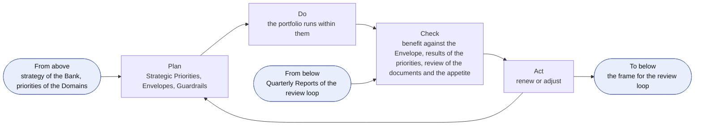
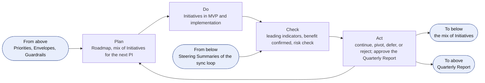
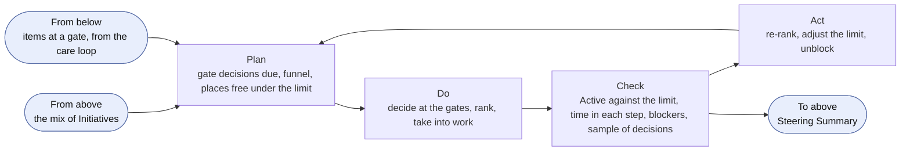
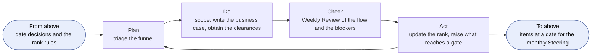
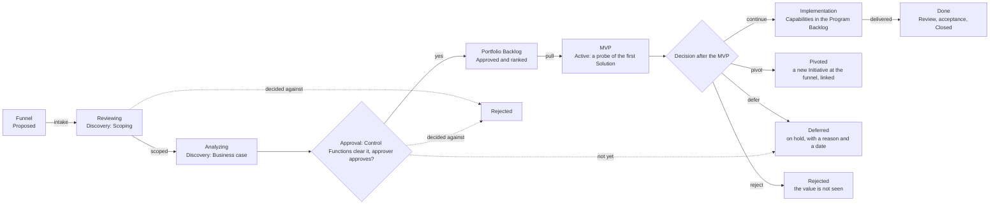
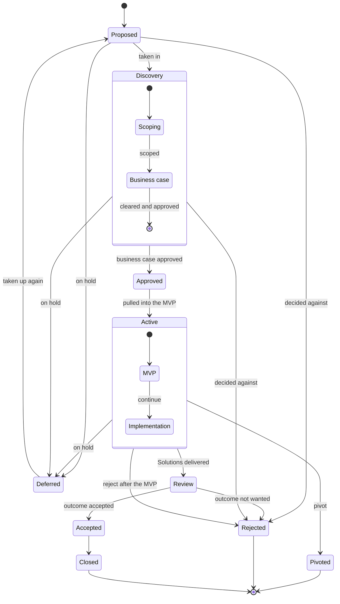
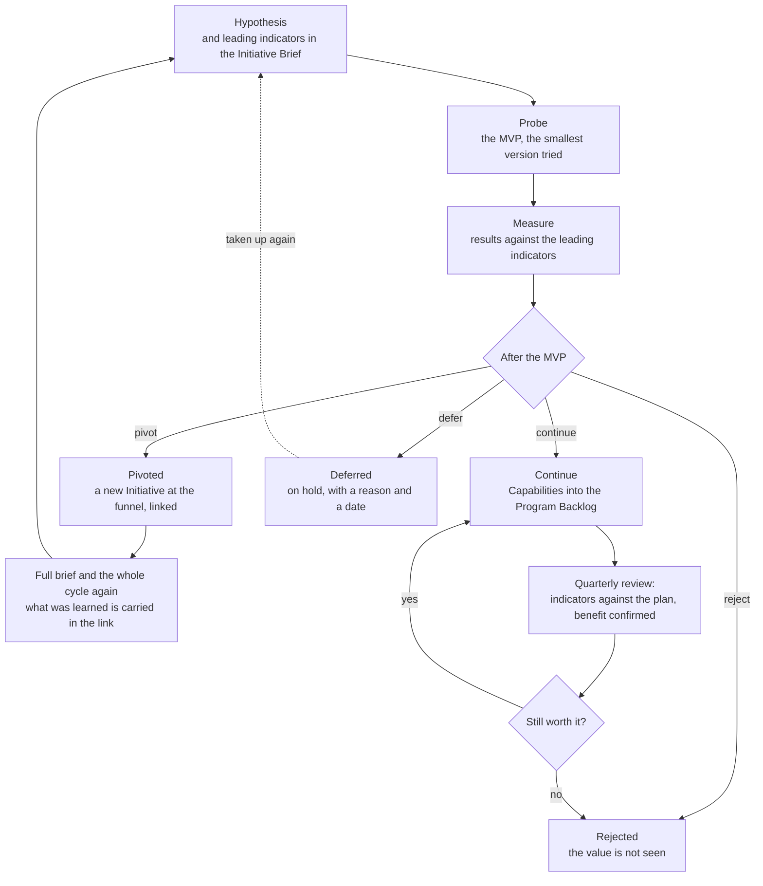
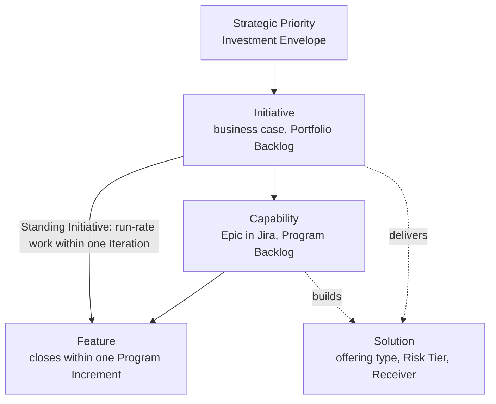

```yaml
id: AICC-ORG-02-EN
title: Portfolio Management Model
status: draft
revision: 2.4
created: 2026-10-02
revised: 2026-10-07
```

# Portfolio Management Model

## 1. Purpose and scope

1.1. This Portfolio Management Model states how the Competence Center decides which business initiatives to take in, fund, continue, defer, or reject. It is the management of the portfolio of the Competence Center, in which the Initiatives are tied to the strategy, the priorities are funded by an envelope within guardrails and not Initiative by Initiative, and decisions are taken in small steps on evidence.

1.2. It covers new services and new initiatives, and major changes to them. A new feature of an existing service is not an Initiative: it enters the Program Backlog and is handled by the Solution Lifecycle Model.

1.3. The Operating Model states how the Competence Center is governed and controlled as a unit, and it prevails. This model ends where the Capabilities of an Initiative enter the Program Backlog, and the Solution Lifecycle Model takes the work from there. Figures illustrate and state no rule of their own.

## 2. Strategic inputs

2.1. The Strategic Priorities are the strategic themes of the portfolio. The Executive Sponsor sets them with the Board, each with an Investment Envelope, and shall set the Investment Guardrails each year (AI Competence Center Charter 4). The Domain Owners put forward the priorities of their Domains, and the Executive Sponsor shall take them into account when setting the Strategic Priorities.

2.2. The Portfolio holds the catalog of the Solutions and Packages that exist. The Competence Center Lead shall check a proposed Initiative against it, so that the portfolio reuses what exists and does not duplicate it.

## 3. Roles and bodies

3.1. The Roles of the Operating Model take the following parts in portfolio management. The first column gives the part that the Role takes in portfolio management.

| Part in portfolio management | Role | What it does in the portfolio |
| --- | --- | --- |
| Portfolio leadership | Executive Sponsor | Sets the Strategic Priorities, the Envelopes, the Guardrails, and the mix of Initiatives; approves an Initiative above a guardrail, across Domains, or for enabling work; decides to continue, pivot, defer, or reject for those; approves the Quarterly Report and decides whether to bring it to the Board Committee or the Board |
| Portfolio advice | AI Steering Committee | Advises the Executive Sponsor on the Portfolio and on conflicts between Domains |
| Client function | Domain Owner | Represents the client function; states the value; owns the business outcome of the Initiative, and with the approver owns its hypothesis, its leading indicators, and the judgment of its MVP; approves the business case within a Domain and below a guardrail; accepts the outcome and confirms the benefit |
| Product and portfolio management, and ownership of the Capabilities | Competence Center Lead | Maintains the funnel and the Portfolio Backlog; screens each need at intake; writes the business case with the Domain Owner; ranks the Initiatives, sets the limit on the Active Initiatives within the mix of the Executive Sponsor, and pulls into work; prepares and runs the monthly Steering; is accountable for the progress of an Initiative through the portfolio Kanban |
| Architecture and the MVP | Solution Engineer | Defines the architecture and the Solution Definition, and builds the MVP with the Domain Expert |
| Compliance and risk | Control Function Contacts | Clear a business case that expects Risk Tier 2 or 3, before it is approved; take part in the quarterly risk check; may stop an Initiative or a Solution within their remit |

In practice, a head of function, or a member of the Competence Center, puts forward a need. The Competence Center Lead takes it in, screens it (5.5), scopes it with the Domain Owner, and writes the business case with them. The Control Function Contacts clear it when it expects Risk Tier 2 or 3, and the Domain Owner or the Executive Sponsor approves it. The Competence Center Lead ranks it and pulls it when the Limits on Work in Progress allow, and the Solution Engineer tries it as a probe. The Domain Owner accepts the outcome and confirms the benefit.

3.2. The duties of portfolio management are held apart. The Role that states the value of an Initiative does not rank it, the Role that ranks it does not approve it above an Investment Guardrail, and the Role that builds a Solution does not accept it. Where the Competence Center Lead holds more than one of these duties while the Team is small, the rules of separation of the Operating Model 4.4 apply.

## 4. The portfolio loops

4.1. The portfolio runs on four loops. Each loop is a Plan, Do, Check, Act cycle with its own cadence and forum. A loop takes its frame from the loop above it, and returns its evidence to it. The loops use the events of the control loop of the Operating Model 6 and add no meeting. In each loop the approver of 6.3 decides on an Initiative: the Domain Owner within one Domain and below an Investment Guardrail, and the Executive Sponsor above a guardrail, across Domains, or for enabling work. The Executive Sponsor alone decides the frame and the mix. The following table states the loops, the decider, what each reads, and its records.

| Loop | Cadence and forum | Decider | Reads | Records |
| --- | --- | --- | --- | --- |
| Strategic | Yearly, at the yearly Steering (the monthly Steering of December), for the next year | Executive Sponsor, with the AI Steering Committee advising | The Quarterly Reports of the year, the benefit against each Envelope, the flow distribution, and any queue handed up by the portfolio review | Priorities, Decision Records |
| Portfolio review | Quarterly, at the quarterly Steering | The approver of 6.3 for each Initiative; the Executive Sponsor for the mix | The leading indicators and the confirmed benefit of each Active Initiative, the quarterly risk check, and the lead time, cycle time, throughput, flow load, flow distribution, and PI predictability of 9.2 | Quarterly Report, Registry Snapshot, Decision Log |
| Portfolio sync | Monthly, at the monthly Steering | The approver of 6.3 at the gates; the Competence Center Lead runs it, ranks, and pulls | The work in progress, limit adherence, time to decision, aging, gate returns, and the decision sample of 9.2 | Steering Summary, Portfolio Backlog |
| Backlog care | Weekly, at the Weekly Review | Competence Center Lead | The funnel, the items at a gate, the aging of each item, and the blockers | Dashboard, Initiative Briefs |

### The strategic loop

4.2. The Executive Sponsor shall run the strategic loop once a year, at the yearly Steering, for the next year. The yearly Steering is the monthly Steering of December, held in the first two weeks of December (Operating Model 6.5). It is not an extra meeting, and it takes the Quarterly Report of PIQ3 and the findings of the year to that date as its input. The plan sets the Strategic Priorities, the Investment Envelopes, and the Investment Guardrails from the strategy of the Bank and the priorities of the Domains. The check reads the benefit against each Envelope, the results against each priority, and any queue that the portfolio review hands up (4.3), and reviews the documents and the AI Risk Appetite Statement. The act renews or adjusts them. The loop hands the frame down to the portfolio review loop, and receives the Quarterly Reports from it. The quarterly Steering that ends the IP week of PIQ4 sets none of it, and a change that the result of PIQ4 calls for in the frame is taken at the first quarterly Steering of the next year.



Figure 1: the strategic loop.

In practice, the Executive Sponsor sets the Envelope of each Strategic Priority and the Guardrails. An Initiative that stays within one Domain and below a guardrail is approved by the Domain Owner, and any other by the Executive Sponsor. A Service Agreement is not issued for an Initiative that the limit on the Active Initiatives does not allow, so the work above the limit waits in the Portfolio Backlog. At the Outcome Report the Domain Owner confirms the benefit, and each quarter the benefit is set against the Envelope, which informs the next yearly decision.

### The portfolio review loop

4.3. The Executive Sponsor shall run the portfolio review loop each quarter, at the quarterly Steering. The plan confirms the Roadmap and the mix of Initiatives for the next Program Increment within the Envelopes. The check reads, for each Active Initiative, the leading indicators against the plan, the benefit that the Domain Owner confirms, and the quarterly risk check with the Control Function Contacts, and it reads the flow of the quarter. The act decides for each Initiative, by its approver of 6.3, whether it continues, pivots, is deferred, or is rejected; the Executive Sponsor adjusts the mix and approves the Quarterly Report, and may bring it to the Board Committee or the Board. The Competence Center Lead hands up to the strategic loop the queue of any step of the portfolio Kanban that has grown for two quarters. The loop takes the frame of the strategic loop, hands the mix down to the portfolio sync loop, where the Competence Center Lead sets the limit on the Active Initiatives within it, and returns the Quarterly Report to the strategic loop.



Figure 2: the portfolio review loop.

In practice, the quarterly Steering takes each Active Initiative in turn. The Competence Center Lead shows its leading indicators against the plan, the Domain Owner confirms the benefit, and the approver of 6.3 decides whether it continues, pivots, is deferred, or is rejected: the Domain Owner within one Domain and below a guardrail, and the Executive Sponsor otherwise. The decision is entered in the Decision Log, and the Quarterly Report records the result.

### The portfolio sync loop

4.4. The Executive Sponsor shall chair the portfolio sync loop each month, at the monthly Steering, and the Competence Center Lead prepares and runs it. The plan sets the agenda: the gate decisions that are due, the funnel, and the places free under the limit. The do takes the decisions at the gates, ranks the Initiatives, and takes the highest-ranked Initiative that fits into work. The check reads the flow: the Active Initiatives against the limit, the time in each step and the items raised for their age, the blockers, and a sample of the Decisions of the Competence Center Lead. The act re-ranks, adjusts the limit, and unblocks. The loop takes the mix of the portfolio review loop, within which the Competence Center Lead sets the limit, and returns the Steering Summary to it.



Figure 3: the portfolio sync loop.

In practice, the Competence Center Lead shows the places free under the limit and the number of Active Initiatives, and the approver of 6.3 takes the decisions that are due. The highest-ranked Initiative that fits is taken into work. An Initiative that ranks lower may be taken first for a stated reason, such as a date or a Dependency, and the reason is recorded. An Initiative that is done, pivoted, deferred, or rejected frees its place, and nothing is taken into work while the limit is reached.

### The backlog care loop

4.5. The Competence Center Lead shall run the backlog care loop every week, at the Weekly Review. The plan triages the funnel. The do scopes the needs, writes the business cases with the Domain Owners, and obtains the clearances of the Control Function Contacts. The check reads the flow and the blockers at the Weekly Review. The act updates the rank and raises to the monthly Steering the items that reach a gate and any item older than the 85th percentile of the time in its step. The loop takes the rank rules and the gate decisions of the portfolio sync loop, and hands the items at a gate up to it.



Figure 4: the backlog care loop.

In practice, a need that arrives is recorded in the funnel and triaged within the week. The Competence Center Lead scopes it with the Domain Owner, writes the Initiative Brief, and obtains the clearances of the Control Function Contacts. When the brief is ready, it goes to the next monthly Steering, where the approver decides.

### The mix and the controls

4.6. The mix of Initiatives is the share of the Active Initiatives by Strategic Priority and by kind of work: business work for a client function, enabling work of which the Executive Sponsor is the client, and risk and compliance work that answers a risk or a requirement of the law or of a Control Function. The Executive Sponsor shall set the mix at the quarterly Steering so that enabling work and risk and compliance work are not starved, and the Competence Center Lead ranks and pulls within it.

4.7. The Portfolio is controlled at four points: at the start, by the business case and the clearances of the Control Function Contacts (6.2, 6.4); through the flow, by the gates of 5.2 and the Decision Log; on continuation, by the portfolio review (4.3); and on the whole, by the Quarterly Report (AI Competence Center Charter 7).

## 5. The portfolio Kanban

5.1. An Initiative moves through the portfolio Kanban of Figure 5, after the intake of 5.5. The Funnel is the intake of ideas, Reviewing is the scoping of a need, and Analyzing is the writing and the clearing of the business case. To pull an Initiative is to take it into work when the limit on the Active Initiatives allows. The Portfolio Backlog is the ranked list of the Initiatives in the Kanban, and the funnel is its Proposed state.



Figure 5: the portfolio Kanban of an Initiative.

In practice, the Kanban is read from left to right, and each arrow is a decision. The Initiative stays at a step until its exit criterion is met, and it may leave the flow by a rejection, a deferral, a pivot, or a cancellation.

5.2. The following table states each step and the gate at its end. The gates of the flow are intake, scoped, approval, pull, the decision after the MVP, and acceptance. The states and the moves are those of the Solution Lifecycle Model 5.1, which is the only source of the moves. A Rejected Initiative is a business decision that the value is not seen. A Cancelled one is withdrawn without a decision on the merits, for an error, a duplicate, a need that is gone, or a stop by a Control Function, and cancellation is available in any open state of the Initiative.

| Kanban step | State and Stage | Entry | Exit criterion | Gate | Decided by | Record |
| --- | --- | --- | --- | --- | --- | --- |
| Funnel | Proposed | A function, the discovery work, or the Competence Center proposes an idea or a need | The screening of 5.5 is done, and the problem, its size, its likely Risk Tier, the Packages and Solutions of the catalog that bear on it, the strategic relevance, and the requester are stated | Intake | The Competence Center Lead takes it in, defers it, or rejects it | An entry in the Portfolio Backlog, with the requester and the problem |
| Reviewing | Discovery: Scoping | Taken in | The need and the requirements are understood. It fits a Strategic Priority, has a client function with a Domain Owner (the Executive Sponsor for enabling work), is permitted by the limit on the Active Initiatives (Business Model 7.2), and does not duplicate a Solution or a Package of the catalog | Scoped | The Competence Center Lead, with the Domain Owner | The scope, in the Initiative Brief |
| Analyzing | Discovery: Business case | Scoped | The Initiative Brief is complete in its six sections, meets the criteria of 6.2, and is cleared by the Control Function Contacts (6.4) | Approval | The approver of 6.3 approves, returns, defers, or rejects | The Initiative Brief, the clearances of the Control Function Contacts, and the Decision Record |
| Portfolio Backlog | Approved | The business case is approved | The Initiative is ranked (6.5) and pulled when the limit on the Active Initiatives allows | Pull | The Competence Center Lead pulls the highest-ranked Initiative that fits | The rank and the scores in the Portfolio Backlog |
| MVP | Active: MVP | Pulled | The probe has tested the hypothesis against the leading indicators of the Initiative Brief | Decision after the MVP | The approver of 6.3 decides to continue, pivot, defer, or reject (7.2) | The Solution Definition, the result of the probe, and the Decision Log entry |
| Implementation | Active: Implementation | Continue | The Capabilities are in the Program Backlog and the Solutions are delivered | None of the portfolio; each Solution passes the gates of the Solution Lifecycle Model 7 | The Domain Owner, or the Executive Sponsor for enabling work, accepts | The Capabilities in the Program Backlog, under the Initiative |
| Done | Review, Accepted, Closed | The outcome is delivered | The outcome is reviewed against the leading indicators and accepted, and the benefit is confirmed against the Initiative Brief (Business Model 7.3) | Acceptance | The Domain Owner, or the Executive Sponsor for enabling work | The acceptance with who and when in the Portfolio Backlog, and the Outcome Report of an Engagement |

In practice, the Competence Center Lead brings an Initiative to a gate with its entry in order, and the decider checks the exit criterion. The outcome is one of four. Advance: the Initiative moves to the next step. Return: it goes back with what is missing, and the step is repeated. Defer: it stays in the funnel with a reason and a date to look again. Reject: the value is not seen, and the lessons are kept in the Portfolio Backlog. The decision is entered in the Decision Log.

Figure 6 shows the states behind the Kanban.



Figure 6: the states of an Initiative.

In practice, Waiting is a state, shown as a flag on the boards, of an Active Initiative that depends on someone outside the Competence Center (Solution Lifecycle Model 5.1), and Cancelled is available in any state for a withdrawal such as an error, so neither is drawn. In light mode the Initiative goes from Active to Review without the state Completed.

5.3. Discovery is research. It learns the need and the requirements, builds nothing, and shapes the Initiative Brief. Its cost is the time of the Competence Center Lead and of the Domain Owner. The MVP is a probe. It is the smallest version of the first Solution that is tried, to see whether it works and satisfies the need.

5.4. A limit on the Initiatives that are Active at one time applies, so that the work in progress of the portfolio stays low and its flow steady. The standing Initiatives that the Business Model defines are not counted against it. The Competence Center Lead sets the Limit on Work in Progress within the mix that the Executive Sponsor sets at the quarterly Steering (4.6), and reviews it at the monthly Steering.

5.5. The Competence Center Lead shall screen each need at intake, in this order: the problem that it answers, its size, its likely Risk Tier, and whether a Package or a Solution of the catalog already answers it (2.2). A need that is run-rate work, as the Business Model defines it, enters the Program Backlog as a Feature directly under the Standing Initiative of its service area and does not pass the gates of the portfolio Kanban. The Executive Sponsor approves the Initiative Brief of the Standing Initiative under Business Model 4.9; the Standing Initiative does not require an MVP of its own. Its run-rate Features follow the approval and acceptance rules of Solution Lifecycle Model 3.1, 5.2, and 7.3. Every other need enters the Funnel as an Initiative, and passes Reviewing only on the criteria of the Business Model 7.2.

## 6. The business case

6.1. Every Initiative shall be written in a one-page Initiative Brief, which is its lean business case: a hypothesis, the business outcomes with their leading indicators, the scope and the minimum viable product (MVP), the cost and value, the risks and the expected Risk Tier, and the decision. The Initiative Brief Template gives the form. A figure of the Bank stays in its source system, and the brief points to it.

6.2. The business case meets the following criteria before it is approved. The criteria answer five questions, scaled to one page.

| Question | Criterion |
| --- | --- |
| Why is the change needed? | The Initiative fits a Strategic Priority, and the hypothesis states the value for a named function |
| What is the best option? | The outcomes have two to four leading indicators (6.7), with their source system, baseline, and target, and the MVP tests the hypothesis at the least cost |
| Can it be afforded? | The cost is within the Envelope of the Strategic Priority |
| Can it be bought and delivered? | The dependencies and the providers are named, the expected Risk Tier is stated, and the Control Function Contacts have cleared it (6.4) |
| Can it be run well? | The Domain Owner, or the Executive Sponsor for enabling work, is named and committed, and the acceptance on delivery is stated |

6.3. The Domain Owner approves the business case of an Initiative within one Domain that stays below an Investment Guardrail. The Executive Sponsor approves it when it exceeds a guardrail or spans Domains, and for enabling work, of which the Executive Sponsor is the client.

6.4. The Control Function Contacts are gates on the business case in the form proposed. For an Initiative that expects Risk Tier 2 or 3, the Contacts of the Control Functions concerned shall clear the business case within their remit before it is approved, and a Contact who does not clear it may stop it (Operating Model 5.4). The Competence Center Lead obtains the clearance, which is a Control Sign-Off of the Contact, and references it in the Initiative Brief. A Risk Tier assigned under the AI Policy 3.2 that is higher than the one that the business case expected or that the Contacts cleared returns the business case to them for clearance.

6.5. The Initiatives in the Portfolio Backlog are ranked by the weighted shortest job first (WSJF) method: the sum of the scores of value, urgency, and risk reduction or opportunity, each from 1 to 5, divided by the score of effort, from 1 to 5. The Domain Owner states the value, and the Competence Center Lead scores the other terms and ranks. The Competence Center Lead may depart from the rank for a stated reason, and records it.

6.6. Funding goes to the Strategic Priorities and to the Teams, not to Initiatives one by one (AI Competence Center Charter 4). The Competence Center does not charge the functions, and the Domain pays from its Envelope for the run, the licenses, and the provider costs of its Solutions.

6.7. A leading indicator of an Initiative measures a change in the business, such as in adoption, time, errors, cost, or revenue, and not an activity or an output of the work. The Domain Owner, or the Executive Sponsor for enabling work, shall state two to four of them in the Initiative Brief.

6.8. The hypothesis is the objective of the Initiative. Its leading indicators show early whether it holds, the MVP is its first test, the Capabilities are the means to it (8.2), and the benefit confirmed against the Initiative Brief is its confirmation.

## 7. The MVP and the decision after it

7.1. When the Competence Center Lead takes an Initiative from the Portfolio Backlog into work, the Solution Engineer shall define the architecture and the Solution Definition of its first Solution, and shall build the MVP with the Domain Expert within the Limits on Work in Progress. The scope of the first Solution is narrow. The Solution Engineer shall not let any real user use the MVP before it is checked or validated as its Risk Tier requires (AI Policy 3).

7.2. At the end of the MVP the approver of 6.3 compares the result with the leading indicators of the Initiative Brief and decides as the following table states. The decision is entered in the Decision Log and has a Decision Record, and the lessons of the MVP are kept in the Portfolio Backlog.

| Decision | When | What follows |
| --- | --- | --- |
| Continue | The hypothesis holds: the leading indicators move as the Initiative Brief expects, and the Domain Owner sees the value | The Capabilities of the Initiative are defined and entered in the Program Backlog under the Initiative |
| Pivot | The need is confirmed, and what was learned calls for another approach or scope | The Initiative is closed as Pivoted, and a new Initiative with a full Initiative Brief is entered at the funnel, linked to it, and goes through the whole cycle again; what was learned and the results of the MVP are carried in the link |
| Defer | There is not yet sufficient reason to proceed, for the timing, a Dependency, or a higher priority elsewhere | The Initiative is put on hold as Deferred, with the reason and the date to look at it again, and it returns to the funnel when it is taken up again |
| Reject | The value is not seen: the leading indicators did not move, or the cost or the risk outweighs the benefit | The Initiative is Rejected, and its place under the limit on the Active Initiatives goes to the next ranked Initiative |

Figure 7 shows the loop of the probe and the decision that follows it.



Figure 7: the probe loop.

In practice, the Initiative Brief holds, before the MVP, the hypothesis, the leading indicators with their source system, and the scope of the probe. The Solution Engineer builds the smallest version that can test it, with the Domain Expert. At the end the approver reads the results against the indicators and decides. After a continue, the quarterly review asks the same question of each Active Initiative, and an Initiative whose indicators and confirmed benefit do not hold is deferred or rejected.

7.3. A Solution Definition is approved by the Domain Owner, and the Competence Center Lead assigns its Risk Tier (AI Policy 3). The Executive Sponsor decides on the release of a Risk Tier 3 Solution.

7.4. The approver of 6.3 and the Domain Owner own the hypothesis, the leading indicators, and the judgment of the MVP, and the Solution Engineer and the Domain Expert own its build. The Domain Owner shall review the progress of the MVP against the leading indicators at each Iteration Review and Demo.

## 8. Initiative, Capability, and Feature

8.1. An Initiative delivers one or more Solutions through Capabilities, and a Capability is delivered through Features. Run-rate Features sit directly under their Standing Initiative (5.5). Figure 8 shows the levels. Investment and priority are set at the level of the Initiative, and the Program Backlog groups the Capabilities under their Initiatives.



Figure 8: the levels of the work.

8.2. The Competence Center Lead approves a Capability, with the Domain Owner consulted, and shall approve only a Capability that states the leading indicator of its Initiative that it serves. The Capability is accepted against that indicator as well as against its acceptance criteria. A Capability of enabling work may sit directly under an Initiative, without a Solution, and enabling work that builds no AI Solution has no Risk Tier.

8.3. In Jira an Initiative sits above the Epic, a Capability is an Epic, a Feature is an issue type, and a Work Item is a sub-task. Epic names the Jira item to which a Capability maps; use of the word in another framework is explained in that context and does not change this mapping.

## 9. Review, measures, and records

9.1. The portfolio loops of section 4 review the funnel, the Portfolio Backlog, and the Active Initiatives each month, and confirm each quarter, for each Active Initiative, whether it continues, pivots, is deferred, or is rejected, on its leading indicators against the plan and the benefit that the Domain Owner confirms.

9.2. The Competence Center measures the flow and the benefit of the Portfolio with the measures of the following table, which carry those of the AI Competence Center Charter 7 for the Portfolio. The Competence Center Lead shall show them on the Dashboard and in the Quarterly Report. The flow measures of the portfolio Kanban count ordinary Initiatives and exclude Standing Initiatives, which are shown separately. Run-rate Features are counted in the delivery measures of the Solution Lifecycle Model.

| Measure | Definition | Source | Read at | Target rule |
| --- | --- | --- | --- | --- |
| Work in progress | The Initiatives that are Active at a date, other than the standing Initiatives | Portfolio Backlog | Monthly Steering | Within the limit on the Active Initiatives (5.4) |
| Time to decision | The days from the entry of an Initiative in the Funnel to its approval | Portfolio Backlog | Monthly Steering | Set by the Steering once a baseline exists |
| Lead time | The days from Approved to Accepted | Portfolio Backlog | Quarterly Steering | Set by the Steering once a baseline exists |
| Cycle time | The days from Active to Review | Portfolio Backlog | Quarterly Steering | Set by the Steering once a baseline exists |
| Throughput | The Initiatives Accepted in a Program Increment | Portfolio Backlog | Quarterly Steering | A trend, with no target |
| Aging | The days that an Initiative has been in its current step, against the 85th percentile of the time in that step | Portfolio Backlog | Weekly Review; monthly Steering | An item older than the 85th percentile is raised (4.5) |
| Expected lead time | The average number of Initiatives between Approved and Accepted, divided by the average throughput, in Program Increments | Portfolio Backlog | Monthly Steering | No target; it informs the limit on the Active Initiatives |
| Flow efficiency | The days that an Initiative is Active and not Waiting, as a share of its lead time | Portfolio Backlog | Monthly Steering | A trend, with no target |
| Flow load | The Approved Initiatives waiting to be pulled, and the days that each has waited | Portfolio Backlog | Monthly Steering; quarterly Steering | A queue that grows for two quarters goes to the strategic loop (4.3) |
| Flow distribution | The share of the Active Initiatives by Strategic Priority and by kind of work (4.6) | Portfolio Backlog | Quarterly Steering | Within the mix that the Executive Sponsor sets |
| Gate returns | The Initiatives returned at a gate, as a share of those presented at it | Decision Log | Monthly Steering | A trend, with no target |
| Limit adherence | The days in the period on which the Active Initiatives exceeded the limit | Portfolio Backlog | Monthly Steering | Zero |
| Decision sample | The sampled Decisions of the Competence Center Lead that are found in order, as a share of those sampled | Decision Log; Steering Summary | Monthly Steering | All found in order (Operating Model 6) |
| Benefit confirmed against claimed | The benefit that the Domain Owner confirms against the benefit that the Initiative Brief claims, by reference to the figures in their source | Initiative Brief; Outcome Report | Quarterly Steering; yearly Steering | A trend by Strategic Priority, read against the Envelope |
| PI predictability | As the Solution Lifecycle Model defines it | PI Objectives | PI Review and Demo; quarterly Steering | A trend, with no target |

9.3. An Initiative is complete when its Solutions are delivered and its outcome is reviewed and accepted by the Domain Owner, or by the Executive Sponsor for enabling work, after the final acceptance of the Team (Solution Lifecycle Model 7.3). The Outcome Report records the acceptance of an Engagement.

9.4. The records of the Portfolio are the Portfolio Backlog, the Priorities Record, the Roadmap, the Dashboard, the Decision Log, the Steering Summaries, the Quarterly Report, and the Registry Snapshots, and the Competence Center Lead shall add no other record to track the Portfolio. The Portfolio Backlog holds, for each Initiative, the date on which it entered each state and the references of its leading indicators. The Portfolio Backlog with the Portfolio Kanban, the Initiative Briefs, the Roadmap, and the Dashboard are kept in the Portfolio as the working state, with the Solution Definitions; the Priorities Record, the Decision Log, the Steering Summaries, the Quarterly Report, and the Registry Snapshots are kept in the Registry (Operating Model 7.1 to 7.3). There is one Portfolio Backlog and one Portfolio Kanban, and the service area of an Initiative is a field of the item and not a separate backlog. The controls that this model carries, whose rules it states or whose evidence it keeps, are C-02, C-08, C-09, C-23, and C-24 of the Operating Model 8.

9.5. The measures of 9.2 count calendar days and are read as the median and the 85th percentile and as trends. No measure is used to rank people.

9.6. The Competence Center Lead owns the definition of each measure of 9.2. A measure is added or changed by a Decision of the Executive Sponsor at the monthly Steering, entered in the Decision Log, and a measure that is not read for two Program Increments is removed in the same way. The Executive Sponsor sets the targets of the flow of the Portfolio at the monthly Steering once a baseline exists.

## Change log

| Revision | Date | Change | Decision |
| --- | --- | --- | --- |
| 1.0 | 2026-10-02 | Baseline. | — |
| 2.0 | 2026-10-03 | Adds the intake of run-rate work and Initiatives, the gates and cancellation, the separation of duties, the mix of Initiatives and the four controls, the rules of leading indicators and of the MVP decision, and the table of Portfolio measures with their governance and records. | — |
| 2.1 | 2026-10-03 | Clarified the Standing Initiative approval and its direct run-rate Features, with no MVP of its own. | none (correction under Document Catalog 4.2) |
| 2.2 | 2026-10-04 | Clarified Epic as a Jira mapping without prohibiting its use for the corresponding concept in another framework; the Competence Center work hierarchy is unchanged. | — |
| 2.3 | 2026-10-07 | The Portfolio holds the working state of the portfolio and the program; the Registry keeps governance and evidence; Jira runs the daily work and mirrors the portfolio and program levels | — |
| 2.4 | 2026-10-07 | The unit is named the Competence Center, and the AI Competence Center in titles; the role AICC Lead is the Competence Center Lead; AICC stays only as a code | — |
