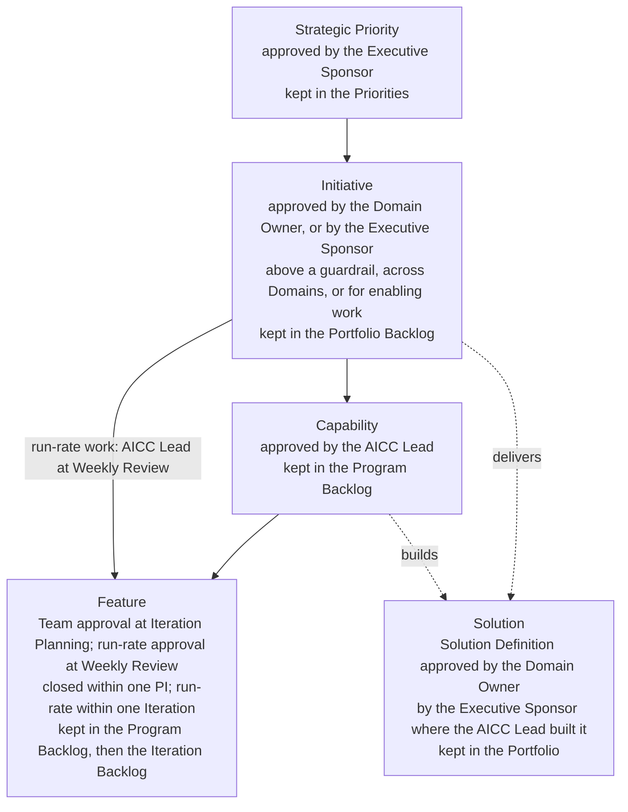
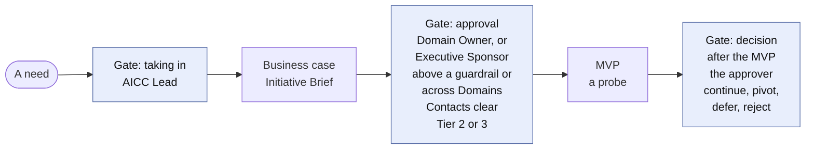
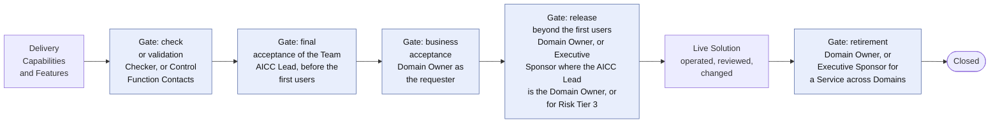
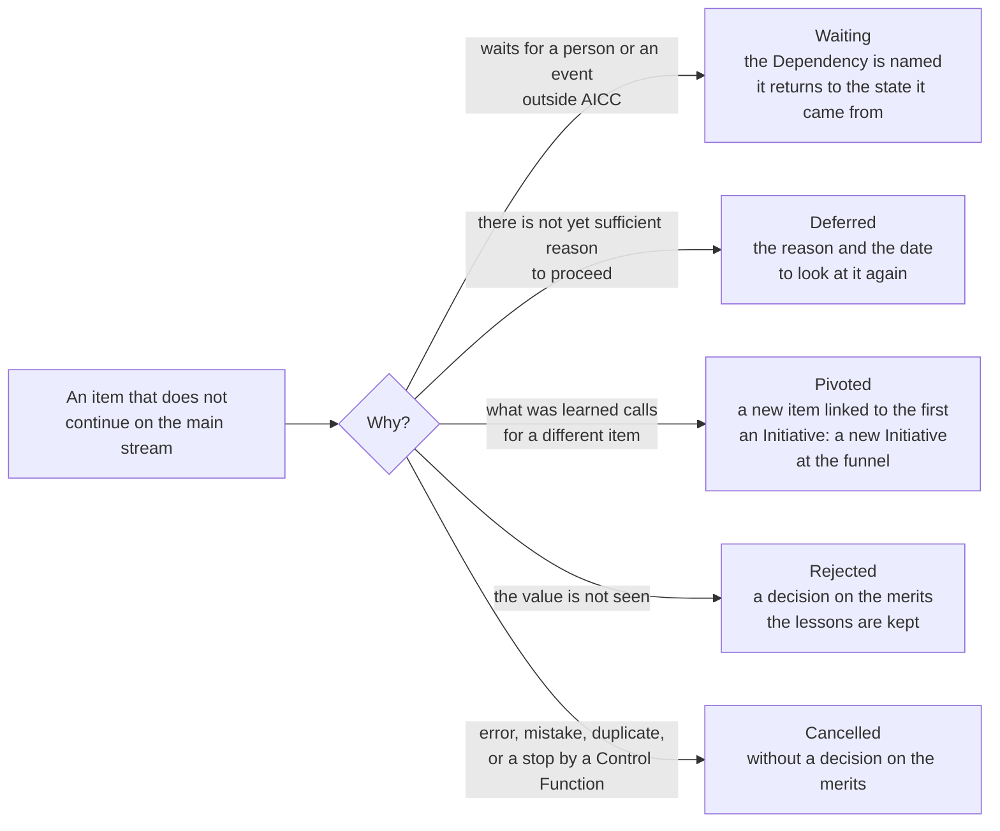
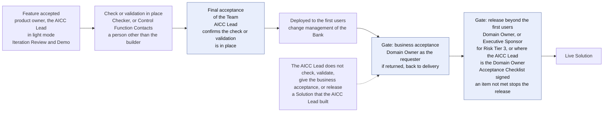

# Guide: Service delivery

## 1. Purpose and when it applies

This guide explains how an item moves through AICC, from a business need to a retired Solution, who decides on the way, and which record each decision leaves. It applies to every Initiative and everything beneath it. It explains the governance of the flow: the levels, the states, the Stages, and the records. It states no rule of its own, and the rules are in the Operating Model, the Portfolio Management Model, the Solution Lifecycle Model, and the AI Policy. The live guidance on how a Team plans and builds, which changes with the work, is kept in Confluence and in the portfolio management set, and is not part of the charter.

## 2. The levels and who owns them

Figure 1 shows the levels of the work, the person who approves each level, and where each is kept.

Figure 1: the levels of the work and their owners.

| Level | What it is | Owner who approves it | Kept in |
| --- | --- | --- | --- |
| Strategic Priority | A theme set with the Board | Executive Sponsor | Priorities |
| Initiative | A business program that delivers Solutions | Domain Owner; the Executive Sponsor above a guardrail, across Domains, or for enabling work | Portfolio Backlog |
| Solution | A solution or service, with a type, a Risk Tier, and a Receiver | Domain Owner approves its Solution Definition | The Portfolio |
| Capability | A capability of a Solution | AICC Lead | Program Backlog |
| Feature | A deliverable of a Capability, closed within one PI; run-rate work sits directly under its Standing Initiative and is done within one Iteration | The Team at Iteration Planning; the AICC Lead at the Weekly Review for run-rate work | Program Backlog, then Iteration Backlog |

## 3. The life of an item

An Initiative moves through the portfolio Kanban of the Portfolio Management Model 5: the funnel, Reviewing, Analyzing, the Portfolio Backlog, the MVP, the decision after the MVP, Implementation, and Done. Every item is in one of thirteen states. It starts as Proposed, is clarified in Discovery, is Approved when its conditions are met, is Active while it is worked, and goes through Review to Accepted and Closed. Waiting, Deferred, Pivoted, Rejected, and Cancelled cover the other routes. The person who approves an item at its level also defers, rejects, cancels, or pivots it. While the Team has up to three people, light mode uses a smaller set of states, with Waiting still a state, shown as a flag, and Accepted and Closed as one step.

Figure 2 shows the stream of a Solution from the need to the decision after the MVP, with each gate and the person who decides at it.

Figure 2: the stream from the need to the decision after the MVP.

Figure 3 shows the stream from the delivery to the close.

Figure 3: the stream from the delivery to the close.

An item may leave the main stream at any gate. Figure 4 shows how the route is chosen. Rejected is a decision on the merits, because the value is not seen. Cancelled is a withdrawal without such a decision, such as an error or a duplicate, or a stop by a Control Function.

Figure 4: the routes out of the main stream.

## 4. The decisions along the stream, and who takes each

| Decision | Decided by | When | Record |
| --- | --- | --- | --- |
| Taking an item in | AICC Lead | Proposed to Discovery | Portfolio Backlog |
| Business case | Domain Owner; the Executive Sponsor above a guardrail, across Domains, or for enabling work; the Control Function Contacts clear it when Risk Tier 2 or 3 is expected | End of the discovery of an Initiative | Initiative Brief with the clearances; Decision Record |
| Pull from the Portfolio Backlog | AICC Lead | When the limit on the Active Initiatives permits | Portfolio Backlog |
| Decision after the MVP | The approver of the business case | At the end of the MVP | Decision Log; Decision Record; Initiative Brief |
| Solution Definition and Risk Tier | Domain Owner approves; the AICC Lead assigns the Risk Tier and tells the Domain Owner; for a Solution that the AICC Lead built, the Executive Sponsor approves and assigns | When the Solution is defined | Solution Definition |
| Use of a Solution for a data class | Domain Owner; the AICC Lead for use in AICC; the Executive Sponsor for a Solution that the AICC Lead built | Before use | AI Registry |
| Check or validation | The Checker for Risk Tier 1; the Control Function Contacts for Risk Tier 2 and 3 | Before the first deployment to real users or data | The AI Registry entry for the check; the Control Sign-Off for the validation |
| Acceptance of a Feature or a Capability | The product owner | At the Iteration Review and Demo | A note in the backlog of the level |
| Final acceptance of the Team | The AICC Lead | Before the first deployment of a Solution to its first users, and of a significant change | The release block of the Solution Definition |
| Business acceptance of a Solution | The Domain Owner; the Executive Sponsor for an item across Domains, enabling work, or an Experiment with no Domain | When the Solution works for its first users, before its release | The release block of the Solution Definition, and the Outcome Report for an Engagement |
| Release | Domain Owner, or the Executive Sponsor where the AICC Lead is the Domain Owner; the Executive Sponsor for Risk Tier 3 | Before use beyond the first users | The release block of the Solution Definition; the Acceptance Checklist; Decision Record for Risk Tier 3 |
| Production deployment, and change to a released Solution | The change management of the Bank approves; the AICC Lead decides whether a new check or validation is needed | At each production deployment and each change | The change ticket and test reference in the Feature; Solution Definition; Decision Log for a new-check decision |
| Retirement of a Solution | Domain Owner; the Executive Sponsor for a Service across Domains | Before the Solution is Closed as retired | Solution Definition; AI Registry |
| Transition of a Service: Handover to an IT function of the Bank, or retirement | Domain Owner; the Executive Sponsor for a Service across Domains; the Receiver accepts the Handover | On the reading of the four signals at the quarterly Steering | Decision Log; Proposal; Solution Definition |
| Outcome of an Experiment: accepted with its lessons and closed, a Proposal, or rejected | Domain Owner; the Executive Sponsor for an Experiment with no Domain | At the close of its time-box | Solution Definition; the Proposal where one is made; Outcome Report for an Engagement |
| Class of service of a request | The Solution Engineer triages; the AICC Lead decides a class in doubt | When the request arrives | The ticket in Service Management |

Figure 5 shows who accepts, checks, and releases a Solution, and in which order: the check or validation is in place before the final acceptance of the Team, which confirms it.

Figure 5: the acceptances, the check, and the release.

## 5. After delivery: the three types

A Solution has one type, and the type sets its life. A Service is run by AICC for its whole life, or until it is handed over to an IT function of the Bank, with a business case that states the run cost and a sunset rule, and it is supported at the agreed response targets. Its four signals, service levels, incidents, use, and cost, are read at each Iteration Review and Demo and at the quarterly Steering. A Product is a version built for one consumer, supported on demand, and revised through the Portfolio Backlog. An Experiment is a time-boxed trial that ends in a Proposal, and the Handover to its Receiver is complete when the Receiver accepts it. AICC also oversees and reports on the Adopted Solutions that others deliver.

| Type | Owner after delivery | Stages after delivery | End |
| --- | --- | --- | --- |
| Service | AICC | Operate, Evolve, Retire, through the service steps | Retired, handed over to an IT function of the Bank, or cancelled |
| Product | The consumer owns the version; AICC supports on demand | Handover, Support, Revise, Retire for the consumer | Retired for the consumer |
| Experiment | None yet | Trial, Proposal, Handover | Handed off, closed with its lessons, or rejected |

## 6. Situations

| Situation | Treatment |
| --- | --- |
| A change raises the Risk Tier | The Solution returns to Discovery for the checks that the change touches |
| The Risk Tier assigned is higher than the one cleared in the business case | The business case returns to the Control Function Contacts for a new clearance |
| A Feature cannot close within its PI | It is split: the part done goes to review, the rest is a new Feature in the next PI, and the original is Pivoted |
| A Dependency outside AICC blocks the work | The item is Waiting, with the Dependency named |
| A Control Function stops a Solution | The Solution is Cancelled, and nobody overrides the stop |
| An Experiment reaches the end of its time-box | It goes to review: accepted with its lessons, a Proposal, or rejected |
| The MVP of an Initiative ends | The approver continues, pivots, defers, or rejects it. A pivot is a new Initiative at the funnel, linked to the first |
| A Service should run at scale | The Service goes to Transition planned. A Proposal names an IT function of the Bank as Receiver, the Domain Owner, or the Executive Sponsor across Domains, decides on the reading of the four signals at the quarterly Steering, and the Service is Closed as handed off when the Receiver accepts the Handover; AICC then oversees it as an Adopted Solution (Solution Lifecycle Model 8.8, 8.11) |
| An Experiment proves its case | At the close of its time-box it goes to review, and a Proposal is made for a Receiver to adopt it at scale. A Solution keeps one offering type: a Service that follows is a new Solution with its own business case (Solution Lifecycle Model 8.1, 8.12) |
| Incidents or requests repeat | The repeat is flagged in the ticket, or in the AI Incident Review for an AI Incident, and problem management takes the cause as a Feature in the Program Backlog (Solution Lifecycle Model 8.10) |

## 7. Rule source

Operating Model 4.2, 4.4, 5; Portfolio Management Model 4 to 8; Solution Lifecycle Model 3 to 10; AI Policy 2 and 3; the Service delivery workflow.
