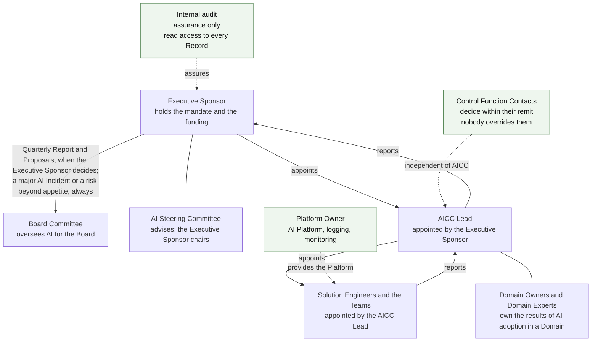
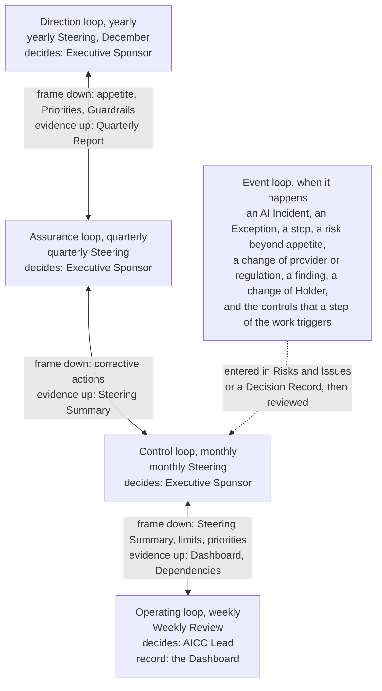
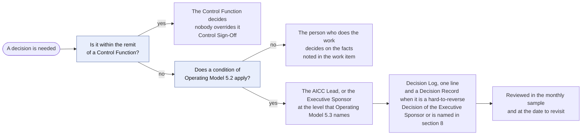

# Guide: Unit governance

## 1. Purpose and when it applies

This guide explains how AICC is directed, reported, and controlled as an organizational unit: the mandate, the planning, the reporting, the decisions, the controls, and the assurance. It is the answer to the question "how does your unit operate?". It applies throughout. It states no rule of its own, and the rules are in the Charter, the Operating Model, the Portfolio Management Model, the Solution Lifecycle Model, and the AI Policy.

## 2. The mandate, the authority, and independence

AICC acts under the mandate of the Executive Sponsor, and the Charter states its limits: it does not own the AI Platform, it does not own the results of a Domain, it does not set the rules of a Control Function, it does not validate its own work, and it does not decide a matter that the regulation of the Bank reserves to the Board, to the management, or to a Control Function. The appointment of the AICC Lead and the decision reference of the mandate are entered in the Appointments Record. The Executive Sponsor may delegate a decision in writing, for a scope and a period, and each delegation is entered there.

Figure 1 shows who holds the authority, who is independent of AICC, and the direction of the reporting.

Figure 1: the authority, the independent functions, and the reporting.

## 3. The loops

The control of the unit runs as five loops of the Operating Model 6, and the portfolio runs as four loops of the Portfolio Management Model 4. They run on the same events and add no meeting.

Figure 2 shows the loops with the person who decides in each, and the way the frame passes down and the evidence passes up.

Figure 2: the control loops and their deciders.

The following table states each loop, its event, what is set or reviewed, who decides, and the record that it leaves.

| Loop | Cadence and event | What is set or reviewed | By whom | Record |
| --- | --- | --- | --- | --- |
| Direction, and strategic | Yearly, at the yearly Steering (the monthly Steering of December, in its first two weeks), for the next year | In the direction loop, the documents, the AI Risk Appetite Statement and the policy, the appointments, and the targets of the Measures of the Maturity Levels; in the strategic loop, the Strategic Priorities, the Envelopes, and the Guardrails; the yearly Proposal of the strategy | Executive Sponsor; the AICC Lead owns the documents | Decision Records; Priorities |
| Assurance, and portfolio review | Quarterly, at the quarterly Steering | The quarterly risk check with the Control Function Contacts, the access review, the status of each control and the governance measures, the Maturity Level of each Strategic Priority, the approval of the Quarterly Report and the decision whether to submit it to the Board Committee or the Board; the decision on each Active Initiative | Executive Sponsor | Quarterly Report; Registry Snapshot; Steering Summary |
| Control, and portfolio sync | Monthly, at the monthly Steering | Progress, risks, and blockers; the sample of the Decisions of the AICC Lead and the share found in order; the events of the month; the review of the live Solutions; the open Exceptions and the deficiencies; the gate decisions that are due, and the Active Initiatives against the limit | Executive Sponsor | Steering Summary; Decision Log |
| Operating, and backlog care | Weekly, at the Weekly Review | The flow, the Dependencies, the funnel, and the rank | AICC Lead | Dashboard; the working state |
| Event | When it happens | An AI Incident, an Exception, a stop, a risk beyond appetite, a change of provider or regulation, a finding, or a change of Holder; and the controls that a step of the work triggers | As the Operating Model states | Decision Record; Risks and Issues; Appointments; the evidence record of each control |

Every control is carried by at least one loop and is reviewed at the Steering of that loop; the controls of the operating loop and the event loop are reviewed at the monthly Steering (Operating Model 6.1). Governance adds no meeting and keeps no Record beyond those of the work. The following table gives the catalog of the controls by loop.

| Loop | Controls | What they cover |
| --- | --- | --- |
| Direction | C-01, C-03, C-04, C-20, C-22; C-02 in the strategic loop at the same Steering | The mandate and the appointments; the Priorities, the funding, and the Guardrails; the appetite and the policy; the documents; the yearly Proposal of the strategy; the separation of duties |
| Assurance | C-06, C-07, C-11, C-16, C-20, C-24, C-25, C-26, C-27, C-28 | The results and the risk check; the approval of the Quarterly Report and its submission where the Executive Sponsor decides; the benefit confirmed; the reconciliation of the AI Incidents; the Adopted Solutions; the completeness of the Outcome Reports; the access of internal audit and the access review; the risks beyond appetite; the reassessments and validations due |
| Control | C-05, C-17, C-29, C-32 | The monthly review and the sample; the open Exceptions and suspensions; the review of the live Solutions; the deficiencies and findings |
| Operating | C-23 | The intake and the limit on work in progress |
| Event | C-01, C-08, C-09, C-10, C-12, C-13, C-14, C-15, C-16, C-17, C-18, C-19, C-21, C-22, C-27, C-28, C-30, C-31, C-32 | Each step of an Engagement and of a Solution: the Service Agreement, the business case, the acceptances, the Risk Tier, the check or validation, the release, the use for a data class, the provider, the sharing of data, the published output, the deployment and the change, the retirement; and the unplanned events: an appointment, an AI Incident, an Exception, a suspension or a stop, a risk beyond appetite, a reassessment on a change, a finding |

AICC also measures its own control by ten governance measures, read at the Steerings, from the share of the controls Operating to the share of the documents reviewed within the year (Operating Model 6.11). The quarterly Steering confirms the Maturity Level of each Strategic Priority, and the yearly Steering sets the targets of the Measures of the Maturity Levels for the next year (Operating Model 6.5, 6.6).

## 4. How a decision moves

The person who does the work decides on the facts. A decision goes to the AICC Lead, or to the Executive Sponsor, only when it affects another Domain, reaches outside the Bank, or sets a standard for others; cannot be reversed without significant cost or harm; exceeds a guardrail or changes a Strategic Priority; or accepts a risk beyond the appetite or concerns a Risk Tier 3 Solution. A Control Function decides within its remit, and nobody overrides it. A decision at the level of the AICC Lead or above is entered in the Decision Log, and a Decision of the Executive Sponsor that is hard to reverse, and a Decision that the Operating Model 8 names as evidenced by a Decision Record, also has a Decision Record (Operating Model 5.6).

Figure 3 shows how the level of a decision is chosen and what it leaves on record.

Figure 3: the choice of the level of a decision, and its record.

## 5. Reporting and assurance

Reporting runs from the Teams to the AICC Lead and to the Steering, so AICC reports to the Executive Sponsor. The Executive Sponsor chairs the Steering; the AICC Lead prepares it and attends; the Domain Owners concerned and the Control Function Contacts attend; and the AI Steering Committee advises (Operating Model 6.3). The Executive Sponsor may bring the Quarterly Report, findings, the AI adoption strategy, and Proposals to adopt or change something at the scale of the Bank to the Board Committee or the Board, when the Executive Sponsor judges it useful or the Board asks; this is a choice and not a periodic duty. The Control Functions stand beside the chain, independent of AICC. Internal audit stands outside it and gives assurance only, and has read access to the Registry and, read only, to Jira, Confluence, and Service Management. The Executive Sponsor always tells the Board Committee of an AI Incident that the incident management of the Bank classifies as major, as it requires, and of any risk accepted beyond the appetite, without waiting for any report.

AICC works within the three lines of the Bank (Operating Model 2.4). AICC and the Domains own the risks of their work. The Control Functions set the rules of their remit, clear, validate, decide Exceptions, and may stop. Internal audit gives independent assurance.

## 6. Where the evidence is

The working state is in the Registry until the cutover and then in Jira and Confluence (Operating Model 7.1). The evidence records are always in the Registry as closed and dated extracts, and a Registry Snapshot closes each Iteration and each PI, and the cutover (Operating Model 7.3). The Operating Model 8 lists each control with its evidence record, and the index of the Registry lists the Records by class. The AICC portal links to the evidence records on the corporate share. The Document Catalog states how a document is activated, changed, and checked.

## 7. The controls and how to test them

This section is the reference of internal audit, and the rest of the guide can be read without it. The Operating Model 8 lists each control with its rule, owner, timing, evidence record, Template, and type. The table below gives, for each control, its objective, its type, and how it is tested. Type is Directive (sets a rule or a direction), Preventive (stops an error before it happens), or Detective (finds an error after it happens). The test and the status of each control at a date are in the Control Matrix in the Registry. Each control is traceable by its reference to its rule, to its evidence record, to its status in the Control Matrix, and to the Steering Summary that reviewed it (Operating Model 8.6).

The status of a control has one of the following meanings (Operating Model 8.5). A deficiency is governance working: the control found the gap, and the gap is followed to closure.

| Status | Meaning |
| --- | --- |
| Operating | The control operated when it was due or triggered, and its evidence record is in the Registry |
| Open | The control is due, and its evidence is missing or incomplete; it has an item in the Risks and Issues Record with an owner and a due date |
| Deficiency | The control did not operate, or its evidence shows a failure, or it was Open and was not corrected by its due date |
| No occurrence yet | The event that triggers the control has not happened, and a nil statement says so |
| Not yet due | The first date of the control has not come |

| Ref | Control | Objective | Type | How to test |
| --- | --- | --- | --- | --- |
| C-01 | The mandate of the Executive Sponsor, the appointment of the AICC Lead, and the naming of the AI Steering Committee | AICC acts only under a documented authority, and the Board and the Executive Sponsor name those who hold the Roles above AICC | Directive | Compare the decision reference with the mandate and the appointment order; read the naming of the Executive Sponsor and of the members of the AI Steering Committee |
| C-02 | Priorities, funding, and guardrails | Funding and commitments stay within a limit that the Executive Sponsor sets | Directive | Read the Priorities against the Guardrails and the Decision Records of the year |
| C-03 | The yearly review of the risk appetite and the policy | The use of AI stays within the appetite that the Executive Sponsor decides | Directive | Read the Statement, the decision of the Executive Sponsor, and the Decision Record of the review |
| C-04 | Review of the documents | The documents stay consistent and in force | Detective | Read the report of the check and the Decision Record that closes its findings |
| C-05 | Monthly review of progress, risks, and blockers, with a sample of the AICC Lead's Decisions | A single person's decisions are reviewed by another | Detective | Read the Summary of each month and the sample it records |
| C-06 | Results, risk check with the review of each Risk Tier 3 Solution, and Maturity Level | The Executive Sponsor sees results and risk each quarter, including each Risk Tier 3 Solution | Detective | Read the Report, with the review of each Risk Tier 3 Solution, and the Snapshot of the quarter |
| C-07 | Approval of the Quarterly Report, and its submission to the Board Committee or the Board where the Executive Sponsor decides | The Executive Sponsor approves the Quarterly Report each quarter and decides whether to submit it to the Board Committee or the Board | Detective | Read the approval block: approver and date; where the Report was submitted, the recipient and the date of the submission |
| C-08 | Service Agreement for an Engagement | The commitment to a function is written before the work | Preventive | Compare the Agreement with the Initiative and its dates |
| C-09 | Approval of the business case, and the decision after the MVP | An Initiative is funded only on a complete case, one that expects Risk Tier 2 or 3 is cleared by the Control Functions, a higher Risk Tier assigned later is cleared again, and the MVP is followed by a decision | Preventive | Read the open sections line and the decision table of the Brief, the clearances of the Control Function Contacts, the Decision Record, and the decision at the end of the MVP |
| C-10 | Outcome Report, acceptance, and confirmation of the benefit | A Feature and a Capability are accepted by the product owner, a Solution by the Team and then by its Domain Owner, the outcome is reported, and the benefit is confirmed by the function, not by AICC | Detective | Read the acceptance notes in the backlog, the final acceptance of the Team and the business acceptance in the release block, and the Report, each with who and when, and the confirmation with its source |
| C-11 | Benefit confirmed | AICC claims only confirmed benefit | Detective | Compare the benefit claimed with the benefit confirmed in the Outcome Report |
| C-12 | Risk Tier assignment | Every Solution has a Tier that sets its checks, and a Solution that the AICC Lead built has it assigned by the Executive Sponsor | Preventive | Read the Tier, who assigned it, and when |
| C-13 | Check or validation before the first deployment | Nothing reaches real users or data unchecked | Preventive | Compare the date of the check with the first deployment |
| C-14 | Release | Use beyond the first users is decided by the right owner | Preventive | Compare the release with the check and the Tier; read the release block and, where AICC hands the Solution to a Domain, the Acceptance Checklist |
| C-15 | Approval of the use of a Solution for a data class, and training before first use | Data is used only where its owner approved, and users are trained before first use | Preventive | Read the approval, who gave it, and when, and the note of the completion of the training |
| C-16 | An AI Incident, and the notice of a major one to the Board Committee | Incidents are handled in the incident management of the Bank, with AICC taking part, and reviewed, and the Board Committee is told of a major one without delay | Detective | Read the nil statement; for an Incident, the ticket in Service Management and the AI Incident Review; read the quarterly reconciliation with the incident management of the Bank and the notice of a major one to the Board Committee |
| C-17 | An Exception, a suspension, and a stop | A departure from a requirement is decided, limited, and recorded, and a suspension and a stop are recorded | Preventive | Read the nil statement; for an Exception, its expiry and its monthly review; for a suspension, the Decision Log entry for it and for its lifting; for a stop, the Control Sign-Off |
| C-18 | Check of a provider | A provider is checked for data, terms, and exit before use | Preventive | Compare the date of the check with the first use of the provider |
| C-19 | Sharing of data or decisions outside the Bank | Data and decisions stay within the Bank unless permitted | Preventive | Read the Data Sharing Arrangement and its Decision Record |
| C-20 | A Proposal to adopt a Solution at scale, the yearly Proposal of the AI adoption strategy, and the quarterly review of the Adopted Solutions | Adoption of a Solution is decided by its owners, the yearly strategy by the Bank, and the Adopted Solutions are reviewed each quarter | Directive | Read the Proposal and the decision, the yearly Proposal, and the review of the Adopted Solutions in the Quarterly Report |
| C-21 | Output published to investors, lenders, regulators, or the Board | Published output is approved before it is issued | Preventive | Read the approval for each edition |
| C-22 | Separation of duties and independence | No person checks, releases, or gives the business acceptance of their own work | Preventive | At a release, compare the builder, the Checker, and the releaser; compare the Holders of the Roles with the rules of separation and the accepted limits |
| C-23 | Intake of Engagements and the limit on work in progress | AICC takes in no more than the limit on work in progress allows | Preventive | Compare the Active Initiatives and the Service Agreements issued with the limit on the Active Initiatives |
| C-24 | Completeness of the Outcome Reports | Closed Engagements are reported | Detective | Read section 8 of the Summary |
| C-25 | Access of internal audit | Internal audit can see the records | Directive | Test read access to the Registry, and read-only access to Jira, Confluence, and Service Management |
| C-26 | Access review of the Registry, the tools, and production | Access follows the Roles, and the access of Solution Engineers to production is reviewed | Preventive | Read the result of the quarterly comparison with the Appointments Record and the access review of the Bank for production |
| C-27 | Acceptance of a risk beyond the appetite | Only the Executive Sponsor accepts a risk beyond the appetite, and the Board Committee is told | Preventive | Read the Decision Record and the notice to the Board Committee |
| C-28 | Reassessment of the Risk Tier and expiry of a validation | A Solution is not used on a validation that has expired or on a stale Risk Tier | Preventive | Compare the dates in the AI Registry with the dates of the reassessment and the validation |
| C-29 | Review of live Solutions | Live Solutions are monitored by their owners | Detective | Read the note of the review in the Solution Definition at each Iteration Review and Demo |
| C-30 | Deployment to production, and change to a released Solution | A deployment and a change are approved by the change management of the Bank, decided, tested, and released by the right owner | Preventive | Take a deployment and a change: read the decision on a new check, the change ticket, the test result, and the release |
| C-31 | Retirement of a Solution | A retired Solution leaves no access, no data, and no active AI Registry entry behind | Preventive | Read the approval, and compare access, data, and the AI Registry entry with the retirement |
| C-32 | Deficiencies and findings | A failed control or a finding is followed up to closure | Detective | Take a finding: read its owner, its due date, and the monthly review |

## 8. Rule source

Charter 3 to 7; Business Model 5 to 7; Operating Model 2 and 4 to 8; Portfolio Management Model 4 and 6; Solution Lifecycle Model 7 to 9; AI Policy 2 to 6; Document Catalog 3, 4, 7; the Unit governance workflow.
