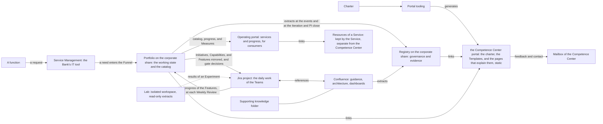

# Collaboration tooling

## 1. Intent and scope

This page lists the tools and the portals that the Competence Center uses, what each is used for, and within which workflows. The charter holds the rules, and the tools hold the work. Each tool adapts to the workflows of the charter, and the charter does not configure the tools.

## 2. The tools and the portals

Figure 1 shows how they relate.

Figure 1: the collaboration tooling.

The following table lists them.

| Tool or portal | Used for | Audience | Workflows |
| --- | --- | --- | --- |
| Jira project | The runtime of the daily work: the Work Items of the Teams on their backlogs and boards, and a mirror of the Initiatives, Capabilities (as Epics), and Features on the Program Kanban, fed from the Portfolio. An Initiative is held above the Epic, a Capability is an Epic, a Feature is an issue, and a Work Item is a sub-task. Jira owns the execution below the Feature and the progress of a Feature between Weekly Reviews, and the Portfolio owns every other field. It is for business and project management, and it holds no code and no data | Competence Center, partners, and stakeholders | Service delivery; Cadence; Engagement |
| Service Management | The Bank's IT tool for requests, support, and onboarding. The Competence Center joins it, so that requests of every kind come through one common entry, from a new need to support, and the Competence Center hosts its own services and support team in it | The whole Bank | Engagement (the contact and the support); Service delivery (operation and support); AI Incident handling |
| Confluence | Collaboration: the technical guidance and the ways of working in Jira, the architecture repository of the Solutions and Services, the dashboards of the progress of the PI and the Iteration, and the backlogs by reference to the Portfolio and to Jira. It is living content with minimal governance | Competence Center and stakeholders | Service delivery; Cadence; Engagement (drafts of the Service Agreement and the Outcome Report) |
| Supporting knowledge folder | Technical guides, working templates, and knowledge material that are not records and not rules | Competence Center and partners | Service delivery |
| Portfolio | The source of truth of the working state of the portfolio and the program, from the Discovery catalog to delivery: the Portfolio Backlog and Portfolio Kanban with the Initiative Briefs, the Roadmap, the Program Backlog and Program Kanban with the Program Board, the Program Increment folder, the Dependencies, the Calendar, the Teams, the Dashboard, and the folder of each Initiative with its documents; and the catalog of Solutions and Packages. It owns the identity, parent, rank, class of service, definition, acceptance criteria, and gate states with their dates of each item. A repository with a protected main branch (Operating Model 7.4) | Competence Center; internal audit, read only | Service delivery; Cadence; Engagement; Unit governance |
| Registry | The governance records and the evidence records: the Appointments, the Decision Log and the Decision Records, the Steering Summaries, the Priorities, the Standards, the Risks and Issues, the AI Registry, the Control Matrix, the reports, the Registry Snapshots, and the closed and dated evidence extracts. A repository with a protected main branch (Operating Model 7.4) | Competence Center; internal audit, read only | Unit governance; AI risk and control |
| Corporate share | The home of the Registry and of the Portfolio, whose documents the portals link to | Competence Center; internal audit, read only | Unit governance |
| Competence Center portal | The charter, the Templates, and the pages that explain them: the courses, the learning paths, the knowledge base, the references, and the service catalog, as a static portal. It presents the definitions of the Measures, and links to the evidence records of the Registry and to the documents of the Portfolio on the corporate share | All employees, including the Competence Center, the Executive Sponsor, and internal audit | Unit governance; AI risk and control; Engagement |
| Portal tooling | Generates the Competence Center portal from the charter. Its keeper is named in the Appointments Record | Competence Center | Unit governance |
| Mailbox of the Competence Center | Feedback and contact, and internal correspondence | All employees | Engagement; Unit governance |
| Operating portal | A knowledge base of non-sensitive information: the services portfolio and the development efforts, the scenarios, and the proposals, so that the Bank learns about AI. It presents the progress and the Measures of the Dashboard. It is static, and it is updated when new content is available and not left stale | Internal consumers | Engagement; Service delivery |
| Lab | The isolated workspace in which an Experiment runs, with access by role and logging, on read-only extracts of data | Competence Center, and the Domain Experts of an Experiment | Service delivery (Experiment) |
| Resources of a Service | The product resources of a Service, kept by the Service and separate from the Competence Center | The users of the Service | Service delivery (operation) |

## 3. Where the rules are

The charter prevails, and Confluence, the supporting folder, and the portals never override it. The pages that the Competence Center portal adds to explain the charter are kept as the Document Catalog 5.4 states. The rules on the content of the tools, on the keeper of each tool, and on the evidence are in the Operating Model 7.2 and 7.6: the Portfolio holds the working state of the portfolio and the program, Jira and Confluence run the daily work, and the Registry holds the evidence. Each field has one owner: the Portfolio owns the identity, parent, rank, class of service, definition, acceptance criteria, and gate states with their dates, and Jira owns the execution below the Feature and the progress of a Feature between Weekly Reviews. A gate decision is recorded in the Portfolio and, as evidence, in the Registry first, and only then reflected in Jira. The Competence Center Lead records the progress of the Features in the Portfolio at each Weekly Review and at once at any gate, and a difference between Jira and the Portfolio is corrected and noted at the Weekly Review (Operating Model 7.1, 7.6). There is one Portfolio Backlog and Portfolio Kanban and one Program Backlog and Program Kanban, and the service area is a field of the item and not a separate backlog (Portfolio Management Model 9.4; Solution Lifecycle Model 9.1). The Registry and the Portfolio are promoted to the corporate share (Operating Model 7.4), and the portals link to the documents there and do not embed them.

## 4. The cutover

The cutover is the day from which the Work Items of the Teams, and the mirror of the Initiatives, Capabilities, and Features, run in Jira and Confluence. The Competence Center Lead sets it and enters it in the Decision Log. The working state of the portfolio and the program stays in the Portfolio, and the Registry keeps the evidence records as closed and dated extracts (Operating Model 7.1, 7.2).
