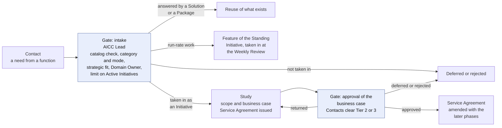
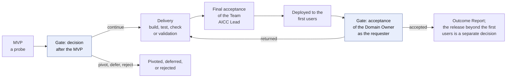
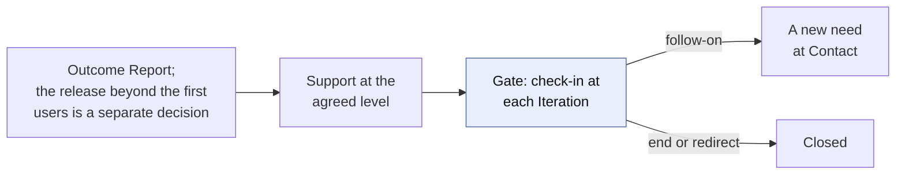

# Engagement workflow

## 1. Intent and scope

This is the top-level workflow of AICC: how AICC and the rest of the Bank work together. AICC works as an internal consulting and innovation lab. A function brings a need, AICC commits to an Engagement in a Service Agreement, delivers an outcome with its evidence, and supports it at the agreed level. The workflow follows a consulting engagement from the first contact to the follow-on, and it sits on top of the other workflows: the service delivery workflow carries the work, and the unit governance workflow controls it.

The rules are in the Business Model, the Operating Model, the Portfolio Management Model, the Solution Lifecycle Model, and the AI Policy. This workflow shows the flow and the intent, and states no rule of its own.

## 2. The engagement lifecycle

An Engagement passes through six steps. Each step ends in a decision or a record, and the function is kept informed throughout. At intake the need finds its service category and its mode, run-rate work or an Initiative (Business Model 4.5 and 4.7), and the catalog is checked for a Solution or a Package that already answers it (Business Model 7.2).

Figures 1 to 3 show the lifecycle, with the exits. The Service Agreement is issued when the study starts and amended when the business case is approved.

Figure 1: the Engagement from the contact to the approval of the business case.

Figure 2: the Engagement from the MVP to the acceptance.

Figure 3: the Engagement from the Outcome Report to the close.

The following table states each step, with its consulting counterpart and where it lives in the other workflows.

| Step | Consulting counterpart | What happens | Decision or record | In the service delivery workflow |
| --- | --- | --- | --- | --- |
| Contact | Lead | A function raises a need, or AICC finds one in its exploration; the AICC Lead records its problem, size, expected Risk Tier, service category, and mode, and checks the catalog for a Solution or a Package that answers it | The item is answered from the catalog, taken in as run-rate work or as an Initiative, deferred, or rejected; no Service Agreement is issued above the limit on the Active Initiatives (Business Model 7.1 and 7.2) | Funnel: Proposed |
| Study | Diagnostic and proposal | AICC scopes the need with the function and writes the business case | The Initiative Brief; the business case is approved. A Risk Tier assigned that is higher than the one cleared returns the business case to the Control Function Contacts (Portfolio Management Model 6.4; see [AI risk and control](ai-risk-control.md)) | Reviewing (Scoping) and Analyzing (Business case, cleared by the Control Function Contacts when Risk Tier 2 or 3 is expected) |
| Service Agreement | Commitment | AICC states what it commits to: the phases, the support level, the outcome. It is issued when the study starts and amended when the business case is approved | The Service Agreement, issued by the AICC Lead; the function is notified | Reviewing (issued at the start of the study), Portfolio Backlog (amended at the approval) |
| Delivery | Delivery of the engagement | AICC proves the first Solution as a probe (the MVP), and after the decision to continue, builds and releases it with the function | The decision after the MVP; check or validation; the final acceptance of the Team; the acceptance of the Domain Owner; release | MVP, the decision, and Implementation; then Review |
| Outcome Report | Closing deliverable | AICC reports what was delivered, with the evidence referenced, and who accepted it | The Outcome Report; the acceptance of the Domain Owner, or of the Executive Sponsor for enabling work | Done: Accepted, Closed |
| Support | Managed service | AICC supports the Solution at the level that the agreement states; at each Iteration check-in the Engagement goes on, ends, or is redirected, and a follow-on returns to Contact as a new need | Support records; AI Incidents in the incident management of the Bank; a new entry or the close | Operate, Support |

Run-rate work (Business Model 4.8) runs the same steps, shortened. At Contact the AICC Lead takes it in at the Weekly Review once the Domain Owner has approved the use for its data class. The Study is a scoping of days, with no business case. There is no Service Agreement of its own: the Standing Initiative of the service area carries it (Business Model 4.9). Delivery is a Feature of the Standing Initiative, done within one Iteration, and tested, checked or validated, and accepted as any Feature is. There is no Outcome Report of its own, and the Feature records the work. Support is on demand. A request that cannot be done within one Iteration returns to Contact and is taken in as an Initiative.

## 3. The Service Agreement through the Engagement

The Service Agreement is the commitment. It is a working agreement and not a legal document, issued and amended as the Business Model 5 states. It is checked in at each Iteration, and each change is noted in its changes table when the scope is redirected or a Dependency fails. The Outcome Report ends it.

The function commits to nothing (Business Model 5.4). What AICC relies on from the function is written as an Assumption, and a failed Assumption re-plans the scope and the dates.

## 4. The support levels

What AICC provides after delivery is chosen for each Engagement. The Solution type typically follows from it.

| Support level | What AICC does | Typical Solution type |
| --- | --- | --- |
| None | Hands the Solution over, with the Outcome Report | Experiment, or a Product handed over |
| On demand | Answers requests and issues new versions when asked | Product |
| At agreed response targets | Supports to targets that the agreement states | Service |
| Run by AICC | Runs the Solution for its whole life, with its run cost and sunset rule | Service |

## 5. Value, flow, and knowledge

Each Engagement records the benefit that the function claims and confirms, and the lead time and cycle time of its work (Solution Lifecycle Model 10). The Quarterly Report shows them for each Engagement. The figures of the Bank stay in the systems of the Bank, and the records point to them. AICC does not charge the functions; the Domain pays the run, the licenses, and the provider costs from its Envelope (AICC Charter 4.1). Every Engagement also leaves its lessons in the Portfolio and, where one results, a Package, recorded in a Package Definition, so that the next one starts further on and the next need may be answered from the catalog (Business Model 4.4). The Proposals that AICC makes from what it proves feed the AI adoption strategy of the Bank, which the Bank decides.

## 6. Where it runs

From the cutover of the working state (Operating Model 7.1), the Engagement runs in Jira and Confluence, as the [Service delivery](service-delivery.md) workflow shows: the Initiative and its Capabilities and Features in Jira, the Service Agreement and the Outcome Report drafted in Confluence, and requests and support taken in Service Management. Until then the Registry holds the working state, and it holds the Service Agreement as issued, the Outcome Report as accepted, and the Initiative package.
