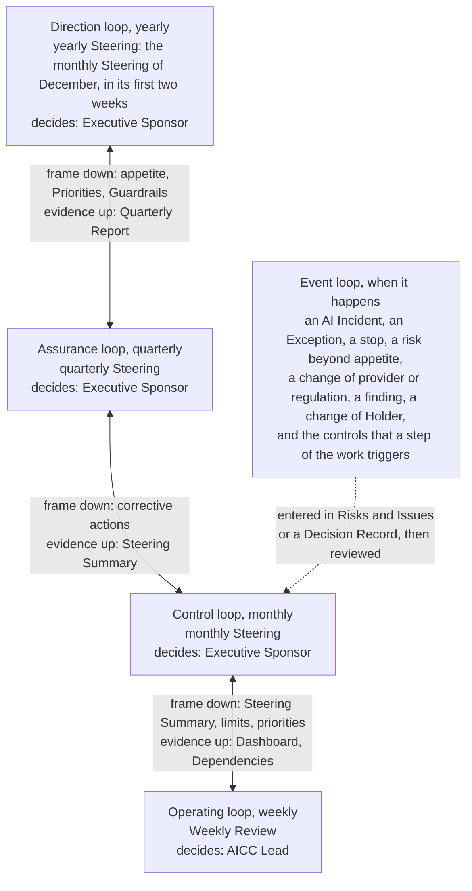
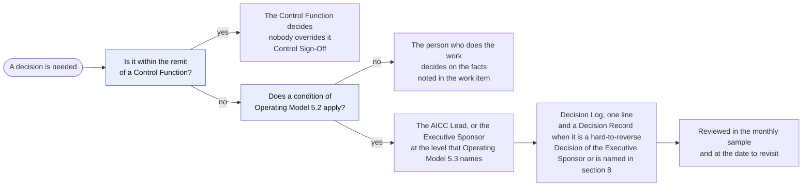
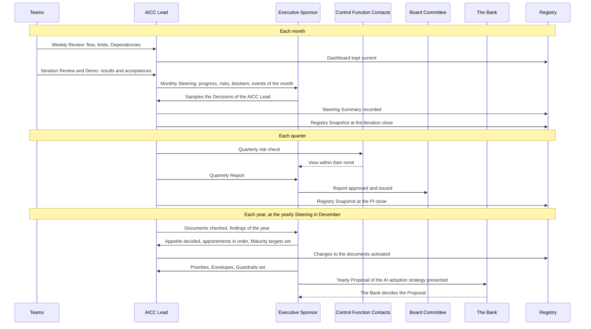
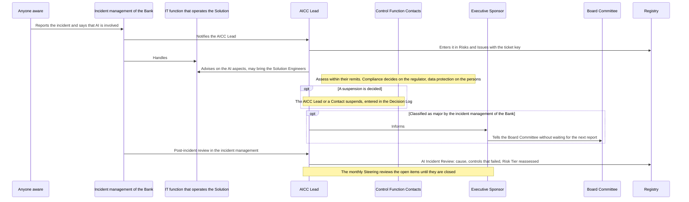
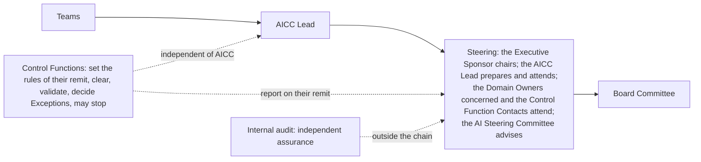
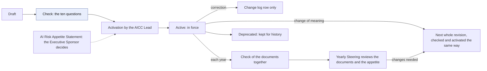

# Unit governance workflow

## 1. Intent and scope

This workflow shows how AICC is directed, reported, and controlled as a unit of the Bank, and who does what in sequence. It answers the question "how does your unit operate?". It shows how the loops of the unit and of the portfolio stack on the Steerings and the Weekly Review, how a decision moves up and what each Steering carries, what happens on an event, and the sequences between the Roles for a month, a quarter, a year, and an AI Incident.

The rules are in the Operating Model, the Portfolio Management Model, the Solution Lifecycle Model, the AICC Charter, and the AI Policy. This workflow shows the flow and the intent, and states no rule of its own. The controls of an AI Solution, from the Risk Tier to the Exception and the stop, are in the AI risk and control workflow.

## 2. The loops on the Steerings

The control of the unit runs as five loops (Operating Model 6), and the portfolio runs as four loops (Portfolio Management Model 4). They run on the same Steerings and on the Weekly Review, and they add no meeting. The strategic loop runs with the direction loop at the yearly Steering, the portfolio review loop with the assurance loop at the quarterly Steering, the portfolio sync loop with the control loop at the monthly Steering, and the backlog care loop with the operating loop at the Weekly Review.

Figure 1 shows the loops with the person who decides in each, and how the frame passes down and the evidence passes up between neighbors.

Figure 1: the control loops, their deciders, and the frame and the evidence between them.

The Steerings are not three meetings: the quarterly Steering carries the monthly core and adds to it, and the yearly Steering is the monthly Steering of December and adds to it. Each Steering reviews the controls of the loops it carries (Operating Model 6.1). The following table states what each Steering carries (Operating Model 6.5 to 6.7 and 6.11; Portfolio Management Model 4.2 to 4.4).

| Steering | Loops it carries | What it carries |
| --- | --- | --- |
| Monthly | Control, and portfolio sync; the controls of the operating loop and the event loop | The core: progress, risks, and blockers; a sample of the Decisions of the AICC Lead and the share found in order; the events of the month and the controls that they triggered; the acceptances and the review of the live Solutions; the open Exceptions and the deficiencies; the gate decisions that are due; the Active Initiatives against the limit; the portfolio sync; the governance measures read monthly; the Registry Snapshot of the Iteration |
| Quarterly | Assurance, and portfolio review, in addition to the monthly core | The decision on each Active Initiative; the quarterly risk check and the review of each Risk Tier 3 Solution; the access review; the reconciliation of the AI Incidents with the incident management of the Bank; the status of each control in the Control Matrix and the governance measures read quarterly; the Maturity Level of each Strategic Priority; the report to the Board Committee; the Active Initiatives against the limit and the completeness of the Outcome Reports; the review of the Adopted Solutions; the confirmation of the PI Objectives and the Roadmap |
| Yearly, in December | Direction, and strategic, in addition to the monthly core | The appointments in order; the documents and the AI Risk Appetite Statement; the targets of the Measures of the Maturity Levels for the next year; the governance measures read yearly; the Strategic Priorities, the Investment Envelopes, and the Investment Guardrails; the yearly Proposal of the AI adoption strategy, which the Executive Sponsor presents and the Bank decides; the Quarterly Report of PIQ3 as its input |

In the month that holds the IP week (March, June, and September), the quarterly Steering is also that month's Steering, and no separate monthly Steering is held. In December, the monthly Steering is held in the first two weeks as the yearly Steering, and the quarterly Steering of the IP week carries only the assurance loop and the portfolio review.

## 3. How a decision escalates

Figure 2 shows how the level of a decision is chosen and what it leaves on record (Operating Model 5).

Figure 2: the choice of the level of a decision, and its record.

## 4. Events

An event that is not on the calendar enters the Risks and Issues Record with an owner and a due date, and it runs the same cycle until it is closed (Operating Model 6.9, Figure 6 of the Operating Model). Anyone may raise an event. The following table states what happens for each kind of event.

| Event | What happens | Read |
| --- | --- | --- |
| An AI Incident | It is handled in the incident management of the Bank, and the AICC Lead is a stakeholder, enters it in the Risks and Issues Record with the ticket key, and reviews it afterwards | Section 6, Figure 4; AI Policy 5 |
| An Exception | The Control Function Contact for the remit decides, for a limited time, and the Exception is entered in the Risks and Issues Record and reviewed monthly until it expires | The AI risk and control workflow; AI Policy 6 |
| A suspension or a stop | The AICC Lead or a Contact may suspend, and the suspension is entered in the Decision Log; a stop by a Control Function is final | The AI risk and control workflow; Operating Model 5.4 |
| A risk beyond the appetite | The Executive Sponsor decides, with a Decision Record, and the Board Committee is told without waiting for the next report | Operating Model 5.4; Charter 7.2 |
| A change of provider or regulation | The provider is checked again, and the AICC Lead decides whether the change needs a new check or validation; the Executive Sponsor may call an extra review of the documents and the appetite | AI Policy 4.1; Solution Lifecycle Model 8.6; Operating Model 6.5 |
| A finding or a deficiency | It is entered in the Risks and Issues Record with an owner and a due date, and the monthly Steering reviews it until it is closed | Operating Model 8.2 |
| A change of Holder | The AICC Lead enters the appointment, the change, or the relief in the Appointments Record with its date and its decision reference; the new Holder accepts the Role, names a deputy, receives the access, and completes the training; the access of the previous Holder is removed | Operating Model 4.8, 4.9 |
| A step of the work that triggers a control | A Service Agreement, a business case, a Risk Tier, a check or a validation, a release, a use for a data class, a provider check, a deployment or a change, a sharing of data, a published output, or a retirement leaves its own evidence record; it enters the Risks and Issues Record only when the control is Open or in Deficiency, and the monthly Steering reviews it among the events of the month | Operating Model 6.9, 8.5 |

## 5. A month, a quarter, and a year in sequence

The Teams, the AICC Lead, the Executive Sponsor, the Control Function Contacts, the Board Committee, and the Bank exchange the following each month, each quarter, and each year. Figure 3 shows the sequence.

Figure 3: a month, a quarter, and a year in sequence.

## 6. An AI Incident in sequence

The incident is owned by the incident management of the Bank, and the AICC Lead is a stakeholder (AI Policy 5). Figure 4 shows who does what, in order.

Figure 4: an AI Incident in sequence.

## 7. The reporting chain

Reporting flows from the Teams up to the Board Committee, and the Control Functions stand beside it, independent of AICC. Internal audit stands outside the chain (Operating Model 2.4, 6.3, 6.10). Figure 5 shows the chain and who sits at the Steering.

Figure 5: the reporting chain.

## 8. The life of a document

The Document Catalog 3, 4, and 7 state the life of a document. Figure 6 shows it.

Figure 6: the life of a document.

## 9. Where it runs

The loops run in Jira and Confluence from the cutover of the working state (Operating Model 7.1), and until then the Registry holds the working state. The charter holds this schema.
