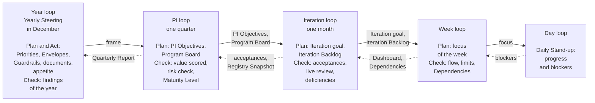
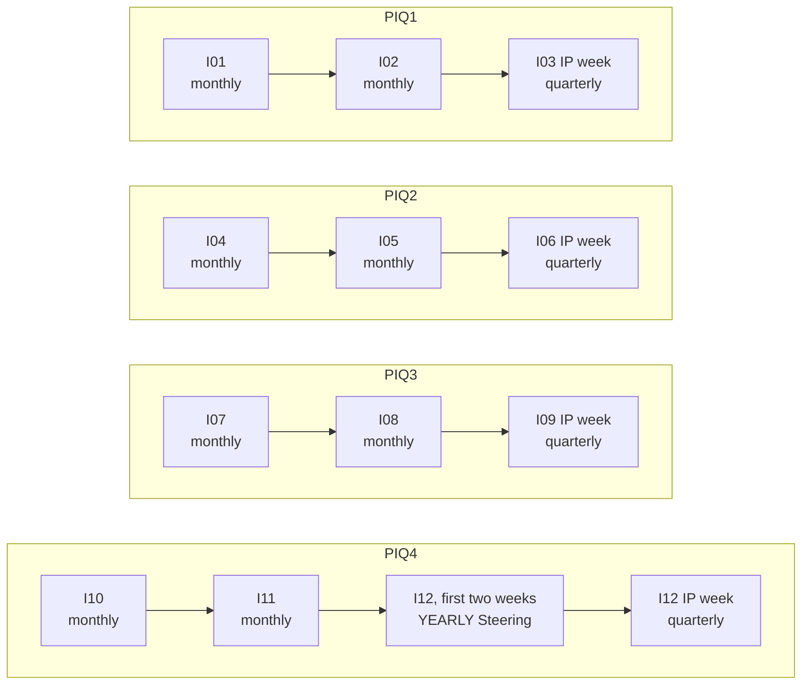
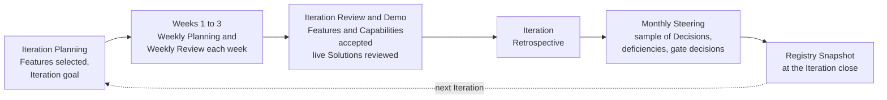
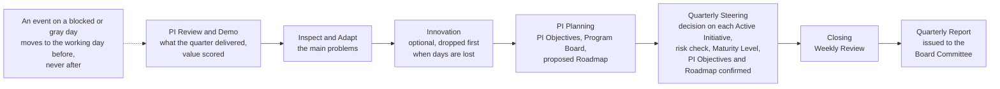

# Guide: Cadence

## 1. Purpose and when it applies

This guide explains the rhythm of AICC: which events are held, what each is for, and what each leaves on record. It applies to every Initiative and to the control of AICC as a unit. Work runs in Program Increments (PI) of one quarter. A PI has three Iterations, each one calendar month of four or five whole weeks, and the last week of the third Iteration is the Innovation and Planning (IP) week. Every week starts with planning and ends with review. The Cadence workflow shows the general flow without dates, and the Calendar Record holds the dates with the blocked and gray days.

## 2. The beats and their records

| Beat | Events | What it controls | Record left |
| --- | --- | --- | --- |
| Day | Daily Stand-up | Progress and blockers | None; a blocker is entered in the work item |
| Week | Weekly Planning, Weekly Review | The flow, the Limits on Work in Progress, the Dependencies, and the care of the funnel and the Portfolio Backlog | The current boards and the Dashboard |
| Iteration | Iteration Planning, Iteration Review and Demo, Iteration Retrospective, and the monthly Steering | The work of the month; the acceptance of the Features and the Capabilities by the product owner; the review of each live Solution by its Domain Owner; the gate decisions that are due; the sample of the Decisions of the AICC Lead; the open deficiencies | The Steering Summary; the note of each acceptance in the backlog; the note of each review in the Solution Definition; the Registry Snapshot at the Iteration close |
| Program Increment | PI Review and Demo, Inspect and Adapt, PI Planning, and the quarterly Steering | The value of the quarter; the decision on each Active Initiative; the quarterly risk check, the access review, and the reconciliation of the AI Incidents; the confirmation of the PI Objectives and the Roadmap | The Quarterly Report; the Registry Snapshot at the PI close; the Steering Summary |
| Year | The yearly Steering, which is the monthly Steering of December | The direction for the next year: the documents, the AI Risk Appetite Statement, the appointments, the Strategic Priorities, the Investment Envelopes, and the Investment Guardrails | The Decision Records; the Appointments Record; the Priorities |

## 3. The loops on the beats

Figure 1 shows the loops as one nested system. Each loop takes its frame from the loop above it and returns its evidence to it.

Figure 1: the nested loops of the cadence, with the frame going down and the evidence coming up.

The control loops of the Operating Model 6 and the portfolio loops of the Portfolio Management Model 4 run on these beats and add no meeting. The Weekly Review is the operating loop and the backlog care loop. The monthly Steering is the control loop and the portfolio sync. The quarterly Steering is the assurance loop and the portfolio review. The yearly Steering is the monthly Steering of December, held in the first two weeks of that month, and it is in addition the direction loop and the strategic loop.

## 4. The conduct of the month, the quarter, and the year

Figure 2 shows the Steerings of a year, one row for each Program Increment in sequence. The month that holds the IP week has the quarterly Steering in place of the monthly one, and December has the yearly Steering in its first two weeks in addition to the quarterly Steering of its IP week.

Figure 2: the Steerings of a year.

**The month.**

- The month starts with the Iteration Planning, in which the Team selects the Features of the month.
- Each Monday and Friday the Team plans and reviews the week.
- The last week is the review week. It holds the Iteration Review and Demo, in which the product owner accepts the Features and the Capabilities and the Domain Owner reviews each live Solution, the Iteration Retrospective, and the monthly Steering, on a day that is fixed with the people outside AICC.
- The Registry Snapshot is taken at the close.

Figure 3 shows the flow of the month.

Figure 3: the flow of the month.

**The quarter.** The IP week holds the following events, in this order.

- The PI Review and Demo shows what the quarter delivered.
- Inspect and Adapt solves the main problems of the quarter.
- Innovation gives time to learn.
- The PI Planning sets the intent and the direction of the next PI.
- The quarterly Steering decides on each Active Initiative, takes the quarterly risk check, confirms the Maturity Level, and confirms the PI Objectives and the Roadmap.
- The AICC Lead writes the Quarterly Report, and the Executive Sponsor approves and issues the report to the Board Committee.
- In the month that holds the IP week, the quarterly Steering is also the Steering of that month, and no separate monthly Steering is held, except in December.

Figure 4 shows the flow of the IP week and the treatment of a day that is not available.

Figure 4: the IP week, and the treatment of an event on a day that is not available.

**The year.**

- In the first two weeks of December the monthly Steering is held as the yearly Steering.
- It takes the Quarterly Report of PIQ3 and the findings of the year to that date.
- It sets the Strategic Priorities, the Investment Envelopes, and the Investment Guardrails, and it reviews the documents and the appetite, for the next year.
- The quarterly Steering of the IP week in December then carries only the assurance loop and the portfolio review. A change in the frame that the result of PIQ4 calls for is taken at the first quarterly Steering of the next year.

## 5. Exceptions when the calendar is not clean

| Situation | Treatment |
| --- | --- |
| An event falls on a blocked or gray day | It moves to the working day before, and never to a day after |
| The IP week is blocked or gray | The Calendar Record places the IP week (Solution Lifecycle Model 6.1) |
| The year ends in the IP week | The Calendar Record may place the IP week earlier and keep the year-end week free of events |
| An event is missed | It is not held later, and its intent is covered at the next event |
| The Team has up to three people | Light mode applies: one weekly session, and fewer events |
| The month holds the IP week | The quarterly Steering that ends the IP week is also the Steering of that month, except in December, when the monthly Steering is held in the first two weeks as the yearly Steering |

## 6. Rule source

Solution Lifecycle Model 6; Operating Model 6; Portfolio Management Model 4; the Cadence workflow; the Calendar Record.
