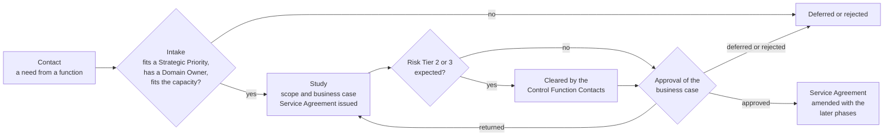
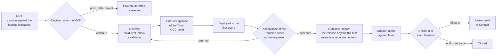
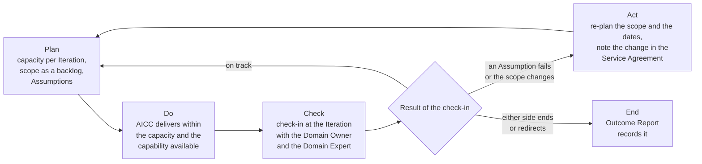
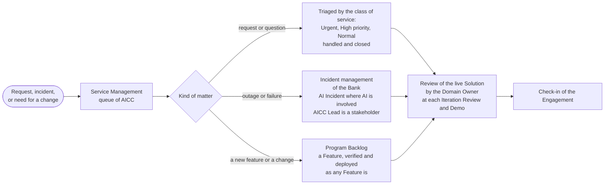

# Guide: Engagement

## 1. Purpose and when it applies

This guide explains how AICC works with a function of the Bank. AICC acts as an internal consulting unit: a function brings a need, AICC commits to an Engagement in a Service Agreement, delivers an outcome with its evidence, and supports it at the agreed level. It applies to every Engagement, from a short study to a Service that AICC runs. The rules are in the Business Model, the Portfolio Management Model, the Solution Lifecycle Model, and the AI Policy, and this guide states no rule of its own.

## 2. Who takes part

| Role | In an Engagement |
| --- | --- |
| Domain Owner | Represents the client function; approves the business case within a Domain and below a guardrail; judges the working Solution and accepts it as the requester; confirms the benefit |
| Domain Expert | Partner from the function who works with AICC |
| AICC Lead | Takes the need in; writes the business case with the Domain Owner; issues the Service Agreement; gives the final acceptance of the Team before the Solution is deployed to the first users; writes the Outcome Report |
| Solution Engineer | Designs, builds, and runs the Solution with the Domain Expert |
| Executive Sponsor | Is the client of enabling work, and approves what exceeds a guardrail or spans Domains |
| Control Function Contacts | Clear the business case when Risk Tier 2 or 3 is expected, validate the Solution, and may stop it |
| Stakeholders and other heads of function | Are notified, and commit to nothing |

## 3. How a function starts

A head of function brings a need to the AICC Lead, in any form: a conversation, a message, or a ticket in Service Management. The AICC Lead is named in the Appointments Record. The AICC Lead enters the need in the Portfolio Backlog and takes it in when it fits a Strategic Priority, has a client function with a Domain Owner, and fits the capacity (Business Model 7.2). Otherwise it is deferred or rejected.

## 4. How an Engagement runs

Figure 1 shows the path of an Engagement from the first contact to the approval of its business case, with the decisions that bind it.

Figure 1: the path of an Engagement from the contact to the approval.

Figure 2 shows the path from the approval of the business case to the close.

Figure 2: the path of an Engagement from the MVP to the close.

The following table states each step, the person who acts, the time, and the record that is left.

| Step | What happens | Who | When | Record left |
| --- | --- | --- | --- | --- |
| Contact | A function raises a need, or AICC finds one | Anyone; the AICC Lead takes it in | Any time | An entry in the Portfolio Backlog |
| Study | The need is scoped, and the business case is written and cleared by the Control Function Contacts when Risk Tier 2 or 3 is expected | AICC Lead with the Domain Owner | When the study starts | The Initiative Brief with the clearances |
| Service Agreement | AICC states what it commits to | AICC Lead; the function is notified | Issued when the study starts, and amended when the business case is approved | The Service Agreement |
| Delivery | The first Solution is tried as a probe (the MVP), and after the decision to continue it is built, verified, and deployed to the first users | Solution Engineer with the Domain Expert; the AICC Lead gives the final acceptance of the Team | In the Iterations of the Program Increment | The Solution Definition, the decision after the MVP, the Control Sign-Off, and the release block |
| Outcome Report | The outcome is reported, and the Domain Owner, or the Executive Sponsor for enabling work, accepts it | AICC Lead issues; the Domain Owner accepts | At the end of the Engagement | The Outcome Report |
| Support | The Solution is supported at the agreed level | Solution Engineer | After delivery | Service Management records, and the AI Incident Review |
| Follow-on | A new need, or the end | The AICC Lead, with the Domain Owner | At each Iteration check-in | A new entry, or the close |

## 5. The commitment in practice

The Service Agreement has two parts. The commitment states the phases, the support level, the scope and what is out of scope, the deliverables and their definition of done, the capacity per Iteration in days, the Assumptions, the check-in, and the end. The working agreement states who works on it and when, how AICC and the function communicate and decide, who is notified, how data is handled, how issues are escalated, and how progress is reported. AICC commits to the capacity and works toward the outcome on a best-effort basis, within the capacity and the capability that it has available, and the function commits to nothing. What AICC relies on from the function is written as an Assumption.

Figure 3 shows the Service Agreement as a loop that runs at each Iteration.

Figure 3: the loop of the Service Agreement.

## 6. After delivery

What AICC provides after delivery is chosen for each Engagement and is stated in its Service Agreement. The Solution type follows from it.

| Support level | What AICC does | Solution type |
| --- | --- | --- |
| None | Hands the Solution over, with the Outcome Report | Experiment, or a Product handed over |
| On demand | Answers requests and issues new versions when asked | Product |
| At agreed response targets | Supports to the targets that the Service Agreement states | Service |
| Run by AICC | Runs the Solution for its whole life, with its run cost and its sunset rule | Service |

Figure 4 shows how a request, an incident, and a change are handled after delivery. The response targets are targets and not guarantees.

Figure 4: support, incident, and change after delivery.

## 7. Situations

| Situation | Treatment |
| --- | --- |
| An Assumption fails, for example the Domain Expert is not available | AICC re-plans the scope and the dates and notes the change in the Service Agreement; the item is Waiting |
| The function wants a different scope | The backlog is reordered within the capacity at any time; a change beyond it is a new Engagement or an amendment |
| Either side wants to stop | The Engagement is ended or redirected at the end of an Iteration, and the Outcome Report records it |
| The capacity is full | A new Service Agreement is not issued above the capacity; the item waits in the Portfolio Backlog |
| A request or an incident arrives after delivery | It comes through Service Management; the response targets are targets and not guarantees |

## 8. Rule source

Business Model 2 to 7; Portfolio Management Model 5 to 7; Solution Lifecycle Model 7.3, 8.1, 8.4, 8.5; AI Policy 5; the Engagement workflow.
