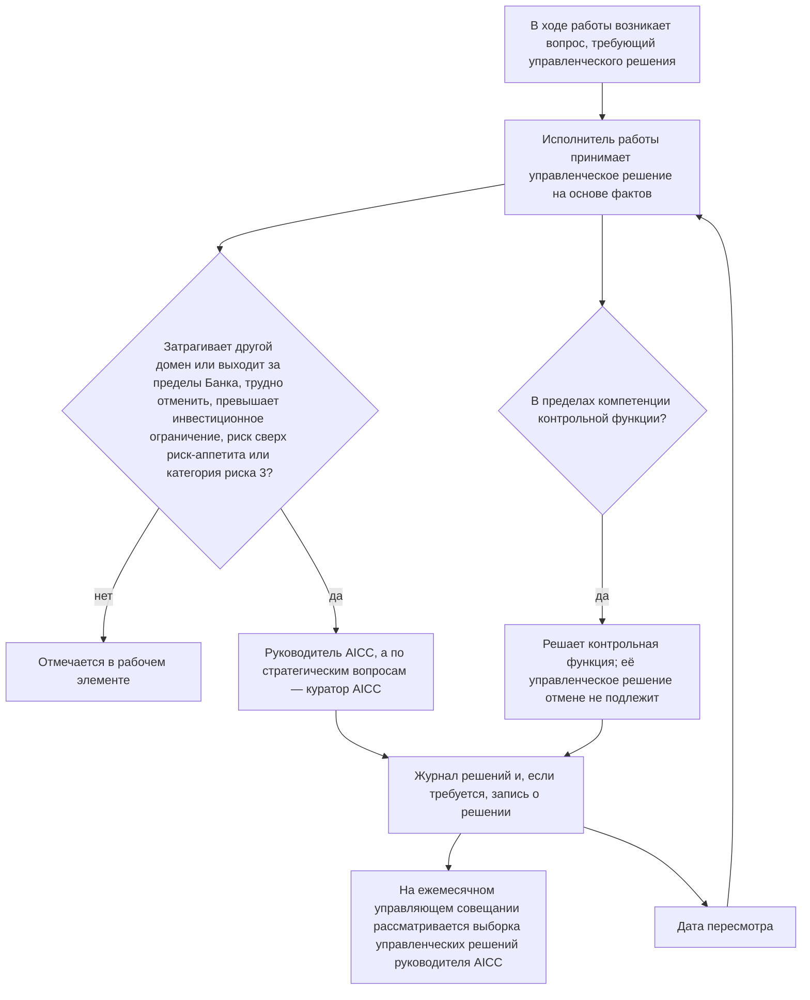
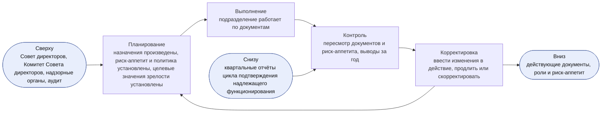
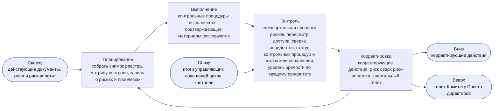
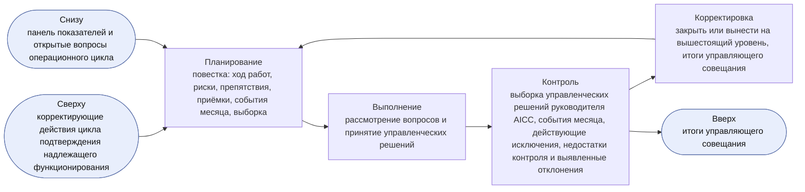
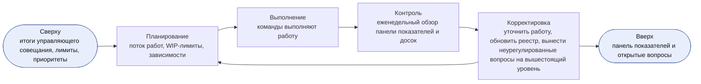
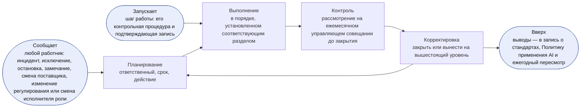
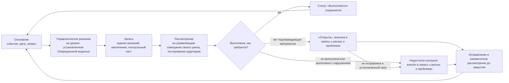
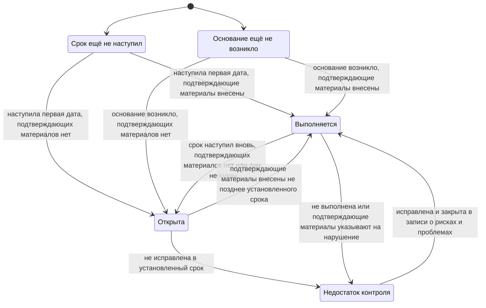

```yaml
id: AICC-ORG-01-RU
title: Операционная модель
status: active
revision: 2.0
created: 2026-10-02
revised: 2026-10-03
source: charter/en/documents/operating-model.md
source_revision: 2.0
source_sha256: 6d917ac2389d894780cf8bc119ed0588aaf65ce99d407f54fb22b323a6a3e72b
translation_status: reviewed
```

# Операционная модель

## 1. Назначение и область применения

1.1. Настоящая Операционная модель устанавливает порядок управления AICC как подразделением Банка и контроля его деятельности: распределение обязанностей, порядок принятия управленческих решений, порядок работы цикла контроля, а также сведения, которые фиксируются в записях и подлежат тестированию.

1.2. Операционная модель распространяется на AICC, а также на домены и контрольные функции Банка, которые работают с AICC.

1.3. Модель управления портфелем устанавливает порядок приёма, финансирования и прекращения Initiatives, а Модель жизненного цикла решений — порядок движения работы от бэклога программы до вывода решения из эксплуатации и ритм её выполнения. Эти документы действуют в рамках настоящей Операционной модели; при расхождении применяется Операционная модель. Рабочие процессы корпуса показывают, как проводятся циклы: «Взаимодействие с заказчиком», «Портфель и поставка услуг», «Ритм работы», «Инструменты совместной работы», «Управление подразделением», «Риски и контроль AI». Самостоятельных правил рабочие процессы не устанавливают.

1.4. Рисунок в настоящей Операционной модели иллюстрирует пункт и самостоятельных правил не устанавливает. При расхождении рисунка и пункта применяется пункт.

## 2. Статус AICC

2.1. Что представляет собой AICC, установлено Бизнес-моделью. Для целей настоящей Операционной модели AICC — совместная команда под руководством руководителя AICC, в которую входят работники, выделенные подразделениями Банка; они работают вместе с доменами.

2.2. AICC не владеет платформой AI и не отвечает за бизнес-результаты доменов; при этом AICC отвечает за сервис, который он эксплуатирует (п. 8.1 Модели жизненного цикла решений). Реализацию обеспечивают домены. AICC определяет направление работы, оказывает методическую поддержку и вправе выделять инженеров решений для создания и эксплуатации решений.

2.3. AICC не является контрольной функцией. Контрольные функции независимы от AICC и сохраняют собственную ответственность в пределах своей компетенции.

2.4. AICC действует в рамках модели трёх линий, принятой в Банке. AICC и домены отвечают за риски своей работы. Контрольные функции устанавливают правила в пределах своей компетенции, согласовывают, проводят валидацию, принимают решения об исключениях и вправе остановить применение решения. Внутренний аудит проводит независимую оценку.

## 3. Принципы работы

3.1. AICC руководствуется следующими принципами.

(a) Принимать управленческие решения там, где известны факты: решает тот, кто ближе всего к работе, на основе фактических данных.

(b) По возможности сохранять обратимость управленческих решений; обратимые управленческие решения принимать быстро.

(c) Работать в темпе продуктовой разработки, сохраняя контроль на уровне, принятом в банковской деятельности.

(d) Сохранять только те процессы и записи, которыми кто-либо пользуется, и отказываться от остальных.

(e) Ставить достигнутый эффект выше объёма выполненной работы, а сотрудничество — выше переговоров. План может меняться, цель остаётся прежней.

3.2. AICC применяет ценности и принципы, установленные Заявлением о намерениях.

## 4. Роли

4.1. В AICC установлено семь ролей. Одно лицо вправе исполнять несколько ролей, а у одной роли может быть несколько исполнителей при соблюдении правил разделения обязанностей, установленных пунктом 4.4.

4.2. Роли, обязанности их исполнителей и полномочия по принятию решений установлены в следующей таблице.

| Роль | Обязанности | Полномочия по принятию решений |
| --- | --- | --- |
| Куратор AICC | Наделён мандатом на деятельность AICC и обеспечивает его финансирование; назначает руководителя AICC и членов Управляющего комитета по AI; утверждает отчёт Комитету Совета директоров и направляет его Комитету | Стратегические приоритеты, инвестиционные бюджеты, инвестиционные ограничения и структура Initiatives; Заявление о риск-аппетите в отношении AI; одобрение бизнес-кейса, который превышает инвестиционное ограничение, охватывает несколько доменов или относится к обеспечивающим работам, а также управленческое решение по итогам его MVP: продолжить, изменить направление, отложить или отклонить; выпуск решения категории риска 3; принятие любого риска сверх Заявления о риск-аппетите в отношении AI; вывод из эксплуатации сервиса, охватывающего несколько доменов; одобрение результата AI, публикуемого за пределами AICC; бизнес-приёмка элемента, который охватывает несколько доменов, относится к обеспечивающим работам AICC или является экспериментом без домена, а также элемента, по которому владельцем домена является руководитель AICC (п. 7.3(c) Модели жизненного цикла решений); для решения, созданного руководителем AICC, — одобрение его описания решения, категории риска и применения для класса данных (4.4(d)); назначение временно исполняющих обязанности представителей контрольных функций |
| Руководитель AICC | Руководит AICC как ведущий инженер и архитектор; отвечает за настоящую Операционную модель и за все документы и записи AICC; пока в команде не более трёх человек, исполняет обязанности владельца продукта команды; готовит квартальный отчёт; докладывает Управляющему комитету по AI | Принятие элемента в проработку, его перенос или отклонение при первичном рассмотрении; принятие Initiative в работу и установление лимита Initiatives в работе в пределах структуры Initiatives, установленной куратором AICC; порядок приоритетов бэклога программы и бэклога портфеля; оформление соглашения о взаимодействии; одобрение Capabilities; приёмка Features и Capabilities в качестве владельца продукта, пока в команде не более трёх человек, и окончательная приёмка командой до развёртывания решения для первых пользователей (п. 7.3 Модели жизненного цикла решений); одобрение применения решения в AICC для класса данных; категория риска, о которой руководитель AICC сообщает владельцу домена, — в обоих случаях, кроме решения, созданного руководителем AICC (4.4(d)); необходимость новой проверки или валидации при изменении выпущенного решения (п. 8.6 Модели жизненного цикла решений); приостановление применения решения; стандарты, архитектура и шаблоны; вопросы между доменами; введение в действие всех документов, а в части Заявления о риск-аппетите в отношении AI — после его утверждения куратором AICC; исключение из требования, установленного AICC |
| Инженер решений | Отвечает за решение на всём его жизненном цикле: проектирует его, определяет архитектуру, создаёт, развёртывает и эксплуатирует совместно с доменами; визуализирует работу; оказывает методическую помощь экспертам доменов; проводит проверку работы других участников | Способ проектирования и создания решения; одобрение Features на планировании итерации; порядок, в котором команда принимает работу в разработку в пределах согласованных приоритетов |
| Владелец домена | Отвечает за результаты внедрения AI в домене; как заказчик определяет ценность элемента и оценивает работающее решение; назначает эксперта домена | Участие домена в Initiative; одобрение бизнес-кейса Initiative в пределах домена, не превышающего инвестиционного ограничения, а также управленческое решение по итогам его MVP: продолжить, изменить направление, отложить или отклонить; одобрение описания решения; финансирование решений домена за счёт его инвестиционного бюджета, включая эксплуатацию, лицензии и расходы на услуги поставщиков; одобрение применения решения в домене для класса данных и согласования, предусмотренные внутренними нормативными документами (далее — ВНД) Банка; приёмка решения домена и результата Initiative домена после окончательной приёмки командой (п. 7.3(c) Модели жизненного цикла решений); выпуск решения категории риска 1 или 2 после проверки или валидации; вывод решения из эксплуатации |
| Эксперт домена | Разъясняет порядок повседневной работы; работает с инженером решений; апробирует решение в реальной работе; затем расширяет его применение и обучает коллег | Полномочий в области финансирования, приёмки и контроля не имеет |
| Представитель контрольной функции | Консультирует по требованиям; в пределах своей компетенции определяет требования законодательства и нормативных актов, применимые к использованию AI в Банке; вправе повысить категорию риска в пределах своей компетенции, а понизить её вправе только представитель контрольной функции по модельному риску; согласовывает бизнес-кейс, предполагающий категорию риска 2 или 3, и повторно согласовывает его, если присвоенная категория риска выше согласованной; проводит валидацию решений; вправе приостановить или остановить применение решения | Согласование бизнес-кейса, валидация, повышение категории риска, приостановление, остановка и исключение из требования контроля — в каждом случае в пределах компетенции контрольной функции |
| Владелец платформы | Предоставляет и эксплуатирует платформу AI вне AICC в соответствии с требованиями записи о стандартах; хранит подтверждающие материалы, журналы и трассировки, на которые опирается валидация | Проектирование платформы AI в пределах этих требований |

4.3. Команда AICC сама распределяет между участниками дополнительные обязанности, необходимые для работы, например ведение бэклога программы, проведение мероприятий или наставничество. Дополнительная обязанность не является ролью, перераспределяется, когда команда так решит, и назначения не требует.

4.4. Разделение обязанностей обеспечивается следующими правилами.

(a) Валидация или проверка работы лицом, которое её выполнило, не допускается.

(b) Владелец домена, к которому относится решение, принимает его как заказчик (п. 7.3(c) Модели жизненного цикла решений), а для категорий риска 1 и 2 также выпускает его; проводить валидацию этого решения владелец домена не вправе.

(c) Представитель контрольной функции не входит в состав AICC и не вправе создавать решения, которые он рассматривает.

(d) Руководитель AICC вправе создавать решение, но не вправе проводить проверку или валидацию созданного им решения, выпускать его и проводить его бизнес-приёмку (п. 7.3(c) Модели жизненного цикла решений). Руководитель AICC вправе принимать Features и Capabilities такого решения и проводить окончательную приёмку командой как владелец продукта (п. 7.3 Модели жизненного цикла решений); это принятое ограничение на период малой численности команды, которое действует при наличии компенсирующих контрольных процедур, установленных п. 7.3(d) Модели жизненного цикла решений. Если владельцем домена является руководитель AICC (4.6), бизнес-приёмку и выпуск проводит куратор AICC, в остальных случаях — владелец домена. Если решение создано руководителем AICC, куратор AICC также одобряет его описание решения, присваивает ему категорию риска и одобряет его применение для класса данных (C-12, C-15). Руководитель AICC не вправе проводить валидацию решения, относящуюся к компетенции контрольной функции.

(e) До появления в AICC второго инженера решений проверку лицом, не участвовавшим в разработке, проводит инженер IT-функции или домена, которого руководитель AICC указывает в записи о назначениях.

(f) Внутренний аудит проводит только независимую оценку. Он не вправе проводить валидацию, выпускать или останавливать решения и имеет доступ на чтение ко всем записям.

4.5. Управляющий комитет по AI объединяет руководителей бизнес-подразделений, а также подразделений Банка по технологиям, управлению рисками и комплаенсу. Комитет даёт рекомендации куратору AICC, который является его председателем. В состав Комитета входят руководители, которых назначает куратор AICC; подразделение представлено в Комитете с момента назначения его руководителя членом Комитета. Комитет Совета директоров осуществляет надзор за применением AI от имени Совета директоров и получает отчёт куратора AICC. Ни Управляющий комитет по AI, ни Комитет Совета директоров ролями не являются.

4.6. Исполнители ролей указываются в записи о назначениях. Куратора AICC назначает Совет директоров. Куратор AICC назначает руководителя AICC и членов Управляющего комитета по AI. Руководитель AICC назначает инженеров решений из числа работников, выделенных подразделениями в AICC, с согласия их непосредственных руководителей; в согласии указывается время, которое каждый работник уделяет работе в AICC. Руководитель AICC также назначает проверяющего для решения категории риска 1. Руководитель домена назначает владельца домена, а владелец домена — эксперта домена. Каждая контрольная функция назначает своего представителя. Руководитель технологического направления Банка назначает владельца платформы. Назначающее лицо не вправе назначать на роль самого себя: такое назначение производит вышестоящий уровень (5.7). По собственной работе AICC владельцем домена является руководитель AICC, за исключением бизнес-приёмки, выпуска, одобрения описания решения, присвоения категории риска и одобрения применения для класса данных решения, созданного руководителем AICC (4.4(d)).

4.7. Каждый исполнитель роли указывает в записи о назначениях лицо, замещающее его на период отсутствия. Куратор AICC вправе письменно делегировать принятие управленческого решения с указанием объёма и срока делегирования, кроме управленческих решений согласно пунктам 5.4 и 5.7; делегирование вносится в запись о назначениях. Делегирование на срок более двух недель также вносится в журнал решений.

4.8. Назначения, не произведённые по состоянию на 2 октября 2026 года, производятся не позднее 1 декабря 2026 года; до этого куратор AICC назначает временно исполняющих обязанности. Руководитель AICC вносит в запись о назначениях каждое назначение, включая назначение куратора AICC по решению Совета директоров, а также каждое назначение временно исполняющего обязанности, изменение и освобождение от исполнения роли не позднее пяти рабочих дней с даты соответствующего управленческого решения, с указанием даты и реквизитов этого управленческого решения.

4.9. При назначении исполнитель роли подтверждает согласие исполнять роль, декларирует наличие или отсутствие конфликта интересов, указывает лицо, замещающее его на период отсутствия (4.7), знакомится с документами и проходит обучение по программе, которую руководитель AICC определяет для этой роли; ответственный за инструмент предоставляет права доступа, необходимые для роли (7.6). При смене исполнителя роли или освобождении от её исполнения ответственный за инструмент отзывает права доступа, предоставленные в связи с ролью, а руководитель AICC указывает прежнего исполнителя роли в записи о назначениях.

4.10. Когда в AICC появляется второй инженер решений, проверка согласно подпункту 4.4(e) проводится внутри AICC, а куратор AICC пересматривает принятые ограничения согласно подпункту 4.4(d). Когда в команде AICC появляется четвёртый участник, облегчённый режим прекращается (п. 6.6 Модели жизненного цикла решений). Домен вправе сформировать собственную команду со своим владельцем продукта, которая работает в том же ритме, на тех же досках и по тем же правилам; руководитель AICC определяет порядок приоритетов бэклога программы для всех команд и ведёт доску программы. С ростом AICC увеличивается число исполнителей ролей и команд; новые уровни управления, совещания и записи при этом не вводятся.

## 5. Управленческие решения

5.1. Управленческое решение принимает тот, кто выполняет работу, на основе фактов и тогда, когда оно необходимо. В управленческом решении указываются факты, на которых оно основано, например результаты измерений, результаты тестирования, затраты или источник.

5.2. Управленческое решение выносится на вышестоящий уровень, только если выполняется хотя бы одно из следующих условий.

(a) Оно затрагивает другой домен, выходит за пределы Банка или устанавливает стандарт для других участников.

(b) Его нельзя отменить без значительных затрат или ущерба.

(c) Оно превышает инвестиционное ограничение или изменяет стратегический приоритет.

(d) Оно предусматривает принятие риска сверх Заявления о риск-аппетите в отношении AI или касается решения категории риска 3.

5.3. Уровни принятия управленческих решений приведены в следующей таблице. При выполнении условия, указанного в пункте 5.2, управленческое решение выносится на уровень, который пункт 4.2 устанавливает для соответствующего вопроса.

| Уровень | Лицо, принимающее решение | Примеры |
| --- | --- | --- |
| Команда | Инженер решений совместно с экспертом домена и владельцем домена; владелец продукта — по приёмке Feature или Capability | Проектирование, создание, порядок принятия работы в разработку в пределах приоритетов, приёмка Feature или Capability |
| Владелец домена | Владелец домена | Бизнес-кейс и управленческое решение по итогам MVP в пределах одного домена, не превышающие инвестиционного ограничения, описание решения, приёмка решения, вывод решения из эксплуатации |
| Руководитель AICC | Руководитель AICC | Принятие элемента в проработку, его перенос или отклонение при первичном рассмотрении, принятие Initiative в работу и лимит Initiatives в работе, порядок приоритетов бэклогов, окончательная приёмка командой до развёртывания решения для первых пользователей, категория риска, необходимость новой проверки или валидации при изменении выпущенного решения, стандарты, шаблоны, вопросы между доменами |
| Куратор AICC | Куратор AICC с учётом рекомендаций Управляющего комитета по AI | Стратегические приоритеты, финансирование, структура Initiatives, бизнес-кейс, превышающий инвестиционное ограничение или охватывающий несколько доменов, и управленческое решение по итогам его MVP (продолжить, изменить направление, отложить или отклонить Initiative), выпуск решения категории риска 3, риски сверх риск-аппетита, вывод из эксплуатации сервиса, охватывающего несколько доменов |

Движение управленческого решения и его возврат на управляющее совещание в составе выборки и в дату пересмотра показаны на рисунке 1.



Рисунок 1: движение управленческого решения.

5.4. Контрольная функция принимает управленческие решения в пределах своей компетенции; её валидация или остановка в этих пределах окончательны и отмене не подлежат. Разногласия рассматривает руководитель этой контрольной функции. Куратор AICC вправе вынести вопрос на рассмотрение Правления Банка, но не вправе отменить валидацию или остановку. Принять риск сверх Заявления о риск-аппетите в отношении AI вправе только куратор AICC с последующим информированием Комитета Совета директоров. Остановка окончательна. Приостановление снимает лицо, которое приостановило применение решения, когда для этого есть основания. Приостановление и его снятие вносятся в журнал решений с указанием причины, а остановка фиксируется в заключении контрольной функции, которое оформляет её представитель.

5.5. Если заинтересованные лица не пришли к согласию, управленческое решение принимает лицо, к компетенции которого вопрос отнесён пунктом 5.3, выслушав их позиции. Остальные участники исполняют принятое решение. Несогласный вправе потребовать внести своё особое мнение в журнал решений.

5.6. Управленческое решение уровня руководителя AICC и выше, а также любое управленческое решение, которое впоследствии понадобится найти другим участникам, вносится в журнал решений отдельной строкой с указанием даты, содержания решения, фактов, лица, принявшего решение, и даты пересмотра. Для управленческого решения куратора AICC, которое трудно отменить, и для управленческого решения, которое согласно разделу 8 подтверждается записью о решении, также оформляется запись о решении. Управленческое решение команды отмечается в рабочем элементе.

5.7. Лицо, у которого есть конфликт интересов в отношении управленческого решения, обязано заявить об этом и не участвует в его принятии. Управленческое решение в этом случае принимает вышестоящий уровень.

5.8. Условия пункта 5.2, полномочия согласно пункту 5.4 и порядок ведения журнала решений согласно пункту 5.6 применяются одинаково ко всем вопросам независимо от их масштаба.

## 6. Циклы управления

6.1. Контроль деятельности AICC как подразделения обеспечивается пятью циклами. Каждый из них строится по схеме «планирование — выполнение — контроль — корректировка» (PDCA), имеет собственную периодичность и проводится на определённом мероприятии. Рамки цикла задаются вышестоящим циклом, и в него же передаются подтверждающие материалы по итогам цикла. Циклы проводятся на мероприятиях ритма работы; дополнительные совещания не вводятся. Портфельные циклы, установленные разделом 4 Модели управления портфелем, проводятся на тех же мероприятиях; в них принимаются управленческие решения по Initiatives, а в циклах настоящего раздела — по подразделению. Для управления не вводятся дополнительные совещания и не ведутся записи сверх тех, которые ведутся в ходе работы. Каждая контрольная процедура раздела 8 включена не менее чем в один цикл и рассматривается на управляющем совещании этого цикла; контрольная процедура, включённая только в операционный или событийный цикл, рассматривается на ежемесячном управляющем совещании. Циклы приведены в следующей таблице.

| Цикл | Периодичность и мероприятие | Лицо, принимающее решения | Контрольные процедуры цикла | Записи |
| --- | --- | --- | --- | --- |
| Цикл определения направления | Ежегодно, на ежегодном управляющем совещании (ежемесячном управляющем совещании декабря), на следующий год | Куратор AICC; за документы отвечает руководитель AICC | C-01, C-03, C-04, C-20, C-22, а также C-02 в стратегическом цикле, который также проводится на ежегодном управляющем совещании (6.5) | Записи о решениях, запись о назначениях, предложение |
| Цикл подтверждения надлежащего функционирования | Ежеквартально, на ежеквартальном управляющем совещании | Куратор AICC | C-06, C-07, C-11, C-16, C-20, C-24, C-25, C-26, C-27, C-28 | Квартальный отчёт, снимок реестра |
| Цикл контроля | Ежемесячно, на ежемесячном управляющем совещании | Куратор AICC; владелец домена — по приёмке решения | C-05, C-17, C-29, C-32 | Итоги управляющего совещания, журнал решений |
| Операционный цикл | Еженедельно, на еженедельном обзоре | Руководитель AICC | C-23; панель показателей ведётся как рабочая запись | Панель показателей, бэклог портфеля |
| Событийный цикл | При возникновении события или когда шаг работы запускает контрольную процедуру | В соответствии с настоящей Операционной моделью | C-01, C-08, C-09, C-10, C-12, C-13, C-14, C-15, C-16, C-17, C-18, C-19, C-21, C-22, C-27, C-28, C-30, C-31, C-32 | Запись о рисках и проблемах, запись о решении и подтверждающая запись каждой контрольной процедуры |

### Совещания и органы управления

6.2. Совещание проводится в составе назначенных участников. До формирования Управляющего комитета по AI куратор AICC принимает решения единолично. По итогам мероприятия фиксируются только принятые управленческие решения и поручения: по управляющему совещанию — в итогах управляющего совещания, по остальным мероприятиям — в рабочих элементах и журнале решений.

6.3. На управляющем совещании председательствует куратор AICC. Руководитель AICC готовит совещание и участвует в нём; в совещании также участвуют владельцы доменов, вопросы которых включены в повестку, и представители контрольных функций, а члены Управляющего комитета по AI дают рекомендации. Члены Управляющего комитета по AI (4.5) указываются в записи о назначениях. Рекомендации Комитета и особые мнения фиксируются в итогах управляющего совещания. Руководителя вправе представлять назначенное им лицо, его замещающее. Отсутствие руководителей подразделений не препятствует принятию решений куратором AICC; факт отсутствия фиксируется в итогах управляющего совещания.

6.4. Куратор AICC вправе принять неотложное управленческое решение в период между совещаниями, запросив мнение руководителей подразделений по управлению рисками и комплаенсу и зафиксировав их ответы.

### Цикл определения направления

6.5. Куратор AICC проводит цикл определения направления один раз в год на ежегодном управляющем совещании; в этом цикле определяются рамки следующего года. Ежегодное управляющее совещание — ежемесячное управляющее совещание декабря, которое проводится в первые две недели декабря, чтобы рамки следующего года вступили в действие до его начала. Дополнительным совещанием оно не является: как и на любом ежемесячном управляющем совещании, на нём проводятся цикл контроля и синхронизация портфеля, а кроме того — цикл определения направления и стратегический цикл. Исходными данными служат квартальный отчёт за PIQ3 и выводы, сделанные за год на эту дату; изменение рамок, которого потребуют результаты PIQ4, принимается на первом ежеквартальном управляющем совещании следующего года. На этапе планирования подтверждается, что все назначения произведены, устанавливаются Заявление о риск-аппетите в отношении AI и политика, а также целевые значения показателей уровней зрелости на следующий год (п. 7.1 Положения об AICC). На этапе контроля рассматриваются каждый документ корпуса и Заявление о риск-аппетите в отношении AI с учётом замечаний аудиторов и надзорных органов, полученных за год на эту дату. На этапе корректировки изменения вводятся в действие, назначения и риск-аппетит продлеваются или корректируются. Заявление о риск-аппетите в отношении AI утверждает куратор AICC; изменения документов в части Заявления руководитель AICC вводит в действие после его утверждения, а в остальных случаях — в порядке, установленном разделом 4 Каталога документов. Ежегодно руководитель AICC готовит предложение по стратегии внедрения AI, куратор AICC представляет его на ежегодном управляющем совещании, а решение по нему принимает Банк. Куратор AICC назначает внеочередной пересмотр при существенном изменении в применении AI, в отношениях с основным поставщиком или в регулировании, а также после замечания аудита или надзорного органа. По итогам цикла для цикла подтверждения надлежащего функционирования устанавливаются действующие документы, назначения, риск-аппетит и политика. Стратегические приоритеты, инвестиционные бюджеты и инвестиционные ограничения устанавливаются в стратегическом цикле (п. 4.2 Модели управления портфелем), который также проводится на ежегодном управляющем совещании; там же рассматривается контрольная процедура C-02.



Рисунок 2: цикл определения направления.

Пояснение. Руководитель AICC пересматривает документы и выносит изменения и выводы, сделанные за год на эту дату, на ежегодное управляющее совещание в декабре, где определяются рамки следующего года. Риск-аппетит утверждает куратор AICC, изменения вводит в действие руководитель AICC; каждое введение в действие и каждое управленческое решение по риск-аппетиту вносятся в журнал решений.

### Цикл подтверждения надлежащего функционирования

6.6. Куратор AICC ежеквартально проводит цикл подтверждения надлежащего функционирования на ежеквартальном управляющем совещании. На этапе планирования собираются подтверждающие материалы: снимок реестра, матрица контроля и запись о рисках и проблемах. Этап оценки — ежеквартальная проверка рисков, в ходе которой рассматриваются открытые риски и проблемы, действующие исключения, повторные оценки категории риска, срок которых наступил, каждое решение категории риска 3, а также зависимость от поставщиков и от владельца платформы. На этом этапе также проводится пересмотр доступа к реестру и инструментам (7.6), инциденты AI сверяются с данными системы управления инцидентами Банка, рассматриваются статус каждой контрольной процедуры в матрице контроля и показатели управления (6.11), подтверждаются уровень зрелости по каждому стратегическому приоритету и результаты программного инкремента. Представители контрольных функций участвуют в этом этапе. На этапе корректировки определяются корректирующие действия, принимается или отклоняется риск сверх риск-аппетита, а куратор AICC утверждает квартальный отчёт, подготовленный руководителем AICC, и направляет его Комитету Совета директоров. Исходными данными цикла служат документы и риск-аппетит, установленные в цикле определения направления; корректирующие действия передаются в цикл контроля, а квартальный отчёт — в цикл определения направления и Комитету Совета директоров. На ежеквартальном управляющем совещании, завершающем неделю IP в PIQ4, проводятся только цикл подтверждения надлежащего функционирования и обзор портфеля; документы, риск-аппетит, назначения, стратегические приоритеты, инвестиционные бюджеты и инвестиционные ограничения на нём не устанавливаются, поскольку их уже установило ежегодное управляющее совещание в декабре.



Рисунок 3: цикл подтверждения надлежащего функционирования.

Пояснение. Руководитель AICC выносит квартальный отчёт и матрицу контроля на ежеквартальное управляющее совещание. Представители контрольных функций высказывают позицию в пределах своей компетенции, а куратор AICC определяет действия. Риск сверх риск-аппетита принимается только с последующим информированием Комитета Совета директоров.

### Ежемесячный цикл контроля

6.7. Куратор AICC ежемесячно проводит цикл контроля на ежемесячном управляющем совещании, которое готовит руководитель AICC. В месяце, на который приходится неделя IP, отдельное ежемесячное управляющее совещание не проводится: ежеквартальное управляющее совещание, завершающее неделю IP, одновременно является управляющим совещанием этого месяца, и на нём проводится цикл контроля. В декабре порядок иной: ежемесячное управляющее совещание декабря проводится в первые две недели месяца как ежегодное управляющее совещание (6.5), а на ежеквартальном управляющем совещании, завершающем неделю IP, проводится только цикл подтверждения надлежащего функционирования (6.6). На этапе планирования формируется повестка: ход работ, риски, препятствия, приёмки, события месяца и выборка. На этапе контроля рассматриваются выборка не менее трёх управленческих решений руководителя AICC, которые отбирает куратор AICC, с фиксацией доли управленческих решений, признанных надлежащими; события месяца и запущенные ими контрольные процедуры (6.9); действующие исключения — до истечения их срока; рассмотрение действующих решений на ревью и демонстрации итерации; недостатки контроля и выявленные отклонения — до их устранения (8.2). На этапе корректировки каждый вопрос закрывается или выносится на вышестоящий уровень, а управленческие решения и поручения фиксируются в итогах управляющего совещания. Исходными данными цикла служат корректирующие действия, определённые в цикле подтверждения надлежащего функционирования; итоги управляющего совещания передаются в этот цикл.



Рисунок 4: ежемесячный цикл контроля.

Пояснение. Куратор AICC выбирает управленческие решения из журнала решений и изучает факты, на которых основано каждое из них. По исключению с истёкшим сроком и по недостатку контроля, срок устранения которого прошёл, управленческое решение принимается незамедлительно. Проведение цикла подтверждают итоги управляющего совещания.

### Еженедельный операционный цикл

6.8. Руководитель AICC еженедельно проводит операционный цикл на еженедельном обзоре; в облегчённом режиме еженедельный обзор и еженедельное планирование проводятся как одно мероприятие. В еженедельном обзоре участвуют руководитель AICC и команда. На этапе планирования анализируются поток работ, WIP-лимиты и зависимости. Этап оценки — еженедельный обзор панели показателей и досок. На этапе корректировки уточняется работа, обновляется реестр, а вопросы, которые не удалось урегулировать, выносятся на ежемесячное управляющее совещание. Ведение бэклога портфеля установлено пунктом 4.5 Модели управления портфелем, а поток работ — Моделью жизненного цикла решений.



Рисунок 5: еженедельный операционный цикл.

Пояснение. Руководитель AICC поддерживает панель показателей и доски в актуальном состоянии; для элемента, ожидающего действий лица за пределами AICC, указывается его зависимость.

### Событийный цикл

6.9. Событие, не предусмотренное календарём, вносится в запись о рисках и проблемах с указанием ответственного и срока и проходит тот же цикл до закрытия. К таким событиям относятся инцидент AI и исключение (Политика применения AI), остановка или приостановление и риск сверх риск-аппетита (5.4), смена поставщика или изменение регулирования, замечание аудита или надзорного органа (8.2), а также смена исполнителя роли (4.6–4.8). На этапе планирования для элемента определяются ответственный и срок. На этапе выполнения элемент обрабатывается в порядке, установленном соответствующим разделом. Этап оценки проходит на ежемесячном управляющем совещании, где элемент рассматривается до закрытия. На этапе корректировки элемент закрывается или выносится на вышестоящий уровень, а выводы по итогам рассмотрения учитываются в записи о стандартах, в Политике применения AI и при ежегодном пересмотре. Сообщить о событии вправе любой работник; ответственным может быть исполнитель любой роли. Событийный цикл также охватывает контрольные процедуры, которые запускаются шагом работы, например: приём взаимодействия с заказчиком, бизнес-кейс, категория риска, проверка или валидация, выпуск, применение для класса данных, поставщик, развёртывание или изменение, обмен данными, опубликованный результат и вывод из эксплуатации. По каждой такой контрольной процедуре оформляется собственная подтверждающая запись; в запись о рисках и проблемах она вносится только в статусе «Открыта» или «Недостаток контроля» (8.2) и рассматривается на ежемесячном управляющем совещании в составе событий месяца.



Рисунок 6: событийный цикл.

Пояснение. Инцидент AI обрабатывается в рамках процесса управления инцидентами Банка; руководитель AICC участвует в нём как заинтересованное лицо, а элемент записи о рисках и проблемах содержит ссылку на соответствующую заявку. Об исключении решает соответствующая контрольная функция; остановка окончательна.

### Отчётность

6.10. Отчётность представляется по цепочке: команды — руководитель AICC — управляющее совещание — Комитет Совета директоров. Контрольные функции действуют параллельно этой цепочке, независимо от AICC. Внутренний аудит находится вне цепочки и проводит независимую оценку в отношении портфеля и AICC (4.4(f)).

### Показатели управления

6.11. AICC оценивает собственный контроль по показателям управления, приведённым в следующей таблице. За каждый показатель отвечает руководитель AICC: он рассматривает показатель на управляющем совещании, указанном в таблице, и фиксирует его значение в итогах управляющего совещания; первое значение становится базовым. Куратор AICC вправе изменить порядок установления целевого значения на ежегодном управляющем совещании.

| Показатель | Определение | Источник | Совещание | Порядок установления целевого значения |
| --- | --- | --- | --- | --- |
| Статус контрольных процедур | Доля контрольных процедур в статусе «Выполняется» среди тех, срок которых наступил или которые были запущены, а также число процедур в статусах «Открыта» и «Недостаток контроля» (8.5) | Матрица контроля | Ежемесячное и ежеквартальное управляющее совещание | Нет процедур в статусе «Недостаток контроля»; каждая процедура в статусе «Открыта» исправлена не позднее установленного срока |
| Просроченные недостатки контроля и выявленные отклонения | Число недостатков контроля и выявленных отклонений, не устранённых в установленный срок, с указанием срока просрочки по каждому из них | Запись о рисках и проблемах | Ежемесячное управляющее совещание | Отсутствуют |
| Исключения | Число действующих исключений, а также число исключений с истёкшим сроком, по которым управленческое решение ещё не принято | Запись о рисках и проблемах | Ежемесячное управляющее совещание | Нет исключений с истёкшим сроком, по которым не принято управленческое решение |
| Выборка управленческих решений | Доля управленческих решений в выборке, признанных надлежащими: принятых на надлежащем уровне, основанных на указанных фактах и внесённых в журнал решений; выборка включает не менее трёх управленческих решений руководителя AICC, которые отбирает куратор AICC (6.7) | Итоги управляющего совещания; журнал решений | Ежемесячное управляющее совещание | Все признаны надлежащими |
| Повторные оценки категории риска | Число повторных оценок категории риска и валидаций, срок которых наступает в квартале, и число просроченных | Реестр AI | Ежеквартальное управляющее совещание | Просроченных нет |
| Инциденты AI и нарушения требований контроля | Число инцидентов AI по степени серьёзности и число нарушений требований контроля за квартал | Запись о рисках и проблемах; система управления инцидентами Банка | Ежеквартальное управляющее совещание | Отслеживается динамика; целевое значение не устанавливается; по каждому инциденту проводится разбор (п. 5.8 Политики применения AI) |
| Риски, принятые сверх риск-аппетита | Число действующих рисков, принятых сверх Заявления о риск-аппетите в отношении AI | Записи о решениях; запись о рисках и проблемах | Ежеквартальное управляющее совещание | Нет рисков, принятых без информирования Комитета Совета директоров (5.4) |
| Пересмотр доступа | Проведена ли сверка прав доступа с записью о назначениях по реестру, каждому инструменту и промышленной среде; число выявленных и устранённых расхождений | Итоги управляющего совещания; запись о назначениях | Ежеквартальное управляющее совещание | Сверка проводится ежеквартально; неустранённых расхождений нет |
| Назначения | Число ролей без исполнителя, число ролей, назначение на которые не произведено в установленный срок, и число записей, внесённых позднее пяти рабочих дней (4.8) | Запись о назначениях | Ежеквартальное и ежегодное управляющее совещание | Просроченных нет |
| Пересмотренные документы | Доля документов, пересмотренных в течение года (п. 7.1 Каталога документов) | Журнал решений | Ежегодное управляющее совещание | Все |

## 7. Записи и подтверждающие материалы

7.1. Текущее состояние работы отражает рабочее состояние: бэклоги, доски, дорожная карта, календарь, доска программы, панель показателей, запись о командах и папка программного инкремента. При переходе рабочее состояние переносится из реестра в Jira; до перехода оно хранится в реестре.

7.2. Подтверждающие записи всегда хранятся в реестре. Подтверждающая запись — неизменяемая датированная выгрузка, которая оформляется при наступлении события, например управленческого решения по портфелю, одобрения, заключения, приёмки, инцидента со значительными последствиями или назначения. В ней указываются, что произошло, кто принял решение или выполнил действие, на основании каких фактов и где находится актуальный элемент. Jira, Confluence и система Service Management хранилищем подтверждающих материалов не являются.

7.3. В реестре также хранятся актуализируемые записи, которые по своей природе отражают текущее состояние: запись о приоритетах, запись о стандартах, запись о рисках и проблемах, реестр AI и запись о назначениях. Реестр AI — запись AICC, которую ведёт руководитель AICC; одноимённый компонент платформы AI только передаёт в него сведения. Описания решений — актуализируемые записи в портфеле; каждый снимок реестра фиксирует их состояние, категорию риска и выпуск, поэтому снимок реестра является для них подтверждающей записью. Руководитель AICC формирует снимок реестра при закрытии каждой итерации по итогам ежемесячного управляющего совещания, при закрытии каждого PI и при переходе. В указателе реестра перечислены все записи по классам.

7.4. Реестр хранится в репозитории с защищённой основной веткой и ограниченным доступом; история репозитория не переписывается. Слияние изменений в основную ветку выполняют только руководитель AICC и указанное им лицо, его замещающее. Неизменяемая подтверждающая запись исправляется только новой датированной записью со ссылкой на неё. Реестр размещается на корпоративном сетевом ресурсе, где портал AICC ссылается на его записи. Каждая запись хранится в течение срока, установленного ВНД Банка о хранении документов для записей этого вида. Персональные данные в реестре ограничиваются именами и должностями исполнителей ролей, а также декларациями, согласиями и сведениями о доступе в записи о назначениях.

7.5. Запись ведёт тот, кто выполняет работу; за все записи отвечает руководитель AICC. Внутренний аудит имеет доступ на чтение к реестру и доступ только для чтения к Jira, Confluence и системе Service Management.

7.6. Инструменты и порталы AICC, назначение каждого из них и использующие их рабочие процессы перечислены в рабочем процессе «Инструменты совместной работы». В процессных материалах AICC в Jira и Confluence не размещаются числовые показатели Банка, данные и код; заявка в системе Service Management по инциденту AI описывает его без данных, а записи содержат номер заявки. На операционном портале размещается только информация, не относящаяся к информации ограниченного доступа; материалы по управлению и подтверждающие материалы на нём не размещаются. Для каждого инструмента в записи о назначениях указан ответственный; доступ к инструменту предоставляется в соответствии с ролями. Ответственный за инструмент и ответственный за реестр на каждом ежеквартальном управляющем совещании сверяют права доступа с записью о назначениях и фиксируют результат.

7.7. Шаблоны записей, для которых требуется установленная форма, перечислены в Каталоге документов. Остальные записи ведутся в виде таблиц, которые ответственный за запись адаптирует по мере необходимости.

7.8. Портал AICC содержит корпус документов и поясняющие его страницы, например курсы, учебные маршруты, базу знаний, справочные материалы и каталог услуг. На портале не размещаются числовые показатели Банка, данные, код и персональные данные; на нём указываются роли, а не лица, а исполнители ролей указываются в записи о назначениях. Доступ к порталу предоставляется только лицам, уполномоченным Банком, через шлюз доступа Банка; портал не собирает сведения о пользователях. Пользователь сообщает об ошибке на почтовый ящик AICC; сообщение, требующее изменения документа, рассматривается в порядке, установленном разделом 4 Каталога документов. Руководитель AICC ежегодно пересматривает портал вместе с документами, а ответственный за портал на каждом ежеквартальном управляющем совещании пересматривает доступ к нему вместе с доступом к инструментам (7.6). Ответственные за портал, за его инструменты и за почтовый ящик указываются в записи о назначениях.

## 8. Контрольные процедуры

8.1. Каждая контрольная процедура, приведённая в следующей таблице, — правило настоящей Операционной модели, Модели жизненного цикла решений, Политики применения AI или Бизнес-модели либо событие цикла контроля; по каждой из них оформляется подтверждающая запись. В таблице приведены контрольные процедуры, которые может протестировать аудитор, с кодом каждой из них. Матрица контроля в реестре содержит порядок тестирования и статус каждой контрольной процедуры по этому коду.

| Код | Контрольная процедура | Правило | Ответственный | Срок выполнения | Подтверждающая запись | Шаблон | Тип |
| --- | --- | --- | --- | --- | --- | --- | --- |
| C-01 | Мандат куратора AICC, назначение руководителя AICC и членов Управляющего комитета по AI | П. 4.6; п. 3.1 Положения об AICC | Куратор AICC; куратора AICC назначает Совет директоров | При изменении | Запись о назначениях с реквизитами управленческого решения | «Запись о назначениях» | Директивная |
| C-02 | Приоритеты, финансирование и инвестиционные ограничения | Разд. 4 Положения об AICC | Куратор AICC | Ежегодно и при изменении | Запись о приоритетах; запись о решении | «Запись о решении» | Директивная |
| C-03 | Ежегодный пересмотр риск-аппетита и политики | П. 5.4 Положения об AICC; п. 6.5 | Руководитель AICC пересматривает и вводит в действие; куратор AICC утверждает Заявление о риск-аппетите в отношении AI | Ежегодно и при внеочередном пересмотре | Запись о решении | «Запись о решении» | Директивная |
| C-04 | Пересмотр документов | Разд. 7 Каталога документов | Руководитель AICC | Ежегодно и при изменении по существу | Запись о решении по итогам пересмотра | «Запись о решении» | Выявляющая |
| C-05 | Ежемесячное рассмотрение хода работ, рисков и препятствий с выборкой управленческих решений руководителя AICC | П. 6.7 | Куратор AICC | Ежемесячно | Итоги управляющего совещания | «Итоги управляющего совещания» | Выявляющая |
| C-06 | Результаты, проверка рисков с рассмотрением каждого решения категории риска 3 и уровень зрелости | П. 6.6; разд. 7 Положения об AICC; п. 3.3 Политики применения AI | Куратор AICC | Ежеквартально | Квартальный отчёт с рассмотрением каждого решения категории риска 3; снимок реестра | «Квартальный отчёт»; «Снимок реестра» | Выявляющая |
| C-07 | Отчёт Комитету Совета директоров | П. 7.2 Положения об AICC; п. 6.6 | Руководитель AICC готовит; куратор AICC утверждает и направляет | Ежеквартально | Квартальный отчёт в том виде, в котором он направлен Комитету Совета директоров, с отметкой о направлении | «Квартальный отчёт» | Выявляющая |
| C-08 | Соглашение о взаимодействии в рамках взаимодействия с заказчиком | Разд. 5 Бизнес-модели | Руководитель AICC | При начале изучения; изменяется при одобрении | Соглашение о взаимодействии; бэклог портфеля | «Соглашение о взаимодействии» | Предупреждающая |
| C-09 | Одобрение бизнес-кейса и управленческое решение по итогам MVP | Пп. 6.3, 6.4, 7.2 Модели управления портфелем; п. 4.2 Положения об AICC; п. 3.2 Политики применения AI | Владелец домена; куратор AICC — если бизнес-кейс превышает инвестиционное ограничение, охватывает несколько доменов или относится к обеспечивающим работам; представители контрольных функций согласовывают | При одобрении Initiative, по завершении её MVP и при присвоении категории риска выше согласованной | Паспорт Initiative, заполненный по всем шести разделам, с согласованиями; запись о решении; строка журнала решений | «Паспорт Initiative»; «Заключение контрольной функции»; «Запись о решении» | Предупреждающая |
| C-10 | Отчёт о результатах, приёмка и подтверждение выгоды | П. 7.3 Модели жизненного цикла решений; пп. 5.5, 7.3 Бизнес-модели | Руководитель AICC оформляет отчёт о результатах; владелец продукта принимает Feature и Capability; руководитель AICC проводит окончательную приёмку командой; владелец домена или куратор AICC принимает решение, Initiative и отчёт о результатах; владелец домена подтверждает выгоду | При каждой приёмке и по завершении взаимодействия с заказчиком | Отметка о приёмке в бэклоге; раздел о выпуске в описании решения; отчёт о результатах | «Отчёт о результатах» | Выявляющая |
| C-11 | Подтверждённая выгода | Разд. 6 Бизнес-модели | Руководитель AICC | Ежеквартально | Квартальный отчёт | «Квартальный отчёт» | Выявляющая |
| C-12 | Присвоение категории риска | П. 3.2 Политики применения AI | Руководитель AICC; куратор AICC — для решения, созданного руководителем AICC | При определении решения | Описание решения; запись в реестре AI с указанием, кто и когда присвоил категорию риска | «Описание решения» | Предупреждающая |
| C-13 | Проверка или валидация до первого развёртывания | П. 3.3 Политики применения AI; п. 7.1 Модели жизненного цикла решений | Проверяющий — для категории риска 1; представители контрольных функций — для категорий риска 2 и 3 | До первого развёртывания | Запись в реестре AI о проверке; заключение контрольной функции о валидации | «Заключение контрольной функции» | Предупреждающая |
| C-14 | Выпуск | Пп. 7.1, 7.4 Модели жизненного цикла решений | Владелец домена; куратор AICC — для категории риска 3 | До начала использования за пределами круга первых пользователей | Раздел о выпуске в описании решения; контрольный лист приёмки, если решение передаётся домену; запись о решении — для категории риска 3 | «Описание решения»; «Контрольный лист приёмки» | Предупреждающая |
| C-15 | Одобрение применения решения для класса данных и обучение до начала применения | П. 2.1 Политики применения AI | Владелец домена; руководитель AICC — для применения в AICC; куратор AICC — для решения, созданного руководителем AICC; руководитель AICC отмечает прохождение обучения | До начала применения | Реестр AI с указанием, кто и когда одобрил применение, и отметкой руководителя AICC о прохождении обучения | Не требуется | Предупреждающая |
| C-16 | Инцидент AI и информирование Комитета Совета директоров о крупном инциденте | Разд. 5 Политики применения AI; п. 7.2 Положения об AICC | Руководитель AICC — запись и разбор; IT-функция, эксплуатирующая решение, — обработка; куратор AICC информирует Комитет Совета директоров о крупном инциденте | При возникновении; ежеквартальная сверка с системой управления инцидентами Банка; о крупном инциденте Комитет Совета директоров информируется незамедлительно, не дожидаясь очередного отчёта | Ссылка на заявку в системе Service Management; запись о рисках и проблемах; разбор инцидента AI; строка журнала решений об информировании Комитета Совета директоров | «Разбор инцидента AI» | Выявляющая |
| C-17 | Исключение, приостановление и остановка | Пп. 3.4, 5.6 и разд. 6 Политики применения AI; п. 5.4 | Соответствующая контрольная функция — исключение и остановка; руководитель AICC или представитель контрольной функции — приостановление; руководитель AICC — исключение из требования, установленного только AICC | При поступлении запроса или принятии управленческого решения; действующие исключения рассматриваются ежемесячно до истечения срока, приостановление — до его снятия | Заключение контрольной функции об исключении или остановке либо запись о решении руководителя AICC; строка журнала решений о приостановлении и его снятии; запись о рисках и проблемах | «Заключение контрольной функции»; «Запись о решении» | Предупреждающая |
| C-18 | Проверка поставщика | П. 4.1 Политики применения AI | Представители контрольных функций по информационной безопасности, защите данных и правовым вопросам | До начала использования и при каждой повторной оценке | Заключение контрольной функции | «Заключение контрольной функции» | Предупреждающая |
| C-19 | Передача данных или решений за пределы Банка | П. 3.3 Положения об AICC | Куратор AICC | До передачи | Запись о решении | «Запись о решении» | Предупреждающая |
| C-20 | Предложение о внедрении решения в масштабе Банка, ежегодное предложение по стратегии внедрения AI и ежеквартальный обзор внедрённых решений | П. 8.2 Модели жизненного цикла решений; п. 6.5 | Руководитель AICC готовит предложения и проводит обзор; по предложению о решении решают владельцы и куратор AICC; куратор AICC представляет ежегодное предложение, решение по нему принимает Банк | Когда решение готово к внедрению; ежегодно на ежегодном управляющем совещании; ежеквартально — по внедрённым решениям | Предложение; запись о решении; квартальный отчёт | «Предложение»; «Квартальный отчёт» | Директивная |
| C-21 | Результат AI, предоставляемый инвесторам, кредиторам, надзорным органам или Совету директоров | П. 2.4 Политики применения AI | Куратор AICC | При каждом предоставлении | Запись о решении, подтверждающая одобрение | «Запись о решении» | Предупреждающая |
| C-22 | Разделение обязанностей и независимость | П. 4.4 | Куратор AICC | При каждом выпуске и каждом назначении | Запись о назначениях; контрольный лист приёмки или раздел о выпуске | «Запись о назначениях» | Предупреждающая |
| C-23 | Приём взаимодействий с заказчиком и WIP-лимит | Пп. 7.1, 7.2 Бизнес-модели | Руководитель AICC | При приёме Initiative или принятии её в работу и при оформлении соглашения о взаимодействии | Соглашение о взаимодействии; бэклог портфеля | «Соглашение о взаимодействии» | Предупреждающая |
| C-24 | Полнота отчётов о результатах | П. 7.4 Бизнес-модели | Куратор AICC | Ежеквартально | Итоги управляющего совещания | «Итоги управляющего совещания» | Выявляющая |
| C-25 | Доступ внутреннего аудита | П. 7.5 | Руководитель AICC | Постоянно | Реестр | Не требуется | Директивная |
| C-26 | Пересмотр доступа к реестру, инструментам и промышленной среде | П. 7.6; п. 7.1 Модели жизненного цикла решений | Руководитель AICC; ответственный за инструмент; для промышленной среды — процесс управления доступом Банка | Ежеквартально | Итоги управляющего совещания | «Итоги управляющего совещания» | Предупреждающая |
| C-27 | Принятие риска сверх риск-аппетита | П. 5.4 Положения об AICC; п. 5.4 | Куратор AICC | При возникновении | Запись о решении; отчёт Комитету Совета директоров | «Запись о решении» | Предупреждающая |
| C-28 | Повторная оценка категории риска и истечение срока действия валидации | Пп. 3.3, 3.4 Политики применения AI | Руководитель AICC | При изменении и не позднее даты, указанной в реестре AI | Реестр AI; заключение контрольной функции | «Заключение контрольной функции» | Предупреждающая |
| C-29 | Рассмотрение действующих решений | П. 3.5 Политики применения AI; п. 8.4 Модели жизненного цикла решений | Владелец домена; куратор AICC — для сервиса, охватывающего несколько доменов | На каждом ревью и демонстрации итерации | Описание решения | «Описание решения» | Выявляющая |
| C-30 | Развёртывание в промышленной среде и изменение выпущенного решения | Пп. 8.3, 8.6 Модели жизненного цикла решений | Изменение одобряется в системе управления изменениями Банка; руководитель AICC решает вопрос о новой проверке; выпускает владелец домена, а для категории риска 3 — куратор AICC | При каждом развёртывании в промышленной среде и каждом изменении | Feature с номером заявки на изменение и ссылкой на результаты тестирования; описание решения; журнал решений — для управленческого решения о новой проверке и для экстренного изменения | «Описание решения» | Предупреждающая |
| C-31 | Вывод решения из эксплуатации | П. 8.7 Модели жизненного цикла решений | Владелец домена; куратор AICC — для сервиса, охватывающего несколько доменов | При выводе решения из эксплуатации | Описание решения; реестр AI | «Описание решения» | Предупреждающая |
| C-32 | Недостатки контроля и выявленные отклонения | П. 8.2 | Руководитель AICC; рассматривает куратор AICC | При выявлении и ежемесячно до устранения | Запись о рисках и проблемах; итоги управляющего совещания | «Итоги управляющего совещания» | Выявляющая |

8.2. Руководитель AICC вносит в запись о рисках и проблемах каждую контрольную процедуру в статусе «Открыта» или «Недостаток контроля», а также каждое замечание аудита или надзорного органа с указанием ответственного и срока; на ежемесячном управляющем совещании каждый такой элемент рассматривается до его закрытия.

8.3. Каждая контрольная процедура выполняется по циклу, показанному на рисунке 7: основание для выполнения, управленческое решение на уровне, установленном настоящей Операционной моделью, запись и рассмотрение. Рассмотрение проводится на управляющем совещании того цикла, в который включена контрольная процедура (6.1). В матрице контроля каждой контрольной процедуре присваивается один из пяти статусов, установленных пунктом 8.5; переходы между статусами показаны на рисунке 8.



Рисунок 7: цикл контрольной процедуры.



Рисунок 8: статус контрольной процедуры в матрице контроля.

8.4. Для каждой контрольной процедуры устанавливаются код, название, цель, правило и пункт, которым оно установлено, ответственный, срок выполнения, подтверждающая запись, шаблон (если он применяется), тип и порядок тестирования. Таблица пункта 8.1 содержит все эти элементы, кроме цели и порядка тестирования; порядок тестирования содержится в матрице контроля (8.1), а цель поясняется в руководстве «Управление подразделением». Контрольная процедура относится к одному из следующих типов: директивная — устанавливает правило или направление; предупреждающая — предотвращает ошибку до её возникновения; выявляющая — обнаруживает ошибку после её возникновения.

8.5. Значения статусов контрольной процедуры в матрице контроля приведены в следующей таблице.

| Статус | Значение |
| --- | --- |
| Выполняется | Контрольная процедура выполнена при наступлении срока или основания; её подтверждающая запись хранится в реестре, и на неё есть ссылка в матрице контроля |
| Открыта | Срок выполнения контрольной процедуры наступил, а подтверждающие материалы отсутствуют или неполны; в записи о рисках и проблемах по ней ведётся элемент с указанием ответственного и срока (8.2) |
| Недостаток контроля | Контрольная процедура не выполнена, её подтверждающие материалы указывают на нарушение либо она находилась в статусе «Открыта» и не была исправлена в установленный срок; она внесена в запись о рисках и проблемах как недостаток контроля (8.2) |
| Основание ещё не возникло | Событие, запускающее контрольную процедуру, ещё не произошло, что подтверждено отметкой об отсутствии событий |
| Срок ещё не наступил | Первая дата выполнения контрольной процедуры ещё не наступила |

8.6. По коду каждой контрольной процедуры можно проследить её правило, подтверждающую запись, статус в матрице контроля и итоги управляющего совещания, на котором она рассматривалась. Руководитель AICC указывает в итогах каждого управляющего совещания коды контрольных процедур, рассмотренных на нём.

## Журнал изменений

| Версия | Дата | Изменение | Решение |
| --- | --- | --- | --- |
| 1.0 | 2026-10-02 | Базовая версия. | DR-2026-060 |
| 2.0 | 2026-10-03 | Для контрольных процедур установлены элементы, тип и значения пяти статусов, каждая контрольная процедура включена в цикл; добавлены показатели управления, состав участников управляющего совещания, модель трёх линий, порядок назначений и роста, а также портал AICC; стратегические приоритеты отнесены к стратегическому циклу. | DR-2026-062 |
