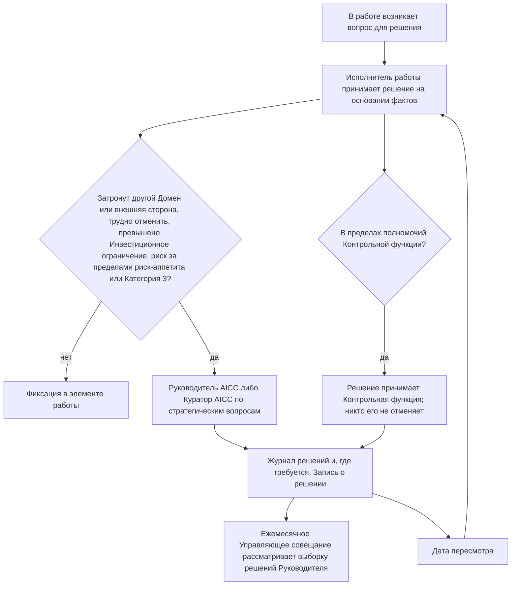
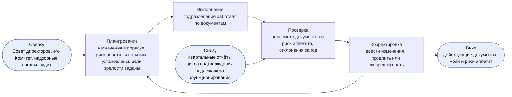
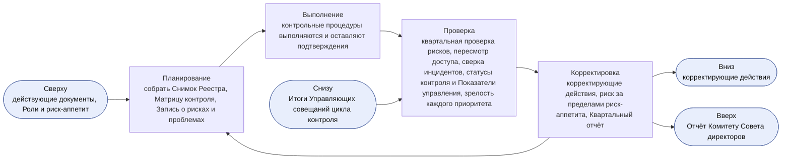
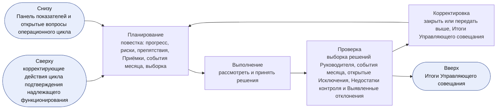
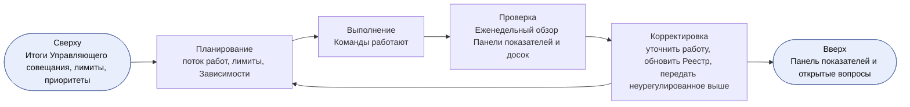
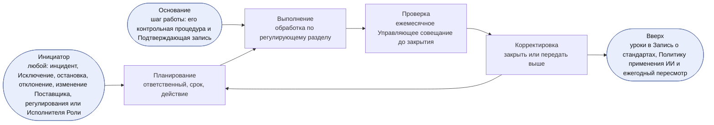
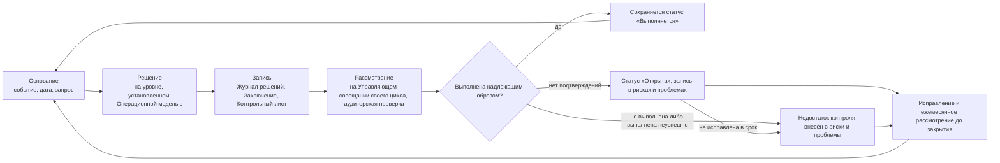
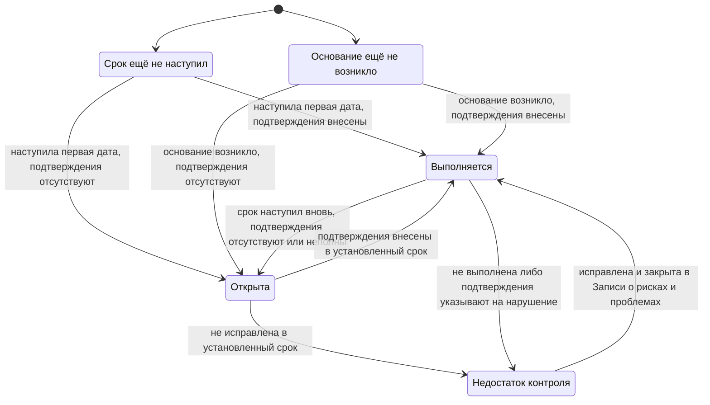

```yaml
id: AICC-ORG-01-RU
title: Операционная модель
status: active
revision: 2.0
created: 2026-10-02
revised: 2026-10-03
source: charter/en/documents/operating-model.md
source_revision: 2.0
source_sha256: 6d917ac2389d894780cf8bc119ed0588aaf65ce99d407f54fb22b323a6a3e72b
translation_status: reviewed
```

# Операционная модель

## 1. Назначение и область применения

1.1. Настоящая Операционная модель определяет управление AICC и контроль его деятельности как подразделения Банка: кто и что делает, как принимаются Управленческие решения, как действует цикл управления и что фиксируется в записях и проверяется.

1.2. Она распространяется на AICC, а также на Домены и Контрольные функции Банка, работающие с AICC.

1.3. Модель управления портфелем определяет приём, финансирование и прекращение Инициатив; Модель жизненного цикла решений — движение работы от Бэклога программы до вывода Решения из эксплуатации и ритм её выполнения. Они действуют в рамках настоящей Операционной модели, которая имеет приоритет. Схемы процессов корпуса показывают работу циклов: взаимодействие с заказчиком, портфель и поставку услуг, ритм работы, инструменты совместной работы, управление подразделением, а также риски ИИ и контроль. Они не устанавливают самостоятельных правил.

1.4. Рисунок в настоящей Операционной модели иллюстрирует пункт и не устанавливает самостоятельных правил. При расхождении рисунка и пункта приоритет имеет пункт.

## 2. Что представляет собой AICC

2.1. Бизнес-модель определяет, что представляет собой AICC. В настоящей Операционной модели AICC — совместная команда под руководством Руководителя AICC, состоящая из сотрудников, выделенных функциями Банка и работающих вместе с Доменами.

2.2. AICC не является владельцем Платформы ИИ и не отвечает за бизнес-результаты Доменов; при этом AICC является владельцем Сервиса, который он эксплуатирует (Модель жизненного цикла решений 8.1). Исполнение осуществляется Доменами. AICC определяет направление, оказывает методическую поддержку и вправе выделять Инженеров решений для создания и эксплуатации Решений.

2.3. AICC не является Контрольной функцией. Контрольные функции независимы от него и сохраняют собственную ответственность в пределах своих полномочий.

2.4. AICC действует в рамках Трёх линий Банка. AICC и Домены отвечают за риски своей работы. Контрольные функции устанавливают правила в пределах своих полномочий, согласовывают, проводят Валидацию, принимают решения об Исключениях и вправе остановить работу. Внутренний аудит осуществляет независимую оценку с предоставлением уверенности.

## 3. Принципы работы

3.1. AICC руководствуется следующими принципами.

(a) Принимать решения там, где доступны факты. Решение принимает тот, кто ближе всего к работе, на основании подтверждающих материалов.

(b) По возможности сохранять обратимость решений и быстро принимать обратимые решения.

(c) Выполнять поставку в темпе продуктовой разработки при контроле, соответствующем требованиям банка.

(d) Сохранять только те процессы и записи, которыми кто-либо пользуется, и исключать остальные.

(e) Ставить достигаемый эффект выше самих поставляемых результатов, а сотрудничество — выше переговоров. План меняется, намерение сохраняется.

3.2. AICC должен применять Ценности и Принципы Заявления о намерениях.

## 4. Роли

4.1. В AICC предусмотрено семь Ролей. Одно лицо может исполнять несколько Ролей, а одна Роль может иметь нескольких Исполнителей Роли при соблюдении правил разделения обязанностей раздела 4.4.

4.2. Следующая таблица устанавливает каждую Роль, обязанности её Исполнителя Роли и его полномочия по принятию решений.

| Роль | Обязанности | Полномочия по принятию решений |
| --- | --- | --- |
| Куратор AICC | Обеспечивает полномочия и финансирование; назначает Руководителя AICC и членов Управляющего комитета по ИИ; одобряет и направляет Отчёт Комитету Совета директоров | Стратегические приоритеты, Инвестиционные бюджеты, Инвестиционные ограничения и Структура Инициатив; Заявление о риск-аппетите в отношении ИИ; одобрение экономического обоснования при превышении Инвестиционного ограничения, охвате нескольких Доменов или для Обеспечивающих работ, а также решение после MVP о продолжении, изменении направления, отложении или отклонении Инициативы; Выпуск Решения Категории риска 3; любой риск за пределами Заявления о риск-аппетите в отношении ИИ; вывод из эксплуатации Сервиса, охватывающего несколько Доменов; одобрение Результата ИИ, публикуемого за пределами AICC; бизнес-приёмка элемента, охватывающего несколько Доменов, относящегося к Обеспечивающим работам AICC или являющегося Экспериментом без Домена, а также в случаях, когда Владельцем Домена является Руководитель AICC (Модель жизненного цикла решений 7.3(c)); для Решения, созданного Руководителем AICC, — одобрение Описания решения, его Категории риска и применения для соответствующего Класса данных (4.4(d)); назначение временно исполняющих обязанности Представителей контрольных функций |
| Руководитель AICC | Руководит AICC как ведущий инженер и архитектор; отвечает за настоящую Операционную модель и каждый документ и Запись AICC; исполняет обязанности Владельца продукта Команды при её численности не более трёх человек; готовит Квартальный отчёт; выступает перед Управляющим комитетом по ИИ | Приём элемента в Проработку, его отложение или отклонение при первичном рассмотрении; взятие Инициативы в работу и установление лимита Инициатив в состоянии «В работе» в пределах Структуры Инициатив, установленной Куратором AICC; порядок приоритетности Бэклога программы и Бэклога портфеля; оформление Соглашения о взаимодействии; одобрение Функциональных возможностей; Приёмка Функциональностей и Функциональных возможностей в качестве Владельца продукта при численности Команды не более трёх человек и окончательная Приёмка от имени Команды до развёртывания Решения для Первых пользователей (Модель жизненного цикла решений 7.3); одобрение применения Решения в AICC для соответствующего Класса данных; Категория риска с уведомлением Владельца Домена — в последних двух случаях за исключением Решения, созданного Руководителем AICC (4.4(d)); необходимость новой Проверки или Валидации при изменении выпущенного Решения (Модель жизненного цикла решений 8.6); Приостановление Решения; стандарты, архитектура и Шаблоны; вопросы между Доменами; введение каждого документа в действие, а по вопросам Заявления о риск-аппетите в отношении ИИ — на основании решения Куратора AICC; Исключение из требования, установленного AICC |
| Инженер решений | Отвечает за Решение на всём его жизненном цикле: проектирует, определяет архитектуру, создаёт, развёртывает и эксплуатирует его совместно с Доменами; обеспечивает наглядность работы; оказывает методическую помощь Экспертам Доменов; проверяет работу других | Способ проектирования и создания Решения; одобрение Функциональностей на Планировании Итерации; порядок взятия командой работы в пределах согласованной приоритетности |
| Владелец Домена | Отвечает за результаты внедрения ИИ в Домене; как заказчик определяет ценность элемента и оценивает работающее Решение; назначает Эксперта Домена | Участие Домена в Инициативе; одобрение экономического обоснования Инициативы в пределах Домена и ниже Инвестиционного ограничения, а также решение после MVP о продолжении, изменении направления, отложении или отклонении Инициативы; одобрение Описания решения; финансирование Решений Домена из его Инвестиционного бюджета, включая эксплуатацию, лицензии и затраты на услуги Поставщиков; одобрение применения Решения в Домене для соответствующего Класса данных и одобрения, предусмотренные правилами Банка; Приёмка Решения Домена и результата Инициативы Домена после окончательной Приёмки от имени Команды (Модель жизненного цикла решений 7.3(c)); Выпуск Решения Категории риска 1 или 2 после Проверки либо Валидации; вывод Решения из эксплуатации |
| Эксперт Домена | Объясняет повседневную работу; работает с Инженером решений; пробует Решение в реальной работе; затем расширяет его внедрение и обучает коллег | Не принимает решений по финансированию, Приёмке или контролю |
| Представитель контрольной функции | Консультирует по требованиям; в пределах своих полномочий подтверждает законодательство и нормативные требования, применимые к использованию ИИ в Банке; вправе повышать Категорию риска в пределах своих полномочий, а понижать её вправе только Представитель контрольной функции по модельному риску; согласовывает экономическое обоснование с ожидаемой Категорией риска 2 или 3 и повторно согласовывает его, если присвоенная Категория риска выше согласованной; проводит Валидацию Решений; вправе приостановить или остановить Решение | Согласование экономического обоснования, Валидация, повышение Категории риска, Приостановление, остановка и Исключение из контрольного требования — каждое в пределах полномочий Контрольной функции |
| Владелец платформы | Обеспечивает предоставление и эксплуатацию Платформы ИИ вне AICC в соответствии с требованиями Записи о стандартах; хранит подтверждающие материалы, журналы и трассировки, на которых основывается Валидация | Проектирование Платформы ИИ в пределах этих требований |

4.3. Команда AICC согласует, кто принимает Дополнительные обязанности, необходимые для работы, например ведение Бэклога программы, проведение мероприятий или методическую помощь. Дополнительная обязанность не является Ролью, меняется по решению команды и не требует назначения.

4.4. Применяются следующие правила разделения обязанностей.

(a) Никто не должен проводить Валидацию или Проверку созданной им работы.

(b) Владелец Домена Решения принимает его как заказчик (Модель жизненного цикла решений 7.3(c)), а для Категорий риска 1 и 2 — принимает решение о Выпуске; он не должен проводить его Валидацию.

(c) Представитель контрольной функции не входит в AICC и не должен создавать Решения, которые он рассматривает.

(d) Руководитель AICC вправе создавать Решение, но не должен проводить Проверку или Валидацию созданного им Решения, принимать решение о его Выпуске или осуществлять его бизнес-приёмку (Модель жизненного цикла решений 7.3(c)). Руководитель AICC вправе принимать его Функциональности и Функциональные возможности и осуществлять окончательную Приёмку от имени Команды как Владелец продукта (Модель жизненного цикла решений 7.3). Это Принятое ограничение на период малой численности Команды, действующее с компенсирующими контрольными процедурами, установленными Моделью жизненного цикла решений 7.3(d). Если Руководитель AICC является Владельцем Домена (4.6), бизнес-приёмку и Выпуск осуществляет Куратор AICC; в остальных случаях — Владелец Домена. Если Решение создано Руководителем AICC, Куратор AICC также одобряет его Описание решения, присваивает Категорию риска и одобряет применение для соответствующего Класса данных (C-12, C-15). Руководитель AICC не должен проводить Валидацию Решения в пределах полномочий Контрольной функции.

(e) До появления в AICC второго Инженера решений Проверку лицом, не являющимся разработчиком, проводит инженер ИТ-функции или Домена, назначенный Руководителем AICC в Записи о назначениях.

(f) Внутренний аудит осуществляет только оценку с предоставлением уверенности. Он не должен проводить Валидацию, принимать решения о Выпуске или остановке и имеет доступ на чтение ко всем Записям.

4.5. Управляющий комитет по ИИ — группа руководителей бизнес-функций, технологических функций, функций управления рисками и комплаенса Банка. Он консультирует Куратора AICC, который председательствует в нём. Комитет формируется из руководителей, назначенных Куратором AICC; функция присоединяется после назначения её руководителя. Комитет Совета директоров осуществляет надзор за ИИ от имени Совета директоров и получает отчёт Куратора AICC. Ни один из этих комитетов не является Ролью.

4.6. Исполнители Ролей указываются в Записи о назначениях. Совет директоров назначает Куратора AICC. Куратор AICC назначает Руководителя AICC и членов Управляющего комитета по ИИ. Руководитель AICC назначает Инженеров решений из числа сотрудников, выделенных функциями для AICC, с согласия их непосредственных руководителей; согласие определяет время, выделяемое каждым сотрудником для AICC. Руководитель AICC также назначает Проверяющего Решения Категории риска 1. Руководитель Домена назначает Владельца Домена, а Владелец Домена — Эксперта Домена. Каждая Контрольная функция назначает своего Представителя контрольной функции. Руководитель технологической функции назначает Владельца платформы. Назначающее лицо не должно назначать себя на Роль: назначение осуществляет следующий уровень (5.7). Для собственных работ AICC Владельцем Домена является Руководитель AICC, за исключением бизнес-приёмки, Выпуска, одобрения Описания решения, присвоения Категории риска и одобрения применения для соответствующего Класса данных Решения, созданного Руководителем AICC (4.4(d)).

4.7. Каждый Исполнитель Роли должен указать в Записи о назначениях заместителя, действующего в период его отсутствия. Куратор AICC вправе письменно делегировать принятие решения на определённый объём и срок, кроме решений по 5.4 и 5.7; Делегирование вносится в Запись о назначениях. Делегирование на срок более двух недель также вносится в Журнал решений.

4.8. Назначение, отсутствовавшее на 2026-10-02, должно быть выполнено до 2026-12-01; на промежуточный период Куратор AICC назначает временно исполняющих Роли. Руководитель AICC должен вносить каждое назначение, включая назначение Куратора AICC на основании решения Совета директоров, а также каждое временное назначение, изменение и освобождение от обязанностей в Запись о назначениях в течение пяти рабочих дней с указанием даты и ссылки на решение.

4.9. При назначении Исполнитель Роли должен принять Роль, заявить о конфликте интересов при его наличии, указать заместителя (4.7), ознакомиться с документами и пройти обучение, установленное Руководителем AICC для этой Роли. Ответственный за каждый инструмент предоставляет доступ, необходимый для Роли (7.6). При смене Исполнителя Роли или освобождении от обязанностей ответственный за каждый инструмент должен отозвать доступ, предоставленный в связи с этой Ролью; Руководитель AICC фиксирует предыдущего Исполнителя Роли в Записи о назначениях.

4.10. С появлением второго Инженера решений Проверка по 4.4(e) проводится внутри AICC, а Куратор AICC должен пересмотреть Принятые ограничения по 4.4(d). С появлением четвёртого участника Команды AICC Облегчённый режим прекращается (Модель жизненного цикла решений 6.6). Домен вправе сформировать собственную Команду со своим Владельцем продукта, работающую в том же ритме, на тех же досках и по тем же правилам; Руководитель AICC определяет приоритетность Бэклога программы для всех Команд и ведёт Доску программы. Рост увеличивает число Исполнителей Ролей и Команд, но не создаёт нового уровня управления, встречи или Записи.

## 5. Управленческие решения

5.1. Управленческое решение принимает тот, кто выполняет работу, на основании фактов и в момент, когда оно необходимо. Управленческое решение указывает факты, на которые опирается, например измерение, результат проверки, затраты или источник.

5.2. Управленческое решение передаётся на более высокий уровень только при наличии хотя бы одного из следующих условий.

(a) Оно затрагивает другой Домен, выходит за пределы Банка или устанавливает стандарт для других.

(b) Его невозможно отменить без значительных затрат или ущерба.

(c) Оно превышает Инвестиционное ограничение или меняет Стратегический приоритет.

(d) Оно предусматривает принятие риска за пределами Заявления о риск-аппетите в отношении ИИ либо касается Решения Категории риска 3.

5.3. Уровни указаны в следующей таблице. При наличии условия из 5.2 Управленческое решение передаётся на уровень, установленный для данного вопроса разделом 4.2.

| Уровень | Кто принимает решение | Примеры |
| --- | --- | --- |
| Команда | Инженер решений совместно с Экспертом Домена и Владельцем Домена; Владелец продукта — по Приёмке Функциональности или Функциональной возможности | Проектирование, создание, порядок взятия работы в пределах приоритетности, Приёмка Функциональности или Функциональной возможности |
| Владелец Домена | Владелец Домена | Экономическое обоснование и решение после MVP в пределах одного Домена и ниже Инвестиционного ограничения, Описание решения, Приёмка Решения, вывод Решения из эксплуатации |
| Руководитель AICC | Руководитель AICC | Приём элемента в Проработку, отложение или отклонение при первичном рассмотрении, взятие Инициативы в работу и лимит Инициатив в состоянии «В работе», приоритетность бэклогов, окончательная Приёмка от имени Команды до развёртывания Решения для Первых пользователей, Категория риска, необходимость новой Проверки или Валидации при изменении выпущенного Решения, стандарты, Шаблоны, вопросы между Доменами |
| Куратор AICC | Куратор AICC после консультации с Управляющим комитетом по ИИ | Стратегические приоритеты, финансирование, Структура Инициатив, экономическое обоснование при превышении Инвестиционного ограничения или охвате нескольких Доменов и решение после MVP (продолжить Инициативу, изменить её направление, отложить или отклонить), Выпуск Решения Категории риска 3, риски за пределами риск-аппетита, вывод из эксплуатации Сервиса, охватывающего несколько Доменов |

Рисунок 1 показывает движение Управленческого решения и его возврат на Управляющее совещание в составе выборки и для пересмотра в установленную дату.



Рисунок 1: движение Управленческого решения.

5.4. Контрольная функция принимает решения в пределах своих полномочий; её Валидация или остановка окончательны в этих пределах. Никто не должен отменять их. Разногласие передаётся руководителю этой Контрольной функции. Куратор AICC вправе вынести вопрос на рассмотрение исполнительного руководства, но не должен отменять Валидацию или остановку. Риск за пределами Заявления о риск-аппетите в отношении ИИ может принять только Куратор AICC с представлением отчёта Комитету Совета директоров. Остановка окончательна. Лицо, приостановившее Решение, снимает Приостановление, когда это позволяют факты. Приостановление и его снятие вносятся в Журнал решений с указанием причины; остановка фиксируется в Заключении контрольной функции соответствующего Представителя контрольной функции.

5.5. При разногласиях между заинтересованными лицами решение принимает лицо, уполномоченное по 5.3, выслушав их позиции. После этого остальные поддерживают Управленческое решение. Особое мнение может быть внесено в Журнал решений.

5.6. Управленческое решение уровня Руководителя AICC или выше, а также любое Управленческое решение, которое другим потребуется найти впоследствии, должно вноситься в Журнал решений одной строкой: дата, Управленческое решение, факты, лицо, принявшее решение, и дата пересмотра. Для труднообратимого Управленческого решения Куратора AICC и для Управленческого решения, которое согласно разделу 8 подтверждается Записью о решении, также оформляется Запись о решении. Управленческое решение Команды фиксируется в элементе работы.

5.7. Лицо с конфликтом интересов в отношении Управленческого решения должно заявить о нём и не должно принимать решение. Решение принимает следующий уровень.

5.8. Условия 5.2, полномочия 5.4 и Журнал решений по 5.6 в равной мере применяются к каждому вопросу независимо от его масштаба.

## 6. Циклы управления

6.1. Управление AICC как подразделением осуществляется через пять циклов. Каждый следует порядку «Планирование — Выполнение — Проверка — Корректировка» и имеет собственную периодичность и площадку рассмотрения. Цикл получает рамки от вышестоящего цикла и возвращает ему подтверждающие материалы. Циклы реализуются на мероприятиях Ритма работы и не добавляют встреч. Портфельные циклы Модели управления портфелем 4 реализуются на тех же мероприятиях и управляют Инициативами; настоящие циклы управляют подразделением. Управление не добавляет встреч и не требует Записей сверх тех, которые ведутся в ходе работы. Каждая контрольная процедура раздела 8 включена как минимум в один цикл и рассматривается на Управляющем совещании этого цикла; контрольная процедура, включённая только в операционный или событийный цикл, рассматривается на ежемесячном Управляющем совещании. Циклы приведены в следующей таблице.

| Цикл | Периодичность и площадка рассмотрения | Кто принимает решение | Контрольные процедуры цикла | Записи |
| --- | --- | --- | --- | --- |
| Определение направления | Ежегодно, на Ежегодном Управляющем совещании (ежемесячном Управляющем совещании декабря), на следующий год | Куратор AICC; владельцем документов является Руководитель AICC | C-01, C-03, C-04, C-20, C-22; также C-02 в стратегическом цикле, который тоже проводится на Ежегодном Управляющем совещании (6.5) | Записи о решениях, Запись о назначениях, Предложение |
| Подтверждение надлежащего функционирования | Ежеквартально, на ежеквартальном Управляющем совещании | Куратор AICC | C-06, C-07, C-11, C-16, C-20, C-24, C-25, C-26, C-27, C-28 | Квартальный отчёт, Снимок Реестра |
| Контроль | Ежемесячно, на ежемесячном Управляющем совещании | Куратор AICC; Владелец Домена — по Приёмке Решения | C-05, C-17, C-29, C-32 | Итоги Управляющего совещания, Журнал решений |
| Операционный | Еженедельно, на Еженедельном обзоре | Руководитель AICC | C-23; Панель показателей является рабочей записью | Панель показателей, Бэклог портфеля |
| Событийный | При возникновении события либо срабатывании контрольной процедуры на шаге работы | В соответствии с настоящей Операционной моделью | C-01, C-08, C-09, C-10, C-12, C-13, C-14, C-15, C-16, C-17, C-18, C-19, C-21, C-22, C-27, C-28, C-30, C-31, C-32 | Запись о рисках и проблемах, Запись о решении и Подтверждающая запись каждой контрольной процедуры |

### Встречи и органы управления

6.2. Встреча проводится с назначенными участниками. Пока Управляющий комитет по ИИ не сформирован, Куратор AICC принимает решения единолично. Запись мероприятия ведётся только по Управленческим решениям и действиям: для Управляющего совещания — в Итогах Управляющего совещания, в остальных случаях — в элементах работы и Журнале решений.

6.3. На Управляющем совещании председательствует Куратор AICC. Руководитель AICC готовит совещание и участвует в нём; также участвуют Владельцы Доменов, вопросы которых включены в повестку, и Представители контрольных функций; члены Управляющего комитета по ИИ дают рекомендации. Члены Управляющего комитета по ИИ (4.5) указаны в Записи о назначениях. Его рекомендации и особые мнения фиксируются в Итогах Управляющего совещания. Руководителя вправе представлять назначенный заместитель. Если ни один руководитель функции не присутствует, Куратор AICC всё равно вправе принимать решения; отсутствие фиксируется в Итогах Управляющего совещания.

6.4. Куратор AICC вправе принять неотложное Управленческое решение между встречами, запросив позиции руководителей функций управления рисками и комплаенса и зафиксировав ответы.

### Цикл определения направления

6.5. Куратор AICC должен проводить цикл определения направления один раз в год на Ежегодном Управляющем совещании на следующий год. Ежегодное Управляющее совещание — ежемесячное Управляющее совещание декабря, проводимое в первые две недели декабря, чтобы рамки следующего года вступили в силу до его начала. Это не дополнительная встреча: как и каждое ежемесячное Управляющее совещание, оно включает цикл контроля и синхронизацию Портфеля, а дополнительно — цикл определения направления и стратегический цикл. На вход поступают Квартальный отчёт за PIQ3 и Выявленные отклонения текущего года на эту дату; изменение рамок, необходимое по результатам PIQ4, принимается на первом ежеквартальном Управляющем совещании следующего года. На этапе планирования подтверждается надлежащее состояние назначений, устанавливаются Заявление о риск-аппетите в отношении ИИ и политика, а также целевые значения Показателей Уровней зрелости на следующий год (Положение об AICC 7.1). На этапе проверки рассматриваются каждый документ корпуса и Заявление о риск-аппетите в отношении ИИ с учётом замечаний аудита и надзорных органов за текущий год на эту дату. На этапе корректировки изменения вводятся в действие, а назначения и риск-аппетит продлеваются либо корректируются. Куратор AICC принимает решение по Заявлению о риск-аппетите в отношении ИИ; Руководитель AICC вводит изменения документов в действие на основании этого решения в части Заявления, а в остальных случаях — согласно Каталогу документов 4. Ежегодно Руководитель AICC готовит Предложение по стратегии внедрения ИИ; Куратор AICC представляет его на Ежегодном Управляющем совещании, а Банк принимает по нему решение. Куратор AICC инициирует внеочередной пересмотр при существенном изменении применения ИИ, основного Поставщика или регулирования либо по результатам замечания аудита или надзорного органа. Цикл вводит в действие документы, назначения, риск-аппетит и политику для цикла подтверждения надлежащего функционирования. Стратегические приоритеты, Инвестиционные бюджеты и Инвестиционные ограничения устанавливаются в стратегическом цикле Модели управления портфелем 4.2, который также проводится на Ежегодном Управляющем совещании; в его рамках совещание рассматривает C-02.



Рисунок 2: цикл определения направления.

На практике Руководитель AICC проверяет документы и выносит изменения и Выявленные отклонения текущего года на Ежегодное Управляющее совещание декабря для определения рамок следующего года. Куратор AICC принимает решение по риск-аппетиту, а Руководитель AICC вводит изменения в действие; каждое введение в действие и каждое решение по риск-аппетиту вносятся в Журнал решений.

### Цикл подтверждения надлежащего функционирования

6.6. Куратор AICC должен ежеквартально проводить цикл подтверждения надлежащего функционирования на ежеквартальном Управляющем совещании. На этапе планирования собираются подтверждающие материалы: Снимок Реестра, Матрица контроля и Запись о рисках и проблемах. Этап проверки — Ежеквартальная проверка рисков, рассматривающая открытые Риски и Проблемы, открытые Исключения, подлежащие повторной оценке Категории риска, каждое Решение Категории риска 3, а также зависимость от Поставщиков и Владельца платформы. Он также включает пересмотр доступа к Реестру и инструментам (7.6), сверку Инцидентов ИИ с системой управления инцидентами Банка, рассмотрение статуса каждой контрольной процедуры в Матрице контроля и Показателей управления (6.11), подтверждение Уровня зрелости каждого Стратегического приоритета и результатов Программного инкремента. Представители контрольных функций должны участвовать в проверке. На этапе корректировки определяются корректирующие действия, принимается либо отклоняется риск за пределами риск-аппетита, одобряется подготовленный Руководителем AICC Квартальный отчёт и направляется Комитету Совета директоров в качестве Отчёта Комитету Совета директоров. Цикл получает документы и риск-аппетит от цикла определения направления, передаёт действия вниз в цикл контроля и возвращает Квартальный отчёт в цикл определения направления и Комитету Совета директоров. Ежеквартальное Управляющее совещание, завершающее неделю IP в PIQ4, включает только цикл подтверждения надлежащего функционирования и обзор Портфеля; оно не устанавливает документы, риск-аппетит, назначения, Приоритеты, Инвестиционные бюджеты или Инвестиционные ограничения, поскольку они уже установлены Ежегодным Управляющим совещанием декабря.



Рисунок 3: цикл подтверждения надлежащего функционирования.

На практике Руководитель AICC выносит Квартальный отчёт и Матрицу контроля на ежеквартальное Управляющее совещание. Представители контрольных функций дают заключения в пределах своих полномочий, а Куратор AICC принимает решения по действиям. Риск за пределами риск-аппетита принимается только с представлением отчёта Комитету Совета директоров.

### Ежемесячный цикл контроля

6.7. Куратор AICC должен ежемесячно проводить цикл контроля на ежемесячном Управляющем совещании, которое готовит Руководитель AICC. В месяц проведения недели IP отдельное ежемесячное Управляющее совещание не проводится: ежеквартальное Управляющее совещание, завершающее неделю IP, одновременно является Управляющим совещанием этого месяца и включает цикл контроля. Исключение — декабрь: ежемесячное Управляющее совещание декабря проводится в первые две недели как Ежегодное Управляющее совещание (6.5), а ежеквартальное Управляющее совещание, завершающее неделю IP, включает только цикл подтверждения надлежащего функционирования (6.6). На этапе планирования формируется повестка: прогресс, риски, препятствия, Приёмки, события месяца и выборка. На этапе проверки рассматриваются выборка не менее трёх Управленческих решений Руководителя AICC, отобранных Куратором AICC, с фиксацией доли решений, признанных надлежащими; события месяца и вызванные ими контрольные процедуры (6.9); открытые Исключения до истечения их срока; обзор действующих Решений на Обзоре и демонстрации Итерации; Недостатки контроля и Выявленные отклонения до их закрытия (8.2). На этапе корректировки каждый вопрос закрывается либо передаётся на более высокий уровень, а Управленческие решения и действия фиксируются в Итогах Управляющего совещания. Цикл получает корректирующие действия от цикла подтверждения надлежащего функционирования и возвращает ему Итоги Управляющего совещания.



Рисунок 4: ежемесячный цикл контроля.

На практике Куратор AICC выбирает Управленческие решения из Журнала решений и рассматривает факты, лежащие в основе каждого. По Исключению с истёкшим сроком и просроченному Недостатку контроля решение принимается незамедлительно. Подтверждением служат Итоги Управляющего совещания.

### Еженедельный операционный цикл

6.8. Руководитель AICC должен еженедельно проводить операционный цикл на Еженедельном обзоре, который в Облегчённом режиме объединяется с Еженедельным планированием в одну встречу. В ней участвуют Руководитель AICC и Команда. На этапе планирования рассматриваются поток работ, Лимиты незавершённой работы и Зависимости. Этап проверки — Еженедельный обзор Панели показателей и досок. На этапе корректировки работа уточняется, Реестр обновляется, а вопросы, которые не удалось урегулировать, передаются на ежемесячное Управляющее совещание. Ведение Бэклога портфеля установлено Моделью управления портфелем 4.5, а поток работы — Моделью жизненного цикла решений.



Рисунок 5: еженедельный операционный цикл.

На практике Руководитель AICC поддерживает Панель показателей и доски в актуальном состоянии; элемент работы, ожидающий действий лица за пределами AICC, указывает свою Зависимость.

### Событийный цикл

6.9. Событие, не предусмотренное календарём, должно вноситься в Запись о рисках и проблемах с указанием ответственного и срока и проходить тот же цикл до закрытия. К таким событиям относятся Инцидент ИИ и Исключение (Политика применения искусственного интеллекта), остановка или Приостановление и риск за пределами риск-аппетита (5.4), изменение Поставщика или регулирования, замечание аудита или надзорного органа (8.2) и смена Исполнителя Роли (4.6–4.8). На этапе планирования элементу назначаются ответственный и срок. На этапе выполнения он обрабатывается в порядке, указанном регулирующим его разделом. Этап проверки — ежемесячное Управляющее совещание, рассматривающее его до закрытия. На этапе корректировки он закрывается либо передаётся на более высокий уровень; извлечённые уроки учитываются в Записи о стандартах, Политике применения искусственного интеллекта и ежегодном пересмотре. Инициировать событие вправе любой; ответственным может быть Исполнитель любой Роли. Событийный цикл также включает контрольные процедуры, запускаемые шагом работы: приём Взаимодействия с заказчиком, экономическое обоснование, Категория риска, Проверка или Валидация, Выпуск, применение для соответствующего Класса данных, Поставщик, развёртывание или изменение, обмен данными, опубликованный результат и вывод из эксплуатации. Каждый такой случай оставляет собственную Подтверждающую запись, вносится в Запись о рисках и проблемах только при статусе «Открыта» или «Недостаток контроля» (8.2) и рассматривается на ежемесячном Управляющем совещании в составе событий месяца.



Рисунок 6: событийный цикл.

На практике Инцидент ИИ обрабатывается в системе управления инцидентами Банка с участием Руководителя AICC как заинтересованного лица, а запись в Записи о рисках и проблемах содержит ссылку на соответствующую заявку. Решение об Исключении принимает соответствующая Контрольная функция; остановка окончательна.

### Отчётность

6.10. Отчётность проходит от Команд к Руководителю AICC, далее — на Управляющее совещание и в Комитет Совета директоров. Контрольные функции действуют независимо от AICC наряду с этой цепочкой. Внутренний аудит находится вне цепочки и осуществляет независимую оценку с предоставлением уверенности в отношении Портфеля и AICC (4.4(f)).

### Показатели управления

6.11. AICC оценивает собственный контроль по Показателям управления из следующей таблицы. Руководитель AICC является владельцем каждого Показателя, рассматривает его на указанном в таблице Управляющем совещании и фиксирует значение в Итогах Управляющего совещания; первое значение становится базовым. Куратор AICC вправе изменить правило целевого значения на Ежегодном Управляющем совещании.

| Показатель | Определение | Источник | Где рассматривается | Правило целевого значения |
| --- | --- | --- | --- | --- |
| Статус контрольных процедур | Доля контрольных процедур со статусом «Выполняется» среди тех, срок которых наступил или основание для которых возникло, и число процедур со статусами «Открыта» и «Недостаток контроля» (8.5) | Матрица контроля | Ежемесячное и ежеквартальное Управляющее совещание | Нет процедур со статусом «Недостаток контроля»; каждая процедура со статусом «Открыта» исправлена в установленный срок |
| Просроченные Недостатки контроля и Выявленные отклонения | Число Недостатков контроля и Выявленных отклонений, остающихся открытыми после установленного срока, с указанием возраста каждого | Запись о рисках и проблемах | Ежемесячное Управляющее совещание | Отсутствуют |
| Исключения | Число открытых Исключений и число Исключений с истёкшим сроком, по которым ещё не принято решение | Запись о рисках и проблемах | Ежемесячное Управляющее совещание | Нет Исключений с истёкшим сроком без принятого решения |
| Выборка Управленческих решений | Доля решений в выборке, признанных надлежащими: приняты на соответствующем уровне, основаны на указанных фактах и внесены в Журнал решений; выборка включает не менее трёх Управленческих решений Руководителя AICC, отобранных Куратором AICC (6.7) | Итоги Управляющего совещания; Журнал решений | Ежемесячное Управляющее совещание | Все признаны надлежащими |
| Повторные оценки Категории риска | Число повторных оценок Категории риска и Валидаций, срок которых наступает в квартале, и число просроченных | Реестр ИИ | Ежеквартальное Управляющее совещание | Нет просроченных |
| Инциденты ИИ и нарушения контрольных требований | Число Инцидентов ИИ по Степени серьёзности и нарушений контрольных требований за квартал | Запись о рисках и проблемах; система управления инцидентами Банка | Ежеквартальное Управляющее совещание | Рассматриваются как тенденция; каждый случай разбирается (Политика применения искусственного интеллекта 5.8) |
| Риски, принятые за пределами риск-аппетита | Число действующих рисков, принятых за пределами Заявления о риск-аппетите в отношении ИИ | Записи о решениях; Запись о рисках и проблемах | Ежеквартальное Управляющее совещание | Нет рисков, по которым не представлен Отчёт Комитету Совета директоров (5.4) |
| Пересмотр доступа | Выполнена ли сверка доступа с Записью о назначениях для Реестра, каждого инструмента и промышленной среды; число выявленных и исправленных расхождений | Итоги Управляющего совещания; Запись о назначениях | Ежеквартальное Управляющее совещание | Выполнен каждый квартал; нет незакрытых расхождений |
| Назначения | Число Ролей без Исполнителя Роли, число назначений с истёкшим сроком выполнения и число записей, внесённых позднее пяти рабочих дней (4.8) | Запись о назначениях | Ежеквартальное и Ежегодное Управляющее совещание | Нет просроченных |
| Проверенные документы | Доля документов, проверенных в течение года (Каталог документов 7.1) | Журнал решений | Ежегодное Управляющее совещание | Все |

## 7. Записи и подтверждающие материалы

7.1. Текущее состояние работы — Рабочее состояние: бэклоги, доски, Дорожная карта, Календарь, Доска программы, Панель показателей, Команды и папка Программного инкремента. При Переходе Рабочее состояние переносится из Реестра в Jira; до этого оно хранится в Реестре.

7.2. Подтверждающие записи должны всегда храниться в Реестре. Подтверждающая запись — закрытая и датированная фиксация события, например Управленческого решения по Портфелю, одобрения, заключения, Приёмки, инцидента со значительными последствиями или назначения. Она указывает, что произошло, кто принял решение или выполнил действие, на основании каких фактов и где находится актуальный элемент работы. Jira, Confluence и Service Management не являются хранилищем подтверждающих материалов.

7.3. В Реестре также хранятся Актуализируемые записи, которые по своей природе отражают текущее состояние: Запись о приоритетах, Запись о стандартах, Запись о рисках и проблемах, Реестр ИИ и Запись о назначениях. Реестр ИИ — Запись AICC, которую ведёт Руководитель AICC; одноимённая функциональная возможность Платформы ИИ лишь передаёт в неё сведения. Описания решений являются Актуализируемыми записями Портфеля; каждый Снимок Реестра фиксирует их состояние, Категорию риска и Выпуск, поэтому служит их Подтверждающей записью. Руководитель AICC должен формировать Снимок Реестра при закрытии каждой Итерации по итогам ежемесячного Управляющего совещания, при закрытии каждого PI и при Переходе. Указатель Реестра перечисляет все Записи по классам.

7.4. Реестр должен храниться в репозитории с защищённой основной веткой и ограниченной видимостью; его история не переписывается. Только Руководитель AICC и назначенный заместитель выполняют слияние изменений в основную ветку. Закрытая Подтверждающая запись исправляется только новой датированной записью со ссылкой на неё. Реестр публикуется на Корпоративном сетевом ресурсе, где на его записи ссылается Портал AICC. Каждая Запись хранится в течение срока, установленного правилами хранения записей Банка для её типа. Персональные данные в Реестре ограничиваются именами и должностями Исполнителей Ролей, а также декларациями, согласиями и сведениями о доступе в Записи о назначениях.

7.5. Лицо, выполняющее работу, должно вести Запись; за все Записи отвечает Руководитель AICC. Внутренний аудит имеет доступ на чтение к Реестру и доступ только на чтение к Jira, Confluence и Service Management.

7.6. Инструменты и порталы AICC, назначение каждого и использующие его схемы процессов перечислены в описании инструментов совместной работы корпуса. В процессном содержании AICC в Jira и Confluence не размещаются числовые показатели Банка, данные или код; заявка Service Management по Инциденту ИИ описывает его без данных, а записи ссылаются на ключ заявки. Операционный портал содержит только несекретную информацию и не содержит материалов управления или подтверждающих материалов. Для каждого инструмента в Записи о назначениях указан ответственный; доступ к инструменту определяется Ролями. Ответственный за каждый инструмент и за Реестр должен на каждом ежеквартальном Управляющем совещании сверять доступ с Записью о назначениях и фиксировать результат.

7.7. Шаблоны Записей, требующих установленной формы, перечислены в Каталоге документов. Любая другая Запись представляет собой таблицу, которую ведущий её сотрудник адаптирует по мере необходимости.

7.8. Портал AICC содержит корпус документов и поясняющие его страницы: курсы, учебные маршруты, базу знаний, справочные материалы и Каталог услуг. Он не содержит числовых показателей Банка, данных, кода или персональных данных; называет Роли, а не лиц, а Исполнители Ролей указаны в Записи о назначениях. Доступ к нему предоставляется только лицам, уполномоченным Банком, через шлюз доступа Банка; портал не собирает информацию о читателях. Читатель сообщает об ошибке на почтовый ящик AICC; сообщение, влекущее изменение документа, обрабатывается согласно Каталогу документов 4. Руководитель AICC должен ежегодно пересматривать портал вместе с документами; ответственный за портал должен пересматривать доступ к нему на каждом ежеквартальном Управляющем совещании вместе с доступом к инструментам (7.6). Ответственные за портал, его инструменты и почтовый ящик указаны в Записи о назначениях.

## 8. Контрольные процедуры

8.1. Каждая контрольная процедура следующей таблицы представляет собой правило настоящей Операционной модели, Модели жизненного цикла решений, Политики применения искусственного интеллекта или Бизнес-модели либо событие цикла управления и оставляет Подтверждающую запись. Таблица перечисляет контрольные процедуры, которые может проверить аудитор; каждой присвоено обозначение. Матрица контроля в Реестре хранит способ проверки и статус каждой контрольной процедуры по этому обозначению.

| Обозначение | Контрольная процедура | Правило | Владелец | Когда | Подтверждающая запись | Шаблон | Тип |
| --- | --- | --- | --- | --- | --- | --- | --- |
| C-01 | Полномочия Куратора AICC, назначение Руководителя AICC и членов Управляющего комитета по ИИ | 4.6; Положение об AICC 3.1 | Куратор AICC; Куратора AICC назначает Совет директоров | При изменении | Запись о назначениях со ссылкой на решение | Запись о назначениях | Директивная |
| C-02 | Приоритеты, финансирование и Инвестиционные ограничения | Положение об AICC 4 | Куратор AICC | Ежегодно и при изменении | Запись о приоритетах; Запись о решении | Запись о решении | Директивная |
| C-03 | Ежегодный пересмотр риск-аппетита и политики | Положение об AICC 5.4; 6.5 | Руководитель AICC пересматривает и вводит в действие; Куратор AICC принимает решение по Заявлению о риск-аппетите в отношении ИИ | Ежегодно и при внеочередном пересмотре | Запись о решении | Запись о решении | Директивная |
| C-04 | Проверка документов | Каталог документов 7 | Руководитель AICC | Ежегодно и при изменении смысла | Запись о решении по результатам проверки | Запись о решении | Выявляющая |
| C-05 | Ежемесячный обзор прогресса, рисков и препятствий с выборкой Управленческих решений Руководителя AICC | 6.7 | Куратор AICC | Ежемесячно | Итоги Управляющего совещания | Итоги Управляющего совещания | Выявляющая |
| C-06 | Результаты, проверка рисков с рассмотрением каждого Решения Категории риска 3 и Уровень зрелости | 6.6; Положение об AICC 7; Политика применения искусственного интеллекта 3.3 | Куратор AICC | Ежеквартально | Квартальный отчёт с рассмотрением каждого Решения Категории риска 3; Снимок Реестра | Квартальный отчёт; Снимок Реестра | Выявляющая |
| C-07 | Отчёт Комитету Совета директоров | Положение об AICC 7.2; 6.6 | Руководитель AICC готовит; Куратор AICC одобряет и направляет | Ежеквартально | Квартальный отчёт в виде, направленном Комитету Совета директоров, с разделом о направлении отчёта | Квартальный отчёт | Выявляющая |
| C-08 | Соглашение о взаимодействии для Взаимодействия с заказчиком | Бизнес-модель 5 | Руководитель AICC | С началом изучения; дополняется при одобрении | Соглашение о взаимодействии; Бэклог портфеля | Соглашение о взаимодействии | Предупреждающая |
| C-09 | Одобрение экономического обоснования и решение после MVP | Модель управления портфелем 6.3, 6.4, 7.2; Положение об AICC 4.2; Политика применения искусственного интеллекта 3.2 | Владелец Домена; Куратор AICC — при превышении Инвестиционного ограничения, охвате нескольких Доменов или для Обеспечивающих работ; Представители контрольных функций согласовывают | При одобрении Инициативы, по завершении её MVP и при присвоении Категории риска выше согласованной | Паспорт инициативы с заполненными шестью разделами и согласованиями; Запись о решении; строка Журнала решений | Паспорт инициативы; Заключение контрольной функции; Запись о решении | Предупреждающая |
| C-10 | Отчёт о результатах, Приёмка и подтверждение выгоды | Модель жизненного цикла решений 7.3; Бизнес-модель 5.5, 7.3 | Руководитель AICC выпускает Отчёт о результатах; Владелец продукта принимает Функциональность и Функциональную возможность; Руководитель AICC проводит окончательную Приёмку от имени Команды; Владелец Домена либо Куратор AICC принимает Решение, Инициативу и Отчёт о результатах; Владелец Домена подтверждает выгоду | При каждой Приёмке и по завершении Взаимодействия с заказчиком | Отметка о Приёмке в бэклоге; Раздел о Выпуске в Описании решения; Отчёт о результатах | Отчёт о результатах | Выявляющая |
| C-11 | Подтверждённая выгода | Бизнес-модель 6 | Руководитель AICC | Ежеквартально | Квартальный отчёт | Квартальный отчёт | Выявляющая |
| C-12 | Присвоение Категории риска | Политика применения искусственного интеллекта 3.2 | Руководитель AICC; Куратор AICC — для Решения, созданного Руководителем AICC | При определении Решения | Описание решения; запись Реестра ИИ с указанием, кто и когда присвоил Категорию риска | Описание решения | Предупреждающая |
| C-13 | Проверка или Валидация до первого развёртывания | Политика применения искусственного интеллекта 3.3; Модель жизненного цикла решений 7.1 | Проверяющий — для Категории риска 1; Представители контрольных функций — для Категорий риска 2 и 3 | До первого развёртывания | Запись Реестра ИИ о Проверке; Заключение контрольной функции о Валидации | Заключение контрольной функции | Предупреждающая |
| C-14 | Выпуск | Модель жизненного цикла решений 7.1, 7.4 | Владелец Домена; Куратор AICC — для Категории риска 3 | До использования за пределами круга Первых пользователей | Раздел о Выпуске в Описании решения; Контрольный лист приёмки при Передаче Решения Домену; Запись о решении для Категории риска 3 | Описание решения; Контрольный лист приёмки | Предупреждающая |
| C-15 | Одобрение применения Решения для соответствующего Класса данных и обучение до первого использования | Политика применения искусственного интеллекта 2.1 | Владелец Домена; Руководитель AICC — для применения в AICC; Куратор AICC — для Решения, созданного Руководителем AICC; Руководитель AICC фиксирует обучение | До использования | Реестр ИИ с указанием, кто и когда одобрил применение, и отметкой Руководителя AICC о прохождении обучения | Не требуется | Предупреждающая |
| C-16 | Инцидент ИИ и уведомление Комитета Совета директоров о крупном инциденте | Политика применения искусственного интеллекта 5; Положение об AICC 7.2 | Руководитель AICC — запись и разбор; ИТ-функция, эксплуатирующая Решение, — обработка; Куратор AICC уведомляет Комитет Совета директоров о крупном инциденте | При возникновении и с ежеквартальной сверкой с системой управления инцидентами Банка; уведомление Комитета Совета директоров о крупном инциденте без ожидания следующего отчёта | Ссылка на заявку в Service Management; Запись о рисках и проблемах; Разбор Инцидента ИИ; строка Журнала решений об уведомлении Комитета Совета директоров | Разбор Инцидента ИИ | Выявляющая |
| C-17 | Исключение, Приостановление и остановка | Политика применения искусственного интеллекта 3.4, 5.6, 6; 5.4 | Соответствующая Контрольная функция — Исключение и остановка; Руководитель AICC или Представитель контрольной функции — Приостановление; Руководитель AICC — требование, установленное только AICC | При запросе или принятии решения; открытые Исключения рассматриваются ежемесячно до истечения срока, Приостановление — до его снятия | Заключение контрольной функции об Исключении или остановке либо Запись о решении Руководителя AICC; строка Журнала решений о Приостановлении и его снятии; Запись о рисках и проблемах | Заключение контрольной функции; Запись о решении | Предупреждающая |
| C-18 | Проверка Поставщика | Политика применения искусственного интеллекта 4.1 | Представители контрольных функций по информационной безопасности, защите данных и юридическим вопросам | До использования и при каждой повторной оценке | Заключение контрольной функции | Заключение контрольной функции | Предупреждающая |
| C-19 | Передача данных или решений за пределы Банка | Положение об AICC 3.3 | Куратор AICC | До передачи | Запись о решении | Запись о решении | Предупреждающая |
| C-20 | Предложение о внедрении Решения в масштабе Банка, ежегодное Предложение по стратегии внедрения ИИ и ежеквартальный обзор Внедрённых решений | Модель жизненного цикла решений 8.2; 6.5 | Руководитель AICC готовит и рассматривает; владельцы и Куратор AICC принимают решение по Предложению о Решении; Куратор AICC представляет ежегодное Предложение, а Банк принимает по нему решение | Когда Решение готово к внедрению; ежегодно на Ежегодном Управляющем совещании; ежеквартально для Внедрённых решений | Предложение; Запись о решении; Квартальный отчёт | Предложение; Квартальный отчёт | Директивная |
| C-21 | Результат, публикуемый для инвесторов, кредиторов, регуляторов или Совета директоров | Политика применения искусственного интеллекта 2.4 | Куратор AICC | При каждой публикации | Запись о решении об одобрении | Запись о решении | Предупреждающая |
| C-22 | Разделение обязанностей и независимость | 4.4 | Куратор AICC | При каждом Выпуске и каждом назначении | Запись о назначениях; Контрольный лист приёмки либо Раздел о Выпуске | Запись о назначениях | Предупреждающая |
| C-23 | Приём Взаимодействий с заказчиком и Лимит незавершённой работы | Бизнес-модель 7.1, 7.2 | Руководитель AICC | При приёме Инициативы или взятии её в работу и при оформлении Соглашения о взаимодействии | Соглашение о взаимодействии; Бэклог портфеля | Соглашение о взаимодействии | Предупреждающая |
| C-24 | Полнота Отчётов о результатах | Бизнес-модель 7.4 | Куратор AICC | Ежеквартально | Итоги Управляющего совещания | Итоги Управляющего совещания | Выявляющая |
| C-25 | Доступ внутреннего аудита | 7.5 | Руководитель AICC | Постоянно | Реестр | Не требуется | Директивная |
| C-26 | Пересмотр доступа к Реестру, инструментам и промышленной среде | 7.6; Модель жизненного цикла решений 7.1 | Руководитель AICC; ответственный за каждый инструмент; процесс управления доступом Банка для промышленной среды | Ежеквартально | Итоги Управляющего совещания | Итоги Управляющего совещания | Предупреждающая |
| C-27 | Принятие риска за пределами риск-аппетита | Положение об AICC 5.4; 5.4 | Куратор AICC | При возникновении | Запись о решении; Отчёт Комитету Совета директоров | Запись о решении | Предупреждающая |
| C-28 | Повторная оценка Категории риска и истечение срока Валидации | Политика применения искусственного интеллекта 3.3, 3.4 | Руководитель AICC | При изменении и не позднее даты, указанной в Реестре ИИ | Реестр ИИ; Заключение контрольной функции | Заключение контрольной функции | Предупреждающая |
| C-29 | Обзор действующих Решений | Политика применения искусственного интеллекта 3.5; Модель жизненного цикла решений 8.4 | Владелец Домена; Куратор AICC — для Сервиса, охватывающего несколько Доменов | На каждом Обзоре и демонстрации Итерации | Описание решения | Описание решения | Выявляющая |
| C-30 | Развёртывание в промышленной среде и изменение выпущенного Решения | Модель жизненного цикла решений 8.3, 8.6 | Процесс управления изменениями Банка обеспечивает одобрение; Руководитель AICC принимает решение о новой Проверке; Владелец Домена, а для Категории риска 3 — Куратор AICC, принимает решение о Выпуске | При каждом развёртывании в промышленной среде и каждом изменении | Функциональность со ссылками на заявку об изменении и проверку; Описание решения; Журнал решений для решения о новой Проверке и Экстренного изменения | Описание решения | Предупреждающая |
| C-31 | Вывод Решения из эксплуатации | Модель жизненного цикла решений 8.7 | Владелец Домена; Куратор AICC — для Сервиса, охватывающего несколько Доменов | При выводе Решения из эксплуатации | Описание решения; Реестр ИИ | Описание решения | Предупреждающая |
| C-32 | Недостатки контроля и Выявленные отклонения | 8.2 | Руководитель AICC; Куратор AICC рассматривает | При выявлении и ежемесячно до закрытия | Запись о рисках и проблемах; Итоги Управляющего совещания | Итоги Управляющего совещания | Выявляющая |

8.2. Руководитель AICC должен вносить каждую контрольную процедуру со статусом «Открыта» или «Недостаток контроля» и каждое замечание аудита или надзорного органа в Запись о рисках и проблемах с указанием ответственного и срока; ежемесячное Управляющее совещание должно рассматривать каждый такой пункт до закрытия.

8.3. Каждая контрольная процедура следует циклу рисунка 7: основание для выполнения, решение на установленном настоящей Операционной моделью уровне, запись и рассмотрение. Рассмотрение проводится на Управляющем совещании цикла, включающего эту контрольную процедуру (6.1). Матрица контроля присваивает каждой контрольной процедуре один из пяти статусов по 8.5; рисунок 8 показывает переходы между ними.



Рисунок 7: цикл контрольной процедуры.



Рисунок 8: статус контрольной процедуры в Матрице контроля.

8.4. Каждая контрольная процедура имеет обозначение, название, цель, правило и его пункт, владельца, срок или периодичность, Подтверждающую запись, Шаблон при его применимости, тип и способ проверки. Таблица 8.1 устанавливает все эти элементы, кроме цели и способа проверки; способ проверки хранится в Матрице контроля (8.1), а цель поясняется в Руководстве по управлению подразделением. Тип может быть Директивным — устанавливает правило или направление; Предупреждающим — предотвращает ошибку до её возникновения; либо Выявляющим — обнаруживает ошибку после её возникновения.

8.5. Значения статусов контрольных процедур в Матрице контроля установлены в следующей таблице.

| Статус | Значение |
| --- | --- |
| Выполняется | Контрольная процедура выполнена при наступлении срока или возникновении основания; её Подтверждающая запись находится в Реестре, а ссылка на неё — в Матрице контроля |
| Открыта | Срок выполнения контрольной процедуры наступил, но подтверждения отсутствуют или неполны; в Записи о рисках и проблемах имеется соответствующий элемент с ответственным и сроком (8.2) |
| Недостаток контроля | Контрольная процедура не выполнена, её подтверждения указывают на нарушение либо она имела статус «Открыта» и не была исправлена в установленный срок; она внесена как Недостаток контроля в Запись о рисках и проблемах (8.2) |
| Основание ещё не возникло | Событие, запускающее контрольную процедуру, ещё не произошло; это подтверждено записью об отсутствии события |
| Срок ещё не наступил | Первая дата выполнения контрольной процедуры ещё не наступила |

8.6. По обозначению каждой контрольной процедуры прослеживаются её правило, Подтверждающая запись, статус в Матрице контроля и Итоги Управляющего совещания, на котором она рассматривалась. Руководитель AICC должен указывать в каждых Итогах Управляющего совещания обозначения рассмотренных контрольных процедур.

## Журнал изменений

| Версия | Дата | Изменение | Решение |
| --- | --- | --- | --- |
| 1.0 | 2026-10-02 | Базовая версия. | DR-2026-060 |
| 2.0 | 2026-10-03 | Для контрольных процедур установлены элементы, тип и значения пяти статусов; каждая включена в цикл. Добавлены Показатели управления, участие в Управляющем совещании, Три линии, назначения и рост, а также Портал AICC; Стратегические приоритеты отнесены к стратегическому циклу. | DR-2026-062 |
