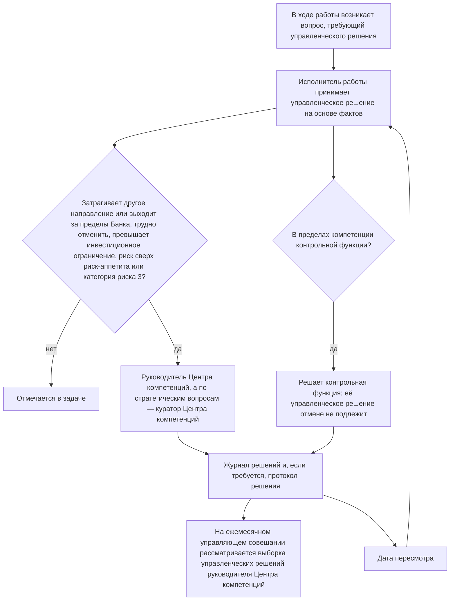
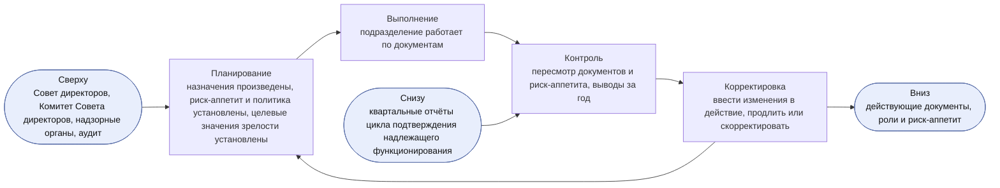
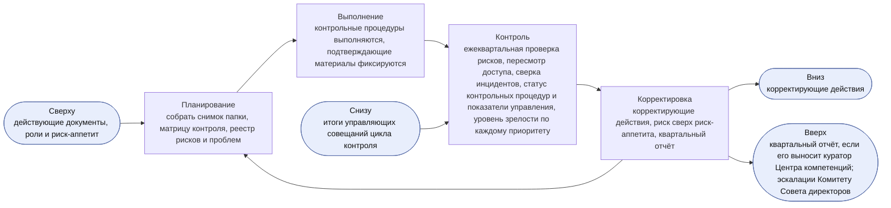
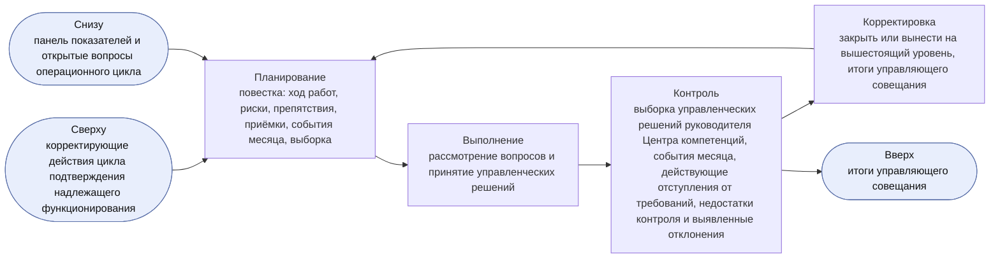
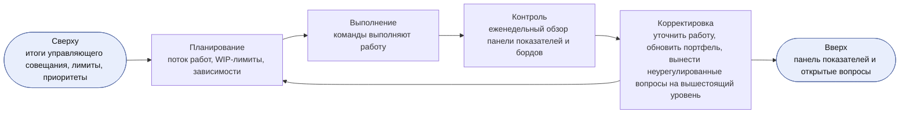
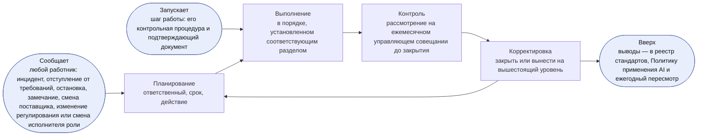
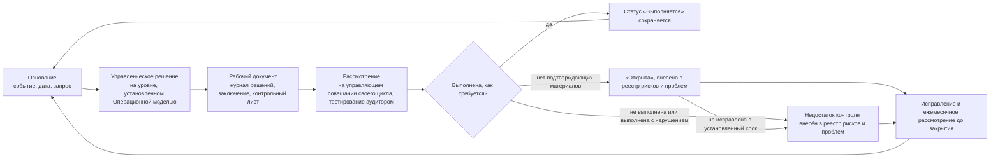
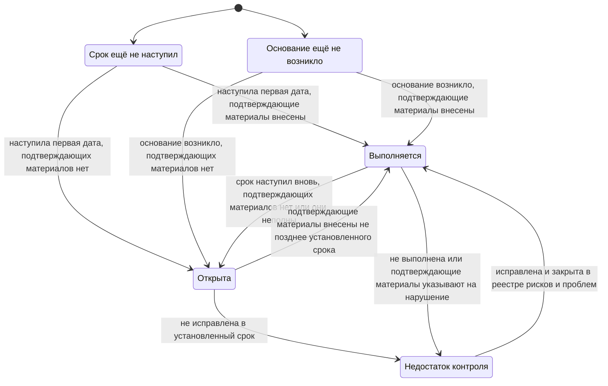

```yaml
id: AICC-ORG-01-RU
title: Операционная модель
status: active
revision: 2.2
created: 2026-10-02
revised: 2026-10-07
source: charter/en/documents/operating-model.md
source_revision: 2.2
source_sha256: c9a39461f54fa944f2d47f690fe1b07896d39669e1e8871f6c141bb439a4f70b
translation_status: reviewed
```

# Операционная модель

## 1. Назначение и область применения

1.1. Настоящая Операционная модель устанавливает порядок управления Центра компетенций как подразделением Банка и контроля его деятельности: распределение обязанностей, порядок принятия управленческих решений, порядок работы цикла контроля, а также сведения, которые фиксируются в рабочих документах и подлежат тестированию.

1.2. Операционная модель распространяется на Центр компетенций, а также на направления и контрольные функции Банка, которые работают с Центром компетенций.

1.3. Модель управления портфелем устанавливает порядок приёма, финансирования и прекращения инициатив, а Модель жизненного цикла решений — порядок движения работы от бэклога программы до вывода решения из эксплуатации и ритм её выполнения. Эти документы действуют в рамках настоящей Операционной модели; при расхождении применяется Операционная модель. Workflows корпуса показывают, как проводятся циклы: «Взаимодействие с заказчиком», «Портфель и оказание услуг», «Рабочий цикл», «Инструменты совместной работы», «Контроль работы подразделения», «Риски и контроль AI». Самостоятельных правил workflows не устанавливают.

1.4. Рисунок в настоящей Операционной модели иллюстрирует пункт и самостоятельных правил не устанавливает. При расхождении рисунка и пункта применяется пункт.

## 2. Статус Центра компетенций

2.1. Что представляет собой Центр компетенций, установлено Бизнес-моделью. Для целей настоящей Операционной модели Центра компетенций — совместная команда под руководством руководителя Центра компетенций, в которую входят работники, выделенные подразделениями Банка; они работают вместе с направлениями.

2.2. Центр компетенций не владеет платформой AI и не отвечает за бизнес-результаты направлений; при этом Центр компетенций отвечает за сервис, который он эксплуатирует (п. 8.1 Модели жизненного цикла решений). Реализацию обеспечивают направления. Центр компетенций определяет направление работы, оказывает методическую поддержку и вправе выделять инженеров решений для создания и эксплуатации решений.

2.3. Центр компетенций не является контрольной функцией. Контрольные функции независимы от Центра компетенций и сохраняют собственную ответственность в пределах своей компетенции.

2.4. Центр компетенций действует в рамках модели трёх линий, принятой в Банке. Центр компетенций и направления отвечают за риски своей работы. Контрольные функции устанавливают правила в пределах своей компетенции, согласовывают, проводят валидацию, принимают решения об отступлениях от требований и вправе остановить применение решения. Внутренний аудит проводит независимую оценку.

## 3. Принципы работы

3.1. Центр компетенций руководствуется следующими принципами.

(a) Принимать управленческие решения там, где известны факты: решает тот, кто ближе всего к работе, на основе фактических данных.

(b) По возможности сохранять обратимость управленческих решений; обратимые управленческие решения принимать быстро.

(c) Работать в темпе продуктовой разработки, сохраняя контроль на уровне, принятом в банковской деятельности.

(d) Сохранять только те процессы и рабочие документы, которыми кто-либо пользуется, и отказываться от остальных.

(e) Ставить достигнутый эффект выше объёма выполненной работы, а сотрудничество — выше переговоров. План может меняться, цель остаётся прежней.

3.2. Центр компетенций применяет ценности и принципы, установленные Заявлением о намерениях.

## 4. Роли

4.1. В Центре компетенций установлено семь ролей. Одно лицо вправе исполнять несколько ролей, а у одной роли может быть несколько исполнителей при соблюдении правил разделения обязанностей, установленных пунктом 4.4.

4.2. Роли, обязанности их исполнителей и полномочия по принятию решений установлены в следующей таблице.

| Роль | Обязанности | Полномочия по принятию решений |
| --- | --- | --- |
| Куратор Центра компетенций | Наделён мандатом на деятельность Центра компетенций и обеспечивает его финансирование; назначает руководителя Центра компетенций и членов Управляющего комитета по AI; утверждает квартальный отчёт и решает, выносить ли его на рассмотрение Комитета Совета директоров или Совета директоров; информирует Комитет Совета директоров об эскалациях, предусмотренных пунктом 7.2 Положения о Центре компетенций | Стратегические приоритеты, инвестиционные бюджеты, инвестиционные ограничения и структура инициатив; Заявление о риск-аппетите в отношении AI; одобрение бизнес-кейса, который превышает инвестиционное ограничение, охватывает несколько направлений или относится к обеспечивающим работам, а также управленческое решение по итогам его MVP: продолжить, изменить направление, отложить или отклонить; выпуск решения категории риска 3; принятие любого риска сверх Заявления о риск-аппетите в отношении AI; вывод из эксплуатации сервиса, охватывающего несколько направлений; одобрение результата AI, публикуемого за пределами Центра компетенций; бизнес-приёмка элемента, который охватывает несколько направлений, относится к обеспечивающим работам Центра компетенций или является экспериментом без направления, а также элемента, по которому владельцем направления является руководитель Центра компетенций (п. 7.3(c) Модели жизненного цикла решений); для решения, созданного руководителем Центра компетенций, — одобрение его описания решения, категории риска и применения для класса данных (4.4(d)); назначение временно исполняющих обязанности представителей контрольных функций |
| Руководитель Центра компетенций | Руководит Центром компетенций как ведущий инженер и архитектор; отвечает за настоящую Операционную модель и за все нормативные и рабочие документы Центра компетенций; пока в команде не более трёх человек, исполняет обязанности владельца продукта команды; готовит квартальный отчёт; докладывает Управляющему комитету по AI | Принятие элемента в проработку, его перенос или отклонение при первичном рассмотрении; принятие инициативы в работу и установление лимита инициатив в работе в пределах структуры инициатив, установленной куратором Центра компетенций; порядок приоритетов бэклога программы и бэклога портфеля; оформление соглашения о взаимодействии; одобрение Capabilities; приёмка Features и Capabilities в качестве владельца продукта, пока в команде не более трёх человек, и окончательная приёмка командой до развёртывания решения для первых пользователей (п. 7.3 Модели жизненного цикла решений); одобрение применения решения в Центре компетенций для класса данных; категория риска, о которой руководитель Центра компетенций сообщает владельцу направления, — в обоих случаях, кроме решения, созданного руководителем Центра компетенций (4.4(d)); необходимость новой проверки или валидации при изменении выпущенного решения (п. 8.6 Модели жизненного цикла решений); приостановление применения решения; стандарты, архитектура и шаблоны; вопросы между направлениями; введение в действие всех документов, а в части Заявления о риск-аппетите в отношении AI — после его утверждения куратором Центра компетенций; отступление от требования, установленного Центра компетенций |
| Инженер решений | Отвечает за решение на всём его жизненном цикле: проектирует его, определяет архитектуру, создаёт, развёртывает и эксплуатирует совместно с направлениями; визуализирует работу; оказывает методическую помощь экспертам направлений; проводит проверку работы других участников | Способ проектирования и создания решения; одобрение Features на планировании итерации; порядок, в котором команда принимает работу в разработку в пределах согласованных приоритетов |
| Владелец направления | Отвечает за результаты внедрения AI в направлении; как заказчик определяет ценность элемента и оценивает работающее решение; назначает эксперта направления | Участие направления в инициативе; одобрение бизнес-кейса инициативы в пределах направления, не превышающего инвестиционного ограничения, а также управленческое решение по итогам его MVP: продолжить, изменить направление, отложить или отклонить; одобрение описания решения; финансирование решений направления за счёт его инвестиционного бюджета, включая эксплуатацию, лицензии и расходы на услуги поставщиков; одобрение применения решения в направлении для класса данных и согласования, предусмотренные внутренними нормативными документами (далее — ВНД) Банка; приёмка решения направления и результата инициативы направления после окончательной приёмки командой (п. 7.3(c) Модели жизненного цикла решений); выпуск решения категории риска 1 или 2 после проверки или валидации; вывод решения из эксплуатации |
| Эксперт направления | Разъясняет порядок повседневной работы; работает с инженером решений; апробирует решение в реальной работе; затем расширяет его применение и обучает коллег | Полномочий в области финансирования, приёмки и контроля не имеет |
| Представитель контрольной функции | Консультирует по требованиям; в пределах своей компетенции определяет требования законодательства и нормативных актов, применимые к использованию AI в Банке; вправе повысить категорию риска в пределах своей компетенции, а понизить её вправе только представитель контрольной функции по модельному риску; согласовывает бизнес-кейс, предполагающий категорию риска 2 или 3, и повторно согласовывает его, если присвоенная категория риска выше согласованной; проводит валидацию решений; вправе приостановить или остановить применение решения | Согласование бизнес-кейса, валидация, повышение категории риска, приостановление, остановка и отступление от требования контроля — в каждом случае в пределах компетенции контрольной функции |
| Владелец платформы | Предоставляет и эксплуатирует платформу AI вне Центра компетенций в соответствии с требованиями реестра стандартов; хранит подтверждающие материалы, журналы и трассировки, на которые опирается валидация | Проектирование платформы AI в пределах этих требований |

4.3. Команда Центра компетенций сама распределяет между участниками дополнительные обязанности, необходимые для работы, например ведение бэклога программы, проведение мероприятий или наставничество. Дополнительная обязанность не является ролью, перераспределяется, когда команда так решит, и назначения не требует.

4.4. Разделение обязанностей обеспечивается следующими правилами.

(a) Валидация или проверка работы лицом, которое её выполнило, не допускается.

(b) Владелец направления, к которому относится решение, принимает его как заказчик (п. 7.3(c) Модели жизненного цикла решений), а для категорий риска 1 и 2 также выпускает его; проводить валидацию этого решения владелец направления не вправе.

(c) Представитель контрольной функции не входит в состав Центра компетенций и не вправе создавать решения, которые он рассматривает.

(d) Руководитель Центра компетенций вправе создавать решение, но не вправе проводить проверку или валидацию созданного им решения, выпускать его и проводить его бизнес-приёмку (п. 7.3(c) Модели жизненного цикла решений). Руководитель Центра компетенций вправе принимать Features и Capabilities такого решения и проводить окончательную приёмку командой как владелец продукта (п. 7.3 Модели жизненного цикла решений); это принятое ограничение на период малой численности команды, которое действует при наличии компенсирующих контрольных процедур, установленных п. 7.3(d) Модели жизненного цикла решений. Если владельцем направления является руководитель Центра компетенций (4.6), бизнес-приёмку и выпуск проводит куратор Центра компетенций, в остальных случаях — владелец направления. Если решение создано руководителем Центра компетенций, куратор Центра компетенций также одобряет его описание решения, присваивает ему категорию риска и одобряет его применение для класса данных (C-12, C-15). Руководитель Центра компетенций не вправе проводить валидацию решения, относящуюся к компетенции контрольной функции.

(e) До появления в Центре компетенций второго инженера решений проверку лицом, не участвовавшим в разработке, проводит инженер IT-функции или направления, которого руководитель Центра компетенций указывает в реестре назначений.

(f) Внутренний аудит проводит только независимую оценку. Он не вправе проводить валидацию, выпускать или останавливать решения и вправе читать все рабочие документы Центра компетенций.

4.5. Управляющий комитет по AI объединяет руководителей бизнес-подразделений, а также подразделений Банка по технологиям, управлению рисками и комплаенсу. Комитет даёт рекомендации куратору Центра компетенций, который является его председателем. В состав Комитета входят руководители, которых назначает куратор Центра компетенций; подразделение представлено в Комитете с момента назначения его руководителя членом Комитета. Комитет Совета директоров осуществляет надзор за применением AI от имени Совета директоров. Он получает материалы, которые выносит на его рассмотрение куратор Центра компетенций, и сведения об эскалациях, предусмотренных пунктом 7.2 Положения о Центре компетенций. Ни Управляющий комитет по AI, ни Комитет Совета директоров ролями не являются.

4.6. Исполнители ролей указываются в реестре назначений. Куратора Центра компетенций назначает Совет директоров. Куратор Центра компетенций назначает руководителя Центра компетенций и членов Управляющего комитета по AI. Руководитель Центра компетенций назначает инженеров решений из числа работников, выделенных подразделениями в Центр компетенций, с согласия их непосредственных руководителей; в согласии указывается время, которое каждый работник уделяет работе в Центре компетенций. Руководитель Центра компетенций также назначает проверяющего для решения категории риска 1. Руководитель направления назначает владельца направления, а владелец направления — эксперта направления. Каждая контрольная функция назначает своего представителя. Руководитель технологического направления Банка назначает владельца платформы. Назначающее лицо не вправе назначать на роль самого себя: такое назначение производит вышестоящий уровень (5.7). По собственной работе Центра компетенций владельцем направления является руководитель Центра компетенций, за исключением бизнес-приёмки, выпуска, одобрения описания решения, присвоения категории риска и одобрения применения для класса данных решения, созданного руководителем Центра компетенций (4.4(d)).

4.7. Каждый исполнитель роли указывает в реестре назначений лицо, замещающее его на период отсутствия. Куратор Центра компетенций вправе письменно делегировать принятие управленческого решения с указанием объёма и срока делегирования, кроме управленческих решений согласно пунктам 5.4 и 5.7; делегирование вносится в реестр назначений. Делегирование на срок более двух недель также вносится в журнал решений.

4.8. Назначения, не произведённые по состоянию на 2 октября 2026 года, производятся не позднее 1 декабря 2026 года; до этого куратор Центра компетенций назначает временно исполняющих обязанности. Руководитель Центра компетенций вносит в реестр назначений каждое назначение, включая назначение куратора Центра компетенций по решению Совета директоров, а также каждое назначение временно исполняющего обязанности, изменение и освобождение от исполнения роли не позднее пяти рабочих дней с даты соответствующего управленческого решения, с указанием даты и реквизитов этого управленческого решения.

4.9. При назначении исполнитель роли подтверждает согласие исполнять роль, декларирует наличие или отсутствие конфликта интересов, указывает лицо, замещающее его на период отсутствия (4.7), знакомится с документами и проходит обучение по программе, которую руководитель Центра компетенций определяет для этой роли; ответственный за инструмент предоставляет права доступа, необходимые для роли (7.6). При смене исполнителя роли или освобождении от её исполнения ответственный за инструмент отзывает права доступа, предоставленные в связи с ролью, а руководитель Центра компетенций указывает прежнего исполнителя роли в реестре назначений.

4.10. Когда в Центре компетенций появляется второй инженер решений, проверка согласно подпункту 4.4(e) проводится внутри Центра компетенций, а куратор Центра компетенций пересматривает принятые ограничения согласно подпункту 4.4(d). Когда в команде Центра компетенций появляется четвёртый участник, облегчённый режим прекращается (п. 6.6 Модели жизненного цикла решений). Направление вправе сформировать собственную команду со своим владельцем продукта, которая работает в том же рабочем цикле, на тех же бордах и по тем же правилам; руководитель Центра компетенций определяет порядок приоритетов бэклога программы для всех команд и ведёт борд программы. С ростом Центра компетенций увеличивается число исполнителей ролей и команд; новые уровни управления, совещания и рабочие документы при этом не вводятся.

## 5. Управленческие решения

5.1. Управленческое решение принимает тот, кто выполняет работу, на основе фактов и тогда, когда оно необходимо. В управленческом решении указываются факты, на которых оно основано, например результаты измерений, результаты тестирования, затраты или источник.

5.2. Управленческое решение выносится на вышестоящий уровень, только если выполняется хотя бы одно из следующих условий.

(a) Оно затрагивает другое направление, выходит за пределы Банка или устанавливает стандарт для других участников.

(b) Его нельзя отменить без значительных затрат или ущерба.

(c) Оно превышает инвестиционное ограничение или изменяет стратегический приоритет.

(d) Оно предусматривает принятие риска сверх Заявления о риск-аппетите в отношении AI или касается решения категории риска 3.

5.3. Уровни принятия управленческих решений приведены в следующей таблице. При выполнении условия, указанного в пункте 5.2, управленческое решение выносится на уровень, который пункт 4.2 устанавливает для соответствующего вопроса.

| Уровень | Лицо, принимающее решение | Примеры |
| --- | --- | --- |
| Команда | Инженер решений совместно с экспертом направления и владельцем направления; владелец продукта — по приёмке Feature или Capability | Проектирование, создание, порядок принятия работы в разработку в пределах приоритетов, приёмка Feature или Capability |
| Владелец направления | Владелец направления | Бизнес-кейс и управленческое решение по итогам MVP в пределах одного направления, не превышающие инвестиционного ограничения, описание решения, приёмка решения, вывод решения из эксплуатации |
| Руководитель Центра компетенций | Руководитель Центра компетенций | Принятие элемента в проработку, его перенос или отклонение при первичном рассмотрении, принятие инициативы в работу и лимит инициатив в работе, порядок приоритетов бэклогов, окончательная приёмка командой до развёртывания решения для первых пользователей, категория риска, необходимость новой проверки или валидации при изменении выпущенного решения, стандарты, шаблоны, вопросы между направлениями |
| Куратор Центра компетенций | Куратор Центра компетенций с учётом рекомендаций Управляющего комитета по AI | Стратегические приоритеты, финансирование, структура инициатив, бизнес-кейс, превышающий инвестиционное ограничение или охватывающий несколько направлений, и управленческое решение по итогам его MVP (продолжить, изменить направление, отложить или отклонить инициативу), выпуск решения категории риска 3, риски сверх риск-аппетита, вывод из эксплуатации сервиса, охватывающего несколько направлений |

Движение управленческого решения и его возврат на управляющее совещание в составе выборки и в дату пересмотра показаны на рисунке 1.



Рисунок 1: движение управленческого решения.

5.4. Контрольная функция принимает управленческие решения в пределах своей компетенции; её валидация или остановка в этих пределах окончательны и отмене не подлежат. Разногласия рассматривает руководитель этой контрольной функции. Куратор Центра компетенций вправе вынести вопрос на рассмотрение Правления Банка, но не вправе отменить валидацию или остановку. Принять риск сверх Заявления о риск-аппетите в отношении AI вправе только куратор Центра компетенций, который обязан проинформировать о нём Комитет Совета директоров, не дожидаясь какого-либо отчёта (п. 7.2 Положения о Центре компетенций). Остановка окончательна. Приостановление снимает лицо, которое приостановило применение решения, когда для этого есть основания. Приостановление и его снятие вносятся в журнал решений с указанием причины, а остановка фиксируется в заключении контрольной функции, которое оформляет её представитель.

5.5. Если заинтересованные лица не пришли к согласию, управленческое решение принимает лицо, к компетенции которого вопрос отнесён пунктом 5.3, выслушав их позиции. Остальные участники исполняют принятое решение. Несогласный вправе потребовать внести своё особое мнение в журнал решений.

5.6. Управленческое решение уровня руководителя Центра компетенций и выше, а также любое управленческое решение, которое впоследствии понадобится найти другим участникам, вносится в журнал решений отдельной строкой с указанием даты, содержания решения, фактов, лица, принявшего решение, и даты пересмотра. Для управленческого решения куратора Центра компетенций, которое трудно отменить, и для управленческого решения, которое согласно разделу 8 подтверждается протоколом решения, также оформляется протокол решения. Управленческое решение команды отмечается в задаче.

5.7. Лицо, у которого есть конфликт интересов в отношении управленческого решения, обязано заявить об этом и не участвует в его принятии. Управленческое решение в этом случае принимает вышестоящий уровень.

5.8. Условия пункта 5.2, полномочия согласно пункту 5.4 и порядок ведения журнала решений согласно пункту 5.6 применяются одинаково ко всем вопросам независимо от их масштаба.

## 6. Циклы управления

6.1. Контроль деятельности Центра компетенций как подразделения обеспечивается пятью циклами. Каждый из них строится по схеме «планирование — выполнение — контроль — корректировка» (PDCA), имеет собственную периодичность и проводится на определённом мероприятии. Рамки цикла задаются вышестоящим циклом, и в него же передаются подтверждающие материалы по итогам цикла. Циклы управления проводятся на мероприятиях рабочего цикла; дополнительные совещания не вводятся. Портфельные циклы, установленные разделом 4 Модели управления портфелем, проводятся на тех же мероприятиях; в них принимаются управленческие решения по инициативам, а в циклах настоящего раздела — по подразделению. Для управления не вводятся дополнительные совещания и не ведутся рабочие документы сверх тех, которые ведутся в ходе работы. Каждая контрольная процедура раздела 8 включена не менее чем в один цикл и рассматривается на управляющем совещании этого цикла; контрольная процедура, включённая только в операционный или событийный цикл, рассматривается на ежемесячном управляющем совещании. Циклы приведены в следующей таблице.

| Цикл | Периодичность и мероприятие | Лицо, принимающее решения | Контрольные процедуры цикла | Рабочие документы |
| --- | --- | --- | --- | --- |
| Цикл определения направления | Ежегодно, на ежегодном управляющем совещании (ежемесячном управляющем совещании декабря), на следующий год | Куратор Центра компетенций; за документы отвечает руководитель Центра компетенций | C-01, C-03, C-04, C-20, C-22, а также C-02 в стратегическом цикле, который также проводится на ежегодном управляющем совещании (6.5) | Протоколы решений, реестр назначений, предложение |
| Цикл подтверждения надлежащего функционирования | Ежеквартально, на ежеквартальном управляющем совещании | Куратор Центра компетенций | C-06, C-07, C-11, C-16, C-20, C-24, C-25, C-26, C-27, C-28 | Квартальный отчёт, снимок папки |
| Цикл контроля | Ежемесячно, на ежемесячном управляющем совещании | Куратор Центра компетенций; владелец направления — по приёмке решения | C-05, C-17, C-29, C-32 | Итоги управляющего совещания, журнал решений |
| Операционный цикл | Еженедельно, на еженедельном обзоре | Руководитель Центра компетенций | C-23; панель показателей ведётся в рабочем состоянии | Панель показателей, бэклог портфеля |
| Событийный цикл | При возникновении события или когда шаг работы запускает контрольную процедуру | В соответствии с настоящей Операционной моделью | C-01, C-08, C-09, C-10, C-12, C-13, C-14, C-15, C-16, C-17, C-18, C-19, C-21, C-22, C-27, C-28, C-30, C-31, C-32 | Реестр рисков и проблем, протокол решения и подтверждающий документ каждой контрольной процедуры |

### Совещания и органы управления

6.2. Совещание проводится в составе назначенных участников. До формирования Управляющего комитета по AI куратор Центра компетенций принимает решения единолично. По итогам мероприятия фиксируются только принятые управленческие решения и поручения: по управляющему совещанию — в итогах управляющего совещания, по остальным мероприятиям — в рабочих элементах и журнале решений.

6.3. На управляющем совещании председательствует куратор Центра компетенций. Руководитель Центра компетенций готовит совещание и участвует в нём; в совещании также участвуют владельцы направлений, вопросы которых включены в повестку, и представители контрольных функций, а члены Управляющего комитета по AI дают рекомендации. Члены Управляющего комитета по AI (4.5) указываются в реестре назначений. Рекомендации Комитета и особые мнения фиксируются в итогах управляющего совещания. Руководителя вправе представлять назначенное им лицо, его замещающее. Отсутствие руководителей подразделений не препятствует принятию решений куратором Центра компетенций; факт отсутствия фиксируется в итогах управляющего совещания.

6.4. Куратор Центра компетенций вправе принять неотложное управленческое решение в период между совещаниями, запросив мнение руководителей подразделений по управлению рисками и комплаенсу и зафиксировав их ответы.

### Цикл определения направления

6.5. Куратор Центра компетенций проводит цикл определения направления один раз в год на ежегодном управляющем совещании; в этом цикле определяются рамки следующего года. Ежегодное управляющее совещание — ежемесячное управляющее совещание декабря, которое проводится в первые две недели декабря, чтобы рамки следующего года вступили в действие до его начала. Дополнительным совещанием оно не является: как и на любом ежемесячном управляющем совещании, на нём проводятся цикл контроля и синхронизация портфеля, а кроме того — цикл определения направления и стратегический цикл. Исходными данными служат квартальный отчёт за PIQ3 и выводы, сделанные за год на эту дату; изменение рамок, которого потребуют результаты PIQ4, принимается на первом ежеквартальном управляющем совещании следующего года. На этапе планирования подтверждается, что все назначения произведены, устанавливаются Заявление о риск-аппетите в отношении AI и политика, а также целевые значения показателей уровней зрелости на следующий год (п. 7.1 Положения о Центре компетенций). На этапе контроля рассматриваются каждый документ корпуса и Заявление о риск-аппетите в отношении AI с учётом замечаний аудиторов и надзорных органов, полученных за год на эту дату. На этапе корректировки изменения вводятся в действие, назначения и риск-аппетит продлеваются или корректируются. Заявление о риск-аппетите в отношении AI утверждает куратор Центра компетенций; изменения документов в части Заявления руководитель Центра компетенций вводит в действие после его утверждения, а в остальных случаях — в порядке, установленном разделом 4 Каталога документов. Ежегодно руководитель Центра компетенций готовит предложение по стратегии внедрения AI, куратор Центра компетенций представляет его на ежегодном управляющем совещании, а решение по нему принимает Банк. Куратор Центра компетенций назначает внеочередной пересмотр при существенном изменении в применении AI, в отношениях с основным поставщиком или в регулировании, а также после замечания аудита или надзорного органа. По итогам цикла для цикла подтверждения надлежащего функционирования устанавливаются действующие документы, назначения, риск-аппетит и политика. Стратегические приоритеты, инвестиционные бюджеты и инвестиционные ограничения устанавливаются в стратегическом цикле (п. 4.2 Модели управления портфелем), который также проводится на ежегодном управляющем совещании; там же рассматривается контрольная процедура C-02.



Рисунок 2: цикл определения направления.

Пояснение. Руководитель Центра компетенций пересматривает документы и выносит изменения и выводы, сделанные за год на эту дату, на ежегодное управляющее совещание в декабре, где определяются рамки следующего года. Риск-аппетит утверждает куратор Центра компетенций, изменения вводит в действие руководитель Центра компетенций; каждое введение в действие и каждое управленческое решение по риск-аппетиту вносятся в журнал решений.

### Цикл подтверждения надлежащего функционирования

6.6. Куратор Центра компетенций ежеквартально проводит цикл подтверждения надлежащего функционирования на ежеквартальном управляющем совещании. На этапе планирования собираются подтверждающие материалы: снимок папки, матрица контроля и реестр рисков и проблем. Этап оценки — ежеквартальная проверка рисков, в ходе которой рассматриваются открытые риски и проблемы, действующие отступления от требований, повторные оценки категории риска, срок которых наступил, каждое решение категории риска 3, а также зависимость от поставщиков и от владельца платформы. На этом этапе также проводится пересмотр доступа к папке Центра компетенций и инструментам (7.6), инциденты AI сверяются с данными системы управления инцидентами Банка, рассматриваются статус каждой контрольной процедуры в матрице контроля и показатели управления (6.11), подтверждаются уровень зрелости по каждому стратегическому приоритету и результаты программного инкремента. Представители контрольных функций участвуют в этом этапе. На этапе корректировки определяются корректирующие действия, принимается или отклоняется риск сверх риск-аппетита; куратор Центра компетенций утверждает квартальный отчёт, подготовленный руководителем Центра компетенций, и решает, выносить ли его на рассмотрение Комитета Совета директоров или Совета директоров (п. 7.2 Положения о Центре компетенций). Исходными данными цикла служат документы и риск-аппетит, установленные в цикле определения направления; корректирующие действия передаются в цикл контроля, а квартальный отчёт — в цикл определения направления. Квартальный отчёт поступает в Комитет Совета директоров или Совет директоров, если куратор Центра компетенций выносит его на их рассмотрение, а риск, принятый сверх риск-аппетита, доводится до Комитета Совета директоров во всех случаях. На ежеквартальном управляющем совещании, завершающем неделю IP в PIQ4, проводятся только цикл подтверждения надлежащего функционирования и обзор портфеля; документы, риск-аппетит, назначения, стратегические приоритеты, инвестиционные бюджеты и инвестиционные ограничения на нём не устанавливаются, поскольку их уже установило ежегодное управляющее совещание в декабре.



Рисунок 3: цикл подтверждения надлежащего функционирования.

Пояснение. Руководитель Центра компетенций выносит квартальный отчёт и матрицу контроля на ежеквартальное управляющее совещание. Представители контрольных функций высказывают позицию в пределах своей компетенции, а куратор Центра компетенций определяет действия. Риск сверх риск-аппетита вправе принять только куратор Центра компетенций, который информирует о нём Комитет Совета директоров, не дожидаясь какого-либо отчёта.

### Ежемесячный цикл контроля

6.7. Куратор Центра компетенций ежемесячно проводит цикл контроля на ежемесячном управляющем совещании, которое готовит руководитель Центра компетенций. В месяце, на который приходится неделя IP, отдельное ежемесячное управляющее совещание не проводится: ежеквартальное управляющее совещание, завершающее неделю IP, одновременно является управляющим совещанием этого месяца, и на нём проводится цикл контроля. В декабре порядок иной: ежемесячное управляющее совещание декабря проводится в первые две недели месяца как ежегодное управляющее совещание (6.5), а на ежеквартальном управляющем совещании, завершающем неделю IP, проводится только цикл подтверждения надлежащего функционирования (6.6). На этапе планирования формируется повестка: ход работ, риски, препятствия, приёмки, события месяца и выборка. На этапе контроля рассматриваются выборка не менее трёх управленческих решений руководителя Центра компетенций, которые отбирает куратор Центра компетенций, с фиксацией доли управленческих решений, признанных надлежащими; события месяца и запущенные ими контрольные процедуры (6.9); действующие отступления от требований — до истечения их срока; рассмотрение действующих решений на ревью и демонстрации итерации; недостатки контроля и выявленные отклонения — до их устранения (8.2). На этапе корректировки каждый вопрос закрывается или выносится на вышестоящий уровень, а управленческие решения и поручения фиксируются в итогах управляющего совещания. Исходными данными цикла служат корректирующие действия, определённые в цикле подтверждения надлежащего функционирования; итоги управляющего совещания передаются в этот цикл.



Рисунок 4: ежемесячный цикл контроля.

Пояснение. Куратор Центра компетенций выбирает управленческие решения из журнала решений и изучает факты, на которых основано каждое из них. По отступлению от требований с истёкшим сроком и по недостатку контроля, срок устранения которого прошёл, управленческое решение принимается незамедлительно. Проведение цикла подтверждают итоги управляющего совещания.

### Еженедельный операционный цикл

6.8. Руководитель Центра компетенций еженедельно проводит операционный цикл на еженедельном обзоре; в облегчённом режиме еженедельный обзор и еженедельное планирование проводятся как одно мероприятие. В еженедельном обзоре участвуют руководитель Центра компетенций и команда. На этапе планирования анализируются поток работ, WIP-лимиты и зависимости. Этап оценки — еженедельный обзор панели показателей и бордов. На этапе корректировки уточняется работа, обновляется портфель, а вопросы, которые не удалось урегулировать, выносятся на ежемесячное управляющее совещание. Ведение бэклога портфеля установлено пунктом 4.5 Модели управления портфелем, а поток работ — Моделью жизненного цикла решений.



Рисунок 5: еженедельный операционный цикл.

Пояснение. Руководитель Центра компетенций поддерживает панель показателей и борды в актуальном состоянии; для элемента, ожидающего действий лица за пределами Центра компетенций, указывается его зависимость.

### Событийный цикл

6.9. Событие, не предусмотренное календарём, вносится в реестр рисков и проблем с указанием ответственного и срока и проходит тот же цикл до закрытия. К таким событиям относятся инцидент AI и отступление от требований (Политика применения AI), остановка или приостановление и риск сверх риск-аппетита (5.4), смена поставщика или изменение регулирования, замечание аудита или надзорного органа (8.2), а также смена исполнителя роли (4.6–4.8). На этапе планирования для элемента определяются ответственный и срок. На этапе выполнения элемент обрабатывается в порядке, установленном соответствующим разделом. Этап оценки проходит на ежемесячном управляющем совещании, где элемент рассматривается до закрытия. На этапе корректировки элемент закрывается или выносится на вышестоящий уровень, а выводы по итогам рассмотрения учитываются в реестре стандартов, в Политике применения AI и при ежегодном пересмотре. Сообщить о событии вправе любой работник; ответственным может быть исполнитель любой роли. Событийный цикл также охватывает контрольные процедуры, которые запускаются шагом работы, например: приём взаимодействия с заказчиком, бизнес-кейс, категория риска, проверка или валидация, выпуск, применение для класса данных, поставщик, развёртывание или изменение, обмен данными, опубликованный результат и вывод из эксплуатации. По каждой такой контрольной процедуре оформляется собственный подтверждающий документ; в реестр рисков и проблем она вносится только в статусе «Открыта» или «Недостаток контроля» (8.2) и рассматривается на ежемесячном управляющем совещании в составе событий месяца.



Рисунок 6: событийный цикл.

Пояснение. Инцидент AI обрабатывается в рамках процесса управления инцидентами Банка; руководитель Центра компетенций участвует в нём как заинтересованное лицо, а элемент реестра рисков и проблем содержит ссылку на соответствующую заявку. Решение об отступлении от требований принимает соответствующая контрольная функция; остановка окончательна.

### Отчётность

6.10. Отчётность представляется по цепочке: команды — руководитель Центра компетенций — управляющее совещание, на котором её получает куратор Центра компетенций. В Комитет Совета директоров или Совет директоров отчётность поступает, если куратор Центра компетенций выносит вопрос на их рассмотрение, а в случае эскалаций, предусмотренных пунктом 7.2 Положения о Центре компетенций, — во всех случаях. Контрольные функции действуют параллельно этой цепочке, независимо от Центра компетенций. Внутренний аудит находится вне цепочки и проводит независимую оценку в отношении портфеля и Центра компетенций (4.4(f)).

### Показатели управления

6.11. Центр компетенций оценивает собственный контроль по показателям управления, приведённым в следующей таблице. За каждый показатель отвечает руководитель Центра компетенций: он рассматривает показатель на управляющем совещании, указанном в таблице, и фиксирует его значение в итогах управляющего совещания; первое значение становится базовым. Куратор Центра компетенций вправе изменить порядок установления целевого значения на ежегодном управляющем совещании.

| Показатель | Определение | Источник | Совещание | Порядок установления целевого значения |
| --- | --- | --- | --- | --- |
| Статус контрольных процедур | Доля контрольных процедур в статусе «Выполняется» среди тех, срок которых наступил или которые были запущены, а также число процедур в статусах «Открыта» и «Недостаток контроля» (8.5) | Матрица контроля | Ежемесячное и ежеквартальное управляющее совещание | Нет процедур в статусе «Недостаток контроля»; каждая процедура в статусе «Открыта» исправлена не позднее установленного срока |
| Просроченные недостатки контроля и выявленные отклонения | Число недостатков контроля и выявленных отклонений, не устранённых в установленный срок, с указанием срока просрочки по каждому из них | Реестр рисков и проблем | Ежемесячное управляющее совещание | Отсутствуют |
| Отступления от требований | Число действующих отступлений от требований, а также число отступлений с истёкшим сроком, по которым управленческое решение ещё не принято | Реестр рисков и проблем | Ежемесячное управляющее совещание | Нет отступлений с истёкшим сроком, по которым не принято управленческое решение |
| Выборка управленческих решений | Доля управленческих решений в выборке, признанных надлежащими: принятых на надлежащем уровне, основанных на указанных фактах и внесённых в журнал решений; выборка включает не менее трёх управленческих решений руководителя Центра компетенций, которые отбирает куратор Центра компетенций (6.7) | Итоги управляющего совещания; журнал решений | Ежемесячное управляющее совещание | Все признаны надлежащими |
| Повторные оценки категории риска | Число повторных оценок категории риска и валидаций, срок которых наступает в квартале, и число просроченных | Реестр AI-решений | Ежеквартальное управляющее совещание | Просроченных нет |
| Инциденты AI и нарушения требований контроля | Число инцидентов AI по степени серьёзности и число нарушений требований контроля за квартал | Реестр рисков и проблем; система управления инцидентами Банка | Ежеквартальное управляющее совещание | Отслеживается динамика; целевое значение не устанавливается; по каждому инциденту проводится разбор (п. 5.8 Политики применения AI) |
| Риски, принятые сверх риск-аппетита | Число действующих рисков, принятых сверх Заявления о риск-аппетите в отношении AI | Протоколы решений; реестр рисков и проблем | Ежеквартальное управляющее совещание | Комитет Совета директоров проинформирован о каждом таком риске (5.4) |
| Пересмотр доступа | Проведена ли сверка прав доступа с реестром назначений по папке Центра компетенций, портфелю, каждому инструменту и промышленной среде; число выявленных и устранённых расхождений | Итоги управляющего совещания; реестр назначений | Ежеквартальное управляющее совещание | Сверка проводится ежеквартально; неустранённых расхождений нет |
| Назначения | Число ролей без исполнителя, число ролей, назначение на которые не произведено в установленный срок, и число записей, внесённых позднее пяти рабочих дней (4.8) | Реестр назначений | Ежеквартальное и ежегодное управляющее совещание | Просроченных нет |
| Пересмотренные документы | Доля документов, пересмотренных в течение года (п. 7.1 Каталога документов) | Журнал решений | Ежегодное управляющее совещание | Все |

## 7. Рабочие и подтверждающие документы

7.1. Текущее состояние работы отражает рабочее состояние: бэклог портфеля и паспорта инициатив, бэклог программы, борды, дорожная карта, календарь, борд программы, панель показателей, состав команд и папка программного инкремента. Рабочее состояние портфеля и программы ведётся в портфеле, который является его единственным достоверным источником — от Каталога сценариев для применения AI до разработки и внедрения. В Jira ведётся ежедневная работа: в ней хранятся задачи команд и зеркальная копия инициатив, Capabilities и Features. Решение на контрольной точке фиксируется сначала в портфеле и в папке Центра компетенций, а затем в Jira. Руководитель Центра компетенций на каждом еженедельном обзоре, а на контрольной точке — незамедлительно, переносит в портфель сведения из Jira о ходе работ по Features, исправляет выявленные расхождения и фиксирует их там же.

7.2. Подтверждающие документы всегда хранятся в папке Центра компетенций. Подтверждающий документ — неизменяемая датированная выгрузка, которая оформляется при наступлении события, например управленческого решения по портфелю, одобрения, заключения, приёмки, инцидента со значительными последствиями или назначения. В ней указываются, что произошло, кто принял решение или выполнил действие, на основании каких фактов и где находится актуальный элемент. Jira, Confluence и система Service Management хранилищем подтверждающих материалов не являются.

7.3. В папке Центра компетенций также хранятся реестры, которые по своей природе отражают текущее состояние: список приоритетов, реестр стандартов, реестр рисков и проблем, реестр AI-решений и реестр назначений. Реестр AI-решений — рабочий документ Центра компетенций, который ведёт руководитель Центра компетенций; одноимённый компонент платформы AI только передаёт в него сведения. Описания решений — реестры в портфеле; каждый снимок папки фиксирует их состояние, категорию риска и выпуск, поэтому снимок папки является для них подтверждающим документом. Руководитель Центра компетенций формирует снимок папки по рабочему состоянию в портфеле при закрытии каждой итерации, которая завершается ежемесячным управляющим совещанием, при закрытии каждого PI и при переходе. В указателях папки Центра компетенций и портфеля перечислены все рабочие документы по классам.

7.4. Папка Центра компетенций и портфель хранятся каждый в своём репозитории с защищённой основной веткой и ограниченным доступом; история репозиториев не переписывается. Слияние изменений в основную ветку выполняют только руководитель Центра компетенций и указанное им лицо, его замещающее. Неизменяемый подтверждающий документ исправляется только новой датированной записью со ссылкой на него. Основные ветки папки Центра компетенций и портфеля публикуются на корпоративном сетевом ресурсе, где портал Центра компетенций ссылается на их рабочие документы. Каждый рабочий документ хранится в течение срока, установленного для его вида ВНД Банка о хранении документов. Персональные данные в папке Центра компетенций и в портфеле ограничиваются именами и должностями исполнителей ролей, а также декларациями, согласиями и сведениями о доступе в реестре назначений.

7.5. Рабочий документ ведёт тот, кто выполняет работу; за все рабочие документы отвечает руководитель Центра компетенций. Внутренний аудит имеет доступ на чтение к папке Центра компетенций и портфелю и доступ только для чтения к Jira, Confluence и системе Service Management.

7.6. Инструменты и порталы Центра компетенций, назначение каждого из них и использующие их workflows перечислены в workflow «Инструменты совместной работы». Каждое поле инициативы, Capability или Feature имеет одного владельца. Портфелю принадлежат идентификатор элемента, родительский элемент, место в ранжировании, класс обслуживания, описание, критерии приёмки и состояния на контрольных точках с их датами. Jira принадлежат выполнение работ уровнем ниже Feature и ход работ по Feature между еженедельными обзорами. В процессных материалах Центра компетенций в Jira и Confluence не размещаются числовые показатели Банка, данные и код; заявка в системе Service Management по инциденту AI описывает его без данных, а рабочие документы содержат номер заявки. На операционном портале размещается только информация, не относящаяся к информации ограниченного доступа; материалы по управлению и подтверждающие материалы на нём не размещаются. Для каждого инструмента в реестре назначений указан ответственный; доступ к инструменту предоставляется в соответствии с ролями. Ответственные за инструмент, за папку Центра компетенций и за портфель на каждом ежеквартальном управляющем совещании сверяют права доступа с реестром назначений и фиксируют результат.

7.7. Шаблоны рабочих документов, для которых требуется установленная форма, перечислены в Каталоге документов. Остальные рабочие документы ведутся в виде таблиц, которые ответственный за рабочий документ адаптирует по мере необходимости.

7.8. Портал Центра компетенций содержит корпус документов и поясняющие его страницы, например курсы, маршруты обучения, базу знаний, справочные материалы и каталог услуг. На портале не размещаются числовые показатели Банка, данные, код и персональные данные; на нём указываются роли, а не лица, а исполнители ролей указываются в реестре назначений. Доступ к порталу предоставляется только лицам, уполномоченным Банком, через шлюз доступа Банка; портал не собирает сведения о пользователях. Пользователь сообщает об ошибке на почтовый ящик Центра компетенций; сообщение, требующее изменения документа, рассматривается в порядке, установленном разделом 4 Каталога документов. Руководитель Центра компетенций ежегодно пересматривает портал вместе с документами, а ответственный за портал на каждом ежеквартальном управляющем совещании пересматривает доступ к нему вместе с доступом к инструментам (7.6). Ответственные за портал, за его инструменты и за почтовый ящик указываются в реестре назначений.

## 8. Контрольные процедуры

8.1. Каждая контрольная процедура, приведённая в следующей таблице, — правило настоящей Операционной модели, Модели жизненного цикла решений, Политики применения AI или Бизнес-модели либо событие цикла контроля; по каждой из них оформляется подтверждающий документ. В таблице приведены контрольные процедуры, которые может протестировать аудитор, с кодом каждой из них. Матрица контроля в папке Центра компетенций содержит порядок тестирования и статус каждой контрольной процедуры по этому коду.

| Код | Контрольная процедура | Правило | Ответственный | Срок выполнения | Подтверждающий документ | Шаблон | Тип |
| --- | --- | --- | --- | --- | --- | --- | --- |
| C-01 | Мандат куратора Центра компетенций, назначение руководителя Центра компетенций и членов Управляющего комитета по AI | П. 4.6; п. 3.1 Положения о Центре компетенций | Куратор Центра компетенций; куратора Центра компетенций назначает Совет директоров | При изменении | Реестр назначений с реквизитами управленческого решения | «Реестр назначений» | Директивная |
| C-02 | Приоритеты, финансирование и инвестиционные ограничения | Разд. 4 Положения о Центре компетенций | Куратор Центра компетенций | Ежегодно и при изменении | Список приоритетов; протокол решения | «Протокол решения» | Директивная |
| C-03 | Ежегодный пересмотр риск-аппетита и политики | П. 5.4 Положения о Центре компетенций; п. 6.5 | Руководитель Центра компетенций пересматривает и вводит в действие; куратор Центра компетенций утверждает Заявление о риск-аппетите в отношении AI | Ежегодно и при внеочередном пересмотре | Протокол решения | «Протокол решения» | Директивная |
| C-04 | Пересмотр документов | Разд. 7 Каталога документов | Руководитель Центра компетенций | Ежегодно и при изменении по существу | Протокол решения по итогам пересмотра | «Протокол решения» | Выявляющая |
| C-05 | Ежемесячное рассмотрение хода работ, рисков и препятствий с выборкой управленческих решений руководителя Центра компетенций | П. 6.7 | Куратор Центра компетенций | Ежемесячно | Итоги управляющего совещания | «Итоги управляющего совещания» | Выявляющая |
| C-06 | Результаты, проверка рисков с рассмотрением каждого решения категории риска 3 и уровень зрелости | П. 6.6; разд. 7 Положения о Центре компетенций; п. 3.3 Политики применения AI | Куратор Центра компетенций | Ежеквартально | Квартальный отчёт с рассмотрением каждого решения категории риска 3; снимок папки | «Квартальный отчёт»; «Снимок папки» | Выявляющая |
| C-07 | Утверждение квартального отчёта и его представление Комитету Совета директоров или Совету директоров, если так решает куратор Центра компетенций | П. 7.2 Положения о Центре компетенций; п. 6.6 | Руководитель Центра компетенций готовит; куратор Центра компетенций утверждает и решает о представлении | Ежеквартально | Квартальный отчёт с отметкой об утверждении и, если отчёт представлялся, подтверждение представления | «Квартальный отчёт» | Выявляющая |
| C-08 | Соглашение о взаимодействии в рамках взаимодействия с заказчиком | Разд. 5 Бизнес-модели | Руководитель Центра компетенций | При начале изучения; изменяется при одобрении | Соглашение о взаимодействии; бэклог портфеля | «Соглашение о взаимодействии» | Предупреждающая |
| C-09 | Одобрение бизнес-кейса и управленческое решение по итогам MVP | Пп. 6.3, 6.4, 7.2 Модели управления портфелем; п. 4.2 Положения о Центре компетенций; п. 3.2 Политики применения AI | Владелец направления; куратор Центра компетенций — если бизнес-кейс превышает инвестиционное ограничение, охватывает несколько направлений или относится к обеспечивающим работам; представители контрольных функций согласовывают | При одобрении инициативы, по завершении её MVP и при присвоении категории риска выше согласованной | Паспорт инициативы, заполненный по всем шести разделам, с согласованиями; протокол решения; строка журнала решений | «Паспорт инициативы»; «Заключение контрольной функции»; «Протокол решения» | Предупреждающая |
| C-10 | Отчёт о результатах, приёмка и подтверждение выгоды | П. 7.3 Модели жизненного цикла решений; пп. 5.5, 7.3 Бизнес-модели | Руководитель Центра компетенций оформляет отчёт о результатах; владелец продукта принимает Feature и Capability; руководитель Центра компетенций проводит окончательную приёмку командой; владелец направления или куратор Центра компетенций принимает решение, инициативу и отчёт о результатах; владелец направления подтверждает выгоду | При каждой приёмке и по завершении взаимодействия с заказчиком | Отметка о приёмке в бэклоге; раздел о выпуске в описании решения; отчёт о результатах | «Отчёт о результатах» | Выявляющая |
| C-11 | Подтверждённая выгода | Разд. 6 Бизнес-модели | Руководитель Центра компетенций | Ежеквартально | Квартальный отчёт | «Квартальный отчёт» | Выявляющая |
| C-12 | Присвоение категории риска | П. 3.2 Политики применения AI | Руководитель Центра компетенций; куратор Центра компетенций — для решения, созданного руководителем Центра компетенций | При определении решения | Описание решения; запись в реестре AI-решений с указанием, кто и когда присвоил категорию риска | «Описание решения» | Предупреждающая |
| C-13 | Проверка или валидация до первого развёртывания | П. 3.3 Политики применения AI; п. 7.1 Модели жизненного цикла решений | Проверяющий — для категории риска 1; представители контрольных функций — для категорий риска 2 и 3 | До первого развёртывания | Запись в реестре AI-решений о проверке; заключение контрольной функции о валидации | «Заключение контрольной функции» | Предупреждающая |
| C-14 | Выпуск | Пп. 7.1, 7.4 Модели жизненного цикла решений | Владелец направления; куратор Центра компетенций — для категории риска 3 | До начала использования за пределами круга первых пользователей | Раздел о выпуске в описании решения; контрольный лист приёмки, если решение передаётся направлению; протокол решения — для категории риска 3 | «Описание решения»; «Контрольный лист приёмки» | Предупреждающая |
| C-15 | Одобрение применения решения для класса данных и обучение до начала применения | П. 2.1 Политики применения AI | Владелец направления; руководитель Центра компетенций — для применения в Центре компетенций; куратор Центра компетенций — для решения, созданного руководителем Центра компетенций; руководитель Центра компетенций отмечает прохождение обучения | До начала применения | Реестр AI-решений с указанием, кто и когда одобрил применение, и отметкой руководителя Центра компетенций о прохождении обучения | Не требуется | Предупреждающая |
| C-16 | Инцидент AI и информирование Комитета Совета директоров о крупном инциденте | Разд. 5 Политики применения AI; п. 7.2 Положения о Центре компетенций | Руководитель Центра компетенций — запись и разбор; IT-функция, эксплуатирующая решение, — обработка; куратор Центра компетенций информирует Комитет Совета директоров о крупном инциденте | При возникновении; ежеквартальная сверка с системой управления инцидентами Банка; о крупном инциденте Комитет Совета директоров информируется незамедлительно, не дожидаясь какого-либо отчёта | Ссылка на заявку в системе Service Management; реестр рисков и проблем; разбор инцидента AI; строка журнала решений об информировании Комитета Совета директоров | «Разбор инцидента AI» | Выявляющая |
| C-17 | Отступление от требований, приостановление и остановка | Пп. 3.4, 5.6 и разд. 6 Политики применения AI; п. 5.4 | Соответствующая контрольная функция — отступление от требований и остановка; руководитель Центра компетенций или представитель контрольной функции — приостановление; руководитель Центра компетенций — отступление от требования, установленного только Центром компетенций | При поступлении запроса или принятии управленческого решения; действующие отступления рассматриваются ежемесячно до истечения срока, приостановление — до его снятия | Заключение контрольной функции об отступлении от требований или остановке либо протокол решения руководителя Центра компетенций; строка журнала решений о приостановлении и его снятии; реестр рисков и проблем | «Заключение контрольной функции»; «Протокол решения» | Предупреждающая |
| C-18 | Проверка поставщика | П. 4.1 Политики применения AI | Представители контрольных функций по информационной безопасности, защите данных и правовым вопросам | До начала использования и при каждой повторной оценке | Заключение контрольной функции | «Заключение контрольной функции» | Предупреждающая |
| C-19 | Передача данных или решений за пределы Банка | П. 3.3 Положения о Центре компетенций | Куратор Центра компетенций | До передачи | Протокол решения | «Протокол решения» | Предупреждающая |
| C-20 | Предложение о внедрении решения в масштабе Банка, ежегодное предложение по стратегии внедрения AI и ежеквартальный обзор внедрённых решений | П. 8.2 Модели жизненного цикла решений; п. 6.5 | Руководитель Центра компетенций готовит предложения и проводит обзор; по предложению о решении решают владельцы и куратор Центра компетенций; куратор Центра компетенций представляет ежегодное предложение, решение по нему принимает Банк | Когда решение готово к внедрению; ежегодно на ежегодном управляющем совещании; ежеквартально — по внедрённым решениям | Предложение; протокол решения; квартальный отчёт | «Предложение»; «Квартальный отчёт» | Директивная |
| C-21 | Результат AI, предоставляемый инвесторам, кредиторам, надзорным органам или Совету директоров | П. 2.4 Политики применения AI | Куратор Центра компетенций | При каждом предоставлении | Протокол решения, подтверждающий одобрение | «Протокол решения» | Предупреждающая |
| C-22 | Разделение обязанностей и независимость | П. 4.4 | Куратор Центра компетенций | При каждом выпуске и каждом назначении | Реестр назначений; контрольный лист приёмки или раздел о выпуске | «Реестр назначений» | Предупреждающая |
| C-23 | Приём взаимодействий с заказчиком и WIP-лимит | Пп. 7.1, 7.2 Бизнес-модели | Руководитель Центра компетенций | При приёме инициативы или принятии её в работу и при оформлении соглашения о взаимодействии | Соглашение о взаимодействии; бэклог портфеля | «Соглашение о взаимодействии» | Предупреждающая |
| C-24 | Полнота отчётов о результатах | П. 7.4 Бизнес-модели | Куратор Центра компетенций | Ежеквартально | Итоги управляющего совещания | «Итоги управляющего совещания» | Выявляющая |
| C-25 | Доступ внутреннего аудита | П. 7.5 | Руководитель Центра компетенций | Постоянно | Папка Центра компетенций и портфель | Не требуется | Директивная |
| C-26 | Пересмотр доступа к папке Центра компетенций, портфелю, инструментам и промышленной среде | П. 7.6; п. 7.1 Модели жизненного цикла решений | Руководитель Центра компетенций; ответственный за инструмент; для промышленной среды — процесс управления доступом Банка | Ежеквартально | Итоги управляющего совещания | «Итоги управляющего совещания» | Предупреждающая |
| C-27 | Принятие риска сверх риск-аппетита | П. 5.4 Положения о Центре компетенций; п. 5.4 | Куратор Центра компетенций | При возникновении | Протокол решения; строка журнала решений об информировании Комитета Совета директоров | «Протокол решения» | Предупреждающая |
| C-28 | Повторная оценка категории риска и истечение срока действия валидации | Пп. 3.3, 3.4 Политики применения AI | Руководитель Центра компетенций | При изменении и не позднее даты, указанной в реестре AI-решений | Реестр AI-решений; заключение контрольной функции | «Заключение контрольной функции» | Предупреждающая |
| C-29 | Рассмотрение действующих решений | П. 3.5 Политики применения AI; п. 8.4 Модели жизненного цикла решений | Владелец направления; куратор Центра компетенций — для сервиса, охватывающего несколько направлений | На каждом ревью и демонстрации итерации | Описание решения | «Описание решения» | Выявляющая |
| C-30 | Развёртывание в промышленной среде и изменение выпущенного решения | Пп. 8.3, 8.6 Модели жизненного цикла решений | Изменение одобряется в системе управления изменениями Банка; руководитель Центра компетенций решает вопрос о новой проверке; выпускает владелец направления, а для категории риска 3 — куратор Центра компетенций | При каждом развёртывании в промышленной среде и каждом изменении | Feature с номером заявки на изменение и ссылкой на результаты тестирования; описание решения; журнал решений — для управленческого решения о новой проверке и для экстренного изменения | «Описание решения» | Предупреждающая |
| C-31 | Вывод решения из эксплуатации | П. 8.7 Модели жизненного цикла решений | Владелец направления; куратор Центра компетенций — для сервиса, охватывающего несколько направлений | При выводе решения из эксплуатации | Описание решения; реестр AI-решений | «Описание решения» | Предупреждающая |
| C-32 | Недостатки контроля и выявленные отклонения | П. 8.2 | Руководитель Центра компетенций; рассматривает куратор Центра компетенций | При выявлении и ежемесячно до устранения | Реестр рисков и проблем; итоги управляющего совещания | «Итоги управляющего совещания» | Выявляющая |

8.2. Руководитель Центра компетенций вносит в реестр рисков и проблем каждую контрольную процедуру в статусе «Открыта» или «Недостаток контроля», а также каждое замечание аудита или надзорного органа с указанием ответственного и срока; на ежемесячном управляющем совещании каждый такой элемент рассматривается до его закрытия.

8.3. Каждая контрольная процедура выполняется по циклу, показанному на рисунке 7: основание для выполнения, управленческое решение на уровне, установленном настоящей Операционной моделью, рабочий документ и рассмотрение. Рассмотрение проводится на управляющем совещании того цикла, в который включена контрольная процедура (6.1). В матрице контроля каждой контрольной процедуре присваивается один из пяти статусов, установленных пунктом 8.5; переходы между статусами показаны на рисунке 8.



Рисунок 7: цикл контрольной процедуры.



Рисунок 8: статус контрольной процедуры в матрице контроля.

8.4. Для каждой контрольной процедуры устанавливаются код, название, цель, правило и пункт, которым оно установлено, ответственный, срок выполнения, подтверждающий документ, шаблон (если он применяется), тип и порядок тестирования. Таблица пункта 8.1 содержит все эти элементы, кроме цели и порядка тестирования; порядок тестирования содержится в матрице контроля (8.1), а цель поясняется в руководстве «Контроль работы подразделения». Контрольная процедура относится к одному из следующих типов: директивная — устанавливает правило или направление; предупреждающая — предотвращает ошибку до её возникновения; выявляющая — обнаруживает ошибку после её возникновения.

8.5. Значения статусов контрольной процедуры в матрице контроля приведены в следующей таблице.

| Статус | Значение |
| --- | --- |
| Выполняется | Контрольная процедура выполнена при наступлении срока или основания; её подтверждающий документ хранится в папке Центра компетенций, и на неё есть ссылка в матрице контроля |
| Открыта | Срок выполнения контрольной процедуры наступил, а подтверждающие материалы отсутствуют или неполны; в реестре рисков и проблем по ней ведётся элемент с указанием ответственного и срока (8.2) |
| Недостаток контроля | Контрольная процедура не выполнена, её подтверждающие материалы указывают на нарушение либо она находилась в статусе «Открыта» и не была исправлена в установленный срок; она внесена в реестр рисков и проблем как недостаток контроля (8.2) |
| Основание ещё не возникло | Событие, запускающее контрольную процедуру, ещё не произошло, что подтверждено отметкой об отсутствии событий |
| Срок ещё не наступил | Первая дата выполнения контрольной процедуры ещё не наступила |

8.6. По коду каждой контрольной процедуры можно проследить её правило, подтверждающий документ, статус в матрице контроля и итоги управляющего совещания, на котором она рассматривалась. Руководитель Центра компетенций указывает в итогах каждого управляющего совещания коды контрольных процедур, рассмотренных на нём.

## Журнал изменений

| Версия | Дата | Изменение | Решение |
| --- | --- | --- | --- |
| 1.0 | 2026-10-02 | Базовая версия. | DR-2026-060 |
| 2.0 | 2026-10-03 | Для контрольных процедур установлены элементы, тип и значения пяти статусов, каждая контрольная процедура включена в цикл; добавлены показатели управления, состав участников управляющего совещания, модель трёх линий, порядок назначений и роста, а также портал Центра компетенций; стратегические приоритеты отнесены к стратегическому циклу. | DR-2026-062 |
| 2.1 | 2026-10-07 | Рабочее состояние портфеля и программы ведётся в портфеле; в папке Центра компетенций хранятся документы по управлению и подтверждающие документы; в Jira ведётся ежедневная работа и зеркально отражаются уровни портфеля и программы | DR-2026-065 |
| 2.2 | 2026-10-07 | Подразделение называется «Центр компетенций», в заголовках — «Центр компетенций по AI»; роль AICC Lead — «руководитель Центра компетенций»; AICC сохраняется только как код | DR-2026-066 |
