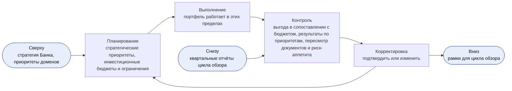
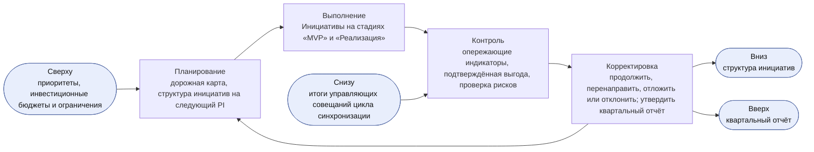
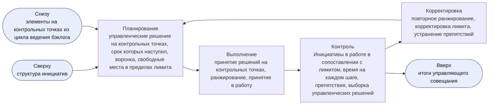
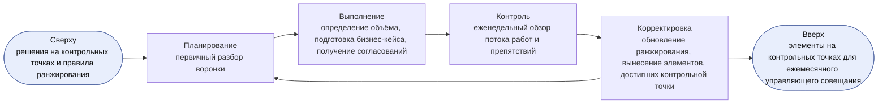
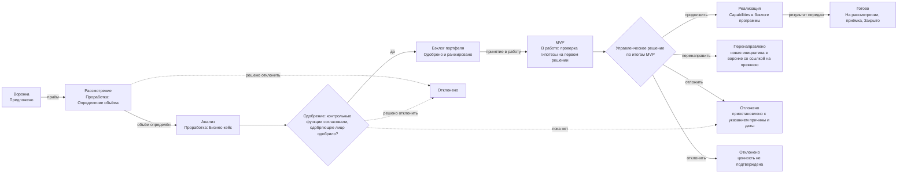
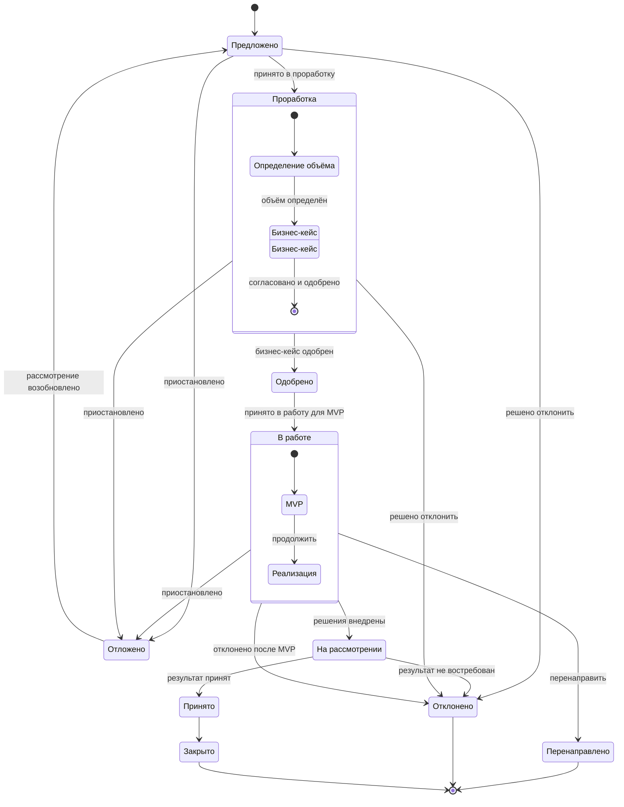
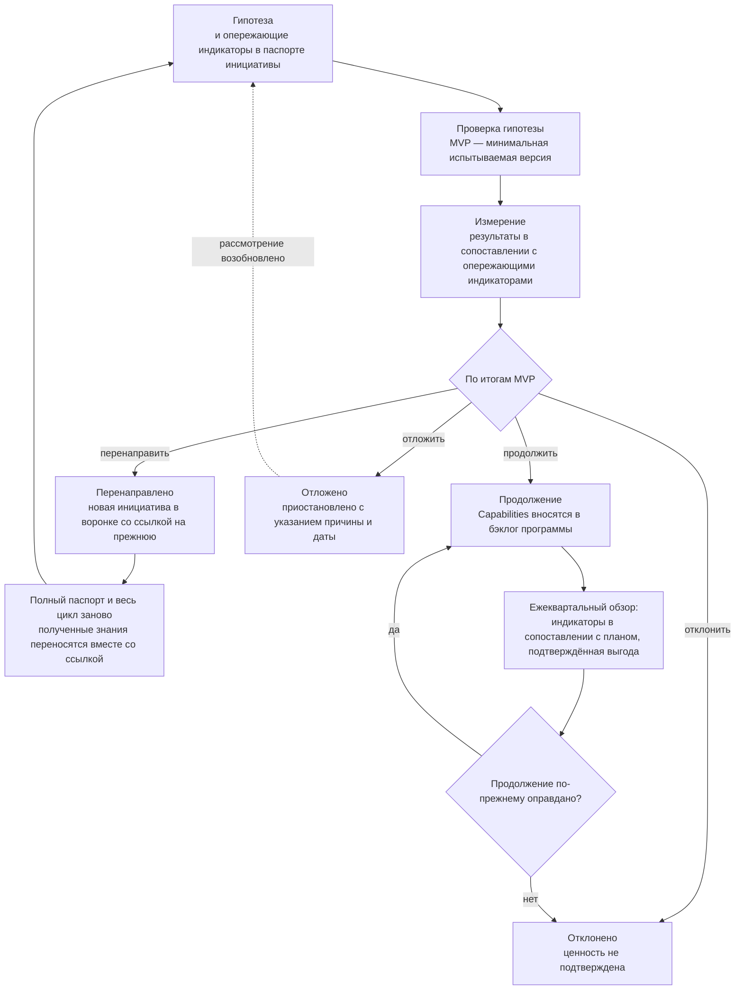
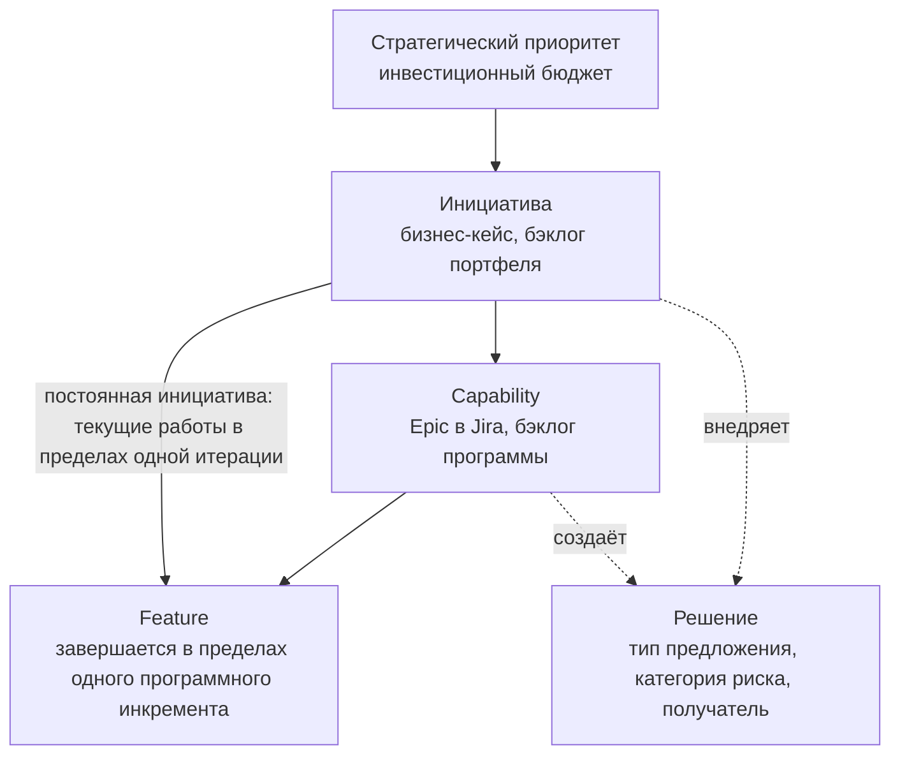

```yaml
id: AICC-ORG-02-RU
title: Модель управления портфелем
status: active
revision: 2.2
created: 2026-10-02
revised: 2026-10-04
source: charter/en/documents/portfolio-management-model.md
source_revision: 2.2
source_sha256: 41f431850698bb249add292e48841c1aa258db04c31297e1e37762111593ce5b
translation_status: reviewed
```

# Модель управления портфелем

## 1. Назначение и область применения

1.1. Настоящая Модель управления портфелем устанавливает, как AICC решает, какие бизнес-инициативы принять в проработку, финансировать, продолжить, отложить или отклонить. Модель описывает управление портфелем AICC, при котором инициативы увязаны со стратегией, приоритеты финансируются из инвестиционного бюджета в пределах инвестиционных ограничений, а не по каждой инициативе в отдельности, а управленческие решения принимаются небольшими шагами на основе фактических данных.

1.2. Модель распространяется на новые сервисы и новые инициативы, а также на существенные изменения в них. Новая функция существующего сервиса не является инициативой: она вносится в бэклог программы, и работа с ней ведётся по Модели жизненного цикла решений.

1.3. Порядок управления AICC как подразделением и контроля за его деятельностью установлен Операционной моделью, которая имеет преимущественную силу. Действие настоящей модели заканчивается в момент внесения Capabilities инициативы в бэклог программы; дальнейшая работа ведётся по Модели жизненного цикла решений. Рисунки носят иллюстративный характер и самостоятельных правил не устанавливают.

## 2. Стратегические исходные данные

2.1. Стратегические приоритеты являются стратегическими темами портфеля. Куратор AICC определяет их по согласованию с Советом директоров, устанавливает для каждого из них инвестиционный бюджет и ежегодно устанавливает инвестиционные ограничения (раздел 4 Положения об AICC). Владельцы доменов заявляют приоритеты своих доменов, и куратор AICC учитывает их при определении стратегических приоритетов.

2.2. В портфеле ведётся каталог существующих решений и пакетов. Руководитель AICC сверяет с этим каталогом каждую предлагаемую инициативу, чтобы портфель повторно использовал существующие решения и пакеты и не дублировал их.

## 3. Роли и органы

3.1. Участие ролей, установленных Операционной моделью, в управлении портфелем приведено в следующей таблице. В первой графе указано, в чём состоит участие роли в управлении портфелем.

| Участие в управлении портфелем | Роль | Действия в управлении портфелем |
| --- | --- | --- |
| Руководство портфелем | Куратор AICC | Устанавливает стратегические приоритеты, инвестиционные бюджеты, инвестиционные ограничения и структуру инициатив; одобряет инициативу, которая превышает инвестиционное ограничение, охватывает несколько доменов или относится к обеспечивающим работам; решает, продолжить, перенаправить, отложить или отклонить такую инициативу; утверждает квартальный отчёт и определяет, выносить ли его на рассмотрение Комитета Совета директоров или Совета директоров |
| Рекомендации по портфелю | Управляющий комитет по AI | Даёт куратору AICC рекомендации по портфелю и по разногласиям между доменами |
| Подразделение-заказчик | Владелец домена | Представляет подразделение-заказчика; определяет ценность; отвечает за бизнес-результат инициативы, а совместно с одобряющим лицом (п. 6.3) — за её гипотезу, опережающие индикаторы и оценку её MVP; одобряет бизнес-кейс инициативы, которая не выходит за пределы одного домена и не превышает инвестиционного ограничения; принимает результат и подтверждает выгоду |
| Управление продуктом и портфелем, ответственность за Capabilities | Руководитель AICC | Ведёт воронку и бэклог портфеля; при приёме проводит первичную оценку каждой потребности; готовит бизнес-кейс совместно с владельцем домена; ранжирует инициативы, устанавливает лимит инициатив в работе в пределах структуры инициатив, установленной куратором AICC, и принимает инициативы в работу; готовит и проводит ежемесячное управляющее совещание; отвечает за продвижение инициативы по канбан-доске портфеля |
| Архитектура и MVP | Инженер решений | Определяет архитектуру, готовит описание решения и создаёт MVP совместно с экспертом домена |
| Комплаенс и риски | Представители контрольных функций | До одобрения согласуют бизнес-кейс, по которому ожидается категория риска 2 или 3; участвуют в ежеквартальной проверке рисков; вправе остановить инициативу или решение в пределах своей компетенции |

Пояснение. Потребность заявляет руководитель подразделения или участник команды AICC. Руководитель AICC принимает её, проводит первичную оценку (п. 5.5), определяет объём совместно с владельцем домена и вместе с ним готовит бизнес-кейс. Если ожидается категория риска 2 или 3, бизнес-кейс согласуют представители контрольных функций; одобряет его владелец домена или куратор AICC. Руководитель AICC ранжирует инициативу и принимает её в работу, когда это позволяют WIP-лимиты, а инженер решений проверяет гипотезу на MVP. Владелец домена принимает результат и подтверждает выгоду.

3.2. Обязанности по управлению портфелем закрепляются за разными ролями. Роль, которая определяет ценность инициативы, не ранжирует её; роль, которая ранжирует инициативу, не одобряет её, если инициатива превышает инвестиционное ограничение; роль, которая создаёт решение, не принимает его. Если при небольшой численности команды руководитель AICC совмещает несколько таких обязанностей, применяются правила разграничения обязанностей, установленные пунктом 4.4 Операционной модели.

## 4. Циклы управления портфелем

4.1. Управление портфелем ведётся в четырёх циклах. Каждый цикл строится по схеме «планирование — выполнение — контроль — корректировка», имеет собственную периодичность и проводится на определённом мероприятии. Рамки каждого цикла задаются вышестоящим циклом, которому передаются полученные фактические данные. Циклы проводятся на мероприятиях цикла контроля (раздел 6 Операционной модели); дополнительные совещания не вводятся. В каждом цикле по инициативе решает лицо, одобряющее её согласно пункту 6.3 (далее — одобряющее лицо): владелец домена — если инициатива не выходит за пределы одного домена и не превышает инвестиционного ограничения, куратор AICC — если она превышает ограничение, охватывает несколько доменов или относится к обеспечивающим работам. Рамки и структуру инициатив определяет только куратор AICC. Циклы, лица, принимающие решения, рассматриваемые в каждом цикле данные и записи приведены в следующей таблице.

| Цикл | Периодичность и мероприятие | Лицо, принимающее решение | Рассматриваемые данные | Записи |
| --- | --- | --- | --- | --- |
| Стратегический | Ежегодно, на ежегодном управляющем совещании (ежемесячном управляющем совещании в декабре), на следующий год | Куратор AICC с учётом рекомендаций Управляющего комитета по AI | Квартальные отчёты за год, выгода в сопоставлении с каждым инвестиционным бюджетом, распределение потока и очереди, вынесенные на этот уровень из цикла обзора портфеля | Запись о приоритетах, записи о решениях |
| Обзор портфеля | Ежеквартально, на ежеквартальном управляющем совещании | Одобряющее лицо (п. 6.3) — по каждой инициативе; куратор AICC — по структуре инициатив | Опережающие индикаторы и подтверждённая выгода каждой инициативы в работе, результаты ежеквартальной проверки рисков, а также время выполнения, время цикла, пропускная способность, загрузка потока, распределение потока и предсказуемость PI (п. 9.2) | Квартальный отчёт, снимок реестра, журнал решений |
| Синхронизация портфеля | Ежемесячно, на ежемесячном управляющем совещании | Одобряющее лицо (п. 6.3) — на контрольных точках; руководитель AICC проводит цикл, ранжирует инициативы и принимает их в работу | Незавершённая работа, соблюдение лимита, время до управленческого решения, возраст элементов, возвраты на контрольных точках и выборка управленческих решений (п. 9.2) | Итоги управляющего совещания, бэклог портфеля |
| Ведение бэклога | Еженедельно, на еженедельном обзоре | Руководитель AICC | Воронка, элементы на контрольных точках, возраст каждого элемента и препятствия | Панель показателей, паспорта инициатив |

### Стратегический цикл

4.2. Куратор AICC проводит стратегический цикл один раз в год на ежегодном управляющем совещании; цикл охватывает следующий год. Ежегодное управляющее совещание — это ежемесячное управляющее совещание декабря, которое проводится в первые две недели декабря (п. 6.5 Операционной модели). Оно не является дополнительным совещанием; исходными данными для него служат квартальный отчёт за PIQ3 и выводы, сделанные за год на эту дату. На этапе планирования на основе стратегии Банка и приоритетов доменов устанавливаются стратегические приоритеты, инвестиционные бюджеты и инвестиционные ограничения. На этапе контроля рассматриваются выгода в сопоставлении с каждым инвестиционным бюджетом, результаты по каждому приоритету и очереди, вынесенные на этот уровень из цикла обзора портфеля (п. 4.3), а также пересматриваются документы и Заявление о риск-аппетите в отношении AI. На этапе корректировки приоритеты, бюджеты и ограничения подтверждаются на следующий год или изменяются. Установленные рамки передаются в цикл обзора портфеля, из которого в стратегический цикл поступают квартальные отчёты. Ежеквартальное управляющее совещание, завершающее неделю инноваций и планирования (неделю IP) в PIQ4, ничего из перечисленного не устанавливает; изменение рамок, которого требуют результаты PIQ4, вносится на первом ежеквартальном управляющем совещании следующего года.



Рисунок 1. Стратегический цикл.

Пояснение. Куратор AICC устанавливает инвестиционный бюджет каждого стратегического приоритета и инвестиционные ограничения. Инициативу, которая не выходит за пределы одного домена и не превышает инвестиционного ограничения, одобряет владелец домена, остальные инициативы — куратор AICC. Соглашение о взаимодействии не оформляется для инициативы, принять которую в работу не позволяет лимит инициатив в работе, поэтому работа сверх лимита ожидает в бэклоге портфеля. В отчёте о результатах владелец домена подтверждает выгоду; ежеквартально выгода сопоставляется с инвестиционным бюджетом, и это учитывается при следующем ежегодном управленческом решении.

### Цикл обзора портфеля

4.3. Куратор AICC ежеквартально проводит цикл обзора портфеля на ежеквартальном управляющем совещании. На этапе планирования подтверждаются дорожная карта и структура инициатив на следующий программный инкремент (PI) в пределах инвестиционных бюджетов. На этапе контроля по каждой инициативе в работе рассматриваются опережающие индикаторы в сопоставлении с планом, выгода, подтверждённая владельцем домена, и результаты ежеквартальной проверки рисков, проводимой с представителями контрольных функций, а также поток работ за квартал. На этапе корректировки одобряющее лицо (п. 6.3) решает по каждой инициативе, продолжить, перенаправить, отложить или отклонить её; куратор AICC корректирует структуру инициатив и утверждает квартальный отчёт, который вправе вынести на рассмотрение Комитета Совета директоров или Совета директоров. Если очередь на каком-либо шаге канбан-доски портфеля растёт два квартала, руководитель AICC выносит её на стратегический цикл. Рамки цикла обзора портфеля задаются стратегическим циклом; структура инициатив передаётся в цикл синхронизации портфеля, где руководитель AICC устанавливает в её пределах лимит инициатив в работе, а квартальный отчёт возвращается в стратегический цикл.



Рисунок 2. Цикл обзора портфеля.

Пояснение. На ежеквартальном управляющем совещании поочерёдно рассматривается каждая инициатива в работе. Руководитель AICC представляет её опережающие индикаторы в сопоставлении с планом, владелец домена подтверждает выгоду, а одобряющее лицо (п. 6.3) решает, продолжить, перенаправить, отложить или отклонить инициативу: владелец домена — если она не выходит за пределы одного домена и не превышает инвестиционного ограничения, в противном случае — куратор AICC. Управленческое решение вносится в журнал решений, а его результат отражается в квартальном отчёте.

### Цикл синхронизации портфеля

4.4. Цикл синхронизации портфеля проводится каждый месяц на ежемесячном управляющем совещании, на котором председательствует куратор AICC; руководитель AICC готовит и проводит этот цикл. На этапе планирования формируется повестка: управленческие решения на контрольных точках, срок которых наступил, воронка и свободные места в пределах лимита. На этапе выполнения принимаются решения на контрольных точках, инициативы ранжируются и в работу принимается подходящая инициатива с наивысшим рангом. На этапе контроля рассматривается поток работ: число инициатив в работе в сопоставлении с лимитом, время на каждом шаге и элементы, вынесенные на рассмотрение из-за их возраста, препятствия, а также выборка управленческих решений руководителя AICC. На этапе корректировки инициативы ранжируются заново, лимит корректируется, препятствия устраняются. Структура инициатив для этого цикла задаётся циклом обзора портфеля; в её пределах руководитель AICC устанавливает лимит, а итоги управляющего совещания возвращаются в цикл обзора портфеля.



Рисунок 3. Цикл синхронизации портфеля.

Пояснение. Руководитель AICC сообщает число свободных мест в пределах лимита и число инициатив в работе, а одобряющее лицо (п. 6.3) принимает управленческие решения, срок которых наступил. В работу принимается подходящая инициатива с наивысшим рангом. Инициативу с более низким рангом допускается принять в работу раньше по указанной причине, например из-за срока или зависимости; причина фиксируется. Когда инициатива выполнена, перенаправлена, отложена или отклонена, её место освобождается; пока лимит достигнут, в работу ничего не принимается.

### Цикл ведения бэклога

4.5. Руководитель AICC еженедельно проводит цикл ведения бэклога на еженедельном обзоре. На этапе планирования проводится первичный разбор воронки. На этапе выполнения определяется объём потребностей, совместно с владельцами доменов готовятся бизнес-кейсы и получаются согласования представителей контрольных функций. На этапе контроля на еженедельном обзоре рассматриваются поток работ и препятствия. На этапе корректировки обновляется ранжирование, а на ежемесячное управляющее совещание выносятся элементы, достигшие контрольной точки, и элементы, время нахождения которых на текущем шаге превышает 85-й процентиль времени на этом шаге. Правила ранжирования и решения на контрольных точках поступают в этот цикл из цикла синхронизации портфеля, в который передаются элементы, достигшие контрольной точки.



Рисунок 4. Цикл ведения бэклога.

Пояснение. Поступившая потребность фиксируется в воронке и в течение недели проходит первичный разбор. Руководитель AICC определяет её объём совместно с владельцем домена, готовит паспорт инициативы и получает согласования представителей контрольных функций. Когда паспорт готов, он выносится на ближайшее ежемесячное управляющее совещание, где решение принимает одобряющее лицо.

### Структура инициатив и точки контроля

4.6. Под структурой инициатив понимается распределение инициатив в работе по стратегическим приоритетам и видам работ: бизнес-работы для подразделения-заказчика, обеспечивающие работы, заказчиком которых является куратор AICC, и работы по рискам и комплаенсу, связанные со снижением риска или выполнением требования законодательства либо контрольной функции. Куратор AICC устанавливает структуру инициатив на ежеквартальном управляющем совещании так, чтобы обеспечивающие работы и работы по рискам и комплаенсу не оставались без ресурсов; руководитель AICC ранжирует инициативы и принимает их в работу в пределах этой структуры.

4.7. Портфель контролируется в четырёх точках: в начале — посредством бизнес-кейса и согласований представителей контрольных функций (пп. 6.2, 6.4); на протяжении потока работ — посредством контрольных точек, установленных пунктом 5.2, и журнала решений; при продолжении — посредством обзора портфеля (п. 4.3); в целом — посредством квартального отчёта (раздел 7 Положения об AICC).

## 5. Канбан-доска портфеля

5.1. После приёма в порядке, установленном пунктом 5.5, инициатива продвигается по канбан-доске портфеля, показанной на рисунке 5. Шаг «Воронка» предназначен для приёма идей, шаг «Рассмотрение» — для определения объёма потребности, шаг «Анализ» — для подготовки и согласования бизнес-кейса. Под принятием инициативы в работу понимается начало работы над ней, когда это позволяет лимит инициатив в работе. Бэклог портфеля — ранжированный перечень инициатив на канбан-доске; воронка соответствует его состоянию «Предложено».



Рисунок 5. Канбан-доска портфеля для инициативы.

Пояснение. Канбан-доска читается слева направо; каждая стрелка означает управленческое решение. Инициатива остаётся на шаге, пока не выполнен критерий выхода, и может выйти из потока в результате отклонения, переноса, перенаправления или отмены.

5.2. Шаги канбан-доски и контрольные точки в конце каждого шага приведены в следующей таблице. Контрольные точки потока: приём, определение объёма, одобрение, принятие в работу, управленческое решение по итогам MVP и приёмка. Состояния и переходы между ними установлены пунктом 5.1 Модели жизненного цикла решений, который является единственным источником правил переходов. Состояние «Отклонено» означает бизнес-решение о том, что ценность инициативы не подтверждена. Инициатива в состоянии «Отменено» отозвана без управленческого решения по существу: из-за ошибки, дублирования, отпадения потребности или остановки контрольной функцией. Отмена возможна в любом незакрытом состоянии инициативы.

| Шаг канбан-доски | Состояние и стадия | Условие входа | Критерий выхода | Контрольная точка | Лицо, принимающее решение | Запись |
| --- | --- | --- | --- | --- | --- | --- |
| Воронка | Предложено | Подразделение или AICC предлагает идею или потребность либо она выявлена в ходе проработки | Проведена первичная оценка согласно пункту 5.5; указаны проблема, её масштаб, вероятная категория риска, относящиеся к ней пакеты и решения каталога, стратегическая значимость и заявитель | Приём | Руководитель AICC принимает потребность в проработку, откладывает или отклоняет её | Элемент бэклога портфеля с указанием заявителя и проблемы |
| Рассмотрение | Проработка: Определение объёма | Принято в проработку | Потребность и требования понятны. Инициатива соответствует стратегическому приоритету, у неё есть подразделение-заказчик с владельцем домена (для обеспечивающих работ — куратор AICC), её допускает лимит инициатив в работе (п. 7.2 Бизнес-модели), и она не дублирует решение или пакет каталога | Определение объёма | Руководитель AICC совместно с владельцем домена | Объём в паспорте инициативы |
| Анализ | Проработка: Бизнес-кейс | Объём определён | Паспорт инициативы заполнен по всем шести разделам, соответствует критериям пункта 6.2 и согласован представителями контрольных функций (п. 6.4) | Одобрение | Одобряющее лицо (п. 6.3) одобряет, возвращает на доработку, откладывает или отклоняет | Паспорт инициативы, согласования представителей контрольных функций и запись о решении |
| Бэклог портфеля | Одобрено | Бизнес-кейс одобрен | Инициатива ранжирована (п. 6.5) и принимается в работу, когда это позволяет лимит инициатив в работе | Принятие в работу | Руководитель AICC принимает в работу подходящую инициативу с наивысшим рангом | Ранг и оценки в бэклоге портфеля |
| MVP | В работе: MVP | Принято в работу | Гипотеза проверена на MVP по опережающим индикаторам паспорта инициативы | Управленческое решение по итогам MVP | Одобряющее лицо (п. 6.3) решает продолжить, перенаправить, отложить или отклонить инициативу (п. 7.2) | Описание решения, результат проверки гипотезы и запись в журнале решений |
| Реализация | В работе: Реализация | Решено продолжить | Capabilities внесены в бэклог программы, решения внедрены | Контрольной точки портфеля нет; каждое решение проходит контрольные точки, установленные разделом 7 Модели жизненного цикла решений | Принимает владелец домена, для обеспечивающих работ — куратор AICC | Capabilities в бэклоге программы в составе инициативы |
| Готово | На рассмотрении, Принято, Закрыто | Результат передан | Результат рассмотрен по опережающим индикаторам и принят, выгода подтверждена в сопоставлении с паспортом инициативы (п. 7.3 Бизнес-модели) | Приёмка | Владелец домена, для обеспечивающих работ — куратор AICC | Отметка о приёмке с указанием лица и даты в бэклоге портфеля и отчёт о результатах взаимодействия с заказчиком |

Пояснение. Руководитель AICC представляет инициативу на контрольной точке с надлежащим образом оформленным элементом бэклога, а лицо, принимающее решение, оценивает выполнение критерия выхода. Возможны четыре исхода. Продвижение: инициатива переходит на следующий шаг. Возврат: инициатива возвращается на доработку с перечнем замечаний, и шаг повторяется. Перенос: инициатива остаётся в воронке с указанием причины и даты повторного рассмотрения. Отклонение: ценность не подтверждена; выводы по итогам рассмотрения сохраняются в бэклоге портфеля. Управленческое решение вносится в журнал решений.

Состояния, на которых основана канбан-доска, показаны на рисунке 6.



Рисунок 6. Состояния инициативы.

Пояснение. «Ожидание» — состояние инициативы в работе, которая зависит от лица вне AICC (п. 5.1 Модели жизненного цикла решений); на досках это состояние отмечается флагом. Состояние «Отменено» доступно в любом состоянии при отзыве, например из-за ошибки. Поэтому ни одно из этих двух состояний на рисунке не показано. В облегчённом режиме инициатива переходит из состояния «В работе» в состояние «На рассмотрении», минуя состояние «Выполнено».

5.3. Проработка — это исследование: на ней изучаются потребность и требования, ничего не создаётся и формируется паспорт инициативы. Её стоимость — время руководителя AICC и владельца домена. MVP служит для проверки гипотезы: это минимальная версия первого решения, которую испытывают, чтобы установить, работает ли она и удовлетворяет ли потребность.

5.4. Число инициатив, одновременно находящихся в работе, ограничивается лимитом, чтобы объём незавершённой работы портфеля оставался небольшим, а поток работ — равномерным. Постоянные инициативы, определённые Бизнес-моделью, в лимите не учитываются. Руководитель AICC устанавливает WIP-лимит в пределах структуры инициатив, которую куратор AICC устанавливает на ежеквартальном управляющем совещании (п. 4.6), и пересматривает его на ежемесячном управляющем совещании.

5.5. При приёме руководитель AICC проводит первичную оценку каждой потребности в следующем порядке: проблема, которую она решает, её масштаб, вероятная категория риска и наличие в каталоге пакета или решения, которое уже удовлетворяет эту потребность (п. 2.2). Потребность, относящаяся к текущим работам в значении, установленном Бизнес-моделью, вносится в бэклог программы как Feature непосредственно в составе постоянной инициативы своего направления услуг и контрольные точки канбан-доски портфеля не проходит. Паспорт постоянной инициативы одобряет куратор AICC в соответствии с пунктом 4.9 Бизнес-модели; собственный MVP для постоянной инициативы не требуется. К её Features текущих работ применяются правила одобрения и приёмки, установленные пунктами 3.1, 5.2 и 7.3 Модели жизненного цикла решений. Любая другая потребность вносится в воронку как инициатива и проходит шаг «Рассмотрение» только при выполнении критериев, установленных пунктом 7.2 Бизнес-модели.

## 6. Бизнес-кейс

6.1. Каждая инициатива оформляется одностраничным паспортом инициативы — её бережливым бизнес-кейсом, в котором указываются гипотеза, бизнес-результаты с опережающими индикаторами, объём и минимально жизнеспособный продукт (MVP), затраты и ценность, риски и ожидаемая категория риска, а также управленческое решение. Форма паспорта установлена шаблоном «Паспорт инициативы». Числовые показатели Банка хранятся в системах-источниках, а паспорт содержит ссылки на них.

6.2. Бизнес-кейс одобряется, если он соответствует критериям, приведённым в следующей таблице. Критерии отвечают на пять вопросов в объёме одной страницы.

| Вопрос | Критерий |
| --- | --- |
| Зачем нужно изменение? | Инициатива соответствует стратегическому приоритету, а гипотеза указывает ценность для названного подразделения |
| Какой вариант наилучший? | Для результатов установлены от двух до четырёх опережающих индикаторов (п. 6.7) с указанием системы-источника, базового и целевого значений; MVP проверяет гипотезу с наименьшими затратами |
| Доступно ли финансирование? | Затраты не выходят за пределы инвестиционного бюджета стратегического приоритета |
| Можно ли закупить и внедрить? | Названы зависимости и поставщики, указана ожидаемая категория риска, получены согласования представителей контрольных функций (п. 6.4) |
| Можно ли обеспечить надлежащую эксплуатацию? | Назван владелец домена, а для обеспечивающих работ — куратор AICC, и подтверждено его согласие принять на себя обязательства; указан порядок приёмки при передаче результата |

6.3. Бизнес-кейс инициативы, которая не выходит за пределы одного домена и не превышает инвестиционного ограничения, одобряет владелец домена. Если инициатива превышает инвестиционное ограничение или охватывает несколько доменов, а также для обеспечивающих работ, заказчиком которых является куратор AICC, бизнес-кейс одобряет куратор AICC.

6.4. Согласование представителей контрольных функций является контрольной точкой для бизнес-кейса в предложенном виде. Если для инициативы ожидается категория риска 2 или 3, представители соответствующих контрольных функций до одобрения согласуют бизнес-кейс в пределах своей компетенции; представитель, не согласовавший бизнес-кейс, вправе его остановить (п. 5.4 Операционной модели). Руководитель AICC получает согласование, которое оформляется заключением контрольной функции соответствующего представителя, и приводит ссылку на него в паспорте инициативы. Если категория риска, присвоенная в соответствии с пунктом 3.2 Политики применения AI, выше ожидаемой в бизнес-кейсе или согласованной представителями, бизнес-кейс возвращается им на согласование.

6.5. Инициативы в бэклоге портфеля ранжируются методом взвешенной приоритизации кратчайших работ (метод WSJF): сумма оценок ценности, срочности и снижения риска или открываемой возможности, каждая по шкале от 1 до 5, делится на оценку трудоёмкости по шкале от 1 до 5. Ценность определяет владелец домена, остальные составляющие оценивает руководитель AICC, он же ранжирует инициативы. Руководитель AICC вправе отступить от ранжирования по указанной причине и фиксирует её.

6.6. Финансирование выделяется стратегическим приоритетам и командам, а не отдельным инициативам (раздел 4 Положения об AICC). AICC не взимает плату с подразделений; расходы на эксплуатацию своих решений, лицензии и услуги поставщиков домен несёт за счёт своего инвестиционного бюджета.

6.7. Опережающий индикатор инициативы измеряет изменение бизнес-показателей, например уровня использования, затрат времени, числа ошибок, затрат или выручки, а не деятельность или непосредственный результат работы. Владелец домена, а для обеспечивающих работ — куратор AICC, указывает в паспорте инициативы от двух до четырёх таких индикаторов.

6.8. Гипотеза — цель инициативы. Опережающие индикаторы заранее показывают, подтверждается ли гипотеза; MVP — её первое испытание; Capabilities — средства её достижения (п. 8.2); выгода, подтверждённая в сопоставлении с паспортом инициативы, — её окончательное подтверждение.

## 7. MVP и управленческое решение по его итогам

7.1. Когда руководитель AICC принимает инициативу из бэклога портфеля в работу, инженер решений определяет архитектуру первого решения этой инициативы, готовит его описание и совместно с экспертом домена создаёт MVP в пределах WIP-лимитов. Объём первого решения ограничен. Инженер решений не вправе допускать реальных пользователей к MVP до проверки или валидации, которых требует его категория риска (раздел 3 Политики применения AI).

7.2. По завершении MVP одобряющее лицо (п. 6.3) сопоставляет результат с опережающими индикаторами паспорта инициативы и принимает одно из управленческих решений, приведённых в следующей таблице. Управленческое решение вносится в журнал решений и оформляется записью о решении; выводы по итогам MVP сохраняются в бэклоге портфеля.

| Управленческое решение | Условие | Последующие действия |
| --- | --- | --- |
| Продолжить | Гипотеза подтверждается: опережающие индикаторы изменяются так, как ожидается в паспорте инициативы, и владелец домена видит ценность | Capabilities инициативы определяются и вносятся в бэклог программы в составе инициативы |
| Перенаправить | Потребность подтверждена, а полученные знания требуют другого подхода или объёма | Инициатива закрывается в состоянии «Перенаправлено»; новая инициатива с полным паспортом вносится в воронку со ссылкой на прежнюю и заново проходит весь цикл; полученные знания и результаты MVP переносятся в новую инициативу вместе со ссылкой |
| Отложить | Достаточных оснований продолжать работу пока нет из-за сроков, зависимости или более высокого приоритета другой работы | Инициатива приостанавливается в состоянии «Отложено» с указанием причины и даты повторного рассмотрения; при возобновлении рассмотрения она возвращается в воронку |
| Отклонить | Ценность не подтверждена: опережающие индикаторы не изменились либо затраты или риск превышают выгоду | Инициатива переходит в состояние «Отклонено», а её место в пределах лимита инициатив в работе получает следующая по рангу инициатива |

Цикл проверки гипотезы на MVP и последующее управленческое решение показаны на рисунке 7.



Рисунок 7. Цикл проверки гипотезы на MVP.

Пояснение. До начала работы над MVP в паспорте инициативы указываются гипотеза, опережающие индикаторы с их системами-источниками и объём проверки гипотезы. Инженер решений совместно с экспертом домена создаёт минимальную версию, достаточную для проверки гипотезы. По завершении одобряющее лицо сопоставляет результаты с индикаторами и принимает управленческое решение. Если решено продолжить работу, тот же вопрос по каждой инициативе в работе ставится на ежеквартальном обзоре; инициатива, индикаторы и подтверждённая выгода которой не оправдывают ожиданий, откладывается или отклоняется.

7.3. Описание решения одобряет владелец домена, а категорию риска решения присваивает руководитель AICC (раздел 3 Политики применения AI). О выпуске решения категории риска 3 решает куратор AICC.

7.4. Одобряющее лицо (п. 6.3) и владелец домена отвечают за гипотезу, опережающие индикаторы и оценку MVP, а инженер решений и эксперт домена — за создание MVP. Владелец домена на каждом ревью и демонстрации итерации рассматривает ход работы над MVP в сопоставлении с опережающими индикаторами.

## 8. Инициатива, Capability и Feature

8.1. Инициатива создаёт одно или несколько решений посредством Capabilities, а Capability реализуется посредством Features. Features текущих работ находятся непосредственно в составе своей постоянной инициативы (п. 5.5). Уровни работы показаны на рисунке 8. Инвестиции и приоритет устанавливаются на уровне инициативы; в бэклоге программы Capabilities сгруппированы по их инициативам.



Рисунок 8. Уровни работы.

8.2. Руководитель AICC одобряет Capability после консультации с владельцем домена и одобряет только такую Capability, в которой указан опережающий индикатор её инициативы, на улучшение которого она направлена. Capability принимается как по этому индикатору, так и по своим критериям приёмки. Capability обеспечивающих работ может находиться непосредственно в составе инициативы без решения; обеспечивающим работам, в результате которых не создаётся решение на основе AI, категория риска не присваивается.

8.3. В Jira инициатива располагается уровнем выше Epic, Capability соответствует Epic, Feature — отдельному типу задач Jira, а задача — подзадаче. Наименование Epic обозначает элемент Jira, которому соответствует Capability; употребление этого слова в другой методологии поясняется в соответствующем контексте и не изменяет данного сопоставления.

## 9. Рассмотрение, показатели и записи

9.1. В циклах управления портфелем, установленных разделом 4, воронка, бэклог портфеля и инициативы в работе рассматриваются ежемесячно, а ежеквартально по каждой инициативе в работе на основе её опережающих индикаторов в сопоставлении с планом и выгоды, подтверждённой владельцем домена, подтверждается, продолжить её, перенаправить, отложить или отклонить.

9.2. Поток работ и выгоду портфеля AICC измеряет показателями, приведёнными в следующей таблице; для портфеля они раскрывают показатели раздела 7 Положения об AICC. Руководитель AICC отражает эти показатели на панели показателей и в квартальном отчёте. Показатели потока канбан-доски портфеля учитывают обычные инициативы; постоянные инициативы в них не учитываются и показываются отдельно. Features текущих работ учитываются в показателях разработки и внедрения, установленных Моделью жизненного цикла решений.

| Показатель | Определение | Источник | Мероприятие рассмотрения | Порядок установления целевого значения |
| --- | --- | --- | --- | --- |
| Незавершённая работа | Инициативы в работе на определённую дату, кроме постоянных инициатив | Бэклог портфеля | Ежемесячное управляющее совещание | В пределах лимита инициатив в работе (п. 5.4) |
| Время до управленческого решения | Число дней от внесения инициативы в воронку до её одобрения | Бэклог портфеля | Ежемесячное управляющее совещание | Устанавливается на управляющем совещании после получения базовых значений |
| Время выполнения | Число дней от состояния «Одобрено» до состояния «Принято» | Бэклог портфеля | Ежеквартальное управляющее совещание | Устанавливается на управляющем совещании после получения базовых значений |
| Время цикла | Число дней от состояния «В работе» до состояния «На рассмотрении» | Бэклог портфеля | Ежеквартальное управляющее совещание | Устанавливается на управляющем совещании после получения базовых значений |
| Пропускная способность | Число инициатив, перешедших в состояние «Принято» за программный инкремент | Бэклог портфеля | Ежеквартальное управляющее совещание | Отслеживается динамика; целевое значение не устанавливается |
| Возраст элемента | Число дней нахождения инициативы на текущем шаге в сопоставлении с 85-м процентилем времени на этом шаге | Бэклог портфеля | Еженедельный обзор; ежемесячное управляющее совещание | Элемент, возраст которого превышает 85-й процентиль, выносится на рассмотрение (п. 4.5) |
| Ожидаемое время выполнения | Среднее число инициатив между состояниями «Одобрено» и «Принято», делённое на среднюю пропускную способность, в программных инкрементах | Бэклог портфеля | Ежемесячное управляющее совещание | Целевое значение не устанавливается; показатель учитывается при установлении лимита инициатив в работе |
| Эффективность потока | Доля времени выполнения инициативы, в течение которой она находится в состоянии «В работе», а не «Ожидание» | Бэклог портфеля | Ежемесячное управляющее совещание | Отслеживается динамика; целевое значение не устанавливается |
| Загрузка потока | Инициативы в состоянии «Одобрено», ожидающие принятия в работу, и число дней ожидания каждой из них | Бэклог портфеля | Ежемесячное управляющее совещание; ежеквартальное управляющее совещание | Очередь, которая растёт два квартала, выносится на стратегический цикл (п. 4.3) |
| Распределение потока | Доля инициатив в работе по стратегическим приоритетам и видам работ (п. 4.6) | Бэклог портфеля | Ежеквартальное управляющее совещание | В пределах структуры инициатив, установленной куратором AICC |
| Возвраты на контрольных точках | Доля инициатив, возвращённых на контрольной точке, от числа представленных на ней | Журнал решений | Ежемесячное управляющее совещание | Отслеживается динамика; целевое значение не устанавливается |
| Соблюдение лимита | Число дней периода, в которые число инициатив в работе превышало лимит | Бэклог портфеля | Ежемесячное управляющее совещание | Ноль |
| Выборка управленческих решений | Доля управленческих решений руководителя AICC, признанных надлежащими, от числа включённых в выборку | Журнал решений; итоги управляющего совещания | Ежемесячное управляющее совещание | Все признаны надлежащими (раздел 6 Операционной модели) |
| Подтверждённая выгода в сопоставлении с заявленной | Выгода, подтверждённая владельцем домена, в сопоставлении с выгодой, заявленной в паспорте инициативы, со ссылками на числовые показатели в их источнике | Паспорт инициативы; отчёт о результатах | Ежеквартальное управляющее совещание; ежегодное управляющее совещание | Отслеживается динамика по стратегическим приоритетам в сопоставлении с инвестиционным бюджетом |
| Предсказуемость PI | Как определено Моделью жизненного цикла решений | Цели PI | Обзор и демонстрация PI; ежеквартальное управляющее совещание | Отслеживается динамика; целевое значение не устанавливается |

9.3. Инициатива считается завершённой, когда её решения внедрены, а результат после окончательной приёмки командой (п. 7.3 Модели жизненного цикла решений) рассмотрен и принят владельцем домена, а для обеспечивающих работ — куратором AICC. Приёмка взаимодействия с заказчиком фиксируется в отчёте о результатах.

9.4. Записями портфеля являются бэклог портфеля, запись о приоритетах, дорожная карта, панель показателей, журнал решений, итоги управляющих совещаний, квартальный отчёт и снимки реестра; руководитель AICC не вправе вводить другие записи для отслеживания портфеля. В бэклоге портфеля по каждой инициативе указываются даты её перехода в каждое состояние и ссылки на её опережающие индикаторы. Бэклог портфеля и паспорта инициатив хранятся в реестре, описания решений — в портфеле. К настоящей модели относятся контрольные процедуры C-02, C-08, C-09, C-23 и C-24, установленные разделом 8 Операционной модели: модель устанавливает их правила или в соответствии с ней ведутся их подтверждающие записи.

9.5. Показатели пункта 9.2 рассчитываются в календарных днях; по ним оцениваются медиана, 85-й процентиль и динамика. Показатели не используются для оценки сотрудников.

9.6. Руководитель AICC отвечает за определение каждого показателя пункта 9.2. Показатель добавляется или изменяется управленческим решением куратора AICC, которое принимается на ежемесячном управляющем совещании и вносится в журнал решений; в том же порядке исключается показатель, который не рассматривался в течение двух программных инкрементов. Целевые значения показателей потока портфеля куратор AICC устанавливает на ежемесячном управляющем совещании после получения базовых значений.

## Журнал изменений

| Версия | Дата | Изменение | Решение |
| --- | --- | --- | --- |
| 1.0 | 2026-10-02 | Базовая версия. | DR-2026-060 |
| 2.0 | 2026-10-03 | Добавлены приём текущих работ и инициатив, контрольные точки и отмена, разграничение обязанностей, структура инициатив и четыре точки контроля, правила опережающих индикаторов и управленческого решения по итогам MVP, а также таблица показателей портфеля с порядком их ведения и записями. | DR-2026-062 |
| 2.1 | 2026-10-03 | Уточнены порядок одобрения постоянной инициативы и её Features текущих работ, находящихся непосредственно в её составе; собственный MVP для неё не требуется. | нет (исправление в соответствии с пунктом 4.2 Каталога документов) |
| 2.2 | 2026-10-04 | Уточнено, что Epic обозначает сопоставление с Jira, без запрета на употребление этого слова для соответствующего понятия другой методологии; иерархия работ AICC не изменена. | DR-2026-064 |
