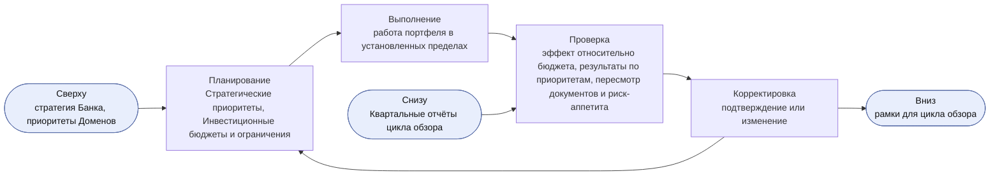
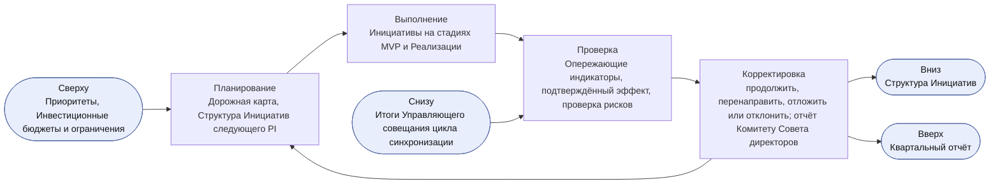
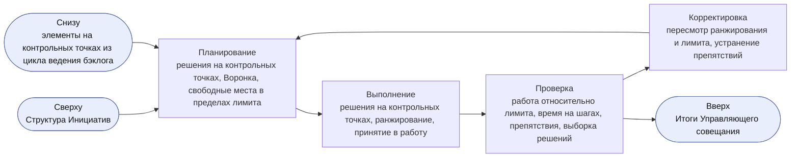
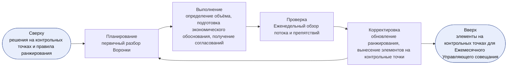
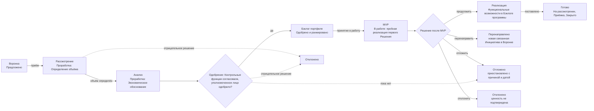
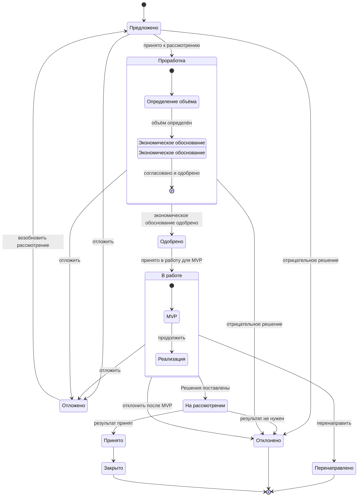
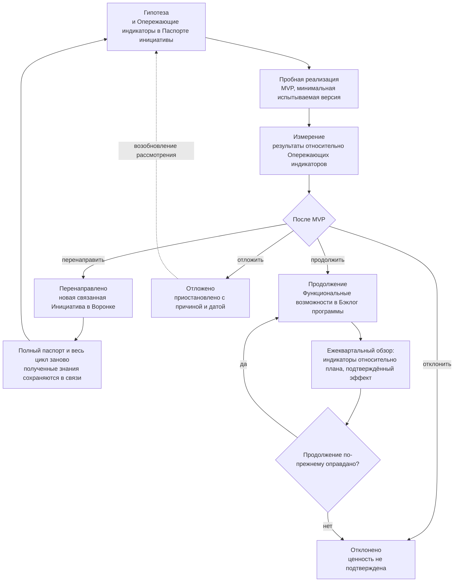
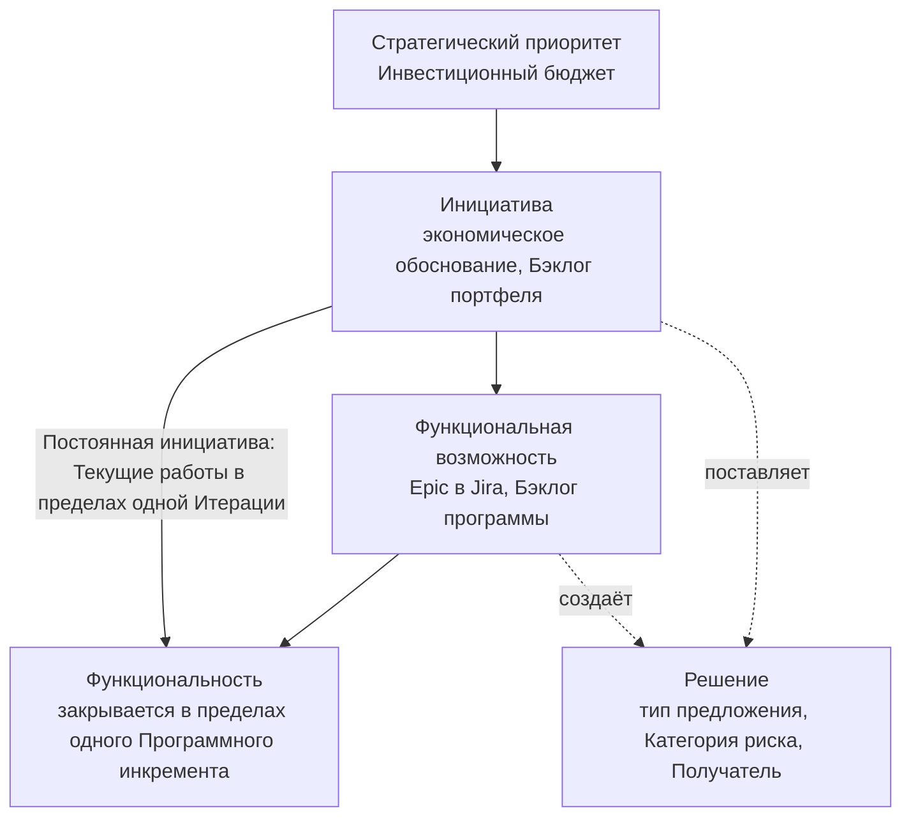

```yaml
id: AICC-ORG-02-RU
title: Модель управления портфелем
status: active
revision: 2.1
created: 2026-10-02
revised: 2026-10-03
source: charter/en/documents/portfolio-management-model.md
source_revision: 2.1
source_sha256: 871ff0604fecefd149a0d7144639c054947369156e742dcb280894428a485b86
translation_status: reviewed
```

# Модель управления портфелем

## 1. Назначение и область применения

1.1. Настоящая Модель управления портфелем определяет, как AICC принимает решения о принятии к рассмотрению, финансировании, продолжении, отложении или отклонении бизнес-инициатив. Она описывает управление портфелем AICC, в котором Инициативы связаны со стратегией, финансирование выделяется Стратегическим приоритетам в пределах Инвестиционного бюджета и Инвестиционных ограничений, а не каждой Инициативе отдельно, а решения принимаются поэтапно на основании подтверждающих данных.

1.2. Модель охватывает новые сервисы и новые инициативы, а также существенные изменения в них. Новая Функциональность существующего Сервиса не является Инициативой: она поступает в Бэклог программы и управляется в соответствии с Моделью жизненного цикла решений.

1.3. Операционная модель определяет управление и контроль AICC как подразделения и имеет преимущественную силу. Действие настоящей модели заканчивается там, где Функциональные возможности Инициативы поступают в Бэклог программы; далее работа ведётся по Модели жизненного цикла решений. Рисунки служат иллюстрациями и не устанавливают самостоятельных правил.

## 2. Стратегические исходные данные

2.1. Стратегические приоритеты задают стратегические темы портфеля. Куратор AICC устанавливает их совместно с Советом директоров, выделяя каждому Инвестиционный бюджет, и должен ежегодно устанавливать Инвестиционные ограничения (Положение об AICC 4). Владельцы Доменов предлагают приоритеты своих Доменов, и Куратор AICC должен учитывать их при установлении Стратегических приоритетов.

2.2. В Портфеле ведётся каталог существующих Решений и Пакетов. Руководитель AICC должен сопоставлять с ним предлагаемую Инициативу, чтобы повторно использовать существующее и не создавать дублирующих Решений и Пакетов.

## 3. Роли и органы

3.1. Роли Операционной модели выполняют следующие функции в управлении портфелем. В первом столбце указана функция Роли в управлении портфелем.

| Функция в управлении портфелем | Роль | Действия в портфеле |
| --- | --- | --- |
| Руководство портфелем | Куратор AICC | Устанавливает Стратегические приоритеты, Инвестиционные бюджеты, Инвестиционные ограничения и Структуру Инициатив; одобряет Инициативу, превышающую Инвестиционное ограничение, охватывающую несколько Доменов или относящуюся к Обеспечивающим работам; принимает по таким Инициативам решения о продолжении, перенаправлении, отложении или отклонении; направляет Квартальный отчёт Комитету Совета директоров |
| Консультирование по портфелю | Управляющий комитет по ИИ | Консультирует Куратора AICC по Портфелю и конфликтам между Доменами |
| Функция заказчика | Владелец Домена | Представляет функцию заказчика; определяет ценность; отвечает за бизнес-результат Инициативы и совместно с лицом, принимающим решение об одобрении, — за её гипотезу, Опережающие индикаторы и оценку её MVP; одобряет экономическое обоснование в пределах одного Домена и ниже Инвестиционного ограничения; принимает результат и подтверждает эффект |
| Управление продуктом и портфелем, ответственность за Функциональные возможности | Руководитель AICC | Ведёт Воронку и Бэклог портфеля; проводит первичную оценку каждой поступившей потребности; готовит экономическое обоснование совместно с Владельцем Домена; ранжирует Инициативы, устанавливает лимит Инициатив в состоянии «В работе» в пределах Структуры Инициатив, заданной Куратором AICC, и принимает их в работу; готовит и проводит Ежемесячное Управляющее совещание; несёт ответственность за продвижение Инициативы по Канбан-доске портфеля |
| Архитектура и MVP | Инженер решений | Определяет архитектуру и Описание решения и создаёт MVP совместно с Экспертом Домена |
| Комплаенс и риски | Представители контрольных функций | Согласовывают экономическое обоснование, предполагающее Категорию риска 2 или 3, до его одобрения; участвуют в Ежеквартальной проверке рисков; вправе остановить Инициативу или Решение в пределах своих полномочий |

На практике руководитель функции или сотрудник AICC предлагает потребность. Руководитель AICC принимает её, проводит первичную оценку (5.5), определяет объём совместно с Владельцем Домена и вместе с ним готовит экономическое обоснование. Представители контрольных функций согласовывают его, если предполагается Категория риска 2 или 3, а Владелец Домена или Куратор AICC одобряет. Руководитель AICC ранжирует Инициативу и принимает её в работу, когда позволяют Лимиты незавершённой работы, а Инженер решений проводит пробную реализацию. Владелец Домена принимает результат и подтверждает эффект.

3.2. Обязанности по управлению портфелем разделяются. Роль, определяющая ценность Инициативы, не ранжирует её; Роль, ранжирующая её, не одобряет её при превышении Инвестиционного ограничения; Роль, создающая Решение, не принимает его. Если при небольшой численности Команды Руководитель AICC совмещает несколько таких обязанностей, применяются правила разделения обязанностей Операционной модели 4.4.

## 4. Циклы управления портфелем

4.1. Управление портфелем осуществляется в четырёх циклах. Каждый представляет собой цикл «Планирование — Выполнение — Проверка — Корректировка» со своим ритмом и форматом рассмотрения. Цикл получает установленные рамки от вышестоящего цикла и возвращает ему подтверждающие данные. Циклы используют мероприятия цикла контроля Операционной модели 6 и не добавляют совещаний. В каждом цикле решение по Инициативе принимает лицо, уполномоченное по 6.3: Владелец Домена — в пределах одного Домена и ниже Инвестиционного ограничения, Куратор AICC — при превышении ограничения, охвате нескольких Доменов или для Обеспечивающих работ. Рамки и Структуру Инициатив определяет только Куратор AICC. В следующей таблице указаны циклы, лица, принимающие решения, рассматриваемые данные и записи.

| Цикл | Ритм и формат рассмотрения | Лицо, принимающее решение | Рассматриваемые данные | Записи |
| --- | --- | --- | --- | --- |
| Стратегический | Ежегодно, на Ежегодном Управляющем совещании (Ежемесячном Управляющем совещании декабря), на следующий год | Куратор AICC при консультировании Управляющим комитетом по ИИ | Квартальные отчёты за год, эффект относительно каждого Инвестиционного бюджета, распределение потока и любая очередь, переданная на этот уровень циклом обзора портфеля | Запись о приоритетах, Записи о решениях |
| Обзор портфеля | Ежеквартально, на Ежеквартальном Управляющем совещании | Лицо, уполномоченное по 6.3, — по каждой Инициативе; Куратор AICC — по Структуре Инициатив | Опережающие индикаторы и подтверждённый эффект каждой Инициативы в состоянии «В работе», Ежеквартальная проверка рисков, полное время выполнения, время цикла, пропускная способность, загрузка и распределение потока и предсказуемость PI по 9.2 | Квартальный отчёт, Снимок Реестра, Журнал решений |
| Синхронизация портфеля | Ежемесячно, на Ежемесячном Управляющем совещании | Лицо, уполномоченное по 6.3, — на контрольных точках; Руководитель AICC проводит цикл, ранжирует и принимает в работу | Незавершённая работа, соблюдение лимита, время до принятия решения, возраст элементов, возвраты на контрольных точках и выборка Управленческих решений по 9.2 | Итоги Управляющего совещания, Бэклог портфеля |
| Ведение бэклога | Еженедельно, на Еженедельном обзоре | Руководитель AICC | Воронка, элементы на контрольных точках, возраст каждого элемента и препятствия | Панель показателей, Паспорта инициатив |

### Стратегический цикл

4.2. Куратор AICC должен проводить стратегический цикл один раз в год на Ежегодном Управляющем совещании для следующего года. Ежегодное Управляющее совещание — Ежемесячное Управляющее совещание декабря, проводимое в первые две недели декабря (Операционная модель 6.5). Оно не является дополнительным совещанием и использует Квартальный отчёт PIQ3 и выявленные к этой дате за год отклонения. На этапе планирования на основе стратегии Банка и приоритетов Доменов устанавливаются Стратегические приоритеты, Инвестиционные бюджеты и Инвестиционные ограничения. На этапе проверки рассматриваются эффект относительно каждого Инвестиционного бюджета, результаты по каждому приоритету и любая очередь, переданная циклом обзора портфеля (4.3), а также документы и Заявление о риск-аппетите в отношении ИИ. На этапе корректировки они подтверждаются или изменяются. Цикл передаёт рамки циклу обзора портфеля и получает от него Квартальные отчёты. Ежеквартальное Управляющее совещание, завершающее неделю IP в PIQ4, ничего из перечисленного не устанавливает; изменение рамок, необходимое по результату PIQ4, рассматривается на первом Ежеквартальном Управляющем совещании следующего года.



Рисунок 1: стратегический цикл.

На практике Куратор AICC устанавливает Инвестиционный бюджет каждого Стратегического приоритета и Инвестиционные ограничения. Инициативу в пределах одного Домена и ниже Инвестиционного ограничения одобряет Владелец Домена, любую иную — Куратор AICC. Соглашение о взаимодействии не оформляется для Инициативы, которую не позволяет принять лимит Инициатив в состоянии «В работе», поэтому работа сверх лимита ожидает в Бэклоге портфеля. В Отчёте о результатах Владелец Домена подтверждает эффект; ежеквартально эффект сопоставляется с Инвестиционным бюджетом, что служит основанием для следующего ежегодного решения.

### Цикл обзора портфеля

4.3. Куратор AICC должен проводить цикл обзора портфеля каждый квартал на Ежеквартальном Управляющем совещании. На этапе планирования подтверждается Дорожная карта — Структура Инициатив следующего Программного инкремента в пределах Инвестиционных бюджетов. На этапе проверки по каждой Инициативе в состоянии «В работе» рассматриваются Опережающие индикаторы относительно плана, подтверждённый Владельцем Домена эффект и Ежеквартальная проверка рисков с Представителями контрольных функций, а также поток за квартал. На этапе корректировки лицо, уполномоченное по 6.3, решает по каждой Инициативе, продолжить, перенаправить, отложить или отклонить её; Куратор AICC корректирует Структуру Инициатив и отчитывается перед Комитетом Совета директоров. Руководитель AICC передаёт в стратегический цикл очередь любого шага Канбан-доски портфеля, которая растёт два квартала. Цикл получает рамки стратегического цикла, передаёт Структуру Инициатив циклу синхронизации портфеля, где Руководитель AICC устанавливает в её пределах лимит Инициатив в состоянии «В работе», и возвращает Квартальный отчёт в стратегический цикл.



Рисунок 2: цикл обзора портфеля.

На практике Ежеквартальное Управляющее совещание последовательно рассматривает каждую Инициативу в состоянии «В работе». Руководитель AICC показывает её Опережающие индикаторы относительно плана, Владелец Домена подтверждает эффект, а лицо, уполномоченное по 6.3, решает, продолжить, перенаправить, отложить или отклонить её: Владелец Домена — в пределах одного Домена и ниже Инвестиционного ограничения, Куратор AICC — в остальных случаях. Решение вносится в Журнал решений, а результат отражается в Квартальном отчёте.

### Цикл синхронизации портфеля

4.4. Куратор AICC должен ежемесячно председательствовать в цикле синхронизации портфеля на Ежемесячном Управляющем совещании; Руководитель AICC готовит и проводит его. На этапе планирования формируется повестка: решения на контрольных точках, срок которых наступил, Воронка и свободные места в пределах лимита. На этапе выполнения принимаются решения на контрольных точках, ранжируются Инициативы и в работу принимается подходящая Инициатива с наивысшим рангом. На этапе проверки рассматривается поток: Инициативы в состоянии «В работе» относительно лимита, время на каждом шаге и элементы, вынесенные на рассмотрение из-за их возраста, препятствия и выборка Управленческих решений Руководителя AICC. На этапе корректировки пересматривается ранжирование, корректируется лимит и устраняются препятствия. Цикл получает Структуру Инициатив от цикла обзора портфеля, в её пределах Руководитель AICC устанавливает лимит, а Итоги Управляющего совещания возвращаются в цикл обзора портфеля.



Рисунок 3: цикл синхронизации портфеля.

На практике Руководитель AICC показывает свободные места в пределах лимита и количество Инициатив в состоянии «В работе», а лицо, уполномоченное по 6.3, принимает решения, срок которых наступил. В работу принимается подходящая Инициатива с наивысшим рангом. Инициатива с более низким рангом может быть принята раньше по указанной причине, например из-за даты или Зависимости; причина фиксируется. Завершение, перенаправление, отложение или отклонение Инициативы освобождает её место; пока лимит достигнут, новая работа не принимается.

### Цикл ведения бэклога

4.5. Руководитель AICC должен проводить цикл ведения бэклога каждую неделю на Еженедельном обзоре. На этапе планирования проводится первичный разбор Воронки. На этапе выполнения определяются объёмы потребностей, совместно с Владельцами Доменов готовятся экономические обоснования и получаются согласования Представителей контрольных функций. На этапе проверки на Еженедельном обзоре рассматриваются поток и препятствия. На этапе корректировки обновляется ранжирование; на Ежемесячное Управляющее совещание выносятся элементы, достигшие контрольной точки, и любой элемент, время нахождения которого на текущем шаге превышает 85-й процентиль времени на этом шаге. Цикл получает правила ранжирования и решения на контрольных точках из цикла синхронизации портфеля и передаёт ему элементы на контрольных точках.



Рисунок 4: цикл ведения бэклога.

На практике поступившая потребность фиксируется в Воронке и проходит первичный разбор в течение недели. Руководитель AICC определяет её объём совместно с Владельцем Домена, готовит Паспорт инициативы и получает согласования Представителей контрольных функций. Когда паспорт готов, он поступает на следующее Ежемесячное Управляющее совещание, где уполномоченное лицо принимает решение.

### Структура Инициатив и контроль

4.6. Структура Инициатив — распределение долей Инициатив в состоянии «В работе» по Стратегическим приоритетам и видам работ: бизнес-работы для функции заказчика, Обеспечивающие работы, заказчиком которых является Куратор AICC, и работы по рискам и комплаенсу, направленные на риск либо требование законодательства или Контрольной функции. Куратор AICC должен устанавливать эту структуру на Ежеквартальном Управляющем совещании так, чтобы Обеспечивающие работы и работы по рискам и комплаенсу не оставались без необходимых ресурсов; Руководитель AICC ранжирует и принимает работу в её пределах.

4.7. Контроль Портфеля осуществляется в четырёх точках: в начале — посредством экономического обоснования и согласований Представителей контрольных функций (6.2, 6.4); в ходе потока — посредством контрольных точек по 5.2 и Журнала решений; при продолжении — посредством обзора портфеля (4.3); в целом — посредством Квартального отчёта (Положение об AICC 7).

## 5. Канбан-доска портфеля

5.1. После приёма по 5.5 Инициатива проходит по Канбан-доске портфеля, показанной на рисунке 5. Воронка предназначена для приёма идей, Рассмотрение — для определения объёма потребности, Анализ — для подготовки и согласования экономического обоснования. Принять Инициативу в работу означает начать её выполнение, когда позволяет лимит Инициатив в состоянии «В работе». Бэклог портфеля — ранжированный список Инициатив на Канбан-доске, а Воронка соответствует его состоянию «Предложено».



Рисунок 5: Канбан-доска портфеля для Инициативы.

На практике Канбан-доска читается слева направо, и каждая стрелка означает решение. Инициатива остаётся на шаге, пока не выполнен критерий выхода, и может выйти из потока через отклонение, отложение, перенаправление или отмену.

5.2. Следующая таблица определяет каждый шаг и контрольную точку в его конце. Контрольные точки потока: приём, определение объёма, одобрение, принятие в работу, решение после MVP и Приёмка. Состояния и переходы определены Моделью жизненного цикла решений 5.1, которая является единственным источником правил переходов. Состояние Инициативы «Отклонено» означает бизнес-решение об отсутствии подтверждённой ценности. Состояние «Отменено» означает отзыв без решения по существу — из-за ошибки, дублирования, исчезновения потребности или остановки Контрольной функцией; отмена доступна в любом открытом состоянии Инициативы.

| Шаг Канбан-доски | Состояние и Стадия | Вход | Критерий выхода | Контрольная точка | Кто принимает решение | Запись |
| --- | --- | --- | --- | --- | --- | --- |
| Воронка | Предложено | Функция, работы по выявлению потребностей или AICC предлагают идею или потребность | Проведена первичная оценка по 5.5; указаны проблема, её масштаб, вероятная Категория риска, относящиеся к ней Пакеты и Решения каталога, стратегическая значимость и заявитель | Приём | Руководитель AICC принимает, откладывает или отклоняет | Элемент Бэклога портфеля с заявителем и проблемой |
| Рассмотрение | Проработка: Определение объёма | Принято к рассмотрению | Потребность и требования понятны. Есть соответствие Стратегическому приоритету, функция заказчика с Владельцем Домена (Куратор AICC для Обеспечивающих работ), возможность в пределах лимита Инициатив в состоянии «В работе» (Бизнес-модель 7.2); отсутствует дублирование Решения или Пакета каталога | Определение объёма | Руководитель AICC совместно с Владельцем Домена | Объём в Паспорте инициативы |
| Анализ | Проработка: Экономическое обоснование | Объём определён | Заполнены все шесть разделов Паспорта инициативы, выполнены критерии по 6.2 и получены согласования Представителей контрольных функций (6.4) | Одобрение | Лицо, уполномоченное по 6.3, одобряет, возвращает, откладывает или отклоняет | Паспорт инициативы, согласования Представителей контрольных функций и Запись о решении |
| Бэклог портфеля | Одобрено | Экономическое обоснование одобрено | Инициатива ранжирована (6.5) и принимается в работу, когда позволяет лимит Инициатив в состоянии «В работе» | Принятие в работу | Руководитель AICC принимает подходящую Инициативу с наивысшим рангом | Ранг и оценки в Бэклоге портфеля |
| MVP | В работе: MVP | Принято в работу | Пробная реализация проверила гипотезу по Опережающим индикаторам Паспорта инициативы | Решение после MVP | Лицо, уполномоченное по 6.3, решает продолжить, перенаправить, отложить или отклонить (7.2) | Описание решения, результат пробной реализации и запись в Журнале решений |
| Реализация | В работе: Реализация | Продолжение | Функциональные возможности находятся в Бэклоге программы, Решения поставлены | Контрольной точки портфеля нет; каждое Решение проходит контрольные точки Модели жизненного цикла решений 7 | Принимает Владелец Домена, а для Обеспечивающих работ — Куратор AICC | Функциональные возможности в Бэклоге программы в составе Инициативы |
| Готово | На рассмотрении, Принято, Закрыто | Результат поставлен | Результат рассмотрен по Опережающим индикаторам и принят; эффект подтверждён относительно Паспорта инициативы (Бизнес-модель 7.3) | Приёмка | Владелец Домена, а для Обеспечивающих работ — Куратор AICC | Приёмка с указанием лица и даты в Бэклоге портфеля и Отчёт о результатах Взаимодействия с заказчиком |

На практике Руководитель AICC представляет Инициативу на контрольной точке с надлежащим образом оформленной записью, а лицо, принимающее решение, проверяет критерий выхода. Возможны четыре результата. Продвижение: Инициатива переходит на следующий шаг. Возврат: она возвращается с указанием недостающего, и шаг повторяется. Отложение: она остаётся в Воронке с причиной и датой повторного рассмотрения. Отклонение: ценность не подтверждена, а извлечённые уроки сохраняются в Бэклоге портфеля. Решение вносится в Журнал решений.

Рисунок 6 показывает состояния, лежащие в основе Канбан-доски.



Рисунок 6: состояния Инициативы.

На практике «Ожидание» — состояние Инициативы, находившейся «В работе» и зависящей от лица вне AICC (Модель жизненного цикла решений 5.1); на досках оно обозначается флагом. «Отменено» доступно в любом состоянии при отзыве, например из-за ошибки; поэтому оба состояния не показаны. В Облегчённом режиме Инициатива переходит из состояния «В работе» в состояние «На рассмотрении» без состояния «Выполнено».

5.3. Проработка представляет собой исследование. На ней изучаются потребность и требования, ничего не создаётся и формируется Паспорт инициативы. Её стоимость — время Руководителя AICC и Владельца Домена. MVP — пробная реализация: минимальная версия первого Решения, которую испытывают, чтобы установить, работает ли она и удовлетворяет ли потребность.

5.4. Действует лимит Инициатив, одновременно находящихся в состоянии «В работе», чтобы объём незавершённой работы портфеля оставался небольшим, а поток — устойчивым. Постоянные инициативы, определённые Бизнес-моделью, в лимит не входят. Руководитель AICC устанавливает Лимит незавершённой работы в пределах Структуры Инициатив, заданной Куратором AICC на Ежеквартальном Управляющем совещании (4.6), и пересматривает его на Ежемесячном Управляющем совещании.

5.5. Руководитель AICC должен проводить первичную оценку каждой поступившей потребности в следующем порядке: решаемая проблема, её масштаб, вероятная Категория риска и наличие Пакета или Решения каталога, уже удовлетворяющего потребность (2.2). Потребность, относящаяся к Текущим работам по определению Бизнес-модели, поступает в Бэклог программы как Функциональность непосредственно в составе Постоянной инициативы своего Направления услуг и не проходит контрольные точки Канбан-доски портфеля. Куратор AICC одобряет Паспорт Постоянной инициативы по Бизнес-модели 4.9; отдельный MVP для Постоянной инициативы не требуется. Её Функциональности Текущих работ следуют правилам одобрения и Приёмки Модели жизненного цикла решений 3.1, 5.2 и 7.3. Любая иная потребность поступает в Воронку как Инициатива и проходит Рассмотрение только при выполнении критериев Бизнес-модели 7.2.

## 6. Экономическое обоснование

6.1. Каждая Инициатива должна оформляться одностраничным Паспортом инициативы — её кратким экономическим обоснованием: гипотеза; бизнес-результаты с Опережающими индикаторами; объём и минимально жизнеспособный продукт (MVP); затраты и ценность; риски и ожидаемая Категория риска; решение. Форму задаёт Шаблон паспорта инициативы. Числовой показатель Банка остаётся в своей исходной системе, а паспорт ссылается на него.

6.2. До одобрения экономическое обоснование должно соответствовать следующим критериям. Они отвечают на пять вопросов в объёме одной страницы.

| Вопрос | Критерий |
| --- | --- |
| Зачем нужно изменение? | Инициатива соответствует Стратегическому приоритету, а гипотеза указывает ценность для названной функции |
| Какой вариант наилучший? | Для результатов заданы от двух до четырёх Опережающих индикаторов (6.7) с исходной системой, базовым и целевым значениями; MVP проверяет гипотезу с минимальными затратами |
| Доступно ли финансирование? | Затраты находятся в пределах Инвестиционного бюджета Стратегического приоритета |
| Возможно ли приобрести и поставить? | Названы зависимости и Поставщики, указана ожидаемая Категория риска и получены согласования Представителей контрольных функций (6.4) |
| Возможно ли обеспечить надлежащую эксплуатацию? | Указан Владелец Домена, а для Обеспечивающих работ — Куратор AICC, и подтверждено его обязательство; определена Приёмка при поставке |

6.3. Владелец Домена одобряет экономическое обоснование Инициативы в пределах одного Домена и ниже Инвестиционного ограничения. Куратор AICC одобряет его при превышении ограничения, охвате нескольких Доменов и для Обеспечивающих работ, заказчиком которых он является.

6.4. Представители контрольных функций выполняют функцию согласования экономического обоснования в предложенном виде на контрольной точке. Для Инициативы с ожидаемой Категорией риска 2 или 3 Представители затронутых Контрольных функций должны согласовать экономическое обоснование в пределах своих полномочий до его одобрения; Представитель, не давший согласования, вправе остановить его (Операционная модель 5.4). Руководитель AICC получает согласование в форме Заключения контрольной функции соответствующего Представителя и ссылается на него в Паспорте инициативы. Если Категория риска, назначенная по Политике применения искусственного интеллекта 3.2, выше предполагаемой в экономическом обосновании или согласованной Представителями, экономическое обоснование возвращается им на согласование.

6.5. Инициативы в Бэклоге портфеля ранжируются по методу взвешенной приоритизации кратчайших работ (WSJF): сумма оценок ценности, срочности и снижения риска либо возможности, каждая от 1 до 5, делится на оценку трудоёмкости от 1 до 5. Владелец Домена определяет ценность, а Руководитель AICC оценивает остальные составляющие и ранжирует. Руководитель AICC вправе отступить от ранжирования по указанной причине и фиксирует её.

6.6. Финансирование выделяется Стратегическим приоритетам и Командам, а не каждой Инициативе отдельно (Положение об AICC 4). AICC не взимает плату с функций; Домен оплачивает из своего Инвестиционного бюджета эксплуатацию, лицензии и услуги Поставщиков своих Решений.

6.7. Опережающий индикатор Инициативы измеряет изменение в бизнесе, например в использовании, времени, ошибках, затратах или выручке, а не деятельность или созданный результат работы. Владелец Домена, а для Обеспечивающих работ — Куратор AICC, должен указать от двух до четырёх таких индикаторов в Паспорте инициативы.

6.8. Гипотеза является целью Инициативы. Её Опережающие индикаторы позволяют заранее судить о её состоятельности, MVP является её первой проверкой, Функциональные возможности — средствами достижения (8.2), а подтверждённый относительно Паспорта инициативы эффект — её подтверждением.

## 7. MVP и решение по его результатам

7.1. Когда Руководитель AICC принимает Инициативу из Бэклога портфеля в работу, Инженер решений должен определить архитектуру и Описание её первого Решения и совместно с Экспертом Домена создать MVP в пределах Лимитов незавершённой работы. Объём первого Решения ограничен. Инженер решений не должен допускать к использованию MVP реальных пользователей до Проверки или Валидации, требуемой его Категорией риска (Политика применения искусственного интеллекта 3).

7.2. По завершении MVP лицо, уполномоченное по 6.3, сопоставляет результат с Опережающими индикаторами Паспорта инициативы и принимает решение согласно следующей таблице. Решение вносится в Журнал решений и оформляется Записью о решении; уроки MVP сохраняются в Бэклоге портфеля.

| Решение | Условие | Последующие действия |
| --- | --- | --- |
| Продолжить | Гипотеза подтверждается: Опережающие индикаторы изменяются согласно ожиданиям Паспорта инициативы, а Владелец Домена видит ценность | Определяются Функциональные возможности Инициативы и вносятся в Бэклог программы в её составе |
| Перенаправить | Потребность подтверждена, а полученные знания требуют другого подхода или объёма | Инициатива закрывается в состоянии «Перенаправлено»; новая Инициатива с полным Паспортом инициативы вносится в Воронку со связью с прежней и проходит весь цикл заново; связь сохраняет полученные знания и результаты MVP |
| Отложить | Достаточных оснований для продолжения пока нет из-за сроков, Зависимости или более высокого приоритета другой работы | Инициатива приостанавливается в состоянии «Отложено» с причиной и датой повторного рассмотрения; при возобновлении рассмотрения она возвращается в Воронку |
| Отклонить | Ценность не подтверждена: Опережающие индикаторы не изменились либо затраты или риск превышают эффект | Инициатива переходит в состояние «Отклонено», а её место в пределах лимита Инициатив в состоянии «В работе» получает следующая Инициатива по рангу |

Рисунок 7 показывает цикл пробной реализации и последующего решения.



Рисунок 7: цикл пробной реализации.

На практике до MVP Паспорт инициативы содержит гипотезу, Опережающие индикаторы с их исходной системой и объём пробной реализации. Инженер решений совместно с Экспертом Домена создаёт минимальную версию, способную проверить гипотезу. По завершении уполномоченное лицо сопоставляет результаты с индикаторами и принимает решение. После решения о продолжении Ежеквартальный обзор ставит тот же вопрос по каждой Инициативе в состоянии «В работе»; Инициатива, индикаторы и подтверждённый эффект которой не соответствуют ожиданиям, откладывается или отклоняется.

7.3. Описание решения одобряет Владелец Домена, а Руководитель AICC назначает его Категорию риска (Политика применения искусственного интеллекта 3). Решение о Выпуске Решения Категории риска 3 принимает Куратор AICC.

7.4. Лицо, уполномоченное по 6.3, и Владелец Домена отвечают за гипотезу, Опережающие индикаторы и оценку MVP, а Инженер решений и Эксперт Домена — за его создание. Владелец Домена должен рассматривать ход MVP относительно Опережающих индикаторов на каждом Обзоре и демонстрации Итерации.

## 8. Инициатива, Функциональная возможность и Функциональность

8.1. Инициатива поставляет одно или несколько Решений через Функциональные возможности, а Функциональная возможность реализуется через Функциональности. Функциональности Текущих работ находятся непосредственно в составе своей Постоянной инициативы (5.5). Рисунок 8 показывает уровни. Инвестиции и приоритет устанавливаются на уровне Инициативы; Бэклог программы группирует Функциональные возможности по их Инициативам.



Рисунок 8: уровни работы.

8.2. Руководитель AICC одобряет Функциональную возможность после консультации с Владельцем Домена и должен одобрять только Функциональную возможность, в которой указан Опережающий индикатор её Инициативы, достижению которого она служит. Функциональная возможность принимается по этому индикатору и по своим Критериям приёмки. Функциональная возможность Обеспечивающих работ может находиться непосредственно в составе Инициативы без Решения; Обеспечивающим работам, не создающим Решение ИИ, Категория риска не назначается.

8.3. В Jira Инициатива находится выше Epic, Функциональная возможность представлена Epic, Функциональность — типом задачи, Рабочая задача — подзадачей. Слово Epic используется только в Jira.

## 9. Рассмотрение, показатели и записи

9.1. Циклы управления портфелем раздела 4 ежемесячно рассматривают Воронку, Бэклог портфеля и Инициативы в состоянии «В работе» и ежеквартально подтверждают по каждой такой Инициативе, продолжить, перенаправить, отложить или отклонить её, на основании её Опережающих индикаторов относительно плана и эффекта, подтверждённого Владельцем Домена.

9.2. AICC измеряет поток и эффект Портфеля показателями следующей таблицы, раскрывающими для Портфеля показатели Положения об AICC 7. Руководитель AICC должен показывать их на Панели показателей и в Квартальном отчёте. Показатели потока Канбан-доски портфеля учитывают обычные Инициативы и исключают Постоянные инициативы, которые показываются отдельно. Функциональности Текущих работ учитываются в показателях поставки Модели жизненного цикла решений.

| Показатель | Определение | Источник | Где рассматривается | Правило целевого значения |
| --- | --- | --- | --- | --- |
| Незавершённая работа | Инициативы в состоянии «В работе» на определённую дату, кроме Постоянных инициатив | Бэклог портфеля | Ежемесячное Управляющее совещание | В пределах лимита Инициатив в состоянии «В работе» (5.4) |
| Время до принятия решения | Дни от поступления Инициативы в Воронку до её одобрения | Бэклог портфеля | Ежемесячное Управляющее совещание | Устанавливается Управляющим совещанием после появления базового значения |
| Полное время выполнения | Дни от состояния «Одобрено» до состояния «Принято» | Бэклог портфеля | Ежеквартальное Управляющее совещание | Устанавливается Управляющим совещанием после появления базового значения |
| Время цикла | Дни от состояния «В работе» до состояния «На рассмотрении» | Бэклог портфеля | Ежеквартальное Управляющее совещание | Устанавливается Управляющим совещанием после появления базового значения |
| Пропускная способность | Инициативы, перешедшие в состояние «Принято» за Программный инкремент | Бэклог портфеля | Ежеквартальное Управляющее совещание | Тенденция без целевого значения |
| Возраст элемента | Дни пребывания Инициативы на текущем шаге относительно 85-го процентиля времени на этом шаге | Бэклог портфеля | Еженедельный обзор; Ежемесячное Управляющее совещание | Элемент, возраст которого превышает 85-й процентиль, выносится на рассмотрение (4.5) |
| Ожидаемое полное время выполнения | Среднее количество Инициатив между состояниями «Одобрено» и «Принято», делённое на среднюю пропускную способность, в Программных инкрементах | Бэклог портфеля | Ежемесячное Управляющее совещание | Без целевого значения; используется при установлении лимита Инициатив в состоянии «В работе» |
| Эффективность потока | Дни нахождения Инициативы в состоянии «В работе», без состояния «Ожидание», как доля её полного времени выполнения | Бэклог портфеля | Ежемесячное Управляющее совещание | Тенденция без целевого значения |
| Загрузка потока | Инициативы в состоянии «Одобрено», ожидающие принятия в работу, и дни ожидания каждой | Бэклог портфеля | Ежемесячное Управляющее совещание; Ежеквартальное Управляющее совещание | Очередь, растущая два квартала, передаётся в стратегический цикл (4.3) |
| Распределение потока | Доли Инициатив в состоянии «В работе» по Стратегическому приоритету и виду работ (4.6) | Бэклог портфеля | Ежеквартальное Управляющее совещание | В пределах Структуры Инициатив, установленной Куратором AICC |
| Возвраты на контрольных точках | Инициативы, возвращённые на контрольной точке, как доля представленных на ней | Журнал решений | Ежемесячное Управляющее совещание | Тенденция без целевого значения |
| Соблюдение лимита | Дни периода, в которые количество Инициатив в состоянии «В работе» превышало лимит | Бэклог портфеля | Ежемесячное Управляющее совещание | Ноль |
| Выборка Управленческих решений | Управленческие решения Руководителя AICC, признанные надлежащими, как доля проверенной выборки | Журнал решений; Итоги Управляющего совещания | Ежемесячное Управляющее совещание | Все признаны надлежащими (Операционная модель 6) |
| Подтверждённый эффект относительно заявленного | Эффект, подтверждённый Владельцем Домена, относительно заявленного в Паспорте инициативы, со ссылками на числовые показатели в их источнике | Паспорт инициативы; Отчёт о результатах | Ежеквартальное Управляющее совещание; Ежегодное Управляющее совещание | Тенденция по Стратегическому приоритету, рассматриваемая относительно Инвестиционного бюджета |
| Предсказуемость PI | По определению Модели жизненного цикла решений | Цели PI | Обзор и демонстрация PI; Ежеквартальное Управляющее совещание | Тенденция без целевого значения |

9.3. Инициатива завершена, когда её Решения поставлены, а результат рассмотрен и принят Владельцем Домена либо Куратором AICC для Обеспечивающих работ после окончательной Приёмки Командой (Модель жизненного цикла решений 7.3). Отчёт о результатах фиксирует Приёмку Взаимодействия с заказчиком.

9.4. Записи Портфеля — Бэклог портфеля, Запись о приоритетах, Дорожная карта, Панель показателей, Журнал решений, Итоги Управляющих совещаний, Квартальный отчёт и Снимки Реестра; Руководитель AICC не должен добавлять иных записей для отслеживания Портфеля. Бэклог портфеля содержит для каждой Инициативы даты перехода в каждое состояние и ссылки на её Опережающие индикаторы. Бэклог портфеля и Паспорта инициатив хранятся в Реестре, Описания решений — в Портфеле. Контрольные процедуры, правила которых устанавливает или подтверждающие записи которых ведёт настоящая модель, — C-02, C-08, C-09, C-23 и C-24 Операционной модели 8.

9.5. Показатели по 9.2 рассчитываются в календарных днях и рассматриваются как медиана, 85-й процентиль и тенденции. Ни один показатель не используется для ранжирования людей.

9.6. Руководитель AICC отвечает за определение каждого показателя по 9.2. Показатель добавляется или изменяется Управленческим решением Куратора AICC на Ежемесячном Управляющем совещании, внесённым в Журнал решений; показатель, не рассматривавшийся два Программных инкремента, исключается тем же порядком. Куратор AICC устанавливает целевые значения потока Портфеля на Ежемесячном Управляющем совещании после появления базовых значений.

## Журнал изменений

| Версия | Дата | Изменение | Решение |
| --- | --- | --- | --- |
| 1.0 | 2026-10-02 | Базовая версия. | DR-2026-060 |
| 2.0 | 2026-10-03 | Добавлены приём Текущих работ и Инициатив, контрольные точки и отмена, разделение обязанностей, Структура Инициатив и четыре точки контроля, правила Опережающих индикаторов и решения после MVP, а также таблица показателей Портфеля с порядком управления и записями. | DR-2026-062 |
| 2.1 | 2026-10-03 | Уточнены одобрение Постоянной инициативы и её непосредственные Функциональности Текущих работ; отдельный MVP не требуется. | нет (исправление по Каталогу документов 4.2) |
