```yaml
id: AICC-ORG-03-RU
title: Модель жизненного цикла решений
status: active
revision: 2.1
created: 2026-10-02
revised: 2026-10-03
source: charter/en/documents/solution-lifecycle-model.md
source_revision: 2.1
source_sha256: 402f03fdb4efec5f2f0d14266c64eb0c7e7227be29244ad95b3d857caa742c3e
translation_status: reviewed
```

# Модель жизненного цикла решений

## 1. Назначение и область применения

1.1. Настоящая Модель жизненного цикла решений устанавливает порядок, в котором AICC создаёт и внедряет решения. Она определяет, как одобренная в портфеле работа проходит через программный инкремент (далее — PI) и итерацию до выпуска решения и как решение сопровождается до вывода из эксплуатации. Модель излагает метод работы команд в виде операционных правил: принципы, приём работ, уровни работ и бэклоги, состояния, рабочий цикл и входящие в него циклы, проверку и выпуск, управление жизненным циклом, включая жизнь сервиса и лабораторную среду, а также показатели.

1.2. Модель применяется к AICC, а также к направлениям и контрольным функциям Банка, которые работают с AICC.

1.3. Операционная модель устанавливает порядок управления AICC как подразделением и контроля за ним; при расхождении применяется Операционная модель. Модель управления портфелем определяет, какие инициативы принимаются к рассмотрению, финансируются и прекращаются. Её действие заканчивается там, где Capabilities соответствующей инициативы поступают в бэклог программы, и с этого места начинается действие настоящей Модели. Как выполняются циклы, показывают workflows корпуса, а даты содержит календарь; самостоятельных правил они не устанавливают. Рисунки носят иллюстративный характер и самостоятельных правил не устанавливают.

## 2. Принципы и ценности

2.1. В работе по созданию и внедрению решений AICC руководствуется ценностями Заявления о намерениях по внедрению AI: добросовестностью, осмотрительностью и уважением к людям. Применительно к этой работе они означают: работающие решения важнее документов, сотрудничество с подразделением важнее переговоров, готовность к изменениям важнее следования первоначальному плану, фактические данные важнее мнений.

2.2. AICC работает на основе следующих принципов.

(a) Визуализировать работу, ограничивать незавершённую работу (WIP) и принимать работу в разработку, когда это позволяют WIP-лимиты.

(b) Продвигаться небольшими шагами. Проверять гипотезу на минимально жизнеспособном продукте (далее — MVP), измерять результат в сопоставлении с показателями успеха и только затем масштабировать.

(c) Ставить ценность на первое место. Ранжировать работу по ценности и срочности в соотношении с трудоёмкостью.

(d) Планировать в едином ритме. Работа планируется и ведётся по PI и итерациям с фиксированными датами начала и завершения; план PI фиксирует намерения и направление работы, а не обязательство по объёму.

(e) Встраивать качество в процесс. Проверка или валидация и контрольные процедуры Политики применения AI — шаги потока работ, а не отдельная стадия после него.

(f) Принимать решения там, где известны факты. Команда решает, как выполнять работу; владелец продукта в ходе разработки решает, принять ли Feature или Capability; владелец направления решает вопрос о приёмке решения.

(g) Визуализировать зависимости. Управлять ими так же, как работой.

(h) Непрерывно совершенствоваться. Каждая итерация и каждый PI завершаются обзором и улучшением.

## 3. Value stream

3.1. Работа поступает в программу одним из следующих путей: через Capabilities соответствующей инициативы после того, как по завершении её MVP принято решение о продолжении работы (п. 7.2 Модели управления портфелем); как изменение выпущенного решения в составе его Capability; как обеспечивающие работы в составе своей инициативы; как текущие работы непосредственно в составе постоянной инициативы соответствующего направления услуг (п. 4.8 Бизнес-модели). Об изменении или новой функции выпущенного решения заявляет его владелец направления или владелец продукта. Каждый элемент ранжируется в бэклоге программы до того, как команда принимает его в работу. Если текущие работы создают или изменяют решение на основе AI, для такого решения по-прежнему требуются описание решения, категория риска, одобрения, а также проверка или валидация в соответствии с разделами 5 и 7 и Политикой применения AI. В Feature текущих работ указываются её постоянная инициатива, подразделение-заказчик и владелец направления, критерии приёмки, зависимости, одобрение применения AI для соответствующего класса данных (если используется AI), а также управленческое решение о допуске с указанием, кто и когда его принял. Feature одобряется только при наличии у её постоянной инициативы паспорта инициативы, одобренного куратором AICC.

3.2. Работа ведётся на уровнях, приведённых в следующей таблице. Стратегическим приоритетом и инициативой управляют в соответствии с Моделью управления портфелем.

| Уровень | Значение | Где ведётся |
| --- | --- | --- |
| Стратегический приоритет | Стратегическая тема, определённая по согласованию с Советом директоров, с инвестиционным бюджетом | Список приоритетов |
| Инициатива | Бизнес-программа: долгосрочная бизнес-услуга или продукт, в рамках которых создаются одно или несколько решений. Инициатива, у которой есть подразделение-заказчик, является взаимодействием с заказчиком; с каждым подразделением-заказчиком оформляется отдельное соглашение о взаимодействии. Заказчиком обеспечивающих работ является куратор AICC | Бэклог портфеля |
| Решение | Решение или сервис, которые инициатива создаёт для направления; у решения есть вариант решения, категория риска и запись в реестре AI-решений | Портфель, в форме описания решения |
| Capability | Функциональность решения, которая реализуется за один или несколько PI | Бэклог программы |
| Feature | Результат в составе Capability, который завершается в пределах одного PI; текущие работы оформляются как Feature непосредственно в составе постоянной инициативы и выполняются в пределах одной итерации | Бэклог программы, затем бэклог итерации |
| Задача | Работа команды в составе Feature | Борд команды |

На рисунке 1 показано, как уровни вытекают один из другого, каково назначение каждого уровня, где он ведётся и кто по нему решает.

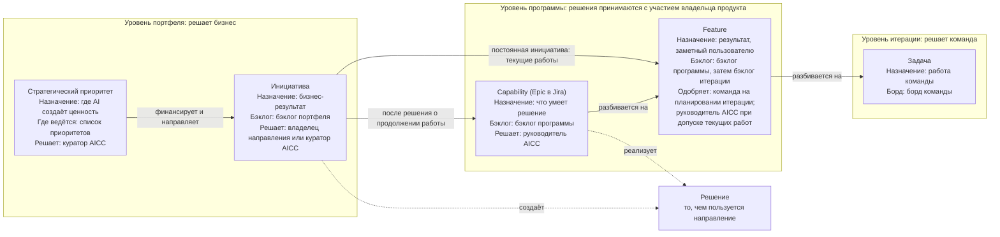

Рисунок 1 — Уровни работ: назначение и бэклоги.

3.3. Каждый уровень формулируется как краткая договорённость на языке бизнеса, чтобы заказчик, команда и владелец продукта одинаково понимали одни и те же слова. Инициатива и Capability формулируются как гипотеза, которую проверяет работа. Feature формулируется как гипотеза выгоды с критериями приёмки. Критерии приёмки записываются в форме «Дано — Когда — Тогда». В первой из следующих таблиц приведены части формулировки и их значение, во второй — формулировка каждого уровня, в третьей — пример.

| Часть | Значение | Вопрос, на который она отвечает |
| --- | --- | --- |
| Для кого | Заказчик или пользователь | Для кого это? |
| Потребность | Ситуация или задача, которую нужно решить | Какую проблему это решает? |
| Предложение | Что предлагается и к какому виду это относится | Что это? |
| Гипотеза ценности | Выгода, которую, как мы полагаем, это принесёт | Почему это важно? |
| Отличие | Чем это лучше нынешнего способа работы | Чем это лучше? |
| Опережающий индикатор | Ранний показатель с указанием источника, базового и целевого значений | Как на раннем этапе понять, что гипотеза подтверждается? |
| Объём | Наименьшая версия, на которой проверяется гипотеза, и то, что в неё не входит | Что пробуется в первую очередь? |
| Критерии приёмки | Дано: ситуация; когда: выполняется действие; тогда: наблюдаемый результат | Как проводится приёмка: Feature или Capability — владельцем продукта, решения — владельцем направления? |

| Уровень | Для кого | Потребность | Предложение | Гипотеза ценности | Отличие | Опережающий индикатор | Объём | Критерии приёмки |
| --- | --- | --- | --- | --- | --- | --- | --- | --- |
| Инициатива | Для [подразделения-заказчика], | которому требуется [потребность], | [инициатива] — это [тип решения], | которое обеспечивает [ценность] | В отличие от [нынешнего способа], наш вариант [отличие] | [Показатель, источник, базовое значение, целевое значение] | MVP: [наименьшая версия и то, что в неё не входит] | При рассмотрении результат соответствует опережающим индикаторам, и владелец направления, а для обеспечивающих работ — куратор AICC, принимает его |
| Capability | Для [пользователей решения], | которым требуется [потребность], | решение умеет [действие], | чтобы [выгода] | | [Показатель] | Features, которые её реализуют | Дано [ситуация]; когда [действие]; тогда [результат] — для Capability в целом |
| Feature | Для [пользователя] | | [Feature] | Мы полагаем, что она обеспечит [выгоду] | | [Показатель] | Не более одного PI | Дано [ситуация]; когда [действие]; тогда [наблюдаемый результат] |

Пример формулировки приведён в следующей таблице. Он показывает форму и учётной записью не является.

| Уровень | Формулировка |
| --- | --- |
| Инициатива | Для руководителей подразделений, которые каждый месяц тратят несколько дней на ручную подготовку регулярного отчёта, сервис «Отчётность» — это сервис, который готовит проект отчёта и публикует его. В отличие от ручной подготовки, наш сервис обеспечивает единообразие и занимает часы, а не дни. О результате мы узнаем по доле выпусков отчёта, опубликованных в срок |
| Capability | Для аналитиков, которые готовят отчёт, решение умеет собирать данные из соответствующих контролируемых источников, чтобы ни одно значение не переносилось вручную |
| Feature | Мы полагаем, что автоматический сбор первых трёх показателей избавит аналитиков от ручного копирования этих показателей. Дано: ежемесячный цикл, источники доступны; когда: выполняется сбор; тогда: три показателя появляются в проекте отчёта с указанием источника и даты |

3.4. На рисунке 2 показан value stream (сквозная последовательность действий, в ходе которой потребность превращается в ценный для клиента результат): от приёма работы до жизненного цикла решения.

```mermaid
flowchart LR
  IN(["Сверху<br/>Инициатива продолжается или заявлено изменение"]):::iface --> PB["Бэклог программы<br/>Capabilities и Features в порядке ранжирования"]
  PB --> RF["Уточнение бэклога<br/>Features готовы, критерии приёмки сформулированы"]
  RF --> IB["Бэклог итерации<br/>отбор на планировании итерации;<br/>допуск текущих работ на еженедельном обзоре"]
  IB --> DV["Разработка<br/>задачи команды"]
  DV --> VF["Стадия «Проверка»<br/>проверка или валидация"]
  VF --> DP["Развёртывание<br/>в среде использования"]
  DP --> AC["Приёмка Feature<br/>владельцем продукта"]
  AC --> TF["Окончательная приёмка командой<br/>руководитель AICC, до первых пользователей"]
  TF --> FU["Первые пользователи<br/>владелец направления оценивает решение и проводит его приёмку"]
  FU --> RL["Выпуск<br/>за пределы круга первых пользователей"]
  RL --> LC["Жизненный цикл<br/>эксплуатация, развитие, вывод из эксплуатации"]
  LC -.новые Capabilities и Features.-> PB
  AC -.возврат.-> IB
  FU -.возврат.-> IB
  classDef iface fill:#e8eefc,stroke:#5a6fa8,color:#111
```

Рисунок 2 — Value stream.

3.5. Работу выполняет команда: инженер решений вместе с экспертом направления, владельцем направления и владельцем продукта. Пока в команде не более трёх человек (п. 6.6), владельцем продукта команды является руководитель AICC; впоследствии руководитель AICC вправе назначить владельцем продукта другое лицо, указав его в реестре назначений. В AICC работает команда AICC; направление вправе иметь собственную команду. Руководитель AICC ранжирует бэклог программы, а владелец продукта упорядочивает бэклог итерации в пределах этого ранжирования. Команда принимает Features в разработку в этом порядке, решает, как их создавать, поддерживает бэклог итерации и борд команды в актуальном состоянии и проводит мероприятия итерации. Бизнес-ценность элемента определяет владелец направления как заказчик, а для обеспечивающих работ — куратор AICC; Features и Capabilities в ходе разработки принимает владелец продукта, а решение — владелец направления (п. 7.3). Команда сама распределяет между участниками дополнительные обязанности, необходимые для работы (п. 4.3 Операционной модели).

## 4. Бэклоги и борды

4.1. На этом уровне AICC ведёт два бэклога. Бэклог программы (его также называют бэклогом PI) содержит Capabilities и Features, сгруппированные по инициативам. В каждой Feature указывается родительская Capability, а для текущих работ — постоянная инициатива; для показателей потока (раздел 10) в ней фиксируются дата одобрения и дата приёмки или иного завершения. Бэклог итерации содержит Features, над которыми команды работают в итерации. Элементы бэклогов ранжируются по ценности и срочности в соотношении с трудоёмкостью; ценность, срочность, снижение риска или открываемая возможность и трудоёмкость оцениваются по шкале от 1 до 5. Руководитель AICC ранжирует бэклог программы, владелец направления, а для обеспечивающих работ — куратор AICC, определяет бизнес-ценность элемента, владелец продукта упорядочивает бэклог итерации. Бэклоги постоянно меняются, поскольку значительная часть работы зависит от людей и событий за пределами AICC. Capability может реализовываться в течение нескольких PI. Feature завершается в пределах своего PI либо разделяется: выполненная часть оформляется как Feature, которая передаётся на рассмотрение, оставшаяся часть — как новая Feature следующего PI, а исходная Feature переводится в состояние «Перенаправлено» со ссылками на обе новые Features. Элементы PI фиксируют намерения и направление работы, а что будет выполнено в итерации, решается в этой итерации.

4.2. Поток работ организован по методу канбан. Канбан программы показывает Capabilities и Features по состояниям; классы обслуживания «Срочно», «Высокий приоритет» и «Обычный приоритет» отображаются на нём дорожками. WIP-лимиты устанавливаются для состояний, дорожек и каждого направления. Команда принимает одобренный элемент в работу, только если это позволяют WIP-лимиты, а Feature одобряется, только если известны её зависимости. На каждом планировании итерации команда отбирает Features на месяц из бэклога программы в свой бэклог итерации. На еженедельном обзоре контролируется их выполнение и в пределах тех же WIP-лимитов допускаются Features текущих работ в соответствии с пунктом 5.2. Элемент, который ожидает действия лица или события за пределами AICC, находится в состоянии «Ожидание», и в нём указывается соответствующая зависимость. Когда WIP-лимит достигнут, команда завершает начатый элемент, прежде чем приступить к следующему. Элемент в состоянии «Ожидание» остаётся в своей колонке и отмечается флагом блокировки; дни ожидания учитываются. Колонки канбана программы соответствуют состояниям: «Бэклог» — «Предложено» и «Проработка», «Готово к работе» — «Одобрено», «В работе» — «В работе» и «Выполнено», «Рассмотрение» — «На рассмотрении», «Готово» — «Принято» и «Закрыто». Борд команды показывает задачи итерации.

Борды, их колонки, дорожки и лимиты, показатели, которые по ним отслеживаются, и мероприятия, на которых они рассматриваются, приведены в следующей таблице.

| Борд | Что показывает | Колонки | Отображаемые стадии | Дорожки | WIP-лимит | Показатели | Где рассматривается |
| --- | --- | --- | --- | --- | --- | --- | --- |
| Канбан портфеля | Инициативы | Воронка, Рассмотрение, Анализ, Бэклог портфеля, MVP, Реализация, Готово; состояния «Отложено», «Отклонено» и «Перенаправлено» находятся вне потока | Определение объёма, Бизнес-кейс, MVP, Реализация | Нет | Число инициатив в работе; устанавливает руководитель AICC | Время от предложения до одобрения, время от одобрения до приёмки, число инициатив в работе в сопоставлении с лимитом | Еженедельный обзор; ежемесячное управляющее совещание |
| Канбан программы | Capabilities и Features | Бэклог, Готово к работе, В работе, Рассмотрение, Готово; «Ожидание» — состояние, которое отображается на бордах флагом с указанием зависимости | Capability: Анализ, Реализация. Feature: Исследование, Проектирование, Разработка, Проверка, Развёртывание | Срочно, Высокий приоритет, Обычный приоритет | По состояниям, дорожкам и направлениям; устанавливает команда | Features, принятые в итерации; время выполнения от «Одобрено» до «Принято»; время цикла; элементы по дорожкам; элементы в состоянии «Ожидание» | Еженедельный обзор; ревью и демонстрация итерации |
| Борд программы | Capabilities и Features PI с их зависимостями и вехами (п. 4.3) | Итерация 1, Итерация 2, Итерация 3, неделя IP | Нет; в ячейке указывается запланированное или достигнутое состояние | Нет; по одной строке на каждую Feature и одна строка для вех | Нет | Зависимости, выполненные к установленной дате; зависимости и вехи под угрозой | PI-планирование; еженедельный обзор; обзор и демонстрация PI |
| Борд команды | Задачи итерации | Бэклог, Готово к работе, В работе, Рассмотрение, Готово | Стадии Feature | Нет | На одного работника; устанавливает команда | Закрытые задачи, препятствия | Планёрка; еженедельный обзор |

4.3. Борд программы — борд зависимостей PI. Для каждой Capability и Feature на нём указываются итерация, на которую запланирована работа, состояние элемента и то, что ему необходимо от других элементов, команд, подразделений и лиц. На борде также отмечаются вехи дорожной карты в тех итерациях, на которые они приходятся. Руководитель AICC формирует борд программы вместе с командами на PI-планировании и поддерживает его в актуальном состоянии на еженедельном обзоре. Зависимость имеет статус «Открыта», «Выполнена» или «Под угрозой». Веха получает статус «Под угрозой», если под угрозой находится необходимая для неё Feature или зависимость; всё, что находится под угрозой, выносится на ежемесячное управляющее совещание. На рисунке 3 показано, как борд программы, зависимости и вехи проходят через PI; форма борда программы приведена в следующей таблице.

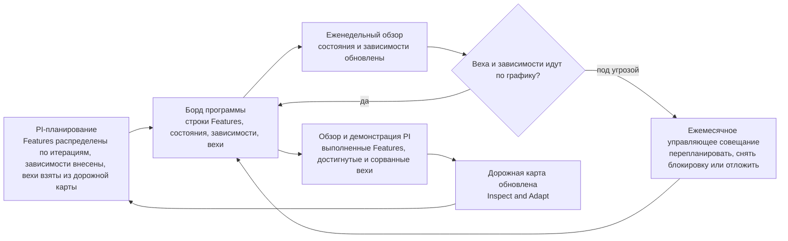

Рисунок 3 — Борд программы в течение PI.

| Строка: Feature | Родительский элемент: Capability или постоянная инициатива | Итерация 1 | Итерация 2 | Итерация 3 | Неделя IP | Зависит от | Статус зависимости |
| --- | --- | --- | --- | --- | --- | --- | --- |
| Веха | Дорожная карта | [Веха и дата] | | [Веха и дата] | | | |
| [Feature A] | [Capability X] | В работе | На рассмотрении | Готово | | Нет | |
| [Feature B] | [Capability X] | Одобрено | В работе | На рассмотрении | Готово | [Feature A] | Выполнена |
| [Feature C] | [Capability Y] | Ожидание | В работе | На рассмотрении | | [Подразделение, лицо или другая команда] | Под угрозой |
| [Feature D] | [Capability Y] | | Одобрено | В работе | На рассмотрении | [Feature C] | Открыта |

Таблица представляет собой форму и реальных данных не содержит. Каждая строка соответствует одной Feature; в ячейке указывается состояние, которого Feature планируется достичь в этой итерации или которого она уже достигла. В Feature, находящейся в состоянии «Ожидание», указывается её зависимость; зависимость со статусом «Под угрозой» выносится на ежемесячное управляющее совещание.

4.4. Дорожная карта охватывает три горизонта с вехами: текущий PI — как намерения и направление работы, следующий PI — как план, последующий период — как ориентир. Дорожная карта предлагается на PI-планировании и подтверждается на ежеквартальном управляющем совещании (п. 4.3 Модели управления портфелем). Панель показателей отражает состояние PI, поток работ на канбане программы, зависимости под угрозой, риски и показатели. Руководитель AICC поддерживает дорожную карту, борд программы и панель показателей в актуальном состоянии; все они являются учётными записями.

4.5. Feature считается готовой к работе (критерии готовности к работе, DoR), когда она одобрена в соответствии с пунктом 5.2: её критерии приёмки сформулированы в форме, установленной пунктом 3.3, зависимости известны, а каждая незакрытая зависимость названа. Feature считается завершённой (критерии завершённости, DoD), когда её результат протестирован лицом, не участвовавшим в её разработке, передан пользователю или развёрнут в среде использования и принят владельцем продукта (подпункт (a) пункта 7.3); только после этого Feature переходит в колонку «Готово». Feature, которая создаёт или изменяет решение, проходит проверку или валидацию в соответствии с пунктом 7.1; при развёртывании в промышленной среде номер заявки на изменение и ссылка на результаты тестирования вносятся в соответствии с пунктом 8.3. Если результатом работы является, например, документ или обучение, Feature содержит ссылку на переданный результат и подтверждающие материалы о выполнении критериев приёмки. Команда обязана за счёт уточнения бэклога поддерживать запас готовых к работе Features на одну-две итерации вперёд.

## 5. Состояния и стадии

5.1. Каждая инициатива, каждое решение, каждая Capability и каждая Feature находятся в одном из состояний, установленных документом «Терминология и стиль». Стратегический приоритет находится в состоянии «Предложено», «В работе», «Закрыто» или «Отменено» по решению куратора AICC. Элемент переходит из одного состояния в другое в порядке, установленном следующей таблицей. Переходы между состояниями устанавливаются только этой таблицей.

| Из состояния | В состояние | Условие перехода |
| --- | --- | --- |
| Предложено | Проработка | Руководитель AICC принимает элемент в проработку: инициативы, решения и Capabilities, а Features — на уточнении бэклога |
| Предложено | Отклонено или Отложено | При первичном разборе по элементу принято отрицательное решение либо элемент отложен |
| Предложено | Отменено | Элемент отозван без решения по существу |
| Проработка | Одобрено | Выполнены условия соответствующего уровня, установленные пунктом 5.2, и уполномоченное лицо одобрило элемент |
| Проработка | Ожидание, Отложено, Отклонено, Перенаправлено или Отменено | Элемент заблокирован зависимостью; элемент отложен; по нему принято отрицательное решение; он преобразован в новый элемент; либо он отозван без решения по существу |
| Одобрено | В работе | Команда принимает элемент в работу, если это позволяют WIP-лимиты и известны его зависимости. Инициатива переходит в состояние «В работе», когда руководитель AICC принимает её в работу для MVP (п. 5.2 Модели управления портфелем); постоянная инициатива — когда в работу принята её первая одобренная Feature текущих работ. Решение переходит в состояние «В работе», когда в работу принята его первая Capability или Feature |
| Одобрено | Ожидание, Отложено, Перенаправлено или Отменено | Как при переходе из состояния «Проработка» |
| В работе | Выполнено | Работа выполнена |
| В работе | Ожидание, Отложено, Перенаправлено или Отменено | Как при переходе из состояния «Проработка» |
| В работе | Отклонено | Только для инициативы по завершении её MVP: ценность не подтвердилась (п. 7.2 Модели управления портфелем) |
| В работе | Закрыто | Только для решения: оно выведено из эксплуатации, передано или прекращено в соответствии с пунктом 8.1 |
| В работе | Проработка | Только для решения: изменение повышает его категорию риска либо по итогам проверки или валидации установлено, что требуется новая проверка, как предусмотрено Политикой применения AI |
| Ожидание | Состояние, из которого элемент перешёл в «Ожидание» | Зависимость устранена |
| Ожидание | Отложено или Отменено | Зависимость не будет устранена либо элемент отозван без решения по существу |
| Отложено | Предложено | Рассмотрение элемента возобновлено; ответственный за элемент вправе вернуть его в состояние, из которого он был отложен |
| Отложено | Отклонено или Отменено | По элементу, который ни разу не был одобрен, принято отрицательное решение либо элемент отозван без решения по существу |
| Выполнено | На рассмотрении | Владелец продукта оценивает Feature или Capability по критериям приёмки; результат инициативы по её критериям оценивает владелец направления, а для обеспечивающих работ — куратор AICC (п. 7.3) |
| На рассмотрении | В работе, Принято или Отклонено | Элемент возвращён на доработку с перечнем замечаний; его критерии выполнены; либо его результат не нужен |
| На рассмотрении | Отменено | Элемент отозван без решения по существу |
| Принято | Закрыто | Работа по элементу завершена |

5.2. Под стадией понимается фаза работы внутри состояния «Проработка» или «В работе». Стадии инициативы установлены пунктом 5.2 Модели управления портфелем. Стадии, лицо, которое одобряет элемент, и условия одобрения для каждого уровня приведены в следующей таблице. Руководитель AICC подтверждает выполнение условий и делает об этом отметку в бэклоге соответствующего уровня, а для решения — в портфеле.

| Уровень | Стадии проработки | Кто одобряет и при каких условиях | Стадии в работе | Условие завершения |
| --- | --- | --- | --- | --- |
| Решение | Определение | Владелец направления одобряет описание решения с указанием типа решения, получателя, объёма, функций, архитектуры и классов данных. Категорию риска присваивает руководитель AICC и сообщает её владельцу направления; вносится запись в реестр AI-решений; для категорий риска 2 и 3 представитель контрольной функции по комплаенсу определяет требования законодательства, применимые к решению; для эксперимента установлен тайм-бокс, для сервиса — эксплуатационные затраты и правило вывода из эксплуатации; для решения, созданного руководителем AICC, описание решения одобряет и категорию риска присваивает куратор AICC (п. 4.4 Операционной модели) | Разработка, затем стадии соответствующего типа (п. 8.1) | Разработка и внедрение решения завершены в соответствии с пунктом 8.1 |
| Capability | Анализ: определение Capability и её разбиение на Features | Руководитель AICC после консультации с владельцем направления. Features этой Capability определены и ранжированы в бэклоге программы | Реализация | Все её Features закрыты |
| Feature | Исследование, Проектирование | Команда на планировании итерации; для текущих работ — руководитель AICC на еженедельном обзоре в соответствии с пунктом 4.8 Бизнес-модели и пунктом 3.1. Критерии приёмки сформулированы, зависимости известны, каждая незакрытая зависимость названа. Feature текущих работ добавляется в текущий бэклог итерации в пределах WIP-лимитов | Разработка, Проверка, Развёртывание | Результат протестирован и передан, а в необходимых случаях проведена проверка или валидация. Затем, до перехода в колонку «Готово», владелец продукта проводит приёмку в состоянии «На рассмотрении» (п. 4.5) |

На рисунке 4 слева направо показан порядок прохождения стадий на каждом уровне: стадии — в прямоугольниках, условия перехода к следующему шагу — в ромбах, а также возвраты. Каждое условие соответствует условию таблицы стадий; в системе учёта задач оно настраивается как условие workflow, стадия хранится в отдельном поле, а состояние — в статусе.

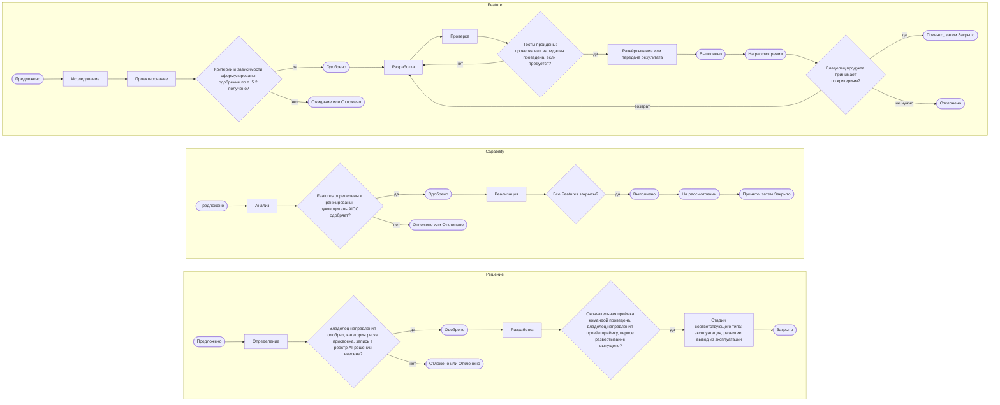

Рисунок 4 — Порядок прохождения стадий для Feature, Capability и решения.

5.3. Под состоянием «Отклонено» понимается отрицательное решение по существу, принятое потому, что ценность не подтверждена, — до одобрения или после MVP инициативы, а также когда рассматриваемый результат не нужен. Под состоянием «Отменено» понимается отзыв элемента без решения по существу, например из-за ошибки, недоразумения или дублирования; это состояние применяется к элементу в любом состоянии от «Предложено» до «На рассмотрении», кроме «Выполнено». Приостановление применения решения отмечается флагом и состояние решения не меняет. Остановка решения контрольной функцией окончательна и переводит решение в состояние «Отменено». Вывод из эксплуатации закрывает решение без приёмки. Лицо, которое одобряет элемент на его уровне, также откладывает, отклоняет, отменяет или перенаправляет его.

## 6. Рабочий цикл

6.1. Работа планируется и ведётся по PI. PI равен одному кварталу и состоит из трёх итераций. Итерация — один календарный месяц из четырёх или пяти полных недель. Последняя неделя третьей итерации PI является неделей инноваций и планирования (далее — неделя IP); при этом календарь может установить её на более раннюю неделю, чтобы оставить последнюю неделю года свободной от мероприятий, — например, в итерации I12 из пяти недель, последняя из которых приходится на конец года. PI обозначаются PIQ1–PIQ4 с указанием года, итерации — I01–I12, недели итерации — W1–W5. Календарь содержит даты на весь год с нерабочими днями и днями ограниченной доступности, а workflow «Рабочий цикл» описывает общий порядок мероприятий по неделям без дат и используется как шаблон календаря мероприятий с датами. Работа ведётся в четырёх циклах. Каждый цикл начинается с планирования и завершается обзором, получает рамки от вышестоящего цикла и возвращает ему подтверждающие данные. Циклы приведены в следующей таблице.

| Цикл | Периодичность | Мероприятия | Участники | Кто принимает решения | Учётные записи |
| --- | --- | --- | --- | --- | --- |
| Программный инкремент | Ежеквартально | PI-планирование, обзор и демонстрация PI, Inspect and Adapt, инновации | Команды, владельцы направлений инициатив в работе, владелец продукта и руководитель AICC; для обеспечивающих работ — куратор AICC | Команды и владельцы направлений — по намерениям; куратор AICC подтверждает дорожную карту | Цели PI с оценками, дорожная карта, борд программы, квартальный отчёт |
| Итерация | Ежемесячно | Планирование итерации, ревью и демонстрация итерации, ретроспектива итерации, уточнение бэклога | Команда и её владелец продукта; на ревью и демонстрации итерации — также владелец направления каждого действующего решения, а для сервиса, охватывающего несколько направлений, — куратор AICC | Команда; Features и Capabilities принимает владелец продукта | Бэклог итерации, записи о приёмке, замечания по итогам рассмотрения действующих решений |
| Неделя | Еженедельно | Еженедельное планирование, еженедельный обзор | Руководитель AICC и инженеры решений | Руководитель AICC | Панель показателей, борд программы |
| День | Ежедневно | Планёрка | Команда | Команда | Задачи |

6.2. Цикл PI — квартальный цикл. На PI-планировании определяются намерения и направление работы на PI: цели PI, Features, на которые нацелен PI, борд программы и предлагаемая дорожная карта. Работа выполняется в трёх итерациях. На PI-планировании владелец направления, а для обеспечивающих работ — куратор AICC, оценивает запланированную бизнес-ценность каждой цели PI по шкале от 1 до 10, а команда оценивает свою уверенность по шкале от 1 до 5. На обзоре и демонстрации PI показывается результат PI, и то же лицо оценивает достигнутую бизнес-ценность каждой цели PI. На мероприятии Inspect and Adapt решаются основные проблемы PI, а улучшения вносятся в бэклог программы как Features; инновации дают время на обучение, эксперименты и устранение того, что осталось незавершённым после PI. На неделе IP последовательно проводятся обзор и демонстрация PI, Inspect and Adapt, инновации и PI-планирование; на ежеквартальном управляющем совещании, которым завершается неделя, подтверждаются цели PI и дорожная карта, предложенные на PI-планировании. На ежеквартальном управляющем совещании, завершающем неделю IP в PIQ4, решаются те же вопросы, но из циклов управления на нём выполняются только цикл подтверждения надлежащего функционирования и обзор портфеля, поскольку рамки следующего года уже установлены на ежегодном управляющем совещании в декабре. Входные данные цикла — дорожная карта, приоритеты по итогам обзора портфеля и направление, определённое на ежегодном управляющем совещании. Цели PI и борд программы передаются в цикл итерации, а оценки ценности и данные для квартального отчёта — на ежеквартальное управляющее совещание.

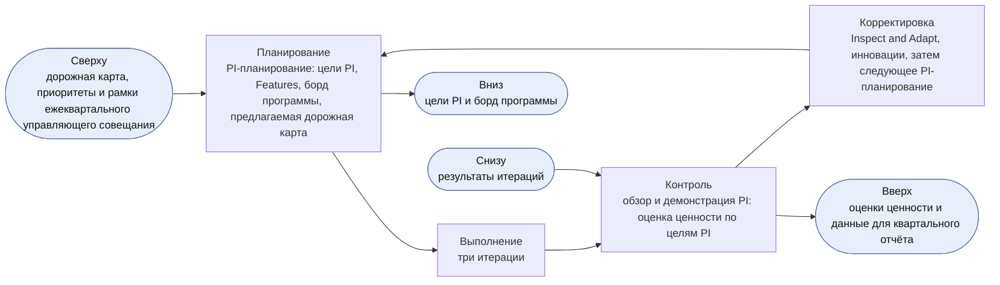

Рисунок 5 — Цикл PI.

6.3. Цикл итерации — месячный цикл. На планировании итерации на основе целей PI в бэклог итерации отбираются Features на месяц и устанавливается цель итерации. Работа выполняется по неделям. На ревью и демонстрации итерации владельцу продукта показывают работающие Features и решения в сопоставлении с их записанными критериями приёмки и проводится приёмка Features и Capabilities. На ретроспективе итерации команда анализирует свой способ работы и определяет одно-два улучшения, которые оформляет как задачи или Features. На уточнении бэклога, которое проводится в ходе еженедельных встреч, поддерживается готовность следующих элементов (п. 4.5). Последняя неделя итерации является её неделей обзора; исключение — третья итерация PI, обзор которой проводится на неделе IP. Входные данные цикла — цели PI и борд программы; записи о приёмке и результаты передаются в цикл PI и на ежемесячное управляющее совещание.

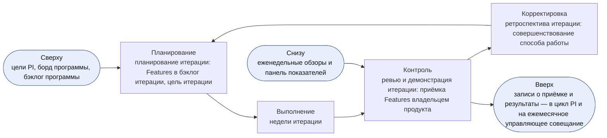

Рисунок 6 — Цикл итерации.

6.4. Недельный и дневной циклы — циклы выполнения работы. На еженедельном планировании определяются приоритеты недели и рассматривается состояние зависимостей. На еженедельном обзоре контролируется поток работ: рассматриваются канбан программы, WIP-лимиты и зависимости. Руководитель AICC переупорядочивает бэклог программы и поддерживает панель показателей в актуальном состоянии. На планёрке команда сообщает о ходе работы и устраняет препятствия. Входные данные цикла — бэклог итерации и цель итерации; панель показателей и незакрытые зависимости передаются в цикл итерации.

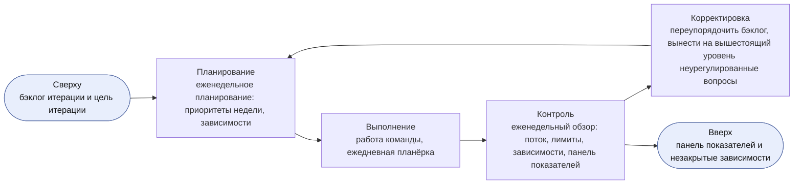

Рисунок 7 — Недельный цикл.

6.5. Мероприятие, которое приходится на нерабочий день или день ограниченной доступности, переносится на предшествующий рабочий день; перенос на более поздний день не допускается. Если перенесённые мероприятия совпадают по дню, в этот день проводится более крупное мероприятие, а менее крупное переносится на предшествующий рабочий день. Инновации проводятся по усмотрению и при сокращении числа рабочих дней исключаются в первую очередь. Пропущенное мероприятие позднее не проводится; его задачи решаются на следующем мероприятии. Еженедельный обзор допускается проводить в письменной форме.

6.6. Пока в команде AICC не более трёх человек, AICC работает в облегчённом режиме. Еженедельное планирование и еженедельный обзор проводятся как одна встреча в день еженедельного планирования. Ретроспектива итерации и ежемесячное управляющее совещание проводятся в рамках ревью и демонстрации итерации, а Inspect and Adapt — в рамках обзора и демонстрации PI. Планёрка, уточнение бэклога и инновации проводятся по усмотрению. В облегчённом режиме «Ожидание» остаётся состоянием, которое отображается на бордах флагом; состояние «Выполнено» пропускается, и элемент переходит из состояния «В работе» непосредственно в состояние «На рассмотрении»; «Принято» и «Закрыто» объединяются в один шаг с фиксацией приёмки; стадии применяются только к инициативам и решениям; задачи не учитываются. Владельцем продукта команды является руководитель AICC (пп. 3.5, 7.3). Остальные положения применяются без изменений.

6.7. Циклы настоящей Модели проводятся на тех же мероприятиях, на которых проводятся циклы управления, установленные разделом 6 Операционной модели, и портфельные циклы, установленные разделом 4 Модели управления портфелем; дополнительные совещания не вводятся. На еженедельном обзоре выполняются операционный цикл и цикл ведения бэклога; на ежемесячном управляющем совещании рассматриваются результаты ревью и демонстрации итерации, на ежеквартальном — результаты обзора и демонстрации PI. В месяце, на который приходится неделя IP, ежеквартальное управляющее совещание, завершающее неделю IP, одновременно является управляющим совещанием этого месяца, и на нём выполняется ежемесячный цикл контроля. Исключение составляет декабрь: ежемесячное управляющее совещание декабря проводится в первые две недели месяца как ежегодное управляющее совещание (п. 6.5 Операционной модели), а на ежеквартальном управляющем совещании, завершающем неделю IP, выполняются только цикл подтверждения надлежащего функционирования и обзор портфеля.

6.8. У каждого мероприятия одно назначение, определённый состав участников, входные данные, результат и учётная запись — как установлено для его цикла таблицей пункта 6.1 и показано для каждого мероприятия в workflow «Рабочий цикл». Руководитель AICC не вправе проводить иные мероприятия по созданию и внедрению решений.

6.9. Внутри циклов, установленных пунктом 6.1, сама работа идёт по трём циклам, а подтверждающие данные возвращаются по четырём циклам обратной связи. Эти циклы приведены в следующей таблице; дополнительных мероприятий они не вводят.

| Цикл | Вид | Содержание | Где выполняется | Результат |
| --- | --- | --- | --- | --- |
| Исследование | Работа | Исследование потребности и проектирование Feature до её готовности к работе (п. 4.5) | Стадии «Исследование» и «Проектирование», на уточнении бэклога | Готовые к работе Features |
| Создание | Работа | Разработка, интеграция и тестирование Feature, проверка или валидация решения (п. 7.1) | Стадии «Разработка» и «Проверка», в течение недель итерации | Features, прошедшие стадию «Проверка» |
| Выпуск | Работа | Развёртывание Feature, приёмка и выпуск решения за пределы круга первых пользователей (пп. 7.3, 7.4) | Стадия «Развёртывание» и состояние «На рассмотрении», на ревью и демонстрации итерации и при выпуске | Принятые Features и выпущенные решения |
| Демонстрация | Обратная связь | Показ работающего программного обеспечения в сопоставлении с записанными критериями приёмки | Ревью и демонстрация итерации; обзор и демонстрация PI | Записи о приёмке и возвращённые элементы |
| Ретроспектива | Обратная связь | Совершенствование способа работы | Ретроспектива итерации; Inspect and Adapt | Улучшения в виде задач или Features |
| Рассмотрение действующих решений | Обратная связь | Рассмотрение четырёх сигналов каждого действующего решения (п. 8.4) | Ревью и демонстрация итерации; ежеквартальное управляющее совещание | Исправления, изменения, переходы и выводы из эксплуатации |
| Показатели | Обратная связь | Отслеживание потока, качества, состояния действующих решений и ценности (раздел 10) | От еженедельного обзора до ежеквартального управляющего совещания | Проблемы для ретроспективы итерации или Inspect and Adapt |

## 7. Проверка, выпуск и приёмка

На рисунке 8 показано, как Feature проходит проверку, развёртывается и принимается владельцем продукта и как решение до выпуска за пределы круга первых пользователей проходит окончательную приёмку командой и оценку владельцем направления.

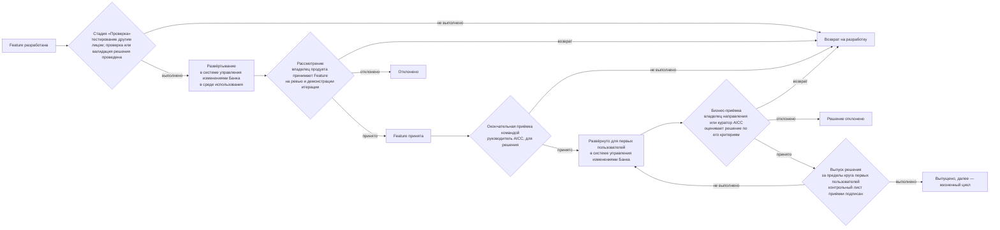

Рисунок 8 — Проверка, развёртывание, три уровня приёмки и выпуск.

7.1. Каждая Feature, а также MVP инициативы до развёртывания тестируются вне промышленной среды лицом, не участвовавшим в их разработке; ссылка на результат тестирования вносится в Feature. Команда интегрирует результаты работы по мере их получения; Feature, не прошедшая тестирование, возвращается разработчику в тот же день. Под средой использования понимается среда, в которой Feature работает для своих пользователей: до развёртывания решения для первых пользователей она не является промышленной средой, а после него становится ею. Проверка для категории риска 1 и валидация представителями контрольных функций для категорий риска 2 и 3 проводятся в отношении решения в целом. Они проводятся на стадии «Проверка» первой Feature, которая затрагивает реальных пользователей или реальные данные, и распространяются на последующие Features, если только изменение не требует новой проверки или валидации. Необходимость новой проверки или валидации определяет руководитель AICC; он указывает её с обоснованием в описании решения. До проведения проверки или валидации развёртывание для реальных пользователей или на реальных данных не допускается.

Развёртывание в промышленной среде выполняется в соответствии с пунктом 8.3; доступ инженера решений к промышленной среде предоставляется в порядке, установленном Банком. Под первыми пользователями понимаются пользователи, которых владелец направления указывает в описании решения для оценки решения (п. 7.3); до начала применения решения они проходят обучение (п. 2.1 Политики применения AI). Окончательная приёмка командой (п. 7.3) проводится до первого развёртывания решения для первых пользователей и до развёртывания каждого существенного изменения (п. 8.6). О выпуске решения за пределы круга первых пользователей решает владелец направления — для категорий риска 1 и 2 (куратор AICC, если владельцем направления является руководитель AICC, — подпункт (d) пункта 4.4 Операционной модели) и куратор AICC — для категории риска 3. Выпуск возможен только после проверки или валидации и приёмки решения (п. 7.3) и фиксируется в разделе о выпуске описания решения. Каждый выпуск за пределы круга первых пользователей оформляется контрольным листом приёмки (п. 7.4) — для сервиса и продукта так же, как для любого решения, которое AICC передаёт направлению.

7.2. Представители контрольных функций, указанные в настоящей Модели и Политике применения AI, участвуют в определении решения категории риска 2 или 3 и в его валидации. Валидация включает тестирование защищённости от атак на AI (п. 3.3 Политики применения AI) и опирается на подтверждающие материалы, журналы и трассировки, которые хранит владелец платформы.

7.3. Приёмкой завершается работа над элементом. Приёмка проводится на трёх уровнях; на каждом из них — по критериям приёмки и с фиксацией того, кто и когда её провёл.

(a) В ходе разработки владелец продукта на ревью и демонстрации итерации принимает каждую Feature и каждую Capability по их критериям приёмки. Владелец продукта вправе принять элемент, вернуть его на доработку с перечнем замечаний или отклонить, если его результат не нужен; руководитель AICC отмечает приёмку в бэклоге соответствующего уровня. Пока в команде не более трёх человек (п. 6.6), владельцем продукта команды является руководитель AICC; впоследствии руководитель AICC вправе назначить владельцем продукта другое лицо, указав его в реестре назначений.

(b) До того как решение — работающий прототип или окончательная версия — предоставляется владельцу направления для оценки и развёртывается, руководитель AICC проводит окончательную приёмку от имени команды. Руководитель AICC подтверждает, что решение соответствует критериям приёмки, указанным в описании решения, что ссылки на результаты тестирования внесены (п. 7.1) и что проверка или валидация проведена, и фиксирует в разделе о выпуске описания решения, кто провёл приёмку и когда. Окончательная приёмка командой проводится до первого развёртывания решения для первых пользователей и до развёртывания каждого существенного изменения (п. 8.6).

(c) Заказчик оценивает работающее решение, развёрнутое для первых пользователей, по критериям приёмки, указанным в описании решения, и принимает его, возвращает на доработку с перечнем замечаний или отклоняет, если его результат не нужен. Заказчиком является владелец направления — для решения направления и куратор AICC — для элемента, который охватывает несколько направлений, относится к обеспечивающим работам AICC или является экспериментом без направления. Это управленческое решение означает приёмку решения, а для взаимодействия с заказчиком — также приёмку отчёта о результатах, в котором оно фиксируется; управленческое решение вносится в раздел о выпуске описания решения с указанием, кто и когда его принял. Выпуск за пределы круга первых пользователей оформляется отдельным управленческим решением (пп. 7.1, 7.4).

(d) Руководитель AICC вправе проводить приёмку, предусмотренную подпунктами (a) и (b), в отношении решения, которое он создал сам, но не вправе проводить в отношении такого решения приёмку, предусмотренную подпунктом (c), его проверку или валидацию, а также выпускать его (подпункт (d) пункта 4.4 Операционной модели). Это принятое ограничение на период малой численности команды; оно фиксируется в реестре рисков и проблем. Его компенсируют следующие меры контроля: тестирование лицом, не участвовавшим в разработке (п. 7.1), проверка или валидация другим лицом, приёмка владельцем направления, управленческое решение о выпуске и ежемесячный выборочный контроль управленческих решений руководителя AICC, который проводит куратор AICC.

7.4. Когда AICC передаёт решение направлению как готовое к масштабному применению, до выпуска решения за пределы круга первых пользователей руководитель AICC заполняет контрольный лист приёмки решения. В контрольном листе для каждой участвующей стороны указываются пункты, которые она подтверждает в пределах своей компетенции и подписывает: владелец направления, инженер решений, руководитель AICC, проверяющий, контрольные функции (по модельному риску, комплаенсу, информационной безопасности, защите данных и правовым вопросам) и IT-функция, которая эксплуатирует решение совместно с владельцем платформы. Для категории риска 1 контрольный лист подписывают владелец направления, инженер решений и проверяющий, а для категорий риска 2 и 3 — также контрольные функции по каждой затронутой области компетенции и IT-функция (п. 3.3 Политики применения AI). При наличии невыполненного пункта выпуск не допускается. Владелец направления, который провёл приёмку решения (подпункт (c) пункта 7.3), получает подписанный контрольный лист. Решение категории риска 1 или 2 направление внедряет на собственный риск в пределах Заявления о риск-аппетите в отношении AI. Решение категории риска 3, отличающееся высоким воздействием и риском, внедряется только при наличии подписи куратора AICC, который принимает риск и выпускает решение. Контрольный лист приёмки не применяется в ходе разработки и испытаний, на которые распространяется пункт 7.1; при изменении после выпуска, требующем новой проверки или валидации, оформляется новый контрольный лист. Контрольный лист не является самостоятельным одобрением: управленческие решения принимаются в порядке, установленном Политикой применения AI и настоящей Моделью.

7.5. Лицо, которое создаёт Feature или решение, не вправе проводить его тестирование, проверку или валидацию. Заказчик, проводящий бизнес-приёмку решения, не является работником AICC; лицо, выпускающее решение, отвечает за его результаты. Единственное принятое ограничение этих требований к разграничению обязанностей установлено подпунктом (d) пункта 7.3.

## 8. Управление жизненным циклом

8.1. Каждое решение относится к одному варианту решения, который определяет его жизнь на этапе пост-внедрения. Разработка и внедрение решения считаются завершёнными, когда выпущено его первое развёртывание. Инициатива завершена, когда её решения внедрены и её результат рассмотрен; сервис и продукт продолжают существовать в соответствии со своим типом. Решение находится в состоянии «В работе» с начала разработки до конца своей жизни и переходит в состояние «Закрыто», когда оно выведено из эксплуатации, передано или прекращено. Получатель указывается в описании решения до одобрения решения; для эксперимента допускается указание «пока нет, будет запрошен». Типы решений приведены в следующей таблице.

| Тип | Владелец на этапе пост-внедрения | Стадии пост-внедрения | Завершение |
| --- | --- | --- | --- |
| Сервис | AICC на протяжении всего жизненного цикла; в бизнес-кейсе сервиса указываются эксплуатационные затраты и правило вывода из эксплуатации. Сервис принимает и рассматривает владелец обслуживаемого направления, а для сервиса, охватывающего несколько направлений, — куратор AICC | Эксплуатация, Развитие, Вывод из эксплуатации; уточняются шагами обслуживания (п. 8.8). Новые функции добавляются как Capabilities и Features | Вывод из эксплуатации, передача IT-функции Банка (п. 8.11) или отмена |
| Продукт | Поставленной версией владеет потребитель; AICC оказывает поддержку по запросу | Передача, Поддержка, Пересмотр (новая версия проходит через бэклог портфеля), Вывод из эксплуатации у данного потребителя. Если у продукта появляется второй потребитель или повторяющиеся запросы, на его основе создаётся сервис (п. 8.12) | Вывод из эксплуатации у данного потребителя |
| Эксперимент | Пока нет: эксперимент ограничен тайм-боксом из установленного числа итераций и завершается предложением. Если у эксперимента нет направления, его принимает куратор AICC, в противном случае — владелец направления | Испытание, Предложение, Передача | По истечении тайм-бокса эксперимент выносится на рассмотрение: он принимается с выводами по его итогам и закрывается, по нему готовится предложение либо он отклоняется. Когда получатель принимает передачу, эксперимент закрывается, а AICC контролирует внедрённое решение |

Фазы взаимодействия с заказчиком соотносятся с элементами работы следующим образом: изучение — проработка инициативы; подтверждение осуществимости — эксперимент или первые Features решения; разработка — состояние «В работе» Capabilities и Features; поддержка — жизнь решения на этапе пост-внедрения.

На рисунке 9 показана жизнь решения каждого типа: последовательность стадий и варианты завершения.

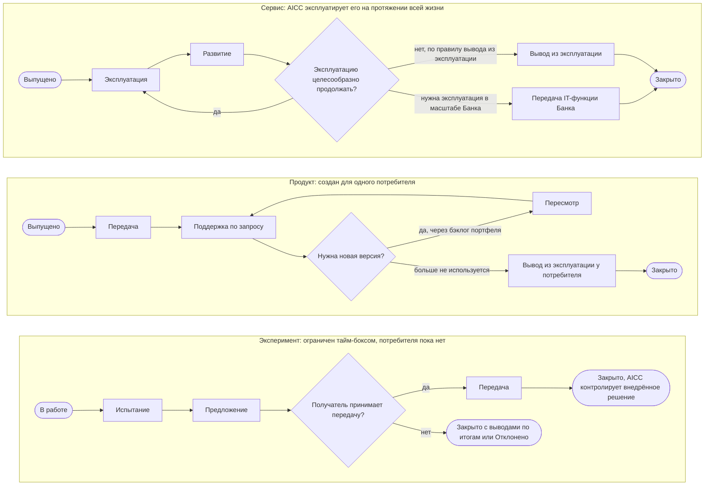

Рисунок 9 — Жизнь решения в зависимости от типа.

8.2. AICC контролирует внедрённые решения, которые внедряют другие участники, и отчитывается по ним. Внедрённое решение ведётся в портфеле в форме описания решения с отметкой «Внедрённое решение», в котором владельцем указан получатель. Описание создаётся, когда другие участники начинают внедрять решение, предложенное AICC или находящееся под его контролем. Для внедрённого решения применяются состояния «Предложено», «Одобрено», «В работе», «Закрыто», «Отклонено» и «Отменено»; категория риска указывается, когда она становится известна. Предложение о внедрении решения утверждают или отклоняют его владельцы и куратор AICC, а предложение о стратегии внедрения AI — Банк. Стратегия внедрения AI складывается из серии предложений, которые AICC формирует на основе накопленного опыта; ежегодное предложение готовит руководитель AICC, а представляет куратор AICC (п. 6.5 Операционной модели). Руководитель AICC рассматривает внедрённые решения на каждом ежеквартальном управляющем совещании; результаты рассмотрения отражаются в квартальном отчёте (C-20). Кроме того, руководитель AICC ежеквартально сверяет реестр AI-решений с фактическими случаями применения AI в Банке; результат сверки отражается в квартальном отчёте.

### Развёртывание

8.3. Feature развёртывается в среде использования после тестирования и проверки или валидации (п. 7.1). Развёртывание решения для первых пользователей и развёртывание каждого существенного изменения (п. 8.6) выполняются после окончательной приёмки командой (подпункт (b) пункта 7.3). Развёртывание в промышленной среде выполняется в порядке, установленном системой управления изменениями Банка. Инженер решений регистрирует change request в системе управления изменениями Банка, вносит в Feature номер заявки на изменение и результат тестирования и выполняет развёртывание с доступом, предоставленным в порядке, установленном Банком. При первом развёртывании решения номер заявки на изменение и ссылка на результаты тестирования также вносятся в раздел о выпуске описания решения. Регистрацию событий и мониторинг обеспечивает владелец платформы (п. 3.5 Политики применения AI). Если развёртывание завершилось неудачно или причинило вред, выполняется откат в порядке, установленном системой управления изменениями Банка, а событие обрабатывается как инцидент. Развёртывание решения для первых пользователей является его первым развёртыванием в промышленной среде и делает Feature доступной для них; о выпуске за пределы их круга решают в соответствии с пунктом 7.4. Порядок развёртывания показан на рисунке 10.

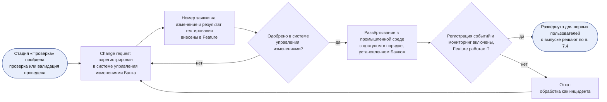

Рисунок 10 — Развёртывание Feature.

### Эксплуатация

8.4. Решение эксплуатирует IT-функция, которая за это отвечает (п. 5.3 Политики применения AI). Для сервиса, который эксплуатирует AICC, роль такой IT-функции выполняет инженер решений. Эксплуатация организована как цикл. На этапе планирования при выпуске устанавливаются уровень поддержки по соглашению о взаимодействии и мониторинг. На этапе выполнения решение эксплуатируется, обрабатываются запросы и инциденты. На этапе контроля владелец направления, а для сервиса, охватывающего несколько направлений, — куратор AICC на каждом ревью и демонстрации итерации рассматривает четыре сигнала решения — уровни обслуживания, инциденты, включая инциденты AI, использование и затраты, — а также уведомления поставщиков решения. Проводивший рассмотрение отмечает его в описании решения. Руководитель AICC переносит результаты рассмотрения в квартальный отчёт, а для сервиса они сопоставляются с правилом вывода из эксплуатации (п. 8.11). На этапе корректировки решение исправляют, изменяют (п. 8.6) или выводят из эксплуатации (п. 8.7). Входные данные цикла — уровень поддержки и выпуск; результаты рассмотрения передаются в цикл итерации, а инцидент AI — в событийный цикл (раздел 6 Операционной модели). Каждое изменение сервиса, эксплуатируемого AICC, в промышленной среде одобряется в системе управления изменениями Банка; независимый контроль обеспечивают мониторинг владельца платформы и рассмотрение владельцем направления. Резервное копирование и восстановление обеспечиваются средствами платформы AI и Банка и указываются в описании решения.

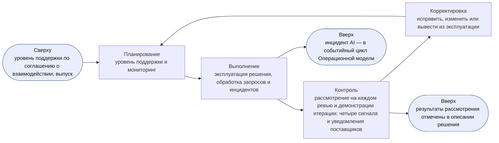

Рисунок 11 — Операционный цикл действующего решения.

8.5. Запросы и инциденты, связанные с решением, поступают в очередь AICC в системе Service Management; целевые сроки реакции, установленные соглашением о взаимодействии, являются целевыми значениями, а не гарантиями. Запрос сортируется по классу обслуживания, обрабатывается и закрывается. Сортировку выполняет инженер решений; в спорных случаях класс обслуживания определяет руководитель AICC. Если соглашение о взаимодействии не предусматривает иного, класс «Срочно» означает, что решение недоступно или что неверный результат доходит до людей, и реакция требуется в тот же день; «Высокий приоритет» означает, что работа потребителя заблокирована, а у него есть срок, и реакция требуется в течение недели; «Обычный приоритет» — все остальные запросы. Каждый перебой в работе или отказ решения регистрируется в системе управления инцидентами Банка; инцидент AI обрабатывается там же, и руководитель AICC участвует в его обработке как заинтересованное лицо (раздел 5 Политики применения AI). Запрос на новую функцию поступает в бэклог программы. Продукт поддерживается по запросу, а сервис — в пределах согласованных целевых сроков реакции. Порядок обработки показан на рисунке 12.

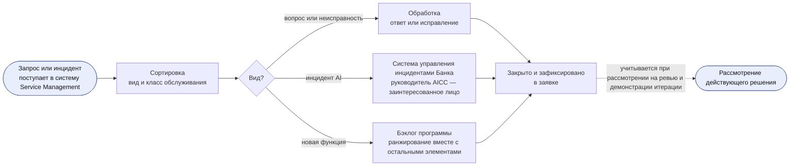

Рисунок 12 — Поддержка действующего решения.

### Изменение и вывод из эксплуатации

8.6. Изменение выпущенного решения оформляется как Feature; оно проходит проверку и развёртывается так же, как любая Feature. Существенным считается изменение модели, поставщика, класса данных, степени автономности или любого фактора риска, определяющего категорию риска. Руководитель AICC определяет, требует ли изменение новой проверки или валидации, и вносит это управленческое решение в журнал решений. Существенное изменение выпускается в порядке, установленном пунктом 7.1, — владельцем направления, а для категории риска 3 — куратором AICC; любое другое изменение принимается как Feature. Экстренное изменение вносится по экстренной процедуре системы управления изменениями Банка (п. 8.3); со стороны AICC его разрешает руководитель AICC. Куратор AICC рассматривает экстренное изменение не позднее пяти рабочих дней с даты его внесения; изменение вносится в журнал решений, а для категории риска 3 о нём информируются представители контрольных функций. Изменение поставщиком своих условий или модели является изменением в смысле настоящего пункта. Цикл изменения показан на рисунке 13.

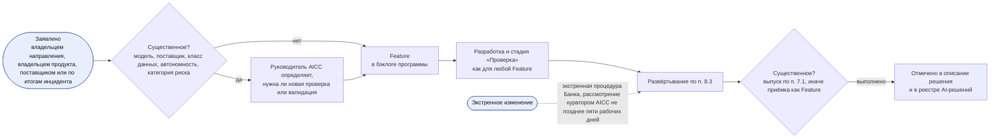

Рисунок 13 — Цикл изменения выпущенного решения.

8.7. До перевода решения в состояние «Закрыто» в связи с выводом из эксплуатации инженер решений отзывает права доступа и блокирует учётные записи пользователей, данные и журналы сохраняются или удаляются в соответствии с правилами хранения Банка, а запись в реестре AI-решений отмечается как выведенная из эксплуатации. Вывод из эксплуатации одобряет владелец направления, а для сервиса, охватывающего несколько направлений, — куратор AICC; одобрение вносится в описание решения. Те же действия выполняются до перевода в состояние «Отменено» решения, у которого были реальные пользователи или реальные данные; инженер решений вносит в описание решения дату отзыва прав доступа и обработки данных.

### Жизнь сервиса

8.8. Сервис проходит шаги обслуживания, приведённые в следующей таблице. Шаги обслуживания уточняют стадии «Эксплуатация», «Развитие» и «Вывод из эксплуатации» и состояниями не являются: в соответствии с пунктом 5.1 сервис остаётся в состоянии «В работе», пока не будет переведён в состояние «Закрыто». Инженер решений вносит шаг обслуживания и дату его достижения в описание решения и в реестр AI-решений.

| Шаг обслуживания | Стадия | Вопрос | Рассматриваемые сигналы | Действие | Условие перехода к следующему шагу |
| --- | --- | --- | --- | --- | --- |
| Допущен | Эксплуатация | Готов ли сервис к первому запросу? | Сигналов пока нет; эксплуатационные затраты и правило вывода из эксплуатации по бизнес-кейсу | Внести сервис в каталог, оформить соглашение о взаимодействии и открыть очередь (п. 8.9) | Все три действия выполнены; руководитель AICC это подтверждает |
| Внесён в каталог | Эксплуатация | Обслуживаются ли первые запросы в целевые сроки реакции? | Уровни обслуживания; инциденты | Обслужить первые запросы и установить сигнальные значения мониторинга | Первый запрос обслужен в целевой срок |
| Обслуживает | Эксплуатация | Работает ли сервис исправно, используется ли он и оправдывает ли эксплуатационные затраты? | Четыре сигнала (п. 8.4) | Эксплуатировать сервис с применением практик пункта 8.10 и рассматривать его на каждом ревью и демонстрации итерации | Требуется изменение — шаг «Улучшается». Результаты рассмотрения требуют перехода — шаг «Переход запланирован» |
| Улучшается | Развитие | Устраняет ли изменение то, на что указывают сигналы? | Сигнал, по которому потребовалось изменение | Изменение в форме Feature (п. 8.6) | Изменение принято, а если оно существенное, — выпущено: шаг «Обслуживает» |
| Переход запланирован | Развитие | Целесообразно ли эксплуатировать сервис силами Банка в масштабе Банка или его следует прекратить? | Четыре сигнала в сопоставлении с бизнес-кейсом и правилом вывода из эксплуатации | Предложение о передаче с указанием получателя либо план вывода из эксплуатации (п. 8.11) | Управленческое решение в соответствии с пунктом 8.11 |
| Мигрирует | Вывод из эксплуатации | Переведены ли пользователи, данные и эксплуатация без ущерба? | Уровни обслуживания; инциденты | Перевести пользователей и эксплуатацию к получателю или на то, что заменяет сервис | Получатель принимает передачу либо выполнены действия, предусмотренные пунктом 8.7 |
| Передан или выведен из эксплуатации | Вывод из эксплуатации | Нет | Нет | Сервис переводится в состояние «Закрыто» в соответствии с пунктом 5.1; после передачи AICC контролирует его как внедрённое решение (п. 8.2) | Нет |

8.9. До того как сервис примет первый запрос, руководитель AICC подтверждает, что сервис внесён в каталог в портфеле, что в его соглашении о взаимодействии указаны целевые сроки реакции по классам обслуживания и что его очередь открыта в системе Service Management.

8.10. Инженер решений эксплуатирует сервисы AICC с применением следующих практик соразмерно категории риска сервиса: обработка запросов и инцидентов (п. 8.5); управление проблемами, в рамках которого повторяющиеся инциденты или запросы передаются в бэклог программы как Feature; обеспечение изменений (п. 8.6); управление знаниями — известные ошибки и руководство пользователя, ссылки на которые приводятся в описании решения; контроль уровней обслуживания в сопоставлении с соглашением о взаимодействии; контроль эксплуатационных затрат в сопоставлении с бизнес-кейсом; резервный вариант и порядок прекращения работы с каждым поставщиком. В облегчённом режиме (п. 6.6) у сервиса одна очередь, его запросы и проблемы разбираются на одной еженедельной встрече, а практики ведутся в виде контрольного перечня в описании решения.

8.11. Сервис, который целесообразно эксплуатировать силами Банка в масштабе Банка, передаётся IT-функции Банка на основании предложения, в котором указан получатель; сервис переводится в состояние «Закрыто» как переданный, когда получатель принимает передачу. О переходе сервиса — его передаче или выводе из эксплуатации по правилу вывода из эксплуатации — решает владелец направления, а для сервиса, охватывающего несколько направлений, — куратор AICC по результатам рассмотрения четырёх сигналов на ежеквартальном управляющем совещании; руководитель AICC вносит это управленческое решение в журнал решений и в описание решения.

8.12. Пакет или продукт становится сервисом, когда у него появляются второй потребитель, бизнес-кейс с указанием эксплуатационных затрат и правила вывода из эксплуатации, одобренный в соответствии с пунктом 6.3 Модели управления портфелем, и назначенный владелец. Сервис оформляется как новое решение с собственным описанием решения, чтобы каждое решение сохраняло один вариант решения; продукт выводится из эксплуатации у своего потребителя, как только сервис начинает обслуживать этого потребителя.

### Эксперимент и лабораторная среда

8.13. Эксперимент проводится в лабораторной среде — изолированной среде AICC для экспериментов. Инженер решений проводит эксперимент по следующим правилам.

(a) Лабораторная среда — это среда, а не орган, наделённый полномочиями. Управленческие решения по эксперименту принимаются в порядке, установленном настоящей Моделью и Политикой применения AI.

(b) Данные поступают в лабораторную среду только в виде выгрузок с доступом только для чтения и с соблюдением правил классификации данных Банка; у каждого источника есть назначенный владелец; запись данных обратно в источники не допускается.

(c) Объём персональных данных минимизируется; до поступления в лабораторную среду они оцениваются совместно с представителем контрольной функции по защите данных.

(d) Облачная или внешняя среда, используемая в качестве лабораторной среды, рассматривается как поставщик и до начала использования проходит проверку поставщика в соответствии с пунктом 4.1 Политики применения AI.

(e) Эксперимент завершается по истечении тайм-бокса и выносится на рассмотрение в соответствии с пунктом 8.1.

(f) Руководитель AICC ведёт в реестре стандартов перечень защитных механизмов лабораторной среды с подтверждающими материалами по каждому из них; эти механизмы рассматриваются на ежеквартальном управляющем совещании.

## 9. Учётные записи и контрольные процедуры

9.1. Учётными записями настоящей Модели являются: хранящиеся в папке AICC бэклог программы, бэклоги итераций, борд программы, дорожная карта, панель показателей, календарь и цели PI с оценками (п. 6.2); хранящиеся в портфеле описания решений; подтверждающие документы — контрольные листы приёмки, заключения контрольных функций, разборы инцидентов AI и снимки папки.

9.2. К настоящей Модели относятся контрольные процедуры C-10, C-12, C-13, C-14, C-15, C-16, C-20, C-22, C-26, C-28, C-29, C-30 и C-31, установленные разделом 8 Операционной модели: настоящая Модель устанавливает их правила или ведёт подтверждающие документы по ним. Точки контроля каждого шага жизни решения приведены в следующей таблице.

| Шаг | Пункт | Кто принимает решение | Подтверждение | Контрольная процедура |
| --- | --- | --- | --- | --- |
| Одобрение Capability или Feature | 3.1, 5.1 | Руководитель AICC; команда | Бэклог программы | Нет; рабочее состояние: до перехода — в папке AICC, после него — в Jira |
| Описание решения и категория риска | 5.2 | Владелец направления одобряет; руководитель AICC присваивает категорию риска; для решения, созданного руководителем AICC, — куратор AICC | Описание решения; реестр AI-решений | C-12, C-15 |
| Стадия «Проверка»: проверка или валидация | 7.1 | Проверяющий; представители контрольных функций | Запись в реестре AI-решений; заключение контрольной функции | C-13 |
| Развёртывание в промышленной среде и изменение | 8.3, 8.6 | Система управления изменениями Банка; руководитель AICC | Заявка на изменение; описание решения | C-30 |
| Выпуск | 7.1, 7.4 | Владелец направления; куратор AICC — для категории риска 3, а также если владельцем направления является руководитель AICC | Раздел о выпуске; контрольный лист приёмки | C-14, C-22 |
| Приёмка Feature или Capability | 7.3(a) | Владелец продукта | Отметка в бэклоге | C-10 |
| Окончательная приёмка решения командой | 7.3(b) | Руководитель AICC | Раздел о выпуске | C-10 |
| Бизнес-приёмка решения | 7.3(c) | Владелец направления; куратор AICC — для элемента, охватывающего несколько направлений, обеспечивающих работ или эксперимента без направления | Раздел о выпуске; отчёт о результатах | C-10 |
| Эксплуатация и рассмотрение | 8.4, 8.5, 8.10 | IT-функция; владелец направления; куратор AICC — для сервиса, охватывающего несколько направлений | Система Service Management; описание решения | C-16, C-29 |
| Вывод из эксплуатации | 8.7 | Владелец направления; куратор AICC | Описание решения; реестр AI-решений | C-31 |
| Переход сервиса | 8.11 | Владелец направления; куратор AICC — для сервиса, охватывающего несколько направлений | Журнал решений; предложение; описание решения | C-20, C-31 |

## 10. Показатели

10.1. AICC измеряет поток работ, чтобы управлять им и совершенствовать его, а не для оценки сотрудников. Поскольку поток работ организован по методу канбан, измеряется поток, а скорость команды, story points и выработка отдельного работника не измеряются. Для каждого показателя устанавливаются определение, источник, мероприятие, на котором он рассматривается, и целевое значение, которое команда устанавливает вместе с владельцем продукта после получения базового значения. Числовые данные Банка остаются в системе-источнике, а учётные записи содержат ссылки на них. Показатели отражаются на панели показателей (п. 4.4). Продолжительность измеряется в календарных днях и оценивается по медиане и 85-му процентилю. Ни один показатель не используется для оценки сотрудников; ухудшение показателя — проблема, которую рассматривают на ретроспективе итерации или на Inspect and Adapt, а не основание для введения дополнительной контрольной точки. В облегчённом режиме (п. 6.6) время цикла отсчитывается от состояния «В работе» до состояния «На рассмотрении», а данные по стадиям «Проверка» и «Развёртывание» берутся из записи о проверке и заявки на изменение.

10.2. Что измеряется на каждой стадии и где рассматриваются показатели, приведено в следующей таблице.

| Стадия | Что измеряется | Показатель | Где рассматривается |
| --- | --- | --- | --- |
| Воронка | Сколько ожидает потребность | Возраст самого давнего элемента; число элементов в воронке | Еженедельный обзор |
| Рассмотрение, Анализ | Сколько времени занимает принятие решения по бизнес-кейсу | Время от предложения до одобрения; число бизнес-кейсов, возвращённых на доработку | Ежемесячное управляющее совещание |
| Бэклог портфеля | Спрос в сопоставлении с лимитом | Одобренные инициативы, ожидающие начала работы; дни ожидания; число инициатив в работе в сопоставлении с лимитом | Ежемесячное управляющее совещание |
| MVP | Подтверждается ли гипотеза | Опережающие индикаторы в сопоставлении с планом | Завершение MVP; ежеквартальное управляющее совещание |
| Реализация, Готово | Получена ли ценность | Подтверждённая выгода в сопоставлении с заявленной выгодой и с инвестиционным бюджетом | Ежеквартальное управляющее совещание |
| Исследование, Проектирование | Готовность к следующей итерации | Готовые к работе Features, выраженные в итерациях работы вперёд | Уточнение бэклога; планирование итерации |
| Разработка | Поток работ | Время цикла; незавершённая работа и её возраст; элементы в состоянии «Ожидание» и дни ожидания; эффективность потока; ожидаемое время выполнения | Еженедельный обзор |
| Проверка | Качество на контрольной точке | Доля элементов, прошедших проверку или валидацию с первого раза; возвращённые элементы; дефекты, выявленные в ходе эксплуатации после проверки | Еженедельный обзор; ревью и демонстрация итерации |
| Развёртывание | Безопасность и темп изменений | Доля неудачных изменений; откаты; экстренные изменения; частота развёртываний | Ревью и демонстрация итерации |
| Выпуск | Готовность к выходу за пределы круга первых пользователей | Время от прохождения проверки до выпуска; невыполненные пункты контрольного листа приёмки | Ревью и демонстрация итерации |
| Рассмотрение | Принятая ценность | Features, принятые владельцем продукта, в сопоставлении с отобранными; принятые с первого раза; время от «Выполнено» до «Принято» | Ревью и демонстрация итерации |
| Программный инкремент | Предсказуемость | Предсказуемость PI; зависимости, выполненные к установленной дате | Обзор и демонстрация PI |
| Эксплуатация | Состояние сервиса | Четыре сигнала: доступность и запросы, обработанные в целевые сроки; инциденты, повторные инциденты и время восстановления; использование; эксплуатационные затраты | Ревью и демонстрация итерации; ежеквартальное управляющее совещание |
| Развитие | Состояние процесса изменений | Время выполнения изменения | Ревью и демонстрация итерации |
| Вывод из эксплуатации | Полнота | Полностью завершённые выводы из эксплуатации: права доступа отозваны, данные обработаны, запись в реестре AI-решений отмечена | При выводе решения из эксплуатации |

10.3. Определения показателей и порядок установления их целевых значений приведены в следующей таблице. Если в графе порядка установления целевого значения указано «Базовое значение», команда устанавливает целевое значение вместе с владельцем продукта после получения базового значения показателя (п. 10.1).

| Показатель | Определение | Порядок установления целевого значения |
| --- | --- | --- |
| Время выполнения | Дни от «Одобрено» до «Принято» | Базовое значение |
| Ожидаемое время выполнения | Среднее число одобренных Features, ещё не принятых и не завершённых иным образом, делённое на число Features, принимаемых за календарный день, за тот же период наблюдения. Учитываются только Features, в том числе находящиеся в колонке «Готово к работе» и в состояниях «В работе», «Выполнено», «На рассмотрении» или «Ожидание»; Feature, возвращённая или отложенная после одобрения, учитывается до выхода из измеряемого потока. Результат выражается в календарных днях | Сопоставляется со временем выполнения; целевое значение не устанавливается. Применяется только при достаточно устойчивом потоке в котором элементы лишь в редких случаях завершаются без приёмки; при нулевой пропускной способности или недостаточном периоде наблюдения указывается, что значение рассчитать нельзя |
| Время цикла | Дни от «В работе» до «Выполнено», а в облегчённом режиме — до «На рассмотрении» | Базовое значение |
| Эффективность потока | Число дней, в течение которых элемент находится в состоянии «В работе», а не «Ожидание», делённое на его время выполнения | Базовое значение |
| Пропускная способность | Features, принятые за итерацию | Отслеживается динамика; целевое значение не устанавливается |
| Незавершённая работа (WIP) и её возраст | Элементы в состоянии «В работе» и число дней, в течение которых каждый из них находится в этом состоянии | Элемент, возраст которого превышает 85-й процентиль возраста в его колонке, выносится на еженедельный обзор |
| Время ожидания | Дни, в течение которых элемент находится в состоянии «Ожидание» из-за зависимости | В каждом элементе в состоянии «Ожидание» указывается его зависимость |
| Элементы по дорожкам | Элементы на каждой дорожке канбана программы: «Срочно», «Высокий приоритет» и «Обычный приоритет» | Класс «Срочно» применяется редко; устойчивый рост выносится на ретроспективу итерации |
| Запас готовых Features | Готовые к работе Features (п. 4.5) в бэклоге программы, выраженные в итерациях работы при текущей пропускной способности | Одна-две итерации (п. 4.5) |
| Доля прохождения с первого раза | Доля элементов, которые проходят стадию «Проверка» или рассмотрение с первой попытки | Базовое значение |
| Возвраты по причинам | Элементы, возвращённые на стадии «Проверка» или при рассмотрении, по зафиксированным причинам возврата | Базовое значение; повторяющаяся причина выносится на ретроспективу итерации |
| Дефекты после проверки | Дефекты, выявленные в решении в ходе эксплуатации после его проверки или валидации | Каждый дефект учитывается при очередной повторной оценке категории риска (п. 3.3 Политики применения AI) |
| Время от прохождения проверки до выпуска | Дни от проверки или валидации решения до его выпуска за пределы круга первых пользователей | Базовое значение |
| Невыполненные пункты контрольного листа приёмки | Пункты с отметкой «Не выполнено» в контрольных листах приёмки за период | При наличии такого пункта выпуск не допускается (п. 7.4) |
| Время от «Выполнено» до «Принято» | Дни от «Выполнено» до «Принято» | В пределах итерации |
| Принятые Features в сопоставлении с отобранными | Features, отобранные на планировании итерации и принятые владельцем продукта в этой итерации, делённые на все Features, отобранные на этом планировании. Features, допущенные позднее, в том числе текущие работы, показываются отдельно: число допущенных и число принятых | Устойчивый разрыв указывает на отбор сверх возможностей команды и выносится на ретроспективу итерации |
| Предсказуемость PI | Достигнутая бизнес-ценность, делённая на запланированную бизнес-ценность, в сумме по целям PI данного PI, оценённым в соответствии с пунктом 6.2 | Оценивается диапазон значений за несколько PI; целевое значение не устанавливается, поскольку цели PI не являются обязательством (п. 2.2) |
| Своевременность зависимостей | Доля зависимостей, выполненных к дате, когда они необходимы | Базовое значение |
| Частота развёртываний | Число развёртываний в промышленной среде за итерацию | Отслеживается динамика; целевое значение не устанавливается |
| Доля неудачных изменений | Доля развёртываний и изменений, которые откатываются или приводят к инциденту | Устанавливается в соглашении о взаимодействии (п. 10.4) |
| Время выполнения изменения | Дни от «В работе» до развёртывания в промышленной среде Feature, изменяющей выпущенное решение | Базовое значение |
| Доступность | Доля согласованного времени обслуживания, в течение которой решение доступно | Устанавливается в соглашении о взаимодействии (п. 10.4) |
| Время восстановления | Время от обнаружения инцидента до восстановления работы сервиса | Устанавливается в соглашении о взаимодействии (п. 10.4) |
| Время реакции и время разрешения | Время от поступления запроса до первого ответа и до закрытия запроса в сопоставлении с целевым значением для его класса | Целевое значение для класса обслуживания (пп. 8.5, 10.4) |
| Запросы, обработанные в целевые сроки | Доля запросов, по которым дан ответ и которые закрыты в целевые сроки их класса | Базовое значение |
| Инциденты и повторные инциденты | Инциденты решения по степени серьёзности и доля инцидентов, повторяющих ранее произошедший инцидент с той же причиной | Повторный инцидент передаётся в управление проблемами (п. 8.10) |
| Использование | Число пользователей, которые пользуются решением еженедельно | Отслеживается динамика в сопоставлении с числом пользователей, указанным в описании решения |
| Эксплуатационные затраты | Затраты на эксплуатацию сервиса за период по данным системы-источника в сопоставлении с эксплуатационными затратами, указанными в бизнес-кейсе | Если эксплуатационные затраты превышают выгоду, применяется правило вывода из эксплуатации (п. 8.11) |
| Доля отмены и исправления результатов AI работником | Доля результатов AI, которые работник отменяет или исправляет, в сопоставлении с базовым значением | Очень высокая или очень низкая доля выносится на рассмотрение действующего решения (п. 8.4) |
| Полностью завершённые выводы из эксплуатации | Доля выведенных из эксплуатации решений, по которым отозваны права доступа, обработаны данные и отмечена запись в реестре AI-решений | Все (п. 8.7) |

10.4. Уровни обслуживания действующего решения устанавливаются в его соглашении о взаимодействии и являются целевыми значениями, а не гарантиями (п. 4.2 Бизнес-модели). Примеры уровней обслуживания и показателей эксплуатации приведены в следующей таблице; целевые значения устанавливаются в каждом соглашении о взаимодействии.

| Уровень обслуживания | Пример показателя | Целевое значение |
| --- | --- | --- |
| Доступность | Доля согласованных часов, в течение которых сервис доступен | [Устанавливается в соглашении о взаимодействии] |
| Реакция на запрос | Время до первого ответа по классу обслуживания: «Срочно», «Высокий приоритет», «Обычный приоритет» | [Устанавливается для каждого класса либо применяется значение по умолчанию согласно пункту 8.5] |
| Разрешение запроса | Время до закрытия запроса по классу обслуживания | [Устанавливается для каждого класса] |
| Восстановление после инцидента | Время восстановления по степени серьёзности | [Устанавливается для каждой степени серьёзности] |
| Качество результата | Доля отмены и исправления результатов AI работником и доля ошибок в сопоставлении с базовым значением | [Базовое значение и динамика] |
| Использование | Число пользователей, которые пользуются решением еженедельно | [Динамика] |
| Изменения | Доля неудачных изменений | [Устанавливается в соглашении о взаимодействии] |
| Затраты | Эксплуатационные затраты в сопоставлении с бизнес-кейсом | [Устанавливается в бизнес-кейсе] |

10.5. Руководитель AICC отвечает за определение каждого показателя и добавляет, изменяет или исключает показатели управленческим решением, принятым на ежемесячном управляющем совещании и внесённым в журнал решений. Показатель, который не рассматривался в течение двух PI, руководитель AICC исключает.

## Журнал изменений

| Версия | Дата | Изменение | Решение |
| --- | --- | --- | --- |
| 1.0 | 2026-10-02 | Базовая версия. | DR-2026-060 |
| 2.0 | 2026-10-03 | Добавлены критерии готовности к работе и критерии завершённости, борд программы в составе бордов, участники мероприятий, циклы работы и циклы обратной связи, требования к разграничению обязанностей, шаги обслуживания с четырьмя сигналами и передача сервиса IT-функции Банка, практики эксплуатации сервиса и значения классов обслуживания по умолчанию, правила лабораторной среды, показатели с порядком установления целевых значений и управления ими; бизнес-ценность элемента определяет владелец направления. | DR-2026-062 |
| 2.1 | 2026-10-03 | Исправлены единицы измерения и состав учитываемых элементов для ожидаемого времени выполнения; дополнены порядок одобрения текущих работ, указание родительского элемента, состав сведений в Feature и путь выполнения работ; в показателе приёмки отбор на планировании итерации отделён от последующего допуска. | нет (исправление в соответствии с пунктом 4.2 Каталога документов) |
