```yaml
id: AICC-ORG-03-RU
title: Модель жизненного цикла решений
status: active
revision: 2.1
created: 2026-10-02
revised: 2026-10-03
source: charter/en/documents/solution-lifecycle-model.md
source_revision: 2.1
source_sha256: bd3adc4f4d28c366ca1de7f3a085e71921f344cd75489a7ddd5ddf999ee9c939
translation_status: reviewed
```

# Модель жизненного цикла решений

## 1. Назначение и область применения

1.1. Настоящая Модель жизненного цикла решений определяет порядок поставки в AICC. Она описывает, как одобренная на уровне портфеля работа проходит через Программный инкремент и Итерацию до Выпуска Решения и как Решение сопровождается до вывода из эксплуатации. Это метод работы Команд, изложенный в виде операционных правил: принципы, приём работы, уровни и бэклоги, состояния, ритм работы и его циклы, проверка и Выпуск, управление жизненным циклом, включая жизнь Сервиса и Лабораторную среду, а также показатели.

1.2. Модель применяется к AICC и работающим с ним Доменам и Контрольным функциям Банка.

1.3. Операционная модель определяет управление и контроль AICC как подразделения и имеет преимущественную силу. Модель управления портфелем определяет, какие Инициативы принимаются, финансируются и останавливаются; её действие заканчивается там, где Функциональные возможности Инициативы поступают в Бэклог программы и начинается действие настоящей модели. Workflows корпуса Положения показывают порядок выполнения циклов, а Запись о Календаре содержит даты. Они не устанавливают самостоятельных правил. Рисунки служат иллюстрациями и не устанавливают самостоятельных правил.

## 2. Принципы и ценности

2.1. В поставке AICC руководствуется ценностями Заявления о намерениях по внедрению AI: добросовестностью, осмотрительностью и уважением к людям. В поставке это означает приоритет работающих Решений перед документами, сотрудничества с функцией перед переговорами, реакции на изменения перед следованием фиксированному плану и подтверждающих данных перед мнением.

2.2. AICC осуществляет поставку на следующих принципах.

(a) Делать работу видимой, ограничивать WIP и принимать новую работу, когда позволяют WIP limits.

(b) Поставлять небольшими шагами: проводить пробную реализацию минимально жизнеспособного продукта, измерять результат по Показателям успеха и затем масштабировать.

(c) Ставить ценность на первое место: ранжировать работу по ценности и срочности относительно трудоёмкости.

(d) Планировать в установленном ритме. Работа организована Программными инкрементами и Итерациями с фиксированными датами начала и окончания; план Программного инкремента задаёт намерение и направление, а не обещание объёма.

(e) Обеспечивать качество в ходе работы. Проверка или Валидация и контрольные процедуры Политики применения AI являются шагами потока, а не стадией после него.

(f) Принимать решения там, где известны факты. Команда решает, как выполнять работу; Владелец продукта решает, принять ли Функциональность или Функциональную возможность в ходе разработки; Владелец Домена решает, принять ли Решение.

(g) Делать зависимости видимыми и управлять ими как работой.

(h) Непрерывно совершенствоваться. Каждая Итерация и каждый Программный инкремент заканчиваются обзором и улучшением.

## 3. Value stream

3.1. Работа поступает в программу через Функциональные возможности Инициативы после решения о продолжении по завершении её MVP (Модель управления портфелем 7.2), изменение выпущенного Решения в составе его Функциональной возможности, Обеспечивающие работы в составе своей Инициативы либо Текущие работы непосредственно в составе Постоянной инициативы своего Направления услуг (Бизнес-модель 4.8). Изменение или новую Функциональность выпущенного Решения инициирует его Владелец Домена или Владелец продукта. Каждый элемент ранжируется в Бэклоге программы до принятия Командой. Если Текущие работы создают или изменяют Решение AI, для Решения по-прежнему обязательны Описание решения, Категория риска, одобрения и Проверка или Валидация по разделам 5 и 7 и Политике применения AI. Функциональность Текущих работ фиксирует свою Постоянную инициативу, функцию заказчика и Владельца Домена, Критерии приёмки, Зависимости, разрешение на использование для Класса данных при применении AI и решение о допуске с указанием лица и даты. До одобрения Функциональности Паспорт её Постоянной инициативы должен быть одобрен Куратором AICC.

3.2. Работа структурируется по уровням следующей таблицы. Стратегический приоритет и Инициатива управляются по Модели управления портфелем.

| Уровень | Значение | Где ведётся |
| --- | --- | --- |
| Стратегический приоритет | Стратегическая тема, установленная совместно с Советом директоров и имеющая Инвестиционный бюджет | Запись о приоритетах |
| Инициатива | Бизнес-программа: долгосрочный бизнес-сервис или продукт, поставляющий одно или несколько Решений. Инициатива с функцией заказчика является Взаимодействием с заказчиком, с одним Соглашением о взаимодействии для каждой функции заказчика; заказчик Обеспечивающих работ — Куратор AICC | Бэклог портфеля |
| Решение | Решение или сервис, поставляемый Инициативой для Домена, с типом предложения, Категорией риска и записью в Реестре AI | Портфель, в форме Описания решения |
| Функциональная возможность | Возможность Решения, реализуемая за один или несколько Программных инкрементов | Бэклог программы |
| Функциональность | Результат поставки в составе Функциональной возможности, закрываемый в пределах одного Программного инкремента; Текущие работы представляют собой Функциональность непосредственно в составе Постоянной инициативы и выполняются в пределах одной Итерации | Бэклог программы, затем Бэклог Итерации |
| Рабочая задача | Задача Команды в составе Функциональности | Доска Команды |

Рисунок 1 показывает связь уровней, назначение каждого, место ведения и лицо, принимающее решение.

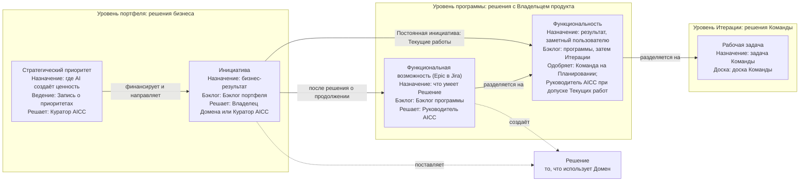

Рисунок 1: уровни работы по назначению и бэклогу.

3.3. Каждый уровень формулируется как краткое соглашение на языке бизнеса, чтобы заказчик, Команда и Владелец продукта читали один и тот же текст. Инициатива и Функциональная возможность формулируются как гипотезы, проверяемые работой. Функциональность формулируется как гипотеза эффекта с Критериями приёмки. Критерии приёмки записываются в форме «Дано — Когда — Тогда». Первая из следующих таблиц определяет части формулировки и их значение, вторая — формулировку каждого уровня, третья иллюстрирует её.

| Часть | Значение | Вопрос, на который она отвечает |
| --- | --- | --- |
| Для кого | Заказчик или пользователь | Для кого это? |
| Потребность | Ситуация или задача, которую нужно выполнить | Какую проблему это решает? |
| Предложение | Предлагаемый объект и его вид | Что это? |
| Гипотеза ценности | Эффект, который, как мы полагаем, будет получен | Почему это значимо? |
| Отличие | Преимущество относительно текущего способа работы | Чем это лучше? |
| Опережающий индикатор | Ранний показатель с источником, базовым и целевым значениями | Как заранее установить, что гипотеза подтверждается? |
| Объём | Минимальная версия для проверки гипотезы и то, что в неё не входит | Что испытывается первым? |
| Критерии приёмки | Дано: ситуация; когда: выполнено действие; тогда: наблюдаемый результат | Как осуществляется Приёмка Владельцем продукта для Функциональности или Функциональной возможности и Владельцем Домена для Решения? |

| Уровень | Для кого | Потребность | Предложение | Гипотеза ценности | Отличие | Опережающий индикатор | Объём | Критерии приёмки |
| --- | --- | --- | --- | --- | --- | --- | --- | --- |
| Инициатива | Для [функции заказчика] | которой требуется [потребность] | [Инициатива] представляет собой [тип Решения] | обеспечивающий [ценность] | В отличие от [текущего способа], наше решение [отличие] | [Показатель, источник, базовое значение, целевое значение] | MVP: [минимальная версия и то, что не входит] | При рассмотрении результат соответствует Опережающим индикаторам, и Владелец Домена, а для Обеспечивающих работ — Куратор AICC, принимает его |
| Функциональная возможность | Для [пользователей Решения] | которым требуется [потребность] | Решение может [возможность] | чтобы [эффект] | | [Показатель] | Функциональности, которые её реализуют | Дано [ситуация]; когда [действие]; тогда [результат] — для Функциональной возможности в целом |
| Функциональность | Для [пользователя] | | [Функциональность] | Мы полагаем, что она обеспечит [эффект] | | [Показатель] | Не более одного Программного инкремента | Дано [ситуация]; когда [действие]; тогда [наблюдаемый результат] |

Ниже приведён пример формулировки. Он показывает форму и не является записью.

| Уровень | Формулировка |
| --- | --- |
| Инициатива | Для руководителей функций, ежемесячно тратящих дни на ручную подготовку регулярного отчёта, Сервис отчётности представляет собой Сервис, который готовит и публикует его. В отличие от ручной подготовки, наш сервис обеспечивает единообразие и требует часов. Мы установим результат по доле выпусков, опубликованных вовремя |
| Функциональная возможность | Для аналитиков, готовящих отчёт, Решение может собирать числовые показатели из их Контролируемых источников, чтобы ни один показатель не копировался вручную |
| Функциональность | Мы полагаем, что автоматический сбор первых трёх показателей устранит их ручное копирование аналитиками. Дано: ежемесячный цикл с доступными источниками; когда: выполняется сбор; тогда: три показателя появляются в проекте отчёта со своими источником и датой |

3.4. Рисунок 2 показывает value stream от приёма работы до жизненного цикла Решения.

```mermaid
flowchart LR
  IN(["Сверху<br/>Инициатива продолжается или инициировано изменение"]):::iface --> PB["Бэклог программы<br/>ранжированные Функциональные возможности и Функциональности"]
  PB --> RF["Уточнение бэклога<br/>Функциональности готовы, Критерии приёмки определены"]
  RF --> IB["Бэклог Итерации<br/>выбор на Планировании Итерации;<br/>допуск Текущих работ на Еженедельном обзоре"]
  IB --> DV["Разработка<br/>Рабочие задачи Команды"]
  DV --> VF["Проверка<br/>Проверка или Валидация"]
  VF --> DP["Развёртывание<br/>в среде использования"]
  DP --> AC["Приёмка Функциональности<br/>Владельцем продукта"]
  AC --> TF["Окончательная Приёмка Командой<br/>Руководитель AICC, до Первых пользователей"]
  TF --> FU["Первые пользователи<br/>Владелец Домена оценивает и принимает Решение"]
  FU --> RL["Выпуск<br/>за пределы круга Первых пользователей"]
  RL --> LC["Жизненный цикл<br/>Эксплуатация, Развитие, Вывод из эксплуатации"]
  LC -.новые Функциональные возможности и Функциональности.-> PB
  AC -.возврат.-> IB
  FU -.возврат.-> IB
  classDef iface fill:#e8eefc,stroke:#5a6fa8,color:#111
```

Рисунок 2: value stream.

3.5. Работу поставляет Команда: Инженер решений совместно с Экспертом Домена, Владельцем Домена и Владельцем продукта. Пока Команда насчитывает не более трёх человек (6.6), её Владельцем продукта является Руководитель AICC; впоследствии он может назначить другое лицо в Записи о назначениях. В AICC действует Команда AICC; Домен может иметь свою Команду. Руководитель AICC ранжирует Бэклог программы, а Владелец продукта упорядочивает Бэклог Итерации в рамках этого ранжирования. Команда принимает Функциональности в таком порядке, решает, как их создавать, поддерживает актуальность Бэклога Итерации и доски Команды и проводит мероприятия Итерации. Владелец Домена как заявитель, а для Обеспечивающих работ — Куратор AICC, определяет бизнес-ценность элемента; Владелец продукта принимает Функциональности и Функциональные возможности в ходе разработки; Владелец Домена принимает Решение (7.3). Команда согласует, кто выполняет необходимые работе Дополнительные обязанности (Операционная модель 4.3).

## 4. Бэклоги и доски

4.1. На этом уровне AICC ведёт два бэклога. Бэклог программы, также называемый Бэклогом PI, содержит Функциональные возможности и Функциональности, сгруппированные по Инициативам. Каждая Функциональность указывает родительскую Функциональную возможность, а для Текущих работ — Постоянную инициативу; она фиксирует дату одобрения и дату Приёмки либо иного окончательного выхода для показателей потока раздела 10. Бэклог Итерации содержит Функциональности, над которыми Команды работают в Итерации. Каждый бэклог ранжируется по ценности и срочности относительно трудоёмкости, с оценками от 1 до 5 для ценности, срочности, снижения риска либо возможности и трудоёмкости. Руководитель AICC ранжирует Бэклог программы; Владелец Домена, а для Обеспечивающих работ — Куратор AICC, определяет бизнес-ценность элемента; Владелец продукта упорядочивает Бэклог Итерации. Бэклоги непрерывно меняются, поскольку значительная часть работы зависит от людей и событий вне AICC. Функциональная возможность может охватывать несколько Программных инкрементов. Функциональность закрывается в пределах своего Программного инкремента либо разделяется: выполненная часть становится Функциональностью, переходящей на рассмотрение, а остаток — новой Функциональностью следующего Программного инкремента; исходная Функциональность переходит в состояние «Перенаправлено» со связями с обеими. Элементы Программного инкремента задают намерение и направление; то, что будет выполнено в Итерации, решается в этой Итерации.

4.2. Работа движется по принципам Канбан. Канбан-доска программы показывает Функциональные возможности и Функциональности по состояниям, с Дорожками по Классам обслуживания: «Срочно», «Высокий приоритет», «Обычный приоритет». WIP limits применяются к состояниям, Дорожкам и каждому Домену. Команда принимает одобренный элемент в работу только при наличии возможности в пределах WIP limits; Функциональность одобряется только при известных Зависимостях. На каждом Планировании Итерации Команда выбирает Функциональности на месяц из Бэклога программы в свой Бэклог Итерации. Еженедельный обзор обеспечивает контроль над ними и допускает Функциональности Текущих работ по 5.2 в пределах тех же WIP limits. Элемент, ожидающий человека или события вне AICC, находится в состоянии «Ожидание» и указывает свою Зависимость. При достижении WIP limit Команда завершает элемент до начала другого. Элемент в состоянии «Ожидание» сохраняет свою колонку и флаг; дни Ожидания учитываются. Колонки Канбан-доски программы соответствуют состояниям: «Бэклог» — «Предложено» и «Проработка», «Готово к работе» — «Одобрено», «В работе» — «В работе» и «Выполнено», «Рассмотрение» — «На рассмотрении», «Готово» — «Принято» и «Закрыто». Доска Команды показывает Рабочие задачи Итерации.

Следующая таблица описывает доски, их шаги, Дорожки, лимиты, считываемые показатели и мероприятия, на которых они рассматриваются.

| Доска | Что показывает | Колонки | Отображаемые Стадии | Дорожки | WIP limit | Показатели | Где рассматривается |
| --- | --- | --- | --- | --- | --- | --- | --- |
| Канбан-доска портфеля | Инициативы | Воронка, Рассмотрение, Анализ, Бэклог портфеля, MVP, Реализация, Готово; состояния «Отложено», «Отклонено» и «Перенаправлено» находятся вне потока | Определение объёма, business case, MVP, Реализация | Нет | Инициативы в состоянии «В работе»; устанавливает Руководитель AICC | Время от предложения до одобрения, время от одобрения до Приёмки, количество в состоянии «В работе» относительно лимита | Еженедельный обзор; Ежемесячное Управляющее совещание |
| Канбан-доска программы | Функциональные возможности и Функциональности | Бэклог, Готово к работе, В работе, Рассмотрение, Готово; «Ожидание» — состояние, обозначаемое флагом на досках, с указанием Зависимости | Функциональная возможность: Анализ, Реализация. Функциональность: Исследование, Проектирование, Разработка, Проверка, Развёртывание | Срочно, Высокий приоритет, Обычный приоритет | По состоянию, Дорожке и Домену; устанавливает Команда | Функциональности, принятые в Итерации, полное время выполнения от «Одобрено» до «Принято», время цикла, элементы по Дорожкам, элементы в состоянии «Ожидание» | Еженедельный обзор; Обзор и демонстрация Итерации |
| Доска программы | Функциональные возможности и Функциональности Программного инкремента с их Зависимостями и Вехами (4.3) | Итерация 1, Итерация 2, Итерация 3, неделя IP | Нет; ячейка содержит планируемое или достигнутое состояние | Нет; по одной строке на Функциональность и одна для Вех | Нет | Зависимости, выполненные к своей дате; Зависимости и Вехи под угрозой | Планирование PI; Еженедельный обзор; Обзор и демонстрация PI |
| Доска Команды | Рабочие задачи Итерации | Бэклог, Готово к работе, В работе, Рассмотрение, Готово | Стадии Функциональности | Нет | На человека; устанавливает Команда | Закрытые Рабочие задачи, препятствия | Ежедневная короткая встреча; Еженедельный обзор |

4.3. Доска программы — доска зависимостей Программного инкремента. Для каждой Функциональной возможности и Функциональности она показывает планируемую Итерацию, состояние и необходимые результаты других элементов, Команд, функций и лиц. Она также показывает Вехи Дорожной карты в соответствующих Итерациях. Руководитель AICC формирует её совместно с Командами на Планировании PI и поддерживает актуальность на Еженедельном обзоре. Зависимость имеет статус «Открыта», «Выполнена» или «Под угрозой». Веха находится под угрозой, если необходимая для неё Функциональность или Зависимость находится под угрозой; такие вопросы выносятся на Ежемесячное Управляющее совещание. Рисунок 3 показывает движение Доски программы, её Зависимостей и Вех в течение Программного инкремента; следующая таблица задаёт форму Доски программы.

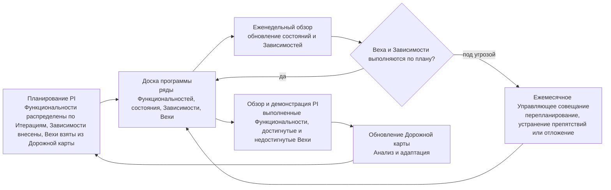

Рисунок 3: Доска программы в течение Программного инкремента.

| Ряд: Функциональность | Родитель: Функциональная возможность или Постоянная инициатива | Итерация 1 | Итерация 2 | Итерация 3 | Неделя IP | Зависит от | Статус Зависимости |
| --- | --- | --- | --- | --- | --- | --- | --- |
| Веха | Дорожная карта | [Веха и дата] | | [Веха и дата] | | | |
| [Функциональность A] | [Функциональная возможность X] | В работе | На рассмотрении | Готово | | Нет | |
| [Функциональность B] | [Функциональная возможность X] | Одобрено | В работе | На рассмотрении | Готово | [Функциональность A] | Выполнена |
| [Функциональность C] | [Функциональная возможность Y] | Ожидание | В работе | На рассмотрении | | [Функция, лицо или другая Команда] | Под угрозой |
| [Функциональность D] | [Функциональная возможность Y] | | Одобрено | В работе | На рассмотрении | [Функциональность C] | Открыта |

Таблица является формой и не содержит реальных данных. Один ряд соответствует одной Функциональности; ячейка содержит состояние, которого Функциональность должна достичь или уже достигла в этой Итерации. Функциональность в состоянии «Ожидание» указывает свою Зависимость; Зависимость под угрозой выносится на Ежемесячное Управляющее совещание.

4.4. Дорожная карта показывает три горизонта: текущий Программный инкремент как намерение и направление, следующий — как планируемый, а дальнейший период — как ориентировочный, с Вехами. Планирование PI предлагает её, Ежеквартальное Управляющее совещание подтверждает (Модель управления портфелем 4.3). Панель показателей показывает состояние Программного инкремента, поток Канбан-доски программы, Зависимости под угрозой, риски и Показатели. Руководитель AICC поддерживает актуальность Дорожной карты, Доски программы и Панели показателей; они являются Записями.

4.5. Функциональность готова к работе, когда одобрена по 5.2: её Критерии приёмки определены в форме по 3.3, Зависимости известны и каждая открытая Зависимость указана. Функциональность завершена, когда её результат протестирован лицом, не являющимся её разработчиком, поставлен пользователю или в среду использования и принят Владельцем продукта (7.3(a)); только после этого она переходит в колонку «Готово». Функциональность, создающая или изменяющая Решение, проходит Проверку или Валидацию по 7.1; при развёртывании в промышленной среде заявка на изменение и ссылка на тестирование фиксируются по 8.3. Для такой работы, как документ или обучение, Функциональность содержит ссылки на поставленный результат и подтверждение выполнения Критериев приёмки. Через Уточнение бэклога Команда должна поддерживать запас готовых к работе Функциональностей на одну-две Итерации вперёд.

## 5. Состояния и Стадии

5.1. Каждая Инициатива, Решение, Функциональная возможность и Функциональность находится в одном из состояний, определённых в документе «Терминология и стиль». Стратегический приоритет находится в состоянии «Предложено», «В работе», «Закрыто» или «Отменено» по решению Куратора AICC. Элемент переходит между состояниями по следующей таблице. Эта таблица является единственным источником правил переходов.

| Из состояния | В состояние | Условие |
| --- | --- | --- |
| Предложено | Проработка | Руководитель AICC принимает элемент: Инициативы, Решения и Функциональные возможности, а Функциональности — на Уточнении бэклога |
| Предложено | Отклонено или Отложено | При первичном разборе принято отрицательное решение либо рассмотрение отложено |
| Предложено | Отменено | Элемент отозван без решения по существу |
| Проработка | Одобрено | Выполнены условия соответствующего уровня по 5.2 и уполномоченное лицо приняло решение |
| Проработка | Ожидание, Отложено, Отклонено, Перенаправлено или Отменено | Элемент блокирует Зависимость; он отложен; принято отрицательное решение; он преобразован в новый элемент; либо отозван без решения по существу |
| Одобрено | В работе | Команда принимает элемент в работу, когда позволяют WIP limits и известны Зависимости. Инициатива переходит в работу, когда Руководитель AICC принимает её для MVP (Модель управления портфелем 5.2); Постоянная инициатива переходит в состояние «В работе», когда в работу принимается её первая одобренная Функциональность Текущих работ. Решение переходит в работу при принятии в работу его первой Функциональной возможности или Функциональности |
| Одобрено | Ожидание, Отложено, Перенаправлено или Отменено | Как для состояния «Проработка» |
| В работе | Выполнено | Работа выполнена |
| В работе | Ожидание, Отложено, Перенаправлено или Отменено | Как для состояния «Проработка» |
| В работе | Отклонено | Только для Инициативы по завершении MVP: ценность не подтверждена (Модель управления портфелем 7.2) |
| В работе | Закрыто | Только для Решения: оно выведено из эксплуатации, передано или прекращено по 8.1 |
| В работе | Проработка | Только для Решения: изменение повышает Категорию риска либо Проверка или Валидация указала его как требующее новой Проверки согласно Политике применения AI |
| Ожидание | Предыдущее состояние | Зависимость устранена |
| Ожидание | Отложено или Отменено | Зависимость не будет устранена либо элемент отозван без решения по существу |
| Отложено | Предложено | Рассмотрение возобновлено; лицо, ведущее элемент, вправе возобновить его с состояния, которое он покинул |
| Отложено | Отклонено или Отменено | Принято отрицательное решение, если элемент никогда не был одобрен, либо он отозван без решения по существу |
| Выполнено | На рассмотрении | Владелец продукта оценивает Функциональность или Функциональную возможность по Критериям приёмки, а Владелец Домена, либо Куратор AICC для Обеспечивающих работ, оценивает результат Инициативы по её критериям (7.3) |
| На рассмотрении | В работе, Принято или Отклонено | Элемент возвращён с указанием недостающего; его критерии выполнены; либо результат не нужен |
| На рассмотрении | Отменено | Элемент отозван без решения по существу |
| Принято | Закрыто | Элемент завершён |

5.2. Стадия — фаза работы внутри состояния «Проработка» или «В работе» элемента. Стадии Инициативы определены в Модели управления портфелем 5.2. Следующая таблица определяет Стадии, лицо, принимающее решение об одобрении, и условия каждого уровня. Руководитель AICC должен подтвердить выполнение условий и отметить это в бэклоге соответствующего уровня либо в Портфеле для Решения.

| Уровень | Стадии Проработки | Кто одобряет и при каких условиях | Стадии работы | Условие выполнения |
| --- | --- | --- | --- | --- |
| Решение | Определение | Владелец Домена одобряет Описание решения с его типом, Получателем, объёмом, возможностями, архитектурой и Классами данных. Руководитель AICC назначает Категорию риска и сообщает её Владельцу Домена; создаётся запись в Реестре AI; для Категорий риска 2 и 3 Представитель контрольной функции по комплаенсу подтверждает применимое законодательство; для Эксперимента указан срок, для Сервиса — Эксплуатационные затраты и Правило вывода из эксплуатации; для Решения, созданного Руководителем AICC, Описание решения одобряет и Категорию риска назначает Куратор AICC (Операционная модель 4.4) | Поставка, затем Стадии соответствующего типа по 8.1 | Решение поставлено по 8.1 |
| Функциональная возможность | Анализ: определить возможность и разделить её на Функциональности | Руководитель AICC после консультации с Владельцем Домена. Функциональности определены и ранжированы в Бэклоге программы | Реализация | Функциональности закрыты |
| Функциональность | Исследование, Проектирование | Команда на Планировании Итерации; для Текущих работ — Руководитель AICC на Еженедельном обзоре по Бизнес-модели 4.8 и разделу 3.1. Критерии приёмки определены, Зависимости известны, каждая открытая Зависимость указана. Функциональность Текущих работ добавляется в текущий Бэклог Итерации в пределах его WIP limits | Разработка, Проверка, Развёртывание | Результат протестирован и поставлен, с Проверкой или Валидацией там, где они требуются. Приёмка Владельцем продукта следует в состоянии «На рассмотрении» до перехода в колонку «Готово» (4.5) |

Рисунок 4 показывает последовательность Стадий каждого уровня слева направо: Стадии в прямоугольниках, обязательные условия продвижения в ромбах и возвраты. Каждое условие соответствует таблице Стадий; в системе учёта задач оно является условием workflow, Стадия хранится в поле, состояние — в статусе.

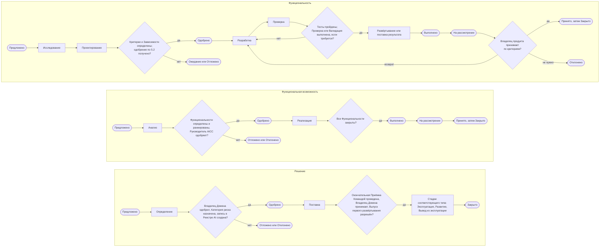

Рисунок 4: последовательность Стадий Функциональности, Функциональной возможности и Решения.

5.3. «Отклонено» означает отрицательное решение по существу из-за отсутствия подтверждённой ценности: до одобрения, после MVP Инициативы либо когда рассматриваемый результат не нужен. «Отменено» означает отзыв без решения по существу, например из-за ошибки, недоразумения или дублирования, и применяется в любом состоянии от «Предложено» до «На рассмотрении», кроме «Выполнено». Приостановление Решения обозначается флагом и не меняет его состояния. Остановка Контрольной функцией окончательна и переводит Решение в состояние «Отменено». Вывод из эксплуатации закрывает его без Приёмки. Лицо, одобряющее элемент на его уровне, также откладывает, отклоняет, отменяет или перенаправляет его.

## 6. Ритм работы

6.1. Работа ведётся Программными инкрементами. Программный инкремент — один квартал, состоящий из трёх Итераций. Итерация — один календарный месяц из четырёх или пяти полных недель. Последняя неделя третьей Итерации Программного инкремента является неделей IP; исключение — Запись о Календаре может перенести её раньше и оставить неделю окончания года свободной от мероприятий, например в I12 из пяти недель, последняя из которых приходится на конец года. Обозначения: PIQ1–PIQ4 с годом, I01–I12 и W1–W5. Запись о Календаре содержит даты всего года с заблокированными и серыми днями, а workflow «Ритм работы» задаёт общую последовательность мероприятий по неделям без дат — шаблон датированного календаря мероприятий. Работа ведётся в четырёх циклах; каждый начинается планированием и заканчивается обзором, получает рамки от вышестоящего цикла и возвращает ему подтверждающие данные. Они определены в следующей таблице.

| Цикл | Ритм | Мероприятия | Участники | Кто принимает решение | Записи |
| --- | --- | --- | --- | --- | --- |
| Программный инкремент | Ежеквартально | Планирование PI, Обзор и демонстрация PI, Анализ и адаптация, Инновации | Команды, Владельцы Доменов Инициатив в работе, Владелец продукта и Руководитель AICC; Куратор AICC для Обеспечивающих работ | Команды и Владельцы Доменов — по намерению; Куратор AICC подтверждает Дорожную карту | Цели PI с оценками, Дорожная карта, Доска программы, Квартальный отчёт |
| Итерация | Ежемесячно | Планирование Итерации, Обзор и демонстрация Итерации, Ретроспектива Итерации, Уточнение бэклога | Команда со своим Владельцем продукта; на Обзоре и демонстрации Итерации также Владелец Домена каждого действующего Решения либо Куратор AICC для Сервиса, охватывающего несколько Доменов | Команда; Владелец продукта принимает Функциональности и Функциональные возможности | Бэклог Итерации, записи о Приёмке, записи обзора действующих Решений |
| Неделя | Еженедельно | Еженедельное планирование, Еженедельный обзор | Руководитель AICC и Инженеры решений | Руководитель AICC | Панель показателей, Доска программы |
| День | Ежедневно | Ежедневная короткая встреча | Команда | Команда | Рабочие задачи |

6.2. Цикл Программного инкремента — цикл квартала. Планирование PI задаёт намерение и направление Программного инкремента: Цели PI, намеченные Функциональности, Доску программы и предлагаемую Дорожную карту. Работа выполняется в трёх Итерациях. На Планировании PI Владелец Домена, а для Обеспечивающих работ — Куратор AICC, оценивает плановую бизнес-ценность каждой Цели PI от 1 до 10, а Команда оценивает свою уверенность от 1 до 5. Обзор и демонстрация PI показывает поставленное за Программный инкремент; то же лицо оценивает достигнутую бизнес-ценность каждой Цели PI. Анализ и адаптация разрешает основные проблемы Программного инкремента и вносит улучшения как Функциональности в Бэклог программы; Инновации выделяют время на обучение, пробы и устранение накопленного за Программный инкремент долга. На неделе IP последовательно проводятся Обзор и демонстрация PI, Анализ и адаптация, Инновации и Планирование PI; завершающее неделю Ежеквартальное Управляющее совещание подтверждает Цели PI и Дорожную карту, предложенные на Планировании PI. Ежеквартальное Управляющее совещание, завершающее неделю IP в PIQ4, делает то же самое и включает только цикл подтверждения надлежащего функционирования и обзор портфеля, поскольку Ежегодное Управляющее совещание декабря уже установило рамки следующего года. Цикл получает Дорожную карту и приоритеты обзора портфеля, а также направление Ежегодного Управляющего совещания, передаёт Цели PI и Доску программы в цикл Итерации и возвращает оценки ценности и данные Квартального отчёта на Ежеквартальное Управляющее совещание.

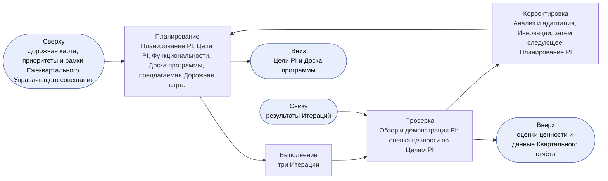

Рисунок 5: цикл Программного инкремента.

6.3. Цикл Итерации — цикл месяца. Планирование Итерации использует Цели PI, выбирает Функциональности на месяц в Бэклог Итерации и устанавливает цель Итерации. Работа выполняется по неделям. Обзор и демонстрация Итерации показывает Владельцу продукта работающие Функциональности и Решения по их письменным Критериям приёмки и обеспечивает Приёмку Функциональностей и Функциональных возможностей. Ретроспектива Итерации совершенствует работу Команды и завершается одним-двумя улучшениями, которые Команда вносит как Рабочие задачи или Функциональности. Уточнение бэклога поддерживает готовность следующих элементов (4.5) в рамках еженедельных встреч. Последняя неделя Итерации — её Неделя обзора; исключение — третья Итерация Программного инкремента, где обзор проводится на неделе IP. Цикл получает Цели PI и Доску программы и возвращает записи о Приёмке и результаты в цикл Программного инкремента и на Ежемесячное Управляющее совещание.

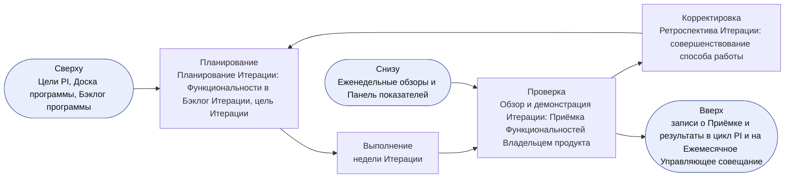

Рисунок 6: цикл Итерации.

6.4. Недельный и ежедневный циклы — циклы выполнения работы. Еженедельное планирование определяет основное внимание недели и проверяет Зависимости. Еженедельный обзор контролирует поток: рассматривает Канбан-доску программы, WIP limits и Зависимости. Руководитель AICC переупорядочивает Бэклог программы и поддерживает актуальность Панели показателей. Ежедневная короткая встреча обеспечивает обмен информацией о ходе работы и устранение препятствий. Цикл получает Бэклог Итерации и цель Итерации и возвращает Панель показателей и открытые Зависимости в цикл Итерации.

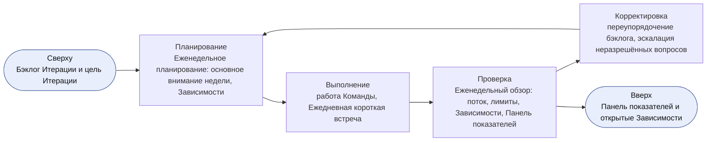

Рисунок 7: недельный цикл.

6.5. Мероприятие, выпавшее на заблокированный или серый день, переносится на предшествующий рабочий день, никогда — на последующий. При совпадении перенесённых мероприятий в один день более крупное сохраняет дату, а меньшее переносится на предшествующий рабочий день. Инновации необязательны и исключаются первыми при сокращении доступных дней. Пропущенное мероприятие не проводится позднее; его назначение реализуется на следующем мероприятии. Еженедельный обзор может проводиться письменно.

6.6. Пока Команда AICC насчитывает не более трёх человек, AICC работает в Облегчённом режиме. Еженедельное планирование и Еженедельный обзор объединяются в одну встречу в день Еженедельного планирования. Ретроспектива Итерации и Ежемесячное Управляющее совещание проводятся в составе Обзора и демонстрации Итерации; Анализ и адаптация — в составе Обзора и демонстрации PI. Ежедневная короткая встреча, Уточнение бэклога и Инновации необязательны. В Облегчённом режиме «Ожидание» остаётся состоянием, обозначаемым флагом на досках; «Выполнено» пропускается и элемент переходит из «В работе» в «На рассмотрении»; «Принято» и «Закрыто» объединяются в один шаг с фиксацией Приёмки; Стадии используются только для Инициатив и Решений; Рабочие задачи не отслеживаются в корпусе Положения. Руководитель AICC является Владельцем продукта Команды (3.5, 7.3). Остальные положения действуют без изменений.

6.7. Циклы настоящей модели используют те же мероприятия, что и циклы контроля Операционной модели 6 и циклы управления портфелем Модели управления портфелем 4, и не добавляют совещаний. Еженедельный обзор является операционным циклом и циклом ведения бэклога; Ежемесячное Управляющее совещание использует результаты Обзора и демонстрации Итерации; Ежеквартальное Управляющее совещание — результаты Обзора и демонстрации PI. В месяце с неделей IP завершающее её Ежеквартальное Управляющее совещание является также Управляющим совещанием этого месяца и включает ежемесячный цикл контроля. Исключение — декабрь: Ежемесячное Управляющее совещание декабря проводится в первые две недели как Ежегодное Управляющее совещание (Операционная модель 6.5), а Ежеквартальное Управляющее совещание, завершающее неделю IP, включает только цикл подтверждения надлежащего функционирования и обзор портфеля.

6.8. Каждое мероприятие имеет одно назначение, определённых участников, вход, выход и запись, как указано для его цикла в таблице 6.1 и показано для каждого мероприятия в workflow «Ритм работы». Руководитель AICC не должен проводить иных мероприятий для поставки.

6.9. Внутри циклов по 6.1 работа выполняется в трёх циклах, а подтверждающие данные возвращаются по четырём циклам обратной связи согласно следующей таблице. Они не добавляют мероприятий.

| Цикл | Вид | Действие | Где выполняется | Что возвращает |
| --- | --- | --- | --- | --- |
| Исследование | Работа | Исследует потребность и проектирует Функциональность до готовности к работе (4.5) | Исследование и Проектирование, на Уточнении бэклога | Готовые к работе Функциональности |
| Создание | Работа | Разрабатывает, интегрирует и тестирует Функциональность, обеспечивает Проверку или Валидацию Решения (7.1) | Разработка и Проверка, в течение недель | Проверенные Функциональности |
| Выпуск | Работа | Развёртывает Функциональность, обеспечивает Приёмку и выпускает Решение за пределы круга Первых пользователей (7.3, 7.4) | Развёртывание и Рассмотрение, на Обзоре и демонстрации Итерации и при Выпуске | Принятые Функциональности и выпущенные Решения |
| Демонстрация | Обратная связь | Показывает работающее программное обеспечение по письменным Критериям приёмки | Обзор и демонстрация Итерации; Обзор и демонстрация PI | Записи о Приёмке и возвращённые элементы |
| Ретроспектива | Обратная связь | Совершенствует способ работы | Ретроспектива Итерации; Анализ и адаптация | Улучшения в форме Рабочих задач или Функциональностей |
| Обзор эксплуатации | Обратная связь | Рассматривает четыре сигнала каждого действующего Решения (8.4) | Обзор и демонстрация Итерации; Ежеквартальное Управляющее совещание | Исправления, изменения, переходы и выводы из эксплуатации |
| Показатели | Обратная связь | Рассматривает поток, качество, состояние действующих Решений и ценность (10) | От Еженедельного обзора до Ежеквартального Управляющего совещания | Проблемы для Ретроспективы Итерации или Анализа и адаптации |

## 7. Проверка, Выпуск и Приёмка

Рисунок 8 показывает Проверку, развёртывание и Приёмку Функциональности Владельцем продукта, а также окончательную Приёмку Решения Командой и оценку Владельцем Домена до Выпуска за пределы круга Первых пользователей.

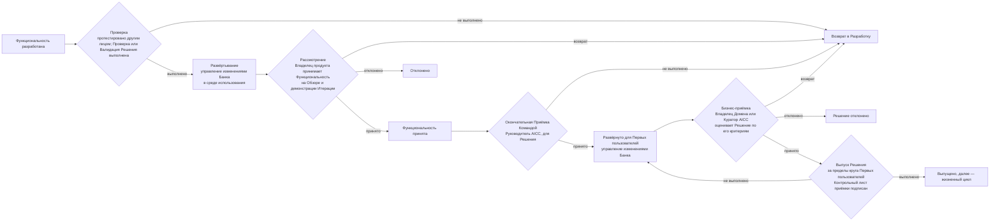

Рисунок 8: Проверка, развёртывание, три уровня Приёмки и Выпуск.

7.1. Каждая Функциональность и MVP Инициативы должны до развёртывания тестироваться лицом, не являющимся разработчиком, в среде, не являющейся промышленной; ссылка на результат фиксируется в Функциональности. Команда интегрирует работу по мере выполнения; Функциональность с неуспешным тестом возвращается разработчику в тот же день. Среда использования — среда, в которой Функциональность работает для своих пользователей: до развёртывания Решения для Первых пользователей она не является промышленной, после — является. Проверка для Категории риска 1 и Валидация Представителями контрольных функций для Категорий риска 2 и 3 относятся к Решению. Они проводятся на Стадии «Проверка» первой Функциональности, достигающей реальных пользователей или данных, и охватывают последующие Функциональности, если изменение не требует повторной процедуры; необходимость повторения Руководитель AICC должен определить и зафиксировать с причиной в Описании решения. До них не допускается развёртывание для реальных пользователей или работы с реальными данными.

Развёртывание в промышленной среде выполняется по 8.3; доступ Инженера решений к промышленной среде предоставляется через процесс управления доступом Банка. Первые пользователи — пользователи, названные Владельцем Домена в Описании решения для оценки Решения (7.3); до использования они должны пройти обучение (Политика применения AI 2.1). Окончательная Приёмка Командой (7.3) проводится до первого развёртывания Решения для Первых пользователей и до развёртывания каждого существенного изменения (8.6). Решение о Выпуске за пределы круга Первых пользователей принимает Владелец Домена для Категорий риска 1 и 2 (Куратор AICC, если Владельцем Домена является Руководитель AICC, — Операционная модель 4.4(d)) и Куратор AICC для Категории риска 3 после Проверки или Валидации и Приёмки Решения (7.3); оно фиксируется в Разделе о Выпуске Описания решения. Контрольный лист приёмки (7.4) служит записью каждого Выпуска за пределы круга Первых пользователей — как для Сервиса и Продукта, так и для любого Решения, передаваемого AICC Домену.

7.2. Представители контрольных функций, названные в настоящей модели и Политике применения AI, должны участвовать в определении Решения Категории риска 2 или 3 и его Валидации. Валидация включает тестирование защищённости от атак на AI (Политика применения AI 3.3) и опирается на подтверждающие данные, журналы и трассировки, хранимые Владельцем платформы.

7.3. Приёмка закрывает элемент. Она проводится на трёх уровнях, каждый раз по Критериям приёмки и с указанием лица и даты.

(a) В ходе разработки Владелец продукта принимает каждую Функциональность и каждую Функциональную возможность по её Критериям приёмки на Обзоре и демонстрации Итерации. Владелец продукта вправе принять элемент, вернуть его с указанием недостающего либо отклонить, если результат не нужен; Руководитель AICC фиксирует Приёмку в бэклоге соответствующего уровня. Пока Команда насчитывает не более трёх человек (6.6), её Владельцем продукта является Руководитель AICC; впоследствии он может назначить другое лицо в Записи о назначениях.

(b) До предоставления и развёртывания Решения, будь то работающий прототип или окончательная версия, для оценки Владельцем Домена Руководитель AICC должен провести окончательную Приёмку Командой. Он должен подтвердить соответствие Решения Критериям приёмки его Описания решения, наличие ссылок на тесты (7.1) и выполненную Проверку или Валидацию и зафиксировать лицо, проводившее Приёмку, и дату в Разделе о Выпуске Описания решения. Это предшествует первому развёртыванию Решения для Первых пользователей и развёртыванию каждого существенного изменения (8.6).

(c) Заявитель оценивает работающее Решение, развёрнутое для Первых пользователей, по Критериям приёмки Описания решения и должен принять его, вернуть с указанием недостающего либо отклонить, если результат не нужен. Заявитель — Владелец Домена для Решения Домена и Куратор AICC для элемента, охватывающего несколько Доменов, относящегося к Обеспечивающим работам AICC или являющегося Экспериментом без Домена. Это решение является Приёмкой Решения, а для Взаимодействия с заказчиком — также Приёмкой его Отчёта о результатах, который её фиксирует; оно вносится в Раздел о Выпуске Описания решения с указанием лица и даты. Выпуск за пределы круга Первых пользователей — отдельное решение (7.1, 7.4).

(d) Руководитель AICC вправе проводить Приёмку по (a) и (b) для созданного им Решения, но не должен проводить Приёмку по (c), Проверку или Валидацию либо Выпуск такого Решения (Операционная модель 4.4(d)). Это Принятое ограничение при небольшой численности Команды; оно фиксируется в Записи о рисках и проблемах. Компенсирующие контрольные процедуры: тестирование лицом, не являющимся разработчиком (7.1), Проверка или Валидация другим лицом, Приёмка Владельцем Домена, решение о Выпуске и ежемесячная проверка Куратором AICC выборки Управленческих решений Руководителя AICC.

7.4. При передаче AICC Решения Домену как готового к масштабному использованию, до Выпуска за пределы круга Первых пользователей, Руководитель AICC заполняет Контрольный лист приёмки Решения. Он перечисляет для каждой участвующей стороны пункты, которые сторона подтверждает в пределах своих полномочий и подписывает: Владелец Домена, Инженер решений, Руководитель AICC, Проверяющий, Контрольные функции (модельный риск, комплаенс, информационная безопасность, защита данных и юридические вопросы) и IT-функция, эксплуатирующая Решение, совместно с Владельцем платформы. Для Категории риска 1 подписантами являются Владелец Домена, Инженер решений и Проверяющий; для Категорий риска 2 и 3 к ним добавляются Контрольные функции каждого затронутого направления и IT-функция (Политика применения AI 3.3). Невыполненный пункт должен остановить Выпуск. Владелец Домена, принявший Решение (7.3(c)), получает подписанный контрольный лист. Домен внедряет Решение Категории риска 1 или 2 на свой риск в пределах Заявления о риск-аппетите в отношении AI. Решение Категории риска 3 с высоким воздействием и риском внедряется только с подписью Куратора AICC, который принимает риск и разрешает Выпуск. Контрольный лист не используется при разработке или испытаниях, где действует 7.1; изменение после Выпуска, требующее новой Проверки или Валидации, требует нового контрольного листа. Он не добавляет самостоятельного одобрения: решения определены Политикой применения AI и настоящей моделью.

7.5. Лицо, создающее Функциональность или Решение, не должно проводить его тестирование, Проверку или Валидацию. Заявитель, проводящий бизнес-приёмку Решения, не является сотрудником AICC; лицо, разрешающее Выпуск Решения, отвечает за его результаты. Единственное Принятое ограничение этого разделения — предусмотренное в 7.3(d).

## 8. Управление жизненным циклом

8.1. Решение имеет один тип предложения, определяющий его жизнь после поставки. Решение считается поставленным, когда разрешён Выпуск его первого развёртывания. Инициатива завершена, когда её Решения поставлены и результат рассмотрен; Сервис и Продукт продолжают жизнь в соответствии со своим типом. Решение находится в состоянии «В работе» с начала поставки до конца жизни и переходит в состояние «Закрыто» при выводе из эксплуатации, Передаче или прекращении. Получатель указывается в Описании решения до одобрения Решения; Эксперимент может указывать «пока нет, предстоит запросить». Типы определены в следующей таблице.

| Тип | Владелец после поставки | Стадии после поставки | Окончание |
| --- | --- | --- | --- |
| Сервис | AICC на протяжении всего жизненного цикла; business case указывает затраты на эксплуатацию и Правило вывода из эксплуатации. Владелец обслуживаемого Домена принимает и рассматривает его; для Сервиса, охватывающего несколько Доменов, это делает Куратор AICC | Эксплуатация, Развитие, Вывод из эксплуатации, уточняемые Шагами обслуживания по 8.8. Новые возможности поступают как Функциональные возможности и Функциональности | Выведен из эксплуатации, передан IT-функции Банка (8.11) или отменён |
| Продукт | Потребитель владеет поставленной версией, AICC оказывает поддержку по запросу | Передача, Поддержка, Пересмотр (новая версия проходит через Бэклог портфеля), Вывод из эксплуатации у данного потребителя. Продукт со вторым потребителем или повторяющимися запросами даёт начало Сервису по 8.12 | Выведен из эксплуатации у данного потребителя |
| Эксперимент | Пока отсутствует: срок ограничен указанным количеством Итераций и завершается Предложением. При отсутствии Домена его принимает Куратор AICC, иначе — Владелец Домена | Испытание, Предложение, Передача | По истечении срока переходит на рассмотрение: принимается с извлечёнными уроками и закрывается, формируется Предложение либо отклоняется. Когда Получатель принимает Передачу, Эксперимент закрывается, а AICC осуществляет надзор за Внедрённым решением |

Фазы Взаимодействия с заказчиком соотносятся с элементами следующим образом: изучение — Проработка Инициативы; подтверждение осуществимости — Эксперимент или первые Функциональности Решения; поставка — состояние «В работе» Функциональных возможностей и Функциональностей; поддержка — жизнь Решения после поставки.

Рисунок 9 показывает жизнь Решения по типам как последовательность Стадий с выходами.

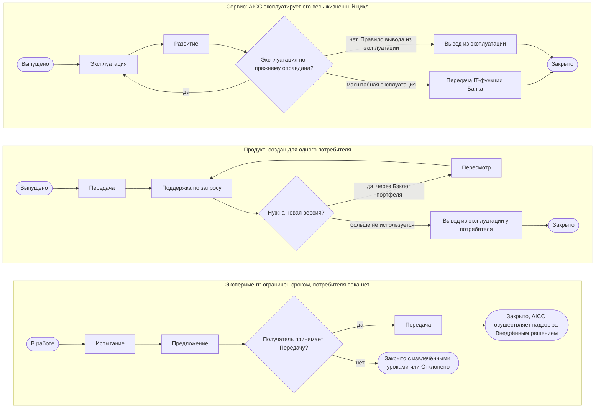

Рисунок 9: жизнь Решения по типам.

8.2. AICC осуществляет надзор и отчитывается по Внедрённым решениям, поставляемым другими, в Портфеле — в форме Описания решения с отметкой «Внедрённое решение» и Получателем как владельцем. Запись создаётся, когда другие начинают поставку Решения, предложенного AICC или находящегося под его надзором. Используются состояния «Предложено», «Одобрено», «В работе», «Закрыто», «Отклонено» и «Отменено»; Категория риска фиксируется, когда известна. Владельцы и Куратор AICC принимают решения по Предложению Решения, Банк — по Предложению стратегии внедрения AI. Стратегия внедрения AI представляет собой серию Предложений, которые AICC формирует на основе полученных знаний; Руководитель AICC готовит её ежегодное Предложение, Куратор AICC представляет его (Операционная модель 6.5). Руководитель AICC рассматривает Внедрённые решения на каждом Ежеквартальном Управляющем совещании, а Квартальный отчёт фиксирует рассмотрение (C-20). Каждый квартал Руководитель AICC также должен сверять Реестр AI с применениями AI, действующими в Банке; Квартальный отчёт фиксирует результат.

### Развёртывание

8.3. Функциональность развёртывается в среде использования после тестирования и Проверки или Валидации (7.1). Развёртывание Решения для Первых пользователей и каждого существенного изменения (8.6) следует после окончательной Приёмки Командой (7.3(b)). Развёртывание в промышленной среде выполняется в рамках управления изменениями Банка. Инженер решений должен зарегистрировать в нём изменение, внести заявку на изменение и результат тестирования в Функциональность и выполнить развёртывание через процесс управления доступом Банка. Для первого развёртывания Решения ключ заявки на изменение и ссылка на тест также вносятся в Раздел о Выпуске Описания решения. Владелец платформы обеспечивает журналирование и мониторинг (Политика применения AI 3.5). При неудачном развёртывании или причинении вреда выполняется откат согласно требованиям управления изменениями Банка, а событие обрабатывается как инцидент. Развёртывание Решения для Первых пользователей является первым развёртыванием в промышленной среде и делает Функциональность доступной им; решение о Выпуске за пределы их круга принимается по 7.4. Рисунок 10 показывает поток.

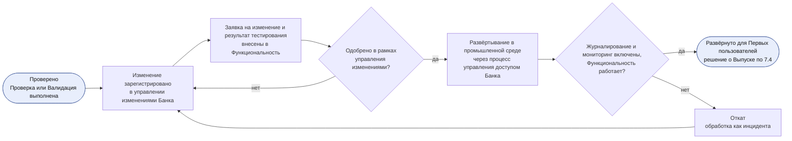

Рисунок 10: развёртывание Функциональности.

### Эксплуатация

8.4. Решение эксплуатирует отвечающая за это IT-функция (Политика применения AI 5.3). Для Сервиса, эксплуатируемого AICC, эту функцию выполняет Инженер решений. Эксплуатация представляет собой цикл. На этапе планирования при Выпуске устанавливаются уровень поддержки по Соглашению о взаимодействии и мониторинг. На этапе выполнения Решение эксплуатируется, обрабатываются запросы и инциденты. Проверка — рассмотрение Владельцем Домена, а для Сервиса, охватывающего несколько Доменов, — Куратором AICC на каждом Обзоре и демонстрации Итерации четырёх сигналов Решения: уровней обслуживания, инцидентов, включая Инциденты AI, использования и затрат, а также уведомлений Поставщиков. Рассматривающее лицо должно зафиксировать обзор в Описании решения. Руководитель AICC переносит результаты в Квартальный отчёт; для Сервиса они сопоставляются с Правилом вывода из эксплуатации (8.11). На этапе корректировки Решение исправляется, изменяется (8.6) или выводится из эксплуатации (8.7). Цикл получает уровень поддержки и решение о Выпуске, возвращает обзор в цикл Итерации и передаёт Инцидент AI в событийный цикл Операционной модели 6. Каждое изменение в промышленной среде Сервиса, эксплуатируемого AICC, одобряется в рамках управления изменениями Банка; независимыми проверками служат мониторинг Владельца платформы и обзор Владельца Домена. Резервное копирование и восстановление выполняются по правилам Платформы AI и Банка и указываются в Описании решения.

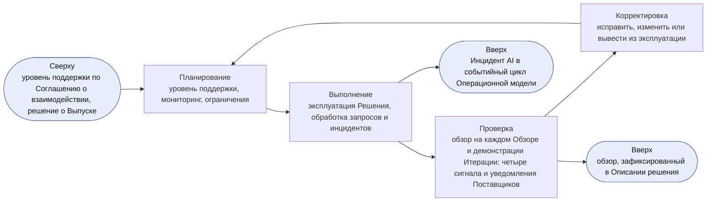

Рисунок 11: операционный цикл действующего Решения.

8.5. Запросы и инциденты по Решению поступают в очередь AICC в Service Management; целевые сроки реакции Соглашения о взаимодействии являются ориентирами, а не гарантиями. Запрос проходит первичный разбор по Классу обслуживания, обрабатывается и закрывается. Первичный разбор проводит Инженер решений; при сомнении Класс определяет Руководитель AICC. Если Соглашение о взаимодействии не устанавливает иное, «Срочно» означает недоступность Решения или поступление людям неверного результата, с реакцией в течение дня; «Высокий приоритет» означает блокировку потребителя при наличии срока, с реакцией в течение недели; «Обычный приоритет» — любой иной запрос. Каждый простой или сбой Решения регистрируется в управлении инцидентами Банка; Инцидент AI обрабатывается там же с Руководителем AICC как заинтересованным лицом (Политика применения AI 5). Запрос новой Функциональности поступает в Бэклог программы. Продукт поддерживается по запросу, Сервис — по согласованным целевым срокам реакции. Рисунок 12 показывает поток.

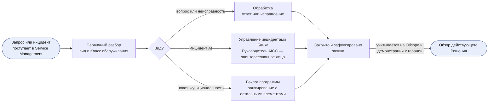

Рисунок 12: поддержка действующего Решения.

### Изменение и вывод из эксплуатации

8.6. Изменение выпущенного Решения является Функциональностью и проверяется и развёртывается как любая Функциональность. Изменение модели, Поставщика, Класса данных, степени автономности или любого признака Категории риска является существенным. Руководитель AICC должен решить, требует ли изменение новой Проверки или Валидации, и внести решение в Журнал решений. Существенное изменение выпускается по 7.1 Владельцем Домена либо Куратором AICC для Категории риска 3; любое иное изменение принимается как Функциональность. Экстренное изменение следует экстренной процедуре управления изменениями Банка (8.3); Руководитель AICC разрешает его со стороны AICC. Куратор AICC рассматривает его в течение пяти рабочих дней, оно вносится в Журнал решений; для Категории риска 3 уведомляются Представители контрольных функций. Изменение условий или модели Поставщиком является изменением по настоящему пункту. Рисунок 13 показывает цикл изменения.

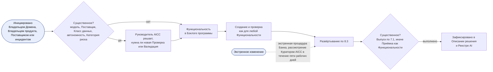

Рисунок 13: цикл изменения выпущенного Решения.

8.7. До перевода Решения в состояние «Закрыто» при выводе из эксплуатации Инженер решений должен удалить доступ и учётные данные, данные и журналы должны быть сохранены или удалены по правилам хранения Банка, а запись Реестра AI должна получить отметку о выводе из эксплуатации. Вывод из эксплуатации одобряет Владелец Домена, а для Сервиса, охватывающего несколько Доменов, — Куратор AICC; одобрение вносится в Описание решения. Те же действия выполняются до перевода в состояние «Отменено» Решения, работавшего с реальными пользователями или данными; Инженер решений вносит в Описание решения дату удаления доступа и выполнения действий с данными.

### Жизнь Сервиса

8.8. Сервис проходит Шаги обслуживания следующей таблицы. Они уточняют Стадии «Эксплуатация», «Развитие» и «Вывод из эксплуатации» и не являются состояниями: по 5.1 Сервис остаётся в состоянии «В работе» до перехода в состояние «Закрыто». Инженер решений должен вносить Шаг обслуживания и дату его достижения в Описание решения и Реестр AI.

| Шаг обслуживания | Стадия | Вопрос | Рассматриваемые сигналы | Действие | Условие перехода к следующему шагу |
| --- | --- | --- | --- | --- | --- |
| Допущен | Эксплуатация | Готов ли Сервис к первому запросу? | Пока отсутствуют; затраты на эксплуатацию и Правило вывода из эксплуатации из business case | Создать запись в каталоге, оформить Соглашение о взаимодействии и открыть очередь (8.9) | Все три выполнены; подтверждает Руководитель AICC |
| Внесён в каталог | Эксплуатация | Обслуживает ли он первые запросы в целевые сроки реакции? | Уровни обслуживания; инциденты | Обслужить первые запросы и установить Сигнальные значения мониторинга | Первый запрос обслужен в целевой срок |
| Обслуживает | Эксплуатация | Работоспособен ли он, используется ли и оправдывает ли затраты на эксплуатацию? | Четыре сигнала (8.4) | Эксплуатировать по практикам 8.10 и рассматривать на каждом Обзоре и демонстрации Итерации | Нужно изменение: «Улучшается». Результаты рассмотрения требуют перехода: «Переход запланирован» |
| Улучшается | Развитие | Устраняет ли изменение проблему, показанную сигналами? | Сигнал, вызвавший изменение | Изменение в форме Функциональности (8.6) | Изменение принято либо выпущено, если оно существенное: «Обслуживает» |
| Переход запланирован | Развитие | Должен ли Банк эксплуатировать его в масштабе или его следует прекратить? | Четыре сигнала относительно business case и Правила вывода из эксплуатации | Предложение Передачи с названным Получателем либо план вывода из эксплуатации (8.11) | Решение по 8.11 |
| Мигрирует | Вывод из эксплуатации | Перенесены ли пользователи, данные и эксплуатация без вреда? | Уровни обслуживания; инциденты | Перенести пользователей и эксплуатацию к Получателю либо в замену Сервиса | Получатель принимает Передачу либо выполнены действия по 8.7 |
| Передан или Выведен из эксплуатации | Вывод из эксплуатации | Нет | Нет | Сервис переходит в состояние «Закрыто» по 5.1; после Передачи AICC осуществляет надзор за ним как за Внедрённым решением (8.2) | Нет |

8.9. До приёма Сервисом первого запроса Руководитель AICC должен подтвердить, что запись каталога создана в Портфеле, Соглашение о взаимодействии указывает целевые сроки реакции по Классам обслуживания, а очередь открыта в Service Management.

8.10. Инженер решений должен эксплуатировать Сервис AICC по следующим практикам соразмерно его Категории риска: обработка запросов и инцидентов (8.5); управление проблемами, которое переводит повторяющиеся инциденты или запросы в Функциональность Бэклога программы; обеспечение изменений (8.6); управление знаниями со ссылками на известные ошибки и руководство пользователя в Описании решения; уровни обслуживания относительно Соглашения о взаимодействии; затраты на эксплуатацию относительно business case; резервный вариант и порядок прекращения сотрудничества с каждым поставщиком. В Облегчённом режиме (6.6) у Сервиса одна очередь, одна еженедельная встреча обрабатывает его запросы и проблемы, а практики ведутся как контрольный лист в Описании решения.

8.11. Сервис, который Банк должен эксплуатировать в масштабе, передаётся IT-функции Банка по Предложению с названным Получателем и переводится в состояние «Закрыто» как переданный, когда Получатель принимает Передачу. Владелец Домена, а для Сервиса, охватывающего несколько Доменов, — Куратор AICC, принимает решение о переходе Сервиса — Передаче либо выводе из эксплуатации по Правилу вывода из эксплуатации — по результатам рассмотрения четырёх сигналов на Ежеквартальном Управляющем совещании; Руководитель AICC должен внести решение в Журнал решений и Описание решения.

8.12. Пакет или Продукт становится Сервисом, когда у него появляются второй потребитель, business case с затратами на эксплуатацию и Правилом вывода из эксплуатации, одобренное по Модели управления портфелем 6.3, и назначенный владелец. Сервис является новым Решением со своим Описанием решения, чтобы каждое Решение сохраняло один тип предложения; Продукт выводится из эксплуатации у своего потребителя, когда Сервис начинает обслуживать этого потребителя.

### Эксперимент и Лабораторная среда

8.13. Эксперимент проводится в Лабораторной среде — изолированной среде AICC для Экспериментов; Инженер решений должен проводить его по следующим правилам.

(a) Лабораторная среда — среда, а не орган принятия решений. Решения по Эксперименту определены настоящей моделью и Политикой применения AI.

(b) Данные поступают в Лабораторную среду только в виде выгрузок для чтения в соответствии с классификацией Банка; для каждого источника назван владелец, обратная запись в источники не выполняется.

(c) Объём персональных данных минимизируется; до поступления в Лабораторную среду они оцениваются совместно с Представителем контрольной функции по защите данных.

(d) Облачная или внешняя среда, используемая как Лабораторная среда, является Поставщиком и до использования проверяется по Политике применения AI 4.1.

(e) Эксперимент заканчивается по истечении установленного срока и переходит на рассмотрение по 8.1.

(f) Руководитель AICC ведёт ограничения Лабораторной среды с подтверждением каждого в Записи о стандартах; Ежеквартальное Управляющее совещание рассматривает их.

## 9. Записи и контрольные процедуры

9.1. Записи настоящей модели: Бэклог программы, Бэклоги Итераций, Доска программы, Дорожная карта, Панель показателей, Календарь и Цели PI с оценками (6.2), хранимые в Реестре; Описания решений, хранимые в Портфеле; Контрольные листы приёмки, Заключения контрольных функций, Разборы Инцидентов AI и Снимки Реестра, являющиеся Подтверждающими записями.

9.2. Контрольные процедуры, правила которых устанавливает или подтверждающие записи которых ведёт настоящая модель, — C-10, C-12, C-13, C-14, C-15, C-16, C-20, C-22, C-26, C-28, C-29, C-30 и C-31 Операционной модели 8. Следующая таблица показывает контроль каждого шага жизни Решения.

| Шаг | Пункт | Кто принимает решение | Подтверждение | Контрольная процедура |
| --- | --- | --- | --- | --- |
| Одобрение Функциональной возможности или Функциональности | 3.1, 5.1 | Руководитель AICC; Команда | Бэклог программы | Нет; Рабочее состояние, до Перехода — в Реестре, затем — в Jira |
| Описание решения и Категория риска | 5.2 | Владелец Домена одобряет; Руководитель AICC назначает Категорию риска; для Решения, созданного Руководителем AICC, — Куратор AICC | Описание решения; Реестр AI | C-12, C-15 |
| Стадия «Проверка»: Проверка или Валидация | 7.1 | Проверяющий; Представители контрольных функций | Запись Реестра AI; Заключение контрольной функции | C-13 |
| Развёртывание в промышленной среде и изменение | 8.3, 8.6 | Управление изменениями Банка; Руководитель AICC | Заявка на изменение; Описание решения | C-30 |
| Выпуск | 7.1, 7.4 | Владелец Домена; Куратор AICC для Категории риска 3 и когда Владельцем Домена является Руководитель AICC | Раздел о Выпуске; Контрольный лист приёмки | C-14, C-22 |
| Приёмка Функциональности или Функциональной возможности | 7.3(a) | Владелец продукта | Отметка в бэклоге | C-10 |
| Окончательная Приёмка Решения Командой | 7.3(b) | Руководитель AICC | Раздел о Выпуске | C-10 |
| Бизнес-приёмка Решения | 7.3(c) | Владелец Домена; Куратор AICC для элемента, охватывающего несколько Доменов, Обеспечивающих работ или Эксперимента без Домена | Раздел о Выпуске; Отчёт о результатах | C-10 |
| Эксплуатация и обзор | 8.4, 8.5, 8.10 | IT-функция; Владелец Домена; Куратор AICC для Сервиса, охватывающего несколько Доменов | Service Management; Описание решения | C-16, C-29 |
| Вывод из эксплуатации | 8.7 | Владелец Домена; Куратор AICC | Описание решения; Реестр AI | C-31 |
| Переход Сервиса | 8.11 | Владелец Домена; Куратор AICC для Сервиса, охватывающего несколько Доменов | Журнал решений; Предложение; Описание решения | C-20, C-31 |

## 10. Показатели

10.1. AICC измеряет поток для управления и совершенствования, а не для ранжирования людей. Работа основана на Канбан, поэтому измеряется поток, а не скорость команды, баллы трудоёмкости или объём результата отдельного человека. Показатель имеет определение, источник, место рассмотрения и целевое значение, которое Команда устанавливает совместно с Владельцем продукта после появления базового значения. Числовой показатель Банка остаётся в своём источнике; записи ссылаются на него. Панель показателей отображает показатели (4.4). Время рассчитывается в календарных днях и рассматривается как медиана и 85-й процентиль. Ни один показатель не используется для ранжирования людей; ухудшение показателя — проблема для Ретроспективы Итерации или Анализа и адаптации, а не основание добавлять контрольную точку. В Облегчённом режиме (6.6) время цикла отсчитывается от состояния «В работе» до состояния «На рассмотрении»; Проверка и Развёртывание отслеживаются по записи Проверки и заявке на изменение.

10.2. Следующая таблица определяет измерения каждой стадии и место рассмотрения показателя.

| Стадия | Что измеряется | Показатель | Где рассматривается |
| --- | --- | --- | --- |
| Воронка | Длительность ожидания потребности | Возраст самого старого элемента; элементы Воронки | Еженедельный обзор |
| Рассмотрение, Анализ | Длительность принятия решения по business case | Время от предложения до одобрения; возвращённые business cases | Ежемесячное Управляющее совещание |
| Бэклог портфеля | Спрос относительно лимита | Одобренные Инициативы в ожидании; дни ожидания; количество в состоянии «В работе» относительно лимита | Ежемесячное Управляющее совещание |
| MVP | Подтверждается ли гипотеза | Опережающие индикаторы относительно плана | Завершение MVP; Ежеквартальное Управляющее совещание |
| Реализация, Готово | Получена ли ценность | Подтверждённый эффект относительно заявленного эффекта и Инвестиционного бюджета | Ежеквартальное Управляющее совещание |
| Исследование, Проектирование | Готовность к следующей Итерации | Готовые к работе Функциональности, в Итерациях работы вперёд | Уточнение бэклога; Планирование Итерации |
| Разработка | Поток работы | Время цикла; WIP и возраст его элементов; элементы в состоянии «Ожидание» и дни Ожидания; эффективность потока; ожидаемое полное время выполнения | Еженедельный обзор |
| Проверка | Качество на контрольной точке | Доля прошедших Проверку или Валидацию с первого раза; возвращённые элементы; дефекты, выявленные в эксплуатации после Проверки | Еженедельный обзор; Обзор и демонстрация Итерации |
| Развёртывание | Безопасность и темп изменений | Доля неуспешных изменений; откаты; Экстренные изменения; частота развёртываний | Обзор и демонстрация Итерации |
| Выпуск | Готовность к использованию за пределами круга Первых пользователей | Время от Проверки до Выпуска; невыполненные пункты Контрольного листа приёмки | Обзор и демонстрация Итерации |
| Рассмотрение | Принятая ценность | Функциональности, принятые Владельцем продукта, относительно выбранных; принятые с первого раза; время от состояния «Выполнено» до состояния «Принято» | Обзор и демонстрация Итерации |
| Программный инкремент | Предсказуемость | Предсказуемость PI; Зависимости, выполненные к своей дате | Обзор и демонстрация PI |
| Эксплуатация | Состояние сервиса | Четыре сигнала: доступность и запросы в целевые сроки; инциденты и повторения, время восстановления; использование; затраты на эксплуатацию | Обзор и демонстрация Итерации; Ежеквартальное Управляющее совещание |
| Развитие | Состояние процесса изменений | Полное время выполнения изменения | Обзор и демонстрация Итерации |
| Вывод из эксплуатации | Полнота | Полностью выполненные выводы из эксплуатации: доступ удалён, действия с данными выполнены, запись реестра отмечена | При выводе Решения из эксплуатации |

10.3. Показатели определены ниже, каждый со своим правилом целевого значения. Когда правило указывает «Базовое значение», Команда устанавливает целевое значение совместно с Владельцем продукта после появления базового значения показателя (10.1).

| Показатель | Определение | Правило целевого значения |
| --- | --- | --- |
| Полное время выполнения | Дни от состояния «Одобрено» до состояния «Принято» | Базовое значение |
| Ожидаемое полное время выполнения | Среднее количество одобренных Функциональностей, ещё не принятых и не закрытых иным образом, делённое на количество Функциональностей, принятых за календарный день за тот же период наблюдения. Учитываются только Функциональности, включая находящиеся в состояниях или колонках «Готово к работе», «В работе», «Выполнено», «На рассмотрении» или «Ожидание»; Функциональность, возвращённая или отложенная после одобрения, остаётся в расчёте до выхода из измеряемого потока. Результат — в календарных днях | Рассматривается относительно полного времени выполнения; без целевого значения. Использовать только для достаточно устойчивого потока без существенных выходов по иным основаниям, кроме Приёмки; указывать недоступность расчёта при нулевой пропускной способности или недостаточном периоде наблюдения |
| Время цикла | Дни от состояния «В работе» до состояния «Выполнено», а в Облегчённом режиме — до состояния «На рассмотрении» | Базовое значение |
| Эффективность потока | Дни нахождения элемента в состоянии «В работе», без состояния «Ожидание», делённые на полное время выполнения | Базовое значение |
| Пропускная способность | Функциональности, принятые в Итерации | Тенденция; без целевого значения |
| WIP и возраст его элементов | Элементы в состоянии «В работе» и дни нахождения каждого в этом состоянии | Элемент, возраст которого превышает 85-й процентиль возраста в его колонке, выносится на Еженедельный обзор |
| Время ожидания | Дни нахождения элемента в состоянии «Ожидание» из-за Зависимости | Каждый элемент в состоянии «Ожидание» указывает свою Зависимость |
| Элементы по Дорожкам | Элементы каждой Дорожки Канбан-доски программы: «Срочно», «Высокий приоритет», «Обычный приоритет» | «Срочно» используется редко; устойчивый рост выносится на Ретроспективу Итерации |
| Запас готовой работы | Готовые к работе Функциональности (4.5) в Бэклоге программы, в Итерациях работы при текущей пропускной способности | Одна-две Итерации (4.5) |
| Доля успешного прохождения с первого раза | Доля элементов, прошедших Проверку или Рассмотрение с первой попытки | Базовое значение |
| Возвращённые элементы по причинам | Элементы, возвращённые на Проверке или Рассмотрении, с подсчётом по зафиксированной причине | Базовое значение; повторяющаяся причина выносится на Ретроспективу Итерации |
| Дефекты после Проверки | Дефекты, обнаруженные в Решении в эксплуатации после его Проверки или Валидации | Каждый рассматривается при следующей повторной оценке Категории риска (Политика применения AI 3.3) |
| Время от Проверки до Выпуска | Дни от Проверки или Валидации Решения до его Выпуска за пределы круга Первых пользователей | Базовое значение |
| Невыполненные пункты Контрольного листа приёмки | Пункты с отметкой «Не выполнено» в Контрольных листах приёмки за период | Каждый останавливает Выпуск (7.4) |
| Время от «Выполнено» до «Принято» | Дни от состояния «Выполнено» до состояния «Принято» | В пределах Итерации |
| Принятые Функциональности относительно выбранных | Функциональности, выбранные на Планировании Итерации и принятые Владельцем продукта в этой Итерации, делённые на все Функциональности, выбранные на том Планировании. Допущенные позднее Функциональности, включая Текущие работы, показываются отдельно как количества допущенных и принятых | Устойчивое расхождение указывает на избыточный выбор работы и выносится на Ретроспективу Итерации |
| Предсказуемость PI | Достигнутая бизнес-ценность, делённая на плановую бизнес-ценность, с суммированием по Целям PI Программного инкремента, оценённым по 6.2 | Рассматривается как диапазон по Программным инкрементам без целевого значения, поскольку Цели PI не являются обещанием (2.2) |
| Своевременность Зависимостей | Доля Зависимостей, выполненных к дате, когда они необходимы | Базовое значение |
| Частота развёртываний | Развёртывания в промышленной среде за Итерацию | Тенденция; без целевого значения |
| Доля неуспешных изменений | Доля развёртываний и изменений, которые откатываются или вызывают инцидент | Устанавливается в Соглашении о взаимодействии (10.4) |
| Полное время выполнения изменения | Дни от состояния «В работе» до развёртывания в промышленной среде Функциональности, изменяющей выпущенное Решение | Базовое значение |
| Доступность | Доля согласованного времени обслуживания, в течение которой Решение доступно | Устанавливается в Соглашении о взаимодействии (10.4) |
| Время восстановления | Время от обнаружения инцидента до восстановления сервиса | Устанавливается в Соглашении о взаимодействии (10.4) |
| Время реакции и время разрешения | Время от запроса до первого ответа и до закрытия относительно целевого значения его Класса | Целевое значение Класса (8.5, 10.4) |
| Запросы в целевые сроки | Доля запросов, по которым ответ дан и закрытие выполнено в целевые сроки их Класса | Базовое значение |
| Инциденты и повторения | Инциденты Решения по Степени серьёзности и доля повторяющих ранее произошедший инцидент с той же причиной | Повторение передаётся в управление проблемами (8.10) |
| Использование | Пользователи, использующие Решение каждую неделю | Тенденция относительно пользователей, указанных в Описании решения |
| Затраты на эксплуатацию | Затраты на эксплуатацию Сервиса за период, взятые из их источника, относительно затрат на эксплуатацию в business case | При превышении затрат над эффектом применяется Правило вывода из эксплуатации (8.11) |
| Доля отмены и исправления результатов человеком | Доля Результатов AI, отменённых или исправленных человеком, относительно базового значения | Очень высокая или очень низкая доля выносится на обзор действующего Решения (8.4) |
| Полностью выполненные выводы из эксплуатации | Доля выведенных из эксплуатации Решений, для которых удалён доступ, выполнены действия с данными и отмечена запись Реестра AI | Все (8.7) |

10.4. Уровни обслуживания действующего Решения устанавливаются в его Соглашении о взаимодействии и являются целевыми значениями, а не гарантиями (Бизнес-модель 4.2). Следующая таблица приводит примеры уровней обслуживания и показателей эксплуатации; целевые значения определяются каждым Соглашением о взаимодействии.

| Уровень обслуживания | Пример показателя | Целевое значение |
| --- | --- | --- |
| Доступность | Доля согласованных часов, в течение которых сервис доступен | [Устанавливается в Соглашении о взаимодействии] |
| Реакция на запрос | Время до первого ответа по Классу обслуживания: «Срочно», «Высокий приоритет», «Обычный приоритет» | [Устанавливается по Классу либо применяется значение по умолчанию из 8.5] |
| Разрешение запроса | Время до закрытия по Классу обслуживания | [Устанавливается по Классу] |
| Восстановление после инцидента | Время восстановления по Степени серьёзности | [Устанавливается по Степени серьёзности] |
| Качество результата | Доля отмены и исправления результатов человеком и частота ошибок относительно базового значения | [Базовое значение и тенденция] |
| Использование | Пользователи, использующие Решение каждую неделю | [Тенденция] |
| Изменение | Доля неуспешных изменений | [Устанавливается в Соглашении о взаимодействии] |
| Затраты | Затраты на эксплуатацию относительно business case | [Устанавливается в business case] |

10.5. Руководитель AICC отвечает за определение каждого показателя и добавляет, изменяет или исключает показатель Управленческим решением, принятым на Ежемесячном Управляющем совещании и внесённым в Журнал решений. Руководитель AICC должен исключить показатель, который не рассматривается два Программных инкремента.

## Журнал изменений

| Версия | Дата | Изменение | Решение |
| --- | --- | --- | --- |
| 1.0 | 2026-10-02 | Базовая версия. | DR-2026-060 |
| 2.0 | 2026-10-03 | Добавлены Критерии готовности к работе и завершённости, Доска программы в перечне досок, участники мероприятий с рабочими циклами и циклами обратной связи, разделение обязанностей, Шаги обслуживания с четырьмя сигналами и Передачей Сервиса IT-функции Банка, практики эксплуатации Сервисов и значения Классов обслуживания по умолчанию, правила Лабораторной среды, показатели с правилами целевых значений и управлением; Владелец Домена определяет бизнес-ценность элемента. | DR-2026-062 |
| 2.1 | 2026-10-03 | Исправлены единицы измерения и состав учитываемых элементов для ожидаемого полного времени выполнения; дополнены порядок одобрения Текущих работ, родительский элемент, записи и путь поставки; в показателе Приёмки выбор на Планировании отделён от последующего допуска. | нет (исправление по Каталогу документов 4.2) |
