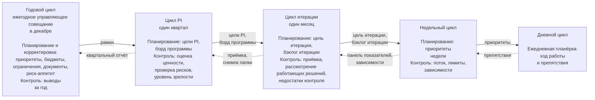
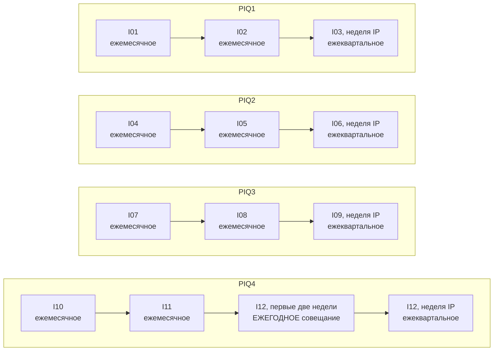
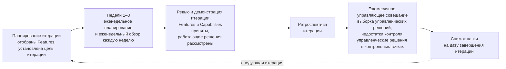
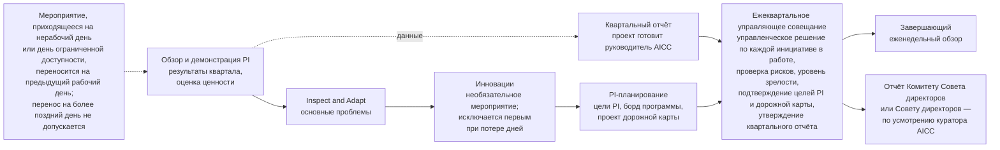

```yaml
source: charter/en/guides/cadence-guide.md
source_sha256: be369276ca2f7047d2231bfe099bbeabe86f67b03c22ae8cf554a630aa2c61e5
translation_status: reviewed
```

# Руководство по рабочему циклу

## 1. Назначение и область применения

Настоящее руководство объясняет рабочий цикл AICC: какие мероприятия проводятся, для чего проводится каждое из них и какие рабочие документы остаются по его итогам. Руководство применяется к каждой инициативе и к контролю деятельности AICC как подразделения. Работа планируется и ведётся по программным инкрементам (PI) продолжительностью один квартал. PI состоит из трёх итераций; каждая итерация — календарный месяц из четырёх или пяти полных недель, а последняя неделя третьей итерации — неделя инноваций и планирования (неделя IP). Каждая неделя начинается с планирования и завершается обзором. Workflow «Рабочий цикл» показывает общий порядок без дат, а даты, в том числе нерабочие дни и дни ограниченной доступности, ведутся в календаре.

## 2. Периоды рабочего цикла и рабочие документы по их итогам

| Период | Мероприятия | Предмет контроля | Рабочий документ по итогам |
| --- | --- | --- | --- |
| День | Ежедневная планёрка | Ход работы и препятствия | Отдельный рабочий документ не ведётся; препятствие отмечается в задаче |
| Неделя | Еженедельное планирование, еженедельный обзор | Поток работ, WIP-лимиты, зависимости, ведение воронки и бэклога портфеля | Актуальные борды и панель показателей |
| Итерация | Планирование итерации, ревью и демонстрация итерации, ретроспектива итерации и ежемесячное управляющее совещание | Работа месяца; приёмка Features и Capabilities владельцем продукта; рассмотрение каждого работающего решения владельцем его направления; управленческие решения в контрольных точках, срок которых наступил; выборка управленческих решений руководителя AICC; неустранённые недостатки контроля | Итоги управляющего совещания; отметка о каждой приёмке в бэклоге; отметка о каждом рассмотрении в описании решения; снимок папки на дату завершения итерации |
| Программный инкремент | Обзор и демонстрация PI, Inspect and Adapt, PI-планирование и ежеквартальное управляющее совещание | Ценность, созданная за квартал; управленческое решение по каждой инициативе в работе; четыре сигнала каждого сервиса; ежеквартальная проверка рисков, пересмотр прав доступа и сверка инцидентов AI; подтверждение целей PI и дорожной карты | Квартальный отчёт; снимок папки на дату завершения PI; итоги управляющего совещания |
| Год | Ежегодное управляющее совещание, которым является ежемесячное управляющее совещание декабря | Направление работы на следующий год: документы, Заявление о риск-аппетите в отношении AI, назначения, стратегические приоритеты, инвестиционные бюджеты и инвестиционные ограничения | Протоколы решений; реестр назначений; список приоритетов |

## 3. Циклы управления в составе рабочего цикла

На рисунке 1 циклы показаны как единая система вложенных циклов. Каждый цикл работает в рамках, заданных вышестоящим циклом, и возвращает ему подтверждающие материалы.



Рисунок 1. Вложенные циклы, из которых складывается рабочий цикл: рамки передаются сверху вниз, подтверждающие материалы — снизу вверх.

Циклы контроля, установленные разделом 6 Операционной модели, и циклы портфеля, установленные разделом 4 Модели управления портфелем, проводятся на мероприятиях рабочего цикла; дополнительные совещания не вводятся. На еженедельном обзоре выполняются операционный цикл и цикл ведения бэклога. На ежемесячном управляющем совещании выполняются цикл контроля и цикл синхронизации портфеля, на ежеквартальном — цикл подтверждения надлежащего функционирования и цикл обзора портфеля. Ежегодным управляющим совещанием является ежемесячное управляющее совещание декабря, которое проводится в первые две недели месяца; на нём дополнительно выполняются цикл определения направления и стратегический цикл.

## 4. Порядок работы в течение месяца, квартала и года

На рисунке 2 показаны управляющие совещания года: по одной строке на каждый программный инкремент в порядке их следования. В месяце, на который приходится неделя IP, вместо ежемесячного управляющего совещания проводится ежеквартальное. В декабре в первые две недели проводится ежегодное управляющее совещание — в дополнение к ежеквартальному управляющему совещанию недели IP.



Рисунок 2. Управляющие совещания года.

**Месяц.**

- Месяц начинается с планирования итерации, на котором команда отбирает Features месяца.
- По понедельникам команда планирует неделю, по пятницам подводит её итоги.
- Последняя неделя месяца — неделя обзора. На ней проводятся ревью и демонстрация итерации, на котором владелец продукта принимает Features и Capabilities, а владелец направления рассматривает каждое работающее решение; ретроспектива итерации; ежемесячное управляющее совещание — в день, согласованный с участниками вне AICC.
- По завершении итерации делается снимок папки.

На рисунке 3 показан порядок работы в течение месяца.



Рисунок 3. Порядок работы в течение месяца.

**Квартал.** На неделе IP мероприятия проводятся в следующем порядке.

- На обзоре и демонстрации PI показываются результаты квартала.
- На Inspect and Adapt решаются основные проблемы квартала.
- В рамках инноваций выделяется время на обучение.
- На PI-планировании определяются намерения и направление работы на следующий PI.
- Руководитель AICC готовит проект квартального отчёта по данным обзора и демонстрации PI и выносит его на ежеквартальное управляющее совещание.
- На ежеквартальном управляющем совещании рассматриваются квартальный отчёт и четыре сигнала каждого сервиса, принимаются управленческие решения по каждой инициативе в работе и по переходу сервиса, если его требуют результаты рассмотрения сигналов, рассматриваются результаты ежеквартальной проверки рисков, подтверждаются уровень зрелости, цели PI и дорожная карта.
- Куратор AICC утверждает квартальный отчёт на ежеквартальном управляющем совещании и определяет, направлять ли его Комитету Совета директоров или Совету директоров. Отчёт направляется по усмотрению куратора AICC, когда это целесообразно или когда этого требует Совет директоров; ежеквартальное направление отчёта не требуется.
- В месяце, на который приходится неделя IP, ежеквартальное управляющее совещание одновременно является управляющим совещанием этого месяца, и отдельное ежемесячное управляющее совещание не проводится, кроме декабря.

На рисунке 4 показан порядок проведения недели IP и перенос мероприятия, приходящегося на недоступный день.



Рисунок 4. Неделя IP и перенос мероприятия, приходящегося на недоступный день.

**Год.**

- В первые две недели декабря ежемесячное управляющее совещание проводится как ежегодное.
- На нём рассматриваются квартальный отчёт за PIQ3 и выводы, сделанные за год на эту дату.
- На нём устанавливаются стратегические приоритеты, инвестиционные бюджеты и инвестиционные ограничения на следующий год, а также пересматриваются документы и риск-аппетит.
- После этого на ежеквартальном управляющем совещании недели IP в декабре выполняются только цикл подтверждения надлежащего функционирования и цикл обзора портфеля. Изменение рамок, которого требуют результаты PIQ4, рассматривается на первом ежеквартальном управляющем совещании следующего года.

## 5. Особые календарные ситуации

| Ситуация | Порядок действий |
| --- | --- |
| Мероприятие приходится на нерабочий день или день ограниченной доступности | Мероприятие переносится на предыдущий рабочий день; перенос на более поздний день не допускается |
| Неделя IP приходится на нерабочие дни или дни ограниченной доступности | Сроки недели IP определяются календарём (п. 6.1 Модели жизненного цикла решений) |
| Год заканчивается на неделе IP | В календаре неделя IP может быть установлена раньше, а последняя неделя года оставлена свободной от мероприятий |
| Мероприятие пропущено | Позднее оно не проводится; его задачи решаются на следующем мероприятии |
| В команде не более трёх человек | Применяется облегчённый режим: одна еженедельная встреча и меньше мероприятий |
| На месяц приходится неделя IP | Ежеквартальное управляющее совещание, завершающее неделю IP, одновременно является управляющим совещанием этого месяца, кроме декабря: в декабре ежемесячное управляющее совещание проводится в первые две недели как ежегодное |

## 6. Источники правил

Раздел 6 Модели жизненного цикла решений; раздел 6 Операционной модели; раздел 4 Модели управления портфелем; workflow «Рабочий цикл»; календарь.
