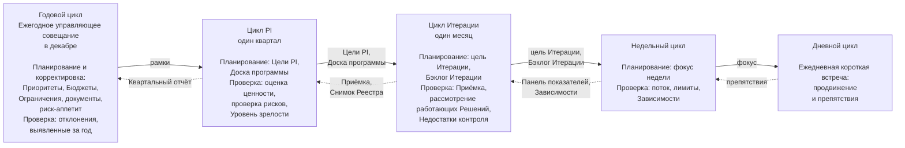
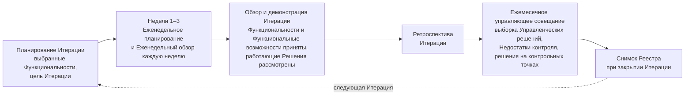
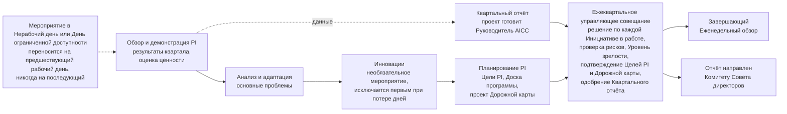

```yaml
source: charter/en/guides/cadence-guide.md
source_sha256: 6a90108f914c0e9847aca80a28495b1a8ed7b7e863f38324712978943b191555
translation_status: reviewed
```

# Руководство: Ритм работы

## 1. Назначение и область применения

Руководство объясняет ритм работы AICC: какие мероприятия проводятся, для чего они нужны и что фиксируется по их итогам. Оно применяется к каждой Инициативе и к контролю AICC как подразделения. Работа ведётся Программными инкрементами (PI) продолжительностью один квартал. PI состоит из трёх Итераций; каждая соответствует одному календарному месяцу из четырёх или пяти полных недель. Последняя неделя третьей Итерации — Неделя инноваций и планирования (IP). Каждая неделя начинается планированием и завершается обзором. Рабочий процесс «Ритм работы» показывает общий порядок без дат; даты с Нерабочими днями и Днями ограниченной доступности ведутся в Записи о Календаре.

## 2. Периоды, мероприятия и Записи

| Период | Мероприятия | Что контролируется | Остающаяся Запись |
| --- | --- | --- | --- |
| День | Ежедневная короткая встреча | Продвижение и препятствия | Отдельной записи нет; препятствие вносится в Рабочую задачу |
| Неделя | Еженедельное планирование, Еженедельный обзор | Поток, Лимиты незавершённой работы, Зависимости, ведение воронки и Бэклога портфеля | Актуальные доски и Панель показателей |
| Итерация | Планирование Итерации, Обзор и демонстрация Итерации, Ретроспектива Итерации и Ежемесячное управляющее совещание | Работа месяца; Приёмка Функциональностей и Функциональных возможностей Владельцем продукта; рассмотрение каждого работающего Решения его Владельцем Домена; наступившие решения на контрольных точках; выборка Управленческих решений Руководителя AICC; незакрытые Недостатки контроля | Итоги Управляющего совещания; отметка каждой Приёмки в бэклоге; отметка каждого рассмотрения в Описании решения; Снимок Реестра при закрытии Итерации |
| Программный инкремент | Обзор и демонстрация PI, Анализ и адаптация, Планирование PI и Ежеквартальное управляющее совещание | Ценность за квартал; решение по каждой Инициативе в состоянии «В работе»; четыре сигнала каждого Сервиса; ежеквартальная проверка рисков, проверка доступа и сверка Инцидентов ИИ; подтверждение Целей PI и Дорожной карты | Квартальный отчёт; Снимок Реестра при закрытии PI; Итоги Управляющего совещания |
| Год | Ежегодное управляющее совещание, являющееся Ежемесячным управляющим совещанием декабря | Направление на следующий год: документы, Заявление о риск-аппетите в отношении ИИ, назначения, Стратегические приоритеты, Инвестиционные бюджеты и Инвестиционные ограничения | Записи о решениях; Запись о назначениях; Запись о приоритетах |

## 3. Циклы по периодам

Рисунок 1 показывает циклы как единую вложенную систему. Каждый цикл получает рамки от вышестоящего цикла и возвращает ему подтверждающие материалы.



Рисунок 1: вложенные циклы ритма работы; рамки передаются вниз, подтверждающие материалы — вверх.

Циклы контроля из Операционной модели 6 и циклы портфеля из Модели управления портфелем 4 выполняются в этом ритме и не создают дополнительных встреч. Еженедельный обзор совмещает операционный цикл и цикл ведения бэклога. Ежемесячное управляющее совещание совмещает цикл контроля и синхронизацию портфеля. Ежеквартальное управляющее совещание совмещает цикл подтверждения надлежащего функционирования и обзор портфеля. Ежегодное управляющее совещание — Ежемесячное управляющее совещание декабря, проводимое в первые две недели месяца; оно дополнительно охватывает цикл определения направления и стратегический цикл.

## 4. Порядок работы месяца, квартала и года

Рисунок 2 показывает Управляющие совещания года: по одной строке на каждый Программный инкремент в последовательном порядке. В месяце с Неделей IP Ежеквартальное управляющее совещание заменяет Ежемесячное. В декабре Ежегодное управляющее совещание проводится в первые две недели дополнительно к Ежеквартальному управляющему совещанию Недели IP.


Рисунок 2: Управляющие совещания года.

**Месяц.**

- Месяц начинается с Планирования Итерации, на котором Команда выбирает Функциональности месяца.
- Каждый понедельник и пятницу Команда планирует и подводит итоги недели.
- Последняя неделя — неделя обзора. На ней проходят Обзор и демонстрация Итерации, где Владелец продукта принимает Функциональности и Функциональные возможности, а Владелец Домена рассматривает каждое работающее Решение; Ретроспектива Итерации; Ежемесячное управляющее совещание в день, согласованный с участниками вне AICC.
- При закрытии делается Снимок Реестра.

Рисунок 3 показывает порядок работы месяца.



Рисунок 3: порядок работы месяца.

**Квартал.** В Неделю IP мероприятия проходят в следующем порядке.

- Обзор и демонстрация PI показывает результаты квартала.
- Анализ и адаптация направлены на решение основных проблем квартала.
- Инновации предоставляют время для обучения.
- Планирование PI определяет замысел и направление следующего PI.
- Руководитель AICC готовит проект Квартального отчёта по данным Обзора и демонстрации PI и выносит его на Ежеквартальное управляющее совещание.
- Ежеквартальное управляющее совещание рассматривает Квартальный отчёт и четыре сигнала каждого Сервиса, принимает решение по каждой Инициативе в состоянии «В работе» и по переходу Сервиса, если этого требуют сигналы, рассматривает ежеквартальную проверку рисков, подтверждает Уровень зрелости, Цели PI и Дорожную карту.
- Куратор AICC одобряет Квартальный отчёт на Ежеквартальном управляющем совещании и направляет его Комитету Совета директоров.
- В месяце с Неделей IP Ежеквартальное управляющее совещание одновременно является Управляющим совещанием месяца; отдельное Ежемесячное управляющее совещание не проводится, за исключением декабря.

Рисунок 4 показывает порядок Недели IP и действия при недоступном дне.



Рисунок 4: Неделя IP и порядок переноса мероприятия с недоступного дня.

**Год.**

- В первые две недели декабря Ежемесячное управляющее совещание проводится как Ежегодное.
- Оно рассматривает Квартальный отчёт PIQ3 и отклонения, выявленные за год к этому моменту.
- Оно устанавливает Стратегические приоритеты, Инвестиционные бюджеты и Инвестиционные ограничения, а также пересматривает документы и риск-аппетит на следующий год.
- Ежеквартальное управляющее совещание Недели IP в декабре после этого охватывает только цикл подтверждения надлежащего функционирования и обзор портфеля. Изменение рамок, необходимое по результатам PIQ4, рассматривается на первом Ежеквартальном управляющем совещании следующего года.

## 5. Исключения при календарных ограничениях

| Ситуация | Порядок действий |
| --- | --- |
| Мероприятие выпадает на Нерабочий день или День ограниченной доступности | Оно переносится на предшествующий рабочий день, никогда на последующий |
| Неделя IP отмечена как нерабочая или с ограниченной доступностью | Положение Недели IP определяется Записью о Календаре (Модель жизненного цикла решений 6.1) |
| Год заканчивается в Неделю IP | Запись о Календаре может установить Неделю IP раньше и оставить последнюю неделю года без мероприятий |
| Мероприятие пропущено | Позднее оно не проводится; его назначение охватывается следующим мероприятием |
| В Команде не более трёх человек | Применяется Облегчённый режим: одна еженедельная встреча и меньше мероприятий |
| Месяц содержит Неделю IP | Завершающее Неделю IP Ежеквартальное управляющее совещание одновременно является Управляющим совещанием месяца, кроме декабря, когда Ежемесячное проводится в первые две недели как Ежегодное |

## 6. Источники правил

Модель жизненного цикла решений 6; Операционная модель 6; Модель управления портфелем 4; рабочий процесс «Ритм работы»; Запись о Календаре.
