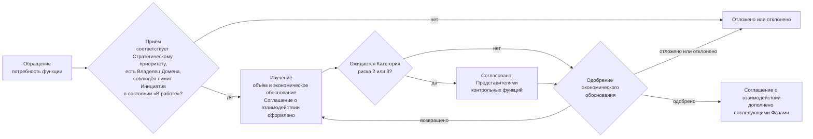
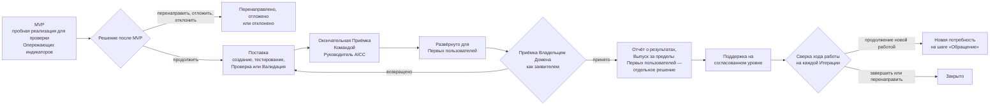
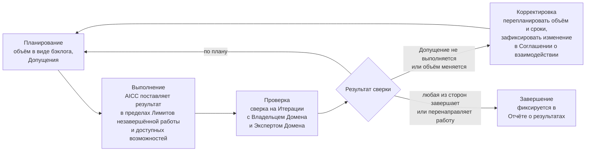
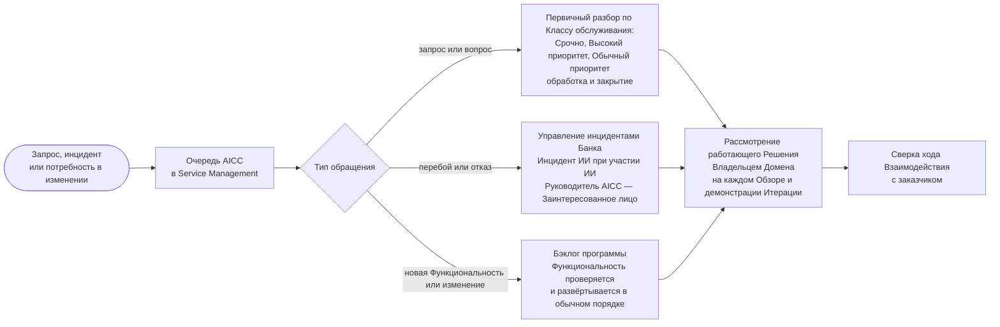

```yaml
source: charter/en/guides/engagement-guide.md
source_sha256: f163dcb4a595349f1b581dc3968f61eb15e9468b92c679a70ccb7af2c89cfcfe
translation_status: reviewed
```

# Руководство: Взаимодействие с заказчиком

## 1. Назначение и область применения

Руководство объясняет, как AICC работает с функцией Банка. AICC действует как внутреннее консалтинговое подразделение: функция обращается с потребностью, AICC принимает обязательства по Взаимодействию с заказчиком в Соглашении о взаимодействии, предоставляет результат с подтверждающими материалами и поддерживает его на согласованном уровне. Руководство применяется к каждому Взаимодействию с заказчиком — от краткого исследования до Сервиса, который эксплуатирует AICC, — и к Текущим работам. Правила установлены Бизнес-моделью, Моделью управления портфелем, Моделью жизненного цикла решений и Политикой применения искусственного интеллекта; собственных правил руководство не устанавливает.

## 2. Участники

| Роль | Участие во Взаимодействии с заказчиком |
| --- | --- |
| Владелец Домена | Представляет функцию-заказчика; одобряет экономическое обоснование в пределах одного Домена и ниже Инвестиционного ограничения; оценивает работающее Решение и принимает его как заявитель; подтверждает эффект |
| Эксперт Домена | Партнёр со стороны функции, работающий с AICC |
| Руководитель AICC | Принимает потребность к рассмотрению; составляет экономическое обоснование совместно с Владельцем Домена; оформляет Соглашение о взаимодействии; проводит окончательную Приёмку Командой до развёртывания Решения для Первых пользователей; составляет Отчёт о результатах |
| Инженер решений | Проектирует, создаёт и эксплуатирует Решение совместно с Экспертом Домена |
| Куратор AICC | Выступает заказчиком Обеспечивающих работ; одобряет Паспорт инициативы каждой Постоянной инициативы, а также работу, превышающую Инвестиционное ограничение или охватывающую несколько Доменов |
| Представители контрольных функций | Согласовывают экономическое обоснование, если ожидается Категория риска 2 или 3, проводят Валидацию Решения и вправе остановить его |
| Заинтересованные лица и другие руководители функций | Получают уведомления и не принимают на себя обязательств |

## 3. Как функция начинает взаимодействие

Руководитель функции обращается с потребностью к Руководителю AICC в любой форме: в разговоре, сообщением или заявкой в Service Management. Руководитель AICC указан в Записи о назначениях. Он вносит потребность в Бэклог портфеля и принимает её к рассмотрению, если она соответствует Стратегическому приоритету, имеет функцию-заказчика с Владельцем Домена и допускается лимитом Инициатив в состоянии «В работе» (Бизнес-модель 7.2). В противном случае потребность откладывается или отклоняется.

При приёме определяются категория услуги и режим работы. Руководитель AICC фиксирует проблему, размер работ, ожидаемую Категорию риска, категорию услуги и режим, а сначала проверяет, не покрывает ли потребность уже имеющееся Решение или Пакет из каталога (Бизнес-модель 7.2). Категории услуг и обычный для каждой режим приведены в Бизнес-модели 4.5. Небольшой повторяемый запрос, выполнимый за одну Итерацию, относится к Текущим работам: Руководитель AICC принимает его на Еженедельном обзоре как Функциональность Постоянной инициативы соответствующего направления услуг после одобрения Владельцем Домена применения для соответствующего Класса данных. Отдельные Паспорт инициативы, Соглашение о взаимодействии и Отчёт о результатах не требуются (Бизнес-модель 4.8). Любая иная потребность оформляется как Инициатива и проходит путь, описанный в разделе 4.

## 4. Как проходит Взаимодействие с заказчиком

Рисунок 1 показывает путь от первого обращения до одобрения экономического обоснования и решения, определяющие этот путь.



Рисунок 1: путь Взаимодействия с заказчиком от обращения до одобрения.

Рисунок 2 показывает путь от одобрения экономического обоснования до закрытия.



Рисунок 2: путь Взаимодействия с заказчиком от MVP до закрытия.

Взаимодействие с заказчиком проходит шесть шагов соответствующего рабочего процесса. В таблице указаны каждый шаг, действующее лицо, срок и остающаяся Запись. Текущие работы проходят те же шаги в сокращённом виде, как показано в рабочем процессе «Взаимодействие с заказчиком».

| Шаг | Действие | Кто | Когда | Остающаяся Запись |
| --- | --- | --- | --- | --- |
| Обращение | Функция заявляет потребность либо AICC выявляет её | Любой участник; Руководитель AICC принимает её к рассмотрению | В любое время | Запись в Бэклоге портфеля |
| Изучение | Определяется объём потребности, составляется экономическое обоснование и согласовывается Представителями контрольных функций, если ожидается Категория риска 2 или 3 | Руководитель AICC совместно с Владельцем Домена | В начале изучения | Паспорт инициативы с согласованиями |
| Соглашение о взаимодействии | AICC фиксирует свои обязательства | Руководитель AICC; функция получает уведомление | Оформляется в начале изучения и дополняется после одобрения экономического обоснования | Соглашение о взаимодействии |
| Поставка | Первое Решение испытывается как пробная реализация (MVP); после решения продолжить оно создаётся, проверяется и развёртывается для Первых пользователей | Инженер решений совместно с Экспертом Домена; Руководитель AICC проводит окончательную Приёмку Командой | В Итерациях Программного инкремента | Описание решения, решение после MVP, Заключение контрольной функции и Раздел о Выпуске |
| Отчёт о результатах | Представляется результат; Владелец Домена, а для Обеспечивающих работ — Куратор AICC, принимает его | Руководитель AICC оформляет; Владелец Домена принимает | По завершении Взаимодействия с заказчиком | Отчёт о результатах |
| Поддержка | Решение поддерживается на согласованном уровне; при каждой сверке Взаимодействие с заказчиком продолжается, завершается или перенаправляется; последующая работа возвращается на шаг «Обращение» как новая потребность | Инженер решений; Руководитель AICC совместно с Владельцем Домена — для последующей работы | После поставки и при сверке на каждой Итерации | Записи Service Management, Разбор Инцидента ИИ и новая запись либо закрытие |

## 5. Обязательства на практике

Соглашение о взаимодействии состоит из двух частей. Обязательства определяют Фазы, уровень поддержки, объём и исключения из него, результаты поставки и критерии их завершённости, Допущения, сверку хода работы и завершение. Рабочие договорённости определяют участников и сроки их работы, порядок коммуникации и принятия решений между AICC и функцией, уведомляемых лиц, обращение с данными, эскалацию проблем и отчётность о ходе работы. AICC прилагает максимально возможные усилия для достижения результата в пределах доступных ему возможностей; функция не принимает на себя обязательств. Условия со стороны функции, на которые опирается AICC, фиксируются как Допущения.

Рисунок 3 показывает Соглашение о взаимодействии как цикл, выполняемый на каждой Итерации.



Рисунок 3: цикл Соглашения о взаимодействии.

## 6. После поставки

Участие AICC после поставки определяется для каждого Взаимодействия с заказчиком и закрепляется в Соглашении о взаимодействии. Из него следует тип Решения.

| Уровень поддержки | Действия AICC | Тип Решения |
| --- | --- | --- |
| Отсутствует | Передаёт Решение вместе с Отчётом о результатах | Эксперимент либо переданный Продукт |
| По запросу | Отвечает на запросы и выпускает новые версии по обращению | Продукт |
| С согласованными целевыми сроками реагирования | Поддерживает в соответствии с целевыми сроками, установленными Соглашением о взаимодействии | Сервис |
| Эксплуатация силами AICC | Эксплуатирует Решение на протяжении всего его жизненного цикла с учётом Эксплуатационных затрат и Правила вывода из эксплуатации | Сервис |

Рисунок 4 показывает обработку запроса, инцидента и изменения после поставки. Целевые сроки реагирования являются целевыми показателями, а не гарантиями.



Рисунок 4: поддержка, инцидент и изменение после поставки.

## 7. Ситуации

| Ситуация | Порядок действий |
| --- | --- |
| Допущение не выполняется, например Эксперт Домена недоступен | AICC перепланирует объём и сроки и фиксирует изменение в Соглашении о взаимодействии; элемент находится в состоянии «Ожидание» |
| Функция хочет изменить объём | Порядок бэклога можно менять в любое время в пределах Лимитов незавершённой работы; выходящее за эти пределы изменение требует нового Взаимодействия с заказчиком или изменения Соглашения |
| Любая из сторон хочет прекратить работу | Взаимодействие с заказчиком завершается или перенаправляется в конце Итерации; это фиксируется в Отчёте о результатах |
| Достигнут лимит Инициатив в состоянии «В работе» | Новое Соглашение о взаимодействии сверх лимита не оформляется; элемент ожидает в Бэклоге портфеля |
| Запрос или инцидент поступает после поставки | Он поступает через Service Management; целевые сроки реагирования являются целевыми показателями, а не гарантиями |
| Запрос в рамках Текущих работ нельзя выполнить за одну Итерацию | Он возвращается на шаг «Обращение» и принимается как Инициатива (Бизнес-модель 4.8) |

## 8. Чем AICC не занимается

Ограничения AICC установлены в Положении об AICC 3.2. AICC не владеет Платформой ИИ и не эксплуатирует её, не отвечает за бизнес-результаты Домена, не устанавливает правила Контрольной функции, не проводит Валидацию собственной работы и не решает вопросы, отнесённые нормативными документами Банка к полномочиям Совета директоров, руководства или Контрольной функции. AICC не является Контрольной функцией или платформенной командой Банка и не эксплуатирует Решение в масштабе Банка: Решение, которое Банк внедряет в таком масштабе, передаётся Получателю (Бизнес-модель 2.5). Когда AICC готовит для функции стратегию, положение или нормативный документ, функция отвечает за его содержание (Бизнес-модель 4.10). Категория услуги сама по себе не создаёт обязательства: AICC принимает обязательства только в Соглашении о взаимодействии (Бизнес-модель 4.6).

## 9. Источники правил

Положение об AICC 3.2; Бизнес-модель 2–7; Модель управления портфелем 5–7; Модель жизненного цикла решений 7.3, 8.1, 8.4, 8.5; Политика применения искусственного интеллекта 5; рабочий процесс «Взаимодействие с заказчиком».
