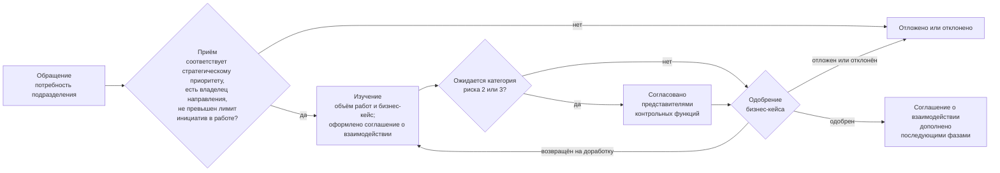
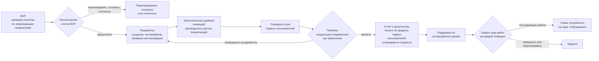
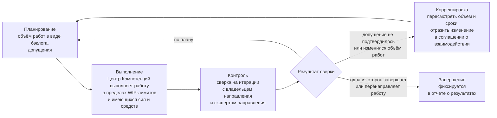
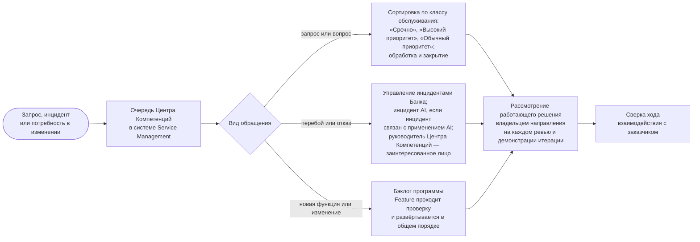

```yaml
source: charter/en/guides/engagement-guide.md
source_sha256: 0435028e3c5455041ef6feefb3e9746afeacbd8a5d0c301e733ef987aa1546d7
translation_status: reviewed
```

# Руководство по взаимодействию с заказчиком

## 1. Назначение и область применения

Настоящее руководство объясняет, как Центр Компетенций работает с подразделениями Банка. Центр Компетенций действует как внутренний консалтинговый центр: подразделение обращается с потребностью, Центр Компетенций принимает обязательства по взаимодействию с заказчиком в соглашении о взаимодействии, передаёт результат вместе с подтверждающими материалами и поддерживает его на согласованном уровне. Руководство применяется к каждому взаимодействию с заказчиком — от краткого исследования до сервиса, который эксплуатирует Центр Компетенций, — а также к текущим работам. Правила установлены Бизнес-моделью, Моделью управления портфелем, Моделью жизненного цикла решений и Политикой применения AI; собственных правил руководство не устанавливает.

## 2. Участники

| Роль | Участие во взаимодействии с заказчиком |
| --- | --- |
| Владелец направления | Представляет подразделение-заказчика; одобряет бизнес-кейс, если работа не выходит за пределы одного направления и инвестиционных ограничений; оценивает работающее решение и принимает его как заявитель; подтверждает выгоду |
| Эксперт направления | Представитель подразделения, который работает вместе с Центром Компетенций |
| Руководитель Центра Компетенций | Принимает потребность в проработку; составляет бизнес-кейс совместно с владельцем направления; оформляет соглашение о взаимодействии; проводит окончательную приёмку командой до развёртывания решения для первых пользователей; составляет отчёт о результатах |
| Инженер решений | Проектирует, создаёт и эксплуатирует решение совместно с экспертом направления |
| Куратор Центра Компетенций | Выступает заказчиком обеспечивающих работ; одобряет паспорт каждой постоянной инициативы, а также работу, которая выходит за пределы инвестиционных ограничений или затрагивает несколько направлений |
| Представители контрольных функций | Согласовывают бизнес-кейс, если ожидается категория риска 2 или 3, проводят валидацию решения и вправе остановить его |
| Заинтересованные лица и другие руководители подразделений | Получают уведомления и обязательств не принимают |

## 3. Начало взаимодействия

Руководитель подразделения обращается с потребностью к руководителю Центра Компетенций в любой форме: устно, сообщением или заявкой в системе Service Management. Руководитель Центра Компетенций указан в реестре назначений. Он вносит потребность в бэклог портфеля и принимает её в проработку, если она соответствует стратегическому приоритету, у неё есть подразделение-заказчик с владельцем направления и лимит инициатив в работе это допускает (п. 7.2 Бизнес-модели). В противном случае потребность откладывается или отклоняется.

При приёме обращения для потребности определяются категория услуг и режим. Руководитель Центра Компетенций фиксирует проблему, объём работ, ожидаемую категорию риска, категорию услуг и режим, но прежде выясняет, нет ли в каталоге решения или пакета, которые уже отвечают этой потребности (п. 7.2 Бизнес-модели). Категории услуг и обычный для каждой из них режим приведены в пункте 4.5 Бизнес-модели. Небольшой повторяющийся запрос, который можно выполнить за одну итерацию, относится к текущим работам: после того как владелец направления одобрил такое применение для соответствующего класса данных, руководитель Центра Компетенций на еженедельном обзоре принимает запрос в работу как Feature постоянной инициативы соответствующего направления услуг. Отдельные паспорт инициативы, соглашение о взаимодействии и отчёт о результатах для такого запроса не оформляются (п. 4.8 Бизнес-модели). Любая другая потребность оформляется как инициатива и проходит путь, описанный в разделе 4.

## 4. Ход взаимодействия с заказчиком

На рисунке 1 показан путь взаимодействия с заказчиком от первого обращения до одобрения бизнес-кейса и точки, в которых принимаются управленческие решения, определяющие этот путь.



Рисунок 1. Путь взаимодействия с заказчиком от обращения до одобрения бизнес-кейса.

На рисунке 2 показан путь от одобрения бизнес-кейса до закрытия взаимодействия.



Рисунок 2. Путь взаимодействия с заказчиком от MVP до закрытия.

Взаимодействие с заказчиком проходит шесть шагов workflow «Взаимодействие с заказчиком». Шаги, участники, сроки и рабочие документы, которые остаются по итогам каждого шага, приведены в следующей таблице. Текущие работы проходят те же шаги в сокращённом виде, как показано в workflow «Взаимодействие с заказчиком».

| Шаг | Содержание | Участники | Срок | Рабочий документ по итогам шага |
| --- | --- | --- | --- | --- |
| Обращение | Подразделение заявляет потребность либо Центр Компетенций сам выявляет её | Любой работник; руководитель Центра Компетенций принимает потребность в проработку | В любое время | Элемент бэклога портфеля |
| Изучение | Определяется объём потребности, составляется бизнес-кейс; если ожидается категория риска 2 или 3, его согласовывают представители контрольных функций | Руководитель Центра Компетенций совместно с владельцем направления | С начала изучения | Паспорт инициативы с согласованиями |
| Соглашение о взаимодействии | Центр Компетенций фиксирует свои обязательства | Руководитель Центра Компетенций; подразделение получает уведомление | Оформляется в начале изучения и дополняется после одобрения бизнес-кейса | Соглашение о взаимодействии |
| Разработка | Первое решение испытывается в форме MVP для проверки гипотезы; если работу решено продолжить, решение создаётся, проходит проверку и развёртывается для первых пользователей | Инженер решений совместно с экспертом направления; руководитель Центра Компетенций проводит окончательную приёмку командой | В итерациях программного инкремента (PI) | Описание решения, управленческое решение по итогам MVP, заключение контрольной функции и раздел о выпуске |
| Отчёт о результатах | Подготавливается отчёт о достигнутом результате; его принимает владелец направления, а по обеспечивающим работам — куратор Центра Компетенций | Руководитель Центра Компетенций оформляет отчёт; владелец направления принимает его | По завершении взаимодействия с заказчиком | Отчёт о результатах |
| Поддержка | Решение поддерживается на согласованном уровне; при каждой сверке хода работ взаимодействие с заказчиком продолжается, завершается или перенаправляется, а последующая работа возвращается на шаг «Обращение» как новая потребность | Инженер решений; по последующей работе — руководитель Центра Компетенций совместно с владельцем направления | На этапе пост-внедрения и при сверке хода работ на каждой итерации | Записи в системе Service Management, разбор инцидента AI, новый элемент бэклога портфеля либо закрытие взаимодействия |

## 5. Обязательства по соглашению о взаимодействии

Соглашение о взаимодействии состоит из двух частей. В части об обязательствах указываются фазы, уровень поддержки, объём работ и то, что в него не входит, передаваемые результаты и критерии их завершённости, допущения, порядок сверки хода работ и условия завершения. В рабочей договорённости указываются участники работы и сроки их участия, порядок взаимодействия и принятия решений между Центром Компетенций и подразделением, лица, получающие уведомления, порядок обращения с данными, порядок эскалации проблем и отчётности о ходе работы. Центр Компетенций добивается результата с приложением усилий в разумных пределах, имеющимися у него силами и средствами; подразделение обязательств не принимает. То, на что Центр Компетенций рассчитывает со стороны подразделения, фиксируется как допущение.

На рисунке 3 соглашение о взаимодействии показано как цикл, который повторяется на каждой итерации.



Рисунок 3. Цикл соглашения о взаимодействии.

## 6. Пост-внедрение

Участие Центра Компетенций на этапе пост-внедрения определяется для каждого взаимодействия с заказчиком и указывается в соглашении о взаимодействии. От него зависит тип решения.

| Уровень поддержки | Действия Центра Компетенций | Тип решения |
| --- | --- | --- |
| Отсутствует | Передаёт решение вместе с отчётом о результатах | Эксперимент либо переданный продукт |
| По запросу | Отвечает на запросы и по запросу выпускает новые версии | Продукт |
| С согласованными целевыми сроками реагирования | Обеспечивает поддержку в пределах целевых сроков, установленных соглашением о взаимодействии | Сервис |
| Эксплуатация силами Центра Компетенций | Эксплуатирует решение на протяжении всего срока его использования с учётом эксплуатационных затрат и правила вывода из эксплуатации | Сервис |

На рисунке 4 показан порядок обработки запроса, инцидента и изменения на этапе пост-внедрения. Целевые сроки реагирования — ориентиры, а не гарантии.



Рисунок 4. Поддержка, инциденты и изменения на этапе пост-внедрения.

## 7. Типовые ситуации

| Ситуация | Порядок действий |
| --- | --- |
| Допущение не подтвердилось, например эксперт направления недоступен | Центр Компетенций пересматривает объём работ и сроки и отражает изменение в соглашении о взаимодействии; элемент находится в состоянии «Ожидание» |
| Подразделение хочет изменить объём работ | Порядок элементов бэклога можно изменить в любое время в пределах WIP-лимитов; изменение, выходящее за пределы объёма работ по соглашению о взаимодействии, оформляется как новое взаимодействие с заказчиком или как изменение этого соглашения |
| Одна из сторон хочет прекратить работу | Взаимодействие с заказчиком завершается или перенаправляется в конце итерации, и это фиксируется в отчёте о результатах |
| Достигнут лимит инициатив в работе | Новое соглашение о взаимодействии сверх лимита не оформляется; элемент ожидает в бэклоге портфеля |
| На этапе пост-внедрения поступает запрос или инцидент | Обращение поступает через систему Service Management; целевые сроки реагирования — ориентиры, а не гарантии |
| Запрос в рамках текущих работ нельзя выполнить за одну итерацию | Запрос возвращается на шаг «Обращение» и принимается в проработку как инициатива (п. 4.8 Бизнес-модели) |

## 8. Ограничения деятельности Центра Компетенций

Ограничения деятельности Центра Компетенций установлены пунктом 3.2 Положения о Центре Компетенций по AI. Центр Компетенций не владеет платформой AI и не эксплуатирует её, не отвечает за бизнес-результаты направления, не устанавливает правила контрольной функции, не проводит валидацию собственной работы и не решает вопросы, которые внутренние нормативные документы Банка относят к компетенции Совета директоров, Правления Банка или контрольной функции. Центр Компетенций не является ни контрольной функцией, ни платформенной командой Банка и не эксплуатирует решения в масштабе Банка: решение, которое Банк внедряет в таком масштабе, передаётся получателю (п. 2.5 Бизнес-модели). Когда Центр Компетенций готовит для подразделения стратегию, положение или иной нормативный документ, за их содержание отвечает подразделение (п. 4.10 Бизнес-модели). Категория услуг сама по себе не является обязательством: Центр Компетенций принимает обязательства только в соглашении о взаимодействии (п. 4.6 Бизнес-модели).

## 9. Источники правил

Пункт 3.2 Положения о Центре Компетенций по AI; разделы 2–7 Бизнес-модели; разделы 5–7 Модели управления портфелем; пункты 7.3, 8.1, 8.4 и 8.5 Модели жизненного цикла решений; раздел 5 Политики применения AI; workflow «Взаимодействие с заказчиком».
