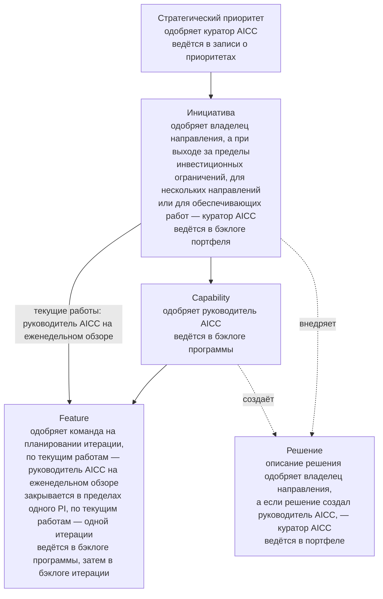
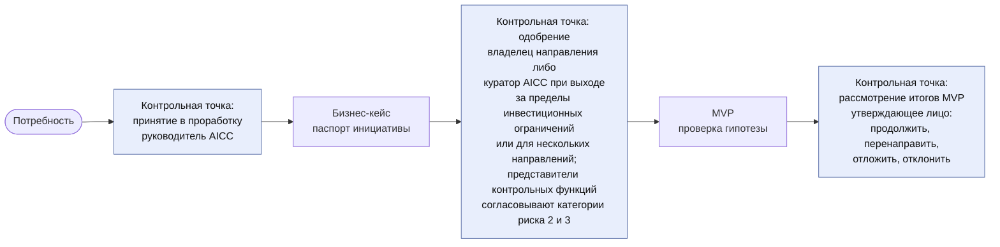
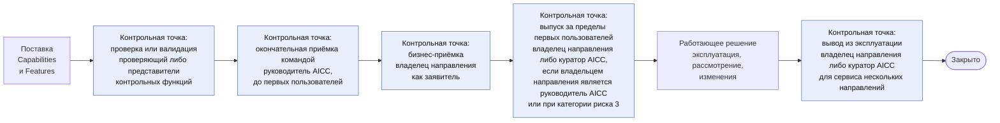
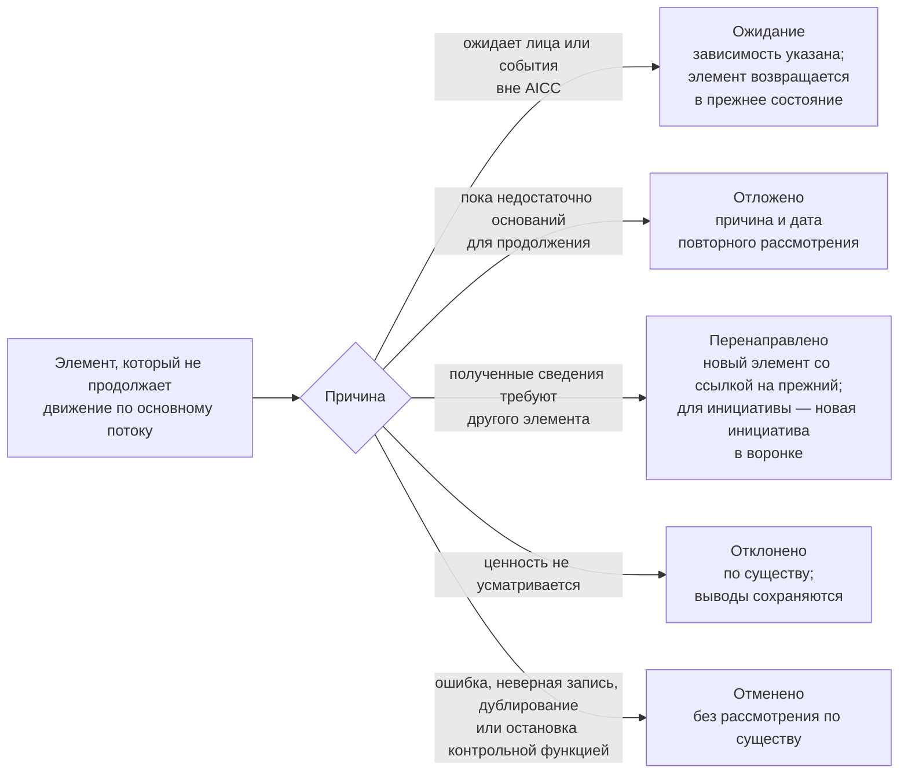
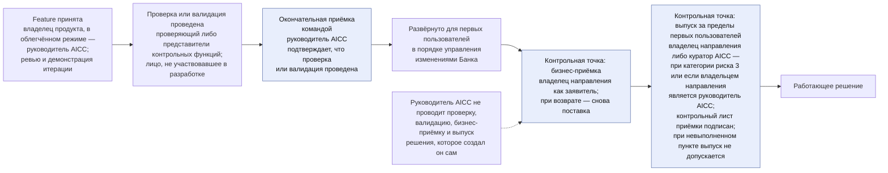

```yaml
source: charter/en/guides/service-delivery-guide.md
source_sha256: 851e19d962a5817851c398d681a0c639f67868d35316dd093de99741b0b83b95
translation_status: reviewed
```

# Руководство по поставке услуг

## 1. Назначение и область применения

Настоящее руководство объясняет, как элемент работы проходит через AICC — от бизнес-потребности до вывода решения из эксплуатации, кто принимает управленческие решения на этом пути и какая запись остаётся после каждого из них. Руководство применяется к каждой инициативе и ко всем входящим в неё элементам. Оно объясняет порядок управления потоком работ: уровни, состояния, стадии и записи. Собственных правил руководство не устанавливает: они содержатся в Операционной модели, Модели управления портфелем, Модели жизненного цикла решений и Политике применения AI. Текущие рекомендации о том, как команда планирует и создаёт решения, меняются вместе с работой; они ведутся в Confluence и в комплекте материалов по управлению портфелем и в корпус нормативных документов AICC не входят.

## 2. Уровни работы и ответственные за них

На рисунке 1 показаны уровни работы, лица, которые одобряют элементы каждого уровня, и место, где ведётся каждый уровень.



Рисунок 1. Уровни работы и ответственные за них.

| Уровень | Содержание | Кто одобряет | Где ведётся |
| --- | --- | --- | --- |
| Стратегический приоритет | Направление, которое куратор AICC определяет по согласованию с Советом директоров | Куратор AICC | Запись о приоритетах |
| Инициатива | Бизнес-программа, в результате которой внедряются решения | Владелец направления; куратор AICC — если работа выходит за пределы инвестиционных ограничений, затрагивает несколько направлений или относится к обеспечивающим работам | Бэклог портфеля |
| Решение | Программное решение или сервис, для которого определены тип, категория риска и получатель | Владелец направления одобряет описание решения | Портфель |
| Capability | Крупная функциональность решения | Руководитель AICC | Бэклог программы |
| Feature | Результат в составе Capability, который закрывается в пределах одного PI; Feature текущих работ входит непосредственно в свою постоянную инициативу и выполняется за одну итерацию | Команда на планировании итерации; по текущим работам — руководитель AICC на еженедельном обзоре | Бэклог программы, затем бэклог итерации |

## 3. Жизненный цикл элемента

Инициатива проходит по канбан-доске портфеля, установленной разделом 5 Модели управления портфелем: «Воронка», «Рассмотрение», «Анализ», «Бэклог портфеля», «MVP», управленческое решение по итогам MVP, «Реализация» и «Выполнено». Каждый элемент находится в одном из тринадцати состояний. Элемент создаётся в состоянии «Предложено», уточняется в состоянии «Проработка», переходит в состояние «Одобрено», когда выполнены необходимые условия, находится в состоянии «В работе», пока над ним работают, и через состояние «На рассмотрении» переходит в состояния «Принято» и «Закрыто». Другие пути охватывают состояния «Ожидание», «Отложено», «Перенаправлено», «Отклонено» и «Отменено». Лицо, которое одобряет элемент на его уровне, также откладывает, отклоняет, отменяет или перенаправляет его. Пока в команде не более трёх человек, в облегчённом режиме применяется сокращённый набор состояний: «Ожидание» остаётся состоянием и отображается флагом, а «Принято» и «Закрыто» объединяются в один шаг.

На рисунке 2 показан путь решения от потребности до управленческого решения по итогам MVP: контрольные точки и лица, которые принимают решения в каждой из них.



Рисунок 2. Путь от потребности до управленческого решения по итогам MVP.

На рисунке 3 показан путь от поставки до закрытия.



Рисунок 3. Путь от поставки до закрытия.

Элемент может выйти из основного потока в любой контрольной точке. Выбор пути показан на рисунке 4. «Отклонено» означает, что элемент рассмотрен по существу и его ценность не усматривается. «Отменено» означает прекращение работы без рассмотрения по существу, например из-за ошибки или дублирования либо в связи с остановкой контрольной функцией.



Рисунок 4. Пути выхода из основного потока.

## 4. Управленческие решения в потоке и лица, которые их принимают

| Управленческое решение | Кто принимает | Когда | Запись |
| --- | --- | --- | --- |
| Принятие элемента в проработку | Руководитель AICC | При переходе из состояния «Предложено» в состояние «Проработка» | Бэклог портфеля |
| Бизнес-кейс | Владелец направления; куратор AICC — если работа выходит за пределы инвестиционных ограничений, затрагивает несколько направлений или относится к обеспечивающим работам; если ожидается категория риска 2 или 3, бизнес-кейс согласуют представители контрольных функций | По завершении проработки инициативы | Паспорт инициативы с согласованиями; запись о решении |
| Принятие в работу из бэклога портфеля | Руководитель AICC | Когда это допускает лимит инициатив в работе | Бэклог портфеля |
| Управленческое решение по итогам MVP | Лицо, одобрившее бизнес-кейс | По завершении MVP | Журнал решений; запись о решении; паспорт инициативы |
| Описание решения и категория риска | Владелец направления одобряет описание; руководитель AICC присваивает категорию риска и сообщает её владельцу направления; если решение создал руководитель AICC, описание одобряет и категорию риска присваивает куратор AICC | При описании решения | Описание решения |
| Применение решения для класса данных | Владелец направления; руководитель AICC — для применения в AICC; куратор AICC — для решения, созданного руководителем AICC | До начала применения | Реестр AI |
| Проверка или валидация | Проверяющий — для категории риска 1; представители контрольных функций — для категорий риска 2 и 3 | До первого развёртывания для реальных пользователей или на реальных данных | Запись в реестре AI — для проверки; заключение контрольной функции — для валидации |
| Приёмка Feature или Capability | Владелец продукта | На ревью и демонстрации итерации | Отметка в бэклоге соответствующего уровня |
| Окончательная приёмка командой | Руководитель AICC | До первого развёртывания решения для первых пользователей, а также до развёртывания существенного изменения | Раздел о выпуске в описании решения |
| Бизнес-приёмка решения | Владелец направления; куратор AICC — для элемента, затрагивающего несколько направлений, для обеспечивающих работ или для эксперимента без направления | Когда решение работает для первых пользователей, до его выпуска | Раздел о выпуске в описании решения; для взаимодействия с заказчиком — также отчёт о результатах |
| Выпуск | Владелец направления либо куратор AICC, если владельцем направления является руководитель AICC; для категории риска 3 — куратор AICC | До применения за пределами круга первых пользователей | Раздел о выпуске в описании решения; контрольный лист приёмки; для категории риска 3 — запись о решении |
| Развёртывание в промышленной среде и изменение выпущенного решения | Одобряется в системе управления изменениями Банка; руководитель AICC определяет, нужны ли новая проверка или валидация | При каждом развёртывании в промышленной среде и при каждом изменении | Номер заявки на изменение и ссылка на результаты тестирования в Feature; описание решения; журнал решений — если определялась необходимость новой проверки |
| Вывод решения из эксплуатации | Владелец направления; куратор AICC — для сервиса, затрагивающего несколько направлений | До перевода решения в состояние «Закрыто» как выведенного из эксплуатации | Описание решения; реестр AI |
| Переход сервиса: передача IT-функции Банка либо вывод из эксплуатации | Владелец направления; куратор AICC — для сервиса, затрагивающего несколько направлений; получатель принимает передачу | По результатам рассмотрения четырёх сигналов на ежеквартальном управляющем совещании | Журнал решений; предложение; описание решения |
| Итог эксперимента: эксперимент принят с фиксацией выводов и закрыт, оформлено предложение либо эксперимент отклонён | Владелец направления; куратор AICC — для эксперимента без направления | По истечении тайм-бокса | Описание решения; предложение, если оно оформлено; для взаимодействия с заказчиком — отчёт о результатах |
| Класс обслуживания запроса | Инженер решений сортирует запрос; в спорных случаях класс определяет руководитель AICC | При поступлении запроса | Заявка в системе Service Management |

На рисунке 5 показано, кто и в каком порядке принимает, проверяет и выпускает решение: проверка или валидация проводится до окончательной приёмки командой, на которой подтверждается её проведение.



Рисунок 5. Приёмка, проверка и выпуск.

## 5. После поставки: три типа решений

У решения один тип, и этот тип определяет его жизненный цикл. Сервис эксплуатирует AICC на протяжении всего срока его использования или до передачи IT-функции Банка; в бизнес-кейсе сервиса указываются эксплуатационные затраты и правило вывода из эксплуатации, а поддержка обеспечивается в пределах согласованных целевых сроков реагирования. Четыре сигнала сервиса — уровень обслуживания, инциденты, использование и затраты — рассматриваются на каждом ревью и демонстрации итерации и на ежеквартальном управляющем совещании. Продукт — версия, созданная для одного потребителя; он поддерживается по запросу и пересматривается через бэклог портфеля. Эксперимент — ограниченное по времени испытание, которое завершается предложением; передача получателю завершена, когда получатель её принимает. AICC также контролирует внедрённые решения, которые внедряют другие участники, и отчитывается о них.

| Тип | Ответственный после поставки | Стадии после поставки | Завершение |
| --- | --- | --- | --- |
| Сервис | AICC | «Эксплуатация», «Развитие», «Вывод из эксплуатации» с детализацией по шагам обслуживания | Выведен из эксплуатации, передан IT-функции Банка либо отменён |
| Продукт | За версию отвечает потребитель; AICC обеспечивает поддержку по запросу | «Передача», «Поддержка», «Пересмотр», «Вывод из эксплуатации» у потребителя | Выведен из эксплуатации у потребителя |
| Эксперимент | Пока не определён | «Испытание», «Предложение», «Передача» | Передан, закрыт с фиксацией выводов либо отклонён |

## 6. Типовые ситуации

| Ситуация | Порядок действий |
| --- | --- |
| Изменение повышает категорию риска | Решение возвращается в состояние «Проработка» для повторного прохождения проверок, которых касается изменение |
| Присвоенная категория риска выше той, которая была согласована в бизнес-кейсе | Бизнес-кейс возвращается представителям контрольных функций на повторное согласование |
| Feature не удаётся закрыть в пределах её PI | Feature разделяется: выполненная часть передаётся на рассмотрение, оставшаяся оформляется как новая Feature следующего PI, а исходная Feature переводится в состояние «Перенаправлено» |
| Зависимость вне AICC блокирует работу | Элемент находится в состоянии «Ожидание» с указанием зависимости |
| Контрольная функция останавливает решение | Решение переводится в состояние «Отменено»; остановка отмене не подлежит |
| Эксперимент достигает окончания тайм-бокса | Эксперимент передаётся на рассмотрение: он принимается с фиксацией выводов, по нему оформляется предложение либо он отклоняется |
| MVP инициативы завершён | Утверждающее лицо продолжает, перенаправляет, откладывает или отклоняет инициативу. При перенаправлении в воронку вносится новая инициатива со ссылкой на прежнюю |
| Сервис целесообразно эксплуатировать в масштабе Банка | Сервис переходит на шаг обслуживания «Переход запланирован». В предложении получателем указывается IT-функция Банка; владелец направления, а для сервиса, затрагивающего несколько направлений, — куратор AICC принимает управленческое решение по результатам рассмотрения четырёх сигналов на ежеквартальном управляющем совещании. Когда получатель принимает передачу, сервис закрывается как переданный, после чего AICC контролирует его как внедрённое решение (пп. 8.8 и 8.11 Модели жизненного цикла решений) |
| Эксперимент подтвердил свою гипотезу | По истечении тайм-бокса эксперимент передаётся на рассмотрение, и оформляется предложение о внедрении решения получателем в масштабе Банка. Тип решения не меняется: последующий сервис — новое решение с собственным бизнес-кейсом (пп. 8.1 и 8.12 Модели жизненного цикла решений) |
| Инциденты или запросы повторяются | Повторный инцидент или запрос отмечается в заявке, а для инцидента AI — в разборе инцидента AI; в рамках управления проблемами устранение причины вносится в бэклог программы как Feature (п. 8.10 Модели жизненного цикла решений) |

## 7. Источники правил

Пункты 4.2 и 4.4 и раздел 5 Операционной модели; разделы 4–8 Модели управления портфелем; разделы 3–10 Модели жизненного цикла решений; разделы 2 и 3 Политики применения AI; workflow «Портфель и поставка услуг».
