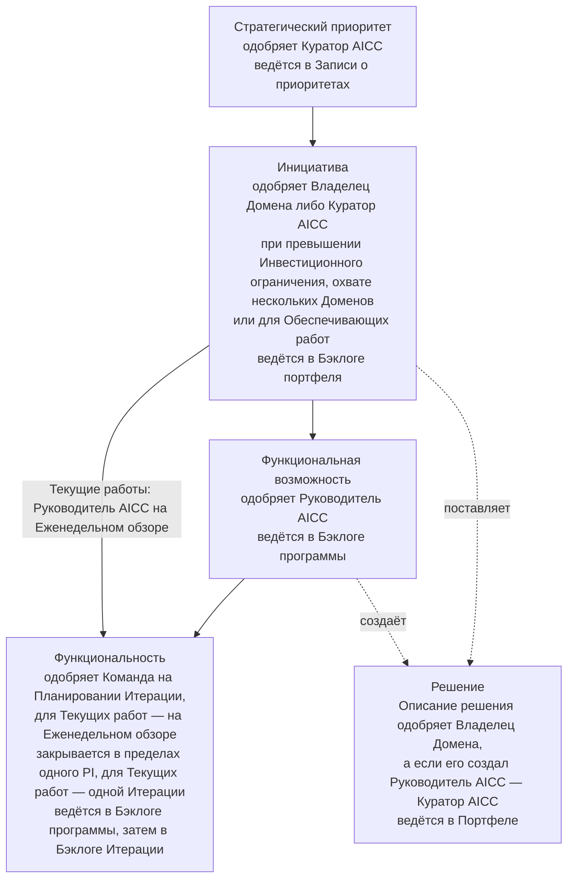
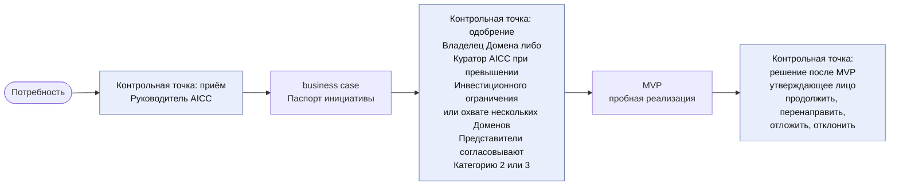
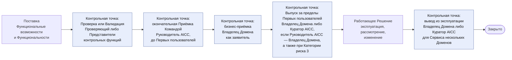
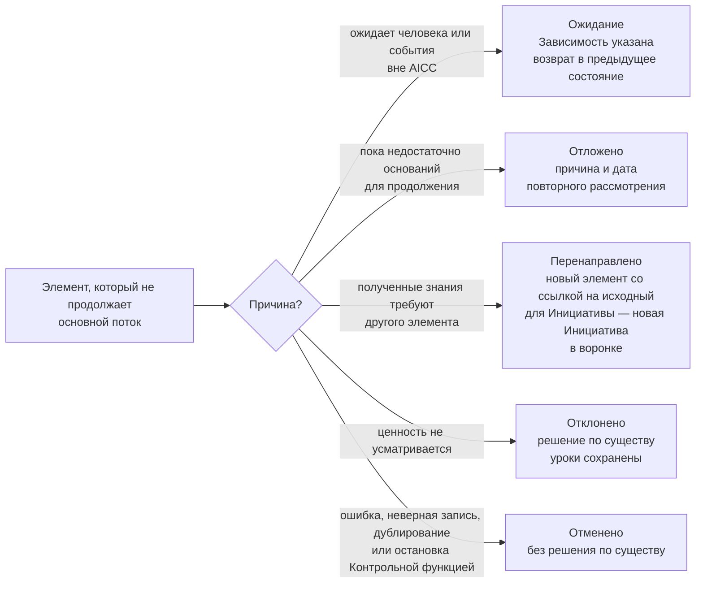
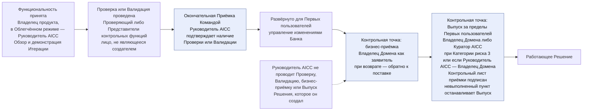

```yaml
source: charter/en/guides/service-delivery-guide.md
source_sha256: 851e19d962a5817851c398d681a0c639f67868d35316dd093de99741b0b83b95
translation_status: reviewed
```

# Руководство: Поставка услуг

## 1. Назначение и область применения

Руководство объясняет, как элемент работы проходит через AICC от бизнес-потребности до вывода Решения из эксплуатации, кто принимает решения на этом пути и какая Запись остаётся после каждого решения. Оно применяется к каждой Инициативе и ко всем нижестоящим элементам. Руководство объясняет управление потоком: уровни, состояния, Стадии и Записи. Собственных правил оно не устанавливает; правила содержатся в Операционной модели, Модели управления портфелем, Модели жизненного цикла решений и Политике применения AI. Актуальные рекомендации по планированию и созданию решений Командой, меняющиеся вместе с работой, ведутся в Confluence и комплекте материалов по управлению портфелем и не входят в корпус Положения.

## 2. Уровни работы и ответственные за них

Рисунок 1 показывает уровни работы, утверждающее лицо на каждом уровне и место ведения записей.



Рисунок 1: уровни работы и ответственные за них.

| Уровень | Содержание | Кто одобряет | Где ведётся |
| --- | --- | --- | --- |
| Стратегический приоритет | Направление, определённое совместно с Советом директоров | Куратор AICC | Запись о приоритетах |
| Инициатива | Бизнес-программа, поставляющая Решения | Владелец Домена; Куратор AICC — при превышении Инвестиционного ограничения, охвате нескольких Доменов или для Обеспечивающих работ | Бэклог портфеля |
| Решение | Решение или сервис с типом, Категорией риска и Получателем | Владелец Домена одобряет Описание решения | Портфель |
| Функциональная возможность | Функциональная возможность Решения | Руководитель AICC | Бэклог программы |
| Функциональность | Результат поставки в составе Функциональной возможности, закрываемый в пределах одного PI; Текущие работы относятся непосредственно к своей Постоянной инициативе и выполняются за одну Итерацию | Команда на Планировании Итерации; Руководитель AICC на Еженедельном обзоре — для Текущих работ | Бэклог программы, затем Бэклог Итерации |

## 3. Жизненный цикл элемента

Инициатива проходит Канбан-доску портфеля по Модели управления портфелем 5: воронка, Рассмотрение, Анализ, Бэклог портфеля, MVP, решение после MVP, Реализация и Готово. Каждый элемент находится в одном из тринадцати состояний. Он начинается в состоянии «Предложено», уточняется в «Проработке», получает состояние «Одобрено» при выполнении условий, находится «В работе» во время выполнения и через «На рассмотрении» переходит в «Принято» и «Закрыто». Другие пути отражают состояния «Ожидание», «Отложено», «Перенаправлено», «Отклонено» и «Отменено». Тот, кто одобряет элемент на его уровне, также откладывает, отклоняет, отменяет или перенаправляет его. Пока Команда состоит не более чем из трёх человек, в Облегчённом режиме используется сокращённый набор состояний: «Ожидание» сохраняется как состояние, отображаемое флагом, а «Принято» и «Закрыто» объединяются в один шаг.

Рисунок 2 показывает поток Решения от потребности до решения после MVP с контрольными точками и уполномоченными лицами.



Рисунок 2: поток от потребности до решения после MVP.

Рисунок 3 показывает поток от поставки до закрытия.



Рисунок 3: поток от поставки до закрытия.

Элемент может выйти из основного потока на любой контрольной точке. Рисунок 4 показывает выбор пути. «Отклонено» означает решение по существу ввиду отсутствия ожидаемой ценности. «Отменено» означает прекращение без такого решения, например из-за ошибки, дублирования или остановки Контрольной функцией.



Рисунок 4: пути выхода из основного потока.

## 4. Решения в потоке и уполномоченные лица

| Решение | Кто принимает | Когда | Запись |
| --- | --- | --- | --- |
| Приём элемента к рассмотрению | Руководитель AICC | Из «Предложено» в «Проработка» | Бэклог портфеля |
| business case | Владелец Домена; Куратор AICC — при превышении Инвестиционного ограничения, охвате нескольких Доменов или для Обеспечивающих работ; Представители контрольных функций согласовывают, если ожидается Категория риска 2 или 3 | По завершении Проработки Инициативы | Паспорт инициативы с согласованиями; Запись о решении |
| Принятие в работу из Бэклога портфеля | Руководитель AICC | Когда позволяет лимит Инициатив в состоянии «В работе» | Бэклог портфеля |
| Решение после MVP | Лицо, одобрившее business case | По завершении MVP | Журнал решений; Запись о решении; Паспорт инициативы |
| Описание решения и Категория риска | Владелец Домена одобряет; Руководитель AICC присваивает Категорию риска и сообщает её Владельцу Домена; для Решения, созданного Руководителем AICC, одобрение и присвоение выполняет Куратор AICC | При описании Решения | Описание решения |
| Применение Решения для Класса данных | Владелец Домена; Руководитель AICC — для применения в AICC; Куратор AICC — для Решения, созданного Руководителем AICC | До применения | Реестр AI |
| Проверка или Валидация | Проверяющий — для Категории риска 1; Представители контрольных функций — для Категорий риска 2 и 3 | До первого развёртывания для реальных пользователей или данных | Запись в Реестре AI — для Проверки; Заключение контрольной функции — для Валидации |
| Приёмка Функциональности или Функциональной возможности | Владелец продукта | На Обзоре и демонстрации Итерации | Отметка в бэклоге соответствующего уровня |
| Окончательная Приёмка Командой | Руководитель AICC | До первого развёртывания Решения для Первых пользователей и до развёртывания существенного изменения | Раздел о Выпуске в Описании решения |
| Бизнес-приёмка Решения | Владелец Домена; Куратор AICC — для элемента нескольких Доменов, Обеспечивающих работ или Эксперимента без Домена | Когда Решение работает для Первых пользователей, до его Выпуска | Раздел о Выпуске в Описании решения; для Взаимодействия с заказчиком — также Отчёт о результатах |
| Выпуск | Владелец Домена либо Куратор AICC, если Руководитель AICC является Владельцем Домена; для Категории риска 3 — Куратор AICC | До применения за пределами Первых пользователей | Раздел о Выпуске в Описании решения; Контрольный лист приёмки; для Категории риска 3 — Запись о решении |
| Развёртывание в промышленной среде и изменение выпущенного Решения | Одобрение в рамках управления изменениями Банка; Руководитель AICC решает, нужна ли новая Проверка или Валидация | При каждом развёртывании в промышленной среде и каждом изменении | Заявка на изменение и ссылка на тестирование в Функциональности; Описание решения; Журнал решений — для решения о новой Проверке |
| Вывод Решения из эксплуатации | Владелец Домена; Куратор AICC — для Сервиса нескольких Доменов | До закрытия Решения как выведенного из эксплуатации | Описание решения; Реестр AI |
| Переход Сервиса: Передача IT-функции Банка либо вывод из эксплуатации | Владелец Домена; Куратор AICC — для Сервиса нескольких Доменов; Получатель принимает Передачу | По результатам рассмотрения четырёх сигналов на Ежеквартальном управляющем совещании | Журнал решений; Предложение; Описание решения |
| Результат Эксперимента: принят с уроками и закрыт, Предложение либо отклонён | Владелец Домена; Куратор AICC — для Эксперимента без Домена | По окончании установленного срока | Описание решения; Предложение, если подготовлено; для Взаимодействия с заказчиком — Отчёт о результатах |
| Класс обслуживания запроса | Инженер решений выполняет первичный разбор; при сомнении класс определяет Руководитель AICC | При поступлении запроса | Заявка в Service Management |

Рисунок 5 показывает порядок Приёмки, Проверки и Выпуска Решения. Проверка или Валидация проводится до окончательной Приёмки Командой, которая подтверждает её наличие.



Рисунок 5: Приёмка, Проверка и Выпуск.

## 5. После поставки: три типа

У Решения один тип, определяющий его жизненный цикл. Сервис эксплуатируется AICC в течение всего жизненного цикла либо до Передачи IT-функции Банка; его business case содержит Эксплуатационные затраты и Правило вывода из эксплуатации, а поддержка ведётся с согласованными целевыми сроками реагирования. Четыре сигнала Сервиса — уровни обслуживания, инциденты, использование и затраты — рассматриваются на каждом Обзоре и демонстрации Итерации и на Ежеквартальном управляющем совещании. Продукт — версия, созданная для одного потребителя, поддерживаемая по запросу и пересматриваемая через Бэклог портфеля. Эксперимент — испытание с ограниченным сроком, завершающееся Предложением; Передача Получателю завершена, когда Получатель её принимает. AICC также осуществляет надзор за Внедрёнными решениями, поставляемыми другими, и отчитывается о них.

| Тип | Ответственный после поставки | Стадии после поставки | Завершение |
| --- | --- | --- | --- |
| Сервис | AICC | Эксплуатация, Развитие, Вывод из эксплуатации через Шаги обслуживания | Выведен из эксплуатации, передан IT-функции Банка либо отменён |
| Продукт | Потребитель отвечает за версию; AICC поддерживает по запросу | Передача, Поддержка, Пересмотр, Вывод из эксплуатации у потребителя | Выведен из эксплуатации у потребителя |
| Эксперимент | Пока не определён | Испытание, Предложение, Передача | Передан, закрыт с уроками либо отклонён |

## 6. Ситуации

| Ситуация | Порядок действий |
| --- | --- |
| Изменение повышает Категорию риска | Решение возвращается в «Проработку» для проверок, затронутых изменением |
| Присвоенная Категория риска выше согласованной в business case | business case возвращается Представителям контрольных функций на повторное согласование |
| Функциональность не может быть закрыта в своём PI | Она разделяется: выполненная часть поступает на рассмотрение, оставшаяся становится новой Функциональностью следующего PI, исходная получает состояние «Перенаправлено» |
| Зависимость вне AICC блокирует работу | Элемент находится в состоянии «Ожидание» с указанием Зависимости |
| Контрольная функция останавливает Решение | Решение получает состояние «Отменено»; никто не отменяет действие остановки |
| Эксперимент достигает конца установленного срока | Он поступает на рассмотрение: принятие с уроками, Предложение либо отклонение |
| MVP Инициативы завершён | Утверждающее лицо решает продолжить, перенаправить, отложить или отклонить её. Перенаправление создаёт новую Инициативу в воронке со ссылкой на исходную |
| Сервис должен работать в большем масштабе | Сервис переходит на шаг «Переход запланирован». Предложение называет IT-функцию Банка Получателем; Владелец Домена, а при охвате нескольких Доменов — Куратор AICC, принимает решение по результатам рассмотрения четырёх сигналов на Ежеквартальном управляющем совещании. Когда Получатель принимает Передачу, Сервис закрывается как переданный; далее AICC осуществляет надзор за ним как за Внедрённым решением (Модель жизненного цикла решений 8.8, 8.11) |
| Эксперимент подтверждает своё обоснование | По окончании установленного срока он поступает на рассмотрение; готовится Предложение о внедрении Получателем в большем масштабе. Решение сохраняет один тип предложения: последующий Сервис является новым Решением с собственным business case (Модель жизненного цикла решений 8.1, 8.12) |
| Инциденты или запросы повторяются | Повторяемость отмечается в заявке, а для Инцидента AI — в Разборе Инцидента AI; в рамках управления проблемами устранение причины оформляется как Функциональность Бэклога программы (Модель жизненного цикла решений 8.10) |

## 7. Источники правил

Операционная модель 4.2, 4.4, 5; Модель управления портфелем 4–8; Модель жизненного цикла решений 3–10; Политика применения AI 2 и 3; workflow «Поставка услуг».
