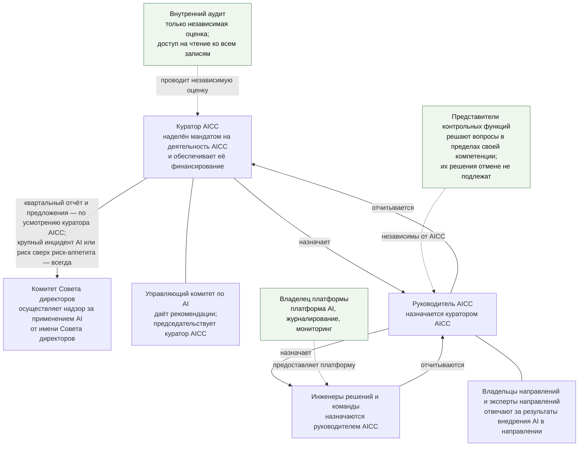
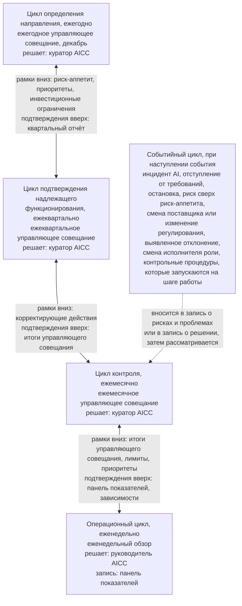
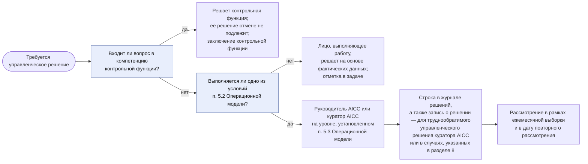

```yaml
source: charter/en/guides/unit-governance-guide.md
source_sha256: ec6c1a6de937047e09f376f012ec2d22b2a17acdf541b7d6ce59866b72637986
translation_status: reviewed
```

# Руководство по управлению подразделением

## 1. Назначение и область применения

Настоящее руководство объясняет, как организовано руководство AICC как организационным подразделением, его отчётность и контроль за его деятельностью: мандат, планирование, отчётность, принятие управленческих решений, контрольные процедуры и независимая оценка. Руководство отвечает на вопрос о том, как работает подразделение, и применяется ко всей деятельности AICC. Собственных правил руководство не устанавливает: они содержатся в Положении об AICC, Операционной модели, Модели управления портфелем, Модели жизненного цикла решений и Политике применения AI.

## 2. Мандат, полномочия и независимость

AICC действует на основании мандата куратора AICC; ограничения его деятельности установлены Положением об AICC: AICC не владеет платформой AI, не отвечает за результаты направления, не устанавливает правила контрольной функции, не проводит валидацию собственной работы и не решает вопросы, которые внутренние нормативные документы Банка относят к компетенции Совета директоров, Правления Банка или контрольной функции. Назначение руководителя AICC и реквизиты управленческого решения о предоставлении мандата вносятся в запись о назначениях. Куратор AICC вправе письменно делегировать принятие управленческого решения с указанием круга вопросов и срока; каждое делегирование также вносится в запись о назначениях.

На рисунке 1 показано, кто обладает полномочиями, какие функции независимы от AICC и в каком направлении представляется отчётность.



Рисунок 1. Полномочия, независимые функции и отчётность.

## 3. Циклы управления

Контроль деятельности подразделения выполняется в пяти циклах, установленных разделом 6 Операционной модели, а управление портфелем — в четырёх циклах, установленных разделом 4 Модели управления портфелем. Циклы проводятся на одних и тех же мероприятиях; дополнительные совещания не вводятся.

На рисунке 2 показаны циклы, лица, принимающие управленческие решения в каждом из них, и то, как рамки передаются сверху вниз, а подтверждающие материалы — снизу вверх.



Рисунок 2. Циклы контроля и лица, принимающие управленческие решения.

Циклы, их периодичность и мероприятия, рассматриваемые вопросы, лица, принимающие управленческие решения, и записи по итогам приведены в следующей таблице.

| Цикл | Периодичность и мероприятие | Что устанавливается или рассматривается | Кто принимает решения | Запись |
| --- | --- | --- | --- | --- |
| Определение направления и стратегический цикл | Ежегодно, на ежегодном управляющем совещании (ежемесячном управляющем совещании декабря, которое проводится в первые две недели месяца), на следующий год | В цикле определения направления — документы, Заявление о риск-аппетите в отношении AI и политика, назначения, целевые значения показателей уровней зрелости; в стратегическом цикле — стратегические приоритеты, инвестиционные бюджеты и инвестиционные ограничения; ежегодное предложение по стратегии | Куратор AICC; за документы отвечает руководитель AICC | Записи о решениях; запись о приоритетах |
| Подтверждение надлежащего функционирования и обзор портфеля | Ежеквартально, на ежеквартальном управляющем совещании | Ежеквартальная проверка рисков с участием представителей контрольных функций, пересмотр прав доступа, статус каждой контрольной процедуры и показатели управления, уровень зрелости по каждому стратегическому приоритету, утверждение квартального отчёта и определение того, направлять ли его Комитету Совета директоров или Совету директоров; управленческое решение по каждой инициативе в работе | Куратор AICC | Квартальный отчёт; снимок реестра; итоги управляющего совещания |
| Контроль и синхронизация портфеля | Ежемесячно, на ежемесячном управляющем совещании | Ход работы, риски и препятствия; выборка управленческих решений руководителя AICC и доля решений, признанных обоснованными; события месяца; рассмотрение работающих решений; действующие отступления от требований и недостатки контроля; управленческие решения в контрольных точках, срок которых наступил, и число инициатив в работе в сопоставлении с лимитом | Куратор AICC | Итоги управляющего совещания; журнал решений |
| Операционный цикл и ведение бэклога | Еженедельно, на еженедельном обзоре | Поток работ, зависимости, воронка и ранжирование | Руководитель AICC | Панель показателей; рабочее состояние |
| Событийный цикл | При наступлении события | Инцидент AI, отступление от требований, остановка, риск сверх риск-аппетита, смена поставщика или изменение регулирования, выявленное отклонение или смена исполнителя роли; контрольные процедуры, которые запускаются на шаге работы | В соответствии с Операционной моделью | Запись о решении; запись о рисках и проблемах; запись о назначениях; подтверждающая запись каждой контрольной процедуры |

Каждая контрольная процедура выполняется не менее чем в одном цикле и рассматривается на управляющем совещании этого цикла; контрольные процедуры операционного и событийного циклов рассматриваются на ежемесячном управляющем совещании (п. 6.1 Операционной модели). Для целей управления дополнительные совещания не вводятся, а записи сверх записей самой работы не ведутся. Перечень контрольных процедур по циклам приведён в следующей таблице.

| Цикл | Контрольные процедуры | Предмет |
| --- | --- | --- |
| Определение направления | C-01, C-03, C-04, C-20, C-22; C-02 — в стратегическом цикле на том же управляющем совещании | Мандат и назначения; приоритеты, финансирование и инвестиционные ограничения; риск-аппетит и политика; документы; ежегодное предложение по стратегии; разделение обязанностей |
| Подтверждение надлежащего функционирования | C-06, C-07, C-11, C-16, C-20, C-24, C-25, C-26, C-27, C-28 | Результаты и проверка рисков; утверждение квартального отчёта и его направление Комитету Совета директоров или Совету директоров, если так определит куратор AICC; подтверждённая выгода; сверка инцидентов AI; внедрённые решения; полнота отчётов о результатах; доступ внутреннего аудита и пересмотр прав доступа; риски сверх риск-аппетита; повторные оценки и валидации, срок которых наступил |
| Контроль | C-05, C-17, C-29, C-32 | Ежемесячное рассмотрение и выборка; действующие отступления от требований и приостановления; рассмотрение работающих решений; недостатки контроля и выявленные отклонения |
| Операционный | C-23 | Приём обращений и WIP-лимит |
| Событийный | C-01, C-08, C-09, C-10, C-12, C-13, C-14, C-15, C-16, C-17, C-18, C-19, C-21, C-22, C-27, C-28, C-30, C-31, C-32 | Каждый шаг взаимодействия с заказчиком и жизненного цикла решения: соглашение о взаимодействии, бизнес-кейс, приёмка, категория риска, проверка или валидация, выпуск, применение для класса данных, поставщик, обмен данными, предоставляемые результаты, развёртывание и изменение, вывод из эксплуатации; а также внеплановые события: назначение, инцидент AI, отступление от требований, приостановление или остановка, риск сверх риск-аппетита, повторная оценка при изменении, выявленное отклонение |

AICC также оценивает собственную систему контроля по десяти показателям управления, которые рассматриваются на управляющих совещаниях, — от доли контрольных процедур в статусе «Выполняется» до доли документов, пересмотренных в течение года (п. 6.11 Операционной модели). На ежеквартальном управляющем совещании подтверждается уровень зрелости по каждому стратегическому приоритету, а на ежегодном устанавливаются целевые значения показателей уровней зрелости на следующий год (пп. 6.5 и 6.6 Операционной модели).

## 4. Порядок принятия управленческих решений

Управленческое решение на основе фактических данных принимает лицо, которое выполняет работу. Вопрос передаётся руководителю AICC или куратору AICC только в следующих случаях: управленческое решение затрагивает другое направление, выходит за пределы Банка или устанавливает стандарт для других; его нельзя отменить без существенных затрат или вреда; оно выходит за пределы инвестиционных ограничений или изменяет стратегический приоритет; оно предполагает принятие риска сверх риск-аппетита или касается решения категории риска 3. Контрольная функция решает вопросы в пределах своей компетенции, и её решения отмене не подлежат. Управленческое решение уровня руководителя AICC и выше вносится в журнал решений; труднообратимое управленческое решение куратора AICC, а также управленческое решение, для которого разделом 8 Операционной модели предусмотрена запись о решении в качестве подтверждающей записи, дополнительно оформляются записью о решении (п. 5.6 Операционной модели).

На рисунке 3 показано, как выбирается уровень принятия управленческого решения и какая запись остаётся по его итогам.



Рисунок 3. Выбор уровня принятия управленческого решения и его фиксация.

## 5. Отчётность и независимая оценка

Отчётность представляется по цепочке: команды — руководитель AICC — управляющее совещание; тем самым AICC подотчётен куратору AICC. На управляющем совещании председательствует куратор AICC; руководитель AICC готовит совещание и участвует в нём; участвуют также владельцы направлений, вопросы которых рассматриваются, и представители контрольных функций; Управляющий комитет по AI даёт рекомендации (п. 6.3 Операционной модели). Куратор AICC вправе вынести квартальный отчёт, выявленные отклонения, стратегию внедрения AI и предложения о внедрении или изменении в масштабе Банка на рассмотрение Комитета Совета директоров или Совета директоров, если считает это целесообразным или если этого требует Совет директоров; это право куратора AICC, а не периодическая обязанность. Контрольные функции действуют параллельно этой цепочке и независимы от AICC. Внутренний аудит находится за её пределами, проводит только независимую оценку и имеет доступ на чтение к реестру, а также доступ только на чтение к Jira, Confluence и системе Service Management. Куратор AICC во всех случаях незамедлительно, не дожидаясь какого-либо отчёта, информирует Комитет Совета директоров об инциденте AI, который система управления инцидентами Банка относит к крупным, — в соответствии с её требованиями, — и о каждом риске, принятом сверх риск-аппетита.

AICC работает в рамках модели трёх линий Банка (п. 2.4 Операционной модели). AICC и направления отвечают за риски своей работы. Контрольные функции устанавливают правила в пределах своей компетенции, согласовывают, проводят валидацию, принимают решения об отступлениях от требований и вправе остановить решение. Внутренний аудит проводит независимую оценку.

## 6. Место хранения подтверждающих материалов

Рабочее состояние ведётся в реестре до перехода, а затем — в Jira и Confluence (п. 7.1 Операционной модели). Подтверждающие записи всегда хранятся в реестре в виде неизменяемых выгрузок с указанием даты; снимок реестра делается по завершении каждой итерации и каждого PI, а также при переходе (п. 7.3 Операционной модели). Каждая контрольная процедура с её подтверждающей записью приведена в разделе 8 Операционной модели, а записи по классам — в указателе реестра. Портал AICC содержит ссылки на подтверждающие записи на корпоративном сетевом ресурсе. Порядок введения документа в действие, его изменения и пересмотра установлен Каталогом документов.

## 7. Контрольные процедуры и порядок их тестирования

Настоящий раздел — справочный материал для внутреннего аудита; остальную часть руководства можно читать без него. Каждая контрольная процедура с её правилом, ответственным, сроком, подтверждающей записью, шаблоном и типом приведена в разделе 8 Операционной модели. Цель, тип и порядок тестирования каждой контрольной процедуры приведены в таблице ниже. Тип контрольной процедуры: директивная (устанавливает правило или направление), предупреждающая (предотвращает ошибку до её возникновения) или выявляющая (обнаруживает ошибку после её возникновения). Порядок тестирования и статус каждой контрольной процедуры на определённую дату указываются в матрице контроля в реестре. По коду каждой контрольной процедуры можно найти её правило, подтверждающую запись, статус в матрице контроля и итоги управляющего совещания, на котором она рассматривалась (п. 8.6 Операционной модели).

Статус контрольной процедуры имеет одно из следующих значений (п. 8.5 Операционной модели). Недостаток контроля свидетельствует о том, что система управления работает: контрольная процедура выявила пробел, и его устранение отслеживается до конца.

| Статус | Значение |
| --- | --- |
| Выполняется | Контрольная процедура выполнена в установленный срок или при наступлении основания, и её подтверждающая запись находится в реестре |
| Открыта | Срок выполнения контрольной процедуры наступил, а подтверждающие материалы отсутствуют или неполны; в записи о рисках и проблемах по ней заведён элемент с указанием ответственного и срока |
| Недостаток контроля | Контрольная процедура не выполнена, либо подтверждающие материалы свидетельствуют о сбое, либо процедура находилась в статусе «Открыта» и недостаток не был устранён к установленному сроку |
| Основание ещё не возникло | Событие, при котором выполняется контрольная процедура, не наступило; это подтверждено отметкой об отсутствии событий |
| Срок ещё не наступил | Первая дата выполнения контрольной процедуры ещё не наступила |

| Код | Контрольная процедура | Цель | Тип | Порядок тестирования |
| --- | --- | --- | --- | --- |
| C-01 | Мандат куратора AICC, назначение руководителя AICC и определение состава Управляющего комитета по AI | AICC действует только на основании документально оформленных полномочий; Совет директоров и куратор AICC назначают исполнителей ролей, стоящих над AICC | Директивная | Сопоставить реквизиты решения с мандатом и распорядительным документом о назначении; изучить решения о назначении куратора AICC и членов Управляющего комитета по AI |
| C-02 | Приоритеты, финансирование и инвестиционные ограничения | Финансирование и обязательства не выходят за пределы, установленные куратором AICC | Директивная | Сопоставить запись о приоритетах с инвестиционными ограничениями и записями о решениях за год |
| C-03 | Ежегодный пересмотр риск-аппетита и политики | Применение AI не выходит за пределы риск-аппетита, который утверждает куратор AICC | Директивная | Изучить Заявление о риск-аппетите в отношении AI, его утверждение куратором AICC и запись о решении по итогам пересмотра |
| C-04 | Пересмотр документов | Документы согласованы между собой и действуют | Выявляющая | Изучить отчёт о пересмотре и запись о решении, которой закрываются замечания по его итогам |
| C-05 | Ежемесячное рассмотрение хода работы, рисков и препятствий с выборкой управленческих решений руководителя AICC | Управленческие решения одного лица рассматривает другое лицо | Выявляющая | Изучить итоги управляющего совещания за каждый месяц и зафиксированную в них выборку |
| C-06 | Результаты, проверка рисков с рассмотрением каждого решения категории риска 3 и уровень зрелости | Куратор AICC ежеквартально получает сведения о результатах и рисках, в том числе по каждому решению категории риска 3 | Выявляющая | Изучить квартальный отчёт с рассмотрением каждого решения категории риска 3 и снимок реестра за квартал |
| C-07 | Утверждение квартального отчёта и его направление Комитету Совета директоров или Совету директоров, если так определит куратор AICC | Куратор AICC ежеквартально утверждает квартальный отчёт и определяет, направлять ли его Комитету Совета директоров или Совету директоров | Выявляющая | Изучить раздел об утверждении: кто утвердил и дата; если отчёт направлялся, — получатель и дата направления |
| C-08 | Соглашение о взаимодействии для каждого взаимодействия с заказчиком | Обязательство перед подразделением оформлено письменно до начала работы | Предупреждающая | Сопоставить соглашение с инициативой и её датами |
| C-09 | Одобрение бизнес-кейса и управленческое решение по итогам MVP | Инициатива финансируется только при полном бизнес-кейсе; если ожидается категория риска 2 или 3, бизнес-кейс согласован контрольными функциями; более высокая категория риска, присвоенная позднее, согласуется повторно; по итогам MVP принимается управленческое решение | Предупреждающая | Изучить строку о незаполненных разделах и таблицу управленческих решений паспорта инициативы, согласования представителей контрольных функций, запись о решении и управленческое решение по завершении MVP |
| C-10 | Отчёт о результатах, приёмка и подтверждение выгоды | Feature и Capability принимает владелец продукта, решение — команда, а затем владелец его направления; результат отражается в отчёте; выгоду подтверждает подразделение, а не AICC | Выявляющая | Изучить отметки о приёмке в бэклоге, окончательную приёмку командой и бизнес-приёмку в разделе о выпуске, а также отчёт о результатах — в каждом случае с указанием лица и даты; изучить подтверждение выгоды и его источник |
| C-11 | Подтверждённая выгода | AICC заявляет только подтверждённую выгоду | Выявляющая | Сопоставить заявленную выгоду с выгодой, подтверждённой в отчёте о результатах |
| C-12 | Присвоение категории риска | Каждому решению присвоена категория риска, которая определяет состав проверок; решению, созданному руководителем AICC, категорию риска присваивает куратор AICC | Предупреждающая | Изучить категорию риска, кем и когда она присвоена |
| C-13 | Проверка или валидация до первого развёртывания | Ничто не доходит до реальных пользователей или реальных данных без проверки | Предупреждающая | Сопоставить дату проверки с датой первого развёртывания |
| C-14 | Выпуск | Применение за пределами круга первых пользователей разрешает уполномоченный владелец | Предупреждающая | Сопоставить выпуск с проверкой и категорией риска; изучить раздел о выпуске и, если AICC передаёт решение направлению, контрольный лист приёмки |
| C-15 | Одобрение применения решения для класса данных и обучение до первого использования | Данные используются только с одобрения их владельца, а пользователи проходят обучение до первого использования | Предупреждающая | Изучить одобрение, кем и когда оно дано, и отметку о завершении обучения |
| C-16 | Инцидент AI и уведомление Комитета Совета директоров о крупном инциденте | Инциденты обрабатываются в рамках процесса управления инцидентами Банка с участием AICC и разбираются; Комитет Совета директоров незамедлительно информируется о крупном инциденте | Выявляющая | Изучить отметку об отсутствии событий; при инциденте — заявку в системе Service Management и разбор инцидента AI; изучить ежеквартальную сверку с данными системы управления инцидентами Банка и уведомление Комитета Совета директоров о крупном инциденте |
| C-17 | Отступление от требований, приостановление и остановка | Отступление от требований допускается только по управленческому решению, в установленных пределах и с фиксацией; приостановление и остановка фиксируются | Предупреждающая | Изучить отметку об отсутствии событий; для отступления от требований — срок его действия и ежемесячное рассмотрение; для приостановления — записи о нём и о его снятии в журнале решений; для остановки — заключение контрольной функции |
| C-18 | Проверка поставщика | До начала работы с поставщиком проверены условия обработки данных, договорные условия и порядок прекращения сотрудничества | Предупреждающая | Сопоставить дату проверки поставщика с датой первого использования его услуг |
| C-19 | Передача данных или решений за пределы Банка | Данные и решения не передаются за пределы Банка, если иное не разрешено | Предупреждающая | Изучить соглашение об обмене данными и соответствующую запись о решении |
| C-20 | Предложение о внедрении решения в масштабе Банка, ежегодное предложение по стратегии внедрения AI и ежеквартальное рассмотрение внедрённых решений | Внедрение решения одобряют владельцы соответствующих направлений и куратор AICC, ежегодную стратегию — Банк; внедрённые решения рассматриваются ежеквартально | Директивная | Изучить предложение и управленческое решение по нему, ежегодное предложение и рассмотрение внедрённых решений в квартальном отчёте |
| C-21 | Результаты, предоставляемые инвесторам, кредиторам, надзорным органам или Совету директоров | Предоставляемые результаты одобряются до их направления | Предупреждающая | Изучить одобрение каждой версии |
| C-22 | Разделение обязанностей и независимость | Проверка, выпуск и бизнес-приёмка собственной работы не допускаются | Предупреждающая | При выпуске сопоставить разработчика, проверяющего и лицо, принявшее решение о выпуске; сопоставить исполнителей ролей с правилами разделения обязанностей и принятыми ограничениями |
| C-23 | Приём взаимодействий с заказчиком и WIP-лимит | AICC принимает работу только в пределах WIP-лимита | Предупреждающая | Сопоставить число инициатив в работе и оформленных соглашений о взаимодействии с лимитом инициатив в работе |
| C-24 | Полнота отчётов о результатах | По закрытым взаимодействиям с заказчиком представлены отчёты | Выявляющая | Изучить раздел 8 итогов управляющего совещания |
| C-25 | Доступ внутреннего аудита | Внутренний аудит имеет доступ к записям | Директивная | Протестировать доступ на чтение к реестру и доступ только на чтение к Jira, Confluence и системе Service Management |
| C-26 | Пересмотр прав доступа к реестру, инструментам и промышленной среде | Права доступа соответствуют ролям; права доступа инженеров решений к промышленной среде пересматриваются | Предупреждающая | Изучить результаты ежеквартальной сверки с записью о назначениях и пересмотра прав доступа к промышленной среде, проводимого Банком |
| C-27 | Принятие риска сверх риск-аппетита | Риск сверх риск-аппетита вправе принять только куратор AICC; Комитет Совета директоров информируется об этом | Предупреждающая | Изучить запись о решении и уведомление Комитета Совета директоров |
| C-28 | Повторная оценка категории риска и истечение срока действия валидации | Решение не применяется при истёкшем сроке действия валидации или неактуальной категории риска | Предупреждающая | Сопоставить даты в реестре AI с датами повторной оценки и валидации |
| C-29 | Рассмотрение работающих решений | Владельцы работающих решений ведут их мониторинг | Выявляющая | Изучить отметку о рассмотрении в описании решения по итогам каждого ревью и демонстрации итерации |
| C-30 | Развёртывание в промышленной среде и изменение выпущенного решения | Развёртывание и изменение одобряются в системе управления изменениями Банка, а уполномоченный владелец принимает по ним управленческое решение, обеспечивает их тестирование и выпуск | Предупреждающая | Выбрать развёртывание и изменение: изучить управленческое решение о необходимости новой проверки, заявку на изменение, результат тестирования и выпуск |
| C-31 | Вывод решения из эксплуатации | После вывода решения из эксплуатации не остаётся прав доступа, данных и действующей записи в реестре AI | Предупреждающая | Изучить одобрение и сопоставить права доступа, данные и запись в реестре AI с выводом из эксплуатации |
| C-32 | Недостатки контроля и выявленные отклонения | Невыполненная контрольная процедура или выявленное отклонение отслеживаются до устранения | Выявляющая | Выбрать выявленное отклонение: изучить ответственного, срок и ежемесячное рассмотрение |

## 8. Источники правил

Разделы 3–7 Положения об AICC; разделы 5–7 Бизнес-модели; разделы 2 и 4–8 Операционной модели; разделы 4 и 6 Модели управления портфелем; разделы 7–9 Модели жизненного цикла решений; разделы 2–6 Политики применения AI; разделы 3, 4 и 7 Каталога документов; workflow «Управление подразделением».
