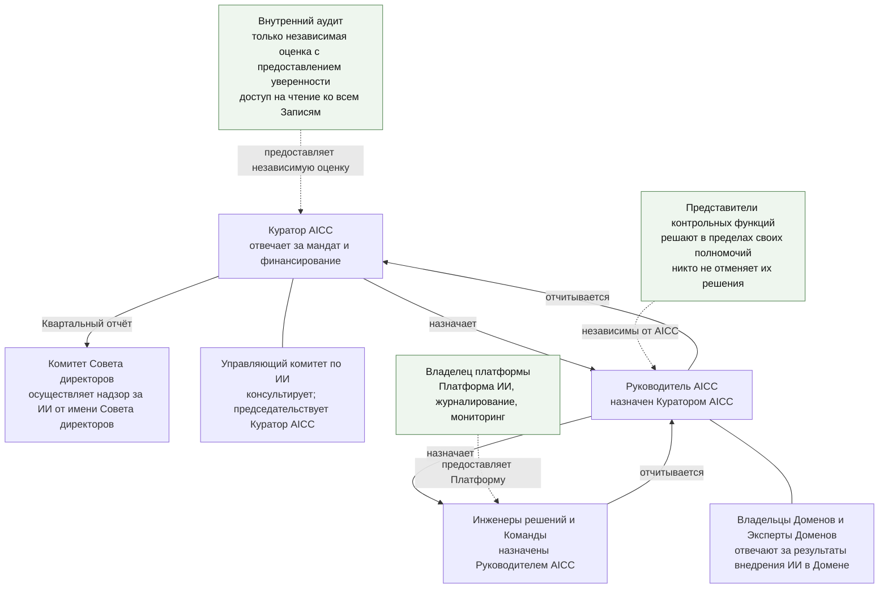
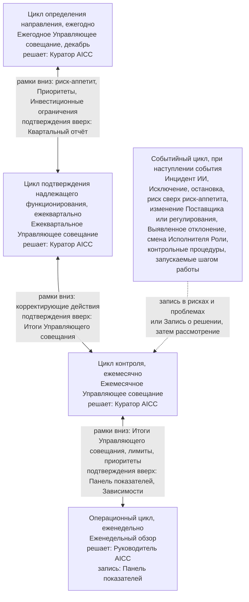
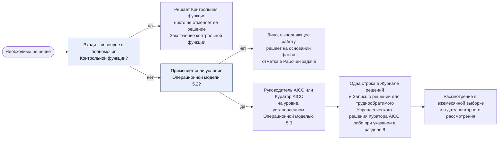

```yaml
source: charter/en/guides/unit-governance-guide.md
source_sha256: 9d52943445a6b3e7c431ce8213bc2fb96aa98828b8114cda003f35119e1b0f7d
translation_status: reviewed
```

# Руководство: Управление подразделением

## 1. Назначение и область применения

Настоящее руководство объясняет, как AICC управляется, отчитывается и контролируется как организационное подразделение: мандат, планирование, отчётность, решения, контрольные процедуры и подтверждение надлежащего функционирования. Оно отвечает на вопрос о порядке работы подразделения и применяется на всём протяжении его деятельности. Руководство не устанавливает самостоятельных правил; правила содержатся в Положении об AICC, Операционной модели, Модели управления портфелем, Модели жизненного цикла решений и Политике применения искусственного интеллекта.

## 2. Мандат, полномочия и независимость

AICC действует на основании мандата Куратора AICC; Положение об AICC устанавливает его ограничения: он не владеет Платформой ИИ, не отвечает за результаты Домена, не устанавливает правила Контрольной функции, не проводит Валидацию собственной работы и не решает вопросы, отнесённые регулированием Банка к Совету директоров, руководству или Контрольной функции. Назначение Руководителя AICC и ссылка на решение о мандате вносятся в Запись о назначениях. Куратор AICC вправе письменно делегировать принятие решения с указанием объёма полномочий и срока; каждое делегирование вносится туда же.

Рисунок 1 показывает носителей полномочий, независимые от AICC функции и направление отчётности.



Рисунок 1: полномочия, независимые функции и отчётность.

## 3. Циклы

Контроль подразделения осуществляется в пяти циклах Операционной модели 6, управление портфелем — в четырёх циклах Модели управления портфелем 4. Они используют одни и те же мероприятия и не добавляют совещаний.

Рисунок 2 показывает циклы, лицо, принимающее решения в каждом, передачу установленных рамок вниз и подтверждающих данных вверх.



Рисунок 2: циклы контроля и лица, принимающие решения.

Следующая таблица определяет каждый цикл, его мероприятие, устанавливаемые или рассматриваемые вопросы, лицо, принимающее решение, и создаваемую запись.

| Цикл | Ритм и мероприятие | Что устанавливается или рассматривается | Кем | Запись |
| --- | --- | --- | --- | --- |
| Определение направления и стратегический | Ежегодно на Ежегодном Управляющем совещании (Ежемесячном Управляющем совещании декабря в его первые две недели), на следующий год | В цикле определения направления — документы, Заявление о риск-аппетите в отношении ИИ и политика, назначения и целевые значения Показателей Уровней зрелости; в стратегическом цикле — Стратегические приоритеты, Инвестиционные бюджеты и Инвестиционные ограничения; ежегодное Предложение стратегии | Куратор AICC; за документы отвечает Руководитель AICC | Записи о решениях; Запись о приоритетах |
| Подтверждение надлежащего функционирования и обзор портфеля | Ежеквартально на Ежеквартальном Управляющем совещании | Ежеквартальная проверка рисков с Представителями контрольных функций, пересмотр доступа, статус каждой контрольной процедуры и Показатели управления, Уровень зрелости каждого Стратегического приоритета, отчёт Комитету Совета директоров; решение по каждой Инициативе в состоянии «В работе» | Куратор AICC | Квартальный отчёт; Снимок Реестра; Итоги Управляющего совещания |
| Контроль и синхронизация портфеля | Ежемесячно на Ежемесячном Управляющем совещании | Ход работы, риски и препятствия; выборка Управленческих решений Руководителя AICC и доля признанных надлежащими; события месяца; обзор действующих Решений; открытые Исключения и Недостатки контроля; решения на контрольных точках, срок которых наступил, и количество Инициатив в состоянии «В работе» относительно лимита | Куратор AICC | Итоги Управляющего совещания; Журнал решений |
| Операционный и ведение бэклога | Еженедельно на Еженедельном обзоре | Поток, Зависимости, Воронка и ранжирование | Руководитель AICC | Панель показателей; Рабочее состояние |
| Событийный | При наступлении события | Инцидент ИИ, Исключение, остановка, риск сверх риск-аппетита, изменение Поставщика или регулирования, Выявленное отклонение или смена Исполнителя Роли; контрольные процедуры, запускаемые шагом работы | По Операционной модели | Запись о решении; Запись о рисках и проблемах; Запись о назначениях; Подтверждающая запись каждой контрольной процедуры |

Каждая контрольная процедура входит как минимум в один цикл и рассматривается на Управляющем совещании этого цикла; процедуры операционного и событийного циклов рассматриваются на Ежемесячном Управляющем совещании (Операционная модель 6.1). Управление не добавляет совещаний и не ведёт Записей сверх записей самой работы. Следующая таблица представляет каталог контрольных процедур по циклам.

| Цикл | Контрольные процедуры | Что охватывают |
| --- | --- | --- |
| Определение направления | C-01, C-03, C-04, C-20, C-22; C-02 в стратегическом цикле на том же Управляющем совещании | Мандат и назначения; Приоритеты, финансирование и Инвестиционные ограничения; риск-аппетит и политика; документы; ежегодное Предложение стратегии; разделение обязанностей |
| Подтверждение надлежащего функционирования | C-06, C-07, C-11, C-16, C-20, C-24, C-25, C-26, C-27, C-28 | Результаты и проверка рисков; отчёт Комитету Совета директоров; подтверждённый эффект; сверка Инцидентов ИИ; Внедрённые решения; полнота Отчётов о результатах; доступ внутреннего аудита и пересмотр доступа; риски сверх риск-аппетита; повторные оценки и Валидации, срок которых наступил |
| Контроль | C-05, C-17, C-29, C-32 | Ежемесячный обзор и выборка; открытые Исключения и Приостановления; обзор действующих Решений; Недостатки контроля и Выявленные отклонения |
| Операционный | C-23 | Приём работы и Лимит незавершённой работы |
| Событийный | C-01, C-08, C-09, C-10, C-12, C-13, C-14, C-15, C-16, C-17, C-18, C-19, C-21, C-22, C-27, C-28, C-30, C-31, C-32 | Каждый шаг Взаимодействия с заказчиком и Решения: Соглашение о взаимодействии, экономическое обоснование, Приёмки, Категория риска, Проверка или Валидация, Выпуск, применение для Класса данных, Поставщик, обмен данными, публикуемый результат, развёртывание и изменение, вывод из эксплуатации; внеплановые события: назначение, Инцидент ИИ, Исключение, Приостановление или остановка, риск сверх риск-аппетита, повторная оценка при изменении, Выявленное отклонение |

AICC также измеряет собственный контроль десятью Показателями управления, рассматриваемыми на Управляющих совещаниях: от доли контрольных процедур со статусом «Выполняется» до доли документов, проверенных в течение года (Операционная модель 6.11). Ежеквартальное Управляющее совещание подтверждает Уровень зрелости каждого Стратегического приоритета; Ежегодное Управляющее совещание устанавливает целевые значения Показателей Уровней зрелости на следующий год (Операционная модель 6.5, 6.6).

## 4. Порядок принятия решения

Лицо, выполняющее работу, принимает решение на основании фактов. Решение передаётся Руководителю AICC или Куратору AICC только тогда, когда оно затрагивает другой Домен, выходит за пределы Банка или устанавливает стандарт для других; не может быть отменено без существенных затрат или вреда; превышает Инвестиционное ограничение или меняет Стратегический приоритет; принимает риск сверх риск-аппетита или касается Решения Категории риска 3. Контрольная функция решает в пределах своих полномочий; никто не отменяет её решение. Решение уровня Руководителя AICC или выше вносится в Журнал решений; труднообратимое Управленческое решение Куратора AICC и Управленческое решение, для которого Операционная модель 8 предусматривает подтверждение Записью о решении, также оформляются Записью о решении (Операционная модель 5.6).

Рисунок 3 показывает выбор уровня решения и его фиксацию.



Рисунок 3: выбор уровня решения и его запись.

## 5. Отчётность и независимая оценка

Отчётность идёт от Команд к Руководителю AICC, затем на Управляющее совещание и в Комитет Совета директоров. Куратор AICC председательствует на Управляющем совещании; Руководитель AICC готовит его и участвует; участвуют затронутые Владельцы Доменов и Представители контрольных функций; Управляющий комитет по ИИ консультирует (Операционная модель 6.3). Контрольные функции находятся рядом с этой цепочкой и независимы от AICC. Внутренний аудит находится вне её, предоставляет только независимую оценку с предоставлением уверенности и имеет доступ на чтение к Реестру, а также доступ только на чтение к Jira, Confluence и Service Management. Куратор AICC сообщает Комитету Совета директоров об Инциденте ИИ, отнесённом процессом управления инцидентами Банка к крупным, в соответствии с требованиями этого процесса, и о любом риске, принятом сверх риск-аппетита, не дожидаясь следующего отчёта.

AICC работает в модели трёх линий Банка (Операционная модель 2.4). AICC и Домены отвечают за риски своей работы. Контрольные функции устанавливают правила в пределах своих полномочий, согласовывают, проводят Валидацию, принимают решения по Исключениям и вправе останавливать. Внутренний аудит предоставляет независимую оценку с предоставлением уверенности.

## 6. Место хранения подтверждающих материалов

Рабочее состояние находится в Реестре до Перехода, затем — в Jira и Confluence (Операционная модель 7.1). Подтверждающие записи всегда находятся в Реестре как закрытые датированные выгрузки; Снимок Реестра закрывает каждую Итерацию и каждый PI, а также Переход (Операционная модель 7.3). Операционная модель 8 перечисляет каждую контрольную процедуру с её Подтверждающей записью; индекс Реестра перечисляет Записи по классам. Портал AICC ссылается на Подтверждающие записи в корпоративном файловом ресурсе. Каталог документов определяет порядок введения документа в действие, его изменения и проверки.

## 7. Контрольные процедуры и их проверка

Этот раздел служит справочным материалом для внутреннего аудита; остальное руководство можно читать без него. Операционная модель 8 перечисляет каждую контрольную процедуру с правилом, владельцем, сроком или периодичностью, Подтверждающей записью, Шаблоном и типом. Таблица ниже определяет цель, тип и способ проверки каждой процедуры. Тип: Директивная — устанавливает правило или направление; Предупреждающая — предотвращает ошибку; Выявляющая — обнаруживает уже возникшую ошибку. Проверка и статус каждой контрольной процедуры на дату находятся в Матрице контроля в Реестре. По обозначению каждая процедура прослеживается до своего правила, Подтверждающей записи, статуса в Матрице контроля и рассмотревших её Итогов Управляющего совещания (Операционная модель 8.6).

Статус контрольной процедуры имеет одно из следующих значений (Операционная модель 8.5). Недостаток контроля означает, что механизм управления работает: процедура выявила пробел, и его устранение отслеживается до закрытия.

| Статус | Значение |
| --- | --- |
| Выполняется | Контрольная процедура выполнена при наступлении срока или возникновении основания; её Подтверждающая запись находится в Реестре |
| Открыта | Срок выполнения наступил, подтверждение отсутствует или неполно; в Записи о рисках и проблемах имеется элемент с ответственным и сроком |
| Недостаток контроля | Процедура не выполнена, подтверждение указывает на нарушение либо статус «Открыта» не исправлен к установленному сроку |
| Основание ещё не возникло | Событие, запускающее процедуру, не произошло; это подтверждено записью об отсутствии событий |
| Срок ещё не наступил | Первая дата выполнения процедуры ещё не наступила |

| Обозначение | Контрольная процедура | Цель | Тип | Способ проверки |
| --- | --- | --- | --- | --- |
| C-01 | Мандат Куратора AICC, назначение Руководителя AICC и членов Управляющего комитета по ИИ | AICC действует только на основании документально оформленных полномочий; Совет директоров и Куратор AICC назначают Исполнителей Ролей над AICC | Директивная | Сопоставить ссылку на решение с мандатом и распорядительным документом о назначении; проверить назначение Куратора AICC и членов Управляющего комитета по ИИ |
| C-02 | Приоритеты, финансирование и Инвестиционные ограничения | Финансирование и обязательства остаются в пределах, установленных Куратором AICC | Директивная | Сопоставить Запись о приоритетах с Инвестиционными ограничениями и Записями о решениях за год |
| C-03 | Ежегодный пересмотр риск-аппетита и политики | Применение ИИ остаётся в пределах риск-аппетита, определённого Куратором AICC | Директивная | Проверить Заявление, решение Куратора AICC и Запись о решении по пересмотру |
| C-04 | Проверка документов | Документы сохраняют согласованность и действующий статус | Выявляющая | Проверить отчёт о проверке и Запись о решении, закрывающую выявленные отклонения |
| C-05 | Ежемесячный обзор хода работы, рисков и препятствий с выборкой Управленческих решений Руководителя AICC | Решения одного лица рассматриваются другим | Выявляющая | Проверить Итоги Управляющего совещания каждого месяца и зафиксированную выборку |
| C-06 | Результаты, проверка рисков с рассмотрением каждого Решения Категории риска 3 и Уровень зрелости | Куратор AICC ежеквартально видит результаты и риски, включая каждое Решение Категории риска 3 | Выявляющая | Проверить Квартальный отчёт с рассмотрением каждого Решения Категории риска 3 и Снимок Реестра за квартал |
| C-07 | Отчёт Комитету Совета директоров | Комитет Совета директоров информируется отчётом, одобренным Куратором AICC | Выявляющая | Проверить раздел о направлении отчёта: кто одобрил, дата, получатель |
| C-08 | Соглашение о взаимодействии для Взаимодействия с заказчиком | Обязательство перед функцией оформлено письменно до работы | Предупреждающая | Сопоставить Соглашение с Инициативой и её датами |
| C-09 | Одобрение экономического обоснования и решение после MVP | Инициатива финансируется только при полном обосновании; при ожидаемой Категории риска 2 или 3 обоснование согласовано Контрольными функциями; более высокая Категория риска, назначенная позднее, согласуется повторно; после MVP принимается решение | Предупреждающая | Проверить строку открытых разделов и таблицу решений Паспорта инициативы, согласования Представителей контрольных функций, Запись о решении и решение по завершении MVP |
| C-10 | Отчёт о результатах, Приёмка и подтверждение эффекта | Функциональность и Функциональную возможность принимает Владелец продукта; Решение — Команда, затем Владелец Домена; результат отражён в отчёте; эффект подтверждает функция, а не AICC | Выявляющая | Проверить отметки о Приёмке в бэклоге, окончательную Приёмку Командой и бизнес-приёмку в Разделе о Выпуске, а также Отчёт о результатах — везде с указанием лица и даты; проверить подтверждение эффекта с источником |
| C-11 | Подтверждение эффекта | AICC заявляет только подтверждённый эффект | Выявляющая | Сопоставить заявленный эффект с подтверждённым в Отчёте о результатах |
| C-12 | Назначение Категории риска | Каждое Решение имеет Категорию риска, определяющую проверки; для Решения, созданного Руководителем AICC, её назначает Куратор AICC | Предупреждающая | Проверить Категорию риска, кем и когда она назначена |
| C-13 | Проверка или Валидация до первого развёртывания | Ничто не достигает реальных пользователей или данных без проверки | Предупреждающая | Сопоставить дату Проверки с первым развёртыванием |
| C-14 | Выпуск | Использование за пределами круга Первых пользователей разрешает надлежащий владелец | Предупреждающая | Сопоставить Выпуск с Проверкой и Категорией риска; проверить Раздел о Выпуске и, при передаче Решения AICC Домену, Контрольный лист приёмки |
| C-15 | Одобрение применения Решения для Класса данных и обучение до первого использования | Данные используются только с одобрения их владельца; пользователи обучены до первого использования | Предупреждающая | Проверить одобрение, кем и когда оно дано, и отметку о завершении обучения |
| C-16 | Инцидент ИИ и уведомление Комитета Совета директоров о крупном инциденте | Инциденты обрабатываются в управлении инцидентами Банка с участием AICC и разбираются; Комитет Совета директоров уведомляется о крупном инциденте без задержки | Выявляющая | Проверить запись об отсутствии событий; при Инциденте — заявку в Service Management и Разбор Инцидента ИИ; проверить ежеквартальную сверку с управлением инцидентами Банка и уведомление Комитета Совета директоров о крупном инциденте |
| C-17 | Исключение, Приостановление и остановка | По отступлению от требования принято решение, установлены пределы и сделана запись; Приостановление и остановка зафиксированы | Предупреждающая | Проверить запись об отсутствии событий; для Исключения — срок истечения и ежемесячное рассмотрение; для Приостановления — записи о нём и его снятии в Журнале решений; для остановки — Заключение контрольной функции |
| C-18 | Проверка Поставщика | Поставщик проверен по данным, условиям и порядку прекращения сотрудничества до использования | Предупреждающая | Сопоставить дату проверки с первым использованием Поставщика |
| C-19 | Передача данных или решений за пределы Банка | Данные и решения остаются в Банке, если передача не разрешена | Предупреждающая | Проверить Соглашение об обмене данными и соответствующую Запись о решении |
| C-20 | Предложение о масштабном внедрении Решения, ежегодное Предложение стратегии внедрения ИИ и ежеквартальный обзор Внедрённых решений | Решение о внедрении Решения принимают его владельцы, по ежегодной стратегии — Банк; Внедрённые решения рассматриваются ежеквартально | Директивная | Проверить Предложение и решение, ежегодное Предложение и обзор Внедрённых решений в Квартальном отчёте |
| C-21 | Результат, публикуемый для инвесторов, кредиторов, регуляторов или Совета директоров | Публикуемый результат одобрен до выпуска | Предупреждающая | Проверить одобрение каждой редакции |
| C-22 | Разделение обязанностей и независимость | Никто не проводит Проверку или бизнес-приёмку собственной работы и не разрешает её Выпуск | Предупреждающая | При Выпуске сопоставить разработчика, Проверяющего и лицо, разрешающее Выпуск; сопоставить Исполнителей Ролей с правилами разделения обязанностей и Принятыми ограничениями |
| C-23 | Приём Взаимодействий с заказчиком и Лимит незавершённой работы | AICC принимает работу только в пределах Лимита незавершённой работы | Предупреждающая | Сопоставить Инициативы в состоянии «В работе» и оформленные Соглашения о взаимодействии с лимитом Инициатив в состоянии «В работе» |
| C-24 | Полнота Отчётов о результатах | По закрытым Взаимодействиям с заказчиком подготовлены отчёты | Выявляющая | Проверить раздел 8 Итогов Управляющего совещания |
| C-25 | Доступ внутреннего аудита | Внутренний аудит может видеть записи | Директивная | Проверить доступ на чтение к Реестру и доступ только на чтение к Jira, Confluence и Service Management |
| C-26 | Пересмотр доступа к Реестру, инструментам и промышленной среде | Доступ соответствует Ролям; доступ Инженеров решений к промышленной среде пересматривается | Предупреждающая | Проверить результат ежеквартального сопоставления с Записью о назначениях и пересмотра доступа Банка к промышленной среде |
| C-27 | Принятие риска сверх риск-аппетита | Только Куратор AICC принимает риск сверх риск-аппетита; Комитет Совета директоров уведомляется | Предупреждающая | Проверить Запись о решении и отчёт Комитету Совета директоров |
| C-28 | Повторная оценка Категории риска и истечение срока Валидации | Решение не используется с просроченной Валидацией или неактуальной Категорией риска | Предупреждающая | Сопоставить даты в Реестре ИИ с датами повторной оценки и Валидации |
| C-29 | Обзор действующих Решений | Действующие Решения контролируются их владельцами | Выявляющая | Проверить отметку об обзоре в Описании решения на каждом Обзоре и демонстрации Итерации |
| C-30 | Развёртывание в промышленной среде и изменение выпущенного Решения | Развёртывание и изменение одобрены в рамках управления изменениями Банка; надлежащий владелец принимает решение, обеспечивает тестирование и Выпуск | Предупреждающая | Выбрать развёртывание и изменение: проверить решение о новой Проверке, заявку на изменение, результат тестирования и Выпуск |
| C-31 | Вывод Решения из эксплуатации | После выведенного из эксплуатации Решения не остаётся неурегулированного доступа, данных или записи реестра | Предупреждающая | Проверить одобрение и сопоставить доступ, данные и запись Реестра ИИ с выводом из эксплуатации |
| C-32 | Недостатки контроля и Выявленные отклонения | Неуспешная контрольная процедура или Выявленное отклонение отслеживаются до закрытия | Выявляющая | Выбрать Выявленное отклонение: проверить ответственного, срок и ежемесячное рассмотрение |

## 8. Источники правил

Положение об AICC 3–7; Бизнес-модель 5–7; Операционная модель 2 и 4–8; Модель управления портфелем 4 и 6; Модель жизненного цикла решений 7–9; Политика применения искусственного интеллекта 2–6; Каталог документов 3, 4, 7; рабочий процесс «Управление подразделением».
