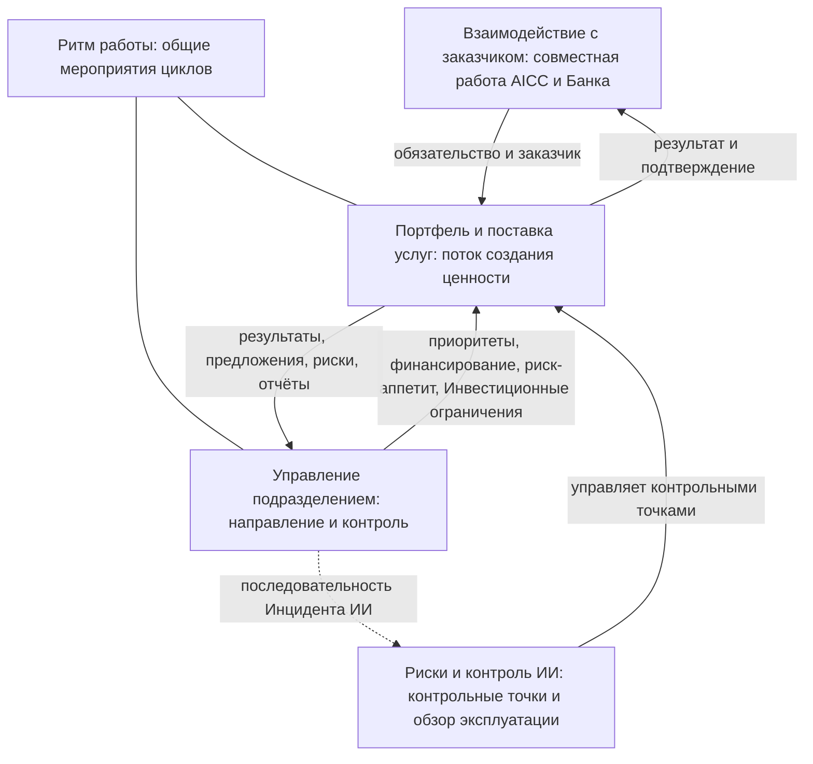

```yaml
source: charter/en/workflows/README.md
source_sha256: 5824c2d421d0bd8307c2a8f11f53dfa002baec472a7af563592e3c3348ae59a2
translation_status: reviewed
```

# Рабочие процессы

Циклы и потоки AICC показывают назначение и последовательность управления, без детализации отдельных действий. Они объясняют работу подразделения. Правила содержатся в документах корпуса Положения; рабочие процессы не устанавливают самостоятельных правил.

| Рабочий процесс | Назначение | Когда читать |
| --- | --- | --- |
| [Взаимодействие с заказчиком](engagement.md) | Рабочий процесс верхнего уровня между AICC и остальной частью Банка: работа AICC как внутреннего консалтингового подразделения от первого контакта до последующих действий, с Соглашением о взаимодействии, Отчётом о результатах и Уровнями поддержки | Функция обращается в AICC с потребностью либо вы руководите Взаимодействием с заказчиком и хотите знать шаги от первого контакта до последующих действий и обязательства AICC |
| [Портфель и поставка услуг](service-delivery.md) | Поток создания ценности от бизнес-потребности до вывода Решения из эксплуатации: Канбан-доска портфеля (Воронка, Рассмотрение, Анализ, бэклог, MVP и решение после него), Функциональные возможности и Функциональности, выполнение, развёртывание, эксплуатация и жизненный цикл с изменением, выводом из эксплуатации и показателями | Вы работаете над Инициативой или Решением и хотите знать его состояние, кто решает о следующем шаге и что следует далее |
| [Риски и контроль ИИ](ai-risk-control.md) | Прохождение Решением, Поставщиком и применением ИИ контрольных процедур Политики применения искусственного интеллекта: от Категории риска до контрольных точек перед использованием, обзора эксплуатации, Исключения, Приостановления и остановки | Вы определяете, проверяете, валидируете, выпускаете или рассматриваете Решение либо принимаете решение по Исключению, Приостановлению или остановке |
| [Ритм работы](cadence.md) | Мероприятия циклов по неделям, Итерациям и PI, без дат | Вы планируете неделю, Итерацию или квартал и хотите знать, какое мероприятие проводится и что на нём решается |
| [Инструменты совместной работы](collaboration-tooling.md) | Инструменты и порталы AICC, их назначение и использование в рабочих процессах | Вам нужно знать, что хранится в каждом инструменте и кто за него отвечает |
| [Управление подразделением](unit-governance.md) | Контроль AICC как подразделения: циклы на Управляющих совещаниях и содержание каждого совещания, передача решения на более высокий уровень, события, последовательности за месяц, квартал и год, Инцидент ИИ, цепочка отчётности и жизнь документа | Вы готовите Управляющее совещание или участвуете в нём, принимаете решение на определённом уровне, обрабатываете событие или отчитываетесь перед Комитетом Совета директоров |

Рисунок 1 показывает связи рабочих процессов.



Рисунок 1: рабочие процессы.

Рабочие процессы выполняются в Jira и Confluence после Перехода Рабочего состояния (Операционная модель 7.1); до этого Рабочее состояние хранится в Реестре. Корпус Положения содержит схему.
