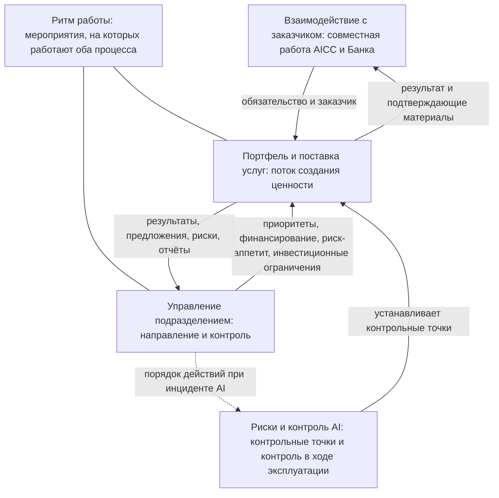

```yaml
source: charter/en/workflows/README.md
source_sha256: 5824c2d421d0bd8307c2a8f11f53dfa002baec472a7af563592e3c3348ae59a2
translation_status: reviewed
```

# Рабочие процессы

Рабочие процессы описывают циклы и потоки AICC — их назначение и последовательность управления, без детализации отдельных действий. Они поясняют, как работает подразделение. Правила установлены документами корпуса; рабочие процессы собственных правил не устанавливают.

Рабочие процессы AICC, их назначение и случаи, в которых к ним следует обращаться, приведены в следующей таблице.

| Рабочий процесс | Назначение | Повод для обращения |
| --- | --- | --- |
| [Взаимодействие с заказчиком](engagement.md) | Рабочий процесс верхнего уровня между AICC и остальными подразделениями Банка: как AICC работает в качестве внутреннего консалтингового подразделения — от первого обращения до последующего взаимодействия, включая соглашение о взаимодействии, отчёт о результатах и уровни поддержки | Подразделение обращается в AICC с потребностью либо вы руководите взаимодействием с заказчиком и хотите знать шаги от первого обращения до последующего взаимодействия и обязательства AICC |
| [Портфель и поставка услуг](service-delivery.md) | Поток создания ценности от бизнес-потребности до вывода решения из эксплуатации: канбан-доска портфеля (воронка, рассмотрение, анализ, бэклог, MVP и управленческое решение по его итогам), Capabilities и Features, выполнение работ, развёртывание, эксплуатация и жизненный цикл решения с изменениями, выводом из эксплуатации и показателями | Вы работаете над Initiative или решением и хотите знать, в каком состоянии они находятся, кто решает вопрос о следующем шаге и что за ним следует |
| [Риски и контроль AI](ai-risk-control.md) | Как решение, поставщик и случай применения AI проходят контрольные процедуры Политики применения AI: от категории риска до контрольных точек перед использованием, контроля в ходе эксплуатации, исключения, приостановления и остановки | Вы определяете, проверяете, валидируете, выпускаете или пересматриваете решение либо принимаете решение об исключении, приостановлении или остановке |
| [Ритм работы](cadence.md) | Мероприятия циклов по неделям, итерациям и PI, без дат | Вы планируете неделю, итерацию или квартал и хотите знать, какое мероприятие проводится и что на нём решается |
| [Инструменты совместной работы](collaboration-tooling.md) | Инструменты и порталы, которые использует AICC, их назначение и рабочие процессы, в которых они применяются | Вам нужно знать, что хранится в каждом инструменте и кто его ведёт |
| [Управление подразделением](unit-governance.md) | Управление AICC как подразделением: циклы, проводимые на управляющих совещаниях, и вопросы каждого совещания, эскалация управленческих решений, мероприятия, последовательность событий за месяц, квартал и год, инцидент AI, цепочка отчётности и жизненный цикл документа | Вы готовите управляющее совещание или участвуете в нём, принимаете управленческое решение на своём уровне, обрабатываете событие или отчитываетесь перед Комитетом Совета директоров |

Связи между рабочими процессами показаны на рисунке 1.



Рисунок 1 — Рабочие процессы AICC

После перехода рабочего состояния в Jira и Confluence (п. 7.1 Операционной модели) рабочие процессы выполняются в этих системах; до перехода рабочее состояние ведётся в реестре. Схема рабочего состояния содержится в корпусе.
