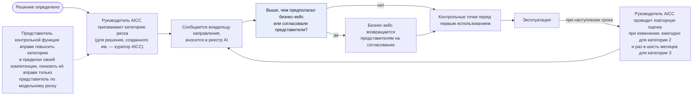
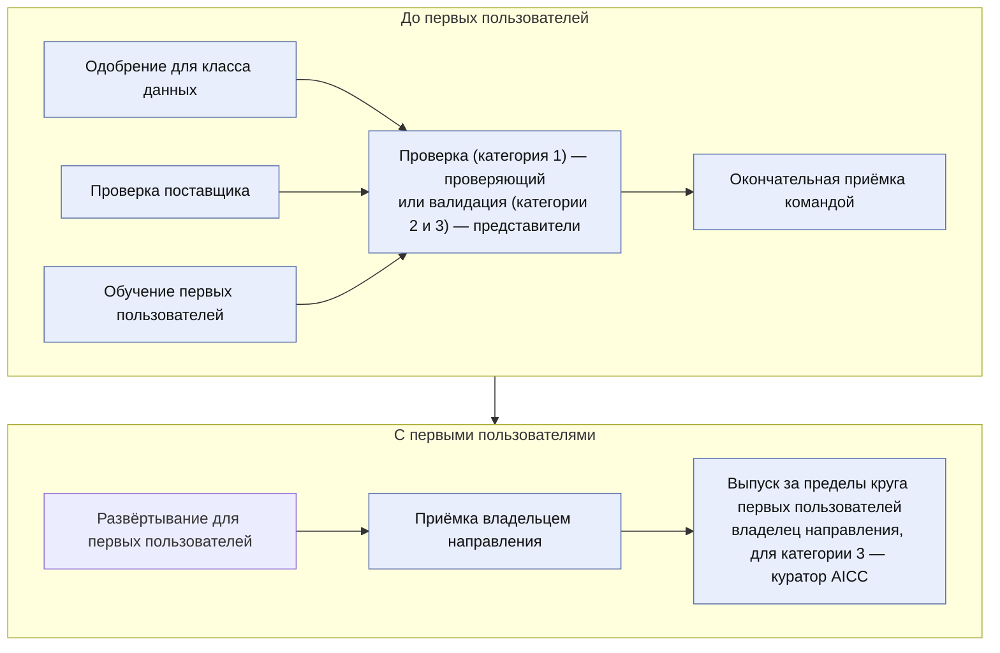
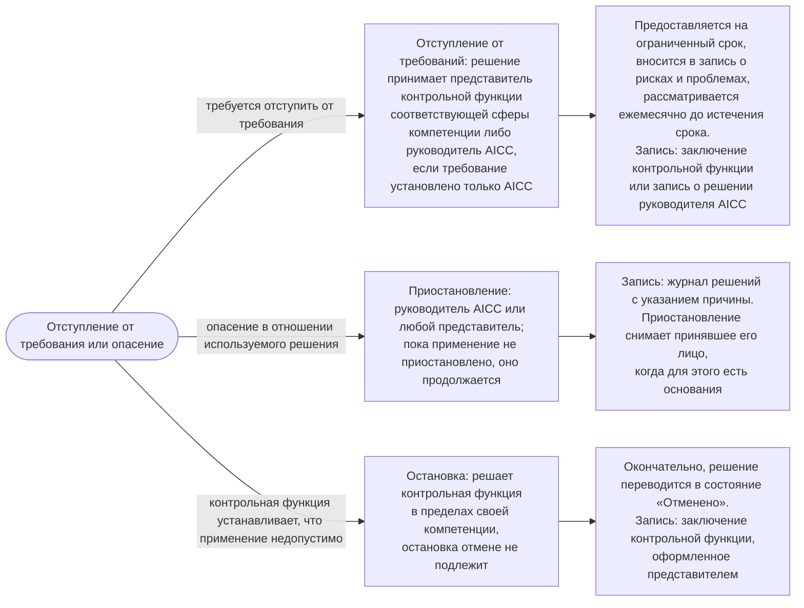

```yaml
source: charter/en/workflows/ai-risk-control.md
source_sha256: 05da8b653ab61f9ec56afdf0af3fb34677762010564a277bab29268918c8ef0e
translation_status: reviewed
```

# Workflow «Риски и контроль AI»

## 1. Назначение и область применения

Настоящий workflow показывает, как решение, поставщик и случай применения AI проходят контрольные процедуры Политики применения AI: от присвоения категории риска при определении решения через контрольные точки перед первым использованием до регулярного рассмотрения в ходе эксплуатации, а также отступление от требований, приостановление и остановку. Он отвечает на вопрос, как AICC удерживает применение AI в пределах риск-аппетита Банка. Здесь показаны контрольные точки, которые проходит workflow «Портфель и оказание услуг»; сам поток работ описан в этом workflow, а последовательность действий при инциденте AI — в workflow «Управление подразделением».

Правила установлены Политикой применения AI, Операционной моделью, Моделью жизненного цикла решений и Положением об AICC. Настоящий workflow показывает последовательность и назначение действий и собственных правил не устанавливает.

## 2. Категория риска

Категория риска решения определяет, какие проверки ему необходимы. Руководитель AICC присваивает её при определении решения на основании факторов риска, указанных в п. 3.1 Политики применения AI (класс данных, влияние AI на принятие решений, доведение результата до клиента или его влияние на клиента, степень автономности), и сообщает о ней владельцу направления. Для решения, созданного руководителем AICC, категорию риска присваивает куратор AICC. Представитель контрольной функции вправе повысить категорию риска в пределах своей компетенции, а понизить её вправе только представитель контрольной функции по модельному риску (п. 3.2 Политики применения AI). Если категория риска выше той, которую предполагал бизнес-кейс или согласовали представители контрольных функций, бизнес-кейс возвращается им на согласование (п. 6.4 Модели управления портфелем).

Категория риска повторно оценивается при изменении решения, ежегодно — для решения категории риска 2 и раз в шесть месяцев — для решения категории риска 3 (п. 3.3 Политики применения AI). Валидация действует до даты, указанной в реестре AI (п. 3.4 Политики применения AI). Присвоение и повторная оценка категории риска показаны на рисунке 1.



Рисунок 1 — Присвоение и повторная оценка категории риска

Если решение относится к группе систем AI, которую применимое к Банку законодательство относит к высокорисковым, ему присваивается категория риска не ниже 2. Лицо, проводящее проверку решения категории риска 1, и представители контрольных функций при валидации подтверждают категорию риска и выясняют, не относится ли решение к такой группе (п. 3.2 Политики применения AI).

## 3. Контрольные точки перед первым использованием

Решение доходит до первых пользователей, пройдя контрольные точки, показанные на рисунке 2. Данные класса, для которого не одобрено ни одно решение, не обрабатываются с применением AI ни на одном этапе, включая проработку, пока владелец направления не получит одобрения, требуемые внутренними нормативными документами Банка (п. 2.2 Политики применения AI). Развёртывание для реальных пользователей или на реальных данных не допускается до проведения проверки или валидации (п. 7.1 Модели жизненного цикла решений).



Рисунок 2 — Контрольные точки перед первым использованием

Лица, принимающие решение по каждой контрольной точке, и оформляемые записи приведены в следующей таблице.

| Контрольная точка | Кто принимает решение | Оформляемая запись |
| --- | --- | --- |
| Одобрение для класса данных | Владелец направления; руководитель AICC — для использования в AICC; куратор AICC — для решения, созданного руководителем AICC (п. 2.1 Политики применения AI) | Запись в реестре AI с указанием, кто и когда одобрил |
| Проверка поставщика | Представители контрольных функций по информационной безопасности, защите данных и правовым вопросам; для решения категории риска 1 или уже проверенного поставщика — только представитель контрольной функции по информационной безопасности (п. 4.1 Политики применения AI) | Заключение контрольной функции; оформляется повторно при каждой повторной оценке и при изменении условий или модели поставщика |
| Обучение первых пользователей | Руководитель AICC определяет программу обучения и отмечает его завершение без указания имён (пп. 2.1 и 3.5 Политики применения AI) | Запись в реестре AI |
| Проверка, категория риска 1 | Проверяющий — лицо, не участвовавшее в разработке (п. 3.3 Политики применения AI; п. 4.6 Операционной модели) | Запись о проверке в реестре AI |
| Валидация, категории риска 2 и 3 | Представители контрольных функций по модельному риску, по информационной безопасности и по каждой иной затронутой сфере компетенции; валидация включает тестирование защищённости от атак на AI и опирается на подтверждающие материалы, которые хранит владелец платформы (п. 3.3 Политики применения AI; п. 7.2 Модели жизненного цикла решений) | Заключение контрольной функции с указанием срока действия и изменений, при которых требуется новое заключение |
| Окончательная приёмка командой | Руководитель AICC — до первого развёртывания для первых пользователей (п. 7.3(b) Модели жизненного цикла решений) | Раздел о выпуске описания решения |
| Приёмка заказчиком | Владелец направления; куратор AICC — если элемент затрагивает несколько направлений, относится к обеспечивающим работам AICC или не имеет направления, а также если владельцем направления является руководитель AICC; приёмка проводится по результатам оценки работающего решения у первых пользователей (п. 7.3(c) Модели жизненного цикла решений) | Раздел о выпуске описания решения |
| Выпуск за пределы круга первых пользователей | Для категорий риска 1 и 2 — владелец направления, а если владельцем направления является руководитель AICC, — куратор AICC; для категории риска 3 — куратор AICC (п. 3.3 Политики применения AI; п. 4.4(d) Операционной модели) | Раздел о выпуске описания решения, контрольный лист приёмки, а для категории риска 3 — запись о решении |

## 4. Эксплуатация

Используемое решение остаётся под контролем благодаря регулярному рассмотрению и основаниям для пересмотра, приведённым в следующей таблице.

| Основание | Последствия | Кто принимает решение |
| --- | --- | --- |
| Каждое ревью и демонстрация итерации | Рассматриваются данные мониторинга, инциденты, использование решения и уведомления поставщиков; результаты рассмотрения отмечаются в описании решения (п. 3.5 Политики применения AI; п. 8.4 Модели жизненного цикла решений) | Владелец направления; для сервиса, затрагивающего несколько направлений, — куратор AICC |
| Существенное изменение: модели, поставщика, класса данных, степени автономности или любого фактора категории риска | Управленческое решение о новой проверке или валидации вносится в журнал решений, а изменение выпускается через контрольные точки в установленном порядке (п. 8.6 Модели жизненного цикла решений) | Руководитель AICC решает вопрос о новой проверке; выпускает изменение владелец направления, а для категории риска 3 — куратор AICC |
| Изменение, которое повышает категорию риска или которое при проверке или валидации названо требующим новой проверки или валидации | Решение возвращается в состояние «Проработка» для повторного прохождения проверок, которых касается изменение (п. 3.4 Политики применения AI) | Руководитель AICC повторно оценивает категорию риска (п. 3.5 Политики применения AI) |
| Категория риска повышается до 3 | Решение не используется за пределами круга первых пользователей, пока куратор AICC не выпустит его (п. 3.4 Политики применения AI) | Куратор AICC |
| Достигнуто сигнальное значение мониторинга либо после проверки или валидации в ходе эксплуатации выявлены дефекты | Владелец направления рассматривает решение; дефекты, выявленные после проверки или валидации, служат основанием для повторной оценки категории риска, и решение возвращается к порядку, показанному на рисунке 1 (п. 3.7 Политики применения AI) | Рассматривает владелец направления; повторно оценивает руководитель AICC |
| Наступила указанная в реестре AI дата повторной оценки или валидации | Категория риска оценивается повторно; если срок действия валидации истёк, решение проходит валидацию повторно (пп. 3.3 и 3.4 Политики применения AI) | Повторно оценивает руководитель AICC; валидацию проводят представители контрольных функций |

## 5. Отступление от требований, приостановление и остановка

Три способа ограничить применение или отступить от требования, лица, которые принимают по ним решение, и оформляемые записи показаны на рисунке 3.



Рисунок 3 — Отступление от требований, приостановление и остановка

Отступление от требований не является обходом контрольной процедуры (п. 6.1 Политики применения AI). Разногласия по валидации или остановке рассматривает руководитель соответствующей контрольной функции; куратор AICC вправе вынести вопрос на рассмотрение Правления Банка, но не вправе отменить валидацию или остановку (п. 5.4 Операционной модели).

## 6. Разовые управленческие решения куратора AICC

По двум видам применения AI куратор AICC принимает управленческое решение в каждом отдельном случае, и каждое такое решение оформляется записью о решении. Эти виды применения приведены в следующей таблице.

| Применение | Предмет решения куратора AICC | Запись |
| --- | --- | --- |
| Результат AI, предоставляемый инвесторам, кредиторам, надзорным органам или Совету директоров | Куратор AICC одобряет результат AI до его предоставления — по каждой версии — и вправе определить уполномоченное лицо, указав его в записи о назначениях (п. 2.4 Политики применения AI) | Запись о решении об одобрении каждой версии, внесённая в журнал решений |
| Соглашение об обмене данными с организацией за пределами Банка | Куратор AICC принимает решение после консультаций с представителями контрольных функций по защите данных, правовым вопросам, комплаенсу и информационной безопасности; в соглашении указываются стороны, состав данных, правовое основание, меры контроля и срок действия (п. 3.3 Положения об AICC) | Запись о решении, внесённая в журнал решений |

## 7. Инцидент AI

Инцидент AI обрабатывается в рамках процесса управления инцидентами Банка; руководитель AICC участвует в нём как заинтересованное лицо (раздел 5 Политики применения AI). Последовательность действий участников показана на рисунке 4 в разделе 6 workflow [«Управление подразделением»](unit-governance.md). После инцидента руководитель AICC повторно оценивает категорию риска решения (п. 5.8 Политики применения AI), и решение возвращается к порядку, показанному на рисунке 1.

## 8. Типовые ситуации

Порядок действий в типовых ситуациях приведён в следующей таблице.

| Ситуация | Порядок действий |
| --- | --- |
| Представитель контрольной функции повышает категорию риска используемого решения | Применяется более высокая категория риска; руководитель AICC обновляет реестр AI; проверки, которых касается изменение, проводятся повторно; решение, категория риска которого повысилась до 3, не используется за пределами круга первых пользователей, пока куратор AICC не выпустит его (пп. 3.2 и 3.4 Политики применения AI) |
| Поставщик меняет условия или модель | Поставщик проверяется повторно (п. 4.1 Политики применения AI); руководитель AICC решает, требуется ли в связи с изменением новая проверка или валидация, и вносит своё управленческое решение в журнал решений (п. 8.6 Модели жизненного цикла решений) |
| Направление хочет использовать класс данных, для которого не одобрено ни одно решение | Данные не обрабатываются с применением AI ни на одном этапе, включая проработку, пока владелец направления не получит одобрения, требуемые внутренними нормативными документами Банка (п. 2.2 Политики применения AI) |
| Решение создал руководитель AICC | Руководитель AICC не проводит его проверку и валидацию и не выпускает его; куратор AICC одобряет описание решения, присваивает категорию риска и одобряет использование решения для класса данных; если владельцем направления является руководитель AICC, куратор AICC также проводит бизнес-приёмку и выпускает решение, в остальных случаях это делает владелец направления (пп. 4.4(d) и 4.6 Операционной модели) |
| Выясняется, что решение категории риска 1 относится к группе систем AI, которую законодательство относит к высокорисковым | Решению присваивается категория риска не ниже 2, и вместо проверки представители контрольных функций проводят его валидацию (пп. 3.2 и 3.5 Политики применения AI) |
| Платформа AI, контрольная функция по информационной безопасности или работник сообщает о неодобренном применении AI | Руководитель AICC вносит это применение в реестр AI и предлагает владельцу направления одобренное решение, которое отвечает потребности, либо прекращение применения; применение, существовавшее на 2026-10-02, допускается, пока владелец направления не одобрит или не остановит его, но не позднее 2026-12-31 (пп. 2.1 и 2.7 Политики применения AI) |
| Для эксперимента нужны данные или внешняя среда | Эксперимент проводится в лабораторной среде на выгрузках только для чтения, для каждой из которых указан владелец источника, и ничего не записывает обратно в источник; используются только данные класса, одобренного для эксперимента (п. 2.2 Политики применения AI), а внешняя среда до размещения в ней данных Банка проверяется как поставщик (пп. 4.1 и 4.4 Политики применения AI; раздел 8 Модели жизненного цикла решений) |

## 9. Системы, в которых ведётся процесс

После перехода рабочего состояния в Jira и Confluence (п. 7.1 Операционной модели) описания решений и задачи ведутся в этих системах; до перехода рабочее состояние ведётся в реестре. Реестр AI, заключения контрольных функций и записи о решениях хранятся в реестре. Настоящая схема содержится в корпусе.
