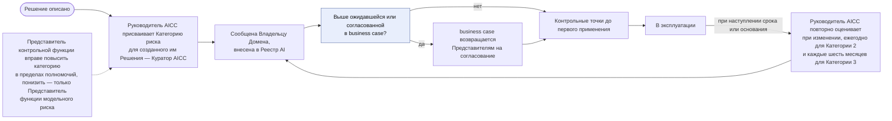
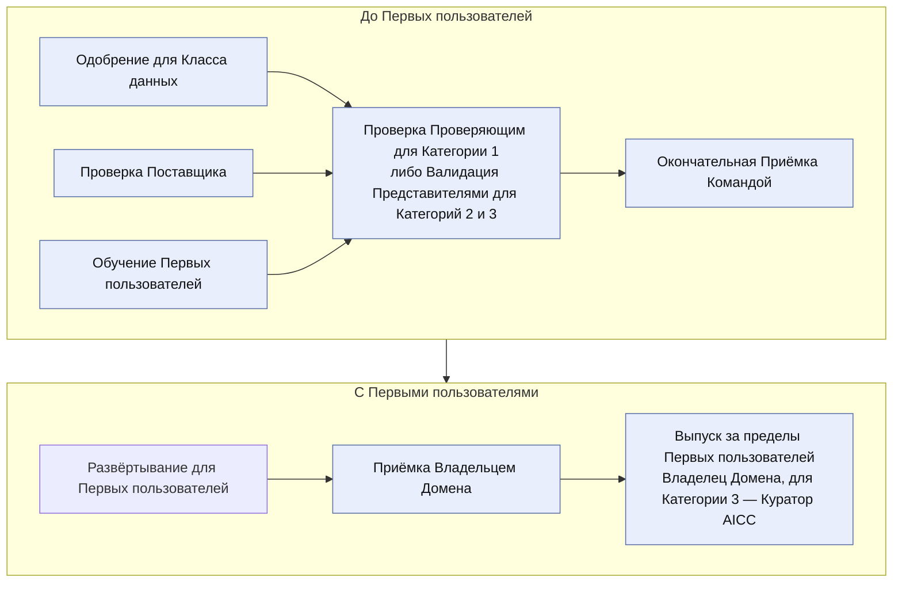
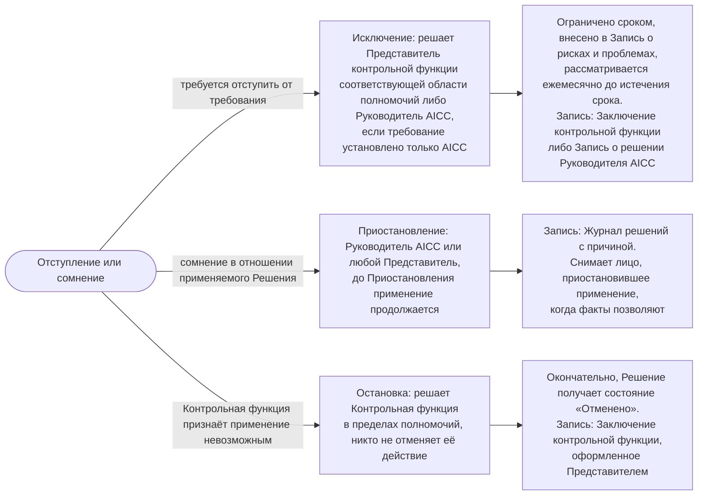

```yaml
source: charter/en/workflows/ai-risk-control.md
source_sha256: 05da8b653ab61f9ec56afdf0af3fb34677762010564a277bab29268918c8ef0e
translation_status: reviewed
```

# Workflow: Риски и контроль AI

## 1. Назначение и область применения

Workflow показывает, как Решение, Поставщик и применение AI проходят контрольные процедуры Политики применения AI: от Категории риска, присваиваемой при описании Решения, через контрольные точки до первого применения к рассмотрению работающего Решения, Исключению, Приостановлению и остановке. Он отвечает на вопрос: «Как AICC удерживает применение AI в пределах риск-аппетита Банка?» Здесь показаны контрольные точки, через которые проходит workflow «Поставка услуг»; поток работы ведётся в нём, а последовательность действий при Инциденте AI — в workflow «Управление подразделением».

Правила установлены Политикой применения AI, Операционной моделью, Моделью жизненного цикла решений и Положением об AICC. Этот workflow показывает порядок и назначение действий и не устанавливает собственных правил.

## 2. Категория риска

Категория риска Решения определяет необходимые проверки. Руководитель AICC присваивает её при описании Решения по признакам Политики применения AI 3.1: Класс данных, влияние AI на решение, получение результата клиентом или воздействие на него и степень автономности. Руководитель AICC сообщает Категорию риска Владельцу Домена. Для Решения, созданного Руководителем AICC, её присваивает Куратор AICC. Представитель контрольной функции вправе повысить её в пределах своих полномочий; понизить её вправе только Представитель функции модельного риска (Политика применения AI 3.2). Категория риска выше ожидавшейся в business case или согласованной Представителями контрольных функций требует возврата business case им на согласование (Модель управления портфелем 6.4).

Категория риска повторно оценивается при изменении, ежегодно для Решения Категории риска 2 и каждые шесть месяцев для Решения Категории риска 3 (Политика применения AI 3.3). Валидация действует до даты, указанной в Реестре AI (Политика применения AI 3.4). Рисунок 1 показывает присвоение и повторную оценку.



Рисунок 1: присвоение и повторная оценка Категории риска.

Если Решение относится к категории, которую применимое к Банку законодательство считает высокорисковой, ему присваивается как минимум Категория риска 2. Лицо, проверяющее Решение Категории риска 1, и Представители контрольных функций при Валидации подтверждают Категорию риска и выясняют, относится ли Решение к такой категории (Политика применения AI 3.2).

## 3. Контрольные точки до первого применения

Решение достигает Первых пользователей через контрольные точки рисунка 2. Данные Класса, для которого ни одно Решение не одобрено, не используются с AI ни на одном этапе, включая Проработку, пока Владелец Домена не получит одобрения, требуемые правилами Банка (Политика применения AI 2.2). Развёртывание для реальных пользователей или данных не допускается до Проверки или Валидации (Модель жизненного цикла решений 7.1).



Рисунок 2: контрольные точки до первого применения.

В таблице указаны уполномоченные лица и Записи по каждой контрольной точке.

| Контрольная точка | Кто принимает решение | Остающаяся Запись |
| --- | --- | --- |
| Одобрение для Класса данных | Владелец Домена; Руководитель AICC — для применения в AICC; Куратор AICC — для Решения, созданного Руководителем AICC (Политика применения AI 2.1) | Запись в Реестре AI с указанием одобрившего лица и даты |
| Проверка Поставщика | Представители контрольных функций информационной безопасности, защиты данных и правового обеспечения; только Представитель функции информационной безопасности — для Решения Категории риска 1 либо ранее проверенного Поставщика (Политика применения AI 4.1) | Заключение контрольной функции; проверка повторяется при каждой повторной оценке и при изменении условий или модели |
| Обучение Первых пользователей | Руководитель AICC определяет обучение и фиксирует его завершение без имён (Политика применения AI 2.1, 3.5) | Запись в Реестре AI |
| Проверка, Категория риска 1 | Проверяющий — лицо, не являющееся создателем (Политика применения AI 3.3; Операционная модель 4.6) | Запись о Проверке в Реестре AI |
| Валидация, Категории риска 2 и 3 | Представители контрольных функций модельного риска, информационной безопасности и каждой иной затронутой области полномочий; включает тестирование безопасности против атак на AI и опирается на подтверждающие материалы Владельца платформы (Политика применения AI 3.3; Модель жизненного цикла решений 7.2) | Заключение контрольной функции с датой окончания действия и изменениями, требующими новой Валидации |
| Окончательная Приёмка Командой | Руководитель AICC до первого развёртывания для Первых пользователей (Модель жизненного цикла решений 7.3(b)) | Раздел о Выпуске в Описании решения |
| Приёмка заявителем | Владелец Домена; Куратор AICC — если элемент охватывает несколько Доменов, относится к Обеспечивающим работам AICC, не имеет Домена либо Руководитель AICC является Владельцем Домена; на основании оценки работающего Решения с Первыми пользователями (Модель жизненного цикла решений 7.3(c)) | Раздел о Выпуске в Описании решения |
| Выпуск за пределы Первых пользователей | Владелец Домена для Категорий риска 1 и 2 либо Куратор AICC, если Руководитель AICC является Владельцем Домена; для Категории риска 3 — Куратор AICC (Политика применения AI 3.3; Операционная модель 4.4(d)) | Раздел о Выпуске в Описании решения, Контрольный лист приёмки и Запись о решении для Категории риска 3 |

## 4. В эксплуатации

Применяемое Решение остаётся под контролем через рассмотрение и основания, указанные в таблице.

| Основание | Последующее действие | Кто принимает решение |
| --- | --- | --- |
| Каждый Обзор и демонстрация Итерации | Рассматриваются мониторинг, инциденты, использование и уведомления Поставщиков; рассмотрение фиксируется в Описании решения (Политика применения AI 3.5; Модель жизненного цикла решений 8.4) | Владелец Домена; Куратор AICC — для Сервиса нескольких Доменов |
| Существенное изменение: модели, Поставщика, Класса данных, степени автономности или любого признака Категории риска | Решение о новой Проверке или Валидации вносится в Журнал решений; изменение выпускается через установленные контрольные точки (Модель жизненного цикла решений 8.6) | Руководитель AICC решает вопрос новой Проверки; Владелец Домена, а для Категории риска 3 — Куратор AICC, разрешает Выпуск |
| Изменение повышает Категорию риска либо указано в Проверке или Валидации как требующее повторного проведения | Решение возвращается в «Проработку» для проверок, затронутых изменением (Политика применения AI 3.4) | Руководитель AICC повторно оценивает Категорию риска (Политика применения AI 3.5) |
| Категория риска повышается до 3 | Решение не применяется за пределами Первых пользователей до разрешения Выпуска Куратором AICC (Политика применения AI 3.4) | Куратор AICC |
| Пересечено Сигнальное значение мониторинга либо после Проверки или Валидации в эксплуатации выявлены дефекты | Владелец Домена рассматривает Решение; дефекты после Проверки или Валидации приводят к повторной оценке Категории риска и возврату к рисунку 1 (Политика применения AI 3.7) | Владелец Домена рассматривает; Руководитель AICC повторно оценивает |
| Наступает дата повторной оценки или Валидации, указанная в Реестре AI | Категория риска повторно оценивается; при истечении срока Валидации она проводится повторно (Политика применения AI 3.3, 3.4) | Руководитель AICC повторно оценивает; Представители контрольных функций проводят Валидацию |

## 5. Исключение, Приостановление и остановка

Рисунок 3 показывает три способа ограничения применения или отступления от требования, уполномоченных лиц и остающиеся Записи.



Рисунок 3: Исключение, Приостановление и остановка.

Исключение не является обходом контрольной процедуры (Политика применения AI 6.1). Несогласие с Валидацией или остановкой передаётся руководителю соответствующей Контрольной функции. Куратор AICC вправе вынести вопрос на уровень исполнительного руководства, но не вправе отменить Валидацию или остановку (Операционная модель 5.4).

## 6. Отдельные решения Куратора AICC

В двух случаях применения AI Куратор AICC принимает решение каждый раз, с отдельной Записью о решении. Эти случаи приведены в таблице.

| Применение | Что решает Куратор AICC | Запись |
| --- | --- | --- |
| Результат направляется инвесторам, кредиторам, регуляторам или Совету директоров | Куратор AICC одобряет Результат AI до направления каждой редакции и вправе назначить уполномоченное лицо в Записи о назначениях (Политика применения AI 2.4) | Запись о решении по одобрению каждой редакции, внесённая в Журнал решений |
| Соглашение об обмене данными вне Банка | Куратор AICC принимает решение после консультаций с Представителями контрольных функций защиты данных, правового обеспечения, комплаенса и информационной безопасности; Соглашение устанавливает стороны, данные, правовое основание, контрольные меры и дату окончания (Положение об AICC 3.3) | Запись о решении, внесённая в Журнал решений |

## 7. Инцидент AI

Инцидент AI обрабатывается в рамках управления инцидентами Банка; Руководитель AICC является Заинтересованным лицом (Политика применения AI 5). Последовательность действий участников приведена в [workflow «Управление подразделением»](unit-governance.md), раздел 6, рисунок 4. После инцидента Руководитель AICC повторно оценивает Категорию риска Решения (Политика применения AI 5.8), возвращая его к рисунку 1.

## 8. Ситуации

| Ситуация | Порядок действий |
| --- | --- |
| Представитель контрольной функции повышает Категорию риска применяемого Решения | Применяется более высокая Категория риска; Руководитель AICC обновляет Реестр AI; затронутые изменением проверки повторяются. Решение, Категория риска которого стала 3, не применяется за пределами Первых пользователей до разрешения Выпуска Куратором AICC (Политика применения AI 3.2, 3.4) |
| Поставщик меняет условия или модель | Поставщик проверяется повторно (Политика применения AI 4.1); Руководитель AICC решает, требует ли изменение новой Проверки или Валидации, и вносит решение в Журнал решений (Модель жизненного цикла решений 8.6) |
| Домен хочет использовать Класс данных, для которого ни одно Решение не одобрено | Данные не используются с AI ни на одном этапе, включая Проработку, пока Владелец Домена не получит одобрения, требуемые правилами Банка (Политика применения AI 2.2) |
| Решение создал Руководитель AICC | Руководитель AICC не проводит его Проверку, Валидацию или Выпуск; Куратор AICC одобряет Описание решения, присваивает Категорию риска и одобряет применение для Класса данных. Если Руководитель AICC является Владельцем Домена, Куратор AICC также проводит бизнес-приёмку и разрешает Выпуск; в остальных случаях это делает Владелец Домена (Операционная модель 4.4(d), 4.6) |
| Выясняется, что Решение Категории риска 1 относится к категории, которую закон считает высокорисковой | Решение получает как минимум Категорию риска 2; вместо Проверки Представители контрольных функций проводят Валидацию (Политика применения AI 3.2, 3.5) |
| Платформа AI, функция информационной безопасности или человек сообщает о неодобренном применении AI | Руководитель AICC вносит применение в Реестр AI и предлагает Владельцу Домена одобренное Решение, покрывающее потребность, либо остановку применения. Применение, существовавшее на 2026-10-02, допускается до его одобрения или остановки Владельцем Домена, но не позднее 2026-12-31 (Политика применения AI 2.1, 2.7) |
| Эксперименту нужны данные или внешняя среда | Эксперимент выполняется в Лабораторной среде на выгрузках только для чтения с указанием владельца источника каждой выгрузки и ничего не записывает обратно в источник; используются только данные одобренного для него Класса (Политика применения AI 2.2). Внешняя среда проверяется как Поставщик до размещения в ней данных Банка (Политика применения AI 4.1, 4.4; Модель жизненного цикла решений 8) |

## 9. Где выполняется процесс

Со дня Перехода Рабочего состояния (Операционная модель 7.1) Описания решений и Рабочие задачи ведутся в Jira и Confluence; до этого Рабочее состояние ведётся в Реестре. Реестр AI, Заключения контрольных функций и Записи о решениях хранятся в Реестре. Корпус Положения содержит эту схему.
