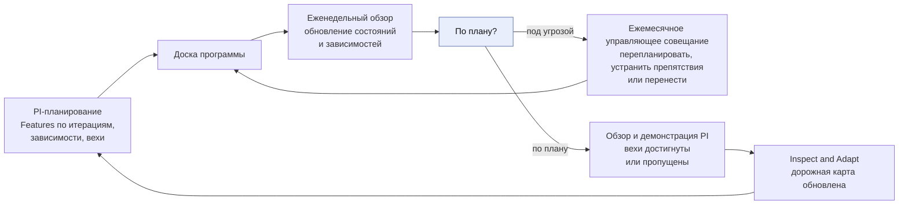
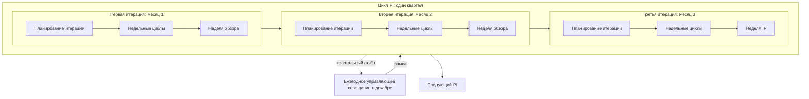
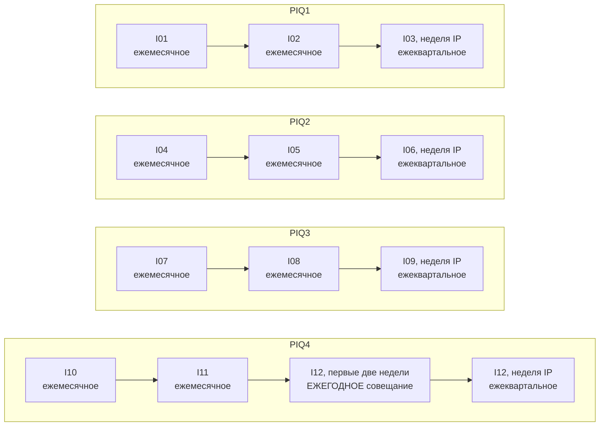
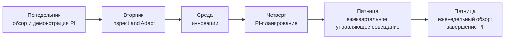
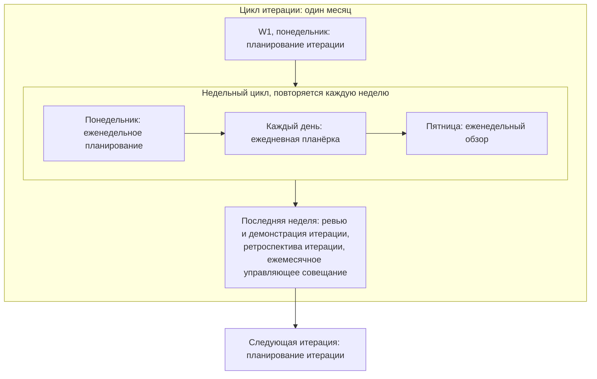
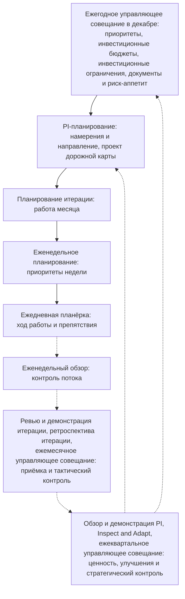

```yaml
source: charter/en/workflows/cadence.md
source_sha256: cd646bd76b4ed28a35fc5d647036a1e7c90eb2f80a4fa08a561babb573a89f0e
translation_status: reviewed
```

# Расписание работы

Расписание работы описывает общий порядок работы AICC в течение PI, его итераций и их недель. Дат в нём нет. Расписание работы служит шаблоном и руководством для календаря мероприятий с датами, который составляется на скользящий период в два квартала по фактическим дням календаря. Шаблон исходит из календаря без ограничений: понедельник и пятница — дни планирования и обзора, нерабочих дней и дней ограниченной доступности нет. Отступления от этого фиксируются в календаре, и по его правилам мероприятия переносятся на предшествующий день. Дни недели, на которые приходятся мероприятия, и планирование на скользящий период в два квартала приведены как пример применения шаблона расписания работы, определённого документом «Терминология и стиль»; фактические дни устанавливает календарь.

Расписание работы содержит только порядок: циклы и мероприятия, а также входы и результаты каждого мероприятия. Содержание работы на каждом мероприятии описано в других workflows. Сокращения, обозначения и мероприятия определены документом «Терминология и стиль».

## 1. Каждая неделя

Каждая неделя, как принято в методе канбан, начинается с планирования и завершается обзором. Ежедневная планёрка проводится каждый рабочий день и в расписании работы отдельно не отмечается.

Еженедельные мероприятия приведены в следующей таблице.

| День | Мероприятие |
| --- | --- |
| Понедельник | Еженедельное планирование |
| Каждый рабочий день | Ежедневная планёрка (подразумевается, отдельно не отмечается) |
| Пятница | Еженедельный обзор |

## 2. Каждая итерация

Итерация — один календарный месяц. Она состоит из четырёх или пяти полных недель; последняя неделя — неделя обзора, кроме третьей итерации PI, в которой её место занимает неделя IP. В пятинедельной итерации в середине добавляется ещё одна рабочая неделя. Уточнение бэклога не является отдельным мероприятием недели: оно проводится в рамках еженедельного планирования и еженедельного обзора любой недели в соответствии с пп. 6.3 и 6.6 Модели жизненного цикла решений.

Мероприятия итерации приведены в следующей таблице.

| Неделя итерации | Мероприятия в дополнение к еженедельным |
| --- | --- |
| W1 | Понедельник: планирование итерации вместо еженедельного планирования |
| Средние недели (W2 и W3 в четырёхнедельной итерации; W2–W4 в пятинедельной) | Дополнительных мероприятий нет: эти недели отведены на работу |
| Последняя неделя (W4 или W5) — неделя обзора | Ревью и демонстрация итерации с рассмотрением работающих решений, затем ретроспектива итерации; в течение недели — ежемесячное управляющее совещание в день, который назначается после согласования с внешними календарями |

## 3. Каждый PI

PI — квартал из трёх итераций. В каждой итерации повторяется один и тот же порядок, а последняя неделя третьей итерации — неделя IP.

Итерации каждого PI приведены в следующей таблице.

| PI | Первая итерация | Вторая итерация | Третья итерация |
| --- | --- | --- | --- |
| PIQ1 | I01 | I02 | I03, завершается неделей IP |
| PIQ2 | I04 | I05 | I06, завершается неделей IP |
| PIQ3 | I07 | I08 | I09, завершается неделей IP |
| PIQ4 | I10 | I11 | I12, завершается неделей IP |

Особенности итераций PI приведены в следующей таблице.

| Итерация PI | Особенность |
| --- | --- |
| Первая | Планирование итерации исходит из намерений и направления, определённых на PI-планировании |
| Вторая | Дополнений к порядку итерации нет |
| Третья | Последняя неделя — неделя IP вместо недели обзора |

Доска программы — доска зависимостей PI (п. 4.3 Модели жизненного цикла решений). Она формируется на PI-планировании: Features распределяются по итерациям, вносятся зависимости и переносятся вехи из дорожной карты. На еженедельном обзоре доска поддерживается в актуальном состоянии. Веха, достижение которой под угрозой, выносится на ежемесячное управляющее совещание, где её перепланируют, устраняют препятствия или переносят. На обзоре и демонстрации PI показывается, какие вехи достигнуты, а какие нет, а на Inspect and Adapt обновляется дорожная карта. Дорожная карта предлагается на PI-планировании и подтверждается на ежеквартальном управляющем совещании. Работа с доской программы в течение PI показана на рисунке 1.



Рисунок 1 — Доска программы в течение PI

## 4. Неделя IP

Неделя IP — последняя неделя третьей итерации. На ней в следующем порядке проводятся мероприятия PI. На неё же приходятся ревью и демонстрация и ретроспектива третьей итерации: они проводятся в составе обзора и демонстрации PI и Inspect and Adapt соответственно.

Мероприятия недели IP приведены в следующей таблице.

| День | Мероприятие |
| --- | --- |
| Понедельник | Обзор и демонстрация PI, включая ревью и демонстрацию третьей итерации |
| Вторник | Inspect and Adapt, включая ретроспективу третьей итерации |
| Среда | Инновации |
| Четверг | PI-планирование |
| Пятница | Ежеквартальное управляющее совещание, затем еженедельный обзор, завершающий PI |

В месяце, на который приходится неделя IP (март, июнь и сентябрь), отдельное ежемесячное управляющее совещание не проводится: ежеквартальное управляющее совещание в пятницу одновременно служит управляющим совещанием этого месяца и охватывает месячный цикл контроля (п. 6.7 Модели жизненного цикла решений). Исключение составляет декабрь: ежемесячное управляющее совещание декабря проводится в первые две недели месяца как ежегодное управляющее совещание, посвящённое следующему году, а ежеквартальное управляющее совещание недели IP охватывает только цикл подтверждения надлежащего функционирования и цикл обзора портфеля. Календарь может установить неделю IP раньше и оставить последнюю неделю года свободной от мероприятий (п. 6.1 Модели жизненного цикла решений); в этом случае приведённый выше порядок дней сохраняется в той неделе, на которую календарь установил неделю IP.

## 5. Циклы

Расписание работы строится на четырёх циклах, установленных п. 6.1 Модели жизненного цикла решений: цикле PI, вложенных в него циклах итераций, недельном цикле внутри каждой итерации и дневном цикле ежедневной планёрки. Каждый цикл начинается с планирования и завершается обзором, а результаты каждого обзора используются при планировании следующего цикла. Год не является пятым рабочим циклом: ежегодное управляющее совещание устанавливает рамки следующего года, в которых проходят циклы PI этого года. На мероприятиях этих циклов проводятся также циклы управления, установленные разделом 6 Операционной модели, и циклы управления портфелем, установленные разделом 4 Модели управления портфелем: на еженедельном обзоре — операционный цикл и цикл ведения бэклога, на ежемесячном управляющем совещании — цикл контроля и цикл синхронизации портфеля, на ежеквартальном управляющем совещании — цикл подтверждения надлежащего функционирования и цикл обзора портфеля, а на ежегодном управляющем совещании, которое является ежемесячным управляющим совещанием декабря и проводится в первые две недели месяца, — дополнительно цикл определения направления и стратегический цикл.

На рисунке 2 показан цикл PI с тремя вложенными циклами итераций в рамках, которые устанавливает ежегодное управляющее совещание в декабре. Последняя неделя третьей итерации — неделя IP, на которой завершается текущий PI и планируется следующий.



Рисунок 2 — Цикл PI и циклы итераций в рамках, установленных ежегодным управляющим совещанием

На рисунке 3 показаны управляющие совещания года — по одной строке на каждый PI. В месяце, на который приходится неделя IP, вместо ежемесячного управляющего совещания проводится ежеквартальное, а в декабре в первые две недели проводится ежегодное управляющее совещание — дополнительно к ежеквартальному управляющему совещанию недели IP.



Рисунок 3 — Управляющие совещания года

На рисунке 4 показана неделя IP — завершение цикла PI и начало следующего.



Рисунок 4 — Неделя IP

На рисунке 5 показан цикл итерации с вложенным недельным циклом. Неделя обзора завершает итерацию, а следующая итерация начинается с планирования.



Рисунок 5 — Цикл итерации и недельный цикл

На рисунке 6 показано, как планирование идёт сверху вниз, а результаты обзоров — снизу вверх. На каждом обзоре контролируется свой цикл, а его результаты используются при планировании вышестоящего цикла.



Рисунок 6 — Планирование сверху вниз и контроль снизу вверх

## 6. Содержание мероприятий

В следующей таблице мероприятия приведены от самого короткого цикла к самому длинному. Для каждого мероприятия указаны цикл, место в порядке работы, участники, входы, результаты, рассматриваемые показатели и назначение (пп. 6.1 и 6.8 Модели жизненного цикла решений). По показателям отслеживается динамика; целевые значения здесь не устанавливаются (п. 10.1 Модели жизненного цикла решений). Ежегодное управляющее совещание является ежемесячным управляющим совещанием декабря и охватывает также всё, что указано в строке ежемесячного управляющего совещания.

| Мероприятие | Цикл | Время проведения | Участники | Входы | Результаты | Рассматриваемые показатели | Назначение |
| --- | --- | --- | --- | --- | --- | --- | --- |
| Ежедневная планёрка | День | Каждый рабочий день | Команда | Бэклог итерации | Выявленные препятствия | Нет | Сообщить о ходе работы и устранить препятствия |
| Еженедельное планирование | Неделя | Понедельник | Руководитель AICC и инженеры решений | Бэклог итерации, доска программы | Приоритеты недели | Нет | Определить приоритеты недели и сверить зависимости |
| Еженедельный обзор | Неделя | Пятница | Руководитель AICC и инженеры решений | Канбан программы, бэклог портфеля и воронка, доска программы, бэклог итерации | Переупорядоченный бэклог программы, актуальные панель показателей и доска программы, элементы, достигшие контрольной точки | Возраст самого старого элемента в воронке; незавершённая работа и её возраст; элементы в состоянии «Ожидание» и число дней ожидания | Держать поток под контролем и поддерживать соответствие плана фактическому ходу работы |
| Уточнение бэклога | Итерация | В рамках еженедельного планирования и еженедельного обзора | Команда с владельцем продукта | Бэклог программы | Элементы, готовые к выбору, на одну-две итерации вперёд | Готовые Features, в итерациях работы вперёд | Поддерживать готовность следующих элементов, чтобы планирование проходило быстро |
| Планирование итерации | Итерация | W1, понедельник | Команда с владельцем продукта | Цели PI, бэклог программы, дорожная карта, доска программы | Бэклог итерации и цель итерации | Готовые Features | Отобрать работу на месяц в соответствии с намерениями, определёнными на PI-планировании |
| Ревью и демонстрация итерации | Итерация | Неделя обзора | Команда, её владелец продукта и владелец направления каждого работающего решения, а для сервиса, затрагивающего несколько направлений, — куратор AICC | Бэклог итерации, работающие решения, четыре сигнала каждого работающего решения и уведомления его поставщиков | Приёмка Features и Capabilities, возвращённые элементы, обратная связь, отметка о рассмотрении каждого работающего решения (п. 8.4 Модели жизненного цикла решений) | Принятые Features в сопоставлении с отобранными; доля принятых с первого предъявления; доля неудачных изменений; четыре сигнала каждого работающего решения | Показать работающий результат владельцу продукта, провести приёмку и рассмотреть работающие решения с их владельцами направлений |
| Ретроспектива итерации | Итерация | Неделя обзора, после ревью и демонстрации итерации | Команда | Работа за месяц | Одно-два улучшения, оформленные как задачи или Features | Нет | Улучшить способ работы |
| Ежемесячное управляющее совещание | Итерация | Неделя обзора, в день, согласованный с внешними календарями; в месяце, на который приходится неделя IP (март, июнь, сентябрь), ежеквартальное управляющее совещание одновременно служит совещанием этого месяца; в декабре — первые две недели месяца, в качестве ежегодного управляющего совещания | Куратор AICC, Управляющий комитет по AI и руководитель AICC | Панель показателей, бэклог портфеля, риски, итоги ревью и демонстрации итерации | Рассмотрение хода работы, рисков и препятствий; управленческие решения на контрольных точках, срок которых наступил; приёмки; выборка управленческих решений руководителя AICC; рассмотрение работающих решений; действующие отступления от требований; недостатки контроля; добавление, изменение или исключение показателя (п. 10.5 Модели жизненного цикла решений); итоги управляющего совещания | Время от предложения до одобрения; ожидающие инициативы и инициативы в работе в сопоставлении с лимитом | Рассмотреть портфель и состояние контроля подразделения и принять управленческие решения |
| Обзор и демонстрация PI | PI | Неделя IP, понедельник | Команды, владелец продукта, владельцы направлений, а для обеспечивающих работ — куратор AICC | Итерации PI, цели PI с запланированной бизнес-ценностью | Достигнутая бизнес-ценность каждой цели PI и данные для квартального отчёта | Предсказуемость PI, оцениваемая как диапазон значений; зависимости, выполненные к установленной дате | Показать, что создано за PI, и оценить ценность результата |
| Inspect and Adapt | PI | Неделя IP, вторник | Команды и руководитель AICC | Результаты и поток PI | Улучшения в виде Features в бэклоге программы и обновлённая дорожная карта | Нет | Решить основные проблемы PI |
| Инновации | PI | Неделя IP, среда | Команды | Свободное время | Новые идеи и знания, погашение долгов, накопившихся за PI | Нет | Время для обучения, экспериментов и восстановления сил |
| PI-планирование | PI | Неделя IP, четверг | Команды, владелец продукта, владельцы направлений, руководитель AICC, а для обеспечивающих работ — куратор AICC | Бэклог программы, проект квартального отчёта, доска программы | Цели PI с запланированной бизнес-ценностью и оценкой уверенности команды, проект дорожной карты, доска программы, зависимости | Нет | Определить намерения и направление следующего PI и предложить дорожную карту |
| Ежеквартальное управляющее совещание | PI | Неделя IP, пятница | Куратор AICC, Управляющий комитет по AI, руководитель AICC и представители контрольных функций | Квартальный отчёт, цели PI, снимок папки, реестр рисков и проблем, четыре сигнала каждого сервиса, сводная оценка лабораторной среды | Управленческое решение по каждой инициативе в работе; управленческое решение о переходе сервиса, если этого требуют результаты анализа сигналов (п. 8.11 Модели жизненного цикла решений); рассмотрение внедрённых решений и сверка реестра AI-решений с фактически используемыми случаями применения AI, инициатив в работе — с лимитом, а также контроль полноты отчётов о результатах; ежеквартальная проверка рисков, включая зависимость от поставщиков и наступившие сроки повторной оценки категорий риска; пересмотр прав доступа; сверка инцидентов AI; уровень зрелости; подтверждение целей PI и дорожной карты; утверждение квартального отчёта и определение того, направлять ли его Комитету Совета директоров или Совету директоров. Совещание, завершающее PIQ4, не устанавливает приоритеты, инвестиционные бюджеты, инвестиционные ограничения, документы, риск-аппетит и не производит назначения, поскольку это сделано на ежегодном управляющем совещании | Подтверждённая выгода в сопоставлении с инвестиционным бюджетом; опережающие индикаторы MVP в сопоставлении с планом; четыре сигнала каждого сервиса | Оценить прошедший квартал и принять управленческие решения |
| Ежегодное управляющее совещание | Год | Ежемесячное управляющее совещание декабря, в первые две недели месяца | Куратор AICC, Управляющий комитет по AI и руководитель AICC | Квартальный отчёт за PIQ3, выводы, сделанные за год на эту дату | Подтверждение того, что все назначения произведены; документы и Заявление о риск-аппетите в отношении AI; стратегические приоритеты, инвестиционные бюджеты и инвестиционные ограничения на следующий год; ежегодное предложение по стратегии внедрения AI | Выгода в сопоставлении с каждым инвестиционным бюджетом | Установить рамки следующего года |

## 7. Правила

Правила переноса и пропуска мероприятий, а также правила проведения еженедельного обзора установлены п. 6.5 Модели жизненного цикла решений. Расписание работы никем не утверждается.

## 8. Календарь мероприятий с датами

Календарь мероприятий с датами составляется на основе этого порядка на скользящий период в два квартала: текущий и следующий PI. Для каждого мероприятия в нём указываются неделя (например, 2026-PIQ4 I10W1), фактическая дата, взятая из календаря, и день, с которого мероприятие перенесено, если его перенесли по правилам календаря. Календарь мероприятий составляется на PI-планировании на следующие два квартала и уточняется на еженедельном обзоре.

## 9. Облегчённый режим

Пока в команде не более трёх человек, применяется п. 6.6 Модели жизненного цикла решений. Сохраняющиеся мероприятия приведены в следующей таблице.

| Мероприятие | В облегчённом режиме |
| --- | --- |
| Ежедневная планёрка | Необязательна |
| Еженедельное планирование и еженедельный обзор | Одна встреча в неделю, на которой также рассматриваются запросы и проблемы каждого сервиса, который эксплуатирует AICC (п. 8.10 Модели жизненного цикла решений) |
| Уточнение бэклога | Необязательно, в рамках еженедельной встречи |
| Планирование итерации | Проводится |
| Ревью и демонстрация итерации | Проводится; в его составе проводятся ретроспектива итерации, ежемесячное управляющее совещание и рассмотрение работающих решений |
| Обзор и демонстрация PI | Проводится; в его составе проводится Inspect and Adapt |
| Инновации | Необязательны |
| PI-планирование | Проводится |
| Ежеквартальное управляющее совещание | Проводится; в месяце, на который приходится неделя IP, одновременно служит управляющим совещанием этого месяца, кроме декабря |

## 10. Терминология

Сокращения PI и IP, обозначения PIQ1–PIQ4, I01–I12 и W1–W5, а также термины «цикл», «неделя обзора» и «расписание работы» определены документом «Терминология и стиль».
