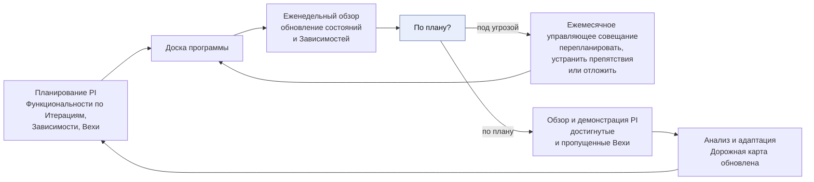
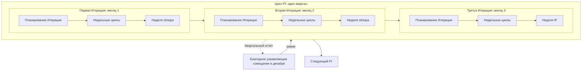
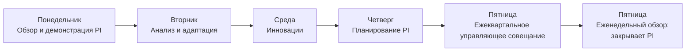
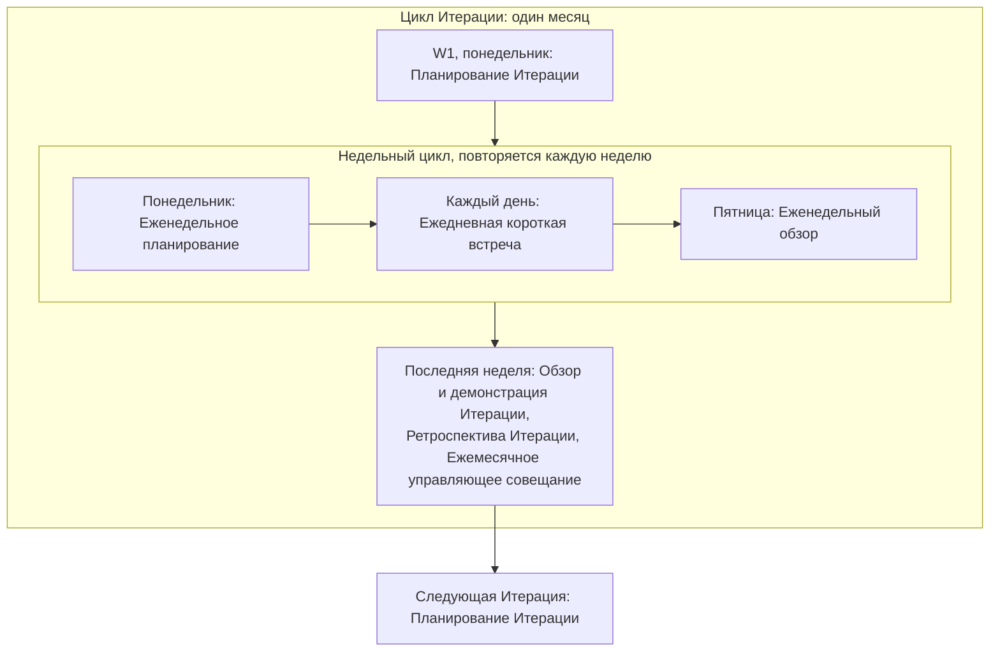
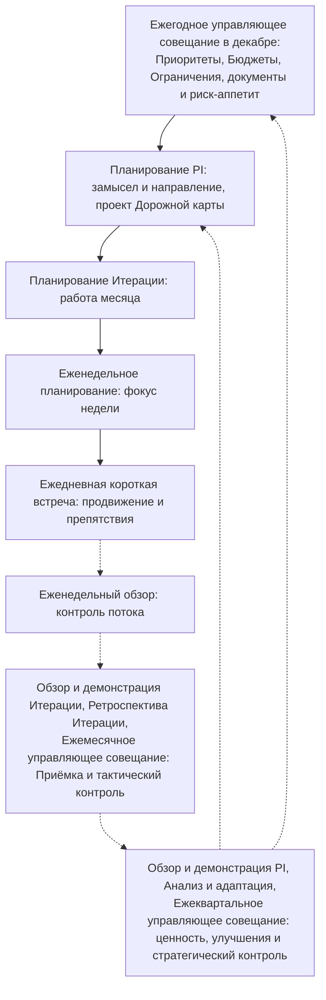

```yaml
source: charter/en/workflows/cadence.md
source_sha256: 6d4478da4f37846e5c13985f1514730b141d29e46b785ac7a5cbe5ae3dbb1fdd
translation_status: reviewed
```

# Ритм работы

Общий порядок работы AICC в рамках PI, его Итераций и недель. Дат здесь нет. Это шаблон и руководство для календаря мероприятий с датами, составляемого на скользящий горизонт двух кварталов по фактическим дням Календаря. Шаблон предполагает календарь без ограничений: понедельник и пятница — дни планирования и обзора, Нерабочих дней и Дней ограниченной доступности нет. Календарь фиксирует ограничения; его правила переносят мероприятия на предшествующий день. Дни недели и планирование на скользящий горизонт двух кварталов служат примером в этом шаблоне Ритма работы, определённого в Терминологии и стиле; фактические дни устанавливает Запись о Календаре.

Ритм работы содержит только порядок: циклы и мероприятия с входами и результатами каждого мероприятия. Содержание действий внутри мероприятий описано в других рабочих процессах. Сокращения, обозначения и мероприятия определены в документе «Терминология и стиль».

## 1. Каждая неделя

Каждая неделя начинается планированием и завершается обзором, как в Канбане. Ежедневная короткая встреча проводится каждый рабочий день и отдельно в ритме работы не обозначается.

| День | Мероприятие |
| --- | --- |
| Понедельник | Еженедельное планирование |
| Каждый рабочий день | Ежедневная короткая встреча (подразумевается; не обозначается) |
| Пятница | Еженедельный обзор |

## 2. Каждая Итерация

Итерация — один календарный месяц. Она состоит из четырёх или пяти полных недель; последняя неделя — Неделя обзора, кроме третьей Итерации PI, где её заменяет Неделя IP. В пятинедельной Итерации в середине есть дополнительная рабочая неделя. Уточнение бэклога не является отдельным мероприятием недели: оно проводится в рамках Еженедельного планирования и Еженедельного обзора любой недели по Модели жизненного цикла решений 6.3 и 6.6.

| Неделя Итерации | Мероприятия дополнительно к еженедельным |
| --- | --- |
| W1 | Понедельник: Планирование Итерации вместо Еженедельного планирования |
| Средние недели (W2 и W3 в четырёхнедельной Итерации; W2–W4 в пятинедельной) | Дополнительных мероприятий нет: недели отведены работе |
| Последняя неделя (W4 или W5): Неделя обзора | Обзор и демонстрация Итерации с рассмотрением работающих Решений, затем Ретроспектива Итерации; в течение недели — Ежемесячное управляющее совещание в день, определённый после согласования внешних календарей |

## 3. Каждый PI

PI — квартал из трёх Итераций. В каждой повторяется один порядок; последняя неделя третьей Итерации — Неделя IP.

| PI | Первая Итерация | Вторая Итерация | Третья Итерация |
| --- | --- | --- | --- |
| PIQ1 | I01 | I02 | I03, завершается Неделей IP |
| PIQ2 | I04 | I05 | I06, завершается Неделей IP |
| PIQ3 | I07 | I08 | I09, завершается Неделей IP |
| PIQ4 | I10 | I11 | I12, завершается Неделей IP |

| Итерация PI | Особенность |
| --- | --- |
| Первая | Планирование Итерации исходит из замысла и направления, определённых на Планировании PI |
| Вторая | Дополнений к порядку Итерации нет |
| Третья | Последняя неделя — Неделя IP вместо Недели обзора |

Доска программы — доска Зависимостей PI (Модель жизненного цикла решений 4.3). Она формируется на Планировании PI: Функциональности распределяются по Итерациям, вносятся Зависимости и Вехи из Дорожной карты. Еженедельный обзор поддерживает её актуальность. Веха под угрозой выносится на Ежемесячное управляющее совещание для перепланирования, устранения препятствий или отложения. Обзор и демонстрация PI показывает достигнутые и пропущенные Вехи; Дорожная карта обновляется на Анализе и адаптации. Планирование PI предлагает Дорожную карту, Ежеквартальное управляющее совещание подтверждает её. Рисунок 1 показывает работу с Доской программы в течение PI.



Рисунок 1: Доска программы в течение PI.

## 4. Неделя IP

Последняя неделя третьей Итерации. Мероприятия PI проводятся в следующем порядке. Обзор и демонстрация Итерации и Ретроспектива третьей Итерации входят соответственно в Обзор и демонстрацию PI и Анализ и адаптацию.

| День | Мероприятие |
| --- | --- |
| Понедельник | Обзор и демонстрация PI, включая Обзор и демонстрацию третьей Итерации |
| Вторник | Анализ и адаптация, включая Ретроспективу третьей Итерации |
| Среда | Инновации |
| Четверг | Планирование PI |
| Пятница | Ежеквартальное управляющее совещание, затем Еженедельный обзор, закрывающий PI |

В месяце с Неделей IP (март, июнь, сентябрь) отдельного Ежемесячного управляющего совещания нет: Ежеквартальное управляющее совещание в пятницу одновременно является Управляющим совещанием месяца и охватывает месячный цикл контроля (Модель жизненного цикла решений 6.7). Исключение — декабрь: Ежемесячное управляющее совещание проводится в первые две недели как Ежегодное, на следующий год; Ежеквартальное управляющее совещание Недели IP охватывает только цикл подтверждения надлежащего функционирования и обзор портфеля. Календарь может установить Неделю IP раньше и оставить последнюю неделю года без мероприятий (Модель жизненного цикла решений 6.1); указанный порядок дней сохраняется в той неделе, которую определил Календарь.

## 5. Циклы

Ритм работы основан на четырёх циклах Модели жизненного цикла решений 6.1: цикл PI, вложенные циклы Итераций, недельный цикл внутри каждой Итерации и дневной цикл Ежедневной короткой встречи. Каждый цикл начинается планированием и завершается обзором; каждый обзор служит входом для планирования следующего цикла. Год не является пятым рабочим циклом: Ежегодное управляющее совещание устанавливает рамки следующего года, в которых выполняются его циклы PI. В мероприятиях этих циклов также выполняются циклы контроля Операционной модели 6 и циклы портфеля Модели управления портфелем 4: Еженедельный обзор охватывает операционный цикл и цикл ведения бэклога, Ежемесячное управляющее совещание — цикл контроля и синхронизацию портфеля, Ежеквартальное — цикл подтверждения надлежащего функционирования и обзор портфеля. Ежегодное управляющее совещание, являющееся Ежемесячным управляющим совещанием декабря в первые две недели, дополнительно охватывает цикл определения направления и стратегический цикл.

Рисунок 2 показывает цикл PI с тремя вложенными циклами Итераций в рамках, установленных Ежегодным управляющим совещанием декабря. Последняя неделя третьей Итерации — Неделя IP, в которой завершается текущий PI и планируется следующий.



Рисунок 2: цикл PI и циклы Итераций в рамках Ежегодного управляющего совещания.

Рисунок 3 показывает Управляющие совещания года: по одной строке на каждый PI в последовательном порядке. В месяце с Неделей IP Ежеквартальное управляющее совещание заменяет Ежемесячное. В декабре Ежегодное проводится в первые две недели дополнительно к Ежеквартальному управляющему совещанию Недели IP.


Рисунок 3: Управляющие совещания года.

Рисунок 4 показывает Неделю IP — конец цикла PI и начало следующего.



Рисунок 4: Неделя IP.

Рисунок 5 показывает цикл Итерации с вложенным недельным циклом. Неделя обзора завершает Итерацию; следующая Итерация начинается со своего планирования.



Рисунок 5: цикл Итерации и недельный цикл.

Рисунок 6 показывает планирование сверху вниз и обзор снизу вверх. Каждый обзор контролирует свой цикл и служит входом для планирования вышестоящего цикла.



Рисунок 6: планирование сверху вниз и контроль снизу вверх.

## 6. Содержание каждого мероприятия

Таблица перечисляет мероприятия от самого короткого цикла к самому длинному. Для каждого указаны цикл, место в потоке, участники, входы, результаты, рассматриваемые показатели и назначение (Модель жизненного цикла решений 6.1, 6.8). Показатели рассматриваются как тенденции; целевые значения здесь не установлены (Модель жизненного цикла решений 10.1). Ежегодное управляющее совещание является Ежемесячным управляющим совещанием декабря и также охватывает содержание ежемесячной строки.

| Мероприятие | Цикл | Когда | Участники | Входы | Результаты | Рассматриваемые показатели | Назначение |
| --- | --- | --- | --- | --- | --- | --- | --- |
| Ежедневная короткая встреча | День | Каждый рабочий день | Команда | Бэклог Итерации | Обозначенные препятствия | Нет | Обменяться информацией о продвижении и устранить препятствия |
| Еженедельное планирование | Неделя | Понедельник | Руководитель AICC и Инженеры решений | Бэклог Итерации, Доска программы | Фокус недели | Нет | Определить фокус недели и проверить Зависимости |
| Еженедельный обзор | Неделя | Пятница | Руководитель AICC и Инженеры решений | Канбан-доска программы, Бэклог портфеля и воронка, Доска программы, Бэклог Итерации | Переупорядоченный Бэклог программы, актуальные Панель показателей и Доска программы, элементы, достигшие контрольной точки | Возраст самого старого элемента воронки; незавершённая работа и её возраст; элементы в состоянии «Ожидание» и дни ожидания | Сохранять контроль потока и соответствие плана фактическому ходу работы |
| Уточнение бэклога | Итерация | В рамках Еженедельного планирования и Еженедельного обзора | Команда с Владельцем продукта | Бэклог программы | Готовые к выбору элементы на одну-две Итерации вперёд | Готовые Функциональности в Итерациях работы вперёд | Поддерживать готовность следующих элементов, чтобы планирование было быстрым |
| Планирование Итерации | Итерация | W1, понедельник | Команда с Владельцем продукта | Цели PI, Бэклог программы, Дорожная карта, Доска программы | Бэклог Итерации и цель Итерации | Готовые Функциональности | Выбрать работу месяца в соответствии с замыслом Планирования PI |
| Обзор и демонстрация Итерации | Итерация | Неделя обзора | Команда, её Владелец продукта и Владелец Домена каждого работающего Решения либо Куратор AICC для Сервиса нескольких Доменов | Бэклог Итерации, работающие Решения, четыре сигнала каждого работающего Решения и уведомления его Поставщиков | Приёмка Функциональностей и Функциональных возможностей, возвращённые элементы, обратная связь, отметка о рассмотрении каждого работающего Решения (Модель жизненного цикла решений 8.4) | Принятые Функциональности относительно выбранных; принято с первого предъявления; доля неудачных изменений; четыре сигнала каждого работающего Решения | Показать работающий результат Владельцу продукта, провести Приёмку и рассмотреть работающие Решения с их Владельцами Доменов |
| Ретроспектива Итерации | Итерация | Неделя обзора, после Обзора и демонстрации Итерации | Команда | Работа месяца | Одно-два улучшения, оформленные как Рабочие задачи или Функциональности | Нет | Улучшить способы работы |
| Ежемесячное управляющее совещание | Итерация | Неделя обзора, день согласован с внешними календарями; в месяце с Неделей IP (март, июнь, сентябрь) Ежеквартальное совещание одновременно является совещанием месяца; декабрь: первые две недели, в формате Ежегодного | Куратор AICC, Управляющий комитет по ИИ и Руководитель AICC | Панель показателей, Бэклог портфеля, риски, Обзор и демонстрация Итерации | Рассмотрены продвижение, риски и препятствия; наступившие решения на контрольных точках; Приёмка; выборка Управленческих решений Руководителя AICC; рассмотрение работающих Решений; открытые Исключения; Недостатки контроля; добавление, изменение или удаление показателя (Модель жизненного цикла решений 10.5); Итоги Управляющего совещания | Время от предложения до одобрения; ожидающие Инициативы и Инициативы в работе относительно лимита | Рассмотреть портфель и контроль подразделения, принять решения |
| Обзор и демонстрация PI | PI | Неделя IP, понедельник | Команды, Владелец продукта, Владельцы Доменов и Куратор AICC для Обеспечивающих работ | Итерации PI, Цели PI с плановой бизнес-ценностью | Достигнутая бизнес-ценность каждой Цели PI и данные для Квартального отчёта | Предсказуемость PI, рассматриваемая как диапазон; Зависимости, выполненные к установленной дате | Показать результаты PI и оценить их ценность |
| Анализ и адаптация | PI | Неделя IP, вторник | Команды и Руководитель AICC | Результаты и поток PI | Улучшения как Функциональности Бэклога программы и обновлённая Дорожная карта | Нет | Решить основные проблемы PI |
| Инновации | PI | Неделя IP, среда | Команды | Свободное время | Новые идеи и обучение, сокращение накопившихся за PI незавершённых работ | Нет | Время для обучения, проб и восстановления |
| Планирование PI | PI | Неделя IP, четверг | Команды, Владелец продукта, Владельцы Доменов, Руководитель AICC и Куратор AICC для Обеспечивающих работ | Бэклог программы, проект Квартального отчёта, Доска программы | Цели PI с плановой бизнес-ценностью и уверенностью Команды, проект Дорожной карты, Доска программы, Зависимости | Нет | Определить замысел и направление следующего PI и предложить Дорожную карту |
| Ежеквартальное управляющее совещание | PI | Неделя IP, пятница | Куратор AICC, Управляющий комитет по ИИ, Руководитель AICC и Представители контрольных функций | Квартальный отчёт, Цели PI, Снимок Реестра, Запись о рисках и проблемах, четыре сигнала каждого Сервиса, оценочная карта Лабораторной среды | Решение по каждой Инициативе в работе; решение о переходе Сервиса, если этого требуют сигналы (Модель жизненного цикла решений 8.11); рассмотрение Внедрённых решений и сверка Реестра ИИ с фактически действующими применениями ИИ, Инициатив в работе с лимитом, а также полноты Отчётов о результатах; ежеквартальная проверка рисков, включая зависимость от Поставщиков и наступившие повторные оценки Категории риска; проверка доступа; сверка Инцидентов ИИ; Уровень зрелости; подтверждение Целей PI и Дорожной карты; отчёт Комитету Совета директоров. Совещание, завершающее PIQ4, не устанавливает Приоритеты, Бюджеты, Ограничения, документы, риск-аппетит или назначения, поскольку это сделало Ежегодное совещание | Подтверждённый эффект относительно Инвестиционного бюджета; Опережающие индикаторы MVP относительно плана; четыре сигнала каждого Сервиса | Оценить прошедший квартал и принять решения |
| Ежегодное управляющее совещание | Год | Ежемесячное управляющее совещание декабря, в первые две недели | Куратор AICC, Управляющий комитет по ИИ и Руководитель AICC | Квартальный отчёт PIQ3, отклонения, выявленные за год к этой дате | Актуальные назначения; документы и Заявление о риск-аппетите в отношении ИИ; Стратегические приоритеты, Инвестиционные бюджеты и Инвестиционные ограничения на следующий год; ежегодное Предложение по стратегии внедрения ИИ | Эффект относительно каждого Инвестиционного бюджета | Установить рамки следующего года |

## 7. Правила

Правила переноса и пропуска мероприятий, а также Еженедельного обзора установлены Моделью жизненного цикла решений 6.5. Содержание Ритма работы не требует чьего-либо утверждения.

## 8. Календарь мероприятий с датами

Календарь мероприятий с датами составляется по этому порядку на скользящий горизонт двух кварталов: текущий и следующий PI. Для каждого мероприятия указываются его неделя (например, 2026-PIQ4 I10W1), фактическая дата из Календаря и исходный день, если мероприятие перенесено по правилам Календаря. Он составляется на Планировании PI на следующие два квартала и уточняется на Еженедельном обзоре.

## 9. Облегчённый режим

Пока в Команде не более трёх человек, применяется Модель жизненного цикла решений 6.6. В таблице показаны сохраняющиеся мероприятия.

| Мероприятие | В Облегчённом режиме |
| --- | --- |
| Ежедневная короткая встреча | Необязательна |
| Еженедельное планирование и Еженедельный обзор | Одна встреча в неделю, также охватывающая запросы и проблемы каждого Сервиса, эксплуатируемого AICC (Модель жизненного цикла решений 8.10) |
| Уточнение бэклога | Необязательно, в рамках еженедельной встречи |
| Планирование Итерации | Проводится |
| Обзор и демонстрация Итерации | Проводится, включая Ретроспективу Итерации, Ежемесячное управляющее совещание и рассмотрение работающих Решений |
| Обзор и демонстрация PI | Проводится, включая Анализ и адаптацию |
| Инновации | Необязательны |
| Планирование PI | Проводится |
| Ежеквартальное управляющее совещание | Проводится; в месяце с Неделей IP одновременно является Управляющим совещанием месяца, кроме декабря |

## 10. Терминология

Сокращения PI и IP, обозначения PIQ1–PIQ4, I01–I12 и W1–W5, а также термины «Цикл», «Неделя обзора» и «Ритм работы» определены в документе «Терминология и стиль».
