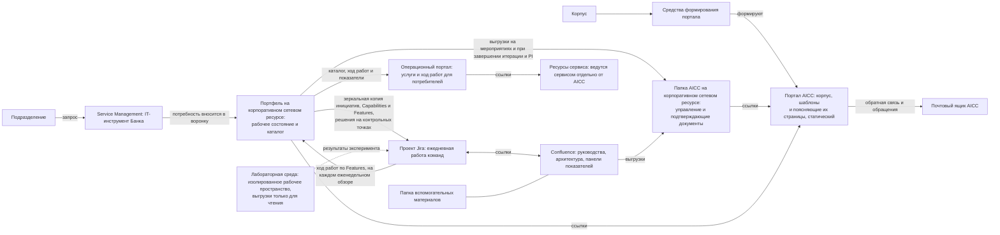

```yaml
source: charter/en/workflows/collaboration-tooling.md
source_sha256: 79c479bf41f4a290fb87d2a174f9c47cd8bbe01030cb1d210df422afd3042623
translation_status: reviewed
```

# Инструменты совместной работы

## 1. Назначение и область применения

Здесь перечислены инструменты и порталы, которые использует AICC, назначение каждого из них и workflows, в которых они применяются. Правила установлены корпусом, а работа ведётся в инструментах. Каждый инструмент настраивается под workflows корпуса; сам корпус настройку инструментов не устанавливает.

## 2. Инструменты и порталы

Связи между инструментами и порталами показаны на рисунке 1.



Рисунок 1 — Инструменты совместной работы

Инструменты и порталы приведены в следующей таблице.

| Инструмент или портал | Назначение | Пользователи | Workflows |
| --- | --- | --- | --- |
| Проект Jira | Среда выполнения ежедневной работы: задачи команд в их бэклогах и на их бордах, а также зеркальная копия инициатив, Capabilities (в виде Epics) и Features на канбане программы, которая заполняется из портфеля. Инициатива располагается уровнем выше Epic, Capability соответствует Epic, Feature — карточке Jira (issue), задача — подзадаче (sub-task). Jira принадлежат выполнение работ уровнем ниже Feature и ход работ по Feature между еженедельными обзорами, а все остальные поля принадлежат портфелю. Проект предназначен для управления бизнесом и проектами и не содержит ни кода, ни данных | AICC, партнёры и заинтересованные лица | Портфель и оказание услуг; Рабочий цикл; Взаимодействие с заказчиком |
| Service Management | IT-инструмент Банка для запросов, поддержки и заведения в систему. AICC подключается к нему, чтобы обращения любого вида — от новой потребности до поддержки — поступали через единую точку входа, и размещает в нём собственные услуги и команду поддержки | Весь Банк | Взаимодействие с заказчиком (обращение и поддержка); Портфель и оказание услуг (эксплуатация и поддержка); обработка инцидентов AI |
| Confluence | Совместная работа: технические руководства и порядок работы в Jira, архитектурный репозиторий решений и сервисов, панели хода работ по PI и итерации, бэклоги в виде ссылок на портфель и Jira. Это регулярно обновляемое содержание с минимальным регламентированием | AICC и заинтересованные лица | Портфель и оказание услуг; Рабочий цикл; Взаимодействие с заказчиком (проекты соглашения о взаимодействии и отчёта о результатах) |
| Папка вспомогательных материалов | Технические руководства, рабочие шаблоны и справочные материалы, которые не являются ни рабочими документами, ни правилами | AICC и партнёры | Портфель и оказание услуг |
| Портфель | Единственный достоверный источник рабочего состояния портфеля и программы — от Каталога сценариев для применения AI до разработки и внедрения: бэклог портфеля и канбан портфеля с паспортами инициатив, дорожная карта, бэклог программы и канбан программы с бордом программы, папка программного инкремента, зависимости, календарь, состав команд, панель показателей и папка каждой инициативы с её документами, а также каталог решений и пакетов. Портфелю принадлежат идентификатор, родительский элемент, место в ранжировании, класс обслуживания, описание, критерии приёмки и состояния на контрольных точках с их датами по каждому элементу. Репозиторий с защищённой основной веткой (п. 7.4 Операционной модели) | AICC; внутренний аудит — только для чтения | Портфель и оказание услуг; Рабочий цикл; Взаимодействие с заказчиком; Контроль работы подразделения |
| Папка AICC | Документы по управлению и подтверждающие документы: реестр назначений, журнал решений и протоколы решений, итоги управляющих совещаний, список приоритетов, реестр стандартов, реестр рисков и проблем, реестр AI-решений, матрица контроля, отчёты, снимки папки и неизменяемые датированные подтверждающие выгрузки. Репозиторий с защищённой основной веткой (п. 7.4 Операционной модели) | AICC; внутренний аудит — только для чтения | Контроль работы подразделения; Риски и контроль AI |
| Корпоративный сетевой ресурс | Место хранения папки AICC и портфеля, на документы которых ссылаются порталы | AICC; внутренний аудит — только для чтения | Контроль работы подразделения |
| Портал AICC | Корпус, шаблоны и поясняющие их страницы — курсы, маршруты обучения, база знаний, справочные материалы и каталог услуг — в виде статического портала. На портале приводятся определения показателей и ссылки на подтверждающие документы папки AICC и на документы портфеля на корпоративном сетевом ресурсе | Все работники, включая работников AICC, куратора AICC и внутренний аудит | Контроль работы подразделения; Риски и контроль AI; Взаимодействие с заказчиком |
| Средства формирования портала | Формируют портал AICC на основе корпуса. Ответственный за их ведение указывается в реестре назначений | AICC | Контроль работы подразделения |
| Почтовый ящик AICC | Обратная связь, обращения и внутренняя переписка | Все работники | Взаимодействие с заказчиком; Контроль работы подразделения |
| Операционный портал | База знаний, содержащая только информацию, не относящуюся к информации ограниченного доступа: портфель услуг и разработок, сценарии и предложения, чтобы Банк узнавал об AI. На портале отображаются ход работ и показатели панели показателей. Портал статический; он обновляется по мере появления нового содержания и поддерживается в актуальном состоянии | Внутренние потребители | Взаимодействие с заказчиком; Портфель и оказание услуг |
| Лабораторная среда | Изолированное рабочее пространство для проведения экспериментов с ролевым доступом и регистрацией событий, работающее на выгрузках данных только для чтения | AICC и эксперты направления, участвующие в эксперименте | Портфель и оказание услуг (эксперимент) |
| Ресурсы сервиса | Продуктовые ресурсы сервиса, которые ведёт сам сервис отдельно от AICC | Пользователи сервиса | Портфель и оказание услуг (эксплуатация) |

## 3. Документы, устанавливающие правила

Корпус имеет приоритет: Confluence, папка вспомогательных материалов и порталы не могут отменять его положения. Страницы, которые портал AICC добавляет для пояснения корпуса, ведутся в порядке, установленном п. 5.4 Каталога документов. Правила о содержании инструментов, об ответственных за инструменты и о подтверждающих материалах установлены пп. 7.2 и 7.6 Операционной модели: рабочее состояние портфеля и программы ведётся в портфеле, ежедневная работа — в Jira и Confluence, а в папке AICC хранятся подтверждающие материалы. Каждое поле имеет одного владельца: портфелю принадлежат идентификатор, родительский элемент, место в ранжировании, класс обслуживания, описание, критерии приёмки и состояния на контрольных точках с их датами, а Jira — выполнение работ уровнем ниже Feature и ход работ по Feature между еженедельными обзорами. Решение на контрольной точке фиксируется в портфеле и в качестве подтверждающего документа в папке AICC и только после этого отражается в Jira. Руководитель AICC переносит в портфель сведения о ходе работ по Features на каждом еженедельном обзоре, а на любой контрольной точке — незамедлительно; расхождение между Jira и портфелем исправляется и фиксируется на еженедельном обзоре (пп. 7.1, 7.6 Операционной модели). Бэклог портфеля и канбан портфеля, бэклог программы и канбан программы ведутся каждый в единственном экземпляре; направление услуг указывается в поле элемента, а не отдельным бэклогом (п. 9.4 Модели управления портфелем; п. 9.1 Модели жизненного цикла решений). Папка AICC и портфель размещаются на корпоративном сетевом ресурсе (п. 7.4 Операционной модели); порталы ссылаются на размещённые там документы и не встраивают их.

## 4. Переход

Переход — день, с которого задачи команд и зеркальная копия инициатив, Capabilities и Features ведутся в Jira и Confluence. Дату перехода устанавливает руководитель AICC и вносит её в журнал решений. Рабочее состояние портфеля и программы остаётся в портфеле, а подтверждающие документы хранятся в папке AICC в виде неизменяемых выгрузок с указанием даты (пп. 7.1, 7.2 Операционной модели).
