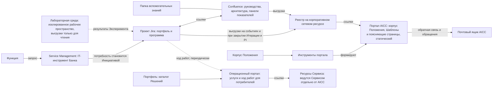

```yaml
source: charter/en/workflows/collaboration-tooling.md
source_sha256: 00748bb5976d09bc2aeded1645b75b582e5129260acee5366177498f7ff15afe
translation_status: reviewed
```

# Инструменты совместной работы

## 1. Назначение и область применения

Страница перечисляет инструменты и порталы AICC, их назначение и workflows, в которых они используются. Корпус Положения содержит правила, а инструменты — работу. Каждый инструмент адаптируется к workflows корпуса Положения; сам корпус не настраивает инструменты.

## 2. Инструменты и порталы

Рисунок 1 показывает их взаимосвязи.



Рисунок 1: инструменты совместной работы.

В следующей таблице приведён их перечень.

| Инструмент или портал | Назначение | Аудитория | workflows |
| --- | --- | --- | --- |
| Проект Jira | Учёт портфеля и программы: Инициативы, Функциональные возможности (как Epic) и Функциональности на Канбан-доске. Инициатива находится выше Epic, Функциональная возможность — Epic, Функциональность — задача, Рабочая задача — подзадача. Инструмент служит для бизнес- и проектного управления и не содержит кода или данных | AICC, партнёры и Заинтересованные лица | Поставка услуг; Ритм работы; Взаимодействие с заказчиком |
| Service Management | IT-инструмент Банка для запросов, поддержки и подключения. AICC присоединяется к нему, чтобы все обращения — от новой потребности до поддержки — поступали через единую точку входа; AICC размещает в нём собственные услуги и команду поддержки | Весь Банк | Взаимодействие с заказчиком (обращение и поддержка); Поставка услуг (эксплуатация и поддержка); обработка Инцидентов AI |
| Confluence | Совместная работа: технические руководства и порядок работы в Jira, хранилище архитектуры Решений и Сервисов, панели хода PI и Итерации, бэклоги со ссылками на Jira. Это актуализируемое содержание с минимальным регламентированием | AICC и Заинтересованные лица | Поставка услуг; Ритм работы; Взаимодействие с заказчиком (проекты Соглашения о взаимодействии и Отчёта о результатах) |
| Папка вспомогательных знаний | Технические руководства, рабочие шаблоны и материалы знаний, не являющиеся Записями или правилами | AICC и партнёры | Поставка услуг |
| Корпоративный сетевой ресурс | Место хранения Реестра и документов Портфеля, на которые ссылаются порталы | AICC; внутренний аудит — только чтение | Управление подразделением |
| Портал AICC | Корпус Положения, Шаблоны и поясняющие страницы: курсы, траектории обучения, база знаний, справочные материалы и каталог услуг в виде статического портала. Представляет определения Показателей и ссылки на Подтверждающие записи Реестра на корпоративном сетевом ресурсе | Все сотрудники, включая AICC, Куратора AICC и внутренний аудит | Управление подразделением; Риски и контроль AI; Взаимодействие с заказчиком |
| Инструменты портала | Формируют портал AICC из корпуса Положения. Ответственный за ведение указан в Записи о назначениях | AICC | Управление подразделением |
| Почтовый ящик AICC | Обратная связь, обращения и внутренняя переписка | Все сотрудники | Взаимодействие с заказчиком; Управление подразделением |
| Операционный портал | База знаний с неконфиденциальной информацией: портфель услуг, разработки, сценарии и предложения, позволяющие Банку узнавать об AI. Представляет ход работ и Показатели Панели показателей. Статический портал обновляется при появлении нового содержания и не должен оставаться устаревшим | Внутренние потребители | Взаимодействие с заказчиком; Поставка услуг |
| Лабораторная среда | Изолированное рабочее пространство Эксперимента с ролевым доступом и журналированием, использующее выгрузки данных только для чтения | AICC и Эксперты Домена, участвующие в Эксперименте | Поставка услуг (Эксперимент) |
| Ресурсы Сервиса | Продуктовые ресурсы Сервиса, которые ведутся Сервисом отдельно от AICC | Пользователи Сервиса | Поставка услуг (эксплуатация) |

## 3. Где установлены правила

Корпус Положения имеет приоритет; Confluence, вспомогательная папка и порталы никогда не отменяют его требований. Поясняющие страницы портала AICC ведутся по Каталогу документов 5.4. Правила о содержании инструментов, ответственном за каждый инструмент и подтверждающих материалах установлены Операционной моделью 7.2 и 7.6: инструменты содержат Рабочее состояние, Реестр — подтверждающие материалы. Реестр и Портфель размещаются на корпоративном сетевом ресурсе (Операционная модель 7.4); порталы ссылаются на документы там и не встраивают их в своё содержание.

## 4. Переход

Переход — день, когда Рабочее состояние Бэклога программы, досок и Рабочих задач переносится из Реестра в Jira и Confluence. Руководитель AICC устанавливает эту дату и вносит её в Журнал решений; Реестр сохраняет Подтверждающие записи в виде закрытых датированных выгрузок (Операционная модель 7.1).
