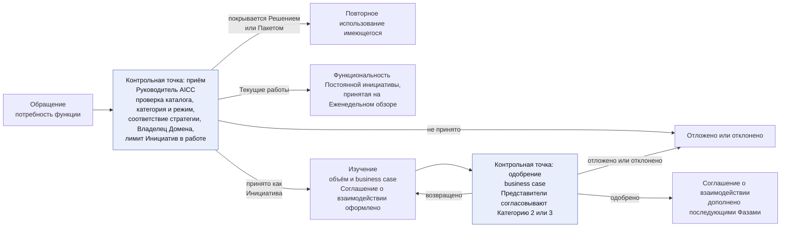
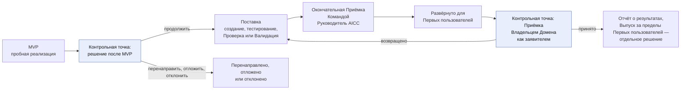
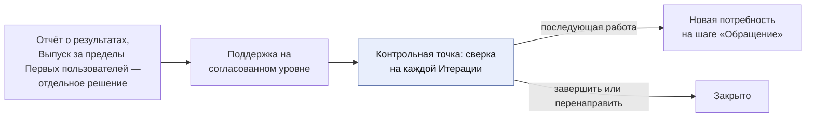

```yaml
source: charter/en/workflows/engagement.md
source_sha256: a1bc2432f1f35680741d717eeaaadc3f3833747f28ecd3ed1d21d78b5055bafd
translation_status: reviewed
```

# Workflow: Взаимодействие с заказчиком

## 1. Назначение и область применения

Это workflow верхнего уровня AICC: порядок взаимодействия AICC с остальной частью Банка. AICC действует как внутренний консалтинговый центр и лаборатория инноваций. Функция обращается с потребностью, AICC принимает обязательства по Взаимодействию с заказчиком в Соглашении о взаимодействии, предоставляет результат с подтверждающими материалами и поддерживает его на согласованном уровне. Процесс охватывает консалтинговое взаимодействие от первого обращения до последующей работы и располагается над остальными процессами: workflow «Поставка услуг» обеспечивает выполнение работы, а «Управление подразделением» — её контроль.

Правила содержатся в Бизнес-модели, Операционной модели, Модели управления портфелем, Модели жизненного цикла решений и Политике применения AI. Этот workflow показывает порядок и назначение действий и не устанавливает собственных правил.

## 2. Жизненный цикл Взаимодействия с заказчиком

Взаимодействие с заказчиком проходит шесть шагов. Каждый завершается решением или Записью; функция получает информацию на всём протяжении работы. При приёме определяются категория услуги и режим — Текущие работы либо Инициатива (Бизнес-модель 4.5 и 4.7), — а также проверяется, есть ли в каталоге Решение или Пакет, уже покрывающие потребность (Бизнес-модель 7.2).

Рисунки 1–3 показывают жизненный цикл и выходы из него. Соглашение о взаимодействии оформляется в начале изучения и дополняется после одобрения business case.



Рисунок 1: Взаимодействие с заказчиком от обращения до одобрения business case.



Рисунок 2: Взаимодействие с заказчиком от MVP до Приёмки.



Рисунок 3: Взаимодействие с заказчиком от Отчёта о результатах до закрытия.

Таблица описывает каждый шаг, соответствующий этап консалтинга и его место в других workflows.

| Шаг | Соответствующий этап консалтинга | Действие | Решение или Запись | В workflow «Поставка услуг» |
| --- | --- | --- | --- | --- |
| Обращение | Первичный контакт | Функция заявляет потребность либо AICC выявляет её при исследовании; Руководитель AICC фиксирует проблему, размер работ, ожидаемую Категорию риска, категорию услуги и режим и проверяет каталог на наличие подходящего Решения или Пакета | Потребность покрывается из каталога, принимается как Текущие работы или Инициатива, откладывается либо отклоняется; Соглашение о взаимодействии сверх лимита Инициатив в работе не оформляется (Бизнес-модель 7.1 и 7.2) | Воронка: «Предложено» |
| Изучение | Диагностика и предложение | AICC определяет объём потребности совместно с функцией и составляет business case | Паспорт инициативы; business case одобрен. Если присвоенная Категория риска выше согласованной, business case возвращается Представителям контрольных функций (Модель управления портфелем 6.4; см. [Риски и контроль AI](ai-risk-control.md)) | Рассмотрение (Определение объёма) и Анализ (business case, согласованное Представителями контрольных функций, если ожидается Категория риска 2 или 3) |
| Соглашение о взаимодействии | Принятие обязательств | AICC фиксирует обязательства: Фазы, уровень поддержки, результат. Соглашение оформляется в начале изучения и дополняется после одобрения business case | Соглашение о взаимодействии оформляет Руководитель AICC; функция получает уведомление | Рассмотрение (оформление в начале изучения), Бэклог портфеля (дополнение при одобрении) |
| Поставка | Выполнение консалтинговой работы | AICC проверяет первое Решение как пробную реализацию (MVP), а после решения продолжить создаёт и выпускает его совместно с функцией | Решение после MVP; Проверка или Валидация; окончательная Приёмка Командой; Приёмка Владельцем Домена; Выпуск | MVP, решение и Реализация; затем «На рассмотрении» |
| Отчёт о результатах | Завершающий результат поставки | AICC сообщает, что поставлено, со ссылками на подтверждающие материалы и указанием принявшего лица | Отчёт о результатах; Приёмка Владельцем Домена, а для Обеспечивающих работ — Куратором AICC | Готово: «Принято», «Закрыто» |
| Поддержка | Управляемое обслуживание | AICC поддерживает Решение на уровне, установленном Соглашением; при сверке на каждой Итерации Взаимодействие с заказчиком продолжается, завершается или перенаправляется; последующая работа возвращается на шаг «Обращение» как новая потребность | Записи о поддержке; Инциденты AI в системе управления инцидентами Банка; новая запись либо закрытие | Эксплуатация, Поддержка |

Текущие работы (Бизнес-модель 4.8) проходят те же шаги в сокращённом виде. На шаге «Обращение» Руководитель AICC принимает запрос на Еженедельном обзоре после одобрения Владельцем Домена применения для соответствующего Класса данных. Изучение ограничивается определением объёма работ длительностью в несколько дней, без business case. Отдельного Соглашения о взаимодействии нет: работу покрывает Постоянная инициатива направления услуг (Бизнес-модель 4.9). Поставка — Функциональность Постоянной инициативы, выполняемая за одну Итерацию, тестируемая, проходящая Проверку или Валидацию и принимаемая в обычном порядке. Отдельного Отчёта о результатах нет; работа фиксируется в Функциональности. Поддержка предоставляется по запросу. Запрос, невыполнимый за одну Итерацию, возвращается на шаг «Обращение» и принимается как Инициатива.

## 3. Соглашение о взаимодействии на протяжении работы

Соглашение о взаимодействии фиксирует обязательства. Это рабочая договорённость, а не юридический документ; оно оформляется и изменяется по Бизнес-модели 5. Его выполнение сверяется на каждой Итерации; при изменении направления работ или невыполнении Зависимости каждое изменение фиксируется в таблице изменений. Отчёт о результатах завершает Соглашение.

Функция не принимает на себя обязательств (Бизнес-модель 5.4). Условия со стороны функции, на которые опирается AICC, записываются как Допущения; невыполнение Допущения приводит к перепланированию объёма и сроков.

## 4. Уровни поддержки

Участие AICC после поставки определяется для каждого Взаимодействия с заказчиком. Из него обычно следует тип Решения.

| Уровень поддержки | Действия AICC | Типичный тип Решения |
| --- | --- | --- |
| Отсутствует | Передаёт Решение вместе с Отчётом о результатах | Эксперимент либо переданный Продукт |
| По запросу | Отвечает на запросы и выпускает новые версии по обращению | Продукт |
| С согласованными целевыми сроками реагирования | Поддерживает в соответствии с целевыми сроками, установленными Соглашением | Сервис |
| Эксплуатация силами AICC | Эксплуатирует Решение в течение всего жизненного цикла с учётом Эксплуатационных затрат и Правила вывода из эксплуатации | Сервис |

## 5. Ценность, поток и знания

В каждом Взаимодействии с заказчиком фиксируются эффект, заявляемый и подтверждаемый функцией, а также полное время выполнения и время цикла работ (Модель жизненного цикла решений 10). Квартальный отчёт показывает их по каждому Взаимодействию с заказчиком. Числовые показатели Банка остаются в системах Банка; Записи ссылаются на них. AICC не взимает плату с функций; Домен оплачивает эксплуатацию, лицензии и расходы на Поставщиков из своего Инвестиционного бюджета (Положение об AICC 4.1). Каждое Взаимодействие с заказчиком также оставляет уроки в Портфеле и, если он получен, Пакет, зафиксированный в Описании пакета. Благодаря этому следующая работа начинается с достигнутого уровня, а следующая потребность может быть покрыта из каталога (Бизнес-модель 4.4). Предложения AICC на основе подтверждённых результатов служат вкладом в стратегию внедрения AI Банка, решения по которой принимает Банк.

## 6. Где выполняется процесс

Со дня Перехода Рабочего состояния (Операционная модель 7.1) Взаимодействие с заказчиком ведётся в Jira и Confluence, как показано в workflow [«Поставка услуг»](service-delivery.md): Инициатива, её Функциональные возможности и Функциональности — в Jira; проекты Соглашения о взаимодействии и Отчёта о результатах — в Confluence; запросы и поддержка принимаются через Service Management. До этого Рабочее состояние ведётся в Реестре; в нём также хранятся оформленное Соглашение о взаимодействии, принятый Отчёт о результатах и комплект материалов Инициативы.
