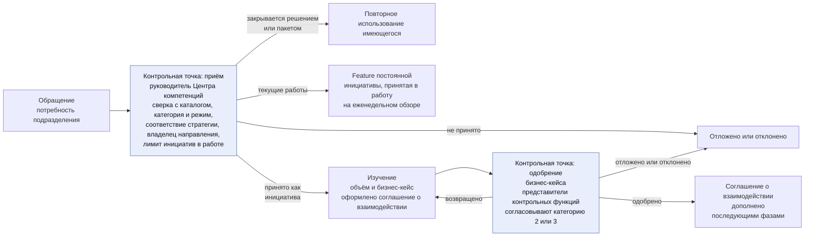
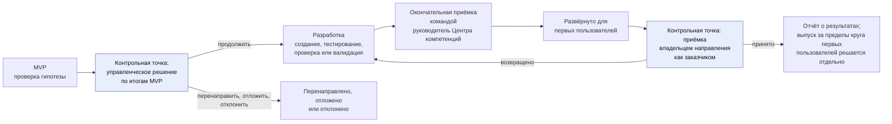
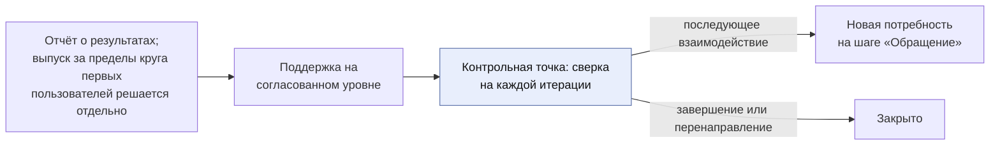

```yaml
source: charter/en/workflows/engagement.md
source_sha256: cc516f36b032f89c1fb520c0cc541569a37c25b3b76d1f9c3dba660706dd7c84
translation_status: reviewed
```

# Workflow «Взаимодействие с заказчиком»

## 1. Назначение и область применения

Настоящий workflow — workflow верхнего уровня Центра компетенций: он описывает совместную работу Центра компетенций и остальных подразделений Банка. Центр компетенций работает как внутреннее консалтинговое подразделение и лаборатория инноваций. Подразделение обращается с потребностью; Центр компетенций принимает обязательства по взаимодействию с заказчиком в соглашении о взаимодействии, передаёт результат вместе с подтверждающими материалами и поддерживает его на согласованном уровне. Workflow прослеживает консалтинговое взаимодействие от первого обращения до последующего взаимодействия и стоит над остальными workflows: работа выполняется в workflow «Портфель и оказание услуг», а её контроль обеспечивает workflow «Контроль работы подразделения».

Правила установлены Бизнес-моделью, Операционной моделью, Моделью управления портфелем, Моделью жизненного цикла решений и Политикой применения AI. Настоящий workflow показывает последовательность и назначение действий и собственных правил не устанавливает.

## 2. Жизненный цикл взаимодействия с заказчиком

Взаимодействие с заказчиком проходит шесть шагов. Каждый шаг завершается управленческим решением или рабочим документом; подразделение-заказчик на протяжении всей работы получает информацию о её ходе. При приёме обращения для потребности определяются категория услуг и режим — текущие работы или инициатива (пп. 4.5 и 4.7 Бизнес-модели), а по каталогу устанавливается, нет ли решения или пакета, которые уже отвечают на эту потребность (п. 7.2 Бизнес-модели).

Жизненный цикл и выходы из него показаны на рисунках 1–3. Соглашение о взаимодействии оформляется в начале изучения и изменяется при одобрении бизнес-кейса.



Рисунок 1 — Взаимодействие с заказчиком от обращения до одобрения бизнес-кейса



Рисунок 2 — Взаимодействие с заказчиком от MVP до приёмки



Рисунок 3 — Взаимодействие с заказчиком от отчёта о результатах до закрытия

Шаги взаимодействия, соответствующие им этапы консалтингового проекта и место каждого шага в других workflows приведены в следующей таблице.

| Шаг | Этап консалтингового проекта | Содержание шага | Управленческое решение или рабочий документ | Отражение в workflow «Портфель и оказание услуг» |
| --- | --- | --- | --- | --- |
| Обращение | Первичный контакт | Подразделение сообщает о потребности, или Центр компетенций выявляет её в ходе собственных исследований; руководитель Центра компетенций фиксирует проблему, её масштаб, ожидаемую категорию риска, категорию услуг и режим и устанавливает по каталогу, нет ли решения или пакета, которые на неё отвечают | Потребность закрывается из каталога, принимается в работу как текущие работы или как инициатива, откладывается или отклоняется; сверх лимита инициатив в работе соглашение о взаимодействии не оформляется (пп. 7.1 и 7.2 Бизнес-модели) | Воронка: «Предложено» |
| Изучение | Диагностика и предложение | Центр компетенций совместно с подразделением определяет объём потребности и готовит бизнес-кейс | Паспорт инициативы; бизнес-кейс одобрен. Если присвоенная категория риска выше той, которую согласовали представители контрольных функций, бизнес-кейс возвращается им (п. 6.4 Модели управления портфелем; см. workflow [«Риски и контроль AI»](ai-risk-control.md)) | Рассмотрение (стадия «Определение объёма») и анализ (стадия «Бизнес-кейс»; если ожидается категория риска 2 или 3, бизнес-кейс согласуют представители контрольных функций) |
| Соглашение о взаимодействии | Принятие обязательств | Центр компетенций фиксирует свои обязательства: фазы, уровень поддержки, результат. Соглашение оформляется в начале изучения и изменяется при одобрении бизнес-кейса | Соглашение о взаимодействии, оформленное руководителем Центра компетенций; подразделение получает уведомление | Рассмотрение (оформление в начале изучения), бэклог портфеля (изменение при одобрении) |
| Разработка | Выполнение консалтингового проекта | Центр компетенций проверяет гипотезу на первом решении в форме MVP, а после управленческого решения о продолжении создаёт решение и выпускает его совместно с подразделением | Управленческое решение по итогам MVP; проверка или валидация; окончательная приёмка командой; приёмка владельцем направления; выпуск | MVP, управленческое решение по его итогам и реализация; затем «На рассмотрении» |
| Отчёт о результатах | Итоговый результат проекта | Центр компетенций сообщает, что передано заказчику, со ссылками на подтверждающие материалы, и кто принял результат | Отчёт о результатах; приёмка владельцем направления, а для обеспечивающих работ — куратором Центра компетенций | Готово: «Принято», «Закрыто» |
| Поддержка | Сопровождение на условиях управляемой услуги | Центр компетенций поддерживает решение на уровне, установленном соглашением; при сверке на каждой итерации взаимодействие с заказчиком продолжается, завершается или перенаправляется, а последующая потребность возвращается на шаг «Обращение» как новая | Записи о поддержке; инциденты AI в системе управления инцидентами Банка; новое обращение или закрытие | Эксплуатация, поддержка |

Текущие работы (п. 4.8 Бизнес-модели) проходят те же шаги в сокращённом виде. На шаге «Обращение» руководитель Центра компетенций принимает такую работу на еженедельном обзоре после того, как владелец направления одобрил применение для соответствующего класса данных. Изучение сводится к определению объёма за несколько дней, без бизнес-кейса. Отдельное соглашение о взаимодействии не оформляется: работа выполняется в рамках постоянной инициативы направления услуг (п. 4.9 Бизнес-модели). Разработка — это Feature постоянной инициативы, которая выполняется в пределах одной итерации, тестируется, проходит проверку или валидацию и принимается так же, как любая Feature. Отдельный отчёт о результатах не составляется: работа фиксируется в Feature. Поддержка оказывается по запросу. Запрос, который нельзя выполнить за одну итерацию, возвращается на шаг «Обращение» и принимается как инициатива.

## 3. Соглашение о взаимодействии в ходе работы

Соглашение о взаимодействии фиксирует обязательство Центра компетенций. Это рабочая договорённость, а не юридический документ; соглашение оформляется и изменяется в соответствии с разделом 5 Бизнес-модели. Его исполнение сверяется на каждой итерации; если направление работ меняется или зависимость не выполняется, изменение отражается в таблице изменений соглашения. Действие соглашения завершается отчётом о результатах.

Подразделение обязательств не принимает (п. 5.4 Бизнес-модели). То, на что Центр компетенций рассчитывает со стороны подразделения, записывается как допущение; если допущение не подтверждается, объём работ и сроки перепланируются.

## 4. Уровни поддержки

Поддержка, которую Центр компетенций оказывает после передачи результата, выбирается для каждого взаимодействия с заказчиком; от неё, как правило, зависит тип решения. Уровни поддержки приведены в следующей таблице.

| Уровень поддержки | Действия Центра компетенций | Типичный тип решения |
| --- | --- | --- |
| Не предоставляется | Передаёт решение вместе с отчётом о результатах | Эксперимент или переданный продукт |
| По запросу | Отвечает на запросы и выпускает новые версии по обращению | Продукт |
| С согласованными целевыми сроками реагирования | Оказывает поддержку в пределах целевых сроков, установленных соглашением | Сервис |
| Эксплуатация силами Центра компетенций | Эксплуатирует решение на протяжении всего его жизненного цикла с учётом эксплуатационных затрат и правила вывода из эксплуатации | Сервис |

## 5. Ценность, поток и знания

По каждому взаимодействию с заказчиком фиксируются выгода, которую заявляет и подтверждает подразделение, а также время выполнения и время цикла работ (раздел 10 Модели жизненного цикла решений). Эти сведения приводятся в квартальном отчёте по каждому взаимодействию. Числовые данные Банка остаются в его системах, а рабочие документы содержат ссылки на них. Центр компетенций не взимает плату с подразделений: расходы на эксплуатацию, лицензии и услуги поставщиков направление несёт за счёт своего инвестиционного бюджета (п. 4.1 Положения о Центре компетенций по AI). Кроме того, каждое взаимодействие с заказчиком оставляет в портфеле извлечённые уроки, а если по его итогам создан пакет — и сам пакет, оформленный описанием пакета. Благодаря этому следующее взаимодействие начинается с более высокого уровня, а следующая потребность может быть закрыта из каталога (п. 4.4 Бизнес-модели). Предложения, которые Центр компетенций готовит на основе подтверждённых результатов, учитываются при формировании стратегии внедрения AI в Банке; эту стратегию определяет Банк.

## 6. Системы, в которых ведётся процесс

Рабочее состояние взаимодействия с заказчиком ведётся в портфеле вместе с инициативой и её документами (п. 7.1 Операционной модели). Со дня перехода взаимодействие с заказчиком ведётся в Jira и Confluence, как показано в workflow [«Портфель и оказание услуг»](service-delivery.md): задачи команд и зеркальная копия инициативы, её Capabilities и Features — в Jira; проекты соглашения о взаимодействии и отчёта о результатах готовятся в Confluence; запросы и обращения за поддержкой принимаются в системе Service Management. В папке Центра компетенций в качестве подтверждающих документов хранятся оформленное соглашение о взаимодействии и принятый отчёт о результатах.
